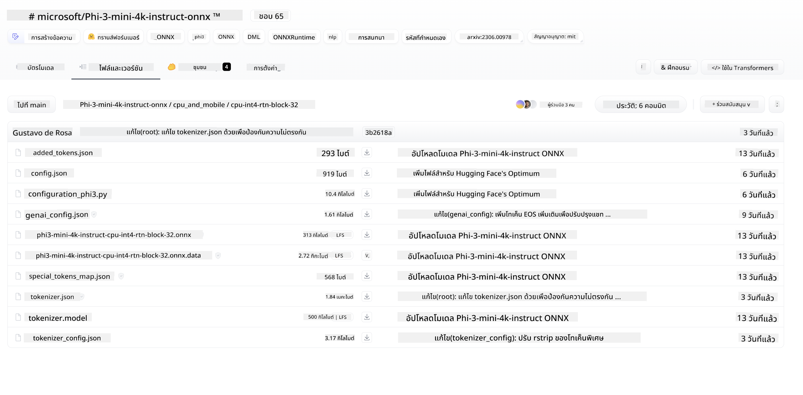
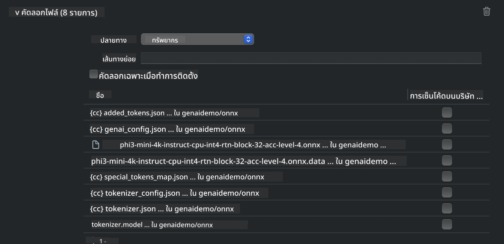
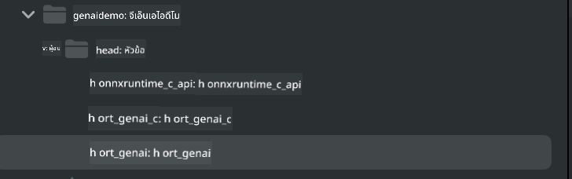
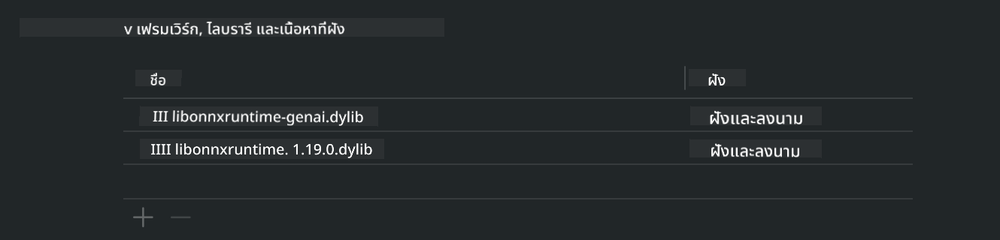
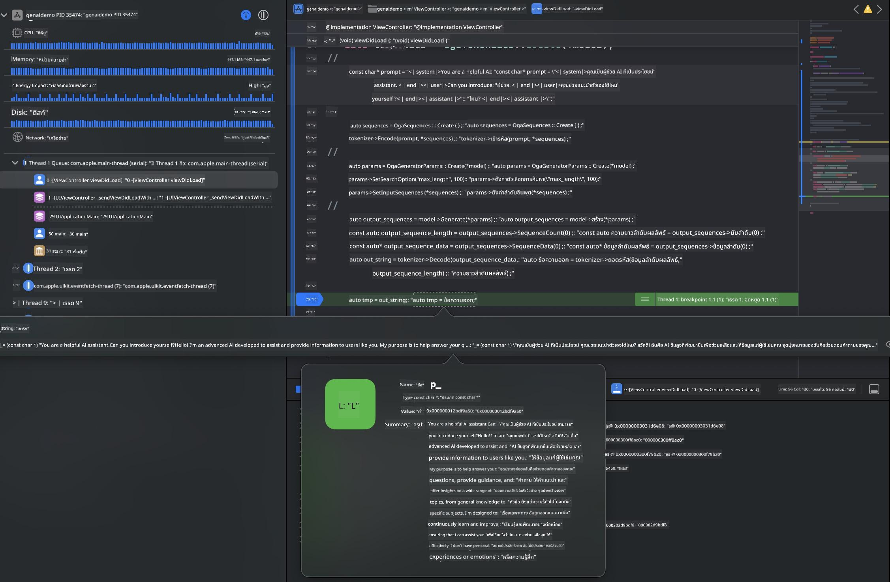

<!--
CO_OP_TRANSLATOR_METADATA:
{
  "original_hash": "82af197df38d25346a98f1f0e84d1698",
  "translation_date": "2025-05-09T10:58:50+00:00",
  "source_file": "md/01.Introduction/03/iOS_Inference.md",
  "language_code": "th"
}
-->
# **Inference Phi-3 บน iOS**

Phi-3-mini เป็นซีรีส์โมเดลใหม่จาก Microsoft ที่ช่วยให้สามารถนำ Large Language Models (LLMs) ไปใช้งานบนอุปกรณ์ edge และอุปกรณ์ IoT ได้ Phi-3-mini รองรับการใช้งานบน iOS, Android และอุปกรณ์ Edge ช่วยให้ generative AI สามารถนำไปใช้ในสภาพแวดล้อม BYOD ได้ ตัวอย่างต่อไปนี้แสดงวิธีการติดตั้ง Phi-3-mini บน iOS

## **1. การเตรียมตัว**

- **a.** macOS 14+
- **b.** Xcode 15+
- **c.** iOS SDK 17.x (iPhone 14 A16 หรือสูงกว่า)
- **d.** ติดตั้ง Python 3.10+ (แนะนำให้ใช้ Conda)
- **e.** ติดตั้งไลบรารี Python: `python-flatbuffers`
- **f.** ติดตั้ง CMake

### Semantic Kernel และ Inference

Semantic Kernel เป็นเฟรมเวิร์กสำหรับแอปพลิเคชันที่ช่วยให้คุณสร้างแอปที่รองรับ Azure OpenAI Service, โมเดล OpenAI และแม้แต่โมเดลภายในเครื่อง การเข้าถึงบริการภายในผ่าน Semantic Kernel ทำให้ง่ายต่อการผสานรวมกับเซิร์ฟเวอร์โมเดล Phi-3-mini ที่โฮสต์เอง

### การเรียกใช้งานโมเดลที่ถูก quantized ด้วย Ollama หรือ LlamaEdge

ผู้ใช้หลายคนชอบใช้โมเดลที่ถูก quantized เพื่อรันโมเดลในเครื่อง [Ollama](https://ollama.com) และ [LlamaEdge](https://llamaedge.com) ช่วยให้ผู้ใช้เรียกใช้งานโมเดล quantized ต่างๆ ได้

#### **Ollama**

คุณสามารถรัน `ollama run phi3` โดยตรงหรือกำหนดค่าแบบออฟไลน์ สร้าง Modelfile ที่ระบุเส้นทางไปยังไฟล์ `gguf` ตัวอย่างโค้ดสำหรับรันโมเดล Phi-3-mini ที่ถูก quantized:

```gguf
FROM {Add your gguf file path}
TEMPLATE \"\"\"<|user|> .Prompt<|end|> <|assistant|>\"\"\"
PARAMETER stop <|end|>
PARAMETER num_ctx 4096
```

#### **LlamaEdge**

ถ้าคุณต้องการใช้ `gguf` ทั้งในคลาวด์และอุปกรณ์ edge พร้อมกัน LlamaEdge เป็นตัวเลือกที่ดี

## **2. การคอมไพล์ ONNX Runtime สำหรับ iOS**

```bash

git clone https://github.com/microsoft/onnxruntime.git

cd onnxruntime

./build.sh --build_shared_lib --ios --skip_tests --parallel --build_dir ./build_ios --ios --apple_sysroot iphoneos --osx_arch arm64 --apple_deploy_target 17.5 --cmake_generator Xcode --config Release

cd ../

```

### **ประกาศ**

- **a.** ก่อนคอมไพล์ ตรวจสอบให้แน่ใจว่า Xcode ถูกตั้งค่าอย่างถูกต้องและตั้งเป็นไดเรกทอรีนักพัฒนาที่ใช้งานในเทอร์มินัลแล้ว:

    ```bash
    sudo xcode-select -switch /Applications/Xcode.app/Contents/Developer
    ```

- **b.** ONNX Runtime จำเป็นต้องคอมไพล์สำหรับแพลตฟอร์มต่างๆ สำหรับ iOS คุณสามารถคอมไพล์สำหรับ `arm64` or `x86_64`

- **c.** แนะนำให้ใช้ iOS SDK เวอร์ชันล่าสุดสำหรับการคอมไพล์ แต่ถ้าต้องการความเข้ากันได้กับ SDK เวอร์ชันเก่า ก็สามารถใช้เวอร์ชันเก่าได้เช่นกัน

## **3. การคอมไพล์ Generative AI ด้วย ONNX Runtime สำหรับ iOS**

> **Note:** เนื่องจาก Generative AI กับ ONNX Runtime ยังอยู่ในช่วงพรีวิว โปรดทราบว่าอาจมีการเปลี่ยนแปลงเกิดขึ้นได้

```bash

git clone https://github.com/microsoft/onnxruntime-genai
 
cd onnxruntime-genai
 
mkdir ort
 
cd ort
 
mkdir include
 
mkdir lib
 
cd ../
 
cp ../onnxruntime/include/onnxruntime/core/session/onnxruntime_c_api.h ort/include
 
cp ../onnxruntime/build_ios/Release/Release-iphoneos/libonnxruntime*.dylib* ort/lib
 
export OPENCV_SKIP_XCODEBUILD_FORCE_TRYCOMPILE_DEBUG=1
 
python3 build.py --parallel --build_dir ./build_ios --ios --ios_sysroot iphoneos --ios_arch arm64 --ios_deployment_target 17.5 --cmake_generator Xcode --cmake_extra_defines CMAKE_XCODE_ATTRIBUTE_CODE_SIGNING_ALLOWED=NO

```

## **4. สร้างแอปพลิเคชันใน Xcode**

ผมเลือกใช้ Objective-C เป็นวิธีพัฒนาแอป เนื่องจากการใช้ Generative AI กับ ONNX Runtime C++ API นั้น Objective-C จะเข้ากันได้ดีกว่า แน่นอนว่าคุณก็สามารถทำการเรียกใช้งานผ่าน Swift bridging ได้เช่นกัน


## **5. คัดลอกโมเดล ONNX quantized INT4 ไปยังโปรเจกต์แอป**

เราจำเป็นต้องนำเข้าโมเดล quantization แบบ INT4 ในรูปแบบ ONNX ซึ่งต้องดาวน์โหลดมาก่อน



หลังดาวน์โหลดแล้ว ต้องเพิ่มโมเดลนี้เข้าไปในไดเรกทอรี Resources ของโปรเจกต์ใน Xcode



## **6. เพิ่ม C++ API ใน ViewControllers**

> **ประกาศ:**

- **a.** เพิ่มไฟล์ header ของ C++ ที่เกี่ยวข้องลงในโปรเจกต์

  

- **b.** รวมไฟล์ `onnxruntime-genai` dynamic library in Xcode.

  

- **c.** Use the C Samples code for testing. You can also add additional features like ChatUI for more functionality.

- **d.** Since you need to use C++ in your project, rename `ViewController.m` to `ViewController.mm` เพื่อเปิดใช้งาน Objective-C++

```objc

    NSString *llmPath = [[NSBundle mainBundle] resourcePath];
    char const *modelPath = llmPath.cString;

    auto model =  OgaModel::Create(modelPath);

    auto tokenizer = OgaTokenizer::Create(*model);

    const char* prompt = "<|system|>You are a helpful AI assistant.<|end|><|user|>Can you introduce yourself?<|end|><|assistant|>";

    auto sequences = OgaSequences::Create();
    tokenizer->Encode(prompt, *sequences);

    auto params = OgaGeneratorParams::Create(*model);
    params->SetSearchOption("max_length", 100);
    params->SetInputSequences(*sequences);

    auto output_sequences = model->Generate(*params);
    const auto output_sequence_length = output_sequences->SequenceCount(0);
    const auto* output_sequence_data = output_sequences->SequenceData(0);
    auto out_string = tokenizer->Decode(output_sequence_data, output_sequence_length);
    
    auto tmp = out_string;

```

## **7. การรันแอปพลิเคชัน**

เมื่อการตั้งค่าทุกอย่างเสร็จสิ้น คุณก็สามารถรันแอปเพื่อดูผลลัพธ์ของการ inference โมเดล Phi-3-mini ได้



สำหรับโค้ดตัวอย่างเพิ่มเติมและคำแนะนำอย่างละเอียด โปรดเยี่ยมชม [Phi-3 Mini Samples repository](https://github.com/Azure-Samples/Phi-3MiniSamples/tree/main/ios)

**ข้อจำกัดความรับผิดชอบ**:  
เอกสารนี้ได้รับการแปลโดยใช้บริการแปลภาษาอัตโนมัติ [Co-op Translator](https://github.com/Azure/co-op-translator) แม้ว่าเราจะพยายามให้ความถูกต้องสูงสุด แต่โปรดทราบว่าการแปลอัตโนมัติอาจมีข้อผิดพลาดหรือความคลาดเคลื่อน เอกสารต้นฉบับในภาษาต้นทางควรถือเป็นแหล่งข้อมูลที่เชื่อถือได้ สำหรับข้อมูลที่สำคัญ แนะนำให้ใช้บริการแปลโดยผู้เชี่ยวชาญมนุษย์ เราจะไม่รับผิดชอบต่อความเข้าใจผิดหรือการตีความผิดใด ๆ ที่เกิดจากการใช้การแปลนี้