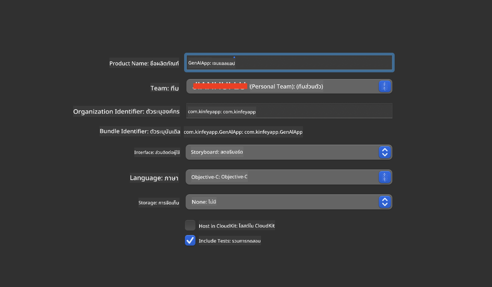

<!--
CO_OP_TRANSLATOR_METADATA:
{
  "original_hash": "82af197df38d25346a98f1f0e84d1698",
  "translation_date": "2025-07-16T20:21:46+00:00",
  "source_file": "md/01.Introduction/03/iOS_Inference.md",
  "language_code": "th"
}
-->
# **การใช้งาน Inference Phi-3 บน iOS**

Phi-3-mini เป็นซีรีส์โมเดลใหม่จาก Microsoft ที่ช่วยให้สามารถนำ Large Language Models (LLMs) ไปใช้งานบนอุปกรณ์ edge และอุปกรณ์ IoT ได้ Phi-3-mini รองรับการใช้งานบน iOS, Android และอุปกรณ์ Edge ช่วยให้สามารถนำ generative AI ไปใช้งานในสภาพแวดล้อม BYOD ได้ ตัวอย่างต่อไปนี้แสดงวิธีการใช้งาน Phi-3-mini บน iOS

## **1. การเตรียมตัว**

- **a.** macOS 14 ขึ้นไป  
- **b.** Xcode 15 ขึ้นไป  
- **c.** iOS SDK 17.x (iPhone 14 A16 หรือสูงกว่า)  
- **d.** ติดตั้ง Python 3.10 ขึ้นไป (แนะนำให้ใช้ Conda)  
- **e.** ติดตั้งไลบรารี Python: `python-flatbuffers`  
- **f.** ติดตั้ง CMake  

### Semantic Kernel และการ Inference

Semantic Kernel เป็นเฟรมเวิร์กสำหรับสร้างแอปพลิเคชันที่รองรับ Azure OpenAI Service, โมเดล OpenAI และแม้แต่โมเดลที่รันในเครื่อง การเข้าถึงบริการในเครื่องผ่าน Semantic Kernel ช่วยให้การเชื่อมต่อกับเซิร์ฟเวอร์โมเดล Phi-3-mini ที่โฮสต์เองเป็นเรื่องง่าย

### การเรียกใช้งานโมเดล Quantized ด้วย Ollama หรือ LlamaEdge

ผู้ใช้หลายคนชอบใช้โมเดล quantized เพื่อรันโมเดลในเครื่อง [Ollama](https://ollama.com) และ [LlamaEdge](https://llamaedge.com) ช่วยให้เรียกใช้งานโมเดล quantized ต่างๆ ได้:

#### **Ollama**

คุณสามารถรันคำสั่ง `ollama run phi3` ได้โดยตรง หรือจะตั้งค่าแบบออฟไลน์ก็ได้ สร้าง Modelfile ที่ระบุเส้นทางไปยังไฟล์ `gguf` ตัวอย่างโค้ดสำหรับรันโมเดล Phi-3-mini แบบ quantized:

```gguf
FROM {Add your gguf file path}
TEMPLATE \"\"\"<|user|> .Prompt<|end|> <|assistant|>\"\"\"
PARAMETER stop <|end|>
PARAMETER num_ctx 4096
```

#### **LlamaEdge**

ถ้าต้องการใช้ `gguf` ทั้งบนคลาวด์และอุปกรณ์ edge พร้อมกัน LlamaEdge เป็นตัวเลือกที่ดี

## **2. การคอมไพล์ ONNX Runtime สำหรับ iOS**

```bash

git clone https://github.com/microsoft/onnxruntime.git

cd onnxruntime

./build.sh --build_shared_lib --ios --skip_tests --parallel --build_dir ./build_ios --ios --apple_sysroot iphoneos --osx_arch arm64 --apple_deploy_target 17.5 --cmake_generator Xcode --config Release

cd ../

```

### **ประกาศ**

- **a.** ก่อนคอมไพล์ ให้ตรวจสอบว่า Xcode ถูกตั้งค่าอย่างถูกต้อง และตั้งเป็น active developer directory ในเทอร์มินัล:

    ```bash
    sudo xcode-select -switch /Applications/Xcode.app/Contents/Developer
    ```

- **b.** ONNX Runtime ต้องคอมไพล์สำหรับแพลตฟอร์มต่างๆ สำหรับ iOS สามารถคอมไพล์ได้ทั้ง `arm64` หรือ `x86_64`

- **c.** แนะนำให้ใช้ iOS SDK เวอร์ชันล่าสุดสำหรับการคอมไพล์ แต่ถ้าต้องการความเข้ากันได้กับ SDK เวอร์ชันเก่าก็สามารถใช้ได้เช่นกัน

## **3. การคอมไพล์ Generative AI ด้วย ONNX Runtime สำหรับ iOS**

> **Note:** เนื่องจาก Generative AI กับ ONNX Runtime ยังอยู่ในช่วงพรีวิว โปรดระวังการเปลี่ยนแปลงที่อาจเกิดขึ้น

```bash

git clone https://github.com/microsoft/onnxruntime-genai
 
cd onnxruntime-genai
 
mkdir ort
 
cd ort
 
mkdir include
 
mkdir lib
 
cd ../
 
cp ../onnxruntime/include/onnxruntime/core/session/onnxruntime_c_api.h ort/include
 
cp ../onnxruntime/build_ios/Release/Release-iphoneos/libonnxruntime*.dylib* ort/lib
 
export OPENCV_SKIP_XCODEBUILD_FORCE_TRYCOMPILE_DEBUG=1
 
python3 build.py --parallel --build_dir ./build_ios --ios --ios_sysroot iphoneos --ios_arch arm64 --ios_deployment_target 17.5 --cmake_generator Xcode --cmake_extra_defines CMAKE_XCODE_ATTRIBUTE_CODE_SIGNING_ALLOWED=NO

```

## **4. สร้างแอปพลิเคชันใน Xcode**

ผมเลือกใช้ Objective-C เป็นวิธีพัฒนาแอป เพราะการใช้งาน Generative AI กับ ONNX Runtime C++ API นั้น Objective-C เข้ากันได้ดีกว่า แน่นอนว่าคุณก็สามารถเรียกใช้งานผ่าน Swift bridging ได้เช่นกัน



## **5. คัดลอกโมเดล ONNX quantized INT4 ไปยังโปรเจกต์แอป**

เราต้องนำเข้าโมเดล quantized INT4 ในรูปแบบ ONNX ซึ่งต้องดาวน์โหลดมาก่อน


หลังดาวน์โหลดแล้ว ให้เพิ่มไฟล์นี้เข้าไปในโฟลเดอร์ Resources ของโปรเจกต์ใน Xcode


## **6. เพิ่ม C++ API ใน ViewControllers**

> **ประกาศ:**

- **a.** เพิ่มไฟล์ header ของ C++ ที่เกี่ยวข้องเข้าไปในโปรเจกต์

  

- **b.** รวมไลบรารีไดนามิก `onnxruntime-genai` ใน Xcode

  

- **c.** ใช้โค้ดตัวอย่าง C สำหรับทดสอบ คุณยังสามารถเพิ่มฟีเจอร์เสริม เช่น ChatUI เพื่อเพิ่มความสามารถได้

- **d.** เนื่องจากต้องใช้ C++ ในโปรเจกต์ ให้เปลี่ยนชื่อไฟล์ `ViewController.m` เป็น `ViewController.mm` เพื่อเปิดใช้งาน Objective-C++

```objc

    NSString *llmPath = [[NSBundle mainBundle] resourcePath];
    char const *modelPath = llmPath.cString;

    auto model =  OgaModel::Create(modelPath);

    auto tokenizer = OgaTokenizer::Create(*model);

    const char* prompt = "<|system|>You are a helpful AI assistant.<|end|><|user|>Can you introduce yourself?<|end|><|assistant|>";

    auto sequences = OgaSequences::Create();
    tokenizer->Encode(prompt, *sequences);

    auto params = OgaGeneratorParams::Create(*model);
    params->SetSearchOption("max_length", 100);
    params->SetInputSequences(*sequences);

    auto output_sequences = model->Generate(*params);
    const auto output_sequence_length = output_sequences->SequenceCount(0);
    const auto* output_sequence_data = output_sequences->SequenceData(0);
    auto out_string = tokenizer->Decode(output_sequence_data, output_sequence_length);
    
    auto tmp = out_string;

```

## **7. การรันแอปพลิเคชัน**

เมื่อเตรียมทุกอย่างเรียบร้อยแล้ว คุณสามารถรันแอปเพื่อดูผลลัพธ์ของการ inference โมเดล Phi-3-mini ได้


สำหรับโค้ดตัวอย่างเพิ่มเติมและคำแนะนำละเอียด โปรดเยี่ยมชม [Phi-3 Mini Samples repository](https://github.com/Azure-Samples/Phi-3MiniSamples/tree/main/ios)

**ข้อจำกัดความรับผิดชอบ**:  
เอกสารนี้ได้รับการแปลโดยใช้บริการแปลภาษาอัตโนมัติ [Co-op Translator](https://github.com/Azure/co-op-translator) แม้เราจะพยายามให้ความถูกต้องสูงสุด แต่โปรดทราบว่าการแปลอัตโนมัติอาจมีข้อผิดพลาดหรือความไม่ถูกต้อง เอกสารต้นฉบับในภาษาต้นทางถือเป็นแหล่งข้อมูลที่เชื่อถือได้ สำหรับข้อมูลที่สำคัญ ขอแนะนำให้ใช้บริการแปลโดยผู้เชี่ยวชาญมนุษย์ เราไม่รับผิดชอบต่อความเข้าใจผิดหรือการตีความผิดใด ๆ ที่เกิดจากการใช้การแปลนี้