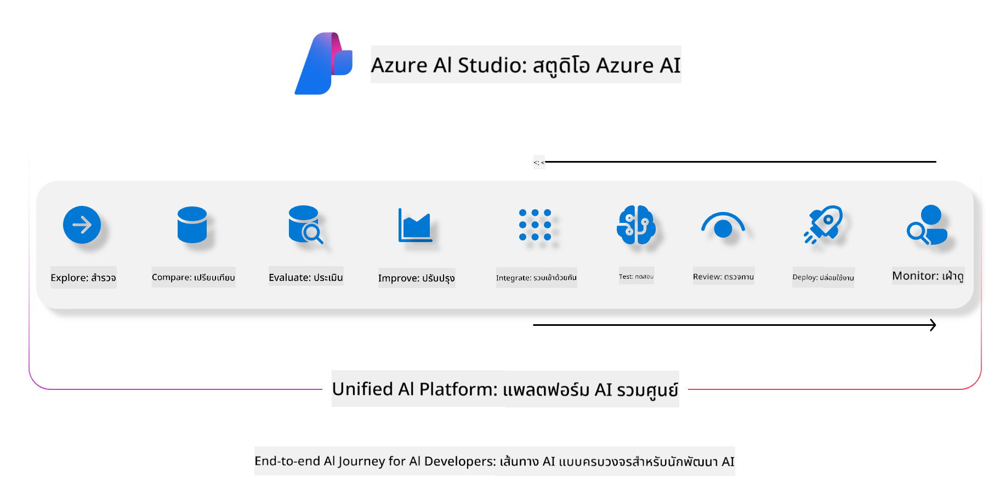
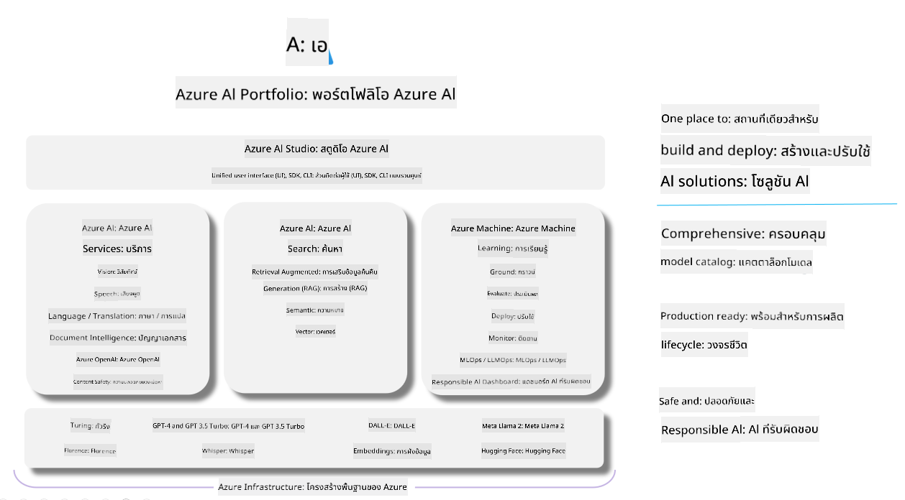

<!--
CO_OP_TRANSLATOR_METADATA:
{
  "original_hash": "7b4235159486df4000e16b7b46ddfec3",
  "translation_date": "2025-05-09T14:58:07+00:00",
  "source_file": "md/01.Introduction/05/AIFoundry.md",
  "language_code": "th"
}
-->
# **การใช้ Azure AI Foundry ในการประเมินผล**

วิธีการประเมินแอปพลิเคชัน generative AI ของคุณโดยใช้ [Azure AI Foundry](https://ai.azure.com?WT.mc_id=aiml-138114-kinfeylo) ไม่ว่าคุณจะประเมินการสนทนาแบบรอบเดียวหรือหลายรอบ Azure AI Foundry มีเครื่องมือสำหรับประเมินประสิทธิภาพและความปลอดภัยของโมเดล

## วิธีการประเมินแอป generative AI ด้วย Azure AI Foundry
สำหรับคำแนะนำอย่างละเอียด ดูที่ [Azure AI Foundry Documentation](https://learn.microsoft.com/azure/ai-studio/how-to/evaluate-generative-ai-app?WT.mc_id=aiml-138114-kinfeylo)

นี่คือขั้นตอนเริ่มต้น:

## การประเมินโมเดล Generative AI ใน Azure AI Foundry

**สิ่งที่ต้องเตรียม**

- ชุดข้อมูลทดสอบในรูปแบบ CSV หรือ JSON
- โมเดล generative AI ที่ถูกนำไปใช้งานแล้ว (เช่น Phi-3, GPT 3.5, GPT 4 หรือ Davinci models)
- runtime ที่มี compute instance สำหรับรันการประเมิน

## ตัวชี้วัดการประเมินในตัว

Azure AI Foundry ช่วยให้คุณประเมินทั้งการสนทนาแบบรอบเดียวและแบบหลายรอบที่ซับซ้อน  
สำหรับกรณี Retrieval Augmented Generation (RAG) ที่โมเดลใช้ข้อมูลเฉพาะเจาะจงเป็นฐาน คุณสามารถประเมินผลโดยใช้ตัวชี้วัดในตัวได้  
นอกจากนี้ยังสามารถประเมินการตอบคำถามแบบรอบเดียวทั่วไป (non-RAG) ได้ด้วย

## การสร้างการรันประเมิน

จาก UI ของ Azure AI Foundry ให้ไปที่หน้า Evaluate หรือ Prompt Flow  
ทำตามตัวช่วยสร้างการประเมินเพื่อสร้างการรันประเมิน และตั้งชื่อการประเมินได้ตามต้องการ  
เลือกสถานการณ์ที่สอดคล้องกับวัตถุประสงค์ของแอปของคุณ  
เลือกตัวชี้วัดการประเมินหนึ่งตัวหรือมากกว่านั้นเพื่อประเมินผลลัพธ์ของโมเดล

## การสร้างกระบวนการประเมินแบบกำหนดเอง (ไม่บังคับ)

ถ้าต้องการความยืดหยุ่นมากขึ้น คุณสามารถสร้างกระบวนการประเมินแบบกำหนดเองได้ ปรับแต่งกระบวนการประเมินตามความต้องการเฉพาะของคุณ

## การดูผลลัพธ์

หลังจากรันการประเมินแล้ว ให้บันทึก ดู และวิเคราะห์ตัวชี้วัดการประเมินอย่างละเอียดใน Azure AI Foundry เพื่อเข้าใจความสามารถและข้อจำกัดของแอปของคุณ

**Note** Azure AI Foundry ยังอยู่ในสถานะ public preview จึงเหมาะสำหรับการทดลองและพัฒนา สำหรับงาน production ควรพิจารณาตัวเลือกอื่น ๆ ดูรายละเอียดและคำแนะนำทีละขั้นตอนเพิ่มเติมได้ที่ [AI Foundry documentation](https://learn.microsoft.com/azure/ai-studio/?WT.mc_id=aiml-138114-kinfeylo)

**ข้อจำกัดความรับผิดชอบ**:  
เอกสารนี้ได้รับการแปลโดยใช้บริการแปลภาษาอัตโนมัติ [Co-op Translator](https://github.com/Azure/co-op-translator) แม้เราจะพยายามให้ความถูกต้องสูงสุด แต่โปรดทราบว่าการแปลอัตโนมัติอาจมีข้อผิดพลาดหรือความไม่แม่นยำ เอกสารต้นฉบับในภาษาต้นทางควรถูกพิจารณาเป็นแหล่งข้อมูลที่เชื่อถือได้ สำหรับข้อมูลสำคัญ ขอแนะนำให้ใช้บริการแปลโดยผู้เชี่ยวชาญมนุษย์ เราจะไม่รับผิดชอบต่อความเข้าใจผิดหรือการตีความผิดที่เกิดขึ้นจากการใช้การแปลนี้