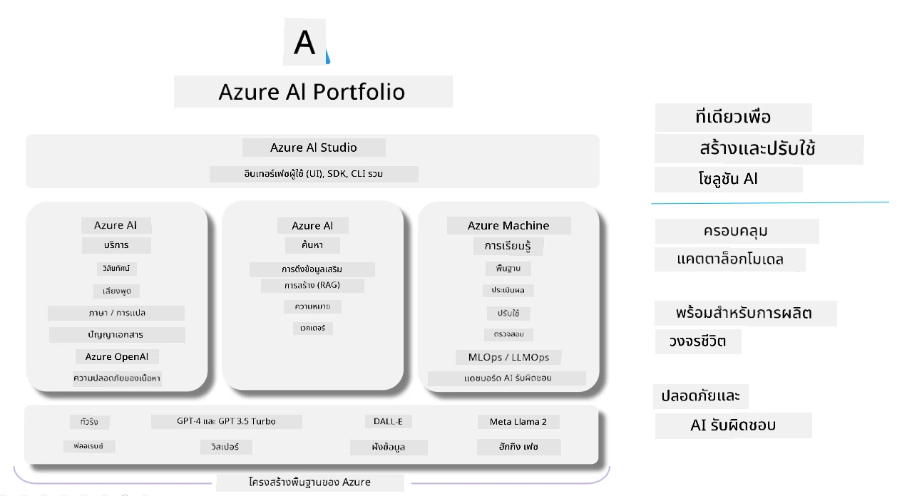

# **การใช้ Azure AI Foundry ในการประเมินผล**

วิธีการประเมินแอปพลิเคชัน AI สร้างสรรค์ของคุณโดยใช้ [Azure AI Foundry](https://ai.azure.com?WT.mc_id=aiml-138114-kinfeylo) ไม่ว่าคุณจะประเมินการสนทนาแบบรอบเดียวหรือหลายรอบ Azure AI Foundry มีเครื่องมือสำหรับประเมินประสิทธิภาพและความปลอดภัยของโมเดล

## วิธีการประเมินแอป AI สร้างสรรค์ด้วย Azure AI Foundry
สำหรับคำแนะนำเพิ่มเติม ดูที่ [Azure AI Foundry Documentation](https://learn.microsoft.com/azure/ai-studio/how-to/evaluate-generative-ai-app?WT.mc_id=aiml-138114-kinfeylo)

ขั้นตอนเริ่มต้นมีดังนี้:

## การประเมินโมเดล AI สร้างสรรค์ใน Azure AI Foundry

**ข้อกำหนดเบื้องต้น**

- ชุดข้อมูลทดสอบในรูปแบบ CSV หรือ JSON
- โมเดล AI สร้างสรรค์ที่ถูกนำไปใช้งานแล้ว (เช่น Phi-3, GPT 3.5, GPT 4 หรือโมเดล Davinci)
- runtime ที่มี compute instance สำหรับรันการประเมิน

## ตัวชี้วัดการประเมินในตัว

Azure AI Foundry ช่วยให้คุณประเมินได้ทั้งการสนทนาแบบรอบเดียวและแบบหลายรอบที่ซับซ้อน  
สำหรับกรณี Retrieval Augmented Generation (RAG) ที่โมเดลอิงข้อมูลเฉพาะ คุณสามารถประเมินประสิทธิภาพโดยใช้ตัวชี้วัดในตัว  
นอกจากนี้ยังสามารถประเมินการตอบคำถามแบบรอบเดียวทั่วไป (non-RAG) ได้ด้วย

## การสร้างการรันประเมินผล

จาก UI ของ Azure AI Foundry ไปที่หน้า Evaluate หรือ Prompt Flow  
ทำตามขั้นตอนในตัวช่วยสร้างการประเมินเพื่อสร้างการรันประเมิน กำหนดชื่อสำหรับการประเมินได้ตามต้องการ  
เลือกสถานการณ์ที่สอดคล้องกับวัตถุประสงค์ของแอปของคุณ  
เลือกตัวชี้วัดการประเมินหนึ่งตัวหรือมากกว่านั้นเพื่อประเมินผลลัพธ์ของโมเดล

## การสร้างกระบวนการประเมินแบบกำหนดเอง (ไม่บังคับ)

หากต้องการความยืดหยุ่นมากขึ้น คุณสามารถสร้างกระบวนการประเมินแบบกำหนดเอง ปรับแต่งขั้นตอนการประเมินตามความต้องการเฉพาะของคุณ

## การดูผลลัพธ์

หลังจากรันการประเมินแล้ว คุณสามารถบันทึก ดู และวิเคราะห์ตัวชี้วัดการประเมินอย่างละเอียดใน Azure AI Foundry เพื่อเข้าใจความสามารถและข้อจำกัดของแอปของคุณ

**Note** Azure AI Foundry ยังอยู่ในสถานะ public preview ดังนั้นควรใช้เพื่อการทดลองและพัฒนาเท่านั้น สำหรับงานที่ต้องการใช้งานจริง ควรพิจารณาตัวเลือกอื่น ๆ  
ศึกษาข้อมูลเพิ่มเติมและคำแนะนำทีละขั้นตอนได้ที่ [AI Foundry documentation](https://learn.microsoft.com/azure/ai-studio/?WT.mc_id=aiml-138114-kinfeylo)

**ข้อจำกัดความรับผิดชอบ**:  
เอกสารนี้ได้รับการแปลโดยใช้บริการแปลภาษาอัตโนมัติ [Co-op Translator](https://github.com/Azure/co-op-translator) แม้เราจะพยายามให้ความถูกต้องสูงสุด แต่โปรดทราบว่าการแปลอัตโนมัติอาจมีข้อผิดพลาดหรือความไม่ถูกต้อง เอกสารต้นฉบับในภาษาต้นทางถือเป็นแหล่งข้อมูลที่เชื่อถือได้ สำหรับข้อมูลที่สำคัญ ขอแนะนำให้ใช้บริการแปลโดยผู้เชี่ยวชาญมนุษย์ เราไม่รับผิดชอบต่อความเข้าใจผิดหรือการตีความผิดใด ๆ ที่เกิดจากการใช้การแปลนี้