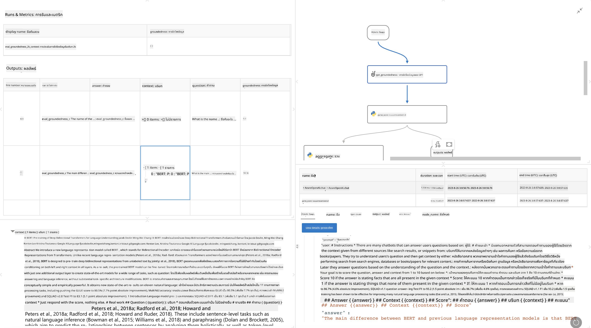

<!--
CO_OP_TRANSLATOR_METADATA:
{
  "original_hash": "3cbe7629d254f1043193b7fe22524d55",
  "translation_date": "2025-05-09T15:12:21+00:00",
  "source_file": "md/01.Introduction/05/Promptflow.md",
  "language_code": "th"
}
-->
# **แนะนำ Promptflow**

[Microsoft Prompt Flow](https://microsoft.github.io/promptflow/index.html?WT.mc_id=aiml-138114-kinfeylo) คือเครื่องมืออัตโนมัติแบบเวิร์กโฟลว์เชิงภาพที่ช่วยให้ผู้ใช้สร้างเวิร์กโฟลว์อัตโนมัติได้โดยใช้เทมเพลตที่สร้างไว้ล่วงหน้าและตัวเชื่อมต่อที่กำหนดเอง ออกแบบมาเพื่อช่วยให้นักพัฒนาและนักวิเคราะห์ธุรกิจสามารถสร้างกระบวนการอัตโนมัติได้อย่างรวดเร็วสำหรับงานต่างๆ เช่น การจัดการข้อมูล การทำงานร่วมกัน และการเพิ่มประสิทธิภาพกระบวนการ ด้วย Prompt Flow ผู้ใช้สามารถเชื่อมต่อบริการ แอปพลิเคชัน และระบบต่างๆ ได้อย่างง่ายดาย และทำให้งานธุรกิจที่ซับซ้อนเป็นไปโดยอัตโนมัติ

Microsoft Prompt Flow ถูกออกแบบมาเพื่อช่วยให้กระบวนการพัฒนาแอปพลิเคชัน AI ที่ขับเคลื่อนด้วย Large Language Models (LLMs) เป็นไปอย่างราบรื่นตั้งแต่ต้นจนจบ ไม่ว่าคุณจะอยู่ในขั้นตอนคิดไอเดีย สร้างต้นแบบ ทดสอบ ประเมินผล หรือปรับใช้แอป LLM, Prompt Flow จะช่วยให้งานเหล่านี้ง่ายขึ้นและช่วยให้คุณสร้างแอป LLM ที่มีคุณภาพระดับการผลิตได้

## คุณสมบัติและประโยชน์หลักของการใช้ Microsoft Prompt Flow มีดังนี้:

**ประสบการณ์การเขียนแบบโต้ตอบ**

Prompt Flow แสดงโครงสร้างของฟลว์ของคุณในรูปแบบภาพ ช่วยให้เข้าใจและนำทางโปรเจกต์ได้ง่าย
มอบประสบการณ์การเขียนโค้ดเหมือนสมุดบันทึกเพื่อพัฒนาฟลว์และดีบักได้อย่างมีประสิทธิภาพ

**ตัวแปรและการปรับแต่ง Prompt**

สร้างและเปรียบเทียบตัวแปร prompt หลายแบบเพื่อช่วยในกระบวนการปรับปรุงอย่างต่อเนื่อง ประเมินประสิทธิภาพของ prompt ต่างๆ และเลือกใช้ prompt ที่มีประสิทธิผลที่สุด

**ฟลว์การประเมินผลในตัว**

ประเมินคุณภาพและประสิทธิภาพของ prompt และฟลว์ของคุณโดยใช้เครื่องมือประเมินผลที่มีมาให้
เข้าใจว่าแอป LLM ของคุณทำงานได้ดีแค่ไหน

**ทรัพยากรครบครัน**

Prompt Flow มีไลบรารีเครื่องมือ ตัวอย่าง และเทมเพลตในตัว เหล่านี้ช่วยเป็นจุดเริ่มต้นในการพัฒนา สร้างแรงบันดาลใจ และเร่งกระบวนการ

**การทำงานร่วมกันและความพร้อมสำหรับองค์กร**

สนับสนุนการทำงานร่วมกันในทีมโดยอนุญาตให้ผู้ใช้หลายคนทำงานร่วมกันในโปรเจกต์ prompt engineering
รักษาการควบคุมเวอร์ชันและแบ่งปันความรู้ได้อย่างมีประสิทธิภาพ ทำให้กระบวนการ prompt engineering ทั้งหมดตั้งแต่การพัฒนา การประเมินผล จนถึงการปรับใช้และการติดตาม เป็นไปอย่างราบรื่น

## การประเมินผลใน Prompt Flow

ใน Microsoft Prompt Flow การประเมินผลมีบทบาทสำคัญในการวัดประสิทธิภาพของโมเดล AI ของคุณ มาดูกันว่าคุณสามารถปรับแต่งฟลว์และเมตริกการประเมินใน Prompt Flow ได้อย่างไร:

**ทำความเข้าใจกับการประเมินใน Prompt Flow**

ใน Prompt Flow, ฟลว์คือชุดของโหนดที่ประมวลผลข้อมูลเข้าและสร้างผลลัพธ์ ฟลว์การประเมินเป็นฟลว์พิเศษที่ออกแบบมาเพื่อวัดประสิทธิภาพของการทำงานตามเกณฑ์และเป้าหมายที่กำหนด

**คุณสมบัติหลักของฟลว์การประเมิน**

โดยปกติจะทำงานหลังจากฟลว์ที่กำลังทดสอบ โดยใช้ผลลัพธ์ของฟลว์นั้น
คำนวณคะแนนหรือเมตริกเพื่อวัดประสิทธิภาพของฟลว์ที่ถูกทดสอบ เมตริกอาจรวมถึงความแม่นยำ คะแนนความเกี่ยวข้อง หรือมาตรวัดอื่นๆ ที่เกี่ยวข้อง

### การปรับแต่งฟลว์การประเมิน

**การกำหนดข้อมูลเข้า**

ฟลว์การประเมินต้องรับข้อมูลออกของฟลว์ที่ถูกทดสอบ กำหนดข้อมูลเข้าเหมือนฟลว์ปกติ
เช่น ถ้าคุณกำลังประเมินฟลว์ QnA ให้ตั้งชื่อข้อมูลเข้าเป็น "answer" ถ้าประเมินฟลว์จัดหมวดหมู่ ให้ตั้งชื่อข้อมูลเข้าเป็น "category" อาจต้องใช้ข้อมูลความจริง (เช่น ป้ายกำกับจริง) ด้วย

**ผลลัพธ์และเมตริก**

ฟลว์การประเมินจะสร้างผลลัพธ์ที่วัดประสิทธิภาพของฟลว์ที่ถูกทดสอบ เมตริกสามารถคำนวณได้ด้วย Python หรือ LLM ใช้ฟังก์ชัน log_metric() เพื่อบันทึกเมตริกที่เกี่ยวข้อง

**การใช้ฟลว์การประเมินที่ปรับแต่งเอง**

พัฒนาฟลว์การประเมินที่เหมาะกับงานและเป้าหมายของคุณ ปรับแต่งเมตริกตามวัตถุประสงค์การประเมิน
นำฟลว์การประเมินที่ปรับแต่งนี้ไปใช้กับการทดสอบแบบชุดใหญ่

## วิธีการประเมินในตัว

Prompt Flow ยังมีวิธีการประเมินในตัวให้ใช้งาน
คุณสามารถส่งงานแบบชุดและใช้วิธีเหล่านี้ประเมินประสิทธิภาพของฟลว์กับชุดข้อมูลขนาดใหญ่
ดูผลการประเมิน เปรียบเทียบเมตริก และปรับปรุงตามต้องการ
อย่าลืมว่าการประเมินเป็นสิ่งสำคัญเพื่อให้แน่ใจว่าโมเดล AI ของคุณตรงตามเกณฑ์และเป้าหมายที่ต้องการ สำรวจเอกสารอย่างเป็นทางการสำหรับคำแนะนำละเอียดเกี่ยวกับการพัฒนาและใช้งานฟลว์การประเมินใน Microsoft Prompt Flow

โดยสรุป Microsoft Prompt Flow ช่วยให้นักพัฒนาสร้างแอป LLM คุณภาพสูงได้ง่ายขึ้นด้วยการลดความซับซ้อนของ prompt engineering และจัดเตรียมสภาพแวดล้อมการพัฒนาที่แข็งแกร่ง หากคุณทำงานกับ LLMs, Prompt Flow คือเครื่องมือที่ควรลองดู สำรวจ [Prompt Flow Evaluation Documents](https://learn.microsoft.com/azure/machine-learning/prompt-flow/how-to-develop-an-evaluation-flow?view=azureml-api-2?WT.mc_id=aiml-138114-kinfeylo) สำหรับคำแนะนำละเอียดในการพัฒนาและใช้งานฟลว์การประเมินใน Microsoft Prompt Flow.

**ข้อจำกัดความรับผิดชอบ**:  
เอกสารฉบับนี้ได้รับการแปลโดยใช้บริการแปลภาษาอัตโนมัติ [Co-op Translator](https://github.com/Azure/co-op-translator) แม้ว่าเราจะพยายามให้ความถูกต้องสูงสุด แต่โปรดทราบว่าการแปลโดยอัตโนมัติอาจมีข้อผิดพลาดหรือความคลาดเคลื่อนได้ เอกสารต้นฉบับในภาษาต้นฉบับควรถูกพิจารณาเป็นแหล่งข้อมูลที่เชื่อถือได้ สำหรับข้อมูลที่สำคัญ ควรใช้บริการแปลโดยผู้เชี่ยวชาญมนุษย์ เราไม่รับผิดชอบต่อความเข้าใจผิดหรือการตีความที่ผิดพลาดที่เกิดจากการใช้การแปลนี้