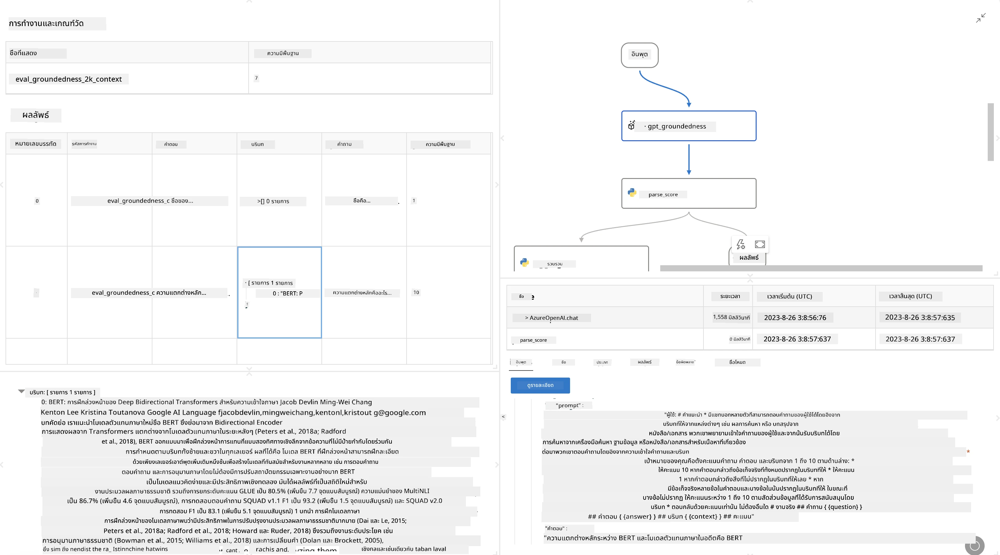

# **แนะนำ Promptflow**

[Microsoft Prompt Flow](https://microsoft.github.io/promptflow/index.html?WT.mc_id=aiml-138114-kinfeylo) คือเครื่องมืออัตโนมัติแบบเวิร์กโฟลว์ที่มีอินเทอร์เฟซแบบภาพ ช่วยให้ผู้ใช้สร้างเวิร์กโฟลว์อัตโนมัติได้อย่างง่ายดายโดยใช้เทมเพลตที่สร้างไว้ล่วงหน้าและตัวเชื่อมต่อแบบกำหนดเอง ออกแบบมาเพื่อช่วยให้นักพัฒนาและนักวิเคราะห์ธุรกิจสามารถสร้างกระบวนการอัตโนมัติได้อย่างรวดเร็วสำหรับงานต่างๆ เช่น การจัดการข้อมูล การทำงานร่วมกัน และการเพิ่มประสิทธิภาพกระบวนการ ด้วย Prompt Flow ผู้ใช้สามารถเชื่อมต่อบริการ แอปพลิเคชัน และระบบต่างๆ ได้อย่างง่ายดาย และทำให้งานธุรกิจที่ซับซ้อนเป็นอัตโนมัติ

Microsoft Prompt Flow ถูกออกแบบมาเพื่อช่วยให้กระบวนการพัฒนาแอปพลิเคชัน AI ที่ใช้ Large Language Models (LLMs) เป็นไปอย่างราบรื่นตั้งแต่ต้นจนจบ ไม่ว่าคุณจะอยู่ในขั้นตอนการคิดไอเดีย การสร้างต้นแบบ การทดสอบ การประเมินผล หรือการนำแอป LLM ไปใช้งาน Prompt Flow จะช่วยให้กระบวนการเหล่านี้ง่ายขึ้นและช่วยให้คุณสร้างแอป LLM ที่มีคุณภาพสำหรับการใช้งานจริง

## คุณสมบัติและประโยชน์หลักของ Microsoft Prompt Flow ได้แก่:

**ประสบการณ์การเขียนโค้ดแบบโต้ตอบ**

Prompt Flow แสดงโครงสร้างของเวิร์กโฟลว์ในรูปแบบภาพ ช่วยให้เข้าใจและนำทางโปรเจกต์ได้ง่าย  
มีประสบการณ์การเขียนโค้ดแบบโน้ตบุ๊กที่ช่วยให้พัฒนาและดีบักเวิร์กโฟลว์ได้อย่างมีประสิทธิภาพ

**ตัวแปรและการปรับแต่ง Prompt**

สร้างและเปรียบเทียบตัวแปร prompt หลายแบบเพื่อช่วยในการปรับปรุงอย่างต่อเนื่อง  
ประเมินประสิทธิภาพของ prompt ต่างๆ และเลือกใช้ตัวที่มีประสิทธิผลมากที่สุด

**เวิร์กโฟลว์ประเมินผลในตัว**

ประเมินคุณภาพและประสิทธิภาพของ prompt และเวิร์กโฟลว์ด้วยเครื่องมือประเมินผลที่มีมาให้  
เข้าใจว่าการทำงานของแอป LLM ของคุณเป็นอย่างไร

**ทรัพยากรครบครัน**

Prompt Flow มาพร้อมกับไลบรารีเครื่องมือ ตัวอย่าง และเทมเพลตที่สร้างไว้ล่วงหน้า ทรัพยากรเหล่านี้ช่วยเป็นจุดเริ่มต้นในการพัฒนา กระตุ้นความคิดสร้างสรรค์ และเร่งกระบวนการทำงาน

**การทำงานร่วมกันและความพร้อมสำหรับองค์กร**

สนับสนุนการทำงานร่วมกันในทีมโดยอนุญาตให้ผู้ใช้หลายคนทำงานบนโปรเจกต์ prompt engineering เดียวกัน  
ควบคุมเวอร์ชันและแชร์ความรู้ได้อย่างมีประสิทธิภาพ  
ช่วยให้กระบวนการ prompt engineering ตั้งแต่การพัฒนา การประเมินผล ไปจนถึงการนำไปใช้งานและการติดตามผลเป็นไปอย่างราบรื่น

## การประเมินผลใน Prompt Flow

ใน Microsoft Prompt Flow การประเมินผลมีบทบาทสำคัญในการวัดประสิทธิภาพของโมเดล AI ของคุณ มาดูกันว่าคุณสามารถปรับแต่งเวิร์กโฟลว์และเมตริกการประเมินผลใน Prompt Flow ได้อย่างไร:

**ทำความเข้าใจการประเมินผลใน Prompt Flow**

ใน Prompt Flow เวิร์กโฟลว์หมายถึงลำดับของโหนดที่ประมวลผลข้อมูลเข้าและสร้างผลลัพธ์  
เวิร์กโฟลว์ประเมินผลเป็นเวิร์กโฟลว์พิเศษที่ออกแบบมาเพื่อวัดประสิทธิภาพของการทำงานตามเกณฑ์และเป้าหมายที่กำหนด

**คุณสมบัติหลักของเวิร์กโฟลว์ประเมินผล**

โดยปกติจะทำงานหลังจากเวิร์กโฟลว์ที่ถูกทดสอบ โดยใช้ผลลัพธ์ของเวิร์กโฟลว์นั้น  
คำนวณคะแนนหรือเมตริกเพื่อวัดประสิทธิภาพของเวิร์กโฟลว์ที่ถูกทดสอบ  
เมตริกอาจรวมถึงความแม่นยำ คะแนนความเกี่ยวข้อง หรือมาตรวัดอื่นๆ ที่เกี่ยวข้อง

### การปรับแต่งเวิร์กโฟลว์ประเมินผล

**การกำหนดข้อมูลเข้า**

เวิร์กโฟลว์ประเมินผลต้องรับข้อมูลผลลัพธ์จากการทำงานที่ถูกทดสอบ กำหนดข้อมูลเข้าเหมือนกับเวิร์กโฟลว์ทั่วไป  
ตัวอย่างเช่น หากคุณกำลังประเมินเวิร์กโฟลว์ QnA ให้ตั้งชื่อข้อมูลเข้าเป็น "answer" หากประเมินเวิร์กโฟลว์การจัดหมวดหมู่ ให้ตั้งชื่อข้อมูลเข้าเป็น "category" อาจต้องมีข้อมูลเข้า ground truth (เช่น ป้ายกำกับจริง) ด้วย

**ผลลัพธ์และเมตริก**

เวิร์กโฟลว์ประเมินผลจะสร้างผลลัพธ์ที่วัดประสิทธิภาพของเวิร์กโฟลว์ที่ถูกทดสอบ  
เมตริกสามารถคำนวณได้โดยใช้ Python หรือ LLM  
ใช้ฟังก์ชัน log_metric() เพื่อบันทึกเมตริกที่เกี่ยวข้อง

**การใช้เวิร์กโฟลว์ประเมินผลที่ปรับแต่งเอง**

พัฒนาเวิร์กโฟลว์ประเมินผลที่เหมาะสมกับงานและเป้าหมายเฉพาะของคุณ  
ปรับแต่งเมตริกตามเป้าหมายการประเมินผล  
นำเวิร์กโฟลว์ประเมินผลที่ปรับแต่งนี้ไปใช้กับการรันแบบแบตช์สำหรับการทดสอบในระดับใหญ่

## วิธีการประเมินผลในตัว

Prompt Flow ยังมีวิธีการประเมินผลในตัวให้ใช้งาน  
คุณสามารถส่งการรันแบบแบตช์และใช้วิธีเหล่านี้เพื่อประเมินประสิทธิภาพของเวิร์กโฟลว์กับชุดข้อมูลขนาดใหญ่  
ดูผลการประเมิน เปรียบเทียบเมตริก และปรับปรุงตามความจำเป็น  
อย่าลืมว่าการประเมินผลเป็นสิ่งสำคัญเพื่อให้แน่ใจว่าโมเดล AI ของคุณตรงตามเกณฑ์และเป้าหมายที่ตั้งไว้  
ศึกษาคู่มืออย่างเป็นทางการสำหรับคำแนะนำละเอียดเกี่ยวกับการพัฒนาและการใช้เวิร์กโฟลว์ประเมินผลใน Microsoft Prompt Flow

โดยสรุป Microsoft Prompt Flow ช่วยให้นักพัฒนาสร้างแอป LLM คุณภาพสูงได้ง่ายขึ้นด้วยการทำให้ prompt engineering เป็นเรื่องง่ายและมีสภาพแวดล้อมการพัฒนาที่แข็งแกร่ง หากคุณทำงานกับ LLMs Prompt Flow คือเครื่องมือที่ควรลองใช้  
ศึกษาข้อมูลเพิ่มเติมได้ที่ [Prompt Flow Evaluation Documents](https://learn.microsoft.com/azure/machine-learning/prompt-flow/how-to-develop-an-evaluation-flow?view=azureml-api-2?WT.mc_id=aiml-138114-kinfeylo) สำหรับคำแนะนำละเอียดเกี่ยวกับการพัฒนาและการใช้เวิร์กโฟลว์ประเมินผลใน Microsoft Prompt Flow

**ข้อจำกัดความรับผิดชอบ**:  
เอกสารนี้ได้รับการแปลโดยใช้บริการแปลภาษาอัตโนมัติ [Co-op Translator](https://github.com/Azure/co-op-translator) แม้เราจะพยายามให้ความถูกต้องสูงสุด แต่โปรดทราบว่าการแปลอัตโนมัติอาจมีข้อผิดพลาดหรือความไม่ถูกต้อง เอกสารต้นฉบับในภาษาต้นทางถือเป็นแหล่งข้อมูลที่เชื่อถือได้ สำหรับข้อมูลที่สำคัญ ขอแนะนำให้ใช้บริการแปลโดยผู้เชี่ยวชาญมนุษย์ เราไม่รับผิดชอบต่อความเข้าใจผิดหรือการตีความผิดใด ๆ ที่เกิดจากการใช้การแปลนี้