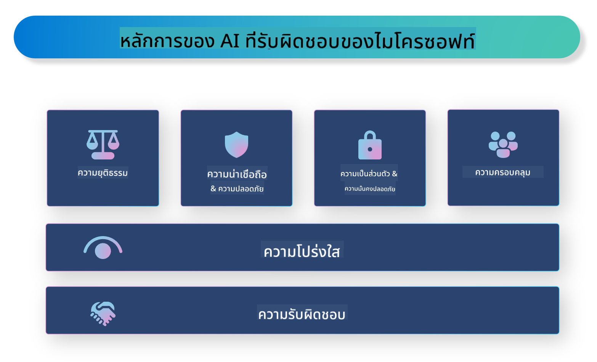

<!--
CO_OP_TRANSLATOR_METADATA:
{
  "original_hash": "805b96b20152936d8f4c587d90d6e06e",
  "translation_date": "2025-05-09T15:34:44+00:00",
  "source_file": "md/01.Introduction/05/ResponsibleAI.md",
  "language_code": "th"
}
-->
# **แนะนำ Responsible AI**

[Microsoft Responsible AI](https://www.microsoft.com/ai/responsible-ai?WT.mc_id=aiml-138114-kinfeylo) เป็นโครงการที่มีเป้าหมายเพื่อช่วยนักพัฒนาและองค์กรในการสร้างระบบ AI ที่โปร่งใส น่าเชื่อถือ และมีความรับผิดชอบ โครงการนี้มีคำแนะนำและทรัพยากรสำหรับการพัฒนาโซลูชัน AI ที่รับผิดชอบซึ่งสอดคล้องกับหลักจริยธรรม เช่น ความเป็นส่วนตัว ความยุติธรรม และความโปร่งใส เราจะสำรวจความท้าทายและแนวปฏิบัติที่ดีที่สุดในการสร้างระบบ AI ที่รับผิดชอบด้วย

## ภาพรวมของ Microsoft Responsible AI

**หลักจริยธรรม**

Microsoft Responsible AI ดำเนินงานโดยมีหลักจริยธรรม เช่น ความเป็นส่วนตัว ความยุติธรรม ความโปร่งใส ความรับผิดชอบ และความปลอดภัย หลักการเหล่านี้ถูกออกแบบมาเพื่อให้มั่นใจว่าระบบ AI ได้รับการพัฒนาอย่างมีจริยธรรมและรับผิดชอบ

**AI ที่โปร่งใส**

Microsoft Responsible AI เน้นความสำคัญของความโปร่งใสในระบบ AI ซึ่งรวมถึงการให้คำอธิบายที่ชัดเจนเกี่ยวกับการทำงานของโมเดล AI รวมถึงการเปิดเผยแหล่งข้อมูลและอัลกอริทึมอย่างสาธารณะ

**AI ที่รับผิดชอบ**

[Microsoft Responsible AI](https://www.microsoft.com/ai/responsible-ai?WT.mc_id=aiml-138114-kinfeylo) ส่งเสริมการพัฒนาระบบ AI ที่รับผิดชอบ ซึ่งสามารถให้ข้อมูลเชิงลึกเกี่ยวกับวิธีที่โมเดล AI ตัดสินใจ ช่วยให้ผู้ใช้เข้าใจและเชื่อมั่นในผลลัพธ์ของระบบ AI

**ความครอบคลุม**

ระบบ AI ควรถูกออกแบบให้เป็นประโยชน์ต่อทุกคน Microsoft มุ่งมั่นสร้าง AI ที่ครอบคลุมซึ่งคำนึงถึงมุมมองที่หลากหลายและหลีกเลี่ยงอคติหรือการเลือกปฏิบัติ

**ความน่าเชื่อถือและความปลอดภัย**

การทำให้ระบบ AI มีความน่าเชื่อถือและปลอดภัยเป็นสิ่งสำคัญ Microsoft มุ่งเน้นการสร้างโมเดลที่แข็งแกร่งซึ่งทำงานได้อย่างสม่ำเสมอและหลีกเลี่ยงผลลัพธ์ที่เป็นอันตราย

**ความยุติธรรมใน AI**

Microsoft Responsible AI ตระหนักว่าระบบ AI อาจสืบทอดอคติหากได้รับการฝึกด้วยข้อมูลหรืออัลกอริทึมที่มีอคติ โครงการนี้ให้คำแนะนำในการพัฒนาระบบ AI ที่ยุติธรรมซึ่งไม่เลือกปฏิบัติตามปัจจัย เช่น เชื้อชาติ เพศ หรืออายุ

**ความเป็นส่วนตัวและความปลอดภัย**

Microsoft Responsible AI เน้นความสำคัญของการปกป้องความเป็นส่วนตัวของผู้ใช้และความปลอดภัยของข้อมูลในระบบ AI ซึ่งรวมถึงการใช้การเข้ารหัสข้อมูลที่แข็งแกร่งและการควบคุมการเข้าถึง รวมถึงการตรวจสอบระบบ AI อย่างสม่ำเสมอเพื่อหาจุดอ่อน

**ความรับผิดชอบและความรับผิดชอบ**

Microsoft Responsible AI ส่งเสริมความรับผิดชอบในการพัฒนาและนำระบบ AI ไปใช้ ซึ่งรวมถึงการทำให้แน่ใจว่านักพัฒนาและองค์กรรับรู้ถึงความเสี่ยงที่อาจเกิดขึ้นจากระบบ AI และดำเนินการเพื่อลดความเสี่ยงเหล่านั้น

## แนวปฏิบัติที่ดีที่สุดสำหรับการสร้างระบบ AI ที่รับผิดชอบ

**พัฒนาโมเดล AI โดยใช้ชุดข้อมูลที่หลากหลาย**

เพื่อหลีกเลี่ยงอคติในระบบ AI การใช้ชุดข้อมูลที่หลากหลายซึ่งแสดงถึงมุมมองและประสบการณ์ที่แตกต่างกันเป็นสิ่งสำคัญ

**ใช้เทคนิค AI ที่อธิบายได้**

เทคนิค AI ที่อธิบายได้ช่วยให้ผู้ใช้เข้าใจว่าระบบ AI ตัดสินใจอย่างไร ซึ่งจะช่วยเพิ่มความเชื่อมั่นในระบบ

**ตรวจสอบระบบ AI อย่างสม่ำเสมอเพื่อหาจุดอ่อน**

การตรวจสอบระบบ AI อย่างสม่ำเสมอช่วยระบุความเสี่ยงและจุดอ่อนที่ต้องแก้ไข

**ใช้การเข้ารหัสข้อมูลและควบคุมการเข้าถึงที่เข้มงวด**

การเข้ารหัสข้อมูลและการควบคุมการเข้าถึงช่วยปกป้องความเป็นส่วนตัวและความปลอดภัยของผู้ใช้ในระบบ AI

**ปฏิบัติตามหลักจริยธรรมในการพัฒนา AI**

การปฏิบัติตามหลักจริยธรรม เช่น ความยุติธรรม ความโปร่งใส และความรับผิดชอบ ช่วยสร้างความเชื่อมั่นในระบบ AI และทำให้มั่นใจว่าระบบถูกพัฒนาอย่างรับผิดชอบ

## การใช้ AI Foundry สำหรับ Responsible AI

[Azure AI Foundry](https://ai.azure.com?WT.mc_id=aiml-138114-kinfeylo) เป็นแพลตฟอร์มทรงพลังที่ช่วยให้นักพัฒนาและองค์กรสร้างแอปพลิเคชันอัจฉริยะที่ทันสมัย พร้อมใช้งานในตลาด และรับผิดชอบได้อย่างรวดเร็ว นี่คือคุณสมบัติและความสามารถหลักของ Azure AI Foundry:

**API และโมเดลพร้อมใช้งาน**

Azure AI Foundry มี API และโมเดลที่สร้างไว้ล่วงหน้าและปรับแต่งได้ ครอบคลุมงาน AI หลากหลายประเภท เช่น generative AI, การประมวลผลภาษาธรรมชาติสำหรับบทสนทนา, การค้นหา, การตรวจสอบ, การแปลภาษา, เสียง, การมองเห็น และการตัดสินใจ

**Prompt Flow**

Prompt Flow ใน Azure AI Foundry ช่วยให้คุณสร้างประสบการณ์ AI สำหรับบทสนทนาได้ง่ายขึ้น โดยช่วยออกแบบและจัดการลำดับการสนทนา เหมาะสำหรับสร้าง chatbot, ผู้ช่วยเสมือน และแอปพลิเคชันโต้ตอบอื่นๆ

**Retrieval Augmented Generation (RAG)**

RAG เป็นเทคนิคที่ผสมผสานวิธีการค้นคืนข้อมูลและการสร้างข้อมูลใหม่ ช่วยเพิ่มคุณภาพของคำตอบที่สร้างขึ้นโดยใช้ทั้งความรู้ที่มีอยู่เดิม (retrieval) และการสร้างสรรค์ใหม่ (generation)

**การประเมินและการติดตามผลสำหรับ Generative AI**

Azure AI Foundry มีเครื่องมือสำหรับประเมินและติดตามประสิทธิภาพของโมเดล generative AI คุณสามารถประเมินผลการทำงาน ความยุติธรรม และตัวชี้วัดสำคัญอื่นๆ เพื่อให้มั่นใจในการนำไปใช้ที่รับผิดชอบ นอกจากนี้ หากคุณสร้างแดชบอร์ดไว้แล้ว คุณสามารถใช้ UI แบบไม่ต้องเขียนโค้ดใน Azure Machine Learning Studio เพื่อปรับแต่งและสร้าง Responsible AI Dashboard พร้อมสกอร์การ์ดที่อิงกับ [Repsonsible AI Toolbox](https://responsibleaitoolbox.ai/?WT.mc_id=aiml-138114-kinfeylo) Python Libraries สกอร์การ์ดนี้ช่วยแชร์ข้อมูลสำคัญเกี่ยวกับความยุติธรรม ความสำคัญของฟีเจอร์ และข้อควรพิจารณาในการนำไปใช้ที่รับผิดชอบกับผู้มีส่วนได้ส่วนเสียทั้งทางเทคนิคและไม่ใช่ทางเทคนิค

ในการใช้ AI Foundry กับ Responsible AI คุณสามารถปฏิบัติตามแนวทางปฏิบัติที่ดีที่สุดเหล่านี้:

**กำหนดปัญหาและวัตถุประสงค์ของระบบ AI**

ก่อนเริ่มพัฒนา ควรกำหนดปัญหาหรือวัตถุประสงค์ที่ระบบ AI ต้องการแก้ไขอย่างชัดเจน เพื่อช่วยระบุข้อมูล อัลกอริทึม และทรัพยากรที่จำเป็นในการสร้างโมเดลที่มีประสิทธิภาพ

**รวบรวมและเตรียมข้อมูลที่เกี่ยวข้อง**

คุณภาพและปริมาณข้อมูลที่ใช้ฝึกระบบ AI มีผลต่อประสิทธิภาพอย่างมาก ดังนั้นควรรวบรวมข้อมูลที่เกี่ยวข้อง ทำความสะอาด เตรียมข้อมูล และตรวจสอบให้แน่ใจว่าข้อมูลนั้นเป็นตัวแทนของประชากรหรือปัญหาที่ต้องการแก้ไข

**เลือกวิธีการประเมินที่เหมาะสม**

มีอัลกอริทึมการประเมินหลายแบบ ควรเลือกอัลกอริทึมที่เหมาะสมที่สุดตามข้อมูลและปัญหาของคุณ

**ประเมินและตีความโมเดล**

หลังจากสร้างโมเดล AI แล้ว ควรประเมินประสิทธิภาพด้วยตัวชี้วัดที่เหมาะสมและตีความผลลัพธ์อย่างโปร่งใส เพื่อช่วยระบุอคติหรือข้อจำกัดของโมเดลและปรับปรุงตามความจำเป็น

**สร้างความโปร่งใสและความสามารถในการอธิบาย**

ระบบ AI ควรโปร่งใสและอธิบายได้ เพื่อให้ผู้ใช้เข้าใจวิธีการทำงานและการตัดสินใจ โดยเฉพาะในแอปพลิเคชันที่มีผลกระทบสำคัญต่อชีวิตมนุษย์ เช่น ด้านสุขภาพ การเงิน และกฎหมาย

**ติดตามและปรับปรุงโมเดลอย่างต่อเนื่อง**

ระบบ AI ควรถูกติดตามและปรับปรุงอย่างสม่ำเสมอเพื่อรักษาความแม่นยำและประสิทธิภาพ ซึ่งต้องการการบำรุงรักษา การทดสอบ และการฝึกซ้ำโมเดลอย่างต่อเนื่อง

สรุปแล้ว Microsoft Responsible AI เป็นโครงการที่มุ่งช่วยนักพัฒนาและองค์กรสร้างระบบ AI ที่โปร่งใส น่าเชื่อถือ และรับผิดชอบ จำไว้ว่าการนำ AI ที่รับผิดชอบไปใช้เป็นสิ่งสำคัญ และ Azure AI Foundry มุ่งทำให้เรื่องนี้เป็นไปได้จริงสำหรับองค์กร ด้วยการปฏิบัติตามหลักจริยธรรมและแนวทางที่ดีที่สุด เราสามารถมั่นใจได้ว่าระบบ AI ถูกพัฒนาและนำไปใช้ในทางที่รับผิดชอบและเป็นประโยชน์ต่อสังคมโดยรวม

**ข้อจำกัดความรับผิดชอบ**:  
เอกสารฉบับนี้ได้รับการแปลโดยใช้บริการแปลภาษาด้วย AI [Co-op Translator](https://github.com/Azure/co-op-translator) แม้เราจะพยายามให้ความถูกต้องสูงสุด โปรดทราบว่าการแปลอัตโนมัติอาจมีข้อผิดพลาดหรือความคลาดเคลื่อน เอกสารต้นฉบับในภาษาต้นฉบับถือเป็นแหล่งข้อมูลที่ถูกต้องและเชื่อถือได้ สำหรับข้อมูลสำคัญ แนะนำให้ใช้บริการแปลโดยมนุษย์ผู้เชี่ยวชาญ เราไม่รับผิดชอบต่อความเข้าใจผิดหรือการตีความที่ผิดพลาดที่เกิดจากการใช้การแปลนี้