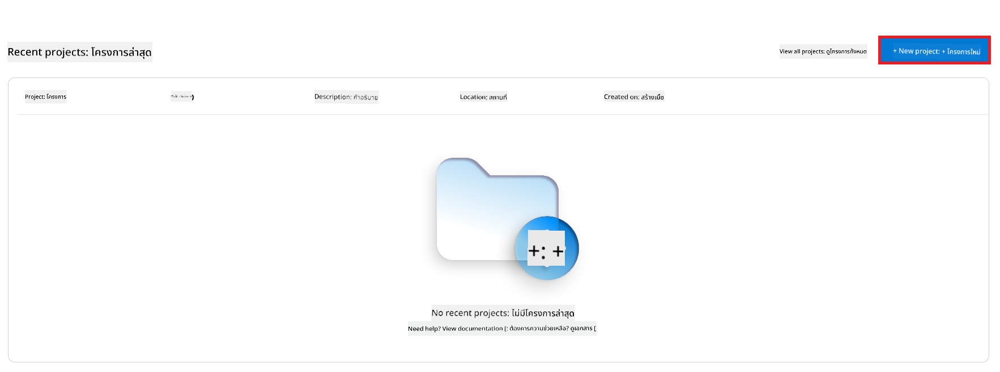

<!--
CO_OP_TRANSLATOR_METADATA:
{
  "original_hash": "80a853c08e4ee25ef9b4bfcedd8990da",
  "translation_date": "2025-05-09T16:32:37+00:00",
  "source_file": "md/02.Application/01.TextAndChat/Phi3/E2E_Phi-3-Evaluation_AIFoundry.md",
  "language_code": "th"
}
-->
# ประเมินโมเดล Fine-tuned Phi-3 / Phi-3.5 ใน Azure AI Foundry โดยเน้นหลักการ Responsible AI ของ Microsoft

ตัวอย่างแบบครบวงจร (E2E) นี้อ้างอิงจากคำแนะนำ "[Evaluate Fine-tuned Phi-3 / 3.5 Models in Azure AI Foundry Focusing on Microsoft's Responsible AI](https://techcommunity.microsoft.com/blog/educatordeveloperblog/evaluate-fine-tuned-phi-3--3-5-models-in-azure-ai-studio-focusing-on-microsofts-/4227850?WT.mc_id=aiml-137032-kinfeylo)" จาก Microsoft Tech Community

## ภาพรวม

### คุณจะประเมินความปลอดภัยและประสิทธิภาพของโมเดล Phi-3 / Phi-3.5 ที่ผ่านการปรับแต่งใน Azure AI Foundry ได้อย่างไร?

การปรับแต่งโมเดลบางครั้งอาจทำให้เกิดคำตอบที่ไม่ตั้งใจหรือไม่ต้องการ เพื่อให้แน่ใจว่าโมเดลยังคงปลอดภัยและมีประสิทธิภาพ จึงจำเป็นต้องประเมินความเสี่ยงที่โมเดลอาจสร้างเนื้อหาที่เป็นอันตราย และความสามารถในการให้คำตอบที่ถูกต้อง เหมาะสม และสอดคล้องกัน ในบทเรียนนี้ คุณจะได้เรียนรู้วิธีประเมินความปลอดภัยและประสิทธิภาพของโมเดล Phi-3 / Phi-3.5 ที่ผ่านการปรับแต่งและผสานรวมกับ Prompt flow ใน Azure AI Foundry

นี่คือกระบวนการประเมินของ Azure AI Foundry


*ที่มาของภาพ: [Evaluation of generative AI applications](https://learn.microsoft.com/azure/ai-studio/concepts/evaluation-approach-gen-ai?wt.mc_id%3Dstudentamb_279723)*

> [!NOTE]
>
> สำหรับข้อมูลเชิงลึกเพิ่มเติมและแหล่งข้อมูลเกี่ยวกับ Phi-3 / Phi-3.5 โปรดเยี่ยมชม [Phi-3CookBook](https://github.com/microsoft/Phi-3CookBook?wt.mc_id=studentamb_279723)

### ข้อกำหนดเบื้องต้น

- [Python](https://www.python.org/downloads)
- [Azure subscription](https://azure.microsoft.com/free?wt.mc_id=studentamb_279723)
- [Visual Studio Code](https://code.visualstudio.com)
- โมเดล Phi-3 / Phi-3.5 ที่ผ่านการปรับแต่ง

### สารบัญ

1. [**สถานการณ์ที่ 1: แนะนำการประเมิน Prompt flow ของ Azure AI Foundry**](../../../../../../md/02.Application/01.TextAndChat/Phi3)

    - [แนะนำการประเมินความปลอดภัย](../../../../../../md/02.Application/01.TextAndChat/Phi3)
    - [แนะนำการประเมินประสิทธิภาพ](../../../../../../md/02.Application/01.TextAndChat/Phi3)

1. [**สถานการณ์ที่ 2: การประเมินโมเดล Phi-3 / Phi-3.5 ใน Azure AI Foundry**](../../../../../../md/02.Application/01.TextAndChat/Phi3)

    - [ก่อนเริ่มต้น](../../../../../../md/02.Application/01.TextAndChat/Phi3)
    - [ปรับใช้ Azure OpenAI เพื่อประเมินโมเดล Phi-3 / Phi-3.5](../../../../../../md/02.Application/01.TextAndChat/Phi3)
    - [ประเมินโมเดล Phi-3 / Phi-3.5 ที่ผ่านการปรับแต่งโดยใช้การประเมิน Prompt flow ของ Azure AI Foundry](../../../../../../md/02.Application/01.TextAndChat/Phi3)

1. [ยินดีด้วย!](../../../../../../md/02.Application/01.TextAndChat/Phi3)

## **สถานการณ์ที่ 1: แนะนำการประเมิน Prompt flow ของ Azure AI Foundry**

### แนะนำการประเมินความปลอดภัย

เพื่อให้แน่ใจว่าโมเดล AI ของคุณมีจริยธรรมและปลอดภัย จำเป็นต้องประเมินโมเดลตามหลักการ Responsible AI ของ Microsoft ใน Azure AI Foundry การประเมินความปลอดภัยช่วยให้คุณประเมินความเสี่ยงที่โมเดลจะถูกโจมตีแบบ jailbreak และความสามารถในการสร้างเนื้อหาที่เป็นอันตราย ซึ่งสอดคล้องโดยตรงกับหลักการเหล่านี้


*ที่มาของภาพ: [Evaluation of generative AI applications](https://learn.microsoft.com/azure/ai-studio/concepts/evaluation-approach-gen-ai?wt.mc_id%3Dstudentamb_279723)*

#### หลักการ Responsible AI ของ Microsoft

ก่อนเริ่มขั้นตอนทางเทคนิค จำเป็นต้องเข้าใจหลักการ Responsible AI ของ Microsoft ซึ่งเป็นกรอบจริยธรรมที่ออกแบบมาเพื่อชี้นำการพัฒนา การปรับใช้ และการดำเนินงานของระบบ AI อย่างรับผิดชอบ หลักการเหล่านี้ชี้นำการออกแบบ พัฒนา และปรับใช้ระบบ AI อย่างรับผิดชอบ เพื่อให้เทคโนโลยี AI ถูกสร้างขึ้นอย่างยุติธรรม โปร่งใส และครอบคลุม หลักการเหล่านี้เป็นพื้นฐานในการประเมินความปลอดภัยของโมเดล AI

หลักการ Responsible AI ของ Microsoft ประกอบด้วย:

- **ความยุติธรรมและครอบคลุม**: ระบบ AI ควรปฏิบัติต่อทุกคนอย่างยุติธรรม และหลีกเลี่ยงการมีผลกระทบแตกต่างกันในกลุ่มคนที่มีสถานการณ์คล้ายกัน เช่น เมื่อระบบ AI ให้คำแนะนำด้านการรักษาพยาบาล การขอสินเชื่อ หรือการจ้างงาน ควรให้คำแนะนำเหมือนกันกับทุกคนที่มีอาการ สถานะการเงิน หรือคุณสมบัติทางวิชาชีพที่คล้ายกัน

- **ความน่าเชื่อถือและความปลอดภัย**: เพื่อสร้างความไว้วางใจ ระบบ AI ต้องทำงานได้อย่างน่าเชื่อถือ ปลอดภัย และสม่ำเสมอ ระบบเหล่านี้ควรทำงานตามที่ออกแบบไว้ ตอบสนองอย่างปลอดภัยต่อสถานการณ์ที่ไม่คาดคิด และทนต่อการถูกโจมตีอย่างเป็นอันตราย พฤติกรรมและความสามารถในการรับมือกับสถานการณ์ต่างๆ สะท้อนถึงช่วงสถานการณ์ที่นักพัฒนาได้คาดการณ์ไว้ในขั้นตอนการออกแบบและทดสอบ

- **ความโปร่งใส**: เมื่อระบบ AI ช่วยในการตัดสินใจที่มีผลกระทบต่อชีวิตผู้คนอย่างมาก จำเป็นที่ผู้คนจะต้องเข้าใจว่าการตัดสินใจเหล่านั้นเกิดขึ้นอย่างไร เช่น ธนาคารอาจใช้ระบบ AI ในการตัดสินว่าบุคคลใดมีเครดิตดี หรือบริษัทอาจใช้ระบบ AI เพื่อคัดเลือกผู้สมัครที่เหมาะสมที่สุด

- **ความเป็นส่วนตัวและความปลอดภัย**: เมื่อ AI กลายเป็นสิ่งที่แพร่หลายมากขึ้น การปกป้องความเป็นส่วนตัวและข้อมูลส่วนบุคคล รวมถึงข้อมูลทางธุรกิจ จึงมีความสำคัญและซับซ้อนมากขึ้น ด้วย AI ความเป็นส่วนตัวและความปลอดภัยของข้อมูลต้องได้รับความใส่ใจอย่างใกล้ชิด เพราะการเข้าถึงข้อมูลเป็นสิ่งจำเป็นสำหรับระบบ AI ในการทำการทำนายและตัดสินใจที่ถูกต้องและมีข้อมูลรองรับ

- **ความรับผิดชอบ**: ผู้ที่ออกแบบและปรับใช้ระบบ AI ต้องรับผิดชอบต่อการทำงานของระบบ องค์กรควรใช้มาตรฐานในอุตสาหกรรมเพื่อพัฒนามาตรฐานความรับผิดชอบ มาตรฐานเหล่านี้จะช่วยให้ระบบ AI ไม่ใช่อำนาจสุดท้ายในการตัดสินใจที่ส่งผลต่อชีวิตผู้คน และยังช่วยให้มนุษย์ยังคงควบคุมระบบ AI ที่มีความเป็นอิสระสูงได้อย่างมีความหมาย


*ที่มาของภาพ: [What is Responsible AI?](https://learn.microsoft.com/azure/machine-learning/concept-responsible-ai?view=azureml-api-2&viewFallbackFrom=azureml-api-2%253fwt.mc_id%3Dstudentamb_279723)*

> [!NOTE]
> หากต้องการเรียนรู้เพิ่มเติมเกี่ยวกับหลักการ Responsible AI ของ Microsoft โปรดเยี่ยมชม [What is Responsible AI?](https://learn.microsoft.com/azure/machine-learning/concept-responsible-ai?view=azureml-api-2?wt.mc_id=studentamb_279723)

#### ตัวชี้วัดความปลอดภัย

ในบทเรียนนี้ คุณจะประเมินความปลอดภัยของโมเดล Phi-3 ที่ผ่านการปรับแต่งโดยใช้ตัวชี้วัดความปลอดภัยของ Azure AI Foundry ตัวชี้วัดเหล่านี้ช่วยให้คุณประเมินความเสี่ยงที่โมเดลจะสร้างเนื้อหาที่เป็นอันตรายและความเปราะบางต่อการโจมตีแบบ jailbreak ตัวชี้วัดความปลอดภัยประกอบด้วย:

- **เนื้อหาที่เกี่ยวกับการทำร้ายตัวเอง**: ประเมินว่าโมเดลมีแนวโน้มที่จะสร้างเนื้อหาที่เกี่ยวข้องกับการทำร้ายตัวเองหรือไม่
- **เนื้อหาที่เกลียดชังและไม่เป็นธรรม**: ประเมินว่าโมเดลมีแนวโน้มที่จะสร้างเนื้อหาที่เกลียดชังหรือไม่เป็นธรรมหรือไม่
- **เนื้อหาความรุนแรง**: ประเมินว่าโมเดลมีแนวโน้มที่จะสร้างเนื้อหาที่มีความรุนแรงหรือไม่
- **เนื้อหาทางเพศ**: ประเมินว่าโมเดลมีแนวโน้มที่จะสร้างเนื้อหาทางเพศที่ไม่เหมาะสมหรือไม่

การประเมินด้านเหล่านี้ช่วยให้แน่ใจว่าโมเดล AI จะไม่สร้างเนื้อหาที่เป็นอันตรายหรือก่อให้เกิดความรำคาญ ซึ่งสอดคล้องกับค่านิยมของสังคมและมาตรฐานข้อกำหนด


### แนะนำการประเมินประสิทธิภาพ

เพื่อให้แน่ใจว่าโมเดล AI ของคุณทำงานได้ตามที่คาดหวัง จำเป็นต้องประเมินประสิทธิภาพโดยใช้ตัวชี้วัดประสิทธิภาพ ใน Azure AI Foundry การประเมินประสิทธิภาพช่วยให้คุณประเมินความสามารถของโมเดลในการสร้างคำตอบที่ถูกต้อง เหมาะสม และสอดคล้องกัน


*ที่มาของภาพ: [Evaluation of generative AI applications](https://learn.microsoft.com/azure/ai-studio/concepts/evaluation-approach-gen-ai?wt.mc_id%3Dstudentamb_279723)*

#### ตัวชี้วัดประสิทธิภาพ

ในบทเรียนนี้ คุณจะประเมินประสิทธิภาพของโมเดล Phi-3 / Phi-3.5 ที่ผ่านการปรับแต่งโดยใช้ตัวชี้วัดประสิทธิภาพของ Azure AI Foundry ตัวชี้วัดเหล่านี้ช่วยให้คุณประเมินความสามารถของโมเดลในการสร้างคำตอบที่ถูกต้อง เหมาะสม และสอดคล้องกัน ตัวชี้วัดประสิทธิภาพประกอบด้วย:

- **ความสอดคล้องกับข้อมูลต้นทาง (Groundedness)**: ประเมินว่าคำตอบที่สร้างขึ้นสอดคล้องกับข้อมูลจากแหล่งข้อมูลต้นทางมากน้อยเพียงใด
- **ความเกี่ยวข้อง (Relevance)**: ประเมินความเหมาะสมของคำตอบที่สร้างขึ้นกับคำถามที่ได้รับ
- **ความสอดคล้องในเนื้อหา (Coherence)**: ประเมินความลื่นไหลของข้อความที่สร้างขึ้น อ่านแล้วเป็นธรรมชาติ และคล้ายภาษาที่มนุษย์ใช้
- **ความคล่องแคล่วทางภาษา (Fluency)**: ประเมินความเชี่ยวชาญทางภาษาในข้อความที่สร้างขึ้น
- **ความคล้ายกับ GPT (GPT Similarity)**: เปรียบเทียบคำตอบที่สร้างขึ้นกับคำตอบจริงเพื่อดูความคล้ายคลึง
- **คะแนน F1 (F1 Score)**: คำนวณอัตราส่วนของคำที่เหมือนกันระหว่างคำตอบที่สร้างขึ้นและข้อมูลต้นทาง

ตัวชี้วัดเหล่านี้ช่วยให้คุณประเมินความสามารถของโมเดลในการสร้างคำตอบที่ถูกต้อง เหมาะสม และสอดคล้องกัน


## **สถานการณ์ที่ 2: การประเมินโมเดล Phi-3 / Phi-3.5 ใน Azure AI Foundry**

### ก่อนเริ่มต้น

บทเรียนนี้เป็นภาคต่อจากโพสต์บล็อกก่อนหน้านี้ "[Fine-Tune and Integrate Custom Phi-3 Models with Prompt Flow: Step-by-Step Guide](https://techcommunity.microsoft.com/t5/educator-developer-blog/fine-tune-and-integrate-custom-phi-3-models-with-prompt-flow/ba-p/4178612?wt.mc_id=studentamb_279723)" และ "[Fine-Tune and Integrate Custom Phi-3 Models with Prompt Flow in Azure AI Foundry](https://techcommunity.microsoft.com/t5/educator-developer-blog/fine-tune-and-integrate-custom-phi-3-models-with-prompt-flow-in/ba-p/4191726?wt.mc_id=studentamb_279723)" ในโพสต์เหล่านี้ เราได้แนะนำขั้นตอนการปรับแต่งโมเดล Phi-3 / Phi-3.5 ใน Azure AI Foundry และการผสานรวมกับ Prompt flow

ในบทเรียนนี้ คุณจะปรับใช้โมเดล Azure OpenAI เป็นตัวประเมินใน Azure AI Foundry และใช้มันในการประเมินโมเดล Phi-3 / Phi-3.5 ที่ผ่านการปรับแต่งของคุณ

ก่อนเริ่มบทเรียนนี้ ให้แน่ใจว่าคุณมีข้อกำหนดเบื้องต้นดังต่อไปนี้ตามที่อธิบายในบทเรียนก่อนหน้า:

1. ชุดข้อมูลที่เตรียมไว้สำหรับประเมินโมเดล Phi-3 / Phi-3.5 ที่ผ่านการปรับแต่ง
1. โมเดล Phi-3 / Phi-3.5 ที่ผ่านการปรับแต่งและปรับใช้ใน Azure Machine Learning แล้ว
1. Prompt flow ที่ผสานรวมกับโมเดล Phi-3 / Phi-3.5 ที่ผ่านการปรับแต่งใน Azure AI Foundry

> [!NOTE]
> คุณจะใช้ไฟล์ *test_data.jsonl* ซึ่งอยู่ในโฟลเดอร์ข้อมูลจากชุดข้อมูล **ULTRACHAT_200k** ที่ดาวน์โหลดในโพสต์บล็อกก่อนหน้า เป็นชุดข้อมูลสำหรับประเมินโมเดล Phi-3 / Phi-3.5 ที่ผ่านการปรับแต่ง

#### การผสานรวมโมเดล Phi-3 / Phi-3.5 ที่ปรับแต่งเองกับ Prompt flow ใน Azure AI Foundry (วิธีแบบเขียนโค้ดก่อน)

> [!NOTE]
> หากคุณใช้วิธีแบบ low-code ที่อธิบายใน "[Fine-Tune and Integrate Custom Phi-3 Models with Prompt Flow in Azure AI Foundry](https://techcommunity.microsoft.com/t5/educator-developer-blog/fine-tune-and-integrate-custom-phi-3-models-with-prompt-flow-in/ba-p/4191726?wt.mc_id=studentamb_279723)" คุณสามารถข้ามแบบฝึกหัดนี้และไปยังขั้นตอนถัดไปได้
> แต่ถ้าคุณใช้วิธีแบบเขียนโค้ดก่อนตามที่อธิบายใน "[Fine-Tune and Integrate Custom Phi-3 Models with Prompt Flow: Step-by-Step Guide](https://techcommunity.microsoft.com/t5/educator-developer-blog/fine-tune-and-integrate-custom-phi-3-models-with-prompt-flow/ba-p/4178612?wt.mc_id=studentamb_279723)" เพื่อปรับแต่งและปรับใช้โมเดล Phi-3 / Phi-3.5 ของคุณ ขั้นตอนการเชื่อมต่อโมเดลกับ Prompt flow จะต่างออกไปเล็กน้อย คุณจะได้เรียนรู้ขั้นตอนนี้ในแบบฝึกหัดนี้

ในการดำเนินการต่อ คุณต้องผสานรวมโมเดล Phi-3 / Phi-3.5 ที่ผ่านการปรับแต่งของคุณเข้ากับ Prompt flow ใน Azure AI Foundry

#### สร้าง Azure AI Foundry Hub

คุณต้องสร้าง Hub ก่อนที่จะสร้าง Project Hub ทำหน้าที่เหมือน Resource Group ที่ช่วยให้คุณจัดระเบียบและจัดการหลาย Project ภายใน Azure AI Foundry ได้

1. ลงชื่อเข้าใช้ [Azure AI Foundry](https://ai.azure.com/?wt.mc_id=studentamb_279723)

1. เลือก **All hubs** จากแท็บด้านซ้าย

1. เลือก **+ New hub** จากเมนูนำทาง

    

1. ดำเนินการตามขั้นตอนต่อไปนี้:

    - กรอก **Hub name** โดยต้องเป็นชื่อที่ไม่ซ้ำกัน
    - เลือก Azure **Subscription** ของคุณ
    - เลือก **Resource group** ที่ต้องการใช้ (สร้างใหม่ถ้าจำเป็น)
    - เลือก **Location** ที่ต้องการใช้
    - เลือก **Connect Azure AI Services** ที่ต้องการใช้ (สร้างใหม่ถ้าจำเป็น)
    - เลือก **Connect Azure AI Search** เป็น **Skip connecting**


1. เลือก **Next**

#### สร้างโปรเจกต์ Azure AI Foundry

1. ใน Hub ที่คุณสร้างขึ้น ให้เลือก **All projects** จากแท็บด้านซ้าย

1. เลือก **+ New project** จากเมนูนำทาง

    

1. กรอก **Project name** ต้องเป็นค่าที่ไม่ซ้ำกัน

    

1. เลือก **Create a project**

#### เพิ่มการเชื่อมต่อแบบกำหนดเองสำหรับโมเดล Phi-3 / Phi-3.5 ที่ปรับแต่งแล้ว

เพื่อรวมโมเดล Phi-3 / Phi-3.5 ที่ปรับแต่งเองกับ Prompt flow คุณต้องบันทึก endpoint และ key ของโมเดลในการเชื่อมต่อแบบกำหนดเอง การตั้งค่านี้จะช่วยให้สามารถเข้าถึงโมเดล Phi-3 / Phi-3.5 ที่ปรับแต่งเองใน Prompt flow ได้

#### ตั้งค่า api key และ endpoint uri ของโมเดล Phi-3 / Phi-3.5 ที่ปรับแต่งแล้ว

1. เข้าไปที่ [Azure ML Studio](https://ml.azure.com/home?wt.mc_id=studentamb_279723)

1. ไปยัง workspace ของ Azure Machine learning ที่คุณสร้างไว้

1. เลือก **Endpoints** จากแท็บด้านซ้าย

    

1. เลือก endpoint ที่คุณสร้างไว้

    

1. เลือก **Consume** จากเมนูนำทาง

1. คัดลอก **REST endpoint** และ **Primary key**

    

#### เพิ่มการเชื่อมต่อแบบกำหนดเอง

1. เข้าไปที่ [Azure AI Foundry](https://ai.azure.com/?wt.mc_id=studentamb_279723)

1. ไปยังโปรเจกต์ Azure AI Foundry ที่คุณสร้างไว้

1. ในโปรเจกต์ที่คุณสร้าง เลือก **Settings** จากแท็บด้านซ้าย

1. เลือก **+ New connection**

    

1. เลือก **Custom keys** จากเมนูนำทาง

    

1. ดำเนินการตามขั้นตอนต่อไปนี้:

    - เลือก **+ Add key value pairs**
    - สำหรับชื่อ key ให้ใส่ **endpoint** และวาง endpoint ที่คัดลอกจาก Azure ML Studio ลงในช่องค่า
    - เลือก **+ Add key value pairs** อีกครั้ง
    - สำหรับชื่อ key ให้ใส่ **key** และวาง key ที่คัดลอกจาก Azure ML Studio ลงในช่องค่า
    - หลังจากเพิ่ม key แล้ว ให้เลือก **is secret** เพื่อป้องกันการเปิดเผย key

    

1. เลือก **Add connection**

#### สร้าง Prompt flow

คุณได้เพิ่มการเชื่อมต่อแบบกำหนดเองใน Azure AI Foundry แล้ว ตอนนี้มาสร้าง Prompt flow ด้วยขั้นตอนต่อไปนี้ จากนั้นคุณจะเชื่อมต่อ Prompt flow นี้กับการเชื่อมต่อแบบกำหนดเองเพื่อใช้โมเดลที่ปรับแต่งแล้วใน Prompt flow

1. ไปยังโปรเจกต์ Azure AI Foundry ที่คุณสร้างไว้

1. เลือก **Prompt flow** จากแท็บด้านซ้าย

1. เลือก **+ Create** จากเมนูนำทาง

    

1. เลือก **Chat flow** จากเมนูนำทาง

    

1. กรอก **Folder name** ที่จะใช้

    

1. เลือก **Create**

#### ตั้งค่า Prompt flow เพื่อแชทกับโมเดล Phi-3 / Phi-3.5 ที่ปรับแต่งเอง

คุณต้องรวมโมเดล Phi-3 / Phi-3.5 ที่ปรับแต่งแล้วเข้ากับ Prompt flow อย่างไรก็ตาม Prompt flow ที่มีอยู่ไม่ได้ออกแบบมาเพื่อจุดประสงค์นี้ ดังนั้นคุณจึงต้องออกแบบ Prompt flow ใหม่เพื่อให้สามารถรวมโมเดลแบบกำหนดเองได้

1. ใน Prompt flow ให้ทำตามขั้นตอนต่อไปนี้เพื่อสร้าง flow ใหม่:

    - เลือก **Raw file mode**
    - ลบโค้ดทั้งหมดในไฟล์ *flow.dag.yml* ที่มีอยู่
    - เพิ่มโค้ดต่อไปนี้ลงใน *flow.dag.yml*

        ```yml
        inputs:
          input_data:
            type: string
            default: "Who founded Microsoft?"

        outputs:
          answer:
            type: string
            reference: ${integrate_with_promptflow.output}

        nodes:
        - name: integrate_with_promptflow
          type: python
          source:
            type: code
            path: integrate_with_promptflow.py
          inputs:
            input_data: ${inputs.input_data}
        ```

    - เลือก **Save**

    

1. เพิ่มโค้ดต่อไปนี้ลงใน *integrate_with_promptflow.py* เพื่อใช้โมเดล Phi-3 / Phi-3.5 แบบกำหนดเองใน Prompt flow

    ```python
    import logging
    import requests
    from promptflow import tool
    from promptflow.connections import CustomConnection

    # Logging setup
    logging.basicConfig(
        format="%(asctime)s - %(levelname)s - %(name)s - %(message)s",
        datefmt="%Y-%m-%d %H:%M:%S",
        level=logging.DEBUG
    )
    logger = logging.getLogger(__name__)

    def query_phi3_model(input_data: str, connection: CustomConnection) -> str:
        """
        Send a request to the Phi-3 / Phi-3.5 model endpoint with the given input data using Custom Connection.
        """

        # "connection" is the name of the Custom Connection, "endpoint", "key" are the keys in the Custom Connection
        endpoint_url = connection.endpoint
        api_key = connection.key

        headers = {
            "Content-Type": "application/json",
            "Authorization": f"Bearer {api_key}"
        }
    data = {
        "input_data": [input_data],
        "params": {
            "temperature": 0.7,
            "max_new_tokens": 128,
            "do_sample": True,
            "return_full_text": True
            }
        }
        try:
            response = requests.post(endpoint_url, json=data, headers=headers)
            response.raise_for_status()
            
            # Log the full JSON response
            logger.debug(f"Full JSON response: {response.json()}")

            result = response.json()["output"]
            logger.info("Successfully received response from Azure ML Endpoint.")
            return result
        except requests.exceptions.RequestException as e:
            logger.error(f"Error querying Azure ML Endpoint: {e}")
            raise

    @tool
    def my_python_tool(input_data: str, connection: CustomConnection) -> str:
        """
        Tool function to process input data and query the Phi-3 / Phi-3.5 model.
        """
        return query_phi3_model(input_data, connection)

    ```

    

> [!NOTE]
> สำหรับข้อมูลเพิ่มเติมเกี่ยวกับการใช้ Prompt flow ใน Azure AI Foundry คุณสามารถดูได้ที่ [Prompt flow in Azure AI Foundry](https://learn.microsoft.com/azure/ai-studio/how-to/prompt-flow)

1. เลือก **Chat input**, **Chat output** เพื่อเปิดใช้งานการแชทกับโมเดลของคุณ

    

1. ตอนนี้คุณพร้อมแชทกับโมเดล Phi-3 / Phi-3.5 ที่ปรับแต่งเองแล้ว ในแบบฝึกหัดถัดไป คุณจะได้เรียนรู้วิธีเริ่ม Prompt flow และใช้งานเพื่อแชทกับโมเดลที่ปรับแต่งแล้ว

> [!NOTE]
>
> Flow ที่สร้างใหม่ควรมีลักษณะดังภาพด้านล่าง:
>
> 
>

#### เริ่ม Prompt flow

1. เลือก **Start compute sessions** เพื่อเริ่ม Prompt flow

    

1. เลือก **Validate and parse input** เพื่อรีเฟรชพารามิเตอร์

    

1. เลือก **Value** ของ **connection** ไปยังการเชื่อมต่อแบบกำหนดเองที่คุณสร้างไว้ เช่น *connection*

    

#### แชทกับโมเดล Phi-3 / Phi-3.5 ที่ปรับแต่งเอง

1. เลือก **Chat**

    

1. นี่คือตัวอย่างผลลัพธ์: ตอนนี้คุณสามารถแชทกับโมเดล Phi-3 / Phi-3.5 ที่ปรับแต่งเองได้ แนะนำให้ถามคำถามที่เกี่ยวข้องกับข้อมูลที่ใช้ในการปรับแต่งโมเดล

    

### นำ Azure OpenAI มาใช้ประเมินโมเดล Phi-3 / Phi-3.5

เพื่อประเมินโมเดล Phi-3 / Phi-3.5 ใน Azure AI Foundry คุณต้องนำโมเดล Azure OpenAI มาใช้ โมเดลนี้จะใช้ในการประเมินประสิทธิภาพของโมเดล Phi-3 / Phi-3.5

#### นำ Azure OpenAI มาใช้

1. ลงชื่อเข้าใช้ [Azure AI Foundry](https://ai.azure.com/?wt.mc_id=studentamb_279723)

1. ไปยังโปรเจกต์ Azure AI Foundry ที่คุณสร้างไว้

    

1. ในโปรเจกต์ที่คุณสร้าง เลือก **Deployments** จากแท็บด้านซ้าย

1. เลือก **+ Deploy model** จากเมนูนำทาง

1. เลือก **Deploy base model**

    

1. เลือกโมเดล Azure OpenAI ที่ต้องการใช้ เช่น **gpt-4o**

    

1. เลือก **Confirm**

### ประเมินโมเดล Phi-3 / Phi-3.5 ที่ปรับแต่งแล้วโดยใช้การประเมิน Prompt flow ของ Azure AI Foundry

### เริ่มการประเมินใหม่

1. เข้าไปที่ [Azure AI Foundry](https://ai.azure.com/?wt.mc_id=studentamb_279723)

1. ไปยังโปรเจกต์ Azure AI Foundry ที่คุณสร้างไว้

    

1. ในโปรเจกต์ที่คุณสร้าง เลือก **Evaluation** จากแท็บด้านซ้าย

1. เลือก **+ New evaluation** จากเมนูนำทาง


1. เลือกการประเมิน **Prompt flow**

    

1. ทำงานตามขั้นตอนต่อไปนี้:

    - กรอกชื่อการประเมิน ต้องเป็นค่าที่ไม่ซ้ำกัน
    - เลือกประเภทงานเป็น **Question and answer without context** เพราะชุดข้อมูล **UlTRACHAT_200k** ที่ใช้ในบทเรียนนี้ไม่มีบริบท
    - เลือก prompt flow ที่ต้องการประเมิน

    

1. เลือก **Next**

1. ทำงานตามขั้นตอนต่อไปนี้:

    - เลือก **Add your dataset** เพื่ออัปโหลดชุดข้อมูล เช่น ไฟล์ชุดข้อมูลทดสอบ *test_data.json1* ที่รวมมาเมื่อดาวน์โหลดชุดข้อมูล **ULTRACHAT_200k**
    - เลือก **Dataset column** ที่เหมาะสมกับชุดข้อมูลของคุณ เช่น หากใช้ชุดข้อมูล **ULTRACHAT_200k** ให้เลือก **${data.prompt}** เป็นคอลัมน์ชุดข้อมูล

    

1. เลือก **Next**

1. ทำงานตามขั้นตอนต่อไปนี้เพื่อกำหนดค่าตัวชี้วัดประสิทธิภาพและคุณภาพ:

    - เลือกตัวชี้วัดประสิทธิภาพและคุณภาพที่ต้องการใช้
    - เลือกรุ่น Azure OpenAI ที่สร้างไว้สำหรับการประเมิน เช่น เลือก **gpt-4o**

    

1. ทำงานตามขั้นตอนต่อไปนี้เพื่อกำหนดค่าตัวชี้วัดความเสี่ยงและความปลอดภัย:

    - เลือกตัวชี้วัดความเสี่ยงและความปลอดภัยที่ต้องการใช้
    - เลือกระดับเกณฑ์เพื่อคำนวณอัตราความผิดพลาด เช่น เลือก **Medium**
    - สำหรับ **question** เลือก **Data source** เป็น **{$data.prompt}**
    - สำหรับ **answer** เลือก **Data source** เป็น **{$run.outputs.answer}**
    - สำหรับ **ground_truth** เลือก **Data source** เป็น **{$data.message}**

    

1. เลือก **Next**

1. เลือก **Submit** เพื่อเริ่มการประเมิน

1. การประเมินจะใช้เวลาสักครู่ คุณสามารถติดตามความคืบหน้าได้ที่แท็บ **Evaluation**

### ทบทวนผลลัพธ์การประเมิน

> [!NOTE]
> ผลลัพธ์ที่แสดงด้านล่างนี้มีไว้เพื่อแสดงตัวอย่างกระบวนการประเมิน ในบทเรียนนี้เราใช้โมเดลที่ปรับแต่งบนชุดข้อมูลขนาดค่อนข้างเล็ก ซึ่งอาจทำให้ผลลัพธ์ไม่สมบูรณ์แบบ ผลลัพธ์จริงอาจแตกต่างอย่างมากขึ้นอยู่กับขนาด คุณภาพ และความหลากหลายของชุดข้อมูลที่ใช้ รวมถึงการตั้งค่าของโมเดลแต่ละตัว

เมื่อการประเมินเสร็จสิ้น คุณสามารถตรวจสอบผลลัพธ์ทั้งตัวชี้วัดประสิทธิภาพและความปลอดภัยได้

1. ตัวชี้วัดประสิทธิภาพและคุณภาพ:

    - ประเมินประสิทธิผลของโมเดลในการสร้างคำตอบที่สอดคล้อง ลื่นไหล และเกี่ยวข้อง

    

1. ตัวชี้วัดความเสี่ยงและความปลอดภัย:

    - ตรวจสอบให้แน่ใจว่าผลลัพธ์ของโมเดลปลอดภัยและสอดคล้องกับหลักการ Responsible AI หลีกเลี่ยงเนื้อหาที่เป็นอันตรายหรือไม่เหมาะสม

    

1. คุณสามารถเลื่อนลงเพื่อดู **Detailed metrics result**

    

1. โดยการประเมินโมเดล Phi-3 / Phi-3.5 ที่ปรับแต่งเองกับตัวชี้วัดทั้งประสิทธิภาพและความปลอดภัย คุณจะมั่นใจได้ว่าโมเดลไม่เพียงแต่มีประสิทธิภาพเท่านั้น แต่ยังสอดคล้องกับแนวปฏิบัติ Responsible AI พร้อมสำหรับการนำไปใช้งานจริง

## ขอแสดงความยินดี!

### คุณทำบทเรียนนี้สำเร็จแล้ว

คุณได้ประเมินโมเดล Phi-3 ที่ปรับแต่งแล้วซึ่งผสานกับ Prompt flow ใน Azure AI Foundry สำเร็จ นี่เป็นขั้นตอนสำคัญในการรับรองว่าโมเดล AI ของคุณไม่เพียงแต่ทำงานได้ดี แต่ยังสอดคล้องกับหลักการ Responsible AI ของ Microsoft เพื่อช่วยให้คุณสร้างแอปพลิเคชัน AI ที่น่าเชื่อถือและปลอดภัย


## ทำความสะอาดทรัพยากร Azure

ลบทรัพยากร Azure ของคุณเพื่อหลีกเลี่ยงค่าใช้จ่ายเพิ่มเติม ไปที่พอร์ทัล Azure และลบทรัพยากรต่อไปนี้:

- Azure Machine learning resource
- Azure Machine learning model endpoint
- Azure AI Foundry Project resource
- Azure AI Foundry Prompt flow resource

### ขั้นตอนถัดไป

#### เอกสารประกอบ

- [Assess AI systems by using the Responsible AI dashboard](https://learn.microsoft.com/azure/machine-learning/concept-responsible-ai-dashboard?view=azureml-api-2&source=recommendations?wt.mc_id=studentamb_279723)
- [Evaluation and monitoring metrics for generative AI](https://learn.microsoft.com/azure/ai-studio/concepts/evaluation-metrics-built-in?tabs=definition?wt.mc_id=studentamb_279723)
- [Azure AI Foundry documentation](https://learn.microsoft.com/azure/ai-studio/?wt.mc_id=studentamb_279723)
- [Prompt flow documentation](https://microsoft.github.io/promptflow/?wt.mc_id=studentamb_279723)

#### เนื้อหาการฝึกอบรม

- [Introduction to Microsoft's Responsible AI Approach](https://learn.microsoft.com/training/modules/introduction-to-microsofts-responsible-ai-approach/?source=recommendations?wt.mc_id=studentamb_279723)
- [Introduction to Azure AI Foundry](https://learn.microsoft.com/training/modules/introduction-to-azure-ai-studio/?wt.mc_id=studentamb_279723)

### เอกสารอ้างอิง

- [What is Responsible AI?](https://learn.microsoft.com/azure/machine-learning/concept-responsible-ai?view=azureml-api-2?wt.mc_id=studentamb_279723)
- [Announcing new tools in Azure AI to help you build more secure and trustworthy generative AI applications](https://azure.microsoft.com/blog/announcing-new-tools-in-azure-ai-to-help-you-build-more-secure-and-trustworthy-generative-ai-applications/?wt.mc_id=studentamb_279723)
- [Evaluation of generative AI applications](https://learn.microsoft.com/azure/ai-studio/concepts/evaluation-approach-gen-ai?wt.mc_id%3Dstudentamb_279723)

**ข้อจำกัดความรับผิดชอบ**:  
เอกสารนี้ได้รับการแปลโดยใช้บริการแปลภาษาอัตโนมัติ [Co-op Translator](https://github.com/Azure/co-op-translator) แม้ว่าเราจะพยายามให้การแปลมีความถูกต้อง แต่โปรดทราบว่าการแปลอัตโนมัติอาจมีข้อผิดพลาดหรือความคลาดเคลื่อน เอกสารต้นฉบับในภาษาต้นทางถือเป็นแหล่งข้อมูลที่ถูกต้องและเชื่อถือได้ สำหรับข้อมูลสำคัญ แนะนำให้ใช้บริการแปลโดยมืออาชีพที่เป็นมนุษย์ เราไม่รับผิดชอบต่อความเข้าใจผิดหรือการตีความที่ผิดพลาดที่เกิดจากการใช้การแปลนี้