<!--
CO_OP_TRANSLATOR_METADATA:
{
  "original_hash": "7ca2c30fdb802664070e9cfbf92e24fe",
  "translation_date": "2026-01-05T12:15:44+00:00",
  "source_file": "md/02.Application/01.TextAndChat/Phi3/E2E_Phi-3-FineTuning_PromptFlow_Integration.md",
  "language_code": "th"
}
-->
# ปรับแต่งและรวมโมเดล Phi-3 ที่กำหนดเองกับ Prompt flow

ตัวอย่างแบบครบวงจร (E2E) นี้อิงตามคำแนะนำ "[ปรับแต่งและรวมโมเดล Phi-3 ที่กำหนดเองกับ Prompt Flow: คู่มือทีละขั้นตอน](https://techcommunity.microsoft.com/t5/educator-developer-blog/fine-tune-and-integrate-custom-phi-3-models-with-prompt-flow/ba-p/4178612?WT.mc_id=aiml-137032-kinfeylo)" จาก Microsoft Tech Community ซึ่งแนะนำกระบวนการปรับแต่งให้เหมาะสม การปรับใช้งาน และการรวมโมเดล Phi-3 ที่กำหนดเองกับ Prompt flow

## ภาพรวม

ในตัวอย่าง E2E นี้ คุณจะได้เรียนรู้วิธีปรับแต่งโมเดล Phi-3 และรวมกับ Prompt flow โดยใช้ Azure Machine Learning และ Prompt flow คุณจะสร้างเวิร์กโฟลว์สำหรับการปรับใช้และใช้งานโมเดล AI ที่กำหนดเอง ตัวอย่าง E2E นี้แบ่งออกเป็นสามสถานการณ์:

**สถานการณ์ที่ 1: ตั้งค่า Azure resource และเตรียมความพร้อมสำหรับการปรับแต่ง**

**สถานการณ์ที่ 2: ปรับแต่งโมเดล Phi-3 และปรับใช้งานใน Azure Machine Learning Studio**

**สถานการณ์ที่ 3: รวมกับ Prompt flow และสนทนากับโมเดลที่กำหนดเองของคุณ**

นี่คือภาพรวมของตัวอย่าง E2E นี้

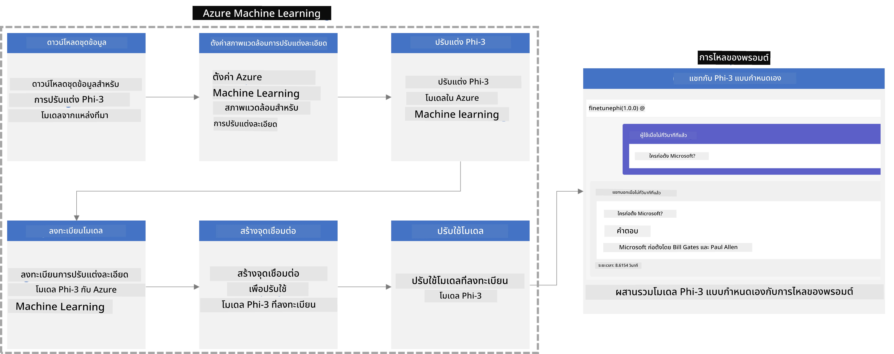

### สารบัญ

1. **[สถานการณ์ที่ 1: ตั้งค่า Azure resource และเตรียมความพร้อมสำหรับการปรับแต่ง](../../../../../../md/02.Application/01.TextAndChat/Phi3)**
    - [สร้าง Azure Machine Learning Workspace](../../../../../../md/02.Application/01.TextAndChat/Phi3)
    - [ขอโควต้า GPU ใน Azure Subscription](../../../../../../md/02.Application/01.TextAndChat/Phi3)
    - [เพิ่มการมอบหมายบทบาท](../../../../../../md/02.Application/01.TextAndChat/Phi3)
    - [ตั้งค่าโปรเจกต์](../../../../../../md/02.Application/01.TextAndChat/Phi3)
    - [เตรียมชุดข้อมูลสำหรับการปรับแต่ง](../../../../../../md/02.Application/01.TextAndChat/Phi3)

1. **[สถานการณ์ที่ 2: ปรับแต่งโมเดล Phi-3 และปรับใช้งานใน Azure Machine Learning Studio](../../../../../../md/02.Application/01.TextAndChat/Phi3)**
    - [ตั้งค่า Azure CLI](../../../../../../md/02.Application/01.TextAndChat/Phi3)
    - [ปรับแต่งโมเดล Phi-3](../../../../../../md/02.Application/01.TextAndChat/Phi3)
    - [ปรับใช้โมเดลที่ปรับแต่งแล้ว](../../../../../../md/02.Application/01.TextAndChat/Phi3)

1. **[สถานการณ์ที่ 3: รวมกับ Prompt flow และสนทนากับโมเดลที่กำหนดเองของคุณ](../../../../../../md/02.Application/01.TextAndChat/Phi3)**
    - [รวมโมเดล Phi-3 ที่กำหนดเองกับ Prompt flow](../../../../../../md/02.Application/01.TextAndChat/Phi3)
    - [สนทนากับโมเดลที่กำหนดเองของคุณ](../../../../../../md/02.Application/01.TextAndChat/Phi3)

## สถานการณ์ที่ 1: ตั้งค่า Azure resource และ เตรียมความพร้อมสำหรับการปรับแต่ง

### สร้าง Azure Machine Learning Workspace

1. พิมพ์ *azure machine learning* ใน **แถบค้นหา** ที่ด้านบนของหน้าเว็บพอร์ทัล แล้วเลือก **Azure Machine Learning** จากตัวเลือกที่ปรากฏ

    

1. เลือก **+ Create** จากเมนูนำทาง

1. เลือก **New workspace** จากเมนูนำทาง

    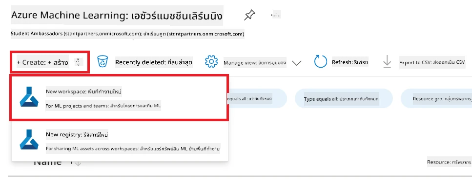

1. ดำเนินการตามขั้นตอนต่อไปนี้:

    - เลือก **Subscription** ของ Azure ของคุณ
    - เลือก **Resource group** ที่จะใช้ (สร้างใหม่หากจำเป็น)
    - กรอกชื่อ **Workspace Name** ต้องเป็นค่าที่ไม่ซ้ำกัน
    - เลือก **Region** ที่ต้องการใช้
    - เลือก **Storage account** ที่จะใช้ (สร้างใหม่หากจำเป็น)
    - เลือก **Key vault** ที่จะใช้ (สร้างใหม่หากจำเป็น)
    - เลือก **Application insights** ที่จะใช้ (สร้างใหม่หากจำเป็น)
    - เลือก **Container registry** ที่จะใช้ (สร้างใหม่หากจำเป็น)

    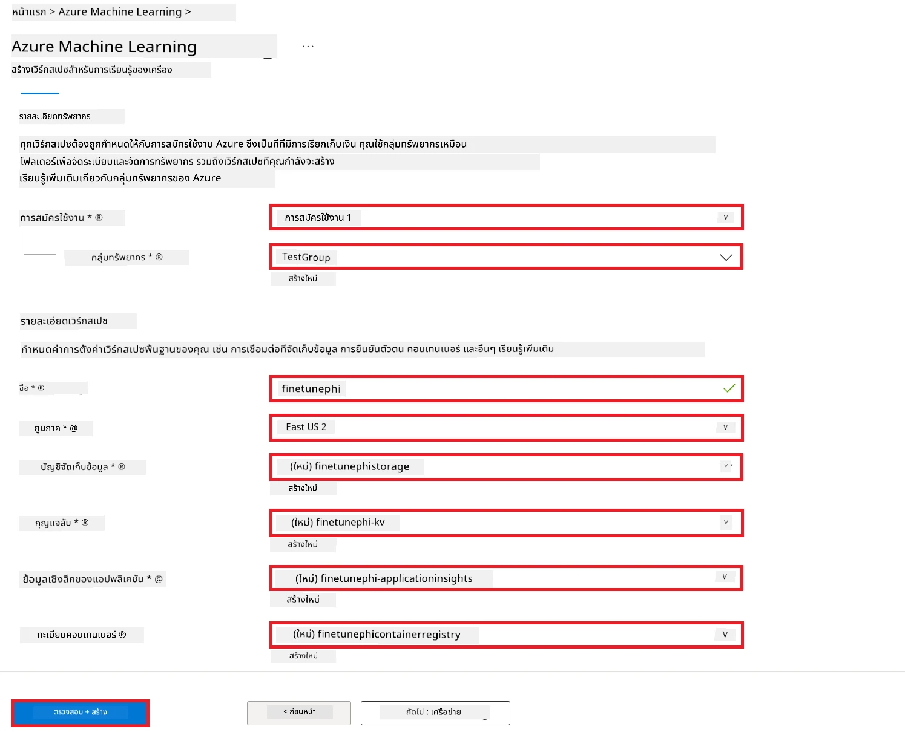

1. เลือก **Review + Create**

1. เลือก **Create**

### ขอโควต้า GPU ใน Azure Subscription

ในตัวอย่าง E2E นี้ คุณจะใช้ *Standard_NC24ads_A100_v4 GPU* สำหรับการปรับแต่ง ซึ่งจำเป็นต้องขอโควต้า และใช้ *Standard_E4s_v3* CPU สำหรับการปรับใช้ ซึ่งไม่จำเป็นต้องขอโควต้า

> [!NOTE]
>
> เฉพาะการสมัครใช้งานแบบ Pay-As-You-Go (ประเภทการสมัครใช้มาตรฐาน) เท่านั้นที่มีสิทธิ์ขอการจัดสรร GPU; การสมัครแบบ benefit subscription ยังไม่รองรับ
>
> สำหรับผู้ที่ใช้ benefit subscription (เช่น Visual Studio Enterprise Subscription) หรือผู้ที่ต้องการทดสอบกระบวนการปรับแต่งและปรับใช้งานอย่างรวดเร็ว คู่มือนี้ยังมีคำแนะนำสำหรับการปรับแต่งด้วยชุดข้อมูลขนาดเล็กโดยใช้ CPU อย่างไรก็ตามควรทราบว่าผลการปรับแต่งจะดีขึ้นอย่างมากเมื่อใช้ GPU กับชุดข้อมูลขนาดใหญ่กว่า

1. ไปที่ [Azure ML Studio](https://ml.azure.com/home?wt.mc_id=studentamb_279723)

1. ดำเนินการตามขั้นตอนต่อไปนี้เพื่อขอโควต้าของ *Standard NCADSA100v4 Family*:

    - เลือก **Quota** จากแท็บด้านซ้าย
    - เลือก **Virtual machine family** ที่จะใช้ เช่น เลือก **Standard NCADSA100v4 Family Cluster Dedicated vCPUs** ซึ่งรวมถึง *Standard_NC24ads_A100_v4* GPU
    - เลือก **Request quota** จากเมนูนำทาง

        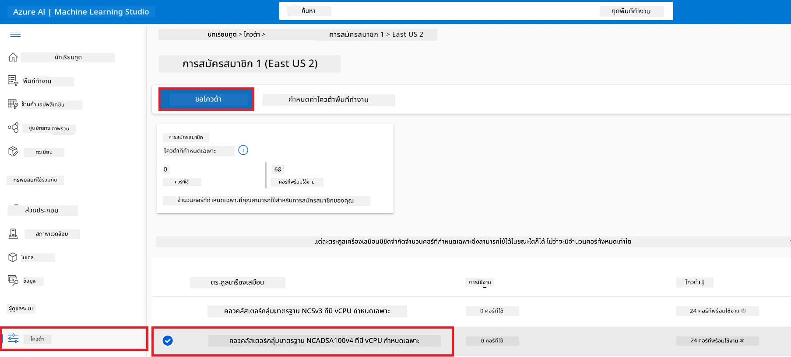

    - ในหน้า Request quota ให้กรอกค่า **New cores limit** ที่ต้องการใช้ เช่น 24
    - ในหน้า Request quota เลือก **Submit** เพื่อขอโควต้าของ GPU

> [!NOTE]
> คุณสามารถเลือก GPU หรือ CPU ที่เหมาะสมกับความต้องการของคุณโดยดูได้จากเอกสาร [Sizes for Virtual Machines in Azure](https://learn.microsoft.com/azure/virtual-machines/sizes/overview?tabs=breakdownseries%2Cgeneralsizelist%2Ccomputesizelist%2Cmemorysizelist%2Cstoragesizelist%2Cgpusizelist%2Cfpgasizelist%2Chpcsizelist)

### เพิ่มการมอบหมายบทบาท

เพื่อปรับแต่งและปรับใช้โมเดลของคุณ คุณต้องสร้าง User Assigned Managed Identity (UAI) และมอบสิทธิ์ที่เหมาะสมให้กับมันก่อน UAI นี้จะใช้สำหรับการตรวจสอบสิทธิ์ในระหว่างการปรับใช้

#### สร้าง User Assigned Managed Identity (UAI)

1. พิมพ์ *managed identities* ใน **แถบค้นหา** ที่ด้านบนของหน้าเว็บพอร์ทัล แล้วเลือก **Managed Identities** จากตัวเลือกที่ปรากฏ

    

1. เลือก **+ Create**

    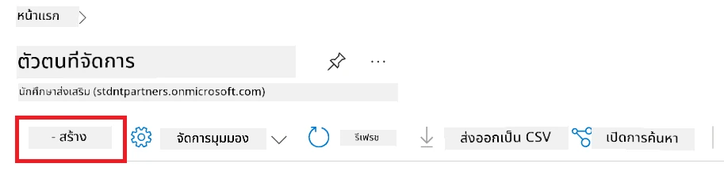

1. ดำเนินการตามขั้นตอนต่อไปนี้:

    - เลือก **Subscription** ของ Azure ของคุณ
    - เลือก **Resource group** ที่จะใช้ (สร้างใหม่หากจำเป็น)
    - เลือก **Region** ที่ต้องการใช้
    - กรอกชื่อ **Name** ต้องเป็นค่าที่ไม่ซ้ำกัน

1. เลือก **Review + create**

1. เลือก **+ Create**

#### เพิ่มมอบหมายบทบาท Contributor ให้กับ Managed Identity

1. ไปที่ Managed Identity resource ที่คุณสร้าง

1. เลือก **Azure role assignments** จากแท็บด้านซ้าย

1. เลือก **+Add role assignment** จากเมนูนำทาง

1. ในหน้า Add role assignment ดำเนินการตามขั้นตอนต่อไปนี้:
    - เลือก **Scope** เป็น **Resource group**
    - เลือก **Subscription** ของ Azure ของคุณ
    - เลือก **Resource group** ที่จะใช้
    - เลือก **Role** เป็น **Contributor**

    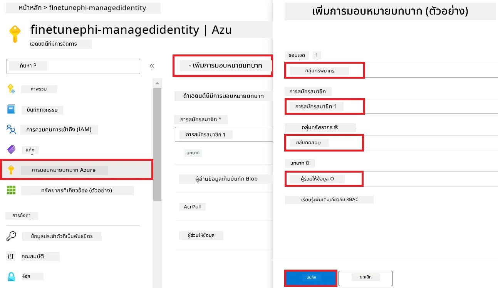

1. เลือก **Save**

#### เพิ่มมอบหมายบทบาท Storage Blob Data Reader ให้กับ Managed Identity

1. พิมพ์ *storage accounts* ใน **แถบค้นหา** ที่ด้านบนของหน้าเว็บพอร์ทัล แล้วเลือก **Storage accounts** จากตัวเลือกที่ปรากฏ

    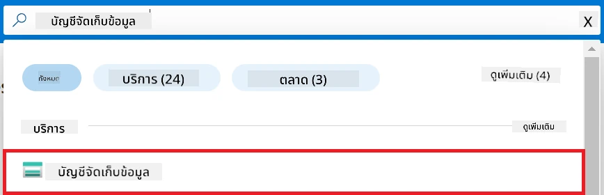

1. เลือกบัญชี storage ที่เชื่อมโยงกับ Azure Machine Learning workspace ที่คุณสร้าง เช่น *finetunephistorage*

1. ดำเนินการตามขั้นตอนต่อไปนี้เพื่อไปยังหน้า Add role assignment:

    - ไปที่ Azure Storage account ที่คุณสร้าง
    - เลือก **Access Control (IAM)** จากแท็บด้านซ้าย
    - เลือก **+ Add** จากเมนูนำทาง
    - เลือก **Add role assignment** จากเมนูนำทาง

    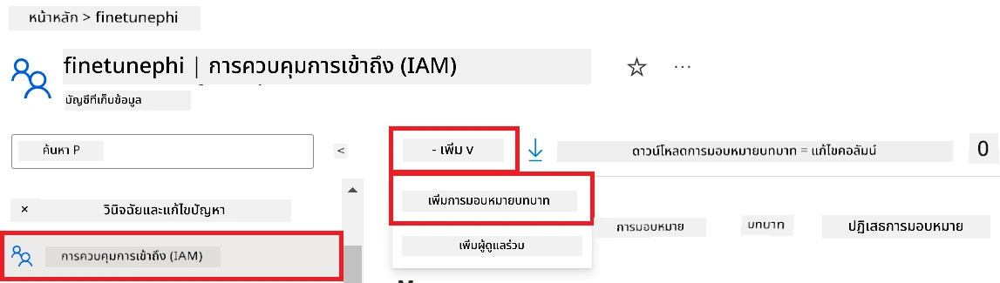

1. ในหน้า Add role assignment ดำเนินการตามขั้นตอนต่อไปนี้:

    - ในหน้า Role พิมพ์ *Storage Blob Data Reader* ใน **แถบค้นหา** และเลือก **Storage Blob Data Reader** จากตัวเลือกที่ปรากฏ
    - ในหน้า Role เลือก **Next**
    - ในหน้า Members เลือก **Assign access to** เป็น **Managed identity**
    - ในหน้า Members เลือก **+ Select members**
    - ในหน้า Select managed identities เลือก **Subscription** ของ Azure ของคุณ
    - ในหน้า Select managed identities เลือก **Managed identity** เป็น **Manage Identity**
    - ในหน้า Select managed identities เลือก Managed Identity ที่คุณสร้าง เช่น *finetunephi-managedidentity*
    - ในหน้า Select managed identities เลือก **Select**

    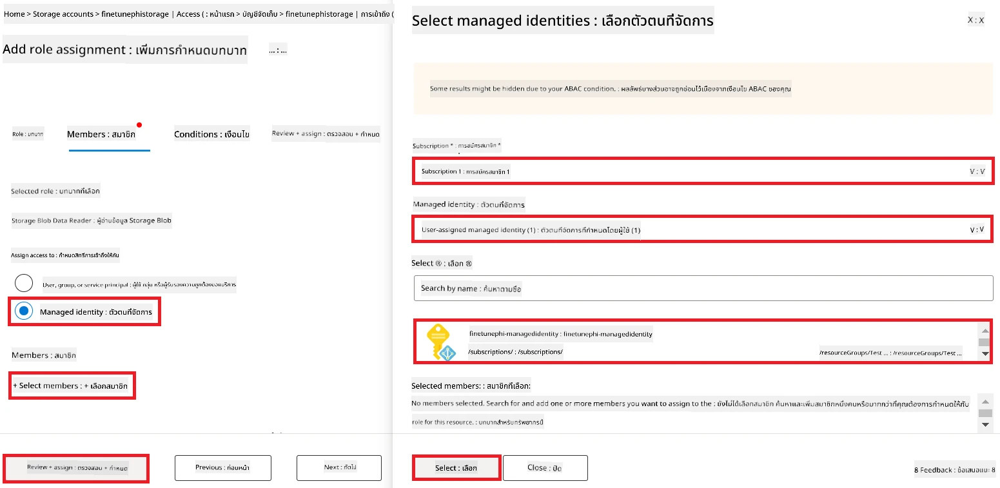

1. เลือก **Review + assign**

#### เพิ่มมอบหมายบทบาท AcrPull ให้กับ Managed Identity

1. พิมพ์ *container registries* ใน **แถบค้นหา** ที่ด้านบนของหน้าเว็บพอร์ทัล แล้วเลือก **Container registries** จากตัวเลือกที่ปรากฏ

    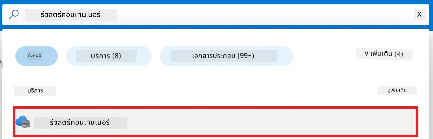

1. เลือก container registry ที่เชื่อมโยงกับ Azure Machine Learning workspace เช่น *finetunephicontainerregistries*

1. ดำเนินการตามขั้นตอนต่อไปนี้เพื่อไปยังหน้า Add role assignment:

    - เลือก **Access Control (IAM)** จากแท็บด้านซ้าย
    - เลือก **+ Add** จากเมนูนำทาง
    - เลือก **Add role assignment** จากเมนูนำทาง

1. ในหน้า Add role assignment ดำเนินการตามขั้นตอนต่อไปนี้:

    - ในหน้า Role พิมพ์ *AcrPull* ใน **แถบค้นหา** และเลือก **AcrPull** จากตัวเลือกที่ปรากฏ
    - ในหน้า Role เลือก **Next**
    - ในหน้า Members เลือก **Assign access to** เป็น **Managed identity**
    - ในหน้า Members เลือก **+ Select members**
    - ในหน้า Select managed identities เลือก **Subscription** ของ Azure ของคุณ
    - ในหน้า Select managed identities เลือก **Managed identity** เป็น **Manage Identity**
    - ในหน้า Select managed identities เลือก Managed Identity ที่คุณสร้าง เช่น *finetunephi-managedidentity*
    - ในหน้า Select managed identities เลือก **Select**
    - เลือก **Review + assign**

### ตั้งค่าโปรเจกต์

ตอนนี้ คุณจะสร้างโฟลเดอร์เพื่อทำงานภายในนั้น และตั้งค่าสภาพแวดล้อมเสมือน (virtual environment) เพื่อพัฒนาโปรแกรมที่โต้ตอบกับผู้ใช้และใช้ประวัติการสนทนาที่จัดเก็บไว้ใน Azure Cosmos DB เพื่อช่วยในการตอบกลับ

#### สร้างโฟลเดอร์เพื่อทำงานภายในนั้น

1. เปิดหน้าต่างเทอร์มินัลและพิมพ์คำสั่งต่อไปนี้เพื่อสร้างโฟลเดอร์ชื่อ *finetune-phi* ในเส้นทางเริ่มต้น

    ```console
    mkdir finetune-phi
    ```

1. พิมพ์คำสั่งต่อไปนี้ในเทอร์มินัลเพื่อไปยังโฟลเดอร์ *finetune-phi* ที่คุณสร้างไว้

    ```console
    cd finetune-phi
    ```

#### สร้างสภาพแวดล้อมเสมือน

1. พิมพ์คำสั่งต่อไปนี้ในเทอร์มินัลเพื่อสร้างสภาพแวดล้อมเสมือนชื่อ *.venv*

    ```console
    python -m venv .venv
    ```

1. พิมพ์คำสั่งต่อไปนี้ในเทอร์มินัลเพื่อเปิดใช้งานสภาพแวดล้อมเสมือน

    ```console
    .venv\Scripts\activate.bat
    ```

> [!NOTE]
>
> หากสำเร็จ คุณจะเห็น *(.venv)* ปรากฏก่อนพรอมต์คำสั่ง

#### ติดตั้งแพ็คเกจที่จำเป็น

1. พิมพ์คำสั่งเหล่านี้ในเทอร์มินัลเพื่อติดตั้งแพ็คเกจที่จำเป็น

    ```console
    pip install datasets==2.19.1
    pip install transformers==4.41.1
    pip install azure-ai-ml==1.16.0
    pip install torch==2.3.1
    pip install trl==0.9.4
    pip install promptflow==1.12.0
    ```

#### สร้างไฟล์โปรเจกต์
ในแบบฝึกหัดนี้ คุณจะสร้างไฟล์สำคัญสำหรับโครงการของเรา ไฟล์เหล่านี้ประกอบด้วยสคริปต์สำหรับดาวน์โหลดชุดข้อมูล ตั้งค่า Azure Machine Learning environment ปรับแต่งโมเดล Phi-3 และปรับใช้โมเดลที่ปรับแต่งแล้ว นอกจากนี้คุณยังจะสร้างไฟล์ *conda.yml* เพื่อกำหนดสภาพแวดล้อมสำหรับการปรับแต่ง

ในแบบฝึกหัดนี้ คุณจะ:

- สร้างไฟล์ *download_dataset.py* เพื่อดาวน์โหลดชุดข้อมูล
- สร้างไฟล์ *setup_ml.py* เพื่อกำหนดค่า Azure Machine Learning environment
- สร้างไฟล์ *fine_tune.py* ในโฟลเดอร์ *finetuning_dir* เพื่อปรับแต่งโมเดล Phi-3 โดยใช้ชุดข้อมูล
- สร้างไฟล์ *conda.yml* เพื่อกำหนดสภาพแวดล้อมสำหรับการปรับแต่ง
- สร้างไฟล์ *deploy_model.py* เพื่อปรับใช้โมเดลที่ปรับแต่งแล้ว
- สร้างไฟล์ *integrate_with_promptflow.py* เพื่อรวมโมเดลที่ปรับแต่งและรันโมเดลโดยใช้ Prompt flow
- สร้างไฟล์ flow.dag.yml เพื่อกำหนดโครงสร้างเวิร์กโฟลว์สำหรับ Prompt flow
- สร้างไฟล์ *config.py* เพื่อป้อนข้อมูล Azure

> [!NOTE]
>
> โครงสร้างโฟลเดอร์ครบถ้วน:
>
> ```text
> └── YourUserName
> .    └── finetune-phi
> .        ├── finetuning_dir
> .        │      └── fine_tune.py
> .        ├── conda.yml
> .        ├── config.py
> .        ├── deploy_model.py
> .        ├── download_dataset.py
> .        ├── flow.dag.yml
> .        ├── integrate_with_promptflow.py
> .        └── setup_ml.py
> ```

1. เปิด **Visual Studio Code**

1. เลือก **File** จากเมนูบาร์

1. เลือก **Open Folder**

1. เลือกโฟลเดอร์ *finetune-phi* ที่คุณสร้างไว้ ซึ่งอยู่ที่ *C:\Users\yourUserName\finetune-phi*

    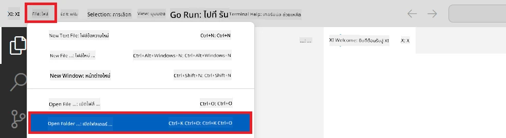

1. ในแผงด้านซ้ายของ Visual Studio Code คลิกขวาและเลือก **New File** เพื่อสร้างไฟล์ใหม่ชื่อ *download_dataset.py*

1. ในแผงด้านซ้ายของ Visual Studio Code คลิกขวาและเลือก **New File** เพื่อสร้างไฟล์ใหม่ชื่อ *setup_ml.py*

1. ในแผงด้านซ้ายของ Visual Studio Code คลิกขวาและเลือก **New File** เพื่อสร้างไฟล์ใหม่ชื่อ *deploy_model.py*

    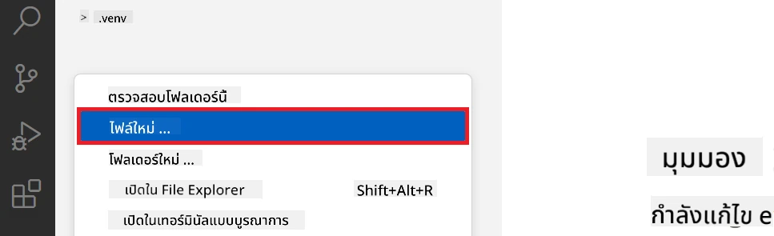

1. ในแผงด้านซ้ายของ Visual Studio Code คลิกขวาและเลือก **New Folder** เพื่อสร้างโฟลเดอร์ใหม่ชื่อ *finetuning_dir*

1. ในโฟลเดอร์ *finetuning_dir* ให้สร้างไฟล์ใหม่ชื่อ *fine_tune.py*

#### สร้างและกำหนดค่าไฟล์ *conda.yml*

1. ในแผงด้านซ้ายของ Visual Studio Code คลิกขวาและเลือก **New File** เพื่อสร้างไฟล์ใหม่ชื่อ *conda.yml*

1. เพิ่มโค้ดต่อไปนี้ลงในไฟล์ *conda.yml* เพื่อกำหนดสภาพแวดล้อมสำหรับการปรับแต่งโมเดล Phi-3

    ```yml
    name: phi-3-training-env
    channels:
      - defaults
      - conda-forge
    dependencies:
      - python=3.10
      - pip
      - numpy<2.0
      - pip:
          - torch==2.4.0
          - torchvision==0.19.0
          - trl==0.8.6
          - transformers==4.41
          - datasets==2.21.0
          - azureml-core==1.57.0
          - azure-storage-blob==12.19.0
          - azure-ai-ml==1.16
          - azure-identity==1.17.1
          - accelerate==0.33.0
          - mlflow==2.15.1
          - azureml-mlflow==1.57.0
    ```

#### สร้างและกำหนดค่าไฟล์ *config.py*

1. ในแผงด้านซ้ายของ Visual Studio Code คลิกขวาและเลือก **New File** เพื่อสร้างไฟล์ใหม่ชื่อ *config.py*

1. เพิ่มโค้ดต่อไปนี้ลงในไฟล์ *config.py* เพื่อใส่ข้อมูล Azure ของคุณ

    ```python
    # การตั้งค่า Azure
    AZURE_SUBSCRIPTION_ID = "your_subscription_id"
    AZURE_RESOURCE_GROUP_NAME = "your_resource_group_name" # "TestGroup"

    # การตั้งค่า Azure Machine Learning
    AZURE_ML_WORKSPACE_NAME = "your_workspace_name" # "finetunephi-workspace"

    # การตั้งค่า Azure Managed Identity
    AZURE_MANAGED_IDENTITY_CLIENT_ID = "your_azure_managed_identity_client_id"
    AZURE_MANAGED_IDENTITY_NAME = "your_azure_managed_identity_name" # "finetunephi-mangedidentity"
    AZURE_MANAGED_IDENTITY_RESOURCE_ID = f"/subscriptions/{AZURE_SUBSCRIPTION_ID}/resourceGroups/{AZURE_RESOURCE_GROUP_NAME}/providers/Microsoft.ManagedIdentity/userAssignedIdentities/{AZURE_MANAGED_IDENTITY_NAME}"

    # เส้นทางไฟล์ชุดข้อมูล
    TRAIN_DATA_PATH = "data/train_data.jsonl"
    TEST_DATA_PATH = "data/test_data.jsonl"

    # การตั้งค่ารุ่นที่ปรับแต่งแล้ว
    AZURE_MODEL_NAME = "your_fine_tuned_model_name" # "finetune-phi-model"
    AZURE_ENDPOINT_NAME = "your_fine_tuned_model_endpoint_name" # "finetune-phi-endpoint"
    AZURE_DEPLOYMENT_NAME = "your_fine_tuned_model_deployment_name" # "finetune-phi-deployment"

    AZURE_ML_API_KEY = "your_fine_tuned_model_api_key"
    AZURE_ML_ENDPOINT = "your_fine_tuned_model_endpoint_uri" # "https://{your-endpoint-name}.{your-region}.inference.ml.azure.com/score"
    ```

#### เพิ่มตัวแปรสภาพแวดล้อม Azure

1. ดำเนินการตามขั้นตอนต่อไปนี้เพื่อเพิ่ม Azure Subscription ID:

    - พิมพ์ *subscriptions* ใน **แถบค้นหา** ที่ด้านบนของหน้า portal และเลือก **Subscriptions** จากตัวเลือกที่ปรากฏ
    - เลือก Azure Subscription ที่คุณกำลังใช้งานอยู่
    - คัดลอกและวาง Subscription ID ของคุณลงในไฟล์ *config.py*

    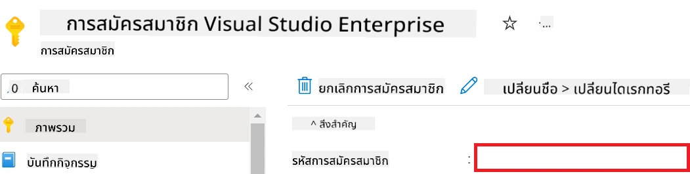

1. ดำเนินการตามขั้นตอนต่อไปนี้เพื่อเพิ่มชื่อ Azure Workspace:

    - ไปยัง Azure Machine Learning resource ที่คุณสร้างไว้
    - คัดลอกและวางชื่อบัญชีของคุณลงในไฟล์ *config.py*

    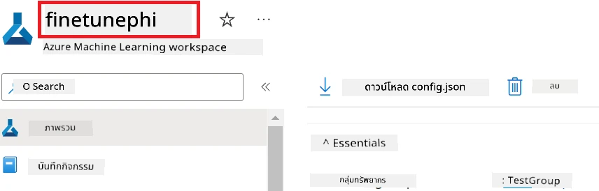

1. ดำเนินการตามขั้นตอนต่อไปนี้เพื่อเพิ่มชื่อ Azure Resource Group:

    - ไปยัง Azure Machine Learning resource ที่คุณสร้างไว้
    - คัดลอกและวางชื่อ Azure Resource Group ของคุณลงในไฟล์ *config.py*

    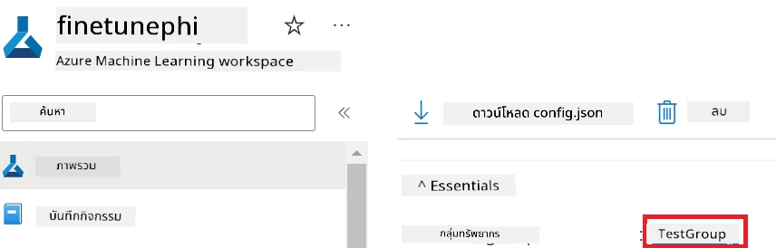

2. ดำเนินการตามขั้นตอนต่อไปนี้เพื่อเพิ่มชื่อ Azure Managed Identity

    - ไปยัง Managed Identities resource ที่คุณสร้างไว้
    - คัดลอกและวางชื่อ Azure Managed Identity ของคุณลงในไฟล์ *config.py*

    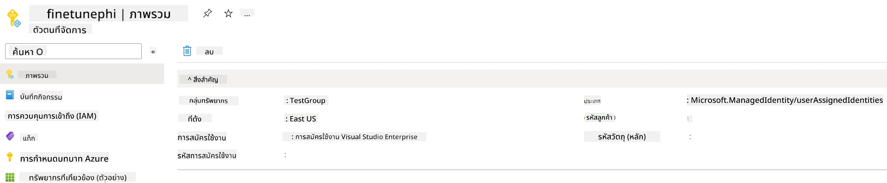

### เตรียมชุดข้อมูลสำหรับการปรับแต่ง

ในแบบฝึกหัดนี้ คุณจะรันไฟล์ *download_dataset.py* เพื่อดาวน์โหลดชุดข้อมูล *ULTRACHAT_200k* ลงในสภาพแวดล้อมในเครื่อง จากนั้นคุณจะใช้ชุดข้อมูลนี้เพื่อปรับแต่งโมเดล Phi-3 ใน Azure Machine Learning

#### ดาวน์โหลดชุดข้อมูลโดยใช้ *download_dataset.py*

1. เปิดไฟล์ *download_dataset.py* ใน Visual Studio Code

1. เพิ่มโค้ดต่อไปนี้ลงใน *download_dataset.py*

    ```python
    import json
    import os
    from datasets import load_dataset
    from config import (
        TRAIN_DATA_PATH,
        TEST_DATA_PATH)

    def load_and_split_dataset(dataset_name, config_name, split_ratio):
        """
        Load and split a dataset.
        """
        # โหลดชุดข้อมูลด้วยชื่อ การกำหนดค่า และอัตราส่วนการแบ่งที่ระบุ
        dataset = load_dataset(dataset_name, config_name, split=split_ratio)
        print(f"Original dataset size: {len(dataset)}")
        
        # แบ่งชุดข้อมูลเป็นชุดฝึกและชุดทดสอบ (80% ฝึก, 20% ทดสอบ)
        split_dataset = dataset.train_test_split(test_size=0.2)
        print(f"Train dataset size: {len(split_dataset['train'])}")
        print(f"Test dataset size: {len(split_dataset['test'])}")
        
        return split_dataset

    def save_dataset_to_jsonl(dataset, filepath):
        """
        Save a dataset to a JSONL file.
        """
        # สร้างไดเรกทอรีถ้ายังไม่มี
        os.makedirs(os.path.dirname(filepath), exist_ok=True)
        
        # เปิดไฟล์ในโหมดเขียน
        with open(filepath, 'w', encoding='utf-8') as f:
            # วนซ้ำไปยังแต่ละระเบียนในชุดข้อมูล
            for record in dataset:
                # แปลงระเบียนเป็นวัตถุ JSON และเขียนลงไฟล์
                json.dump(record, f)
                # เขียนอักขระขึ้นบรรทัดใหม่เพื่อแยกระเบียนแต่ละรายการ
                f.write('\n')
        
        print(f"Dataset saved to {filepath}")

    def main():
        """
        Main function to load, split, and save the dataset.
        """
        # โหลดและแบ่งชุดข้อมูล ULTRACHAT_200k ด้วยการกำหนดค่าและอัตราส่วนแบ่งที่เฉพาะเจาะจง
        dataset = load_and_split_dataset("HuggingFaceH4/ultrachat_200k", 'default', 'train_sft[:1%]')
        
        # ดึงชุดข้อมูลฝึกและทดสอบจากการแบ่ง
        train_dataset = dataset['train']
        test_dataset = dataset['test']

        # บันทึกชุดข้อมูลฝึกลงในไฟล์ JSONL
        save_dataset_to_jsonl(train_dataset, TRAIN_DATA_PATH)
        
        # บันทึกชุดข้อมูลทดสอบลงในไฟล์ JSONL แยกต่างหาก
        save_dataset_to_jsonl(test_dataset, TEST_DATA_PATH)

    if __name__ == "__main__":
        main()

    ```

> [!TIP]
>
> **แนวทางการปรับแต่งด้วยชุดข้อมูลขนาดเล็กโดยใช้ CPU**
>
> หากคุณต้องการใช้ CPU ในการปรับแต่ง วิธีนี้เหมาะสำหรับผู้ที่มีสิทธิพิเศษใน Subscription (เช่น Visual Studio Enterprise Subscription) หรือเพื่อทดสอบกระบวนการปรับแต่งและปรับใช้อย่างรวดเร็ว
>
> แทนที่ `dataset = load_and_split_dataset("HuggingFaceH4/ultrachat_200k", 'default', 'train_sft[:1%]')` ด้วย `dataset = load_and_split_dataset("HuggingFaceH4/ultrachat_200k", 'default', 'train_sft[:10]')`
>

1. พิมพ์คำสั่งต่อไปนี้ในเทอร์มินัลเพื่อรันสคริปต์และดาวน์โหลดชุดข้อมูลลงในสภาพแวดล้อมในเครื่องของคุณ

    ```console
    python download_data.py
    ```

1. ตรวจสอบว่าได้บันทึกชุดข้อมูลไว้ในไดเรกทอรี *finetune-phi/data* ในเครื่องของคุณเรียบร้อยแล้ว

> [!NOTE]
>
> **ขนาดชุดข้อมูลและเวลาการปรับแต่ง**
>
> ในตัวอย่าง E2E นี้ คุณใช้เพียง 1% ของชุดข้อมูล (`train_sft[:1%]`) ซึ่งช่วยลดขนาดข้อมูลอย่างมาก ทำให้การอัปโหลดและปรับแต่งเร็วขึ้น คุณสามารถปรับเปอร์เซ็นต์เพื่อหาสมดุลที่เหมาะสมระหว่างเวลาในการฝึกและประสิทธิภาพของโมเดล การใช้ชุดข้อมูลย่อยช่วยลดเวลาที่ใช้ในการปรับแต่ง ทำให้กระบวนการจัดการได้ง่ายขึ้นสำหรับตัวอย่าง E2E

## กรณีที่ 2: ปรับแต่งโมเดล Phi-3 และปรับใช้ใน Azure Machine Learning Studio

### ตั้งค่า Azure CLI

คุณต้องตั้งค่า Azure CLI เพื่อรับรองความถูกต้องของสภาพแวดล้อม Azure CLI ช่วยให้คุณจัดการ Azure resources ได้โดยตรงจากบรรทัดคำสั่งและให้ข้อมูลรับรองที่จำเป็นสำหรับ Azure Machine Learning ในการเข้าถึงทรัพยากรเหล่านี้ เริ่มต้นด้วยการติดตั้ง [Azure CLI](https://learn.microsoft.com/cli/azure/install-azure-cli)

1. เปิดหน้าต่างเทอร์มินัลและพิมพ์คำสั่งต่อไปนี้เพื่อล็อกอินเข้าบัญชี Azure ของคุณ

    ```console
    az login
    ```

1. เลือกบัญชี Azure ที่คุณต้องการใช้

1. เลือก Azure subscription ที่คุณต้องการใช้

    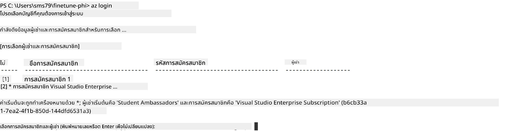

> [!TIP]
>
> หากคุณพบปัญหาในการเข้าสู่ระบบ Azure ลองใช้รหัสอุปกรณ์ เปิดเทอร์มินัลและพิมพ์คำสั่งต่อไปนี้เพื่อลงชื่อเข้าใช้บัญชี Azure ของคุณ:
>
> ```console
> az login --use-device-code
> ```
>

### ปรับแต่งโมเดล Phi-3

ในแบบฝึกหัดนี้ คุณจะปรับแต่งโมเดล Phi-3 โดยใช้ชุดข้อมูลที่ให้ไว้ ก่อนอื่นคุณจะกำหนดกระบวนการปรับแต่งในไฟล์ *fine_tune.py* จากนั้นคุณจะกำหนดค่า Azure Machine Learning environment และเริ่มกระบวนการปรับแต่งโดยรันไฟล์ *setup_ml.py* สคริปต์นี้จะทำให้มั่นใจว่าการปรับแต่งดำเนินการในสภาพแวดล้อม Azure Machine Learning

โดยการรัน *setup_ml.py* คุณจะสั่งให้กระบวนการปรับแต่งทำงานในสภาพแวดล้อม Azure Machine Learning

#### เพิ่มโค้ดในไฟล์ *fine_tune.py*

1. ไปที่โฟลเดอร์ *finetuning_dir* และเปิดไฟล์ *fine_tune.py* ใน Visual Studio Code

1. เพิ่มโค้ดต่อไปนี้ลงใน *fine_tune.py*

    ```python
    import argparse
    import sys
    import logging
    import os
    from datasets import load_dataset
    import torch
    import mlflow
    from transformers import AutoModelForCausalLM, AutoTokenizer, TrainingArguments
    from trl import SFTTrainer

    # เพื่อหลีกเลี่ยงข้อผิดพลาด INVALID_PARAMETER_VALUE ใน MLflow ให้ปิดการผสานรวม MLflow
    os.environ["DISABLE_MLFLOW_INTEGRATION"] = "True"

    # การตั้งค่าการบันทึก
    logging.basicConfig(
        format="%(asctime)s - %(levelname)s - %(name)s - %(message)s",
        datefmt="%Y-%m-%d %H:%M:%S",
        handlers=[logging.StreamHandler(sys.stdout)],
        level=logging.WARNING
    )
    logger = logging.getLogger(__name__)

    def initialize_model_and_tokenizer(model_name, model_kwargs):
        """
        Initialize the model and tokenizer with the given pretrained model name and arguments.
        """
        model = AutoModelForCausalLM.from_pretrained(model_name, **model_kwargs)
        tokenizer = AutoTokenizer.from_pretrained(model_name)
        tokenizer.model_max_length = 2048
        tokenizer.pad_token = tokenizer.unk_token
        tokenizer.pad_token_id = tokenizer.convert_tokens_to_ids(tokenizer.pad_token)
        tokenizer.padding_side = 'right'
        return model, tokenizer

    def apply_chat_template(example, tokenizer):
        """
        Apply a chat template to tokenize messages in the example.
        """
        messages = example["messages"]
        if messages[0]["role"] != "system":
            messages.insert(0, {"role": "system", "content": ""})
        example["text"] = tokenizer.apply_chat_template(
            messages, tokenize=False, add_generation_prompt=False
        )
        return example

    def load_and_preprocess_data(train_filepath, test_filepath, tokenizer):
        """
        Load and preprocess the dataset.
        """
        train_dataset = load_dataset('json', data_files=train_filepath, split='train')
        test_dataset = load_dataset('json', data_files=test_filepath, split='train')
        column_names = list(train_dataset.features)

        train_dataset = train_dataset.map(
            apply_chat_template,
            fn_kwargs={"tokenizer": tokenizer},
            num_proc=10,
            remove_columns=column_names,
            desc="Applying chat template to train dataset",
        )

        test_dataset = test_dataset.map(
            apply_chat_template,
            fn_kwargs={"tokenizer": tokenizer},
            num_proc=10,
            remove_columns=column_names,
            desc="Applying chat template to test dataset",
        )

        return train_dataset, test_dataset

    def train_and_evaluate_model(train_dataset, test_dataset, model, tokenizer, output_dir):
        """
        Train and evaluate the model.
        """
        training_args = TrainingArguments(
            bf16=True,
            do_eval=True,
            output_dir=output_dir,
            eval_strategy="epoch",
            learning_rate=5.0e-06,
            logging_steps=20,
            lr_scheduler_type="cosine",
            num_train_epochs=3,
            overwrite_output_dir=True,
            per_device_eval_batch_size=4,
            per_device_train_batch_size=4,
            remove_unused_columns=True,
            save_steps=500,
            seed=0,
            gradient_checkpointing=True,
            gradient_accumulation_steps=1,
            warmup_ratio=0.2,
        )

        trainer = SFTTrainer(
            model=model,
            args=training_args,
            train_dataset=train_dataset,
            eval_dataset=test_dataset,
            max_seq_length=2048,
            dataset_text_field="text",
            tokenizer=tokenizer,
            packing=True
        )

        train_result = trainer.train()
        trainer.log_metrics("train", train_result.metrics)

        mlflow.transformers.log_model(
            transformers_model={"model": trainer.model, "tokenizer": tokenizer},
            artifact_path=output_dir,
        )

        tokenizer.padding_side = 'left'
        eval_metrics = trainer.evaluate()
        eval_metrics["eval_samples"] = len(test_dataset)
        trainer.log_metrics("eval", eval_metrics)

    def main(train_file, eval_file, model_output_dir):
        """
        Main function to fine-tune the model.
        """
        model_kwargs = {
            "use_cache": False,
            "trust_remote_code": True,
            "torch_dtype": torch.bfloat16,
            "device_map": None,
            "attn_implementation": "eager"
        }

        # pretrained_model_name = "microsoft/Phi-3-mini-4k-instruct"
        pretrained_model_name = "microsoft/Phi-3.5-mini-instruct"

        with mlflow.start_run():
            model, tokenizer = initialize_model_and_tokenizer(pretrained_model_name, model_kwargs)
            train_dataset, test_dataset = load_and_preprocess_data(train_file, eval_file, tokenizer)
            train_and_evaluate_model(train_dataset, test_dataset, model, tokenizer, model_output_dir)

    if __name__ == "__main__":
        parser = argparse.ArgumentParser()
        parser.add_argument("--train-file", type=str, required=True, help="Path to the training data")
        parser.add_argument("--eval-file", type=str, required=True, help="Path to the evaluation data")
        parser.add_argument("--model_output_dir", type=str, required=True, help="Directory to save the fine-tuned model")
        args = parser.parse_args()
        main(args.train_file, args.eval_file, args.model_output_dir)

    ```

1. บันทึกและปิดไฟล์ *fine_tune.py*

> [!TIP]
> **คุณสามารถปรับแต่งโมเดล Phi-3.5 ได้**
>
> ในไฟล์ *fine_tune.py* คุณสามารถเปลี่ยนค่า `pretrained_model_name` จาก `"microsoft/Phi-3-mini-4k-instruct"` เป็นโมเดลที่คุณต้องการปรับแต่ง เช่น หากเปลี่ยนเป็น `"microsoft/Phi-3.5-mini-instruct"` คุณจะใช้โมเดล Phi-3.5-mini-instruct ในการปรับแต่ง เพื่อค้นหาและใช้ชื่อโมเดลที่คุณต้องการ ให้ไปที่ [Hugging Face](https://huggingface.co/) ค้นหาโมเดลที่สนใจ แล้วคัดลอกชื่อโมเดลไปวางในฟิลด์ `pretrained_model_name` ในสคริปต์ของคุณ
>
> <image type="content" src="../../../../imgs/02/FineTuning-PromptFlow/finetunephi3.5.png" alt-text="ปรับแต่ง Phi-3.5.">
>

#### เพิ่มโค้ดในไฟล์ *setup_ml.py*

1. เปิดไฟล์ *setup_ml.py* ใน Visual Studio Code

1. เพิ่มโค้ดต่อไปนี้ลงใน *setup_ml.py*

    ```python
    import logging
    from azure.ai.ml import MLClient, command, Input
    from azure.ai.ml.entities import Environment, AmlCompute
    from azure.identity import AzureCliCredential
    from config import (
        AZURE_SUBSCRIPTION_ID,
        AZURE_RESOURCE_GROUP_NAME,
        AZURE_ML_WORKSPACE_NAME,
        TRAIN_DATA_PATH,
        TEST_DATA_PATH
    )

    # ค่าคงที่

    # เอาคอมเมนต์ออกจากบรรทัดต่อไปนี้เพื่อใช้ instance CPU สำหรับการฝึก
    # COMPUTE_INSTANCE_TYPE = "Standard_E16s_v3" # cpu
    # COMPUTE_NAME = "cpu-e16s-v3"
    # DOCKER_IMAGE_NAME = "mcr.microsoft.com/azureml/openmpi4.1.0-ubuntu20.04:latest"

    # เอาคอมเมนต์ออกจากบรรทัดต่อไปนี้เพื่อใช้ instance GPU สำหรับการฝึก
    COMPUTE_INSTANCE_TYPE = "Standard_NC24ads_A100_v4"
    COMPUTE_NAME = "gpu-nc24s-a100-v4"
    DOCKER_IMAGE_NAME = "mcr.microsoft.com/azureml/curated/acft-hf-nlp-gpu:59"

    CONDA_FILE = "conda.yml"
    LOCATION = "eastus2" # แทนที่ด้วยตำแหน่งของ compute cluster ของคุณ
    FINETUNING_DIR = "./finetuning_dir" # เส้นทางไปยังสคริปต์ปรับแต่งแบบละเอียด
    TRAINING_ENV_NAME = "phi-3-training-environment" # ชื่อของสภาพแวดล้อมการฝึก
    MODEL_OUTPUT_DIR = "./model_output" # เส้นทางไปยังไดเร็กทอรีเอาต์พุตของโมเดลใน azure ml

    # ตั้งค่าการบันทึกเพื่อติดตามกระบวนการ
    logger = logging.getLogger(__name__)
    logging.basicConfig(
        format="%(asctime)s - %(levelname)s - %(name)s - %(message)s",
        datefmt="%Y-%m-%d %H:%M:%S",
        level=logging.WARNING
    )

    def get_ml_client():
        """
        Initialize the ML Client using Azure CLI credentials.
        """
        credential = AzureCliCredential()
        return MLClient(credential, AZURE_SUBSCRIPTION_ID, AZURE_RESOURCE_GROUP_NAME, AZURE_ML_WORKSPACE_NAME)

    def create_or_get_environment(ml_client):
        """
        Create or update the training environment in Azure ML.
        """
        env = Environment(
            image=DOCKER_IMAGE_NAME,  # Docker image สำหรับสภาพแวดล้อม
            conda_file=CONDA_FILE,  # ไฟล์สภาพแวดล้อม Conda
            name=TRAINING_ENV_NAME,  # ชื่อของสภาพแวดล้อม
        )
        return ml_client.environments.create_or_update(env)

    def create_or_get_compute_cluster(ml_client, compute_name, COMPUTE_INSTANCE_TYPE, location):
        """
        Create or update the compute cluster in Azure ML.
        """
        try:
            compute_cluster = ml_client.compute.get(compute_name)
            logger.info(f"Compute cluster '{compute_name}' already exists. Reusing it for the current run.")
        except Exception:
            logger.info(f"Compute cluster '{compute_name}' does not exist. Creating a new one with size {COMPUTE_INSTANCE_TYPE}.")
            compute_cluster = AmlCompute(
                name=compute_name,
                size=COMPUTE_INSTANCE_TYPE,
                location=location,
                tier="Dedicated",  # ชั้นของ compute cluster
                min_instances=0,  # จำนวน instance ขั้นต่ำ
                max_instances=1  # จำนวน instance สูงสุด
            )
            ml_client.compute.begin_create_or_update(compute_cluster).wait()  # รอให้คลัสเตอร์ถูกสร้าง
        return compute_cluster

    def create_fine_tuning_job(env, compute_name):
        """
        Set up the fine-tuning job in Azure ML.
        """
        return command(
            code=FINETUNING_DIR,  # เส้นทางไปยัง fine_tune.py
            command=(
                "python fine_tune.py "
                "--train-file ${{inputs.train_file}} "
                "--eval-file ${{inputs.eval_file}} "
                "--model_output_dir ${{inputs.model_output}}"
            ),
            environment=env,  # สภาพแวดล้อมการฝึก
            compute=compute_name,  # ใช้ compute cluster
            inputs={
                "train_file": Input(type="uri_file", path=TRAIN_DATA_PATH),  # เส้นทางไปยังไฟล์ข้อมูลฝึก
                "eval_file": Input(type="uri_file", path=TEST_DATA_PATH),  # เส้นทางไปยังไฟล์ข้อมูลประเมินผล
                "model_output": MODEL_OUTPUT_DIR
            }
        )

    def main():
        """
        Main function to set up and run the fine-tuning job in Azure ML.
        """
        # เริ่มต้น ML Client
        ml_client = get_ml_client()

        # สร้าง Environment
        env = create_or_get_environment(ml_client)
        
        # สร้างหรือรับคลัสเตอร์การประมวลผลที่มีอยู่แล้ว
        create_or_get_compute_cluster(ml_client, COMPUTE_NAME, COMPUTE_INSTANCE_TYPE, LOCATION)

        # สร้างและส่งงานปรับแต่งแบบละเอียด
        job = create_fine_tuning_job(env, COMPUTE_NAME)
        returned_job = ml_client.jobs.create_or_update(job)  # ส่งงาน
        ml_client.jobs.stream(returned_job.name)  # สตรีมบันทึกงาน
        
        # เก็บชื่อของงาน
        job_name = returned_job.name
        print(f"Job name: {job_name}")

    if __name__ == "__main__":
        main()

    ```

1. แทนที่ `COMPUTE_INSTANCE_TYPE`, `COMPUTE_NAME` และ `LOCATION` ด้วยรายละเอียดของคุณ

    ```python
   # ยกเลิกการคอมเมนต์บรรทัดต่อไปนี้เพื่อใช้อินสแตนซ์ GPU สำหรับการฝึกอบรม
    COMPUTE_INSTANCE_TYPE = "Standard_NC24ads_A100_v4"
    COMPUTE_NAME = "gpu-nc24s-a100-v4"
    ...
    LOCATION = "eastus2" # แทนที่ด้วยตำแหน่งของคลัสเตอร์คอมพิวต์ของคุณ
    ```

> [!TIP]
>
> **แนวทางการปรับแต่งด้วยชุดข้อมูลขนาดเล็กโดยใช้ CPU**
>
> หากคุณต้องการใช้ CPU ในการปรับแต่ง วิธีนี้เหมาะสำหรับผู้ที่มีสิทธิพิเศษใน Subscription (เช่น Visual Studio Enterprise Subscription) หรือเพื่อทดสอบกระบวนการปรับแต่งและปรับใช้อย่างรวดเร็ว
>
> 1. เปิดไฟล์ *setup_ml*
> 2. แทนที่ `COMPUTE_INSTANCE_TYPE`, `COMPUTE_NAME` และ `DOCKER_IMAGE_NAME` ด้วยค่าต่อไปนี้ หากคุณไม่มีสิทธิ์ใช้งาน *Standard_E16s_v3* คุณสามารถใช้ instance CPU ที่เทียบเท่าหรือขอโควต้าใหม่
> 3. แทนที่ `LOCATION` ด้วยรายละเอียดของคุณ
>
>    ```python
>    # Uncomment the following lines to use a CPU instance for training
>    COMPUTE_INSTANCE_TYPE = "Standard_E16s_v3" # cpu
>    COMPUTE_NAME = "cpu-e16s-v3"
>    DOCKER_IMAGE_NAME = "mcr.microsoft.com/azureml/openmpi4.1.0-ubuntu20.04:latest"
>    LOCATION = "eastus2" # Replace with the location of your compute cluster
>    ```
>

1. พิมพ์คำสั่งต่อไปนี้เพื่อตัวสคริปต์ *setup_ml.py* เริ่มกระบวนการปรับแต่งใน Azure Machine Learning

    ```python
    python setup_ml.py
    ```

1. ในแบบฝึกหัดนี้ คุณได้ปรับแต่งโมเดล Phi-3 เรียบร้อยแล้วโดยใช้ Azure Machine Learning โดยการรันสคริปต์ *setup_ml.py* คุณได้ตั้งค่า Azure Machine Learning environment และเริ่มกระบวนการปรับแต่งที่กำหนดไว้ในไฟล์ *fine_tune.py* โปรดทราบว่าการปรับแต่งอาจใช้เวลานาน หลังจากรันคำสั่ง `python setup_ml.py` คุณต้องรอให้กระบวนการเสร็จสิ้น คุณสามารถติดตามสถานะงานปรับแต่งได้โดยคลิกลิงก์ที่ให้ไว้ในเทอร์มินัลเพื่อเข้าสู่ Azure Machine Learning portal

    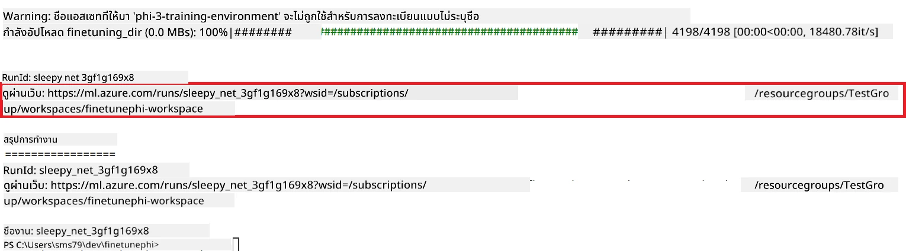

### ปรับใช้โมเดลที่ปรับแต่งแล้ว

สำหรับการรวมโมเดล Phi-3 ที่ปรับแต่งแล้วเข้ากับ Prompt Flow คุณต้องปรับใช้โมเดลเพื่อให้สามารถเข้าถึงสำหรับการประเมินผลแบบเรียลไทม์ได้ กระบวนการนี้ประกอบด้วยการลงทะเบียนโมเดล สร้าง endpoint ออนไลน์ และปรับใช้โมเดล

#### ตั้งชื่อโมเดล ชื่อ endpoint และชื่อ deployment สำหรับการปรับใช้

1. เปิดไฟล์ *config.py*

1. แทนที่ `AZURE_MODEL_NAME = "your_fine_tuned_model_name"` ด้วยชื่อโมเดลที่คุณต้องการ

1. แทนที่ `AZURE_ENDPOINT_NAME = "your_fine_tuned_model_endpoint_name"` ด้วยชื่อ endpoint ที่คุณต้องการ

1. แทนที่ `AZURE_DEPLOYMENT_NAME = "your_fine_tuned_model_deployment_name"` ด้วยชื่อ deployment ที่คุณต้องการ

#### เพิ่มโค้ดในไฟล์ *deploy_model.py*

การรันไฟล์ *deploy_model.py* จะทำให้กระบวนการปรับใช้ทั้งหมดดำเนินการโดยอัตโนมัติ ซึ่งรวมถึงการลงทะเบียนโมเดล สร้าง endpoint และปรับใช้ตามการตั้งค่าที่ระบุไว้ในไฟล์ config.py ซึ่งประกอบด้วยชื่อโมเดล ชื่อ endpoint และชื่อ deployment

1. เปิดไฟล์ *deploy_model.py* ใน Visual Studio Code

1. เพิ่มโค้ดต่อไปนี้ลงใน *deploy_model.py*

    ```python
    import logging
    from azure.identity import AzureCliCredential
    from azure.ai.ml import MLClient
    from azure.ai.ml.entities import Model, ProbeSettings, ManagedOnlineEndpoint, ManagedOnlineDeployment, IdentityConfiguration, ManagedIdentityConfiguration, OnlineRequestSettings
    from azure.ai.ml.constants import AssetTypes

    # การนำเข้าการตั้งค่า
    from config import (
        AZURE_SUBSCRIPTION_ID,
        AZURE_RESOURCE_GROUP_NAME,
        AZURE_ML_WORKSPACE_NAME,
        AZURE_MANAGED_IDENTITY_RESOURCE_ID,
        AZURE_MANAGED_IDENTITY_CLIENT_ID,
        AZURE_MODEL_NAME,
        AZURE_ENDPOINT_NAME,
        AZURE_DEPLOYMENT_NAME
    )

    # ค่าคงที่
    JOB_NAME = "your-job-name"
    COMPUTE_INSTANCE_TYPE = "Standard_E4s_v3"

    deployment_env_vars = {
        "SUBSCRIPTION_ID": AZURE_SUBSCRIPTION_ID,
        "RESOURCE_GROUP_NAME": AZURE_RESOURCE_GROUP_NAME,
        "UAI_CLIENT_ID": AZURE_MANAGED_IDENTITY_CLIENT_ID,
    }

    # การตั้งค่าการบันทึก
    logging.basicConfig(
        format="%(asctime)s - %(levelname)s - %(name)s - %(message)s",
        datefmt="%Y-%m-%d %H:%M:%S",
        level=logging.DEBUG
    )
    logger = logging.getLogger(__name__)

    def get_ml_client():
        """Initialize and return the ML Client."""
        credential = AzureCliCredential()
        return MLClient(credential, AZURE_SUBSCRIPTION_ID, AZURE_RESOURCE_GROUP_NAME, AZURE_ML_WORKSPACE_NAME)

    def register_model(ml_client, model_name, job_name):
        """Register a new model."""
        model_path = f"azureml://jobs/{job_name}/outputs/artifacts/paths/model_output"
        logger.info(f"Registering model {model_name} from job {job_name} at path {model_path}.")
        run_model = Model(
            path=model_path,
            name=model_name,
            description="Model created from run.",
            type=AssetTypes.MLFLOW_MODEL,
        )
        model = ml_client.models.create_or_update(run_model)
        logger.info(f"Registered model ID: {model.id}")
        return model

    def delete_existing_endpoint(ml_client, endpoint_name):
        """Delete existing endpoint if it exists."""
        try:
            endpoint_result = ml_client.online_endpoints.get(name=endpoint_name)
            logger.info(f"Deleting existing endpoint {endpoint_name}.")
            ml_client.online_endpoints.begin_delete(name=endpoint_name).result()
            logger.info(f"Deleted existing endpoint {endpoint_name}.")
        except Exception as e:
            logger.info(f"No existing endpoint {endpoint_name} found to delete: {e}")

    def create_or_update_endpoint(ml_client, endpoint_name, description=""):
        """Create or update an endpoint."""
        delete_existing_endpoint(ml_client, endpoint_name)
        logger.info(f"Creating new endpoint {endpoint_name}.")
        endpoint = ManagedOnlineEndpoint(
            name=endpoint_name,
            description=description,
            identity=IdentityConfiguration(
                type="user_assigned",
                user_assigned_identities=[ManagedIdentityConfiguration(resource_id=AZURE_MANAGED_IDENTITY_RESOURCE_ID)]
            )
        )
        endpoint_result = ml_client.online_endpoints.begin_create_or_update(endpoint).result()
        logger.info(f"Created new endpoint {endpoint_name}.")
        return endpoint_result

    def create_or_update_deployment(ml_client, endpoint_name, deployment_name, model):
        """Create or update a deployment."""

        logger.info(f"Creating deployment {deployment_name} for endpoint {endpoint_name}.")
        deployment = ManagedOnlineDeployment(
            name=deployment_name,
            endpoint_name=endpoint_name,
            model=model.id,
            instance_type=COMPUTE_INSTANCE_TYPE,
            instance_count=1,
            environment_variables=deployment_env_vars,
            request_settings=OnlineRequestSettings(
                max_concurrent_requests_per_instance=3,
                request_timeout_ms=180000,
                max_queue_wait_ms=120000
            ),
            liveness_probe=ProbeSettings(
                failure_threshold=30,
                success_threshold=1,
                period=100,
                initial_delay=500,
            ),
            readiness_probe=ProbeSettings(
                failure_threshold=30,
                success_threshold=1,
                period=100,
                initial_delay=500,
            ),
        )
        deployment_result = ml_client.online_deployments.begin_create_or_update(deployment).result()
        logger.info(f"Created deployment {deployment.name} for endpoint {endpoint_name}.")
        return deployment_result

    def set_traffic_to_deployment(ml_client, endpoint_name, deployment_name):
        """Set traffic to the specified deployment."""
        try:
            # ดึงรายละเอียดของจุดสิ้นสุดปัจจุบัน
            endpoint = ml_client.online_endpoints.get(name=endpoint_name)
            
            # บันทึกการจัดสรรปริมาณการจราจรปัจจุบันสำหรับการดีบัก
            logger.info(f"Current traffic allocation: {endpoint.traffic}")
            
            # ตั้งค่าการจัดสรรปริมาณการจราจรสำหรับการปรับใช้
            endpoint.traffic = {deployment_name: 100}
            
            # อัปเดตจุดสิ้นสุดด้วยการจัดสรรปริมาณการจราจรใหม่
            endpoint_poller = ml_client.online_endpoints.begin_create_or_update(endpoint)
            updated_endpoint = endpoint_poller.result()
            
            # บันทึกการจัดสรรปริมาณการจราจรที่อัปเดตสำหรับการดีบัก
            logger.info(f"Updated traffic allocation: {updated_endpoint.traffic}")
            logger.info(f"Set traffic to deployment {deployment_name} at endpoint {endpoint_name}.")
            return updated_endpoint
        except Exception as e:
            # บันทึกข้อผิดพลาดที่เกิดขึ้นในระหว่างกระบวนการ
            logger.error(f"Failed to set traffic to deployment: {e}")
            raise


    def main():
        ml_client = get_ml_client()

        registered_model = register_model(ml_client, AZURE_MODEL_NAME, JOB_NAME)
        logger.info(f"Registered model ID: {registered_model.id}")

        endpoint = create_or_update_endpoint(ml_client, AZURE_ENDPOINT_NAME, "Endpoint for finetuned Phi-3 model")
        logger.info(f"Endpoint {AZURE_ENDPOINT_NAME} is ready.")

        try:
            deployment = create_or_update_deployment(ml_client, AZURE_ENDPOINT_NAME, AZURE_DEPLOYMENT_NAME, registered_model)
            logger.info(f"Deployment {AZURE_DEPLOYMENT_NAME} is created for endpoint {AZURE_ENDPOINT_NAME}.")

            set_traffic_to_deployment(ml_client, AZURE_ENDPOINT_NAME, AZURE_DEPLOYMENT_NAME)
            logger.info(f"Traffic is set to deployment {AZURE_DEPLOYMENT_NAME} at endpoint {AZURE_ENDPOINT_NAME}.")
        except Exception as e:
            logger.error(f"Failed to create or update deployment: {e}")

    if __name__ == "__main__":
        main()

    ```

1. ดำเนินการตามขั้นตอนต่อไปนี้เพื่อรับ `JOB_NAME`:

    - ไปยัง Azure Machine Learning resource ที่คุณสร้างไว้
    - เลือก **Studio web URL** เพื่อเปิดเวิร์กสเปซของ Azure Machine Learning
    - เลือก **Jobs** จากแท็บด้านซ้าย
    - เลือก experiment สำหรับการปรับแต่ง เช่น *finetunephi*
    - เลือกงาน (job) ที่คุณสร้างไว้
- คัดลอกและวางชื่องานของคุณลงใน `JOB_NAME = "your-job-name"` ในไฟล์ *deploy_model.py*

1. เปลี่ยน `COMPUTE_INSTANCE_TYPE` เป็นรายละเอียดเฉพาะของคุณ

1. พิมพ์คำสั่งต่อไปนี้เพื่อรันสคริปต์ *deploy_model.py* และเริ่มกระบวนการดีพลอยใน Azure Machine Learning

    ```python
    python deploy_model.py
    ```

> [!WARNING]
> เพื่อหลีกเลี่ยงค่าธรรมเนียมเพิ่มเติมในบัญชีของคุณ โปรดตรวจสอบให้แน่ใจว่าคุณได้ลบจุดเชื่อมต่อที่สร้างขึ้นใน Azure Machine Learning workspace แล้ว
>

#### ตรวจสอบสถานะการดีพลอยใน Azure Machine Learning Workspace

1. เยี่ยมชม [Azure ML Studio](https://ml.azure.com/home?wt.mc_id=studentamb_279723)

1. ไปที่ Azure Machine Learning workspace ที่คุณสร้างขึ้น

1. เลือก **Studio web URL** เพื่อเปิด Azure Machine Learning workspace

1. เลือก **Endpoints** จากแท็บด้านซ้าย

    

2. เลือกจุดเชื่อมต่อที่คุณสร้างขึ้น

    

3. บนหน้านี้คุณสามารถจัดการจุดเชื่อมต่อที่สร้างขึ้นในระหว่างกระบวนการดีพลอย

## กรณีที่ 3: รวมเข้ากับ Prompt flow และแชทกับโมเดลที่คุณปรับแต่งเอง

### รวมโมเดล Phi-3 ที่ปรับแต่งเองกับ Prompt flow

หลังจากที่คุณประสบความสำเร็จในการดีพลอยโมเดลที่คุณปรับแต่งแล้ว คุณสามารถรวมมันเข้ากับ Prompt flow เพื่อใช้โมเดลของคุณในแอปพลิเคชันแบบเรียลไทม์ ซึ่งช่วยให้ทำงานแบบโต้ตอบหลายรูปแบบกับโมเดล Phi-3 ที่ปรับแต่งเองของคุณได้

#### ตั้งค่า api key และ endpoint uri ของโมเดล Phi-3 ที่ปรับแต่งแล้ว

1. ไปที่ Azure Machine Learning workspace ที่คุณสร้างขึ้น
1. เลือก **Endpoints** จากแท็บด้านซ้าย
1. เลือกจุดเชื่อมต่อที่คุณสร้างขึ้น
1. เลือก **Consume** จากเมนูนำทาง
1. คัดลอกและวาง **REST endpoint** ของคุณลงในไฟล์ *config.py* โดยแทนที่ `AZURE_ML_ENDPOINT = "your_fine_tuned_model_endpoint_uri"` ด้วย **REST endpoint** ของคุณ
1. คัดลอกและวาง **Primary key** ของคุณลงในไฟล์ *config.py* โดยแทนที่ `AZURE_ML_API_KEY = "your_fine_tuned_model_api_key"` ด้วย **Primary key** ของคุณ

    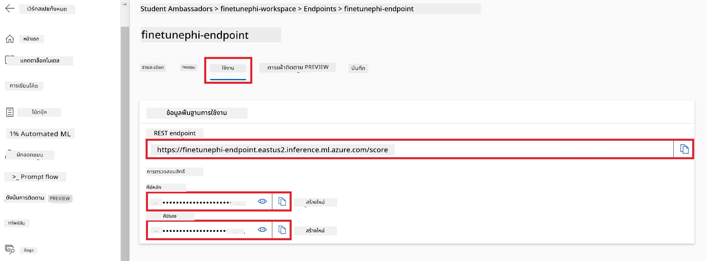

#### เพิ่มโค้ดในไฟล์ *flow.dag.yml*

1. เปิดไฟล์ *flow.dag.yml* ใน Visual Studio Code

1. เพิ่มโค้ดต่อไปนี้ใน *flow.dag.yml*

    ```yml
    inputs:
      input_data:
        type: string
        default: "Who founded Microsoft?"

    outputs:
      answer:
        type: string
        reference: ${integrate_with_promptflow.output}

    nodes:
    - name: integrate_with_promptflow
      type: python
      source:
        type: code
        path: integrate_with_promptflow.py
      inputs:
        input_data: ${inputs.input_data}
    ```

#### เพิ่มโค้ดในไฟล์ *integrate_with_promptflow.py*

1. เปิดไฟล์ *integrate_with_promptflow.py* ใน Visual Studio Code

1. เพิ่มโค้ดต่อไปนี้ใน *integrate_with_promptflow.py*

    ```python
    import logging
    import requests
    from promptflow.core import tool
    import asyncio
    import platform
    from config import (
        AZURE_ML_ENDPOINT,
        AZURE_ML_API_KEY
    )

    # การตั้งค่าการบันทึก
    logging.basicConfig(
        format="%(asctime)s - %(levelname)s - %(name)s - %(message)s",
        datefmt="%Y-%m-%d %H:%M:%S",
        level=logging.DEBUG
    )
    logger = logging.getLogger(__name__)

    def query_azml_endpoint(input_data: list, endpoint_url: str, api_key: str) -> str:
        """
        Send a request to the Azure ML endpoint with the given input data.
        """
        headers = {
            "Content-Type": "application/json",
            "Authorization": f"Bearer {api_key}"
        }
        data = {
            "input_data": [input_data],
            "params": {
                "temperature": 0.7,
                "max_new_tokens": 128,
                "do_sample": True,
                "return_full_text": True
            }
        }
        try:
            response = requests.post(endpoint_url, json=data, headers=headers)
            response.raise_for_status()
            result = response.json()[0]
            logger.info("Successfully received response from Azure ML Endpoint.")
            return result
        except requests.exceptions.RequestException as e:
            logger.error(f"Error querying Azure ML Endpoint: {e}")
            raise

    def setup_asyncio_policy():
        """
        Setup asyncio event loop policy for Windows.
        """
        if platform.system() == 'Windows':
            asyncio.set_event_loop_policy(asyncio.WindowsSelectorEventLoopPolicy())
            logger.info("Set Windows asyncio event loop policy.")

    @tool
    def my_python_tool(input_data: str) -> str:
        """
        Tool function to process input data and query the Azure ML endpoint.
        """
        setup_asyncio_policy()
        return query_azml_endpoint(input_data, AZURE_ML_ENDPOINT, AZURE_ML_API_KEY)

    ```

### แชทกับโมเดลที่คุณปรับแต่งเอง

1. พิมพ์คำสั่งต่อไปนี้เพื่อรันสคริปต์ *deploy_model.py* และเริ่มกระบวนการดีพลอยใน Azure Machine Learning

    ```python
    pf flow serve --source ./ --port 8080 --host localhost
    ```

1. นี่คือตัวอย่างผลลัพธ์: ตอนนี้คุณสามารถแชทกับโมเดล Phi-3 ที่คุณปรับแต่งเองได้ แนะนำให้ถามคำถามที่เกี่ยวข้องกับข้อมูลที่ใช้สำหรับการปรับแต่ง

    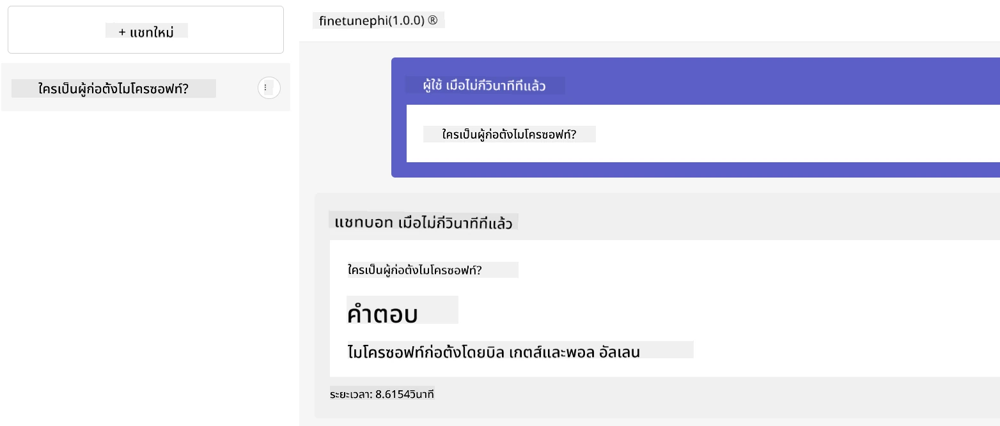

---

<!-- CO-OP TRANSLATOR DISCLAIMER START -->
**คำปฏิเสธความรับผิดชอบ**:
เอกสารนี้ได้รับการแปลโดยใช้บริการแปลภาษา AI [Co-op Translator](https://github.com/Azure/co-op-translator) แม้เราจะพยายามให้ความถูกต้องสูงสุด โปรดทราบว่าการแปลอัตโนมัติอาจมีข้อผิดพลาดหรือความไม่แม่นยำ เอกสารต้นฉบับในภาษาต้นฉบับควรถูกพิจารณาเป็นแหล่งข้อมูลที่เชื่อถือได้ สำหรับข้อมูลสำคัญแนะนำให้ใช้บริการแปลโดยมืออาชีพ เราจะไม่รับผิดชอบต่อความเข้าใจผิดหรือการตีความที่ผิดพลาดใดๆ ที่เกิดขึ้นจากการใช้การแปลนี้
<!-- CO-OP TRANSLATOR DISCLAIMER END -->