<!--
CO_OP_TRANSLATOR_METADATA:
{
  "original_hash": "0df910a227098303cc392b6ad204c271",
  "translation_date": "2026-01-06T04:41:24+00:00",
  "source_file": "md/02.Application/01.TextAndChat/Phi3/E2E_Phi-3-FineTuning_PromptFlow_Integration_AIFoundry.md",
  "language_code": "th"
}
-->
# ปรับแต่งและรวมโมเดล Phi-3 ที่กำหนดเองกับ Prompt flow ใน Azure AI Foundry

ตัวอย่างแบบครบวงจร (E2E) นี้อ้างอิงจากคำแนะนำ "[ปรับแต่งและรวมโมเดล Phi-3 ที่กำหนดเองกับ Prompt Flow ใน Azure AI Foundry](https://techcommunity.microsoft.com/t5/educator-developer-blog/fine-tune-and-integrate-custom-phi-3-models-with-prompt-flow-in/ba-p/4191726?WT.mc_id=aiml-137032-kinfeylo)" จากชุมชนเทคโนโลยีของ Microsoft แนะนำกระบวนการปรับแต่งอย่างละเอียด การใช้งาน และการรวมโมเดล Phi-3 ที่กำหนดเองกับ Prompt flow ใน Azure AI Foundry  
แตกต่างจากตัวอย่างครบวงจร "[ปรับแต่งและรวมโมเดล Phi-3 ที่กำหนดเองกับ Prompt Flow](./E2E_Phi-3-FineTuning_PromptFlow_Integration.md)" ที่เกี่ยวข้องกับการรันโค้ดในเครื่องนี้ คู่มือนี้เน้นไปที่การปรับแต่งและรวมโมเดลของคุณทั้งหมดภายใน Azure AI / ML Studio

## ภาพรวม

ในตัวอย่างครบวงจรนี้ คุณจะได้เรียนรู้วิธีปรับแต่งโมเดล Phi-3 และรวมเข้ากับ Prompt flow ใน Azure AI Foundry โดยใช้ประโยชน์จาก Azure AI / ML Studio เพื่อสร้างเวิร์กโฟลว์สำหรับการใช้งานและปรับใช้โมเดล AI ที่กำหนดเอง ตัวอย่างนี้แบ่งออกเป็นสามสถานการณ์:

**สถานการณ์ 1: ตั้งค่า Azure resources และเตรียมพร้อมสำหรับการปรับแต่ง**

**สถานการณ์ 2: ปรับแต่งโมเดล Phi-3 และปรับใช้ใน Azure Machine Learning Studio**

**สถานการณ์ 3: รวมเข้ากับ Prompt flow และสนทนากับโมเดลที่กำหนดเองใน Azure AI Foundry**

นี่คือภาพรวมของตัวอย่าง E2E นี้

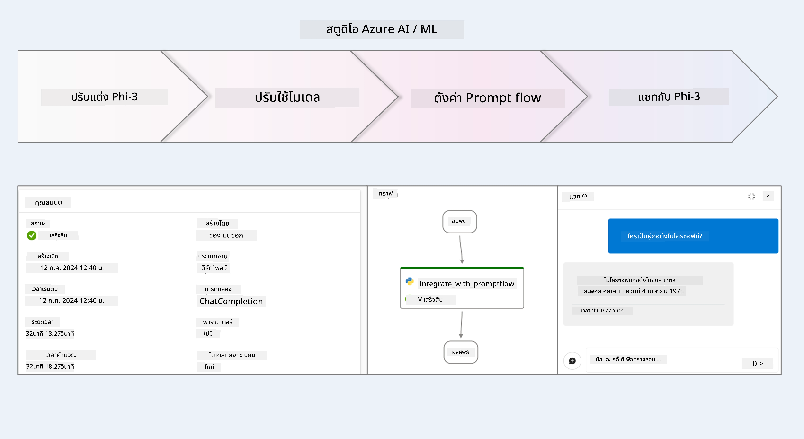

### สารบัญ

1. **[สถานการณ์ 1: ตั้งค่า Azure resources และเตรียมพร้อมสำหรับการปรับแต่ง](../../../../../../md/02.Application/01.TextAndChat/Phi3)**
    - [สร้าง Azure Machine Learning Workspace](../../../../../../md/02.Application/01.TextAndChat/Phi3)
    - [ขอจำกัดการใช้ GPU ใน Azure Subscription](../../../../../../md/02.Application/01.TextAndChat/Phi3)
    - [เพิ่มการมอบหมายบทบาท](../../../../../../md/02.Application/01.TextAndChat/Phi3)
    - [ตั้งค่าโปรเจกต์](../../../../../../md/02.Application/01.TextAndChat/Phi3)
    - [เตรียมชุดข้อมูลสำหรับการปรับแต่ง](../../../../../../md/02.Application/01.TextAndChat/Phi3)

1. **[สถานการณ์ 2: ปรับแต่งโมเดล Phi-3 และปรับใช้ใน Azure Machine Learning Studio](../../../../../../md/02.Application/01.TextAndChat/Phi3)**
    - [ปรับแต่งโมเดล Phi-3](../../../../../../md/02.Application/01.TextAndChat/Phi3)
    - [ปรับใช้โมเดล Phi-3 ที่ปรับแต่งแล้ว](../../../../../../md/02.Application/01.TextAndChat/Phi3)

1. **[สถานการณ์ 3: รวมเข้ากับ Prompt flow และสนทนากับโมเดลที่กำหนดเองใน Azure AI Foundry](../../../../../../md/02.Application/01.TextAndChat/Phi3)**
    - [รวมโมเดล Phi-3 ที่กำหนดเองกับ Prompt flow](../../../../../../md/02.Application/01.TextAndChat/Phi3)
    - [สนทนากับโมเดล Phi-3 ที่กำหนดเองของคุณ](../../../../../../md/02.Application/01.TextAndChat/Phi3)

## สถานการณ์ 1: ตั้งค่า Azure resources และเตรียมพร้อมสำหรับการปรับแต่ง

### สร้าง Azure Machine Learning Workspace

1. พิมพ์ *azure machine learning* ใน **แถบค้นหา** ที่ด้านบนของหน้า portal แล้วเลือก **Azure Machine Learning** จากตัวเลือกที่แสดง

    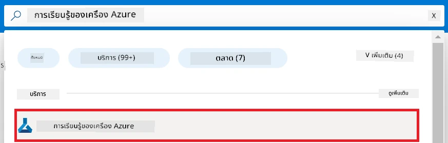

2. เลือก **+ Create** จากเมนูนำทาง

3. เลือก **New workspace** จากเมนูนำทาง

    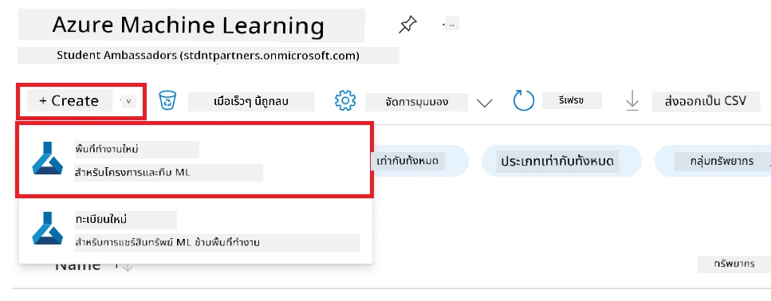

4. ดำเนินการดังนี้:

    - เลือก **Subscription** ของ Azure ของคุณ
    - เลือก **Resource group** ที่จะใช้ (หากไม่มีให้สร้างใหม่)
    - ใส่ **ชื่อ Workspace** ต้องเป็นค่าที่ไม่ซ้ำ
    - เลือก **Region** ที่ต้องการใช้
    - เลือก **Storage account** ที่จะใช้ (สร้างใหม่หากจำเป็น)
    - เลือก **Key vault** ที่จะใช้ (สร้างใหม่หากจำเป็น)
    - เลือก **Application insights** ที่จะใช้ (สร้างใหม่หากจำเป็น)
    - เลือก **Container registry** ที่จะใช้ (สร้างใหม่หากจำเป็น)

    

5. เลือก **Review + Create**

6. เลือก **Create**

### ขอจำกัดการใช้ GPU ใน Azure Subscription

ในบทช่วยสอนนี้ คุณจะเรียนรู้วิธีปรับแต่งและปรับใช้โมเดล Phi-3 โดยใช้ GPU สำหรับการปรับแต่งคุณจะใช้ GPU *Standard_NC24ads_A100_v4* ซึ่งต้องขอจำกัดการใช้งาน ส่วนสำหรับการปรับใช้จะใช้ GPU *Standard_NC6s_v3* ซึ่งก็ต้องขอจำกัดการใช้งานเช่นกัน

> [!NOTE]
>
> เฉพาะ Subscription แบบ Pay-As-You-Go (ประเภท subscription มาตรฐาน) เท่านั้นที่มีสิทธิ์ขอจัดสรร GPU; subscription แบบได้ประโยชน์ยังไม่รองรับในขณะนี้
>

1. เข้าไปที่ [Azure ML Studio](https://ml.azure.com/home?wt.mc_id=studentamb_279723)

1. ดำเนินการดังต่อไปนี้เพื่อขอจำกัดโควต้า *Standard NCADSA100v4 Family*:

    - เลือก **Quota** จากแท็บด้านซ้าย
    - เลือก **Virtual machine family** ที่ต้องการใช้ เช่น เลือก **Standard NCADSA100v4 Family Cluster Dedicated vCPUs** ซึ่งรวมถึง GPU *Standard_NC24ads_A100_v4*
    - เลือก **Request quota** จากเมนูนำทาง

        

    - ในหน้าขอจำกัดโควต้า ให้ใส่ **New cores limit** ที่ต้องการใช้ เช่น 24
    - ในหน้าขอจำกัดโควต้า ให้เลือก **Submit** เพื่อส่งคำขอจำกัด GPU

1. ดำเนินการดังต่อไปนี้เพื่อขอจำกัดโควต้า *Standard NCSv3 Family*:

    - เลือก **Quota** จากแท็บด้านซ้าย
    - เลือก **Virtual machine family** ที่ต้องการใช้ เช่น เลือก **Standard NCSv3 Family Cluster Dedicated vCPUs** ซึ่งรวมถึง GPU *Standard_NC6s_v3*
    - เลือก **Request quota** จากเมนูนำทาง
    - ในหน้าขอจำกัดโควต้า ให้ใส่ **New cores limit** ที่ต้องการใช้ เช่น 24
    - ในหน้าขอจำกัดโควต้า ให้เลือก **Submit** เพื่อส่งคำขอจำกัด GPU

### เพิ่มการมอบหมายบทบาท

เพื่อปรับแต่งและปรับใช้โมเดลของคุณ คุณต้องสร้าง User Assigned Managed Identity (UAI) และมอบสิทธิ์ที่เหมาะสมให้กับมันก่อน UAI นี้จะใช้สำหรับยืนยันตัวตนเมื่อปรับใช้

#### สร้าง User Assigned Managed Identity(UAI)

1. พิมพ์ *managed identities* ใน **แถบค้นหา** ที่ด้านบนของหน้า portal แล้วเลือก **Managed Identities** จากตัวเลือกที่แสดง

    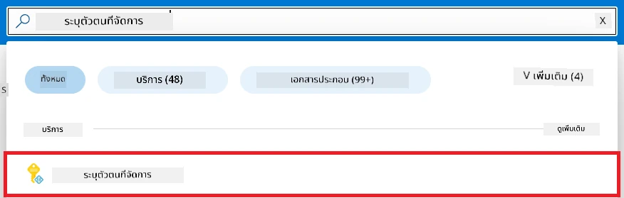

1. เลือก **+ Create**

    

1. ดำเนินการดังนี้:

    - เลือก **Subscription** ของ Azure ของคุณ
    - เลือก **Resource group** ที่จะใช้ (สร้างใหม่ถ้าจำเป็น)
    - เลือก **Region** ที่ต้องการใช้
    - ใส่ **ชื่อ** ต้องเป็นค่าที่ไม่ซ้ำ

    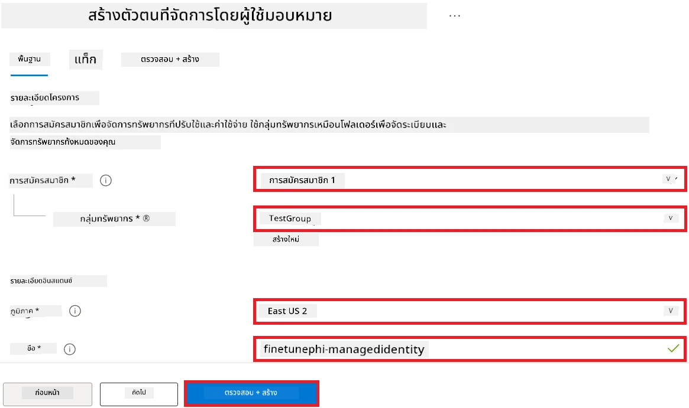

1. เลือก **Review + create**

1. เลือก **+ Create**

#### เพิ่มมอบหมายบทบาท Contributor ให้กับ Managed Identity

1. ไปยัง Managed Identity ที่คุณสร้าง

1. เลือก **Azure role assignments** จากแท็บด้านซ้าย

1. เลือก **+Add role assignment** จากเมนูนำทาง

1. ในหน้า Add role assignment ดำเนินการดังนี้:
    - เลือก **Scope** เป็น **Resource group**
    - เลือก **Subscription** ของ Azure ของคุณ
    - เลือก **Resource group** ที่ใช้
    - เลือก **Role** เป็น **Contributor**

    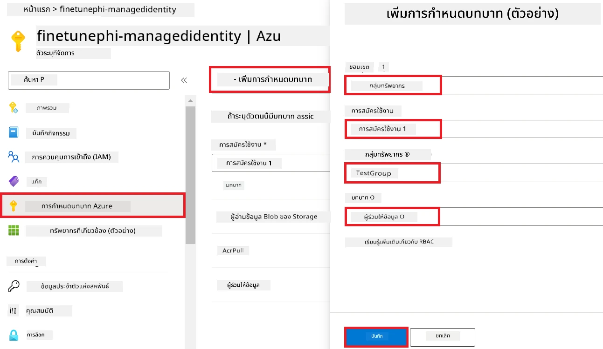

2. เลือก **Save**

#### เพิ่มมอบหมายบทบาท Storage Blob Data Reader ให้กับ Managed Identity

1. พิมพ์ *storage accounts* ใน **แถบค้นหา** ที่ด้านบนของหน้า portal แล้วเลือก **Storage accounts** จากตัวเลือกที่แสดง

    

1. เลือกบัญชี storage ที่เชื่อมกับ Azure Machine Learning workspace ที่คุณสร้าง เช่น *finetunephistorage*

1. ดำเนินการดังต่อไปนี้เพื่อไปยังหน้า Add role assignment:

    - ไปยังบัญชี Azure Storage ที่คุณสร้าง
    - เลือก **Access Control (IAM)** จากแท็บด้านซ้าย
    - เลือก **+ Add** จากเมนูนำทาง
    - เลือก **Add role assignment** จากเมนูนำทาง

    

1. ในหน้า Add role assignment ดำเนินการดังนี้:

    - ในหน้า Role ให้พิมพ์ *Storage Blob Data Reader* ใน **แถบค้นหา** แล้วเลือก **Storage Blob Data Reader** จากตัวเลือกที่แสดง
    - ในหน้า Role เลือก **Next**
    - ในหน้า Members เลือก **Assign access to** เป็น **Managed identity**
    - ในหน้า Members เลือก **+ Select members**
    - ในหน้า Select managed identities เลือก **Subscription** ของ Azure ของคุณ
    - ในหน้า Select managed identities เลือก **Managed identity** เป็น **Manage Identity**
    - ในหน้า Select managed identities เลือก Manage Identity ที่คุณสร้าง เช่น *finetunephi-managedidentity*
    - ในหน้า Select managed identities เลือก **Select**

    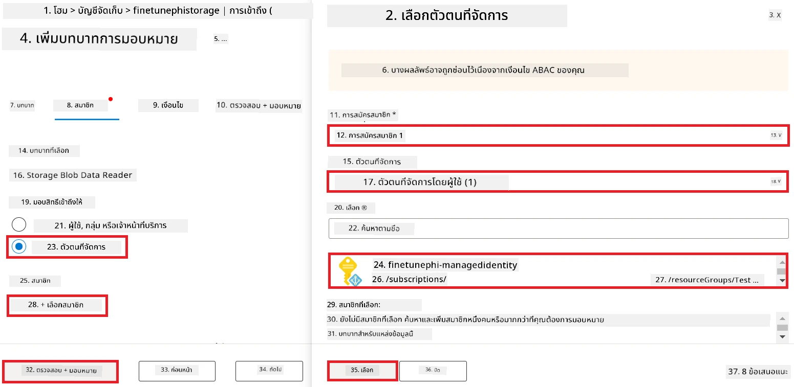

1. เลือก **Review + assign**

#### เพิ่มมอบหมายบทบาท AcrPull ให้กับ Managed Identity

1. พิมพ์ *container registries* ใน **แถบค้นหา** ที่ด้านบนของหน้า portal แล้วเลือก **Container registries** จากตัวเลือกที่แสดง

    

1. เลือก container registry ที่เชื่อมกับ Azure Machine Learning workspace เช่น *finetunephicontainerregistry*

1. ดำเนินการดังต่อไปนี้เพื่อไปยังหน้า Add role assignment:

    - เลือก **Access Control (IAM)** จากแท็บด้านซ้าย
    - เลือก **+ Add** จากเมนูนำทาง
    - เลือก **Add role assignment** จากเมนูนำทาง

1. ในหน้า Add role assignment ดำเนินการดังนี้:

    - ในหน้า Role ให้พิมพ์ *AcrPull* ใน **แถบค้นหา** แล้วเลือก **AcrPull** จากตัวเลือกที่แสดง
    - ในหน้า Role เลือก **Next**
    - ในหน้า Members เลือก **Assign access to** เป็น **Managed identity**
    - ในหน้า Members เลือก **+ Select members**
    - ในหน้า Select managed identities เลือก **Subscription** ของ Azure ของคุณ
    - ในหน้า Select managed identities เลือก **Managed identity** เป็น **Manage Identity**
    - ในหน้า Select managed identities เลือก Manage Identity ที่คุณสร้าง เช่น *finetunephi-managedidentity*
    - ในหน้า Select managed identities เลือก **Select**
    - เลือก **Review + assign**

### ตั้งค่าโปรเจกต์

เพื่อดาวน์โหลดชุดข้อมูลที่ต้องใช้สำหรับการปรับแต่ง คุณจะตั้งค่าสภาพแวดล้อมในเครื่อง

ในการฝึกปฏิบัตินี้ คุณจะ

- สร้างโฟลเดอร์สำหรับทำงานภายใน
- สร้างสภาพแวดล้อมเสมือน (virtual environment)
- ติดตั้งแพ็กเกจที่จำเป็น
- สร้างไฟล์ *download_dataset.py* เพื่อดาวน์โหลดชุดข้อมูล

#### สร้างโฟลเดอร์สำหรับทำงานภายใน

1. เปิดหน้าต่างเทอร์มินัลและพิมพ์คำสั่งต่อไปนี้เพื่อสร้างโฟลเดอร์ชื่อ *finetune-phi* ในเส้นทางเริ่มต้น

    ```console
    mkdir finetune-phi
    ```

2. พิมพ์คำสั่งต่อไปนี้ในเทอร์มินัลของคุณเพื่อไปที่โฟลเดอร์ *finetune-phi* ที่คุณสร้างขึ้น

    ```console
    cd finetune-phi
    ```

#### สร้างสภาพแวดล้อมเสมือน (virtual environment)

1. พิมพ์คำสั่งต่อไปนี้ในเทอร์มินัลของคุณเพื่อสร้างสภาพแวดล้อมเสมือนที่ชื่อว่า *.venv*

    ```console
    python -m venv .venv
    ```

2. พิมพ์คำสั่งต่อไปนี้ในเทอร์มินัลของคุณเพื่อเปิดใช้งานสภาพแวดล้อมเสมือน

    ```console
    .venv\Scripts\activate.bat
    ```

> [!NOTE]
> หากสำเร็จ คุณควรเห็น *(.venv)* ก่อนพรอมต์คำสั่ง

#### ติดตั้งแพ็กเกจที่จำเป็น

1. พิมพ์คำสั่งต่อไปนี้ในเทอร์มินัลของคุณเพื่อติดตั้งแพ็กเกจที่จำเป็น

    ```console
    pip install datasets==2.19.1
    ```

#### สร้างไฟล์ `download_dataset.py`

> [!NOTE]
> โครงสร้างโฟลเดอร์สมบูรณ์:
>
> ```text
> └── YourUserName
> .    └── finetune-phi
> .        └── download_dataset.py
> ```

1. เปิด **Visual Studio Code**

1. เลือก **File** จากเมนูบาร์

1. เลือก **Open Folder**

1. เลือกโฟลเดอร์ *finetune-phi* ที่คุณสร้างไว้ ซึ่งอยู่ที่ *C:\Users\yourUserName\finetune-phi*

    

1. ที่แถบด้านซ้ายของ Visual Studio Code คลิกขวาและเลือก **New File** เพื่อสร้างไฟล์ใหม่ชื่อ *download_dataset.py*

    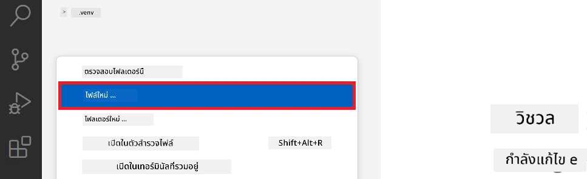

### เตรียมชุดข้อมูลสำหรับการปรับแต่ง

ในการฝึกนี้ คุณจะรันไฟล์ *download_dataset.py* เพื่อดาวน์โหลดชุดข้อมูล *ultrachat_200k* ลงในสภาพแวดล้อมในเครื่องของคุณ จากนั้นคุณจะใช้ชุดข้อมูลนี้เพื่อปรับแต่งโมเดล Phi-3 ใน Azure Machine Learning

ในการฝึกนี้ คุณจะ:

- เพิ่มโค้ดลงในไฟล์ *download_dataset.py* เพื่อดาวน์โหลดชุดข้อมูล
- รันไฟล์ *download_dataset.py* เพื่อดาวน์โหลดชุดข้อมูลลงในสภาพแวดล้อมในเครื่อง

#### ดาวน์โหลดชุดข้อมูลโดยใช้ *download_dataset.py*

1. เปิดไฟล์ *download_dataset.py* ใน Visual Studio Code

1. เพิ่มโค้ดต่อไปนี้ลงในไฟล์ *download_dataset.py*

    ```python
    import json
    import os
    from datasets import load_dataset

    def load_and_split_dataset(dataset_name, config_name, split_ratio):
        """
        Load and split a dataset.
        """
        # โหลดชุดข้อมูลด้วยชื่อ การกำหนดค่า และอัตราส่วนการแบ่งที่ระบุ
        dataset = load_dataset(dataset_name, config_name, split=split_ratio)
        print(f"Original dataset size: {len(dataset)}")
        
        # แบ่งชุดข้อมูลเป็นชุดฝึกและชุดทดสอบ (80% ฝึก, 20% ทดสอบ)
        split_dataset = dataset.train_test_split(test_size=0.2)
        print(f"Train dataset size: {len(split_dataset['train'])}")
        print(f"Test dataset size: {len(split_dataset['test'])}")
        
        return split_dataset

    def save_dataset_to_jsonl(dataset, filepath):
        """
        Save a dataset to a JSONL file.
        """
        # สร้างไดเร็กทอรีถ้ายังไม่มีอยู่
        os.makedirs(os.path.dirname(filepath), exist_ok=True)
        
        # เปิดไฟล์ในโหมดเขียน
        with open(filepath, 'w', encoding='utf-8') as f:
            # ทำซ้ำในแต่ละเรคคอร์ดในชุดข้อมูล
            for record in dataset:
                # บันทึกเรคคอร์ดในรูปแบบ JSON และเขียนลงไฟล์
                json.dump(record, f)
                # เขียนอักขระขึ้นบรรทัดใหม่เพื่อแยกเรคคอร์ด
                f.write('\n')
        
        print(f"Dataset saved to {filepath}")

    def main():
        """
        Main function to load, split, and save the dataset.
        """
        # โหลดและแบ่งชุดข้อมูล ULTRACHAT_200k ด้วยการกำหนดค่าและอัตราส่วนการแบ่งเฉพาะ
        dataset = load_and_split_dataset("HuggingFaceH4/ultrachat_200k", 'default', 'train_sft[:1%]')
        
        # ดึงชุดข้อมูลฝึกและชุดข้อมูลทดสอบจากการแบ่ง
        train_dataset = dataset['train']
        test_dataset = dataset['test']

        # บันทึกชุดข้อมูลฝึกลงในไฟล์ JSONL
        save_dataset_to_jsonl(train_dataset, "data/train_data.jsonl")
        
        # บันทึกชุดข้อมูลทดสอบลงในไฟล์ JSONL แยกต่างหาก
        save_dataset_to_jsonl(test_dataset, "data/test_data.jsonl")

    if __name__ == "__main__":
        main()

    ```

1. พิมพ์คำสั่งต่อไปนี้ในเทอร์มินัลของคุณเพื่อรันสคริปต์และดาวน์โหลดชุดข้อมูลลงในสภาพแวดล้อมในเครื่องของคุณ

    ```console
    python download_dataset.py
    ```

1. ตรวจสอบว่าไฟล์ชุดข้อมูลถูกบันทึกอย่างถูกต้องในไดเรกทอรี *finetune-phi/data* ในเครื่องของคุณ

> [!NOTE]
>
> #### หมายเหตุเกี่ยวกับขนาดชุดข้อมูลและเวลาการปรับแต่ง
>
> ในบทแนะนำนี้ คุณใช้ชุดข้อมูลเพียง 1% (`split='train[:1%]'`) ซึ่งช่วยลดปริมาณข้อมูลอย่างมาก ทำให้การอัปโหลดและกระบวนการปรับแต่งเร็วขึ้น คุณสามารถปรับเปอร์เซ็นต์เพื่อหาสมดุลระหว่างเวลาการฝึกและประสิทธิภาพของโมเดล การใช้ชุดข้อมูลย่อยเล็กลงช่วยลดเวลาที่ต้องใช้ในการปรับแต่ง ทำให้กระบวนการง่ายขึ้นสำหรับบทแนะนำนี้

## สถานการณ์ที่ 2: ปรับแต่งโมเดล Phi-3 และนำไปปรับใช้ใน Azure Machine Learning Studio

### ปรับแต่งโมเดล Phi-3

ในการฝึกนี้ คุณจะปรับแต่งโมเดล Phi-3 ใน Azure Machine Learning Studio

ในการฝึกนี้ คุณจะ:

- สร้างคอมพิวเตอร์คลัสเตอร์สำหรับการปรับแต่ง
- ปรับแต่งโมเดล Phi-3 ใน Azure Machine Learning Studio

#### สร้างคอมพิวเตอร์คลัสเตอร์สำหรับการปรับแต่ง

1. เยี่ยมชม [Azure ML Studio](https://ml.azure.com/home?wt.mc_id=studentamb_279723)

1. เลือก **Compute** จากแท็บทางซ้าย

1. เลือก **Compute clusters** จากเมนูนำทาง

1. เลือก **+ New**

    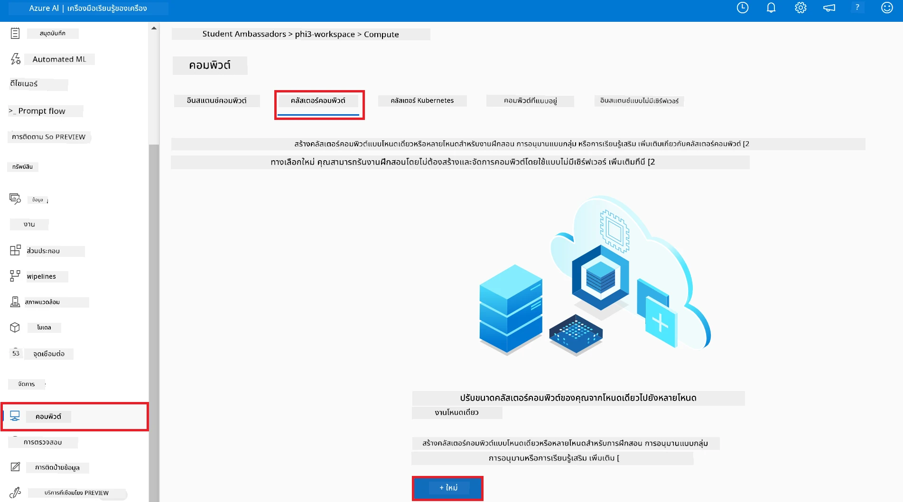

1. ดำเนินการดังนี้:

    - เลือก **Region** ที่คุณต้องการใช้
    - เลือก **Virtual machine tier** เป็น **Dedicated**
    - เลือก **Virtual machine type** เป็น **GPU**
    - เลือกตัวกรอง **Virtual machine size** เป็น **Select from all options**
    - เลือก **Virtual machine size** เป็น **Standard_NC24ads_A100_v4**

    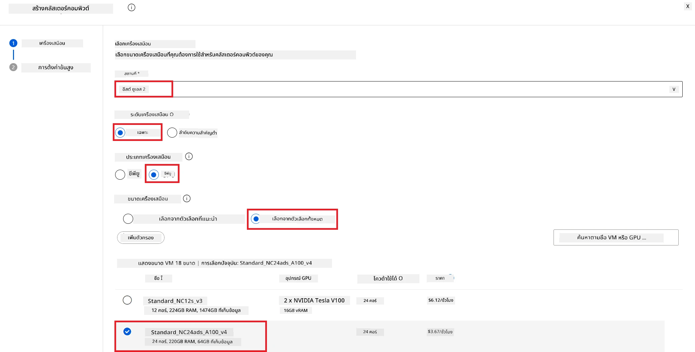

1. เลือก **Next**

1. ดำเนินการดังนี้:

    - กรอกชื่อ **Compute name** ซึ่งต้องเป็นค่าที่ไม่ซ้ำกัน
    - ตั้งค่า **Minimum number of nodes** เป็น **0**
    - ตั้งค่า **Maximum number of nodes** เป็น **1**
    - ตั้งค่า **Idle seconds before scale down** เป็น **120**

    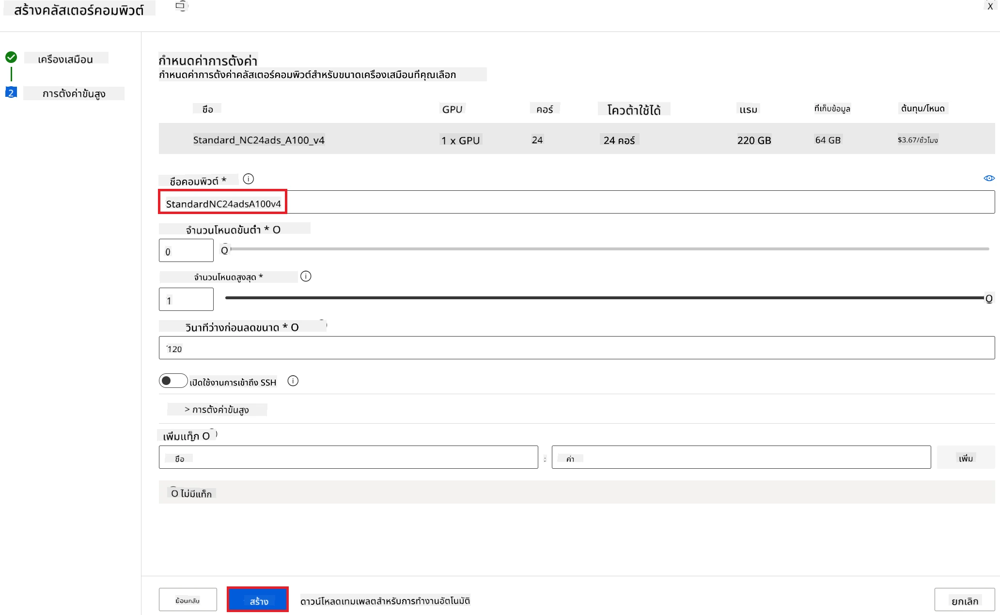

1. เลือก **Create**

#### ปรับแต่งโมเดล Phi-3

1. เยี่ยมชม [Azure ML Studio](https://ml.azure.com/home?wt.mc_id=studentamb_279723)

1. เลือก workspace ของ Azure Machine Learning ที่คุณสร้างไว้

    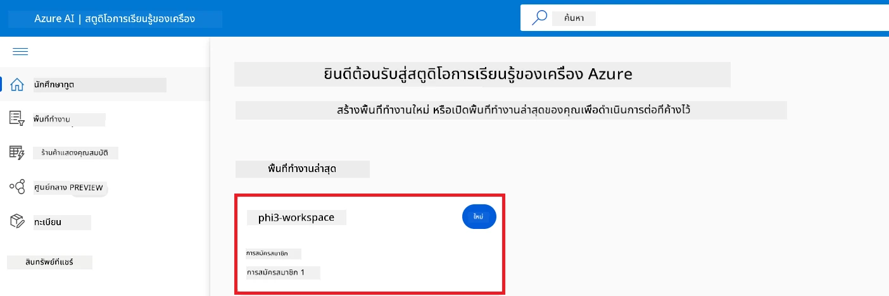

1. ดำเนินการดังนี้:

    - เลือก **Model catalog** จากแท็บทางซ้าย
    - พิมพ์ *phi-3-mini-4k* ใน **แถบค้นหา** และเลือก **Phi-3-mini-4k-instruct** จากตัวเลือกที่ปรากฏ

    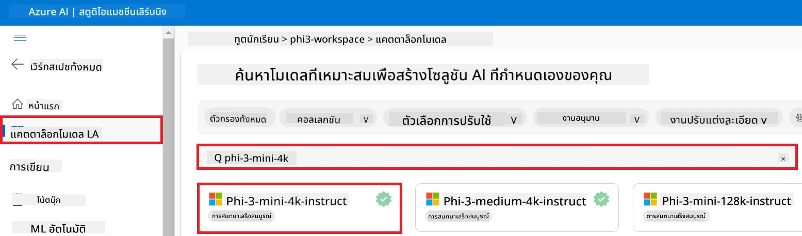

1. เลือก **Fine-tune** จากเมนูนำทาง

    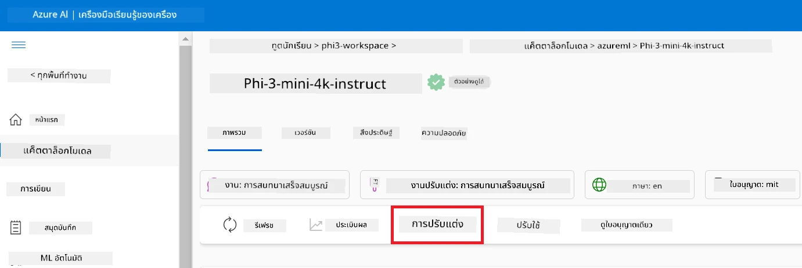

1. ดำเนินการดังนี้:

    - เลือก **Select task type** เป็น **Chat completion**
    - เลือก **+ Select data** เพื่ออัปโหลด **Training data**
    - เลือกประเภทการอัปโหลดข้อมูล Validation เป็น **Provide different validation data**
    - เลือก **+ Select data** เพื่ออัปโหลด **Validation data**

    

> [!TIP]
>
> คุณสามารถเลือก **Advanced settings** เพื่อปรับแต่งการกำหนดค่า เช่น **learning_rate** และ **lr_scheduler_type** เพื่อเพิ่มประสิทธิภาพกระบวนการปรับแต่งตามความต้องการเฉพาะของคุณ

1. เลือก **Finish**

1. ในการฝึกนี้ คุณได้ปรับแต่งโมเดล Phi-3 สำเร็จโดยใช้ Azure Machine Learning โปรดทราบว่ากระบวนการปรับแต่งอาจใช้เวลานาน หลังจากรันงานปรับแต่งแล้ว คุณต้องรอให้กระบวนการเสร็จสมบูรณ์ คุณสามารถติดตามสถานะของงานปรับแต่งได้โดยไปที่แท็บ Jobs ทางด้านซ้ายของ Azure Machine Learning Workspace ของคุณ ในชุดถัดไป คุณจะนำโมเดลที่ปรับแต่งแล้วไปปรับใช้และผสานรวมกับ Prompt flow

    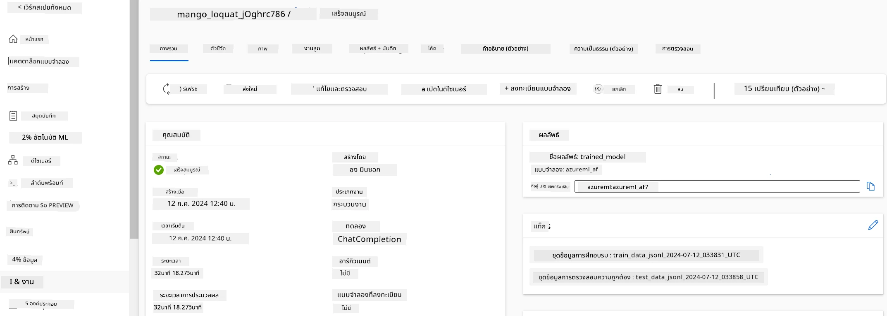

### ปรับใช้โมเดล Phi-3 ที่ปรับแต่งแล้ว

เพื่อผสานโมเดล Phi-3 ที่ปรับแต่งแล้วกับ Prompt flow คุณต้องนำโมเดลไปปรับใช้เพื่อให้สามารถใช้งานสำหรับการทำนายแบบเรียลไทม์ กระบวนการนี้รวมถึงการลงทะเบียนโมเดล การสร้าง online endpoint และการปรับใช้โมเดล

ในการฝึกนี้ คุณจะ:

- ลงทะเบียนโมเดลที่ปรับแต่งแล้วใน Azure Machine Learning workspace
- สร้าง online endpoint
- ปรับใช้โมเดล Phi-3 ที่ลงทะเบียนแล้ว

#### ลงทะเบียนโมเดลที่ปรับแต่งแล้ว

1. เยี่ยมชม [Azure ML Studio](https://ml.azure.com/home?wt.mc_id=studentamb_279723)

1. เลือก workspace ของ Azure Machine Learning ที่คุณสร้างไว้

    

1. เลือก **Models** จากแท็บทางซ้าย
1. เลือก **+ Register**
1. เลือก **From a job output**

    

1. เลือกงาน (job) ที่คุณสร้างไว้

    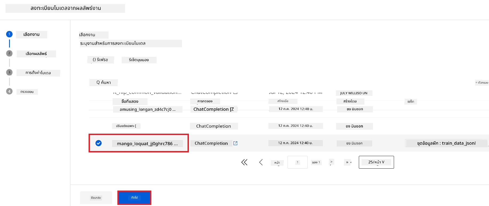

1. เลือก **Next**

1. เลือก **Model type** เป็น **MLflow**

1. ตรวจสอบให้แน่ใจว่าเลือก **Job output** แล้ว ซึ่งควรถูกเลือกโดยอัตโนมัติ

    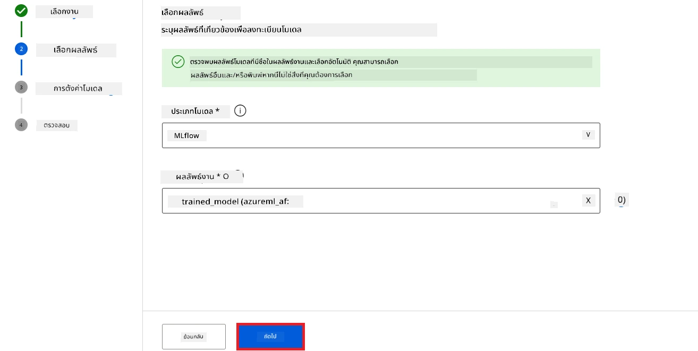

2. เลือก **Next**

3. เลือก **Register**

    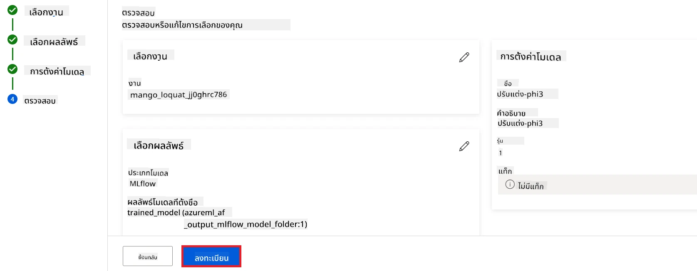

4. คุณสามารถดูโมเดลที่ลงทะเบียนได้โดยไปที่เมนู **Models** จากแท็บทางซ้าย

    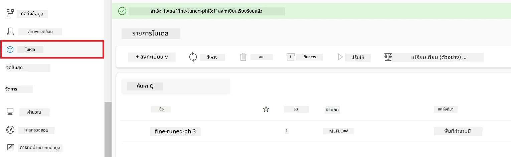

#### ปรับใช้โมเดลที่ปรับแต่งแล้ว

1. ไปที่ workspace ของ Azure Machine Learning ที่คุณสร้างไว้

1. เลือก **Endpoints** จากแท็บทางซ้าย

1. เลือก **Real-time endpoints** จากเมนูนำทาง

    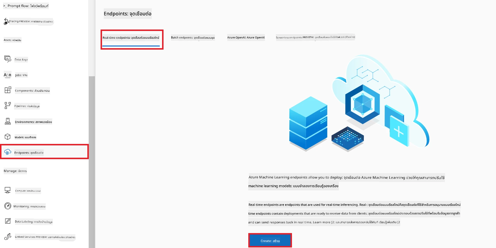

1. เลือก **Create**

1. เลือกโมเดลที่ลงทะเบียนไว้ที่คุณสร้างไว้

    

1. เลือก **Select**

1. ดำเนินการดังนี้:

    - เลือก **Virtual machine** เป็น *Standard_NC6s_v3*
    - เลือกจำนวน **Instance count** ที่คุณต้องการใช้ เช่น *1*
    - เลือก **Endpoint** เป็น **New** เพื่อสร้าง endpoint ใหม่
    - กรอกชื่อ **Endpoint name** ซึ่งต้องไม่ซ้ำกัน
    - กรอกชื่อ **Deployment name** ซึ่งต้องไม่ซ้ำกัน

    

1. เลือก **Deploy**

> [!WARNING]
> เพื่อหลีกเลี่ยงค่าธรรมเนียมเพิ่มเติมในบัญชีของคุณ กรุณาลบ endpoint ที่สร้างขึ้นใน Azure Machine Learning workspace เมื่อไม่ใช้งานแล้ว
>

#### ตรวจสอบสถานะการปรับใช้ใน Azure Machine Learning Workspace

1. ไปที่ workspace ของ Azure Machine Learning ที่คุณสร้างไว้

1. เลือก **Endpoints** จากแท็บทางซ้าย

1. เลือก endpoint ที่คุณสร้างไว้

    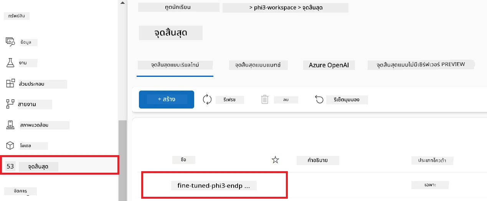

1. บนหน้านี้ คุณสามารถจัดการ endpoints ในระหว่างกระบวนการปรับใช้ได้

> [!NOTE]
> เมื่อการปรับใช้เสร็จสมบูรณ์ ให้แน่ใจว่า **Live traffic** ถูกตั้งเป็น **100%** หากไม่เป็นเช่นนั้น ให้เลือก **Update traffic** เพื่อปรับการตั้งค่าการรับส่งข้อมูล โปรดทราบว่าคุณไม่สามารถทดสอบโมเดลได้ถ้าการรับส่งข้อมูลตั้งเป็น 0%
>
> 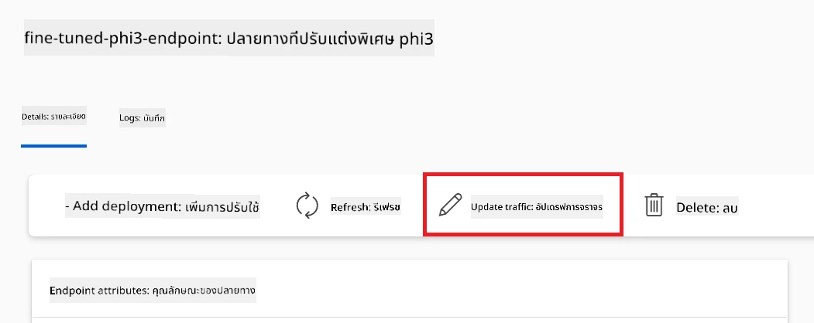
>

## สถานการณ์ที่ 3: ผสานรวมกับ Prompt flow และแชทกับโมเดลที่กำหนดเองใน Azure AI Foundry

### ผสานรวมโมเดล Phi-3 ที่กำหนดเองกับ Prompt flow

หลังจากที่คุณปรับใช้โมเดลที่ปรับแต่งได้สำเร็จแล้ว คุณสามารถผสานรวมกับ Prompt Flow เพื่อใช้โมเดลของคุณในแอปพลิเคชันแบบเรียลไทม์ โดยเปิดใช้งานการทำงานที่หลากหลายร่วมกับโมเดล Phi-3 ที่กำหนดเองของคุณ

ในการฝึกนี้ คุณจะ:

- สร้าง Azure AI Foundry Hub
- สร้างโปรเจกต์ใน Azure AI Foundry
- สร้าง Prompt flow
- เพิ่มการเชื่อมต่อที่กำหนดเองสำหรับโมเดล Phi-3 ที่ปรับแต่งแล้ว
- ตั้งค่า Prompt flow เพื่อแชทกับโมเดล Phi-3 ที่กำหนดเองของคุณ

> [!NOTE]
> คุณยังสามารถผสานรวมกับ Promptflow ผ่านทาง Azure ML Studio กระบวนการผสานรวมเดียวกันนี้สามารถใช้กับ Azure ML Studio ได้เช่นกัน

#### สร้าง Azure AI Foundry Hub

คุณต้องสร้าง Hub ก่อนสร้างโปรเจกต์ Hub ทำหน้าที่เหมือน Resource Group ช่วยให้คุณจัดระเบียบและจัดการโปรเจกต์หลายรายการภายใน Azure AI Foundry

1. เยี่ยมชม [Azure AI Foundry](https://ai.azure.com/?WT.mc_id=aiml-137032-kinfeylo)

1. เลือก **All hubs** จากแท็บทางซ้าย

1. เลือก **+ New hub** จากเมนูนำทาง
    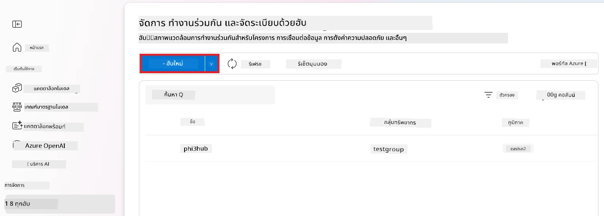

1. ดำเนินการดังต่อไปนี้:

    - ป้อน **ชื่อศูนย์ข้อมูล** ซึ่งต้องเป็นค่าที่ไม่ซ้ำกัน
    - เลือก **การสมัครใช้งาน** ของ Azure ของคุณ
    - เลือก **กลุ่มทรัพยากร** ที่จะใช้ (สร้างใหม่ถ้าจำเป็น)
    - เลือก **ตำแหน่งที่ตั้ง** ที่คุณต้องการใช้
    - เลือก **เชื่อมต่อบริการ Azure AI** ที่จะใช้ (สร้างใหม่ถ้าจำเป็น)
    - เลือก **เชื่อมต่อ Azure AI Search** เพื่อ **ข้ามการเชื่อมต่อ**

    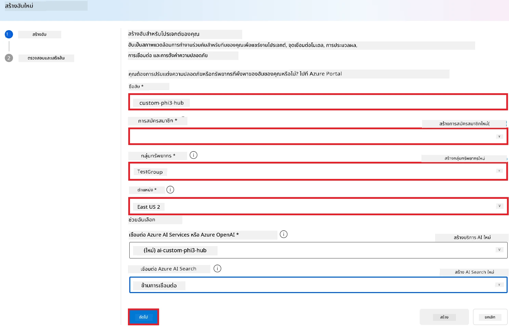

1. เลือก **ถัดไป**

#### สร้างโปรเจกต์ Azure AI Foundry

1. ในศูนย์ข้อมูลที่คุณสร้างขึ้น เลือก **โปรเจกต์ทั้งหมด** จากแท็บด้านซ้าย

1. เลือก **+ โปรเจกต์ใหม่** จากเมนูนำทาง

    

1. ป้อน **ชื่อโปรเจกต์** ซึ่งต้องเป็นค่าที่ไม่ซ้ำกัน

    

1. เลือก **สร้างโปรเจกต์**

#### เพิ่มการเชื่อมต่อแบบกำหนดเองสำหรับโมเดล Phi-3 ที่ปรับแต่งเพิ่มเติม

เพื่อรวมโมเดล Phi-3 แบบกำหนดเองของคุณกับ Prompt flow คุณต้องบันทึกจุดสิ้นสุดและคีย์ของโมเดลในการเชื่อมต่อแบบกำหนดเอง การตั้งค่านี้จะช่วยให้เข้าถึงโมเดล Phi-3 แบบกำหนดเองใน Prompt flow ได้

#### ตั้งค่าคีย์ API และ URI จุดสิ้นสุดของโมเดล Phi-3 ที่ปรับแต่งเพิ่มเติม

1. เข้าไปที่ [Azure ML Studio](https://ml.azure.com/home?WT.mc_id=aiml-137032-kinfeylo)

1. ไปที่พื้นที่ทำงาน Azure Machine learning ที่คุณสร้างขึ้น

1. เลือก **Endpoints** จากแท็บด้านซ้าย

    

1. เลือก endpoint ที่คุณสร้าง

    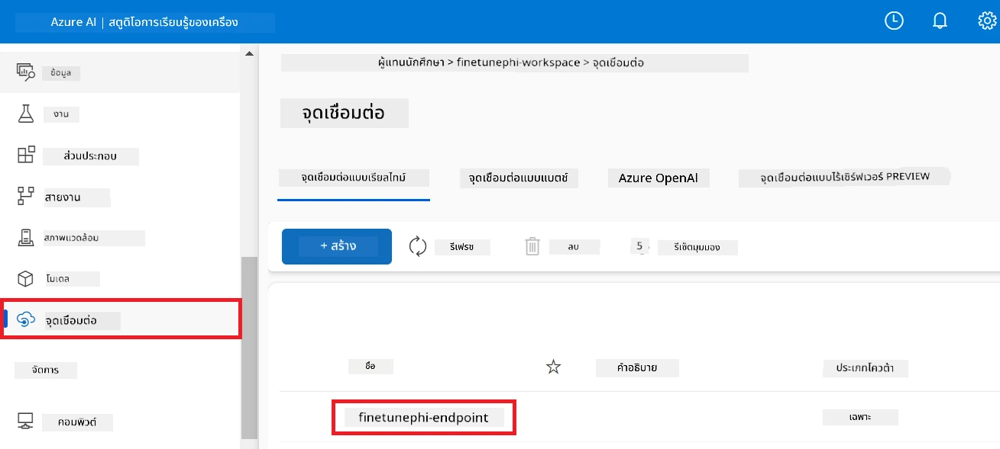

1. เลือก **Consume** จากเมนูนำทาง

1. คัดลอก **REST endpoint** และ **Primary key** ของคุณ

    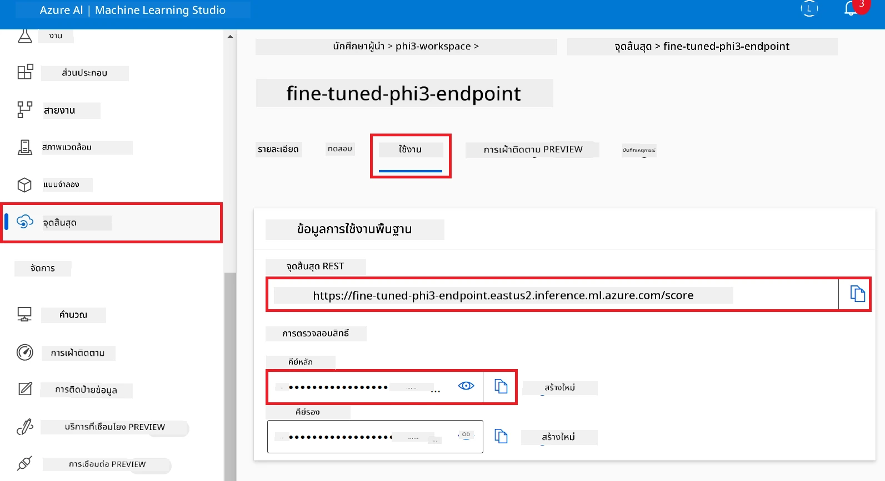

#### เพิ่มการเชื่อมต่อแบบกำหนดเอง

1. เข้าไปที่ [Azure AI Foundry](https://ai.azure.com/?WT.mc_id=aiml-137032-kinfeylo)

1. ไปที่โปรเจกต์ Azure AI Foundry ที่คุณสร้างขึ้น

1. ในโปรเจกต์ที่คุณสร้าง เลือก **การตั้งค่า** จากแท็บด้านซ้าย

1. เลือก **+ การเชื่อมต่อใหม่**

    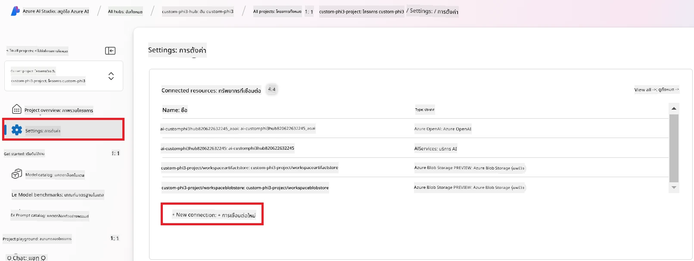

1. เลือก **คีย์แบบกำหนดเอง** จากเมนูนำทาง

    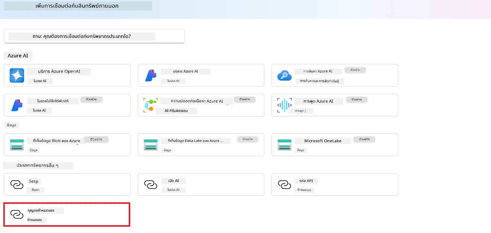

1. ดำเนินการดังต่อไปนี้:

    - เลือก **+ เพิ่มคู่คีย์-ค่า**
    - สำหรับชื่อคีย์ ให้ป้อน **endpoint** และวาง endpoint ที่คุณคัดลอกจาก Azure ML Studio ในช่องค่า
    - เลือก **+ เพิ่มคู่คีย์-ค่า** อีกครั้ง
    - สำหรับชื่อคีย์ ให้ป้อน **key** และวางคีย์ที่คุณคัดลอกจาก Azure ML Studio ในช่องค่า
    - หลังจากเพิ่มคีย์แล้ว ให้เลือก **เป็นความลับ** เพื่อป้องกันไม่ให้คีย์ถูกเปิดเผย

    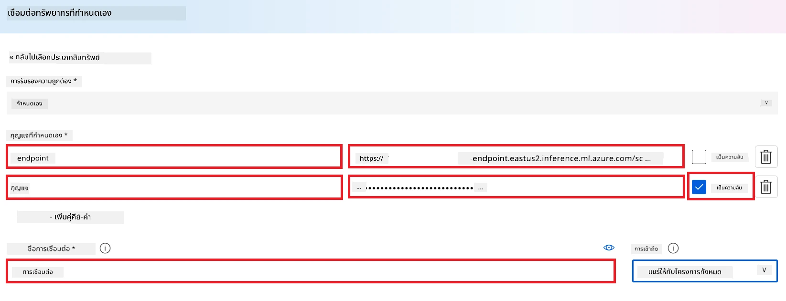

1. เลือก **เพิ่มการเชื่อมต่อ**

#### สร้าง Prompt flow

คุณได้เพิ่มการเชื่อมต่อแบบกำหนดเองใน Azure AI Foundry แล้ว ตอนนี้ มาสร้าง Prompt flow โดยใช้ขั้นตอนดังต่อไปนี้ หลังจากนั้น คุณจะเชื่อมต่อ Prompt flow นี้กับการเชื่อมต่อแบบกำหนดเองเพื่อให้คุณสามารถใช้โมเดลที่ปรับแต่งได้ภายใน Prompt flow

1. ไปที่โปรเจกต์ Azure AI Foundry ที่คุณสร้างขึ้น

1. เลือก **Prompt flow** จากแท็บด้านซ้าย

1. เลือก **+ สร้าง** จากเมนูนำทาง

    

1. เลือก **Chat flow** จากเมนูนำทาง

    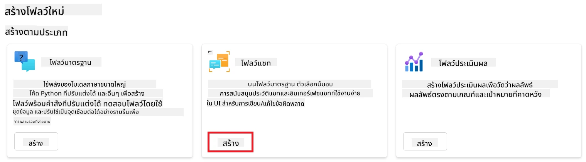

1. ป้อน **ชื่อโฟลเดอร์** ที่จะใช้

    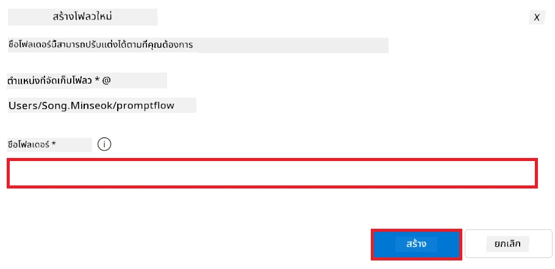

2. เลือก **สร้าง**

#### ตั้งค่า Prompt flow เพื่อสนทนากับโมเดล Phi-3 ที่ปรับแต่งของคุณ

คุณจำเป็นต้องรวมโมเดล Phi-3 ที่ปรับแต่งเข้ากับ Prompt flow อย่างไรก็ตาม Prompt flow ที่มีอยู่ไม่ได้ออกแบบมาสำหรับวัตถุประสงค์นี้ ดังนั้นคุณต้องออกแบบ Prompt flow ใหม่เพื่อเปิดใช้งานการรวมโมเดลแบบกำหนดเอง

1. ใน Prompt flow ดำเนินการดังต่อไปนี้เพื่อสร้างโฟลวเดิมใหม่:

    - เลือก **โหมดไฟล์ดิบ**
    - ลบโค้ดทั้งหมดในไฟล์ *flow.dag.yml*
    - เพิ่มโค้ดต่อไปนี้ในไฟล์ *flow.dag.yml*

        ```yml
        inputs:
          input_data:
            type: string
            default: "Who founded Microsoft?"

        outputs:
          answer:
            type: string
            reference: ${integrate_with_promptflow.output}

        nodes:
        - name: integrate_with_promptflow
          type: python
          source:
            type: code
            path: integrate_with_promptflow.py
          inputs:
            input_data: ${inputs.input_data}
        ```

    - เลือก **บันทึก**

    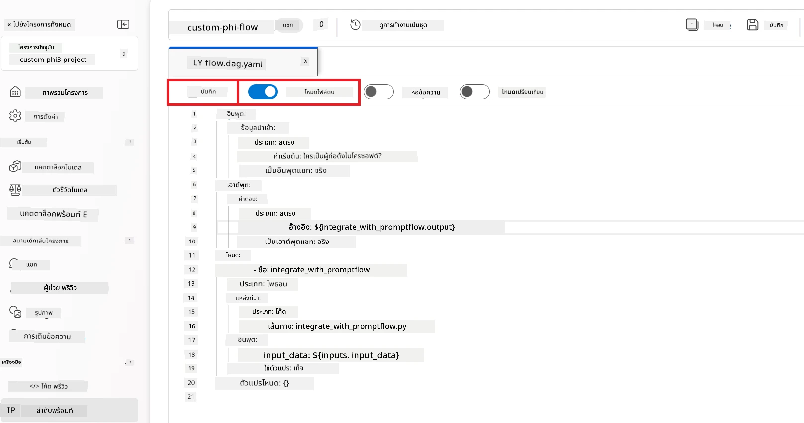

1. เพิ่มโค้ดต่อไปนี้ในไฟล์ *integrate_with_promptflow.py* เพื่อใช้โมเดล Phi-3 แบบกำหนดเองใน Prompt flow

    ```python
    import logging
    import requests
    from promptflow import tool
    from promptflow.connections import CustomConnection

    # การตั้งค่าการบันทึก
    logging.basicConfig(
        format="%(asctime)s - %(levelname)s - %(name)s - %(message)s",
        datefmt="%Y-%m-%d %H:%M:%S",
        level=logging.DEBUG
    )
    logger = logging.getLogger(__name__)

    def query_phi3_model(input_data: str, connection: CustomConnection) -> str:
        """
        Send a request to the Phi-3 model endpoint with the given input data using Custom Connection.
        """

        # "connection" คือชื่อของการเชื่อมต่อแบบกำหนดเอง, "endpoint", "key" คือคีย์ในการเชื่อมต่อแบบกำหนดเอง
        endpoint_url = connection.endpoint
        api_key = connection.key

        headers = {
            "Content-Type": "application/json",
            "Authorization": f"Bearer {api_key}"
        }
        data = {
            "input_data": {
                "input_string": [
                    {"role": "user", "content": input_data}
                ],
                "parameters": {
                    "temperature": 0.7,
                    "max_new_tokens": 128
                }
            }
        }
        try:
            response = requests.post(endpoint_url, json=data, headers=headers)
            response.raise_for_status()
            
            # บันทึกการตอบสนอง JSON ทั้งหมด
            logger.debug(f"Full JSON response: {response.json()}")

            result = response.json()["output"]
            logger.info("Successfully received response from Azure ML Endpoint.")
            return result
        except requests.exceptions.RequestException as e:
            logger.error(f"Error querying Azure ML Endpoint: {e}")
            raise

    @tool
    def my_python_tool(input_data: str, connection: CustomConnection) -> str:
        """
        Tool function to process input data and query the Phi-3 model.
        """
        return query_phi3_model(input_data, connection)

    ```

    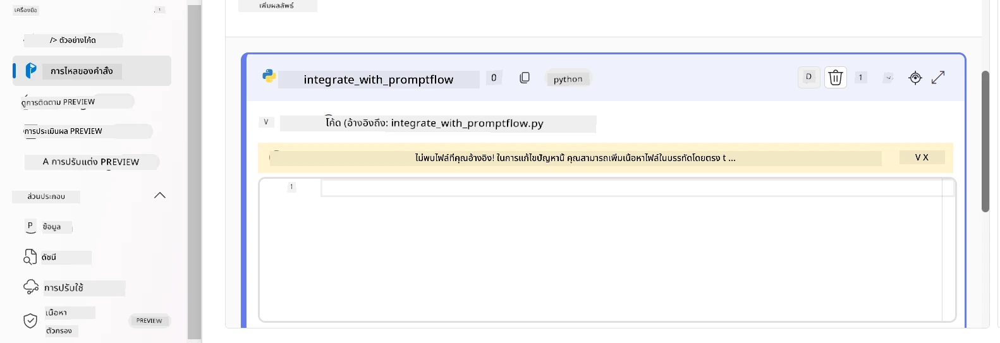

> [!NOTE]
> สำหรับข้อมูลรายละเอียดเพิ่มเติมเกี่ยวกับการใช้ Prompt flow ใน Azure AI Foundry คุณสามารถดูได้ที่ [Prompt flow in Azure AI Foundry](https://learn.microsoft.com/azure/ai-studio/how-to/prompt-flow)

1. เลือก **Chat input**, **Chat output** เพื่อเปิดใช้งานการสนทนากับโมเดลของคุณ

    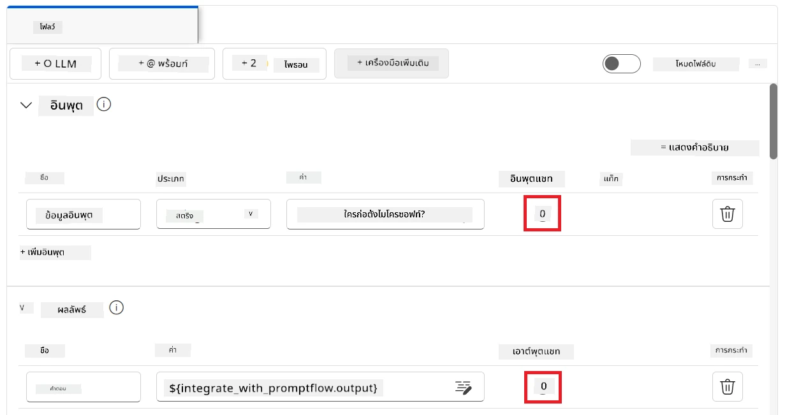

1. ตอนนี้คุณพร้อมที่จะสนทนากับโมเดล Phi-3 แบบกำหนดเองของคุณแล้ว ในแบบฝึกหัดถัดไป คุณจะได้เรียนรู้วิธีเริ่มใช้ Prompt flow และใช้มันเพื่อสนทนากับโมเดล Phi-3 ที่ปรับแต่งของคุณ

> [!NOTE]
>
> โฟลวที่สร้างใหม่นี้ควรมีลักษณะเหมือนภาพด้านล่าง:
>
> 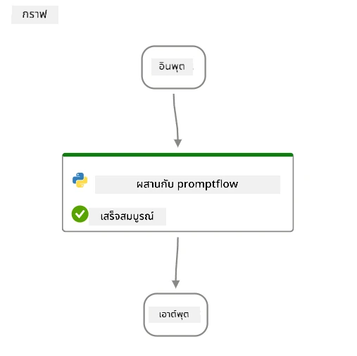
>

### สนทนากับโมเดล Phi-3 แบบกำหนดเองของคุณ

ตอนนี้คุณได้ปรับแต่งและรวมโมเดล Phi-3 แบบกำหนดเองเข้ากับ Prompt flow แล้ว คุณพร้อมที่จะเริ่มต้นการโต้ตอบกับโมเดลนี้ แบบฝึกหัดนี้จะแนะนำขั้นตอนการตั้งค่าและเริ่มต้นการสนทนากับโมเดลของคุณโดยใช้ Prompt flow หากทำตามขั้นตอนเหล่านี้ คุณจะสามารถใช้ประโยชน์จากความสามารถของโมเดล Phi-3 ที่ปรับแต่งได้อย่างเต็มที่สำหรับงานและการสนทนาต่างๆ

- สนทนากับโมเดล Phi-3 แบบกำหนดเองของคุณโดยใช้ Prompt flow

#### เริ่มต้น Prompt flow

1. เลือก **เริ่มต้นเซสชันการคำนวณ** เพื่อเริ่ม Prompt flow

    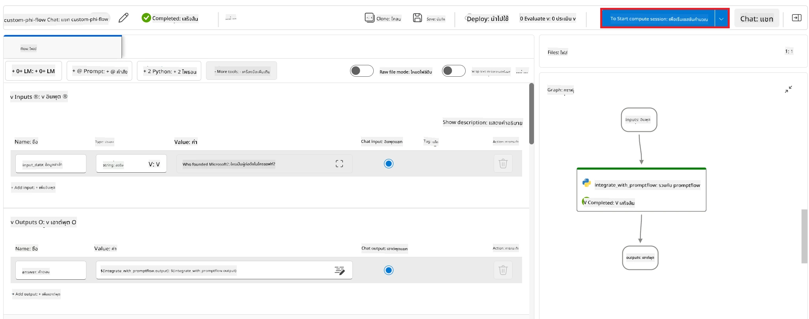

1. เลือก **ตรวจสอบและแยกวิเคราะห์อินพุต** เพื่อปรับปรุงพารามิเตอร์

    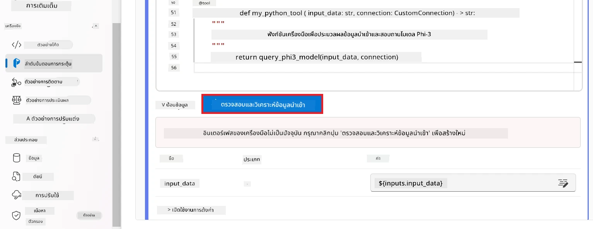

1. เลือก **ค่า** ของ **การเชื่อมต่อ** ไปยังการเชื่อมต่อแบบกำหนดเองที่คุณสร้าง เช่น *connection*

    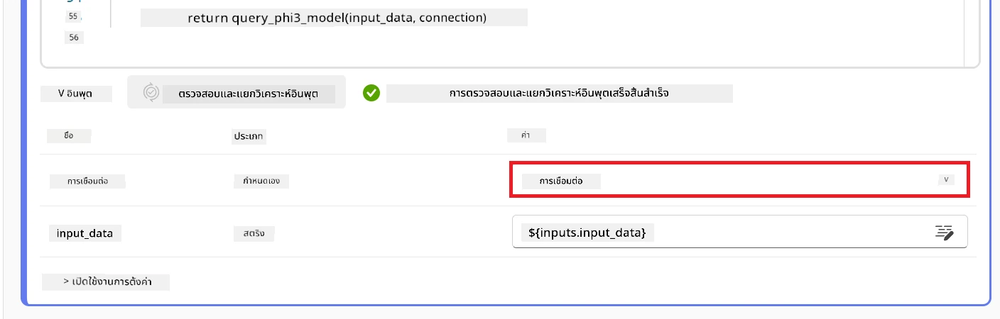

#### สนทนากับโมเดลแบบกำหนดเองของคุณ

1. เลือก **สนทนา**

    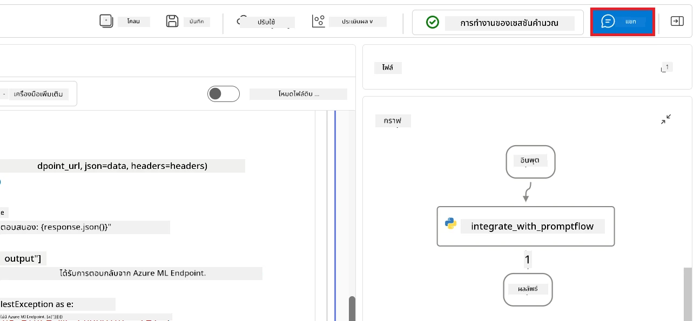

1. นี่คือตัวอย่างผลลัพธ์: ตอนนี้คุณสามารถสนทนากับโมเดล Phi-3 แบบกำหนดเองของคุณได้ แนะนำให้ถามคำถามตามข้อมูลที่ใช้สำหรับการปรับแต่งเพิ่มเติม

    

---

<!-- CO-OP TRANSLATOR DISCLAIMER START -->
**คำปฏิเสธความรับผิดชอบ**:
เอกสารนี้ได้รับการแปลโดยใช้บริการแปลภาษา AI [Co-op Translator](https://github.com/Azure/co-op-translator) แม้ว่าเราจะพยายามให้ความถูกต้องมากที่สุด แต่โปรดทราบว่าการแปลอัตโนมัติอาจมีข้อผิดพลาดหรือความไม่ถูกต้อง เอกสารต้นฉบับในภาษาต้นทางควรถือเป็นแหล่งข้อมูลที่มีอำนาจสูงสุด สำหรับข้อมูลที่มีความสำคัญ ขอแนะนำให้ใช้บริการแปลโดยนักแปลมืออาชีพ เราไม่รับผิดชอบต่อความเข้าใจผิดหรือการตีความผิดใด ๆ ที่เกิดขึ้นจากการใช้การแปลนี้
<!-- CO-OP TRANSLATOR DISCLAIMER END -->