<!--
CO_OP_TRANSLATOR_METADATA:
{
  "original_hash": "ecbd9179a21edbaafaf114d47f09f3e3",
  "translation_date": "2025-05-09T18:08:39+00:00",
  "source_file": "md/02.Application/01.TextAndChat/Phi3/E2E_Phi-3-FineTuning_PromptFlow_Integration_AIFoundry.md",
  "language_code": "th"
}
-->
# ปรับแต่งและผสานรวมโมเดล Phi-3 แบบกำหนดเองกับ Prompt flow ใน Azure AI Foundry

ตัวอย่างแบบครบวงจร (E2E) นี้อ้างอิงจากคู่มือ "[Fine-Tune and Integrate Custom Phi-3 Models with Prompt Flow in Azure AI Foundry](https://techcommunity.microsoft.com/t5/educator-developer-blog/fine-tune-and-integrate-custom-phi-3-models-with-prompt-flow-in/ba-p/4191726?WT.mc_id=aiml-137032-kinfeylo)" จาก Microsoft Tech Community โดยจะแนะนำขั้นตอนการปรับแต่ง การนำไปใช้ และการผสานรวมโมเดล Phi-3 แบบกำหนดเองกับ Prompt flow ใน Azure AI Foundry  
ต่างจากตัวอย่าง E2E "[Fine-Tune and Integrate Custom Phi-3 Models with Prompt Flow](./E2E_Phi-3-FineTuning_PromptFlow_Integration.md)" ที่ใช้การรันโค้ดในเครื่อง ตัวอย่างนี้จะเน้นไปที่การปรับแต่งและผสานรวมโมเดลภายใน Azure AI / ML Studio เท่านั้น

## ภาพรวม

ในตัวอย่าง E2E นี้ คุณจะได้เรียนรู้วิธีการปรับแต่งโมเดล Phi-3 และผสานรวมกับ Prompt flow ใน Azure AI Foundry โดยใช้ Azure AI / ML Studio เพื่อสร้างเวิร์กโฟลว์สำหรับการนำโมเดล AI แบบกำหนดเองไปใช้งาน ตัวอย่างนี้แบ่งออกเป็น 3 กรณีใช้งานหลัก:

**กรณีที่ 1: ตั้งค่า Azure resources และเตรียมความพร้อมสำหรับการปรับแต่ง**

**กรณีที่ 2: ปรับแต่งโมเดล Phi-3 และนำไปใช้ใน Azure Machine Learning Studio**

**กรณีที่ 3: ผสานรวมกับ Prompt flow และแชทกับโมเดลแบบกำหนดเองใน Azure AI Foundry**

นี่คือภาพรวมของตัวอย่าง E2E นี้

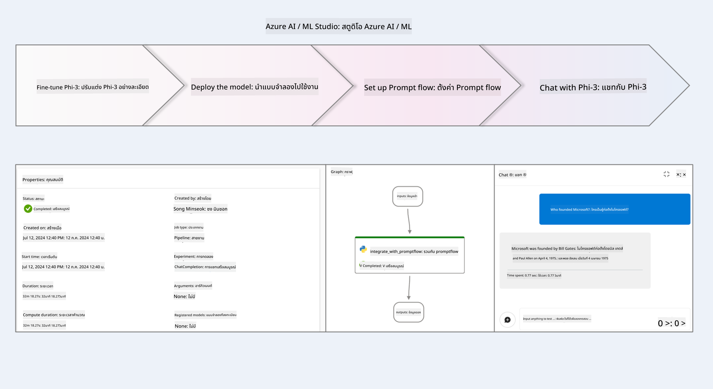

### สารบัญ

1. **[กรณีที่ 1: ตั้งค่า Azure resources และเตรียมความพร้อมสำหรับการปรับแต่ง](../../../../../../md/02.Application/01.TextAndChat/Phi3)**
    - [สร้าง Azure Machine Learning Workspace](../../../../../../md/02.Application/01.TextAndChat/Phi3)
    - [ขอเพิ่มโควต้า GPU ใน Azure Subscription](../../../../../../md/02.Application/01.TextAndChat/Phi3)
    - [เพิ่มการมอบหมายบทบาท (role assignment)](../../../../../../md/02.Application/01.TextAndChat/Phi3)
    - [ตั้งค่าโปรเจกต์](../../../../../../md/02.Application/01.TextAndChat/Phi3)
    - [เตรียมชุดข้อมูลสำหรับการปรับแต่ง](../../../../../../md/02.Application/01.TextAndChat/Phi3)

1. **[กรณีที่ 2: ปรับแต่งโมเดล Phi-3 และนำไปใช้ใน Azure Machine Learning Studio](../../../../../../md/02.Application/01.TextAndChat/Phi3)**
    - [ปรับแต่งโมเดล Phi-3](../../../../../../md/02.Application/01.TextAndChat/Phi3)
    - [นำโมเดล Phi-3 ที่ปรับแต่งแล้วไปใช้งาน](../../../../../../md/02.Application/01.TextAndChat/Phi3)

1. **[กรณีที่ 3: ผสานรวมกับ Prompt flow และแชทกับโมเดลแบบกำหนดเองใน Azure AI Foundry](../../../../../../md/02.Application/01.TextAndChat/Phi3)**
    - [ผสานรวมโมเดล Phi-3 แบบกำหนดเองกับ Prompt flow](../../../../../../md/02.Application/01.TextAndChat/Phi3)
    - [แชทกับโมเดล Phi-3 แบบกำหนดเองของคุณ](../../../../../../md/02.Application/01.TextAndChat/Phi3)

## กรณีที่ 1: ตั้งค่า Azure resources และเตรียมความพร้อมสำหรับการปรับแต่ง

### สร้าง Azure Machine Learning Workspace

1. พิมพ์ *azure machine learning* ใน **แถบค้นหา** ที่ด้านบนของหน้า portal แล้วเลือก **Azure Machine Learning** จากตัวเลือกที่ปรากฏ

    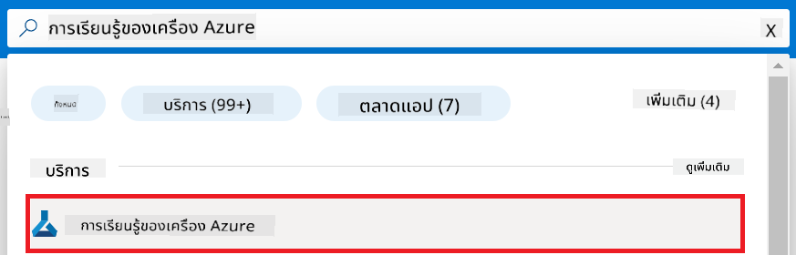

2. เลือก **+ Create** จากเมนูนำทาง

3. เลือก **New workspace** จากเมนูนำทาง

    

4. ทำตามขั้นตอนดังนี้:

    - เลือก Azure **Subscription** ของคุณ
    - เลือก **Resource group** ที่ต้องการใช้ (สร้างใหม่ถ้าจำเป็น)
    - กรอก **Workspace Name** ซึ่งต้องไม่ซ้ำกับที่มีอยู่แล้ว
    - เลือก **Region** ที่ต้องการใช้
    - เลือก **Storage account** ที่ต้องการใช้ (สร้างใหม่ถ้าจำเป็น)
    - เลือก **Key vault** ที่ต้องการใช้ (สร้างใหม่ถ้าจำเป็น)
    - เลือก **Application insights** ที่ต้องการใช้ (สร้างใหม่ถ้าจำเป็น)
    - เลือก **Container registry** ที่ต้องการใช้ (สร้างใหม่ถ้าจำเป็น)

    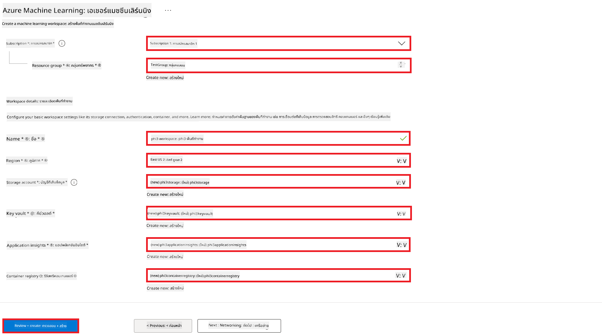

5. เลือก **Review + Create**

6. เลือก **Create**

### ขอเพิ่มโควต้า GPU ใน Azure Subscription

ในบทเรียนนี้ คุณจะได้เรียนรู้วิธีปรับแต่งและนำโมเดล Phi-3 ไปใช้งานโดยใช้ GPU สำหรับการปรับแต่งจะใช้ GPU รุ่น *Standard_NC24ads_A100_v4* ซึ่งต้องขอโควต้า ส่วนการนำไปใช้งานจะใช้ GPU รุ่น *Standard_NC6s_v3* ซึ่งก็ต้องขอโควต้าเช่นกัน

> [!NOTE]
>
> เฉพาะ Subscription แบบ Pay-As-You-Go (ประเภท Subscription มาตรฐาน) เท่านั้นที่มีสิทธิ์ขอโควต้า GPU; Subscription แบบ benefit ยังไม่รองรับในขณะนี้
>

1. เข้าไปที่ [Azure ML Studio](https://ml.azure.com/home?wt.mc_id=studentamb_279723)

1. ทำตามขั้นตอนต่อไปนี้เพื่อขอโควต้า *Standard NCADSA100v4 Family*:

    - เลือก **Quota** จากแท็บด้านซ้าย
    - เลือก **Virtual machine family** ที่ต้องการ เช่น เลือก **Standard NCADSA100v4 Family Cluster Dedicated vCPUs** ซึ่งรวม GPU *Standard_NC24ads_A100_v4*
    - เลือก **Request quota** จากเมนูนำทาง

        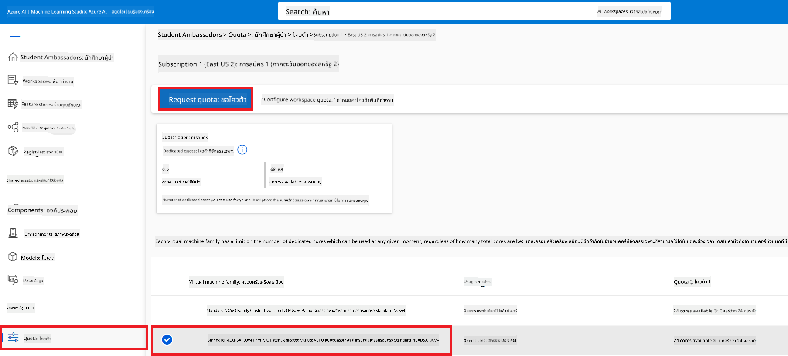

    - ในหน้าขอโควต้า กรอกจำนวน **New cores limit** ที่ต้องการ เช่น 24
    - กด **Submit** เพื่อส่งคำขอโควต้า GPU

1. ทำตามขั้นตอนต่อไปนี้เพื่อขอโควต้า *Standard NCSv3 Family*:

    - เลือก **Quota** จากแท็บด้านซ้าย
    - เลือก **Virtual machine family** ที่ต้องการ เช่น เลือก **Standard NCSv3 Family Cluster Dedicated vCPUs** ซึ่งรวม GPU *Standard_NC6s_v3*
    - เลือก **Request quota** จากเมนูนำทาง
    - ในหน้าขอโควต้า กรอกจำนวน **New cores limit** ที่ต้องการ เช่น 24
    - กด **Submit** เพื่อส่งคำขอโควต้า GPU

### เพิ่มการมอบหมายบทบาท (role assignment)

เพื่อให้สามารถปรับแต่งและนำโมเดลไปใช้ได้ คุณต้องสร้าง User Assigned Managed Identity (UAI) และมอบสิทธิ์ที่เหมาะสมให้กับมัน ซึ่ง UAI นี้จะถูกใช้สำหรับการตรวจสอบสิทธิ์ในระหว่างการนำโมเดลไปใช้งาน

#### สร้าง User Assigned Managed Identity (UAI)

1. พิมพ์ *managed identities* ใน **แถบค้นหา** ที่ด้านบนของหน้า portal แล้วเลือก **Managed Identities** จากตัวเลือกที่ปรากฏ

    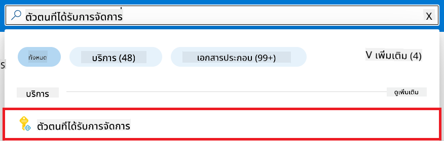

1. เลือก **+ Create**

    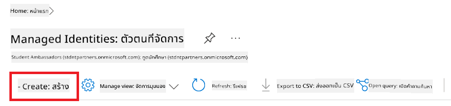

1. ทำตามขั้นตอนต่อไปนี้:

    - เลือก Azure **Subscription** ของคุณ
    - เลือก **Resource group** ที่จะใช้ (สร้างใหม่ถ้าจำเป็น)
    - เลือก **Region** ที่ต้องการใช้
    - กรอก **Name** ซึ่งต้องไม่ซ้ำกับที่มีอยู่แล้ว

    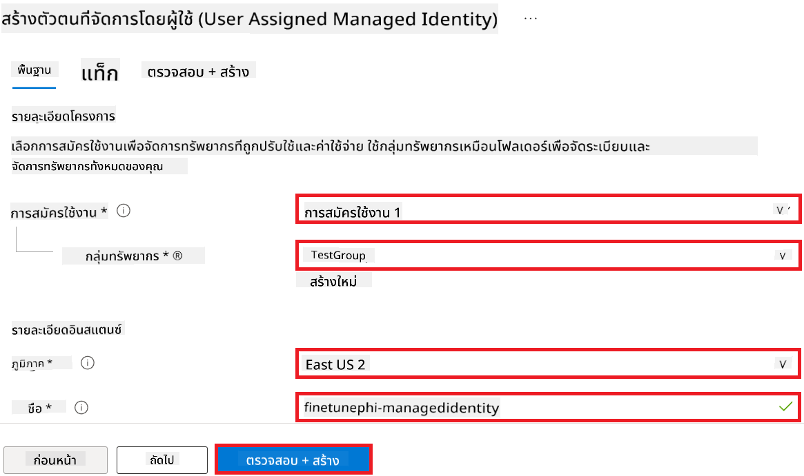

1. เลือก **Review + create**

1. เลือก **+ Create**

#### เพิ่มบทบาท Contributor ให้กับ Managed Identity

1. ไปที่ Managed Identity ที่คุณสร้างไว้

1. เลือก **Azure role assignments** จากแท็บด้านซ้าย

1. เลือก **+Add role assignment** จากเมนูนำทาง

1. ในหน้าการเพิ่มบทบาท ให้ทำตามขั้นตอนดังนี้:
    - เลือก **Scope** เป็น **Resource group**
    - เลือก Azure **Subscription** ของคุณ
    - เลือก **Resource group** ที่จะใช้
    - เลือก **Role** เป็น **Contributor**

    

2. เลือก **Save**

#### เพิ่มบทบาท Storage Blob Data Reader ให้กับ Managed Identity

1. พิมพ์ *storage accounts* ใน **แถบค้นหา** ที่ด้านบนของหน้า portal แล้วเลือก **Storage accounts** จากตัวเลือกที่ปรากฏ

    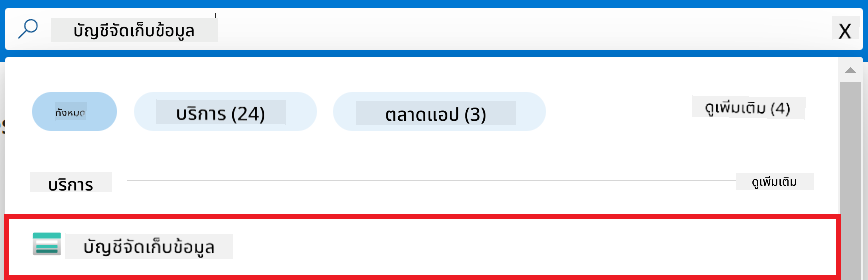

1. เลือก storage account ที่เชื่อมโยงกับ Azure Machine Learning workspace ที่คุณสร้าง เช่น *finetunephistorage*

1. ทำตามขั้นตอนต่อไปนี้เพื่อไปยังหน้าการเพิ่มบทบาท:

    - ไปที่ Azure Storage account ที่คุณสร้าง
    - เลือก **Access Control (IAM)** จากแท็บด้านซ้าย
    - เลือก **+ Add** จากเมนูนำทาง
    - เลือก **Add role assignment** จากเมนูนำทาง

    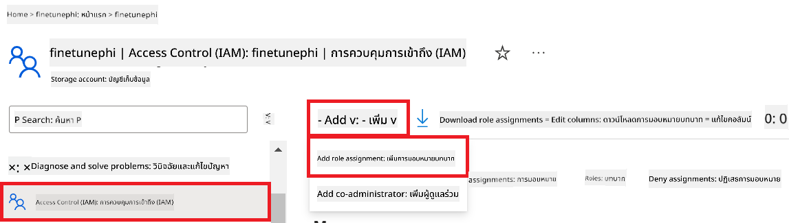

1. ในหน้าการเพิ่มบทบาท ให้ทำตามขั้นตอนต่อไปนี้:

    - ในหน้าบทบาท พิมพ์ *Storage Blob Data Reader* ใน **แถบค้นหา** แล้วเลือก **Storage Blob Data Reader** จากตัวเลือกที่ปรากฏ
    - เลือก **Next**
    - ในหน้าสมาชิก เลือก **Assign access to** เป็น **Managed identity**
    - เลือก **+ Select members**
    - ในหน้าการเลือก managed identities เลือก Azure **Subscription** ของคุณ
    - เลือก **Managed identity** เป็น **Manage Identity**
    - เลือก Managed Identity ที่คุณสร้าง เช่น *finetunephi-managedidentity*
    - เลือก **Select**

    

1. เลือก **Review + assign**

#### เพิ่มบทบาท AcrPull ให้กับ Managed Identity

1. พิมพ์ *container registries* ใน **แถบค้นหา** ที่ด้านบนของหน้า portal แล้วเลือก **Container registries** จากตัวเลือกที่ปรากฏ

    

1. เลือก container registry ที่เชื่อมโยงกับ Azure Machine Learning workspace เช่น *finetunephicontainerregistry*

1. ทำตามขั้นตอนต่อไปนี้เพื่อไปยังหน้าการเพิ่มบทบาท:

    - เลือก **Access Control (IAM)** จากแท็บด้านซ้าย
    - เลือก **+ Add** จากเมนูนำทาง
    - เลือก **Add role assignment** จากเมนูนำทาง

1. ในหน้าการเพิ่มบทบาท ให้ทำตามขั้นตอนดังนี้:

    - ในหน้าบทบาท พิมพ์ *AcrPull* ใน **แถบค้นหา** แล้วเลือก **AcrPull** จากตัวเลือกที่ปรากฏ
    - เลือก **Next**
    - ในหน้าสมาชิก เลือก **Assign access to** เป็น **Managed identity**
    - เลือก **+ Select members**
    - ในหน้าการเลือก managed identities เลือก Azure **Subscription** ของคุณ
    - เลือก **Managed identity** เป็น **Manage Identity**
    - เลือก Managed Identity ที่คุณสร้าง เช่น *finetunephi-managedidentity*
    - เลือก **Select**
    - เลือก **Review + assign**

### ตั้งค่าโปรเจกต์

เพื่อดาวน์โหลดชุดข้อมูลสำหรับการปรับแต่ง คุณจะตั้งค่าสภาพแวดล้อมในเครื่องของคุณ

ในการฝึกนี้ คุณจะ

- สร้างโฟลเดอร์สำหรับทำงาน
- สร้าง virtual environment
- ติดตั้งแพ็กเกจที่จำเป็น
- สร้างไฟล์ *download_dataset.py* เพื่อดาวน์โหลดชุดข้อมูล

#### สร้างโฟลเดอร์สำหรับทำงาน

1. เปิดหน้าต่าง terminal และพิมพ์คำสั่งต่อไปนี้เพื่อสร้างโฟลเดอร์ชื่อ *finetune-phi* ในเส้นทางเริ่มต้น

    ```console
    mkdir finetune-phi
    ```

2. พิมพ์คำสั่งต่อไปนี้ใน terminal เพื่อเข้าไปยังโฟลเดอร์ *finetune-phi* ที่คุณสร้าง

    ```console
    cd finetune-phi
    ```

#### สร้าง virtual environment

1. พิมพ์คำสั่งต่อไปนี้ใน terminal เพื่อสร้าง virtual environment ชื่อ *.venv*

    ```console
    python -m venv .venv
    ```

2. พิมพ์คำสั่งต่อไปนี้ใน terminal เพื่อเปิดใช้งาน virtual environment

    ```console
    .venv\Scripts\activate.bat
    ```

> [!NOTE]
> ถ้าทำถูกต้อง คุณจะเห็น *(.venv)* ปรากฏก่อน prompt ของคำสั่ง

#### ติดตั้งแพ็กเกจที่จำเป็น

1. พิมพ์คำสั่งต่อไปนี้ใน terminal เพื่อติดตั้งแพ็กเกจที่จำเป็น

    ```console
    pip install datasets==2.19.1
    ```

#### สร้าง `download_dataset.py`

> [!NOTE]
> โครงสร้างโฟลเดอร์สมบูรณ์:
>
> ```text
> └── YourUserName
> .    └── finetune-phi
> .        └── download_dataset.py
> ```

1. เปิด **Visual Studio Code**

1. เลือก **File** จากเมนูบาร์

1. เลือก **Open Folder**

1. เลือกโฟลเดอร์ *finetune-phi* ที่คุณสร้างไว้ ซึ่งอยู่ที่ *C:\Users\yourUserName\finetune-phi*

    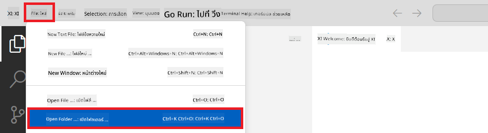

1. ในแถบด้านซ้ายของ Visual Studio Code คลิกขวาแล้วเลือก **New File** เพื่อสร้างไฟล์ใหม่ชื่อ *download_dataset.py*

    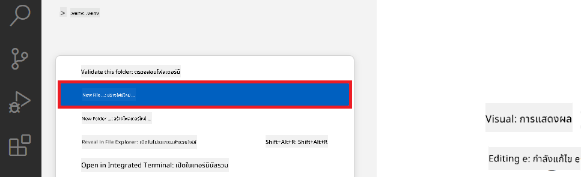

### เตรียมชุดข้อมูลสำหรับการปรับแต่ง

ในการฝึกนี้ คุณจะรันไฟล์ *download_dataset.py* เพื่อดาวน์โหลดชุดข้อมูล *ultrachat_200k* ลงในสภาพแวดล้อมในเครื่อง จากนั้นจะใช้ชุดข้อมูลนี้ในการปรับแต่งโมเดล Phi-3 ใน Azure Machine Learning

ในการฝึกนี้ คุณจะ:

- เพิ่มโค้ดในไฟล์ *download_dataset.py* เพื่อดาวน์โหลดชุดข้อมูล
- รันไฟล์ *download_dataset.py* เพื่อดาวน์โหลดชุดข้อมูลลงในเครื่องของคุณ

#### ดาวน์โหลดชุดข้อมูลด้วย *download_dataset.py*

1. เปิดไฟล์ *download_dataset.py* ใน Visual Studio Code

1. เพิ่มโค้ดต่อไปนี้ลงในไฟล์ *download_dataset.py*

    ```python
    import json
    import os
    from datasets import load_dataset

    def load_and_split_dataset(dataset_name, config_name, split_ratio):
        """
        Load and split a dataset.
        """
        # Load the dataset with the specified name, configuration, and split ratio
        dataset = load_dataset(dataset_name, config_name, split=split_ratio)
        print(f"Original dataset size: {len(dataset)}")
        
        # Split the dataset into train and test sets (80% train, 20% test)
        split_dataset = dataset.train_test_split(test_size=0.2)
        print(f"Train dataset size: {len(split_dataset['train'])}")
        print(f"Test dataset size: {len(split_dataset['test'])}")
        
        return split_dataset

    def save_dataset_to_jsonl(dataset, filepath):
        """
        Save a dataset to a JSONL file.
        """
        # Create the directory if it does not exist
        os.makedirs(os.path.dirname(filepath), exist_ok=True)
        
        # Open the file in write mode
        with open(filepath, 'w', encoding='utf-8') as f:
            # Iterate over each record in the dataset
            for record in dataset:
                # Dump the record as a JSON object and write it to the file
                json.dump(record, f)
                # Write a newline character to separate records
                f.write('\n')
        
        print(f"Dataset saved to {filepath}")

    def main():
        """
        Main function to load, split, and save the dataset.
        """
        # Load and split the ULTRACHAT_200k dataset with a specific configuration and split ratio
        dataset = load_and_split_dataset("HuggingFaceH4/ultrachat_200k", 'default', 'train_sft[:1%]')
        
        # Extract the train and test datasets from the split
        train_dataset = dataset['train']
        test_dataset = dataset['test']

        # Save the train dataset to a JSONL file
        save_dataset_to_jsonl(train_dataset, "data/train_data.jsonl")
        
        # Save the test dataset to a separate JSONL file
        save_dataset_to_jsonl(test_dataset, "data/test_data.jsonl")

    if __name__ == "__main__":
        main()

    ```

1. พิมพ์คำสั่งต่อไปนี้ใน terminal เพื่อรันสคริปต์และดาวน์โหลดชุดข้อมูลลงในเครื่องของคุณ

    ```console
    python download_dataset.py
    ```

1. ตรวจสอบว่าชุดข้อมูลถูกบันทึกอย่างถูกต้องในไดเรกทอรี *finetune-phi/data* ของคุณ

> [!NOTE]
>
> #### หมายเหตุเกี่ยวกับขนาดชุดข้อมูลและเวลาการปรับแต่ง
>
> ในบทเรียนนี้ คุณใช้เพียง 1% ของชุดข้อมูล (`split='train[:1%]'`) ซึ่งช่วยลดขนาดข้อมูลลงอย่างมาก ทำให้การอัปโหลดและการปรับแต่งรวดเร็วขึ้น คุณสามารถปรับเปอร์เซ็นต์นี้เพื่อหาจุดสมดุลระหว่างเวลาการฝึกและประสิทธิภาพของโมเดล การใช้ชุดข้อมูลย่อยจะช่วยลดเวลาที่ใช้ในการปรับแต่ง ทำให้กระบวนการง่ายขึ้นสำหรับการเรียนรู้

## กรณีที่ 2: ปรับแต่งโมเดล Phi-3 และนำไปใช้ใน Azure Machine Learning Studio

### ปรับแต่งโมเดล Phi-3

ในการฝึกนี้ คุณจะปรับแต่งโมเดล Phi-3 ใน Azure Machine Learning Studio

ในการฝึกนี้ คุณจะ:

- สร้าง cluster คอมพิวเตอร์สำหรับการปรับแต่ง
- ปรับแต่งโมเดล Phi-3 ใน Azure Machine Learning Studio

#### สร้าง cluster ค
1. ไปที่ [Azure ML Studio](https://ml.azure.com/home?wt.mc_id=studentamb_279723)

1. เลือก **Compute** จากแท็บด้านซ้าย

1. เลือก **Compute clusters** จากเมนูนำทาง

1. เลือก **+ New**

    

1. ทำตามขั้นตอนดังนี้:

    - เลือก **Region** ที่คุณต้องการใช้
    - เลือก **Virtual machine tier** เป็น **Dedicated**
    - เลือก **Virtual machine type** เป็น **GPU**
    - เลือกตัวกรอง **Virtual machine size** เป็น **Select from all options**
    - เลือก **Virtual machine size** เป็น **Standard_NC24ads_A100_v4**

    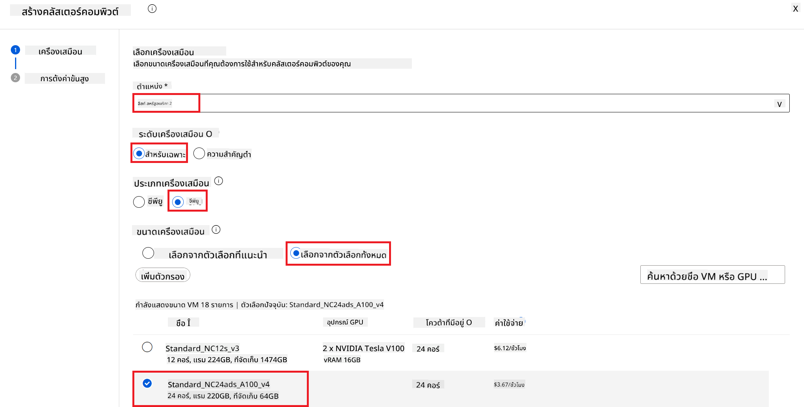

1. เลือก **Next**

1. ทำตามขั้นตอนดังนี้:

    - กรอกชื่อในช่อง **Compute name** โดยต้องไม่ซ้ำกับที่มีอยู่
    - เลือก **Minimum number of nodes** เป็น **0**
    - เลือก **Maximum number of nodes** เป็น **1**
    - เลือก **Idle seconds before scale down** เป็น **120**

    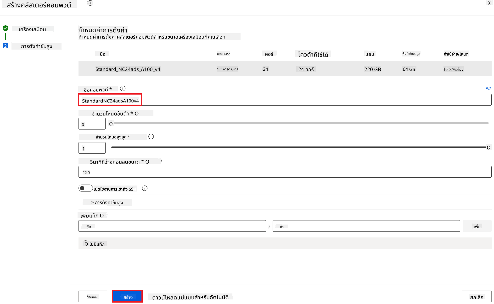

1. เลือก **Create**

#### ปรับแต่งโมเดล Phi-3

1. ไปที่ [Azure ML Studio](https://ml.azure.com/home?wt.mc_id=studentamb_279723)

1. เลือก Azure Machine Learning workspace ที่คุณสร้างไว้

    

1. ทำตามขั้นตอนดังนี้:

    - เลือก **Model catalog** จากแท็บด้านซ้าย
    - พิมพ์ *phi-3-mini-4k* ในช่อง **search bar** แล้วเลือก **Phi-3-mini-4k-instruct** จากตัวเลือกที่แสดงขึ้นมา

    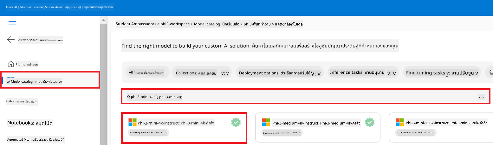

1. เลือก **Fine-tune** จากเมนูนำทาง

    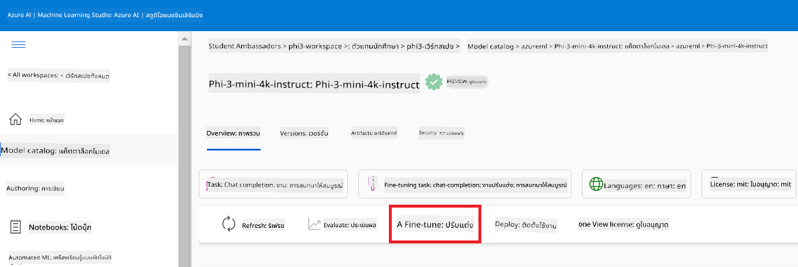

1. ทำตามขั้นตอนดังนี้:

    - เลือก **Select task type** เป็น **Chat completion**
    - เลือก **+ Select data** เพื่ออัปโหลด **Training data**
    - เลือกประเภทการอัปโหลด Validation data เป็น **Provide different validation data**
    - เลือก **+ Select data** เพื่ออัปโหลด **Validation data**

    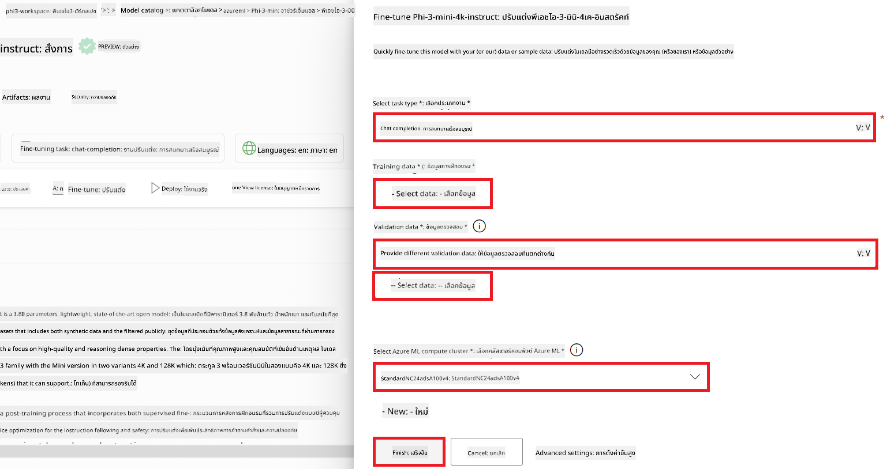

    > [!TIP]
    >
    > คุณสามารถเลือก **Advanced settings** เพื่อปรับแต่งการตั้งค่า เช่น **learning_rate** และ **lr_scheduler_type** เพื่อเพิ่มประสิทธิภาพการปรับแต่งโมเดลให้เหมาะสมกับความต้องการของคุณ

1. เลือก **Finish**

1. ในแบบฝึกหัดนี้ คุณได้ปรับแต่งโมเดล Phi-3 สำเร็จแล้ว โปรดทราบว่ากระบวนการปรับแต่งอาจใช้เวลานาน หลังจากเริ่มงาน fine-tuning แล้ว คุณต้องรอจนกว่าจะเสร็จสมบูรณ์ คุณสามารถติดตามสถานะของงาน fine-tuning ได้โดยไปที่แท็บ Jobs ทางด้านซ้ายของ Azure Machine Learning Workspace ของคุณ ในชุดถัดไป คุณจะได้เรียนรู้การนำโมเดลที่ปรับแต่งแล้วไปใช้งานและเชื่อมต่อกับ Prompt flow

    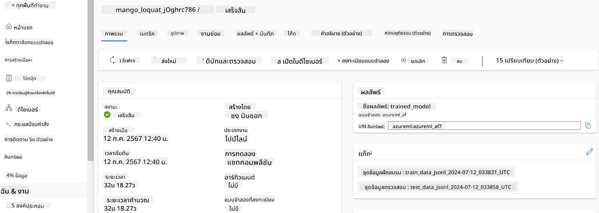

### นำโมเดล Phi-3 ที่ปรับแต่งแล้วไปใช้งาน

เพื่อเชื่อมต่อโมเดล Phi-3 ที่ปรับแต่งแล้วกับ Prompt flow คุณต้องนำโมเดลไป deploy เพื่อให้สามารถเรียกใช้สำหรับการทำนายแบบเรียลไทม์ได้ กระบวนการนี้รวมถึงการลงทะเบียนโมเดล สร้าง online endpoint และนำโมเดลไป deploy

ในแบบฝึกหัดนี้ คุณจะ:

- ลงทะเบียนโมเดลที่ปรับแต่งแล้วใน Azure Machine Learning workspace
- สร้าง online endpoint
- นำโมเดล Phi-3 ที่ลงทะเบียนไป deploy

#### ลงทะเบียนโมเดลที่ปรับแต่งแล้ว

1. ไปที่ [Azure ML Studio](https://ml.azure.com/home?wt.mc_id=studentamb_279723)

1. เลือก Azure Machine Learning workspace ที่คุณสร้างไว้

    

1. เลือก **Models** จากแท็บด้านซ้าย

1. เลือก **+ Register**

1. เลือก **From a job output**

    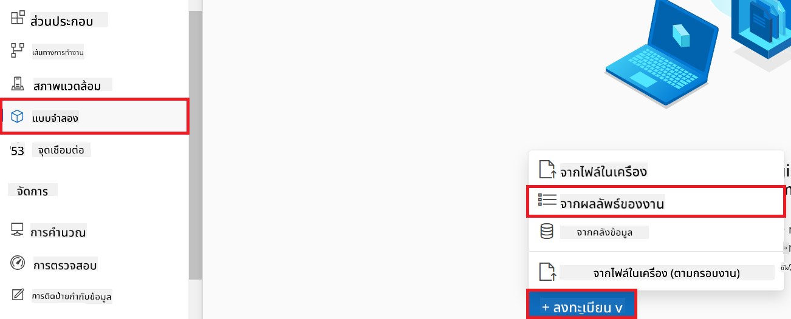

1. เลือกงานที่คุณสร้างไว้

    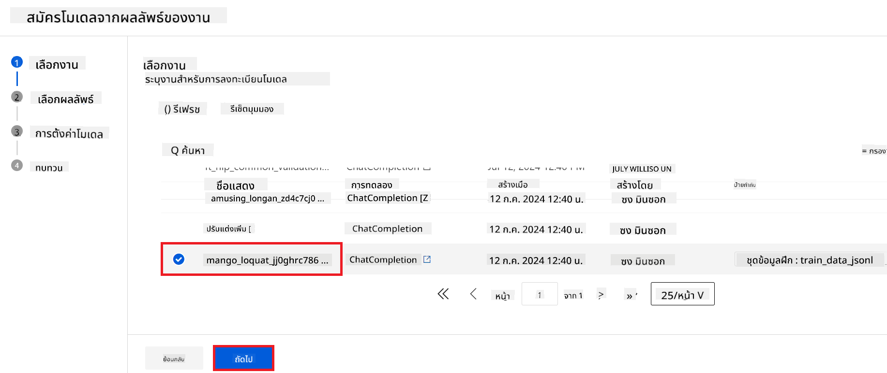

1. เลือก **Next**

1. เลือก **Model type** เป็น **MLflow**

1. ตรวจสอบให้แน่ใจว่าเลือก **Job output** แล้ว (จะถูกเลือกโดยอัตโนมัติ)

    

2. เลือก **Next**

3. เลือก **Register**

    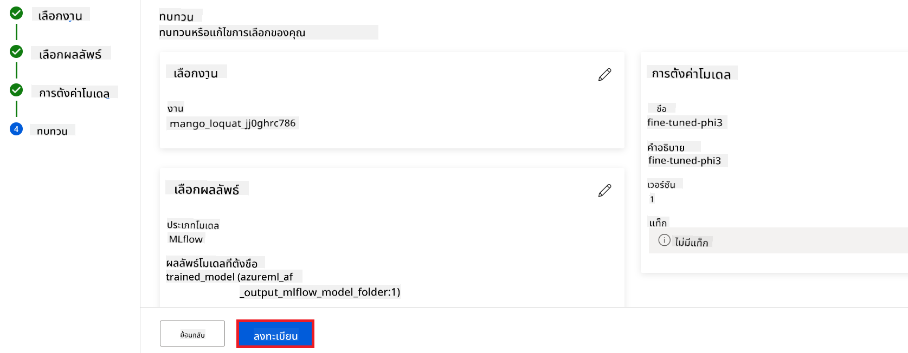

4. คุณสามารถดูโมเดลที่ลงทะเบียนแล้วได้โดยไปที่เมนู **Models** จากแท็บด้านซ้าย

    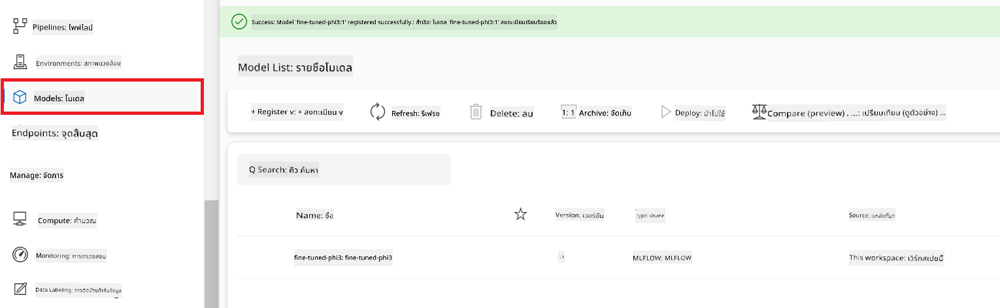

#### นำโมเดลที่ปรับแต่งแล้วไป deploy

1. ไปที่ Azure Machine Learning workspace ที่คุณสร้างไว้

1. เลือก **Endpoints** จากแท็บด้านซ้าย

1. เลือก **Real-time endpoints** จากเมนูนำทาง

    

1. เลือก **Create**

1. เลือกโมเดลที่ลงทะเบียนไว้ที่คุณสร้างไว้

    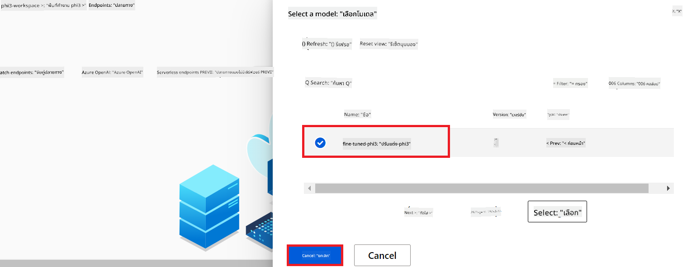

1. เลือก **Select**

1. ทำตามขั้นตอนดังนี้:

    - เลือก **Virtual machine** เป็น *Standard_NC6s_v3*
    - เลือกจำนวน **Instance count** ที่ต้องการใช้ เช่น *1*
    - เลือก **Endpoint** เป็น **New** เพื่อสร้าง endpoint ใหม่
    - กรอกชื่อในช่อง **Endpoint name** โดยต้องไม่ซ้ำกับที่มีอยู่
    - กรอกชื่อในช่อง **Deployment name** โดยต้องไม่ซ้ำกับที่มีอยู่

    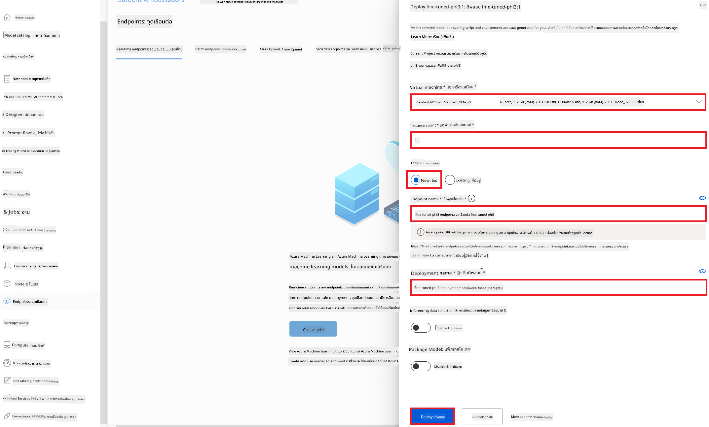

1. เลือก **Deploy**

> [!WARNING]
> เพื่อหลีกเลี่ยงค่าใช้จ่ายเพิ่มเติมในบัญชีของคุณ อย่าลืมลบ endpoint ที่สร้างไว้ใน Azure Machine Learning workspace เมื่อไม่ใช้งานแล้ว
>

#### ตรวจสอบสถานะการ deploy ใน Azure Machine Learning Workspace

1. ไปที่ Azure Machine Learning workspace ที่คุณสร้างไว้

1. เลือก **Endpoints** จากแท็บด้านซ้าย

1. เลือก endpoint ที่คุณสร้างไว้

    

1. ในหน้านี้ คุณสามารถจัดการ endpoint ระหว่างกระบวนการ deploy ได้

> [!NOTE]
> เมื่อการ deploy เสร็จสมบูรณ์ ให้ตรวจสอบว่า **Live traffic** ตั้งค่าเป็น **100%** หากไม่ใช่ ให้เลือก **Update traffic** เพื่อปรับการตั้งค่าการจราจร โปรดทราบว่าคุณไม่สามารถทดสอบโมเดลได้หากการจราจรถูกตั้งเป็น 0%
>
> 
>

## สถานการณ์ที่ 3: เชื่อมต่อกับ Prompt flow และแชทกับโมเดลที่ปรับแต่งเองใน Azure AI Foundry

### เชื่อมต่อโมเดล Phi-3 ที่ปรับแต่งเองกับ Prompt flow

หลังจากนำโมเดลที่ปรับแต่งสำเร็จไป deploy แล้ว คุณสามารถเชื่อมต่อโมเดลนี้กับ Prompt Flow เพื่อใช้งานในแอปพลิเคชันแบบเรียลไทม์ เปิดโอกาสให้ทำงานแบบโต้ตอบกับโมเดล Phi-3 ที่ปรับแต่งเองได้หลากหลายรูปแบบ

ในแบบฝึกหัดนี้ คุณจะ:

- สร้าง Azure AI Foundry Hub
- สร้าง Azure AI Foundry Project
- สร้าง Prompt flow
- เพิ่มการเชื่อมต่อแบบกำหนดเองสำหรับโมเดล Phi-3 ที่ปรับแต่งแล้ว
- ตั้งค่า Prompt flow เพื่อแชทกับโมเดล Phi-3 ที่ปรับแต่งเองของคุณ

> [!NOTE]
> คุณยังสามารถเชื่อมต่อกับ Promptflow โดยใช้ Azure ML Studio ได้ กระบวนการเชื่อมต่อเดียวกันนี้สามารถนำไปใช้กับ Azure ML Studio ได้เช่นกัน

#### สร้าง Azure AI Foundry Hub

คุณต้องสร้าง Hub ก่อนสร้าง Project โดย Hub จะทำหน้าที่เหมือน Resource Group ที่ช่วยจัดระเบียบและจัดการหลายๆ Project ภายใน Azure AI Foundry

1. ไปที่ [Azure AI Foundry](https://ai.azure.com/?WT.mc_id=aiml-137032-kinfeylo)

1. เลือก **All hubs** จากแท็บด้านซ้าย

1. เลือก **+ New hub** จากเมนูนำทาง

    

1. ทำตามขั้นตอนดังนี้:

    - กรอกชื่อในช่อง **Hub name** โดยต้องไม่ซ้ำกับที่มีอยู่
    - เลือก Azure **Subscription** ของคุณ
    - เลือก **Resource group** ที่ต้องการใช้ (สร้างใหม่ถ้าจำเป็น)
    - เลือก **Location** ที่ต้องการใช้
    - เลือก **Connect Azure AI Services** ที่ต้องการใช้ (สร้างใหม่ถ้าจำเป็น)
    - เลือก **Connect Azure AI Search** เป็น **Skip connecting**

    

1. เลือก **Next**

#### สร้าง Azure AI Foundry Project

1. ใน Hub ที่คุณสร้างไว้ เลือก **All projects** จากแท็บด้านซ้าย

1. เลือก **+ New project** จากเมนูนำทาง

    

1. กรอกชื่อในช่อง **Project name** โดยต้องไม่ซ้ำกับที่มีอยู่

    

1. เลือก **Create a project**

#### เพิ่มการเชื่อมต่อแบบกำหนดเองสำหรับโมเดล Phi-3 ที่ปรับแต่งแล้ว

เพื่อเชื่อมต่อโมเดล Phi-3 ที่ปรับแต่งเองกับ Prompt flow คุณต้องบันทึก endpoint และ key ของโมเดลในรูปแบบการเชื่อมต่อแบบกำหนดเอง ซึ่งจะช่วยให้สามารถเข้าถึงโมเดล Phi-3 ของคุณใน Prompt flow ได้

#### ตั้งค่า api key และ endpoint uri ของโมเดล Phi-3 ที่ปรับแต่งแล้ว

1. ไปที่ [Azure ML Studio](https://ml.azure.com/home?WT.mc_id=aiml-137032-kinfeylo)

1. ไปที่ Azure Machine Learning workspace ที่คุณสร้างไว้

1. เลือก **Endpoints** จากแท็บด้านซ้าย

    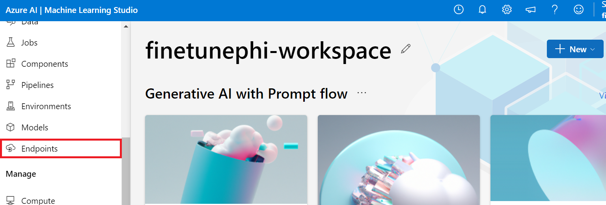

1. เลือก endpoint ที่คุณสร้างไว้

    

1. เลือก **Consume** จากเมนูนำทาง

1. คัดลอก **REST endpoint** และ **Primary key** ของคุณ


#### เพิ่มการเชื่อมต่อแบบกำหนดเอง

1. เข้าไปที่ [Azure AI Foundry](https://ai.azure.com/?WT.mc_id=aiml-137032-kinfeylo)

1. ไปที่โปรเจกต์ Azure AI Foundry ที่คุณสร้างไว้

1. ในโปรเจกต์ที่สร้าง เลือก **Settings** จากแท็บด้านซ้าย

1. เลือก **+ New connection**

    

1. เลือก **Custom keys** จากเมนูนำทาง

    

1. ทำตามขั้นตอนดังนี้:

    - เลือก **+ Add key value pairs**
    - สำหรับชื่อคีย์ ให้กรอก **endpoint** และวาง endpoint ที่คุณคัดลอกมาจาก Azure ML Studio ในช่องค่า
    - เลือก **+ Add key value pairs** อีกครั้ง
    - สำหรับชื่อคีย์ ให้กรอก **key** และวางคีย์ที่คัดลอกมาจาก Azure ML Studio ในช่องค่า
    - หลังจากเพิ่มคีย์แล้ว ให้เลือก **is secret** เพื่อป้องกันไม่ให้คีย์ถูกเปิดเผย

    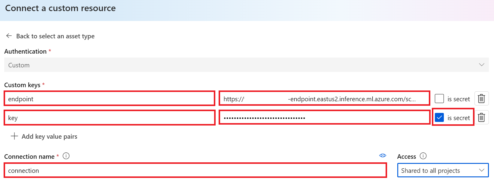

1. เลือก **Add connection**

#### สร้าง Prompt flow

คุณได้เพิ่มการเชื่อมต่อแบบกำหนดเองใน Azure AI Foundry แล้ว ตอนนี้เราจะสร้าง Prompt flow โดยทำตามขั้นตอนดังนี้ จากนั้นคุณจะเชื่อมต่อ Prompt flow นี้กับการเชื่อมต่อแบบกำหนดเอง เพื่อให้สามารถใช้โมเดลที่ปรับแต่งมาแล้วภายใน Prompt flow ได้

1. ไปที่โปรเจกต์ Azure AI Foundry ที่คุณสร้างไว้

1. เลือก **Prompt flow** จากแท็บด้านซ้าย

1. เลือก **+ Create** จากเมนูนำทาง

    

1. เลือก **Chat flow** จากเมนูนำทาง

    

1. กรอกชื่อโฟลเดอร์ที่ต้องการใช้

    

2. เลือก **Create**

#### ตั้งค่า Prompt flow เพื่อแชทกับโมเดล Phi-3 แบบกำหนดเองของคุณ

คุณต้องรวมโมเดล Phi-3 ที่ปรับแต่งมาแล้วเข้ากับ Prompt flow อย่างไรก็ตาม Prompt flow ที่มีอยู่ไม่ได้ออกแบบมาเพื่อวัตถุประสงค์นี้ ดังนั้นคุณจึงต้องออกแบบ Prompt flow ใหม่เพื่อให้รองรับการเชื่อมต่อกับโมเดลแบบกำหนดเอง

1. ใน Prompt flow ให้ทำตามขั้นตอนต่อไปนี้เพื่อสร้างโฟลว์ใหม่:

    - เลือก **Raw file mode**
    - ลบโค้ดทั้งหมดในไฟล์ *flow.dag.yml* ออก
    - เพิ่มโค้ดต่อไปนี้ลงในไฟล์ *flow.dag.yml*

        ```yml
        inputs:
          input_data:
            type: string
            default: "Who founded Microsoft?"

        outputs:
          answer:
            type: string
            reference: ${integrate_with_promptflow.output}

        nodes:
        - name: integrate_with_promptflow
          type: python
          source:
            type: code
            path: integrate_with_promptflow.py
          inputs:
            input_data: ${inputs.input_data}
        ```

    - เลือก **Save**

    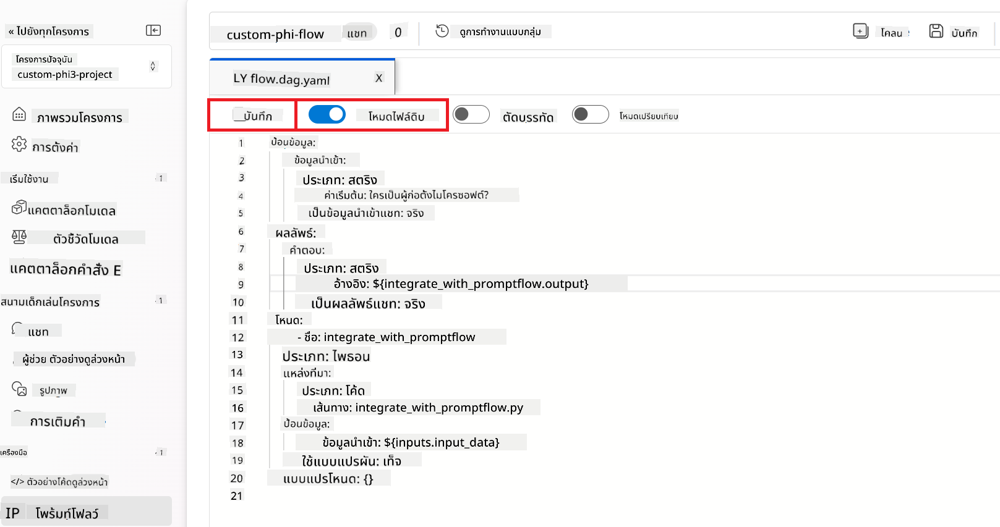

1. เพิ่มโค้ดต่อไปนี้ลงในไฟล์ *integrate_with_promptflow.py* เพื่อใช้โมเดล Phi-3 แบบกำหนดเองใน Prompt flow

    ```python
    import logging
    import requests
    from promptflow import tool
    from promptflow.connections import CustomConnection

    # Logging setup
    logging.basicConfig(
        format="%(asctime)s - %(levelname)s - %(name)s - %(message)s",
        datefmt="%Y-%m-%d %H:%M:%S",
        level=logging.DEBUG
    )
    logger = logging.getLogger(__name__)

    def query_phi3_model(input_data: str, connection: CustomConnection) -> str:
        """
        Send a request to the Phi-3 model endpoint with the given input data using Custom Connection.
        """

        # "connection" is the name of the Custom Connection, "endpoint", "key" are the keys in the Custom Connection
        endpoint_url = connection.endpoint
        api_key = connection.key

        headers = {
            "Content-Type": "application/json",
            "Authorization": f"Bearer {api_key}"
        }
        data = {
            "input_data": {
                "input_string": [
                    {"role": "user", "content": input_data}
                ],
                "parameters": {
                    "temperature": 0.7,
                    "max_new_tokens": 128
                }
            }
        }
        try:
            response = requests.post(endpoint_url, json=data, headers=headers)
            response.raise_for_status()
            
            # Log the full JSON response
            logger.debug(f"Full JSON response: {response.json()}")

            result = response.json()["output"]
            logger.info("Successfully received response from Azure ML Endpoint.")
            return result
        except requests.exceptions.RequestException as e:
            logger.error(f"Error querying Azure ML Endpoint: {e}")
            raise

    @tool
    def my_python_tool(input_data: str, connection: CustomConnection) -> str:
        """
        Tool function to process input data and query the Phi-3 model.
        """
        return query_phi3_model(input_data, connection)

    ```

    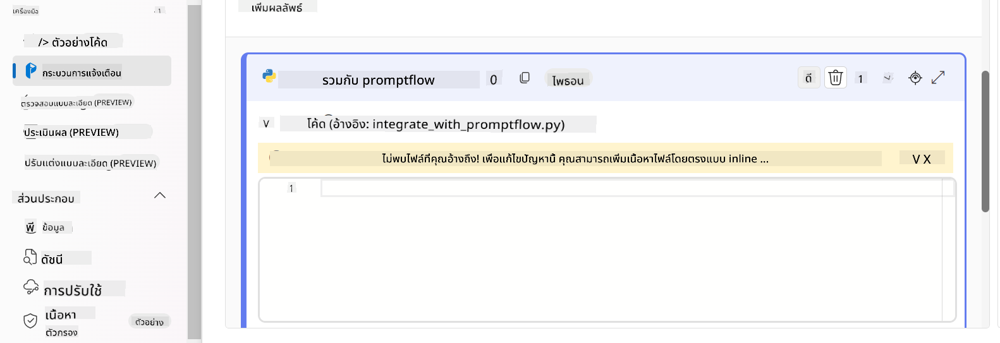

> [!NOTE]
> สำหรับข้อมูลเพิ่มเติมเกี่ยวกับการใช้ Prompt flow ใน Azure AI Foundry คุณสามารถดูได้ที่ [Prompt flow in Azure AI Foundry](https://learn.microsoft.com/azure/ai-studio/how-to/prompt-flow)

1. เลือก **Chat input**, **Chat output** เพื่อเปิดใช้งานการแชทกับโมเดลของคุณ

    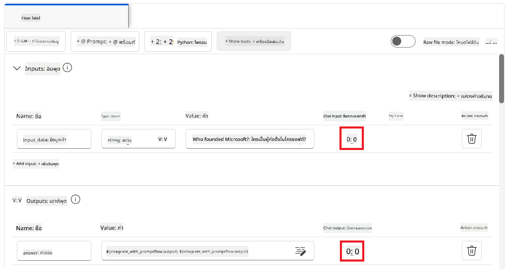

1. ตอนนี้คุณพร้อมที่จะเริ่มแชทกับโมเดล Phi-3 แบบกำหนดเองของคุณแล้ว ในแบบฝึกหัดถัดไป คุณจะได้เรียนรู้วิธีเริ่ม Prompt flow และใช้งานเพื่อแชทกับโมเดล Phi-3 ที่ปรับแต่งแล้วของคุณ

> [!NOTE]
>
> โฟลว์ที่สร้างใหม่ควรมีลักษณะเหมือนภาพด้านล่างนี้:
>
> 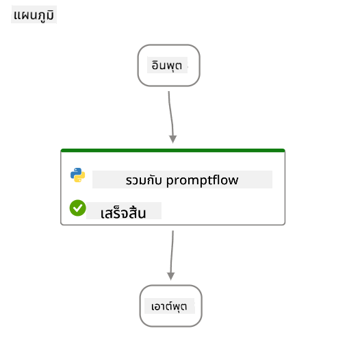
>

### แชทกับโมเดล Phi-3 แบบกำหนดเองของคุณ

เมื่อคุณปรับแต่งและรวมโมเดล Phi-3 แบบกำหนดเองเข้ากับ Prompt flow เรียบร้อยแล้ว คุณก็พร้อมที่จะเริ่มโต้ตอบกับมัน แบบฝึกหัดนี้จะนำคุณผ่านขั้นตอนการตั้งค่าและเริ่มต้นแชทกับโมเดลของคุณโดยใช้ Prompt flow โดยการทำตามขั้นตอนเหล่านี้ คุณจะสามารถใช้ประโยชน์จากความสามารถของโมเดล Phi-3 ที่ปรับแต่งมาอย่างเต็มที่สำหรับงานและการสนทนาต่างๆ

- แชทกับโมเดล Phi-3 แบบกำหนดเองของคุณโดยใช้ Prompt flow

#### เริ่ม Prompt flow

1. เลือก **Start compute sessions** เพื่อเริ่ม Prompt flow

    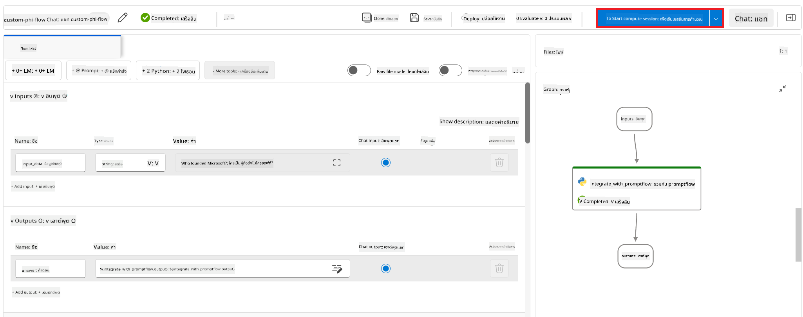

1. เลือก **Validate and parse input** เพื่อรีเฟรชพารามิเตอร์

    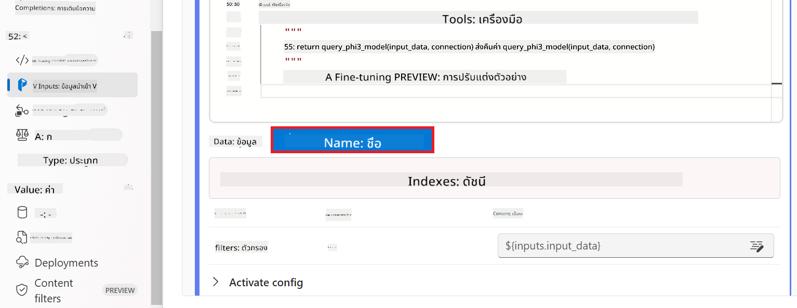

1. เลือก **Value** ของ **connection** ที่เชื่อมต่อกับการเชื่อมต่อแบบกำหนดเองที่คุณสร้างไว้ เช่น *connection*

    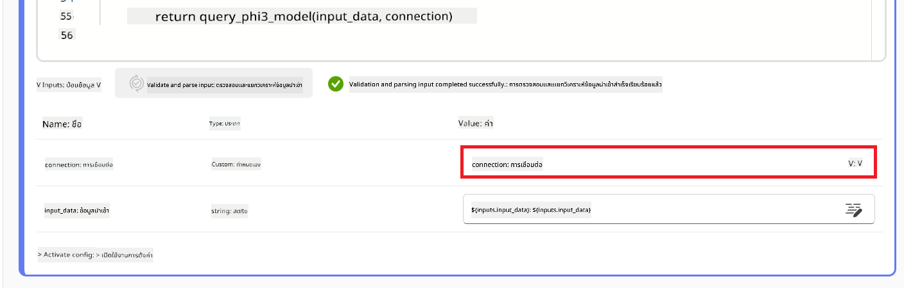

#### แชทกับโมเดลแบบกำหนดเองของคุณ

1. เลือก **Chat**

    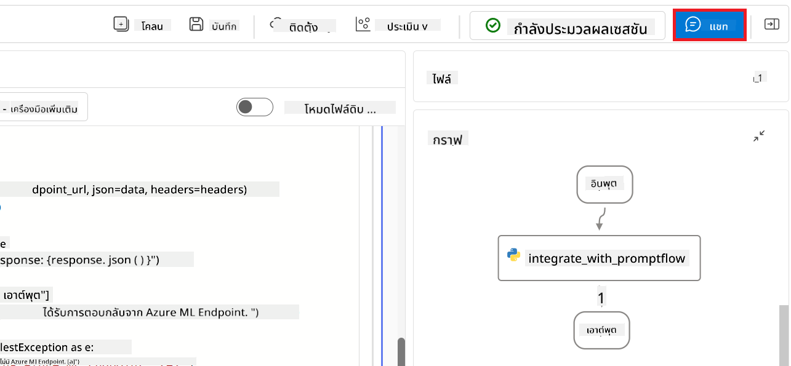

1. นี่คือตัวอย่างผลลัพธ์: ตอนนี้คุณสามารถแชทกับโมเดล Phi-3 แบบกำหนดเองของคุณได้ แนะนำให้ถามคำถามที่เกี่ยวข้องกับข้อมูลที่ใช้ในการปรับแต่งโมเดล

    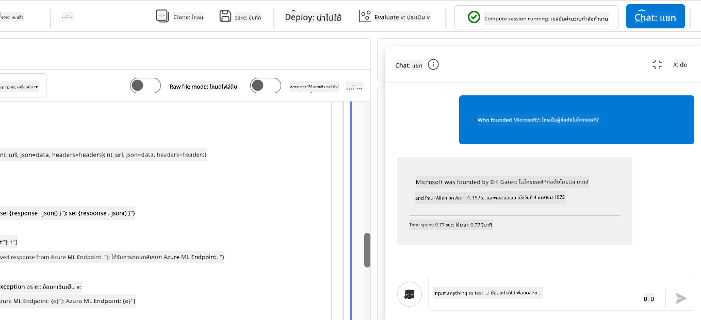

**ข้อจำกัดความรับผิดชอบ**:  
เอกสารนี้ได้รับการแปลโดยใช้บริการแปลภาษาอัตโนมัติ [Co-op Translator](https://github.com/Azure/co-op-translator) แม้ว่าเราจะพยายามให้ความถูกต้องสูงสุด โปรดทราบว่าการแปลโดยอัตโนมัติอาจมีข้อผิดพลาดหรือความไม่ถูกต้อง เอกสารต้นฉบับในภาษาต้นทางถือเป็นแหล่งข้อมูลที่เชื่อถือได้ สำหรับข้อมูลที่สำคัญ ขอแนะนำให้ใช้บริการแปลโดยมนุษย์ผู้เชี่ยวชาญ เราไม่รับผิดชอบต่อความเข้าใจผิดหรือการตีความที่ผิดพลาดใดๆ ที่เกิดจากการใช้การแปลนี้