<!--
CO_OP_TRANSLATOR_METADATA:
{
  "original_hash": "ecbd9179a21edbaafaf114d47f09f3e3",
  "translation_date": "2025-07-17T01:31:23+00:00",
  "source_file": "md/02.Application/01.TextAndChat/Phi3/E2E_Phi-3-FineTuning_PromptFlow_Integration_AIFoundry.md",
  "language_code": "th"
}
-->
# ปรับแต่งและผสานรวมโมเดล Phi-3 ที่กำหนดเองกับ Prompt flow ใน Azure AI Foundry

ตัวอย่างแบบครบวงจร (E2E) นี้อ้างอิงจากคำแนะนำ "[Fine-Tune and Integrate Custom Phi-3 Models with Prompt Flow in Azure AI Foundry](https://techcommunity.microsoft.com/t5/educator-developer-blog/fine-tune-and-integrate-custom-phi-3-models-with-prompt-flow-in/ba-p/4191726?WT.mc_id=aiml-137032-kinfeylo)" จาก Microsoft Tech Community ซึ่งแนะนำกระบวนการปรับแต่ง การปรับใช้ และการผสานรวมโมเดล Phi-3 ที่กำหนดเองกับ Prompt flow ใน Azure AI Foundry  
แตกต่างจากตัวอย่าง E2E "[Fine-Tune and Integrate Custom Phi-3 Models with Prompt Flow](./E2E_Phi-3-FineTuning_PromptFlow_Integration.md)" ที่ต้องรันโค้ดในเครื่อง ตัวอย่างนี้เน้นการปรับแต่งและผสานรวมโมเดลภายใน Azure AI / ML Studio เท่านั้น

## ภาพรวม

ในตัวอย่าง E2E นี้ คุณจะได้เรียนรู้วิธีปรับแต่งโมเดล Phi-3 และผสานรวมกับ Prompt flow ใน Azure AI Foundry โดยใช้ Azure AI / ML Studio เพื่อสร้างเวิร์กโฟลว์สำหรับการปรับใช้และใช้งานโมเดล AI ที่กำหนดเอง ตัวอย่างนี้แบ่งออกเป็นสามสถานการณ์:

**สถานการณ์ที่ 1: ตั้งค่า Azure resources และเตรียมความพร้อมสำหรับการปรับแต่ง**

**สถานการณ์ที่ 2: ปรับแต่งโมเดล Phi-3 และปรับใช้ใน Azure Machine Learning Studio**

**สถานการณ์ที่ 3: ผสานรวมกับ Prompt flow และสนทนากับโมเดลที่กำหนดเองใน Azure AI Foundry**

ภาพรวมของตัวอย่าง E2E นี้มีดังนี้


### สารบัญ

1. **[สถานการณ์ที่ 1: ตั้งค่า Azure resources และเตรียมความพร้อมสำหรับการปรับแต่ง](../../../../../../md/02.Application/01.TextAndChat/Phi3)**
    - [สร้าง Azure Machine Learning Workspace](../../../../../../md/02.Application/01.TextAndChat/Phi3)
    - [ขอเพิ่มโควต้า GPU ใน Azure Subscription](../../../../../../md/02.Application/01.TextAndChat/Phi3)
    - [เพิ่มการมอบหมายบทบาท](../../../../../../md/02.Application/01.TextAndChat/Phi3)
    - [ตั้งค่าโปรเจกต์](../../../../../../md/02.Application/01.TextAndChat/Phi3)
    - [เตรียมชุดข้อมูลสำหรับการปรับแต่ง](../../../../../../md/02.Application/01.TextAndChat/Phi3)

1. **[สถานการณ์ที่ 2: ปรับแต่งโมเดล Phi-3 และปรับใช้ใน Azure Machine Learning Studio](../../../../../../md/02.Application/01.TextAndChat/Phi3)**
    - [ปรับแต่งโมเดล Phi-3](../../../../../../md/02.Application/01.TextAndChat/Phi3)
    - [ปรับใช้โมเดล Phi-3 ที่ปรับแต่งแล้ว](../../../../../../md/02.Application/01.TextAndChat/Phi3)

1. **[สถานการณ์ที่ 3: ผสานรวมกับ Prompt flow และสนทนากับโมเดลที่กำหนดเองใน Azure AI Foundry](../../../../../../md/02.Application/01.TextAndChat/Phi3)**
    - [ผสานรวมโมเดล Phi-3 ที่กำหนดเองกับ Prompt flow](../../../../../../md/02.Application/01.TextAndChat/Phi3)
    - [สนทนากับโมเดล Phi-3 ที่กำหนดเองของคุณ](../../../../../../md/02.Application/01.TextAndChat/Phi3)

## สถานการณ์ที่ 1: ตั้งค่า Azure resources และเตรียมความพร้อมสำหรับการปรับแต่ง

### สร้าง Azure Machine Learning Workspace

1. พิมพ์ *azure machine learning* ใน **แถบค้นหา** ที่ด้านบนของหน้า portal แล้วเลือก **Azure Machine Learning** จากตัวเลือกที่ปรากฏ

    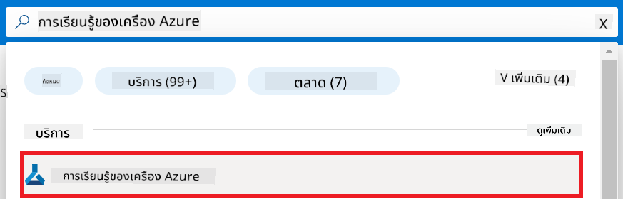

2. เลือก **+ Create** จากเมนูนำทาง

3. เลือก **New workspace** จากเมนูนำทาง

    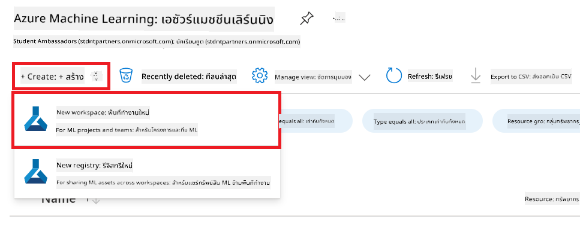

4. ดำเนินการดังนี้:

    - เลือก **Subscription** ของคุณ
    - เลือก **Resource group** ที่จะใช้ (สร้างใหม่ถ้าจำเป็น)
    - กรอกชื่อ **Workspace Name** ซึ่งต้องไม่ซ้ำกับที่มีอยู่
    - เลือก **Region** ที่ต้องการใช้
    - เลือก **Storage account** ที่จะใช้ (สร้างใหม่ถ้าจำเป็น)
    - เลือก **Key vault** ที่จะใช้ (สร้างใหม่ถ้าจำเป็น)
    - เลือก **Application insights** ที่จะใช้ (สร้างใหม่ถ้าจำเป็น)
    - เลือก **Container registry** ที่จะใช้ (สร้างใหม่ถ้าจำเป็น)

    

5. เลือก **Review + Create**

6. เลือก **Create**

### ขอเพิ่มโควต้า GPU ใน Azure Subscription

ในบทแนะนำนี้ คุณจะได้เรียนรู้วิธีปรับแต่งและปรับใช้โมเดล Phi-3 โดยใช้ GPU สำหรับการปรับแต่งจะใช้ GPU รุ่น *Standard_NC24ads_A100_v4* ซึ่งต้องขอโควต้า สำหรับการปรับใช้จะใช้ GPU รุ่น *Standard_NC6s_v3* ซึ่งก็ต้องขอโควต้าเช่นกัน

> [!NOTE]
>
> เฉพาะ Subscription แบบ Pay-As-You-Go (ประเภท Subscription มาตรฐาน) เท่านั้นที่สามารถขอจัดสรร GPU ได้ Subscription ประเภท benefit ยังไม่รองรับในขณะนี้
>

1. เข้าไปที่ [Azure ML Studio](https://ml.azure.com/home?wt.mc_id=studentamb_279723)

1. ดำเนินการดังนี้เพื่อขอโควต้า *Standard NCADSA100v4 Family*:

    - เลือก **Quota** จากแท็บด้านซ้าย
    - เลือก **Virtual machine family** ที่ต้องการใช้ เช่น เลือก **Standard NCADSA100v4 Family Cluster Dedicated vCPUs** ซึ่งรวม GPU รุ่น *Standard_NC24ads_A100_v4*
    - เลือก **Request quota** จากเมนูนำทาง

        

    - ในหน้า Request quota กรอกจำนวน **New cores limit** ที่ต้องการ เช่น 24
    - ในหน้า Request quota เลือก **Submit** เพื่อส่งคำขอโควต้า GPU

1. ดำเนินการดังนี้เพื่อขอโควต้า *Standard NCSv3 Family*:

    - เลือก **Quota** จากแท็บด้านซ้าย
    - เลือก **Virtual machine family** ที่ต้องการใช้ เช่น เลือก **Standard NCSv3 Family Cluster Dedicated vCPUs** ซึ่งรวม GPU รุ่น *Standard_NC6s_v3*
    - เลือก **Request quota** จากเมนูนำทาง
    - ในหน้า Request quota กรอกจำนวน **New cores limit** ที่ต้องการ เช่น 24
    - ในหน้า Request quota เลือก **Submit** เพื่อส่งคำขอโควต้า GPU

### เพิ่มการมอบหมายบทบาท

เพื่อปรับแต่งและปรับใช้โมเดลของคุณ คุณต้องสร้าง User Assigned Managed Identity (UAI) และมอบสิทธิ์ที่เหมาะสมให้กับมันก่อน UAI นี้จะใช้สำหรับการยืนยันตัวตนในระหว่างการปรับใช้

#### สร้าง User Assigned Managed Identity (UAI)

1. พิมพ์ *managed identities* ใน **แถบค้นหา** ที่ด้านบนของหน้า portal แล้วเลือก **Managed Identities** จากตัวเลือกที่ปรากฏ

    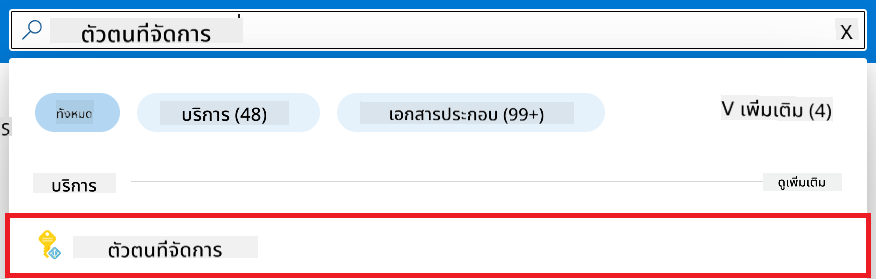

1. เลือก **+ Create**

    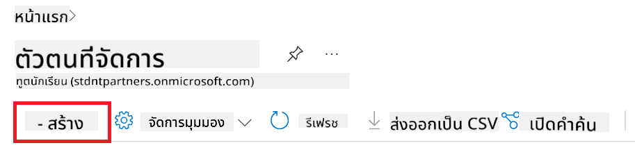

1. ดำเนินการดังนี้:

    - เลือก **Subscription** ของคุณ
    - เลือก **Resource group** ที่จะใช้ (สร้างใหม่ถ้าจำเป็น)
    - เลือก **Region** ที่ต้องการใช้
    - กรอกชื่อ **Name** ซึ่งต้องไม่ซ้ำกับที่มีอยู่

    

1. เลือก **Review + create**

1. เลือก **+ Create**

#### เพิ่มบทบาท Contributor ให้กับ Managed Identity

1. ไปที่ Managed Identity ที่คุณสร้างไว้

1. เลือก **Azure role assignments** จากแท็บด้านซ้าย

1. เลือก **+Add role assignment** จากเมนูนำทาง

1. ในหน้า Add role assignment ดำเนินการดังนี้:
    - เลือก **Scope** เป็น **Resource group**
    - เลือก **Subscription** ของคุณ
    - เลือก **Resource group** ที่จะใช้
    - เลือก **Role** เป็น **Contributor**

    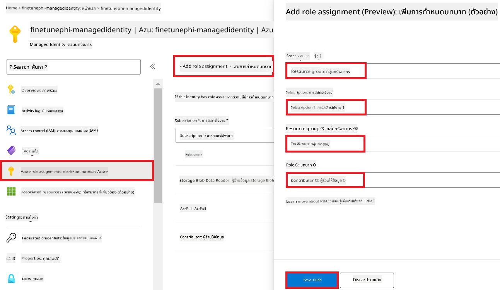

2. เลือก **Save**

#### เพิ่มบทบาท Storage Blob Data Reader ให้กับ Managed Identity

1. พิมพ์ *storage accounts* ใน **แถบค้นหา** ที่ด้านบนของหน้า portal แล้วเลือก **Storage accounts** จากตัวเลือกที่ปรากฏ

    

1. เลือก storage account ที่เชื่อมโยงกับ Azure Machine Learning workspace ที่คุณสร้าง เช่น *finetunephistorage*

1. ดำเนินการดังนี้เพื่อไปยังหน้า Add role assignment:

    - ไปที่ Azure Storage account ที่คุณสร้าง
    - เลือก **Access Control (IAM)** จากแท็บด้านซ้าย
    - เลือก **+ Add** จากเมนูนำทาง
    - เลือก **Add role assignment** จากเมนูนำทาง

    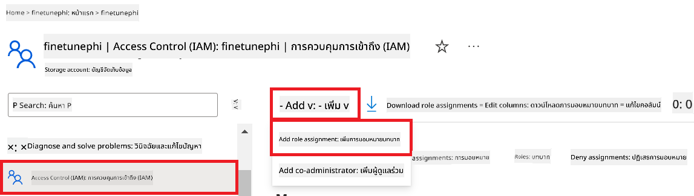

1. ในหน้า Add role assignment ดำเนินการดังนี้:

    - ในหน้า Role พิมพ์ *Storage Blob Data Reader* ใน **แถบค้นหา** แล้วเลือก **Storage Blob Data Reader** จากตัวเลือกที่ปรากฏ
    - ในหน้า Role เลือก **Next**
    - ในหน้า Members เลือก **Assign access to** เป็น **Managed identity**
    - ในหน้า Members เลือก **+ Select members**
    - ในหน้า Select managed identities เลือก **Subscription** ของคุณ
    - ในหน้า Select managed identities เลือก **Managed identity** เป็น **Manage Identity**
    - ในหน้า Select managed identities เลือก Manage Identity ที่คุณสร้าง เช่น *finetunephi-managedidentity*
    - ในหน้า Select managed identities เลือก **Select**

    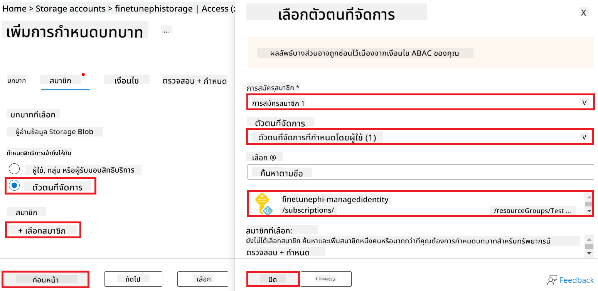

1. เลือก **Review + assign**

#### เพิ่มบทบาท AcrPull ให้กับ Managed Identity

1. พิมพ์ *container registries* ใน **แถบค้นหา** ที่ด้านบนของหน้า portal แล้วเลือก **Container registries** จากตัวเลือกที่ปรากฏ

    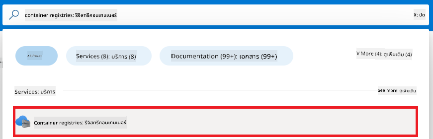

1. เลือก container registry ที่เชื่อมโยงกับ Azure Machine Learning workspace เช่น *finetunephicontainerregistry*

1. ดำเนินการดังนี้เพื่อไปยังหน้า Add role assignment:

    - เลือก **Access Control (IAM)** จากแท็บด้านซ้าย
    - เลือก **+ Add** จากเมนูนำทาง
    - เลือก **Add role assignment** จากเมนูนำทาง

1. ในหน้า Add role assignment ดำเนินการดังนี้:

    - ในหน้า Role พิมพ์ *AcrPull* ใน **แถบค้นหา** แล้วเลือก **AcrPull** จากตัวเลือกที่ปรากฏ
    - ในหน้า Role เลือก **Next**
    - ในหน้า Members เลือก **Assign access to** เป็น **Managed identity**
    - ในหน้า Members เลือก **+ Select members**
    - ในหน้า Select managed identities เลือก **Subscription** ของคุณ
    - ในหน้า Select managed identities เลือก **Managed identity** เป็น **Manage Identity**
    - ในหน้า Select managed identities เลือก Manage Identity ที่คุณสร้าง เช่น *finetunephi-managedidentity*
    - ในหน้า Select managed identities เลือก **Select**
    - เลือก **Review + assign**

### ตั้งค่าโปรเจกต์

เพื่อดาวน์โหลดชุดข้อมูลที่จำเป็นสำหรับการปรับแต่ง คุณจะตั้งค่าสภาพแวดล้อมในเครื่อง

ในแบบฝึกหัดนี้ คุณจะ

- สร้างโฟลเดอร์สำหรับทำงาน
- สร้าง virtual environment
- ติดตั้งแพ็กเกจที่จำเป็น
- สร้างไฟล์ *download_dataset.py* เพื่อดาวน์โหลดชุดข้อมูล

#### สร้างโฟลเดอร์สำหรับทำงาน

1. เปิดหน้าต่างเทอร์มินัลและพิมพ์คำสั่งต่อไปนี้เพื่อสร้างโฟลเดอร์ชื่อ *finetune-phi* ในเส้นทางเริ่มต้น

    ```console
    mkdir finetune-phi
    ```

2. พิมพ์คำสั่งต่อไปนี้ในเทอร์มินัลเพื่อเข้าไปยังโฟลเดอร์ *finetune-phi* ที่คุณสร้างไว้
#### สร้างสภาพแวดล้อมเสมือน

1. พิมพ์คำสั่งต่อไปนี้ในเทอร์มินัลของคุณเพื่อสร้างสภาพแวดล้อมเสมือนชื่อ *.venv*.

2. พิมพ์คำสั่งต่อไปนี้ในเทอร์มินัลของคุณเพื่อเปิดใช้งานสภาพแวดล้อมเสมือน.

> [!NOTE]
> หากสำเร็จ คุณจะเห็น *(.venv)* ปรากฏก่อนพรอมต์คำสั่ง

#### ติดตั้งแพ็กเกจที่จำเป็น

1. พิมพ์คำสั่งต่อไปนี้ในเทอร์มินัลของคุณเพื่อติดตั้งแพ็กเกจที่จำเป็น

#### สร้างไฟล์ `donload_dataset.py`

> [!NOTE]
> โครงสร้างโฟลเดอร์สมบูรณ์:
>
> 1. เปิด **Visual Studio Code**.
> 2. เลือก **File** จากแถบเมนู.
> 3. เลือก **Open Folder**.
> 4. เลือกโฟลเดอร์ *finetune-phi* ที่คุณสร้างไว้ ซึ่งอยู่ที่ *C:\Users\yourUserName\finetune-phi*.

    

5. ในแถบด้านซ้ายของ Visual Studio Code คลิกขวาแล้วเลือก **New File** เพื่อสร้างไฟล์ใหม่ชื่อ *download_dataset.py*.

    

### เตรียมชุดข้อมูลสำหรับการปรับแต่งโมเดล

ในแบบฝึกหัดนี้ คุณจะรันไฟล์ *download_dataset.py* เพื่อดาวน์โหลดชุดข้อมูล *ultrachat_200k* ลงในสภาพแวดล้อมเครื่องของคุณ จากนั้นจะใช้ชุดข้อมูลนี้ในการปรับแต่งโมเดล Phi-3 ใน Azure Machine Learning

ในแบบฝึกหัดนี้ คุณจะ:

- เพิ่มโค้ดในไฟล์ *download_dataset.py* เพื่อดาวน์โหลดชุดข้อมูล
- รันไฟล์ *download_dataset.py* เพื่อดาวน์โหลดชุดข้อมูลลงในเครื่องของคุณ

#### ดาวน์โหลดชุดข้อมูลโดยใช้ *download_dataset.py*

1. เปิดไฟล์ *download_dataset.py* ใน Visual Studio Code

2. เพิ่มโค้ดต่อไปนี้ลงในไฟล์ *download_dataset.py*

3. พิมพ์คำสั่งต่อไปนี้ในเทอร์มินัลเพื่อรันสคริปต์และดาวน์โหลดชุดข้อมูลลงในเครื่องของคุณ

4. ตรวจสอบว่าชุดข้อมูลถูกบันทึกลงในไดเรกทอรี *finetune-phi/data* ในเครื่องของคุณเรียบร้อยแล้ว

> [!NOTE]
>
> #### หมายเหตุเกี่ยวกับขนาดชุดข้อมูลและเวลาการปรับแต่ง
>
> ในบทแนะนำนี้ คุณใช้เพียง 1% ของชุดข้อมูล (`split='train[:1%]'`) ซึ่งช่วยลดปริมาณข้อมูลอย่างมาก ทำให้การอัปโหลดและการปรับแต่งโมเดลเร็วขึ้น คุณสามารถปรับเปอร์เซ็นต์นี้เพื่อหาสมดุลระหว่างเวลาการฝึกและประสิทธิภาพของโมเดล การใช้ชุดข้อมูลย่อยช่วยลดเวลาที่ใช้ในการปรับแต่ง ทำให้กระบวนการเหมาะสมกับบทแนะนำนี้มากขึ้น

## สถานการณ์ที่ 2: ปรับแต่งโมเดล Phi-3 และปรับใช้ใน Azure Machine Learning Studio

### ปรับแต่งโมเดล Phi-3

ในแบบฝึกหัดนี้ คุณจะปรับแต่งโมเดล Phi-3 ใน Azure Machine Learning Studio

ในแบบฝึกหัดนี้ คุณจะ:

- สร้างคลัสเตอร์คอมพิวเตอร์สำหรับการปรับแต่ง
- ปรับแต่งโมเดล Phi-3 ใน Azure Machine Learning Studio

#### สร้างคลัสเตอร์คอมพิวเตอร์สำหรับการปรับแต่ง

1. เข้าไปที่ [Azure ML Studio](https://ml.azure.com/home?wt.mc_id=studentamb_279723)

2. เลือก **Compute** จากแท็บด้านซ้าย

3. เลือก **Compute clusters** จากเมนูนำทาง

4. เลือก **+ New**

    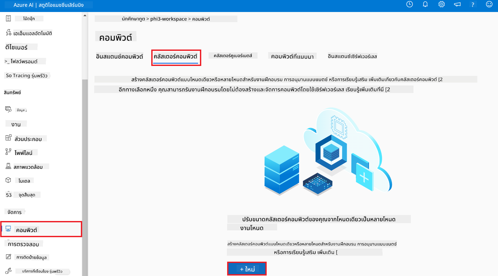

5. ทำตามขั้นตอนดังนี้:

    - เลือก **Region** ที่ต้องการใช้
    - เลือก **Virtual machine tier** เป็น **Dedicated**
    - เลือก **Virtual machine type** เป็น **GPU**
    - เลือกตัวกรอง **Virtual machine size** เป็น **Select from all options**
    - เลือก **Virtual machine size** เป็น **Standard_NC24ads_A100_v4**

    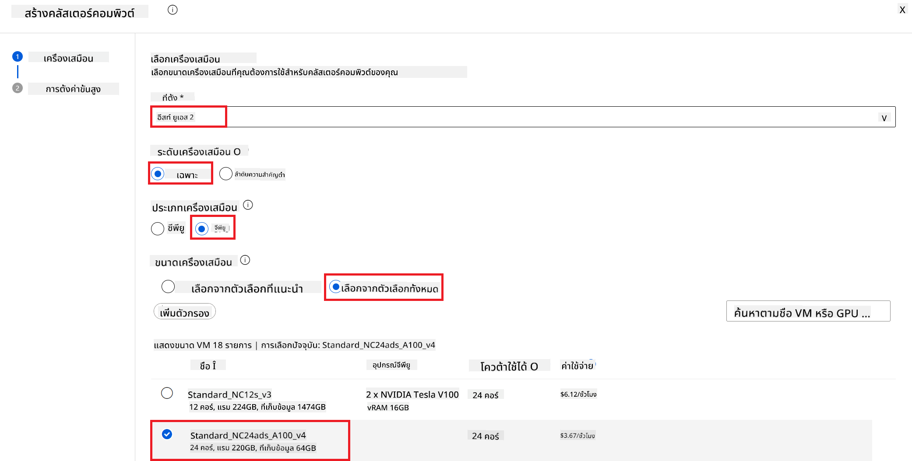

6. เลือก **Next**

7. ทำตามขั้นตอนดังนี้:

    - กรอกชื่อ **Compute name** ซึ่งต้องไม่ซ้ำกับชื่ออื่น
    - เลือก **Minimum number of nodes** เป็น **0**
    - เลือก **Maximum number of nodes** เป็น **1**
    - เลือก **Idle seconds before scale down** เป็น **120**

    

8. เลือก **Create**

#### ปรับแต่งโมเดล Phi-3

1. เข้าไปที่ [Azure ML Studio](https://ml.azure.com/home?wt.mc_id=studentamb_279723)

2. เลือก workspace ของ Azure Machine Learning ที่คุณสร้างไว้

    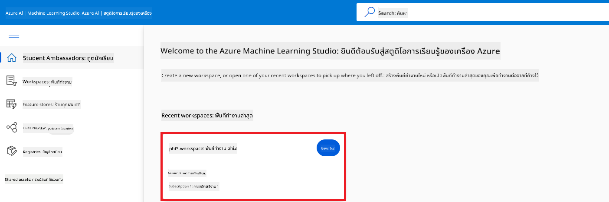

3. ทำตามขั้นตอนดังนี้:

    - เลือก **Model catalog** จากแท็บด้านซ้าย
    - พิมพ์ *phi-3-mini-4k* ในช่องค้นหา และเลือก **Phi-3-mini-4k-instruct** จากตัวเลือกที่ปรากฏ

    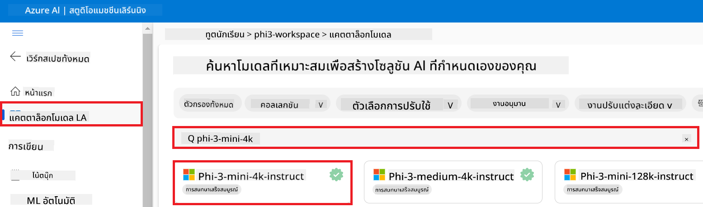

4. เลือก **Fine-tune** จากเมนูนำทาง

    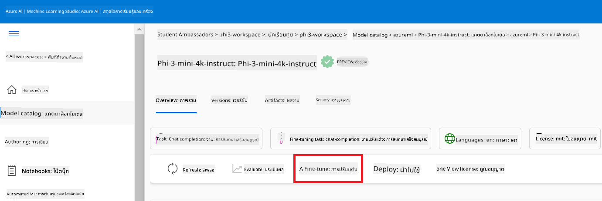

5. ทำตามขั้นตอนดังนี้:

    - เลือก **Select task type** เป็น **Chat completion**
    - เลือก **+ Select data** เพื่ออัปโหลด **Training data**
    - เลือกประเภทการอัปโหลด Validation data เป็น **Provide different validation data**
    - เลือก **+ Select data** เพื่ออัปโหลด **Validation data**

    

    > [!TIP]
    >
    > คุณสามารถเลือก **Advanced settings** เพื่อปรับแต่งค่าต่างๆ เช่น **learning_rate** และ **lr_scheduler_type** เพื่อเพิ่มประสิทธิภาพการปรับแต่งตามความต้องการของคุณ

6. เลือก **Finish**

7. ในแบบฝึกหัดนี้ คุณได้ปรับแต่งโมเดล Phi-3 สำเร็จโดยใช้ Azure Machine Learning โปรดทราบว่ากระบวนการปรับแต่งอาจใช้เวลานาน หลังจากเริ่มงานปรับแต่งแล้ว คุณต้องรอจนกว่าจะเสร็จสมบูรณ์ คุณสามารถตรวจสอบสถานะงานได้ที่แท็บ Jobs ทางด้านซ้ายของ Azure Machine Learning Workspace ของคุณ ในชุดถัดไป คุณจะได้เรียนรู้การปรับใช้โมเดลที่ปรับแต่งแล้วและเชื่อมต่อกับ Prompt flow

    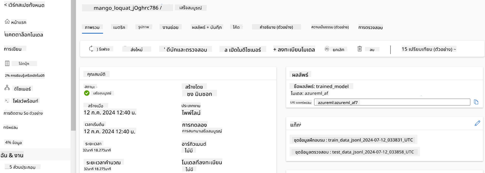

### ปรับใช้โมเดล Phi-3 ที่ปรับแต่งแล้ว

เพื่อเชื่อมต่อโมเดล Phi-3 ที่ปรับแต่งแล้วกับ Prompt flow คุณต้องปรับใช้โมเดลเพื่อให้สามารถเรียกใช้งานแบบเรียลไทม์ได้ กระบวนการนี้รวมถึงการลงทะเบียนโมเดล สร้าง endpoint ออนไลน์ และปรับใช้โมเดล

ในแบบฝึกหัดนี้ คุณจะ:

- ลงทะเบียนโมเดลที่ปรับแต่งแล้วใน Azure Machine Learning workspace
- สร้าง online endpoint
- ปรับใช้โมเดล Phi-3 ที่ลงทะเบียนแล้ว

#### ลงทะเบียนโมเดลที่ปรับแต่งแล้ว

1. เข้าไปที่ [Azure ML Studio](https://ml.azure.com/home?wt.mc_id=studentamb_279723)

2. เลือก workspace ของ Azure Machine Learning ที่คุณสร้างไว้

    

3. เลือก **Models** จากแท็บด้านซ้าย

4. เลือก **+ Register**

5. เลือก **From a job output**

    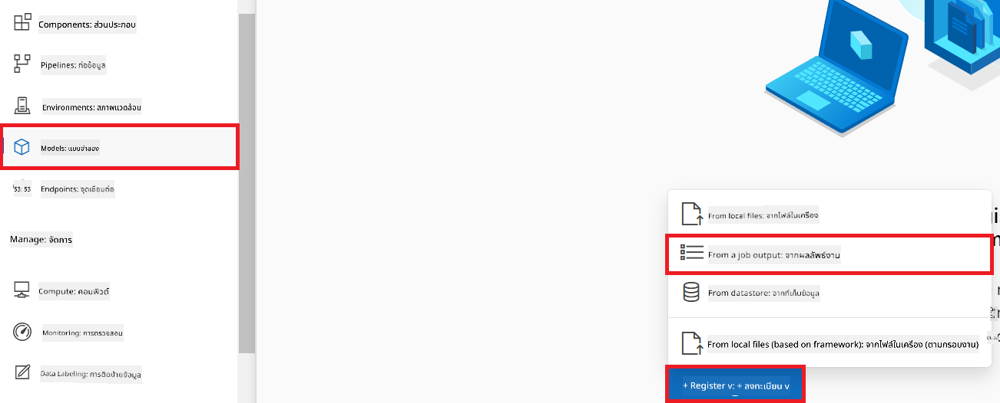

6. เลือกงาน (job) ที่คุณสร้างไว้

    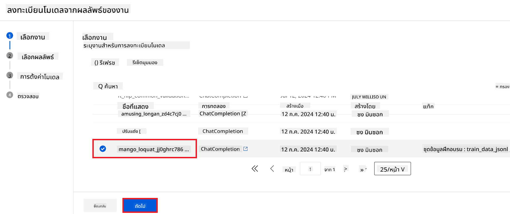

7. เลือก **Next**

8. เลือก **Model type** เป็น **MLflow**

9. ตรวจสอบให้แน่ใจว่าเลือก **Job output** ซึ่งควรถูกเลือกโดยอัตโนมัติ

    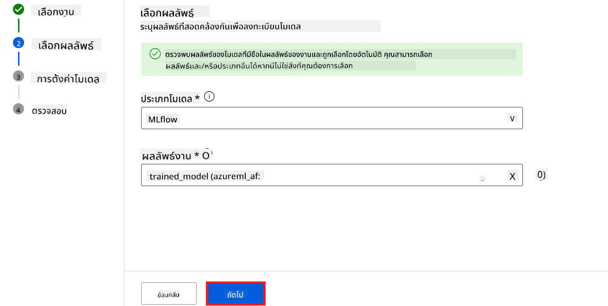

10. เลือก **Next**

11. เลือก **Register**

    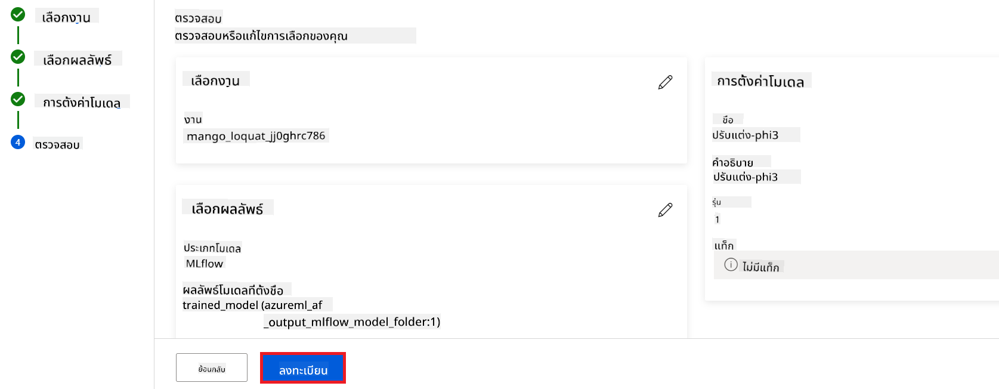

12. คุณสามารถดูโมเดลที่ลงทะเบียนแล้วได้โดยไปที่เมนู **Models** ทางแท็บด้านซ้าย

    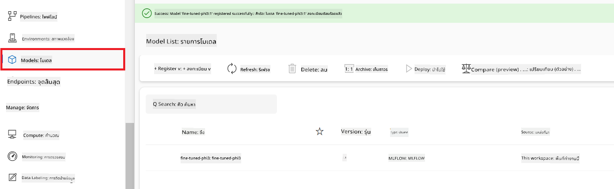

#### ปรับใช้โมเดลที่ปรับแต่งแล้ว

1. ไปที่ workspace ของ Azure Machine Learning ที่คุณสร้างไว้

2. เลือก **Endpoints** จากแท็บด้านซ้าย

3. เลือก **Real-time endpoints** จากเมนูนำทาง

    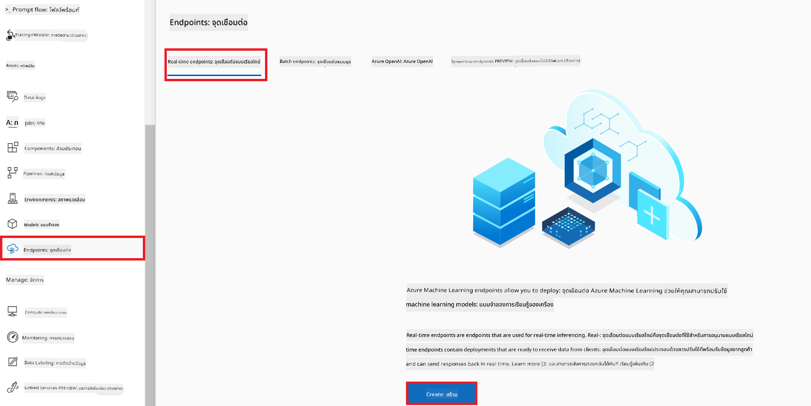

4. เลือก **Create**

5. เลือกโมเดลที่ลงทะเบียนไว้ที่คุณสร้าง

    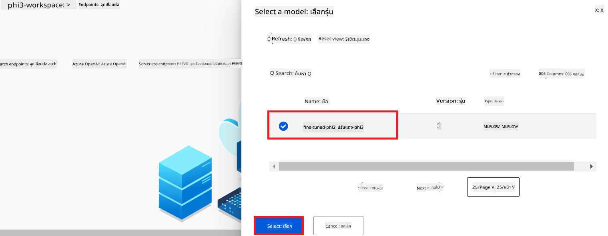

6. เลือก **Select**

7. ทำตามขั้นตอนดังนี้:

    - เลือก **Virtual machine** เป็น *Standard_NC6s_v3*
    - เลือกจำนวน **Instance count** ที่ต้องการ เช่น *1*
    - เลือก **Endpoint** เป็น **New** เพื่อสร้าง endpoint ใหม่
    - กรอกชื่อ **Endpoint name** ซึ่งต้องไม่ซ้ำกับชื่ออื่น
    - กรอกชื่อ **Deployment name** ซึ่งต้องไม่ซ้ำกับชื่ออื่น

    

8. เลือก **Deploy**

> [!WARNING]
> เพื่อหลีกเลี่ยงค่าใช้จ่ายเพิ่มเติมในบัญชีของคุณ โปรดลบ endpoint ที่สร้างไว้ใน Azure Machine Learning workspace เมื่อไม่ใช้งานแล้ว
>

#### ตรวจสอบสถานะการปรับใช้ใน Azure Machine Learning Workspace

1. ไปที่ Azure Machine Learning workspace ที่คุณสร้างไว้

2. เลือก **Endpoints** จากแท็บด้านซ้าย

3. เลือก endpoint ที่คุณสร้างไว้

    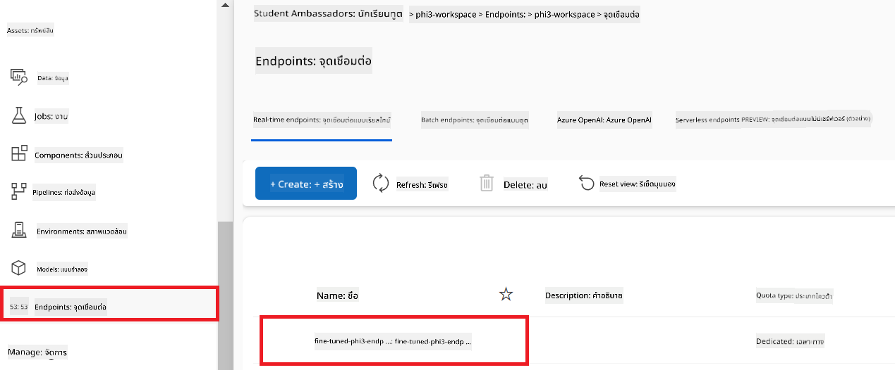

4. ในหน้านี้ คุณสามารถจัดการ endpoint ระหว่างกระบวนการปรับใช้ได้

> [!NOTE]
> เมื่อการปรับใช้เสร็จสมบูรณ์ ให้ตรวจสอบว่า **Live traffic** ตั้งค่าเป็น **100%** หากไม่ใช่ ให้เลือก **Update traffic** เพื่อปรับการตั้งค่าการรับส่งข้อมูล โปรดทราบว่าคุณไม่สามารถทดสอบโมเดลได้หากตั้งค่า traffic เป็น 0%
>
> 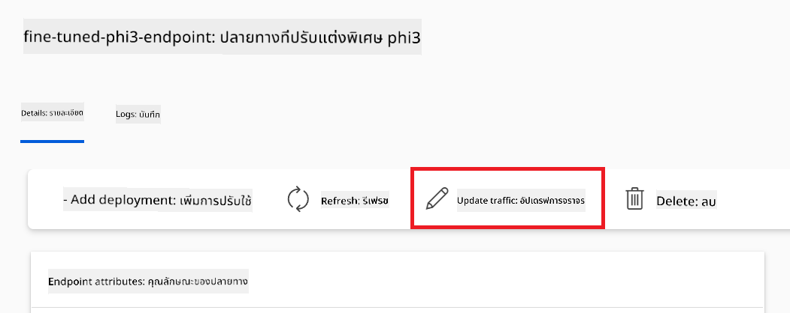
>

## สถานการณ์ที่ 3: เชื่อมต่อกับ Prompt flow และสนทนากับโมเดลที่ปรับแต่งใน Azure AI Foundry

### เชื่อมต่อโมเดล Phi-3 ที่ปรับแต่งกับ Prompt flow

หลังจากที่คุณปรับใช้โมเดลที่ปรับแต่งแล้วสำเร็จ คุณสามารถเชื่อมต่อโมเดลนี้กับ Prompt Flow เพื่อใช้งานโมเดลในแอปพลิเคชันแบบเรียลไทม์ ช่วยให้สามารถทำงานโต้ตอบต่างๆ กับโมเดล Phi-3 ที่ปรับแต่งเองได้

ในแบบฝึกหัดนี้ คุณจะ:

- สร้าง Azure AI Foundry Hub
- สร้างโปรเจกต์ Azure AI Foundry
- สร้าง Prompt flow
- เพิ่มการเชื่อมต่อแบบกำหนดเองสำหรับโมเดล Phi-3 ที่ปรับแต่งแล้ว
- ตั้งค่า Prompt flow เพื่อสนทนากับโมเดล Phi-3 ที่ปรับแต่งของคุณ
> [!NOTE]
> คุณยังสามารถเชื่อมต่อกับ Promptflow ผ่าน Azure ML Studio ได้ กระบวนการเชื่อมต่อเดียวกันนี้สามารถใช้กับ Azure ML Studio ได้เช่นกัน
#### สร้าง Azure AI Foundry Hub

คุณต้องสร้าง Hub ก่อนที่จะสร้าง Project Hub ทำหน้าที่เหมือน Resource Group ช่วยให้คุณจัดระเบียบและจัดการหลาย Projects ภายใน Azure AI Foundry ได้

1. ไปที่ [Azure AI Foundry](https://ai.azure.com/?WT.mc_id=aiml-137032-kinfeylo)

1. เลือก **All hubs** จากแท็บด้านซ้าย

1. เลือก **+ New hub** จากเมนูนำทาง

    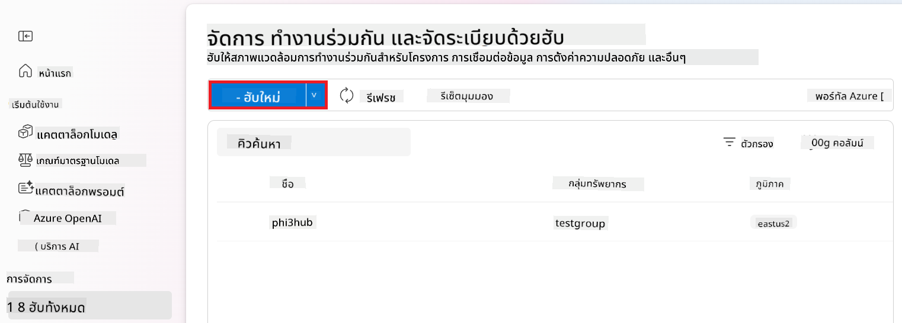

1. ทำตามขั้นตอนดังนี้:

    - กรอก **Hub name** ต้องเป็นค่าที่ไม่ซ้ำกัน
    - เลือก Azure **Subscription** ของคุณ
    - เลือก **Resource group** ที่จะใช้ (สร้างใหม่ถ้าจำเป็น)
    - เลือก **Location** ที่ต้องการใช้
    - เลือก **Connect Azure AI Services** ที่จะใช้ (สร้างใหม่ถ้าจำเป็น)
    - เลือก **Connect Azure AI Search** เป็น **Skip connecting**

    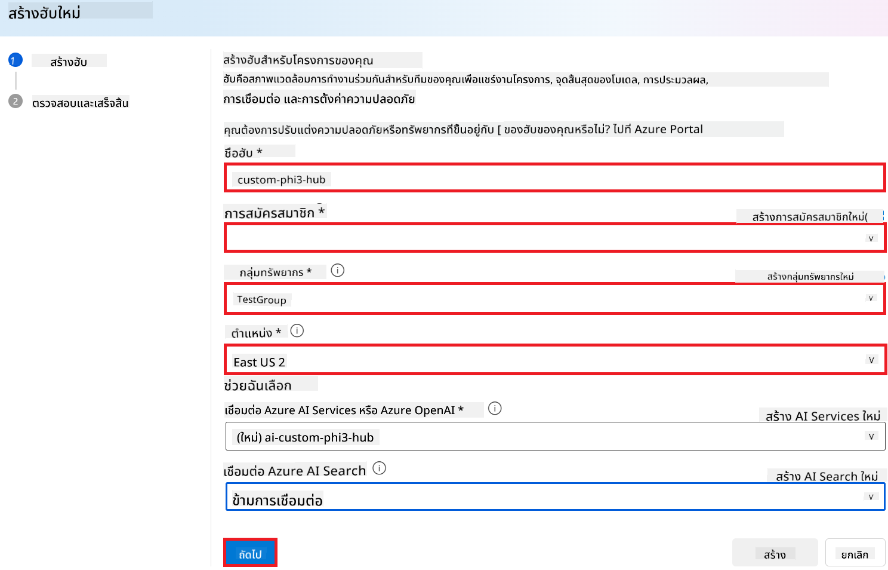

1. เลือก **Next**

#### สร้าง Azure AI Foundry Project

1. ใน Hub ที่คุณสร้าง เลือก **All projects** จากแท็บด้านซ้าย

1. เลือก **+ New project** จากเมนูนำทาง

    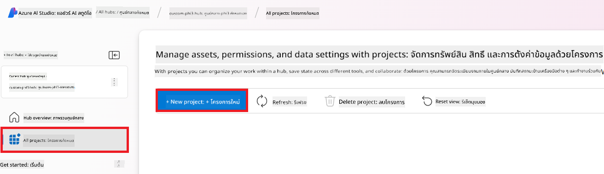

1. กรอก **Project name** ต้องเป็นค่าที่ไม่ซ้ำกัน

    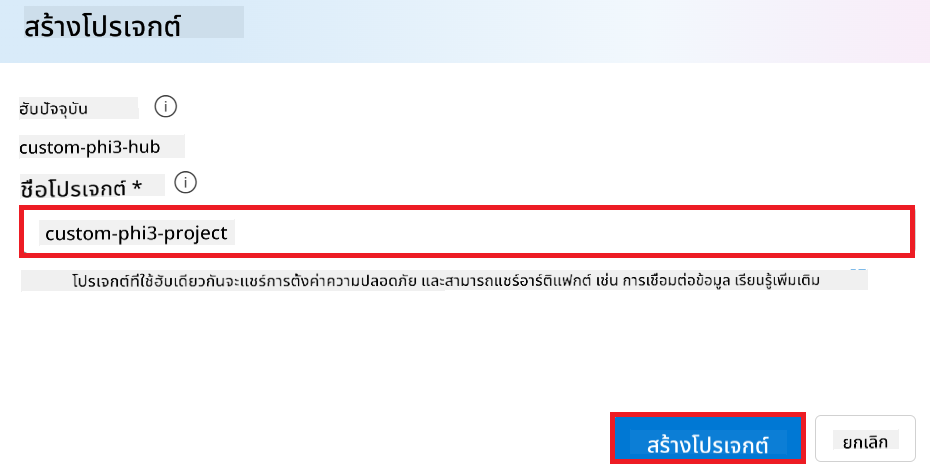

1. เลือก **Create a project**

#### เพิ่มการเชื่อมต่อแบบกำหนดเองสำหรับโมเดล Phi-3 ที่ผ่านการปรับแต่ง

เพื่อเชื่อมต่อโมเดล Phi-3 ที่ปรับแต่งเองกับ Prompt flow คุณต้องบันทึก endpoint และ key ของโมเดลใน custom connection การตั้งค่านี้จะช่วยให้เข้าถึงโมเดล Phi-3 ที่ปรับแต่งใน Prompt flow ได้

#### ตั้งค่า api key และ endpoint uri ของโมเดล Phi-3 ที่ปรับแต่ง

1. ไปที่ [Azure ML Studio](https://ml.azure.com/home?WT.mc_id=aiml-137032-kinfeylo)

1. ไปยัง Azure Machine learning workspace ที่คุณสร้างไว้

1. เลือก **Endpoints** จากแท็บด้านซ้าย

    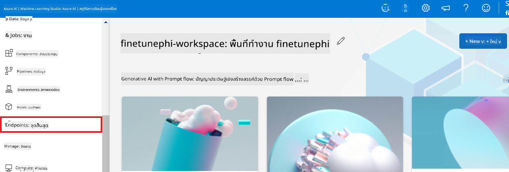

1. เลือก endpoint ที่คุณสร้างไว้

    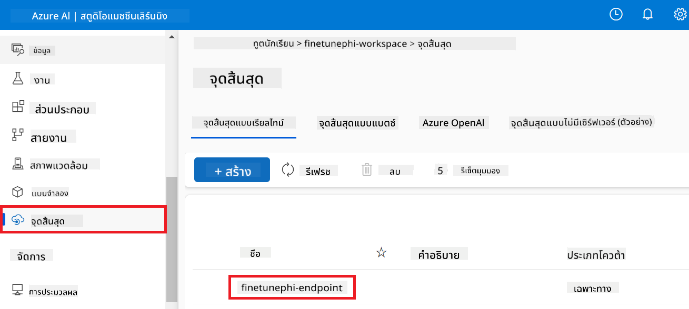

1. เลือก **Consume** จากเมนูนำทาง

1. คัดลอก **REST endpoint** และ **Primary key** ของคุณ

    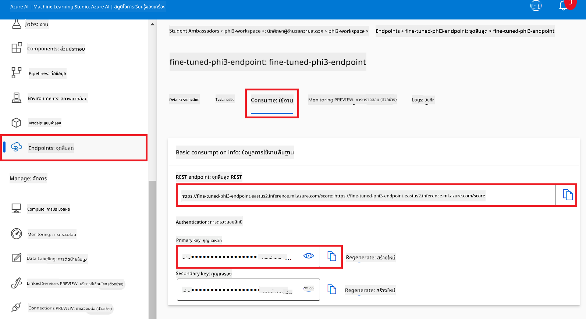

#### เพิ่ม Custom Connection

1. ไปที่ [Azure AI Foundry](https://ai.azure.com/?WT.mc_id=aiml-137032-kinfeylo)

1. ไปยัง Azure AI Foundry project ที่คุณสร้างไว้

1. ใน Project ที่คุณสร้าง เลือก **Settings** จากแท็บด้านซ้าย

1. เลือก **+ New connection**

    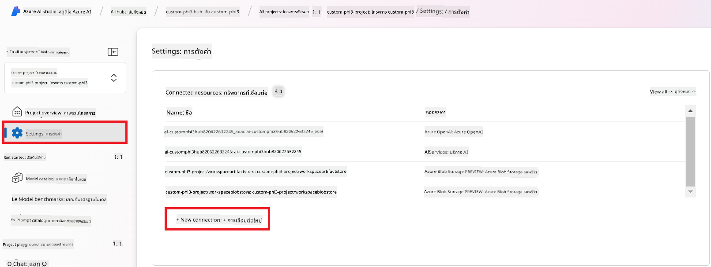

1. เลือก **Custom keys** จากเมนูนำทาง

    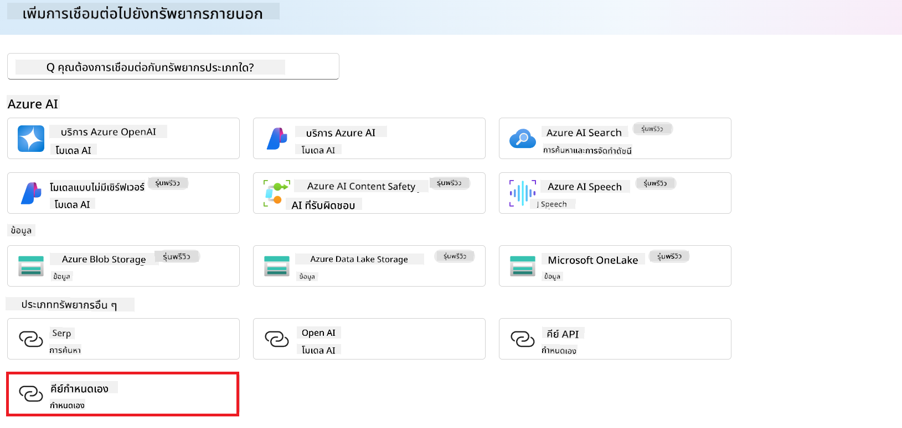

1. ทำตามขั้นตอนดังนี้:

    - เลือก **+ Add key value pairs**
    - สำหรับชื่อ key ให้กรอก **endpoint** และวาง endpoint ที่คัดลอกจาก Azure ML Studio ลงในช่องค่า
    - เลือก **+ Add key value pairs** อีกครั้ง
    - สำหรับชื่อ key ให้กรอก **key** และวาง key ที่คัดลอกจาก Azure ML Studio ลงในช่องค่า
    - หลังจากเพิ่ม keys แล้ว ให้เลือก **is secret** เพื่อป้องกันไม่ให้ key ถูกเปิดเผย

    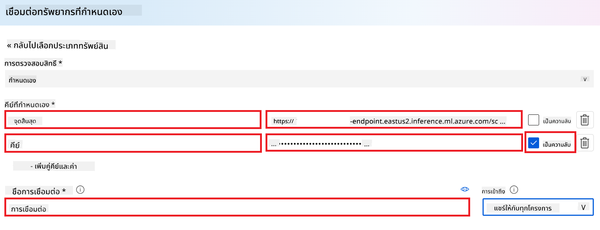

1. เลือก **Add connection**

#### สร้าง Prompt flow

คุณได้เพิ่ม custom connection ใน Azure AI Foundry แล้ว ตอนนี้มาสร้าง Prompt flow ตามขั้นตอนด้านล่าง จากนั้นคุณจะเชื่อมต่อ Prompt flow นี้กับ custom connection เพื่อให้สามารถใช้โมเดลที่ปรับแต่งใน Prompt flow ได้

1. ไปยัง Azure AI Foundry project ที่คุณสร้างไว้

1. เลือก **Prompt flow** จากแท็บด้านซ้าย

1. เลือก **+ Create** จากเมนูนำทาง

    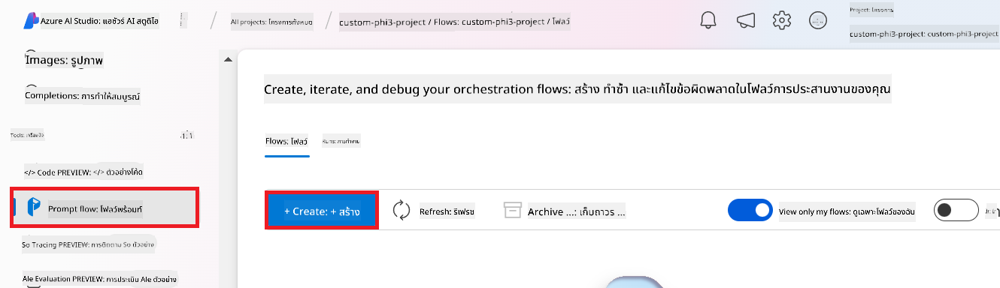

1. เลือก **Chat flow** จากเมนูนำทาง

    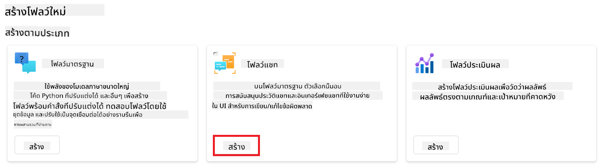

1. กรอก **Folder name** ที่ต้องการใช้

    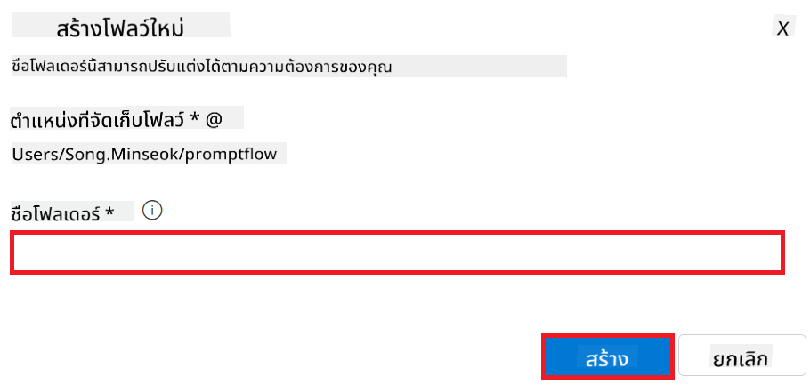

2. เลือก **Create**

#### ตั้งค่า Prompt flow เพื่อสนทนากับโมเดล Phi-3 ที่ปรับแต่ง

คุณต้องผสานโมเดล Phi-3 ที่ปรับแต่งเข้ากับ Prompt flow อย่างไรก็ตาม Prompt flow ที่มีอยู่ไม่ได้ออกแบบมาเพื่อจุดประสงค์นี้ ดังนั้นคุณต้องออกแบบ Prompt flow ใหม่เพื่อให้สามารถเชื่อมต่อกับโมเดลที่กำหนดเองได้

1. ใน Prompt flow ให้ทำตามขั้นตอนต่อไปนี้เพื่อสร้าง flow ใหม่:

    - เลือก **Raw file mode**
    - ลบโค้ดทั้งหมดในไฟล์ *flow.dag.yml*
    - เพิ่มโค้ดต่อไปนี้ในไฟล์ *flow.dag.yml*

        ```yml
        inputs:
          input_data:
            type: string
            default: "Who founded Microsoft?"

        outputs:
          answer:
            type: string
            reference: ${integrate_with_promptflow.output}

        nodes:
        - name: integrate_with_promptflow
          type: python
          source:
            type: code
            path: integrate_with_promptflow.py
          inputs:
            input_data: ${inputs.input_data}
        ```

    - เลือก **Save**

    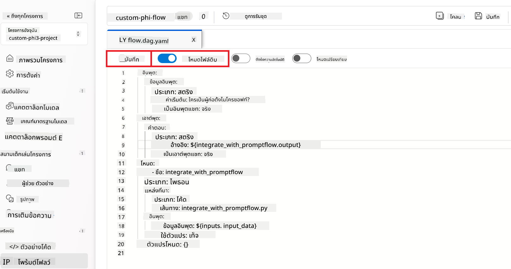

1. เพิ่มโค้ดต่อไปนี้ในไฟล์ *integrate_with_promptflow.py* เพื่อใช้โมเดล Phi-3 ที่กำหนดเองใน Prompt flow

    ```python
    import logging
    import requests
    from promptflow import tool
    from promptflow.connections import CustomConnection

    # Logging setup
    logging.basicConfig(
        format="%(asctime)s - %(levelname)s - %(name)s - %(message)s",
        datefmt="%Y-%m-%d %H:%M:%S",
        level=logging.DEBUG
    )
    logger = logging.getLogger(__name__)

    def query_phi3_model(input_data: str, connection: CustomConnection) -> str:
        """
        Send a request to the Phi-3 model endpoint with the given input data using Custom Connection.
        """

        # "connection" is the name of the Custom Connection, "endpoint", "key" are the keys in the Custom Connection
        endpoint_url = connection.endpoint
        api_key = connection.key

        headers = {
            "Content-Type": "application/json",
            "Authorization": f"Bearer {api_key}"
        }
        data = {
            "input_data": {
                "input_string": [
                    {"role": "user", "content": input_data}
                ],
                "parameters": {
                    "temperature": 0.7,
                    "max_new_tokens": 128
                }
            }
        }
        try:
            response = requests.post(endpoint_url, json=data, headers=headers)
            response.raise_for_status()
            
            # Log the full JSON response
            logger.debug(f"Full JSON response: {response.json()}")

            result = response.json()["output"]
            logger.info("Successfully received response from Azure ML Endpoint.")
            return result
        except requests.exceptions.RequestException as e:
            logger.error(f"Error querying Azure ML Endpoint: {e}")
            raise

    @tool
    def my_python_tool(input_data: str, connection: CustomConnection) -> str:
        """
        Tool function to process input data and query the Phi-3 model.
        """
        return query_phi3_model(input_data, connection)

    ```

    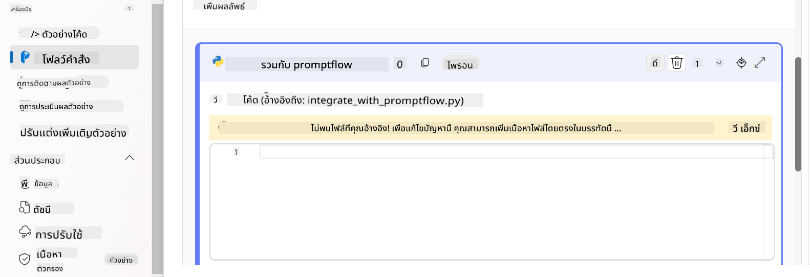

> [!NOTE]
> สำหรับข้อมูลเพิ่มเติมเกี่ยวกับการใช้ Prompt flow ใน Azure AI Foundry คุณสามารถดูได้ที่ [Prompt flow in Azure AI Foundry](https://learn.microsoft.com/azure/ai-studio/how-to/prompt-flow)

1. เลือก **Chat input**, **Chat output** เพื่อเปิดใช้งานการสนทนากับโมเดลของคุณ

    

1. ตอนนี้คุณพร้อมที่จะสนทนากับโมเดล Phi-3 ที่ปรับแต่งแล้ว ในแบบฝึกหัดถัดไป คุณจะได้เรียนรู้วิธีเริ่ม Prompt flow และใช้งานเพื่อสนทนากับโมเดล Phi-3 ที่ปรับแต่งของคุณ

> [!NOTE]
>
> flow ที่สร้างใหม่ควรมีลักษณะเหมือนภาพด้านล่างนี้:
>
> 
>

### สนทนากับโมเดล Phi-3 ที่ปรับแต่งของคุณ

ตอนนี้คุณได้ปรับแต่งและผสานโมเดล Phi-3 ที่กำหนดเองกับ Prompt flow เรียบร้อยแล้ว คุณพร้อมที่จะเริ่มโต้ตอบกับโมเดลนี้ แบบฝึกหัดนี้จะแนะนำขั้นตอนการตั้งค่าและเริ่มต้นสนทนากับโมเดลของคุณผ่าน Prompt flow โดยทำตามขั้นตอนเหล่านี้ คุณจะสามารถใช้ประโยชน์จากความสามารถของโมเดล Phi-3 ที่ปรับแต่งสำหรับงานและการสนทนาต่างๆ ได้อย่างเต็มที่

- สนทนากับโมเดล Phi-3 ที่ปรับแต่งของคุณผ่าน Prompt flow

#### เริ่ม Prompt flow

1. เลือก **Start compute sessions** เพื่อเริ่ม Prompt flow

    

1. เลือก **Validate and parse input** เพื่อรีเฟรชพารามิเตอร์

    

1. เลือก **Value** ของ **connection** เป็น custom connection ที่คุณสร้างไว้ เช่น *connection*

    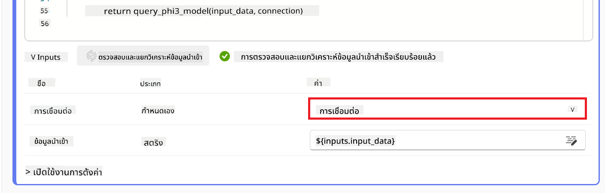

#### สนทนากับโมเดลที่กำหนดเองของคุณ

1. เลือก **Chat**

    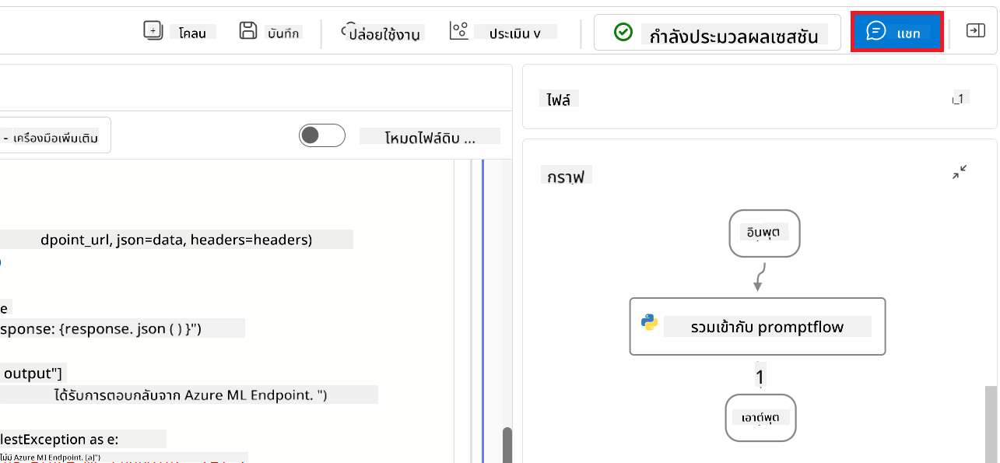

1. นี่คือตัวอย่างผลลัพธ์: ตอนนี้คุณสามารถสนทนากับโมเดล Phi-3 ที่ปรับแต่งของคุณได้ แนะนำให้ถามคำถามที่เกี่ยวข้องกับข้อมูลที่ใช้ในการปรับแต่งโมเดล

    

**ข้อจำกัดความรับผิดชอบ**:  
เอกสารนี้ได้รับการแปลโดยใช้บริการแปลภาษาอัตโนมัติ [Co-op Translator](https://github.com/Azure/co-op-translator) แม้เราจะพยายามให้ความถูกต้องสูงสุด แต่โปรดทราบว่าการแปลอัตโนมัติอาจมีข้อผิดพลาดหรือความไม่ถูกต้อง เอกสารต้นฉบับในภาษาต้นทางถือเป็นแหล่งข้อมูลที่เชื่อถือได้ สำหรับข้อมูลที่สำคัญ ขอแนะนำให้ใช้บริการแปลโดยผู้เชี่ยวชาญมนุษย์ เราไม่รับผิดชอบต่อความเข้าใจผิดหรือการตีความผิดใด ๆ ที่เกิดจากการใช้การแปลนี้