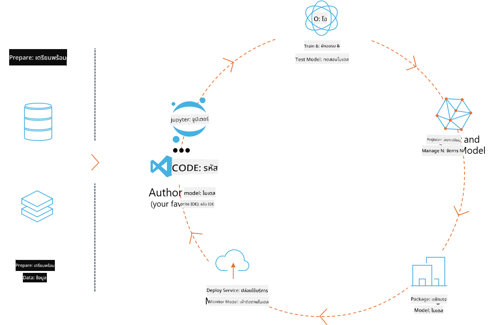
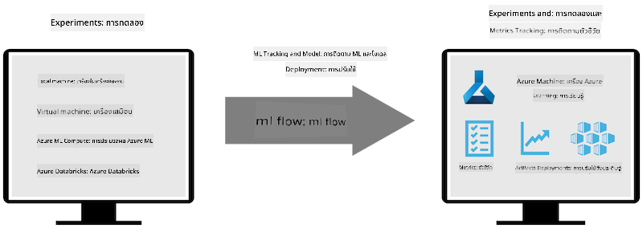
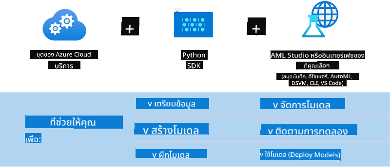

<!--
CO_OP_TRANSLATOR_METADATA:
{
  "original_hash": "f61c383bbf0c3dac97e43f833c258731",
  "translation_date": "2025-05-09T18:37:29+00:00",
  "source_file": "md/02.Application/01.TextAndChat/Phi3/E2E_Phi-3-MLflow.md",
  "language_code": "th"
}
-->
# MLflow

[MLflow](https://mlflow.org/) คือแพลตฟอร์มโอเพนซอร์สที่ออกแบบมาเพื่อจัดการวงจรชีวิตของ machine learning ตั้งแต่ต้นจนจบ



MLFlow ใช้สำหรับจัดการวงจรชีวิตของ ML รวมถึงการทดลอง, การทำซ้ำ, การนำไปใช้งาน และการจัดเก็บโมเดลกลาง ML flow ในปัจจุบันมีสี่ส่วนประกอบหลัก

- **MLflow Tracking:** บันทึกและค้นหาการทดลอง, โค้ด, การตั้งค่าข้อมูล และผลลัพธ์
- **MLflow Projects:** แพ็กเกจโค้ดวิทยาศาสตร์ข้อมูลในรูปแบบที่สามารถทำซ้ำได้บนแพลตฟอร์มใดก็ได้
- **Mlflow Models:** นำโมเดล machine learning ไปใช้งานในสภาพแวดล้อมการให้บริการที่หลากหลาย
- **Model Registry:** เก็บ, ใส่หมายเหตุ และจัดการโมเดลในที่เก็บกลาง

MLFlow มีความสามารถในการติดตามการทดลอง, แพ็กเกจโค้ดเพื่อทำซ้ำ และแบ่งปันและนำโมเดลไปใช้งาน MLFlow ถูกผนวกเข้ากับ Databricks และรองรับไลบรารี ML หลายตัว ทำให้ไม่ขึ้นกับไลบรารีใดไลบรารีหนึ่ง สามารถใช้กับไลบรารี machine learning ใดก็ได้และภาษาโปรแกรมใดก็ได้ เพราะมี REST API และ CLI เพื่อความสะดวก



คุณสมบัติสำคัญของ MLFlow ได้แก่:

- **Experiment Tracking:** บันทึกและเปรียบเทียบพารามิเตอร์และผลลัพธ์
- **Model Management:** นำโมเดลไปใช้งานบนแพลตฟอร์มการให้บริการและการอนุมานต่างๆ
- **Model Registry:** ร่วมกันจัดการวงจรชีวิตของ MLflow Models รวมถึงการเวอร์ชันและการใส่หมายเหตุ
- **Projects:** แพ็กเกจโค้ด ML สำหรับแบ่งปันหรือใช้งานในโปรดักชัน

MLFlow ยังรองรับวงจร MLOps ซึ่งรวมถึงการเตรียมข้อมูล, การลงทะเบียนและจัดการโมเดล, การแพ็กเกจโมเดลเพื่อรัน, การนำไปใช้งานบริการ และการติดตามโมเดล มีเป้าหมายเพื่อให้ง่ายต่อการเปลี่ยนจากต้นแบบเป็นเวิร์กโฟลว์โปรดักชัน โดยเฉพาะในสภาพแวดล้อมคลาวด์และ edge

## E2E Scenario - การสร้าง wrapper และการใช้ Phi-3 เป็นโมเดล MLFlow

ในตัวอย่าง E2E นี้ เราจะแสดงสองวิธีต่างกันในการสร้าง wrapper รอบ Phi-3 โมเดลภาษาเล็ก (SLM) แล้วรันเป็นโมเดล MLFlow ทั้งแบบใช้งานในเครื่องและบนคลาวด์ เช่น ใน Azure Machine Learning workspace



| Project | คำอธิบาย | ที่ตั้ง |
| ------------ | ----------- | -------- |
| Transformer Pipeline | Transformer Pipeline เป็นตัวเลือกที่ง่ายที่สุดสำหรับสร้าง wrapper หากคุณต้องการใช้โมเดล HuggingFace กับ experimental transformers flavour ของ MLFlow | [**TransformerPipeline.ipynb**](../../../../../../code/06.E2E/E2E_Phi-3-MLflow_TransformerPipeline.ipynb) |
| Custom Python Wrapper | ณ เวลาที่เขียน, transformer pipeline ยังไม่รองรับการสร้าง wrapper MLFlow สำหรับโมเดล HuggingFace ในรูปแบบ ONNX แม้จะใช้ experimental optimum Python package ก็ตาม ในกรณีแบบนี้ คุณสามารถสร้าง custom Python wrapper สำหรับ MLFlow mode เองได้ | [**CustomPythonWrapper.ipynb**](../../../../../../code/06.E2E/E2E_Phi-3-MLflow_CustomPythonWrapper.ipynb) |

## Project: Transformer Pipeline

1. คุณจะต้องติดตั้งแพ็กเกจ Python ที่เกี่ยวข้องจาก MLFlow และ HuggingFace:

    ``` Python
    import mlflow
    import transformers
    ```

2. จากนั้นให้เริ่มต้น transformer pipeline โดยอ้างอิงโมเดล Phi-3 เป้าหมายใน HuggingFace registry ตามที่เห็นใน model card ของ _Phi-3-mini-4k-instruct_ งานของโมเดลนี้คือ “Text Generation”:

    ``` Python
    pipeline = transformers.pipeline(
        task = "text-generation",
        model = "microsoft/Phi-3-mini-4k-instruct"
    )
    ```

3. ตอนนี้คุณสามารถบันทึก transformer pipeline ของโมเดล Phi-3 ในรูปแบบ MLFlow และระบุรายละเอียดเพิ่มเติม เช่น พาธสำหรับเก็บ artifacts, การตั้งค่าโมเดลเฉพาะ และชนิดของ inference API:

    ``` Python
    model_info = mlflow.transformers.log_model(
        transformers_model = pipeline,
        artifact_path = "phi3-mlflow-model",
        model_config = model_config,
        task = "llm/v1/chat"
    )
    ```

## Project: Custom Python Wrapper

1. ที่นี่เราสามารถใช้ [ONNX Runtime generate() API](https://github.com/microsoft/onnxruntime-genai) ของ Microsoft สำหรับการอนุมานโมเดล ONNX และการเข้ารหัส/ถอดรหัสโทเคน คุณต้องเลือกแพ็กเกจ _onnxruntime_genai_ ให้เหมาะกับการคำนวณเป้าหมาย ตัวอย่างนี้ตั้งเป้าไปที่ CPU:

    ``` Python
    import mlflow
    from mlflow.models import infer_signature
    import onnxruntime_genai as og
    ```

1. คลาสที่เราสร้างขึ้นเองมีสองเมธอดหลักคือ _load_context()_ สำหรับเริ่มต้น **โมเดล ONNX** ของ Phi-3 Mini 4K Instruct, **พารามิเตอร์ generator** และ **tokenizer**; และ _predict()_ สำหรับสร้างโทเคนผลลัพธ์ตาม prompt ที่ให้มา:

    ``` Python
    class Phi3Model(mlflow.pyfunc.PythonModel):
        def load_context(self, context):
            # Retrieving model from the artifacts
            model_path = context.artifacts["phi3-mini-onnx"]
            model_options = {
                 "max_length": 300,
                 "temperature": 0.2,         
            }
        
            # Defining the model
            self.phi3_model = og.Model(model_path)
            self.params = og.GeneratorParams(self.phi3_model)
            self.params.set_search_options(**model_options)
            
            # Defining the tokenizer
            self.tokenizer = og.Tokenizer(self.phi3_model)
    
        def predict(self, context, model_input):
            # Retrieving prompt from the input
            prompt = model_input["prompt"][0]
            self.params.input_ids = self.tokenizer.encode(prompt)
    
            # Generating the model's response
            response = self.phi3_model.generate(self.params)
    
            return self.tokenizer.decode(response[0][len(self.params.input_ids):])
    ```

1. ตอนนี้คุณสามารถใช้ฟังก์ชัน _mlflow.pyfunc.log_model()_ เพื่อสร้าง custom Python wrapper (ในรูปแบบ pickle) สำหรับโมเดล Phi-3 พร้อมกับโมเดล ONNX ต้นฉบับและ dependencies ที่จำเป็น:

    ``` Python
    model_info = mlflow.pyfunc.log_model(
        artifact_path = artifact_path,
        python_model = Phi3Model(),
        artifacts = {
            "phi3-mini-onnx": "cpu_and_mobile/cpu-int4-rtn-block-32-acc-level-4",
        },
        input_example = input_example,
        signature = infer_signature(input_example, ["Run"]),
        extra_pip_requirements = ["torch", "onnxruntime_genai", "numpy"],
    )
    ```

## ลายเซ็นของโมเดล MLFlow ที่สร้างขึ้น

1. ในขั้นตอนที่ 3 ของโปรเจกต์ Transformer Pipeline ข้างต้น เรากำหนดงานของโมเดล MLFlow เป็น “_llm/v1/chat_” คำสั่งนี้จะสร้าง API wrapper ของโมเดลที่เข้ากันได้กับ OpenAI’s Chat API ดังที่แสดงด้านล่าง:

    ``` Python
    {inputs: 
      ['messages': Array({content: string (required), name: string (optional), role: string (required)}) (required), 'temperature': double (optional), 'max_tokens': long (optional), 'stop': Array(string) (optional), 'n': long (optional), 'stream': boolean (optional)],
    outputs: 
      ['id': string (required), 'object': string (required), 'created': long (required), 'model': string (required), 'choices': Array({finish_reason: string (required), index: long (required), message: {content: string (required), name: string (optional), role: string (required)} (required)}) (required), 'usage': {completion_tokens: long (required), prompt_tokens: long (required), total_tokens: long (required)} (required)],
    params: 
      None}
    ```

1. ดังนั้นคุณสามารถส่ง prompt ของคุณในรูปแบบนี้:

    ``` Python
    messages = [{"role": "user", "content": "What is the capital of Spain?"}]
    ```

1. จากนั้น ใช้ post-processing ที่เข้ากันได้กับ OpenAI API เช่น _response[0][‘choices’][0][‘message’][‘content’]_ เพื่อปรับแต่งผลลัพธ์ให้ออกมาในรูปแบบสวยงามแบบนี้:

    ``` JSON
    Question: What is the capital of Spain?
    
    Answer: The capital of Spain is Madrid. It is the largest city in Spain and serves as the political, economic, and cultural center of the country. Madrid is located in the center of the Iberian Peninsula and is known for its rich history, art, and architecture, including the Royal Palace, the Prado Museum, and the Plaza Mayor.
    
    Usage: {'prompt_tokens': 11, 'completion_tokens': 73, 'total_tokens': 84}
    ```

1. ในขั้นตอนที่ 3 ของโปรเจกต์ Custom Python Wrapper ข้างต้น เราอนุญาตให้แพ็กเกจ MLFlow สร้าง signature ของโมเดลจากตัวอย่างอินพุตที่กำหนด ลายเซ็นของ wrapper MLFlow ของเราจะมีลักษณะดังนี้:

    ``` Python
    {inputs: 
      ['prompt': string (required)],
    outputs: 
      [string (required)],
    params: 
      None}
    ```

1. ดังนั้น prompt ของเราจะต้องมีคีย์ dictionary ชื่อ "prompt" แบบนี้:

    ``` Python
    {"prompt": "<|system|>You are a stand-up comedian.<|end|><|user|>Tell me a joke about atom<|end|><|assistant|>",}
    ```

1. ผลลัพธ์ของโมเดลจะถูกส่งออกมาในรูปแบบสตริง:

    ``` JSON
    Alright, here's a little atom-related joke for you!
    
    Why don't electrons ever play hide and seek with protons?
    
    Because good luck finding them when they're always "sharing" their electrons!
    
    Remember, this is all in good fun, and we're just having a little atomic-level humor!
    ```

**ข้อจำกัดความรับผิดชอบ**:  
เอกสารนี้ได้รับการแปลโดยใช้บริการแปลภาษาด้วย AI [Co-op Translator](https://github.com/Azure/co-op-translator) แม้เราจะพยายามให้ความถูกต้องสูงสุด โปรดทราบว่าการแปลอัตโนมัติอาจมีข้อผิดพลาดหรือความไม่ถูกต้อง เอกสารต้นฉบับในภาษาต้นทางควรถูกพิจารณาเป็นแหล่งข้อมูลที่เชื่อถือได้ สำหรับข้อมูลที่สำคัญ ขอแนะนำให้ใช้บริการแปลโดยผู้เชี่ยวชาญมนุษย์ เราไม่รับผิดชอบต่อความเข้าใจผิดหรือการตีความผิดที่เกิดขึ้นจากการใช้การแปลนี้