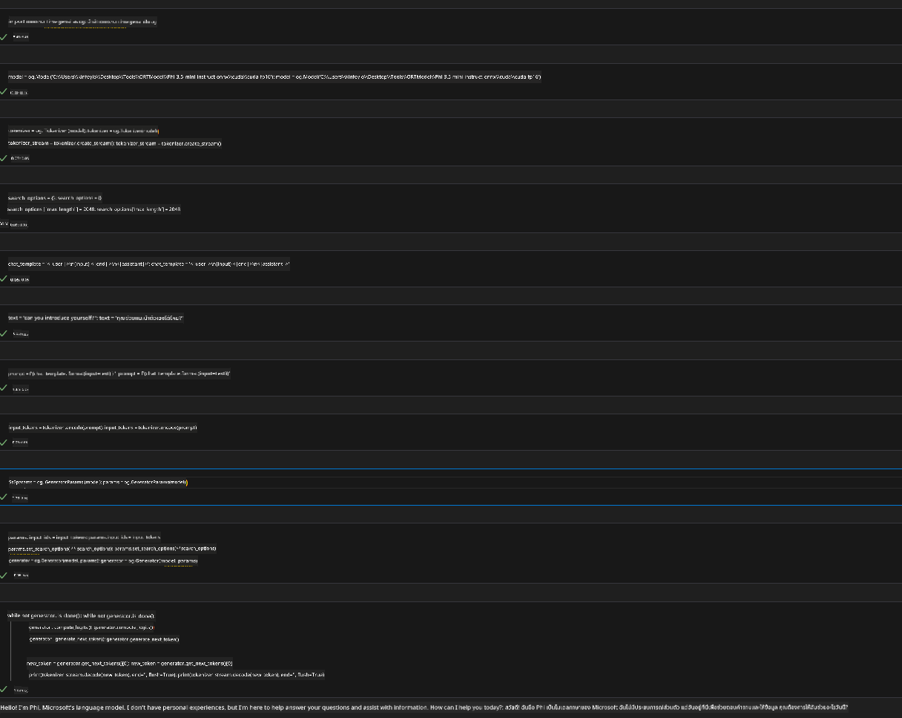

<!--
CO_OP_TRANSLATOR_METADATA:
{
  "original_hash": "b066fc29c1b2129df84e027cb75119ce",
  "translation_date": "2025-07-17T02:43:44+00:00",
  "source_file": "md/02.Application/01.TextAndChat/Phi3/ORTWindowGPUGuideline.md",
  "language_code": "th"
}
-->
# **แนวทางสำหรับ OnnxRuntime GenAI Windows GPU**

แนวทางนี้แนะนำขั้นตอนการตั้งค่าและใช้งาน ONNX Runtime (ORT) กับ GPU บน Windows เพื่อช่วยให้คุณใช้ประโยชน์จากการเร่งความเร็วด้วย GPU สำหรับโมเดลของคุณ เพิ่มประสิทธิภาพและความรวดเร็วในการทำงาน

เอกสารนี้ให้คำแนะนำเกี่ยวกับ:

- การตั้งค่าสภาพแวดล้อม: คำแนะนำการติดตั้ง dependencies ที่จำเป็น เช่น CUDA, cuDNN และ ONNX Runtime
- การกำหนดค่า: วิธีการตั้งค่าสภาพแวดล้อมและ ONNX Runtime ให้ใช้ทรัพยากร GPU อย่างมีประสิทธิภาพ
- เคล็ดลับการปรับแต่ง: คำแนะนำในการปรับแต่งการตั้งค่า GPU เพื่อประสิทธิภาพสูงสุด

### **1. Python 3.10.x /3.11.8**

   ***Note*** แนะนำให้ใช้ [miniforge](https://github.com/conda-forge/miniforge/releases/latest/download/Miniforge3-Windows-x86_64.exe) เป็นสภาพแวดล้อม Python ของคุณ

   ```bash

   conda create -n pydev python==3.11.8

   conda activate pydev

   ```

   ***Reminder*** หากคุณติดตั้งไลบรารี ONNX สำหรับ Python ไว้แล้ว กรุณาถอดถอนออกก่อน

### **2. ติดตั้ง CMake ด้วย winget**

   ```bash

   winget install -e --id Kitware.CMake

   ```

### **3. ติดตั้ง Visual Studio 2022 - Desktop Development with C++**

   ***Note*** หากคุณไม่ต้องการคอมไพล์ สามารถข้ามขั้นตอนนี้ได้


### **4. ติดตั้ง NVIDIA Driver**

1. **NVIDIA GPU Driver**  [https://www.nvidia.com/en-us/drivers/](https://www.nvidia.com/en-us/drivers/)

2. **NVIDIA CUDA 12.4** [https://developer.nvidia.com/cuda-12-4-0-download-archive](https://developer.nvidia.com/cuda-12-4-0-download-archive)

3. **NVIDIA CUDNN 9.4**  [https://developer.nvidia.com/cudnn-downloads](https://developer.nvidia.com/cudnn-downloads)

***Reminder*** กรุณาใช้การตั้งค่าเริ่มต้นตามขั้นตอนการติดตั้ง

### **5. ตั้งค่าสภาพแวดล้อม NVIDIA**

คัดลอกไฟล์ lib, bin, include ของ NVIDIA CUDNN 9.4 ไปยัง lib, bin, include ของ NVIDIA CUDA 12.4

- คัดลอกไฟล์จาก *'C:\Program Files\NVIDIA\CUDNN\v9.4\bin\12.6'* ไปยัง *'C:\Program Files\NVIDIA GPU Computing Toolkit\CUDA\v12.4\bin'*

- คัดลอกไฟล์จาก *'C:\Program Files\NVIDIA\CUDNN\v9.4\include\12.6'* ไปยัง *'C:\Program Files\NVIDIA GPU Computing Toolkit\CUDA\v12.4\include'*

- คัดลอกไฟล์จาก *'C:\Program Files\NVIDIA\CUDNN\v9.4\lib\12.6'* ไปยัง *'C:\Program Files\NVIDIA GPU Computing Toolkit\CUDA\v12.4\lib\x64'*

### **6. ดาวน์โหลด Phi-3.5-mini-instruct-onnx**

   ```bash

   winget install -e --id Git.Git

   winget install -e --id GitHub.GitLFS

   git lfs install

   git clone https://huggingface.co/microsoft/Phi-3.5-mini-instruct-onnx

   ```

### **7. รัน InferencePhi35Instruct.ipynb**

   เปิด [Notebook](../../../../../../code/09.UpdateSamples/Aug/ortgpu-phi35-instruct.ipynb) และรันคำสั่ง



### **8. คอมไพล์ ORT GenAI GPU**

   ***Note*** 
   
   1. กรุณาถอดถอน onnx, onnxruntime และ onnxruntime-genai ทั้งหมดก่อน

   ```bash

   pip list 
   
   ```

   จากนั้นถอดถอนไลบรารี onnxruntime ทั้งหมด เช่น

   ```bash

   pip uninstall onnxruntime

   pip uninstall onnxruntime-genai

   pip uninstall onnxruntume-genai-cuda
   
   ```

   2. ตรวจสอบการสนับสนุน Visual Studio Extension

   ตรวจสอบที่ C:\Program Files\NVIDIA GPU Computing Toolkit\CUDA\v12.4\extras ว่ามีโฟลเดอร์ C:\Program Files\NVIDIA GPU Computing Toolkit\CUDA\v12.4\extras\visual_studio_integration หรือไม่
   
   หากไม่พบ ให้ตรวจสอบโฟลเดอร์ไดรเวอร์ Cuda toolkit อื่น ๆ และคัดลอกโฟลเดอร์ visual_studio_integration พร้อมเนื้อหาไปยัง C:\Program Files\NVIDIA GPU Computing Toolkit\CUDA\v12.4\extras\visual_studio_integration

   - หากคุณไม่ต้องการคอมไพล์ สามารถข้ามขั้นตอนนี้ได้

   ```bash

   git clone https://github.com/microsoft/onnxruntime-genai

   ```

   - ดาวน์โหลด [https://github.com/microsoft/onnxruntime/releases/download/v1.19.2/onnxruntime-win-x64-gpu-1.19.2.zip](https://github.com/microsoft/onnxruntime/releases/download/v1.19.2/onnxruntime-win-x64-gpu-1.19.2.zip)

   - แตกไฟล์ onnxruntime-win-x64-gpu-1.19.2.zip และเปลี่ยนชื่อเป็น **ort** จากนั้นคัดลอกโฟลเดอร์ ort ไปยัง onnxruntime-genai

   - ใช้ Windows Terminal เปิด Developer Command Prompt for VS 2022 และไปที่โฟลเดอร์ onnxruntime-genai


   - คอมไพล์ด้วยสภาพแวดล้อม Python ของคุณ

   ```bash

   cd onnxruntime-genai

   python build.py --use_cuda  --cuda_home "C:\Program Files\NVIDIA GPU Computing Toolkit\CUDA\v12.4" --config Release
 

   cd build/Windows/Release/Wheel

   pip install .whl

   ```

**ข้อจำกัดความรับผิดชอบ**:  
เอกสารนี้ได้รับการแปลโดยใช้บริการแปลภาษาอัตโนมัติ [Co-op Translator](https://github.com/Azure/co-op-translator) แม้เราจะพยายามให้ความถูกต้องสูงสุด แต่โปรดทราบว่าการแปลอัตโนมัติอาจมีข้อผิดพลาดหรือความไม่ถูกต้อง เอกสารต้นฉบับในภาษาต้นทางถือเป็นแหล่งข้อมูลที่เชื่อถือได้ สำหรับข้อมูลที่สำคัญ ขอแนะนำให้ใช้บริการแปลโดยผู้เชี่ยวชาญมนุษย์ เราไม่รับผิดชอบต่อความเข้าใจผิดหรือการตีความผิดใด ๆ ที่เกิดจากการใช้การแปลนี้