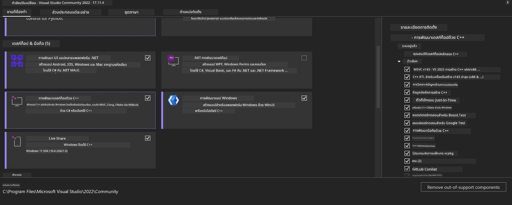
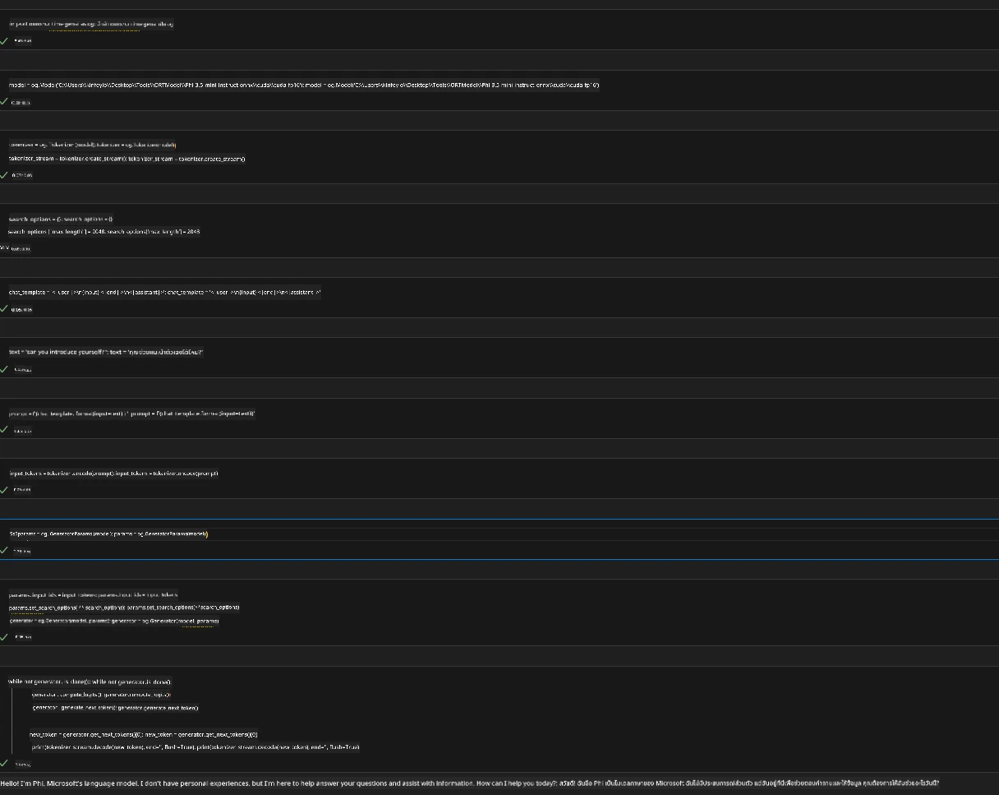
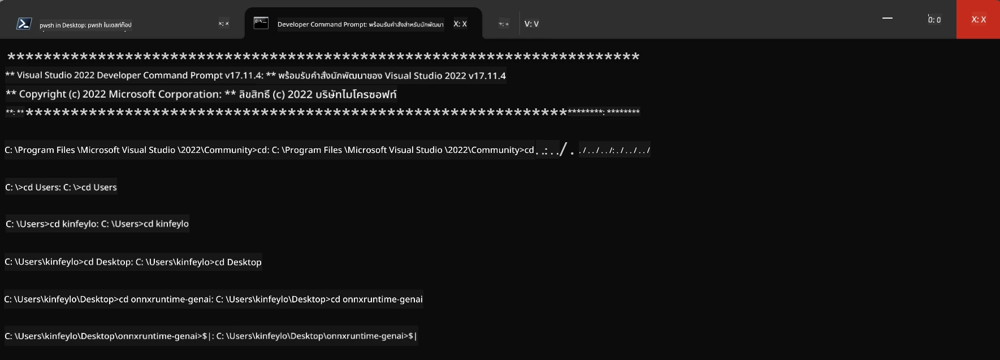

# **แนวทางสำหรับ OnnxRuntime GenAI Windows GPU**

แนวทางนี้ให้ขั้นตอนสำหรับการตั้งค่าและการใช้ ONNX Runtime (ORT) กับ GPU บน Windows ซึ่งออกแบบมาเพื่อช่วยให้คุณใช้ประโยชน์จากการเร่งความเร็ว GPU สำหรับโมเดลของคุณ เพิ่มประสิทธิภาพและความเร็ว

เอกสารนี้ให้คำแนะนำเกี่ยวกับ:

- การตั้งค่าสภาพแวดล้อม: คำแนะนำเกี่ยวกับการติดตั้ง dependencies ที่จำเป็น เช่น CUDA, cuDNN และ ONNX Runtime
- การกำหนดค่า: วิธีการกำหนดค่าสภาพแวดล้อมและ ONNX Runtime เพื่อใช้ทรัพยากร GPU อย่างมีประสิทธิภาพ
- เคล็ดลับการปรับแต่ง: คำแนะนำในการปรับแต่งการตั้งค่า GPU ของคุณเพื่อประสิทธิภาพสูงสุด

### **1. Python 3.10.x /3.11.8**

***หมายเหตุ*** แนะนำให้ใช้ [miniforge](https://github.com/conda-forge/miniforge/releases/latest/download/Miniforge3-Windows-x86_64.exe) เป็นสภาพแวดล้อม Python ของคุณ

   ```bash

   conda create -n pydev python==3.11.8

   conda activate pydev

   ```

***เตือนความจำ*** หากคุณติดตั้งไลบรารี python ONNX ใดๆ โปรดถอนการติดตั้งก่อน

### **2. ติดตั้ง CMake ด้วย winget**


   ```bash

   winget install -e --id Kitware.CMake

   ```

### **3. ติดตั้ง Visual Studio 2022 - Desktop Development with C++**

***หมายเหตุ*** หากคุณไม่ต้องการคอมไพล์ สามารถข้ามขั้นตอนนี้ได้




### **4. ติดตั้งไดรเวอร์ NVIDIA**

1. **ไดรเวอร์ GPU NVIDIA**  [https://www.nvidia.com/en-us/drivers/](https://www.nvidia.com/en-us/drivers/)

2. **NVIDIA CUDA 12.4** [https://developer.nvidia.com/cuda-12-4-0-download-archive](https://developer.nvidia.com/cuda-12-4-0-download-archive)

3. **NVIDIA CUDNN 9.4**  [https://developer.nvidia.com/cudnn-downloads](https://developer.nvidia.com/cudnn-downloads)

***เตือนความจำ*** กรุณาใช้การตั้งค่าเริ่มต้นในขั้นตอนการติดตั้ง

### **5. ตั้งค่าสภาพแวดล้อม NVIDIA**

คัดลอกไฟล์ lib, bin, include ของ NVIDIA CUDNN 9.4 ไปยัง lib, bin, include ของ NVIDIA CUDA 12.4

- คัดลอกไฟล์จาก *'C:\Program Files\NVIDIA\CUDNN\v9.4\bin\12.6'* ไปยัง *'C:\Program Files\NVIDIA GPU Computing Toolkit\CUDA\v12.4\bin'*

- คัดลอกไฟล์จาก *'C:\Program Files\NVIDIA\CUDNN\v9.4\include\12.6'* ไปยัง *'C:\Program Files\NVIDIA GPU Computing Toolkit\CUDA\v12.4\include'*

- คัดลอกไฟล์จาก *'C:\Program Files\NVIDIA\CUDNN\v9.4\lib\12.6'* ไปยัง *'C:\Program Files\NVIDIA GPU Computing Toolkit\CUDA\v12.4\lib\x64'*


### **6. ดาวน์โหลด Phi-3.5-mini-instruct-onnx**


   ```bash

   winget install -e --id Git.Git

   winget install -e --id GitHub.GitLFS

   git lfs install

   git clone https://huggingface.co/microsoft/Phi-3.5-mini-instruct-onnx

   ```

### **7. รัน InferencePhi35Instruct.ipynb**

เปิด [Notebook](../../../../code/09.UpdateSamples/Aug/ortgpu-phi35-instruct.ipynb) และดำเนินการ





### **8. คอมไพล์ ORT GenAI GPU**


***หมายเหตุ*** 
   
1. โปรดถอนการติดตั้ง onnx, onnxruntime และ onnxruntime-genai ทั้งหมดก่อน

   
   ```bash

   pip list 
   
   ```

จากนั้นถอนการติดตั้งไลบรารี onnxruntime ทั้งหมด เช่น


   ```bash

   pip uninstall onnxruntime

   pip uninstall onnxruntime-genai

   pip uninstall onnxruntume-genai-cuda
   
   ```

2. ตรวจสอบการสนับสนุน Visual Studio Extension

ตรวจสอบใน C:\Program Files\NVIDIA GPU Computing Toolkit\CUDA\v12.4\extras เพื่อให้แน่ใจว่าเจอ โฟลเดอร์ C:\Program Files\NVIDIA GPU Computing Toolkit\CUDA\v12.4\extras\visual_studio_integration 
   
หากไม่พบ ให้ตรวจสอบโฟลเดอร์ไดรเวอร์ Cuda toolkit อื่น ๆ และคัดลอกโฟลเดอร์ visual_studio_integration พร้อมเนื้อหาไปยัง C:\Program Files\NVIDIA GPU Computing Toolkit\CUDA\v12.4\extras\visual_studio_integration


- หากคุณไม่ต้องการคอมไพล์ สามารถข้ามขั้นตอนนี้ได้


   ```bash

   git clone https://github.com/microsoft/onnxruntime-genai

   ```

- ดาวน์โหลด [https://github.com/microsoft/onnxruntime/releases/download/v1.19.2/onnxruntime-win-x64-gpu-1.19.2.zip](https://github.com/microsoft/onnxruntime/releases/download/v1.19.2/onnxruntime-win-x64-gpu-1.19.2.zip)

- แตกไฟล์ onnxruntime-win-x64-gpu-1.19.2.zip และเปลี่ยนชื่อเป็น **ort** จากนั้นคัดลอกโฟลเดอร์ ort ไปที่ onnxruntime-genai

- ใช้ Windows Terminal ไปที่ Developer Command Prompt for VS 2022 และไปยัง onnxruntime-genai



- คอมไพล์ด้วยสภาพแวดล้อม python ของคุณ

   
   ```bash

   cd onnxruntime-genai

   python build.py --use_cuda  --cuda_home "C:\Program Files\NVIDIA GPU Computing Toolkit\CUDA\v12.4" --config Release
 

   cd build/Windows/Release/Wheel

   pip install .whl

   ```

---

<!-- CO-OP TRANSLATOR DISCLAIMER START -->
**ปฏิเสธความรับผิดชอบ**:
เอกสารนี้ได้รับการแปลโดยใช้บริการแปลภาษา AI [Co-op Translator](https://github.com/Azure/co-op-translator) ขณะที่เราพยายามให้ความถูกต้อง โปรดทราบว่าการแปลโดยอัตโนมัติอาจมีข้อผิดพลาดหรือความไม่ถูกต้อง เอกสารต้นฉบับในภาษาต้นทางควรถูกพิจารณาเป็นแหล่งข้อมูลที่เชื่อถือได้ สำหรับข้อมูลที่สำคัญ แนะนำให้ใช้การแปลโดยมนุษย์มืออาชีพ เราไม่รับผิดชอบต่อความเข้าใจผิดหรือการตีความที่ผิดพลาดที่เกิดขึ้นจากการใช้การแปลนี้
<!-- CO-OP TRANSLATOR DISCLAIMER END -->