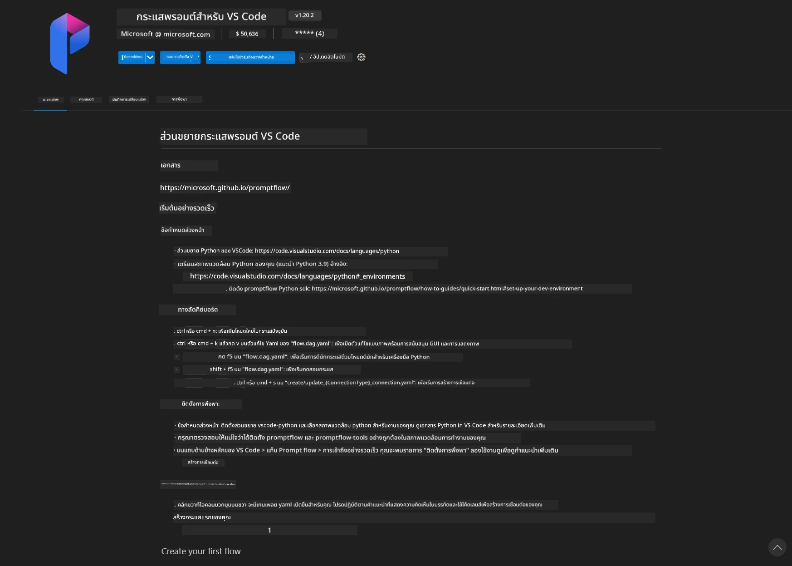
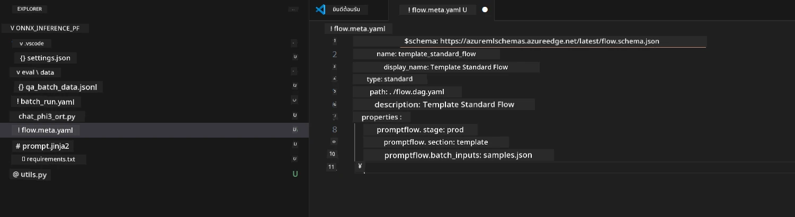
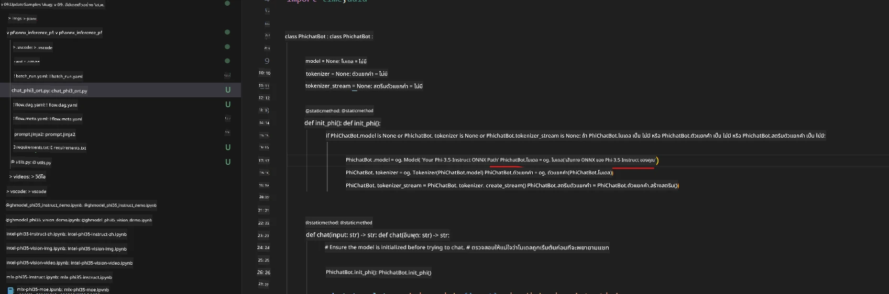
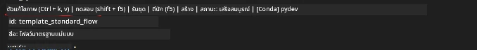
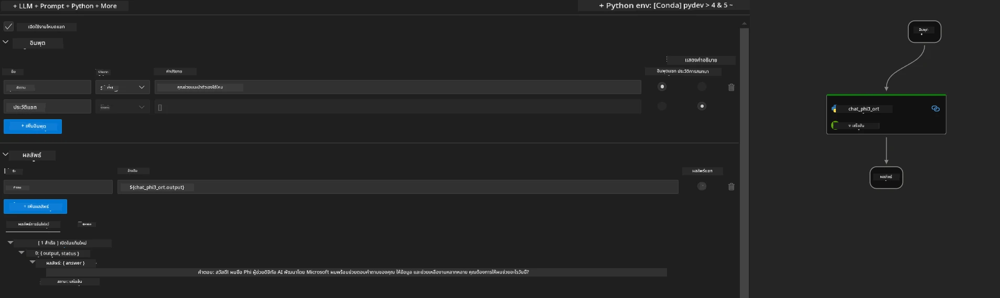

<!--
CO_OP_TRANSLATOR_METADATA:
{
  "original_hash": "92e7dac1e5af0dd7c94170fdaf6860fe",
  "translation_date": "2025-07-17T03:00:39+00:00",
  "source_file": "md/02.Application/01.TextAndChat/Phi3/UsingPromptFlowWithONNX.md",
  "language_code": "th"
}
-->
# การใช้ Windows GPU เพื่อสร้างโซลูชัน Prompt flow กับ Phi-3.5-Instruct ONNX

เอกสารนี้เป็นตัวอย่างการใช้งาน PromptFlow ร่วมกับ ONNX (Open Neural Network Exchange) สำหรับพัฒนาแอปพลิเคชัน AI ที่ใช้โมเดล Phi-3

PromptFlow คือชุดเครื่องมือสำหรับการพัฒนาที่ออกแบบมาเพื่อช่วยให้กระบวนการพัฒนาแอปพลิเคชัน AI ที่ใช้ LLM (Large Language Model) ตั้งแต่การคิดไอเดีย การสร้างต้นแบบ ไปจนถึงการทดสอบและประเมินผล เป็นไปอย่างราบรื่น

โดยการผสาน PromptFlow กับ ONNX นักพัฒนาสามารถ:

- ปรับประสิทธิภาพของโมเดล: ใช้ ONNX เพื่อการประมวลผลและการนำโมเดลไปใช้งานที่มีประสิทธิภาพ
- ทำให้การพัฒนาง่ายขึ้น: ใช้ PromptFlow ในการจัดการเวิร์กโฟลว์และอัตโนมัติงานที่ทำซ้ำๆ
- ส่งเสริมการทำงานร่วมกัน: ช่วยให้ทีมทำงานร่วมกันได้ดีขึ้นด้วยสภาพแวดล้อมการพัฒนาที่เป็นหนึ่งเดียว

**Prompt flow** คือชุดเครื่องมือสำหรับการพัฒนาที่ช่วยให้กระบวนการพัฒนาแอปพลิเคชัน AI ที่ใช้ LLM ตั้งแต่การคิดไอเดีย การสร้างต้นแบบ การทดสอบ การประเมินผล ไปจนถึงการนำไปใช้งานจริงและการติดตามผล เป็นไปอย่างง่ายดาย ช่วยให้การออกแบบ prompt มีประสิทธิภาพมากขึ้น และช่วยให้คุณสร้างแอป LLM ที่มีคุณภาพสำหรับการใช้งานจริงได้

Prompt flow สามารถเชื่อมต่อกับ OpenAI, Azure OpenAI Service และโมเดลที่ปรับแต่งได้ (Huggingface, LLM/SLM ในเครื่อง) เราหวังว่าจะนำโมเดล ONNX ที่ถูกควอนไทซ์ของ Phi-3.5 ไปใช้งานในแอปพลิเคชันภายในเครื่อง Prompt flow จะช่วยให้เราวางแผนธุรกิจได้ดีขึ้นและสร้างโซลูชันภายในเครื่องที่ใช้ Phi-3.5 ได้ ในตัวอย่างนี้ เราจะรวม ONNX Runtime GenAI Library เพื่อสร้างโซลูชัน Prompt flow บน Windows GPU

## **การติดตั้ง**

### **ONNX Runtime GenAI สำหรับ Windows GPU**

อ่านคำแนะนำการตั้งค่า ONNX Runtime GenAI สำหรับ Windows GPU [คลิกที่นี่](./ORTWindowGPUGuideline.md)

### **ตั้งค่า Prompt flow ใน VSCode**

1. ติดตั้ง Prompt flow VS Code Extension



2. หลังจากติดตั้ง Prompt flow VS Code Extension แล้ว คลิกที่ส่วนขยาย และเลือก **Installation dependencies** ทำตามคำแนะนำนี้เพื่อติดตั้ง Prompt flow SDK ในสภาพแวดล้อมของคุณ


3. ดาวน์โหลด [Sample Code](../../../../../../code/09.UpdateSamples/Aug/pf/onnx_inference_pf) และใช้ VS Code เปิดตัวอย่างนี้



4. เปิดไฟล์ **flow.dag.yaml** เพื่อเลือกสภาพแวดล้อม Python ของคุณ


   เปิดไฟล์ **chat_phi3_ort.py** เพื่อเปลี่ยนตำแหน่งโมเดล Phi-3.5-instruct ONNX ของคุณ



5. รัน prompt flow ของคุณเพื่อทดสอบ

เปิดไฟล์ **flow.dag.yaml** แล้วคลิก visual editor



หลังจากคลิกแล้ว ให้รันเพื่อทดสอบ



1. คุณสามารถรันแบบ batch ในเทอร์มินัลเพื่อตรวจสอบผลลัพธ์เพิ่มเติม


```bash

pf run create --file batch_run.yaml --stream --name 'Your eval qa name'    

```

คุณสามารถตรวจสอบผลลัพธ์ในเบราว์เซอร์เริ่มต้นของคุณ


**ข้อจำกัดความรับผิดชอบ**:  
เอกสารนี้ได้รับการแปลโดยใช้บริการแปลภาษาอัตโนมัติ [Co-op Translator](https://github.com/Azure/co-op-translator) แม้เราจะพยายามให้ความถูกต้องสูงสุด แต่โปรดทราบว่าการแปลอัตโนมัติอาจมีข้อผิดพลาดหรือความไม่ถูกต้อง เอกสารต้นฉบับในภาษาต้นทางถือเป็นแหล่งข้อมูลที่เชื่อถือได้ สำหรับข้อมูลที่สำคัญ ขอแนะนำให้ใช้บริการแปลโดยผู้เชี่ยวชาญมนุษย์ เราไม่รับผิดชอบต่อความเข้าใจผิดหรือการตีความผิดที่เกิดขึ้นจากการใช้การแปลนี้