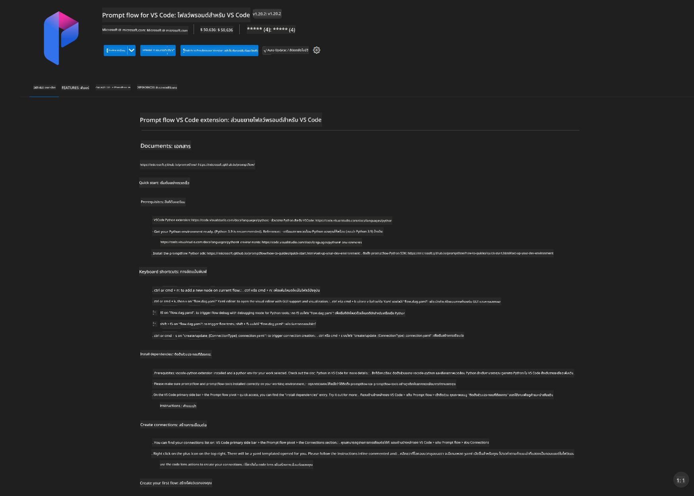
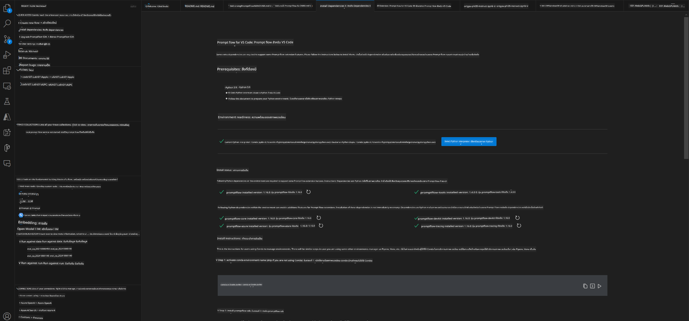
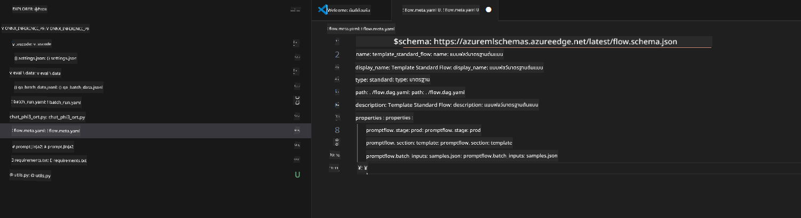
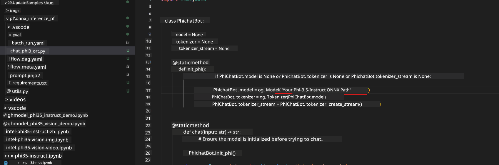
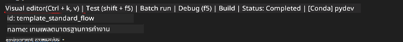
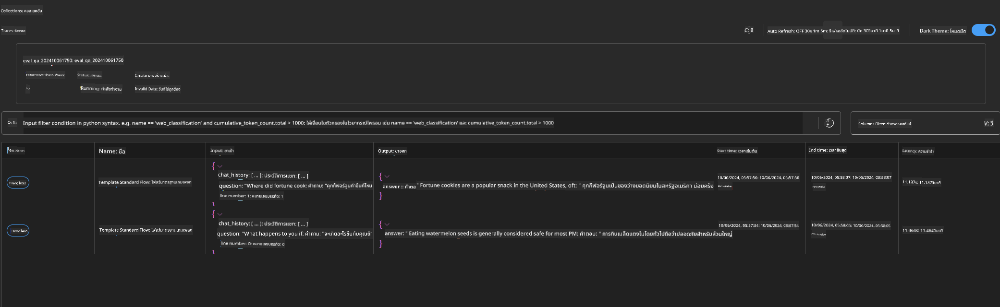

<!--
CO_OP_TRANSLATOR_METADATA:
{
  "original_hash": "92e7dac1e5af0dd7c94170fdaf6860fe",
  "translation_date": "2025-05-09T18:53:03+00:00",
  "source_file": "md/02.Application/01.TextAndChat/Phi3/UsingPromptFlowWithONNX.md",
  "language_code": "th"
}
-->
# การใช้ Windows GPU เพื่อสร้างโซลูชัน Prompt flow ด้วย Phi-3.5-Instruct ONNX

เอกสารนี้เป็นตัวอย่างวิธีการใช้ PromptFlow ร่วมกับ ONNX (Open Neural Network Exchange) สำหรับพัฒนาแอปพลิเคชัน AI ที่อิงตามโมเดล Phi-3

PromptFlow คือชุดเครื่องมือสำหรับการพัฒนา ที่ออกแบบมาเพื่อช่วยให้กระบวนการพัฒนาแอปพลิเคชัน AI ที่ใช้ LLM (Large Language Model) ตั้งแต่การคิดไอเดีย การทำต้นแบบ ไปจนถึงการทดสอบและประเมินผล เป็นไปอย่างราบรื่น

ด้วยการรวม PromptFlow กับ ONNX นักพัฒนาสามารถ:

- ปรับประสิทธิภาพของโมเดล: ใช้ ONNX เพื่อเพิ่มประสิทธิภาพในการรันและการใช้งานโมเดล
- ทำให้การพัฒนาง่ายขึ้น: ใช้ PromptFlow ในการจัดการเวิร์กโฟลว์และอัตโนมัติงานที่ทำซ้ำๆ
- เพิ่มความร่วมมือ: ช่วยให้ทีมทำงานร่วมกันได้ดีขึ้นด้วยสภาพแวดล้อมการพัฒนาที่เป็นหนึ่งเดียว

**Prompt flow** คือชุดเครื่องมือสำหรับการพัฒนา ที่ออกแบบมาเพื่อช่วยให้กระบวนการพัฒนาแอปพลิเคชัน AI ที่ใช้ LLM ตั้งแต่การคิดไอเดีย การทำต้นแบบ การทดสอบ การประเมินผล ไปจนถึงการนำไปใช้งานจริงและการติดตามผล เป็นไปอย่างมีประสิทธิภาพ ช่วยให้งานวิศวกรรม prompt ง่ายขึ้นและช่วยให้คุณสร้างแอป LLM ที่มีคุณภาพระดับโปรดักชันได้

Prompt flow สามารถเชื่อมต่อกับ OpenAI, Azure OpenAI Service และโมเดลที่ปรับแต่งได้ (Huggingface, LLM/SLM ในเครื่อง) เราหวังว่าจะนำโมเดล ONNX แบบ quantized ของ Phi-3.5 ไปใช้ในแอปพลิเคชันภายในเครื่อง Prompt flow จะช่วยให้เราวางแผนธุรกิจได้ดีขึ้นและสร้างโซลูชันในเครื่องที่อิงกับ Phi-3.5 ได้ ในตัวอย่างนี้ เราจะรวม ONNX Runtime GenAI Library เพื่อสร้างโซลูชัน Prompt flow บน Windows GPU

## **การติดตั้ง**

### **ONNX Runtime GenAI สำหรับ Windows GPU**

อ่านคำแนะนำนี้เพื่อตั้งค่า ONNX Runtime GenAI สำหรับ Windows GPU [คลิกที่นี่](./ORTWindowGPUGuideline.md)

### **การตั้งค่า Prompt flow ใน VSCode**

1. ติดตั้ง Prompt flow VS Code Extension



2. หลังจากติดตั้ง Prompt flow VS Code Extension แล้ว ให้คลิกที่ส่วนขยายนี้ และเลือก **Installation dependencies** ตามคำแนะนำนี้เพื่อติดตั้ง Prompt flow SDK ในสภาพแวดล้อมของคุณ



3. ดาวน์โหลด [Sample Code](../../../../../../code/09.UpdateSamples/Aug/pf/onnx_inference_pf) และใช้ VS Code เปิดตัวอย่างนี้



4. เปิดไฟล์ **flow.dag.yaml** เพื่อเลือกสภาพแวดล้อม Python ของคุณ


   เปิดไฟล์ **chat_phi3_ort.py** เพื่อเปลี่ยนตำแหน่งโมเดล Phi-3.5-instruct ONNX ของคุณ



5. รัน prompt flow เพื่อทดสอบ

เปิดไฟล์ **flow.dag.yaml** แล้วคลิกที่ visual editor



หลังจากคลิกนี้ ให้รันเพื่อทดสอบ


1. คุณสามารถรันแบบ batch ใน terminal เพื่อตรวจสอบผลลัพธ์เพิ่มเติม


```bash

pf run create --file batch_run.yaml --stream --name 'Your eval qa name'    

```

คุณสามารถดูผลลัพธ์ได้ในเว็บเบราว์เซอร์เริ่มต้นของคุณ




**ข้อจำกัดความรับผิดชอบ**:  
เอกสารฉบับนี้ได้รับการแปลโดยใช้บริการแปลภาษาอัตโนมัติ [Co-op Translator](https://github.com/Azure/co-op-translator) แม้ว่าเราจะพยายามให้ความถูกต้องสูงสุด แต่โปรดทราบว่าการแปลโดยอัตโนมัติอาจมีข้อผิดพลาดหรือความไม่ถูกต้อง เอกสารต้นฉบับในภาษาต้นฉบับถือเป็นแหล่งข้อมูลที่ถูกต้องและเชื่อถือได้ สำหรับข้อมูลที่สำคัญ แนะนำให้ใช้บริการแปลโดยมนุษย์มืออาชีพ เราไม่รับผิดชอบต่อความเข้าใจผิดหรือการตีความผิดที่เกิดจากการใช้การแปลนี้