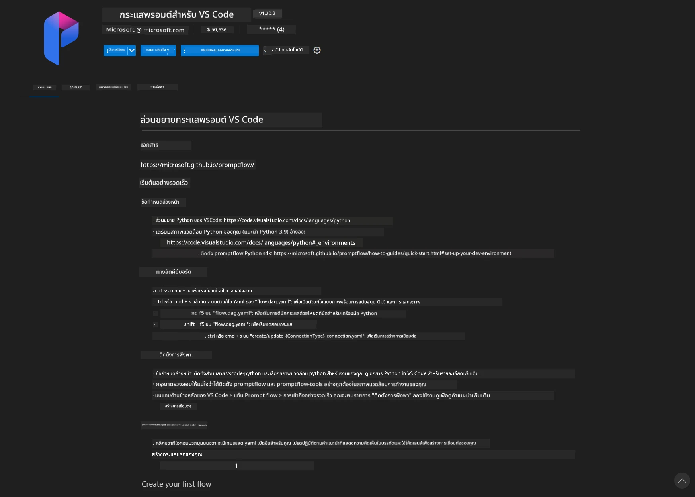
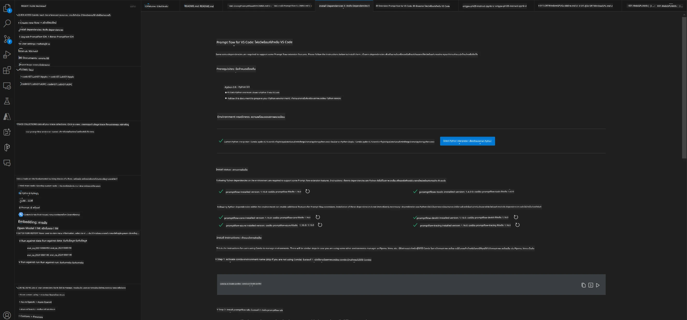
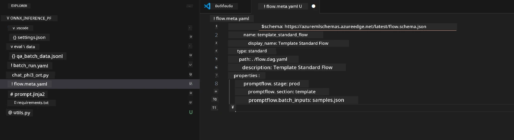
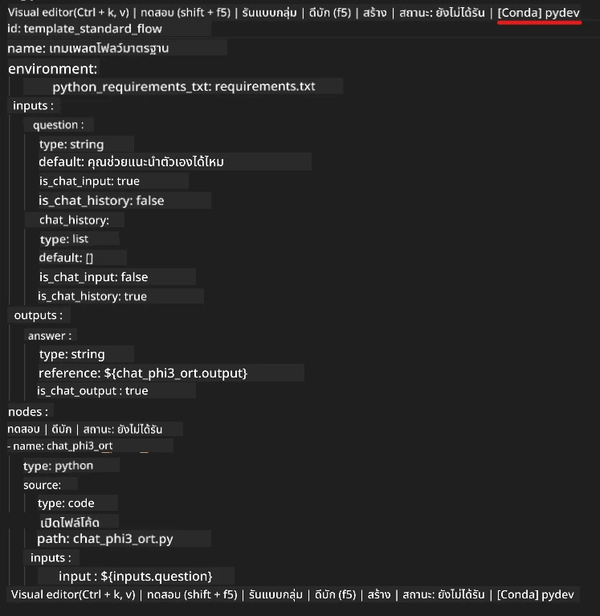
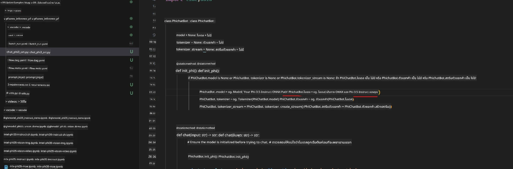
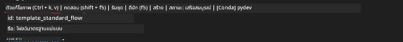
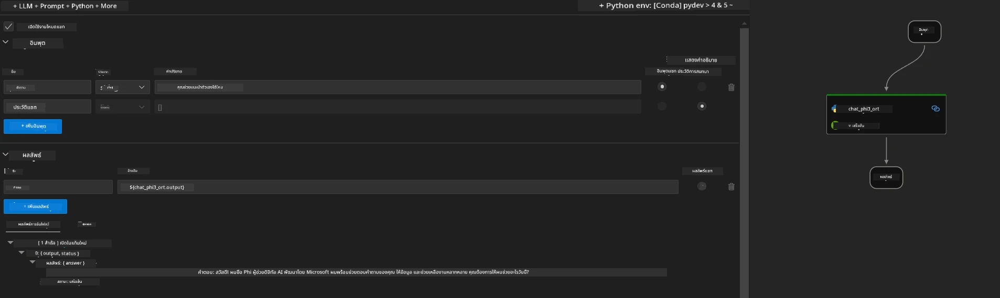
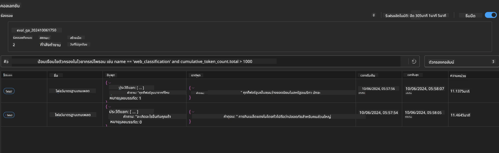

# การใช้ Windows GPU เพื่อสร้างโซลูชัน Prompt flow กับ Phi-3.5-Instruct ONNX 

เอกสารนี้เป็นตัวอย่างของวิธีการใช้ PromptFlow กับ ONNX (Open Neural Network Exchange) สำหรับการพัฒนาแอปพลิเคชัน AI ที่ใช้โมเดล Phi-3

PromptFlow คือชุดเครื่องมือสำหรับการพัฒนาที่ออกแบบมาเพื่อช่วยให้กระบวนการพัฒนาครบวงจรของแอปพลิเคชัน AI ที่ใช้โมเดลภาษาขนาดใหญ่ (LLM) เป็นไปอย่างราบรื่น ตั้งแต่ไอเดีย การสร้างต้นแบบ ไปจนถึงการทดสอบและประเมินผล

โดยการรวม PromptFlow กับ ONNX นักพัฒนาสามารถ:

- ปรับประสิทธิภาพของโมเดล: ใช้ประโยชน์จาก ONNX เพื่อการสรุปผลและการนำโมเดลไปใช้ที่มีประสิทธิภาพ
- ทำให้การพัฒนาง่ายขึ้น: ใช้ PromptFlow เพื่อจัดการเวิร์กโฟลว์และทำงานที่ซ้ำซ้อนได้โดยอัตโนมัติ
- ส่งเสริมการทำงานร่วมกัน: อำนวยความสะดวกให้การทำงานร่วมกันของสมาชิกในทีมดีขึ้นด้วยสภาพแวดล้อมการพัฒนาที่เป็นหนึ่งเดียว

**Prompt flow** คือชุดเครื่องมือสำหรับพัฒนาออกแบบมาเพื่อช่วยให้กระบวนการพัฒนาครบวงจรของแอปพลิเคชัน AI ที่ใช้โมเดลภาษาขนาดใหญ่เป็นไปอย่างราบรื่น ตั้งแต่ไอเดีย การสร้างต้นแบบ การทดสอบ การประเมินผล จนถึงการนำไปใช้งานจริงและการตรวจสอบ มันช่วยให้การปรับแต่ง prompt ง่ายขึ้นมากและช่วยให้คุณสร้างแอป LLM ที่มีคุณภาพสำหรับใช้งานจริงได้

Prompt flow สามารถเชื่อมต่อกับ OpenAI, Azure OpenAI Service และโมเดลที่ปรับแต่งได้ (Huggingface, LLM/SLM ภายในเครื่อง) เราหวังที่จะนำโมเดล ONNX แบบ quantized ของ Phi-3.5 ไปใช้ในแอปพลิเคชันภายในเครื่อง Prompt flow สามารถช่วยเราวางแผนธุรกิจได้ดีขึ้นและสร้างโซลูชันภายในเครื่องบนพื้นฐานของ Phi-3.5 ในตัวอย่างนี้ เราจะผสาน ONNX Runtime GenAI Library เพื่อสร้างโซลูชัน Prompt flow บน Windows GPU

## **การติดตั้ง**

### **ONNX Runtime GenAI สำหรับ Windows GPU**

อ่านแนวทางนี้เพื่อการตั้งค่า ONNX Runtime GenAI สำหรับ Windows GPU  [คลิกที่นี่](./ORTWindowGPUGuideline.md)

### **ตั้งค่า Prompt flow ใน VSCode**

1. ติดตั้งส่วนขยาย Prompt flow ใน VS Code



2. หลังจากติดตั้งส่วนขยาย Prompt flow ใน VS Code ให้คลิกส่วนขยาย และเลือก **Installation dependencies** ตามแนวทางนี้เพื่อติดตั้ง Prompt flow SDK ในสภาพแวดล้อมของคุณ



3. ดาวน์โหลด [Sample Code](../../../../../../code/09.UpdateSamples/Aug/pf/onnx_inference_pf) และใช้ VS Code เปิดตัวอย่างนี้



4. เปิด **flow.dag.yaml** เพื่อเลือกสภาพแวดล้อม Python ของคุณ



   เปิด **chat_phi3_ort.py** เพื่อเปลี่ยนตำแหน่งโมเดล Phi-3.5-instruct ONNX ของคุณ



5. รัน prompt flow เพื่อทดสอบ

เปิด **flow.dag.yaml** คลิก visual editor



หลังจากคลิกแล้ว ให้รันเพื่อทดสอบ



1. คุณสามารถรัน batch ใน terminal เพื่อตรวจสอบผลลัพธ์เพิ่มเติม


```bash

pf run create --file batch_run.yaml --stream --name 'Your eval qa name'    

```

คุณสามารถตรวจสอบผลลัพธ์ได้ในเว็บเบราว์เซอร์ที่ตั้งค่าไว้เป็นค่าเริ่มต้น




---

<!-- CO-OP TRANSLATOR DISCLAIMER START -->
**ปฏิเสธความรับผิดชอบ**:
เอกสารนี้ได้รับการแปลโดยใช้บริการแปลภาษา AI [Co-op Translator](https://github.com/Azure/co-op-translator) ขณะที่เราพยายามให้ความถูกต้อง โปรดทราบว่าการแปลโดยอัตโนมัติอาจมีข้อผิดพลาดหรือความไม่ถูกต้อง เอกสารต้นฉบับในภาษาต้นทางควรถูกพิจารณาเป็นแหล่งข้อมูลที่เชื่อถือได้ สำหรับข้อมูลที่สำคัญ แนะนำให้ใช้การแปลโดยมนุษย์มืออาชีพ เราไม่รับผิดชอบต่อความเข้าใจผิดหรือการตีความที่ผิดพลาดที่เกิดขึ้นจากการใช้การแปลนี้
<!-- CO-OP TRANSLATOR DISCLAIMER END -->