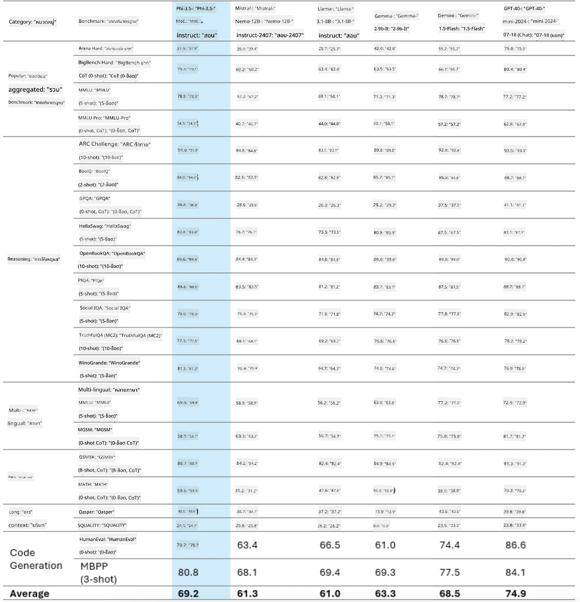
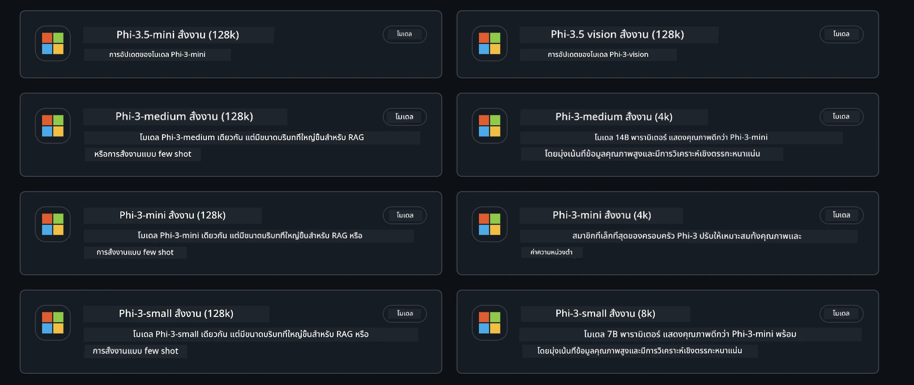
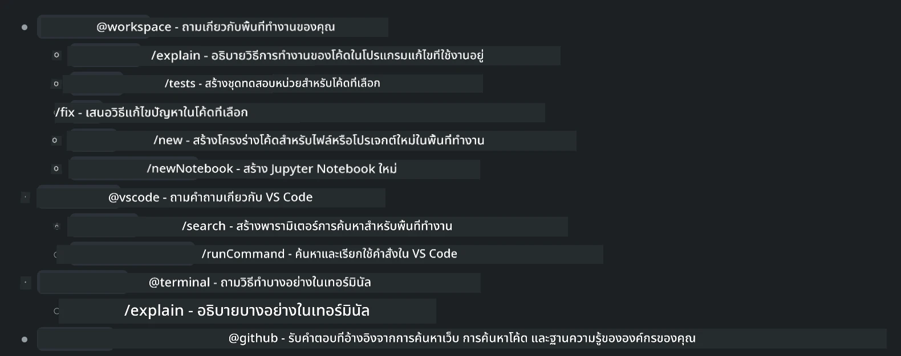
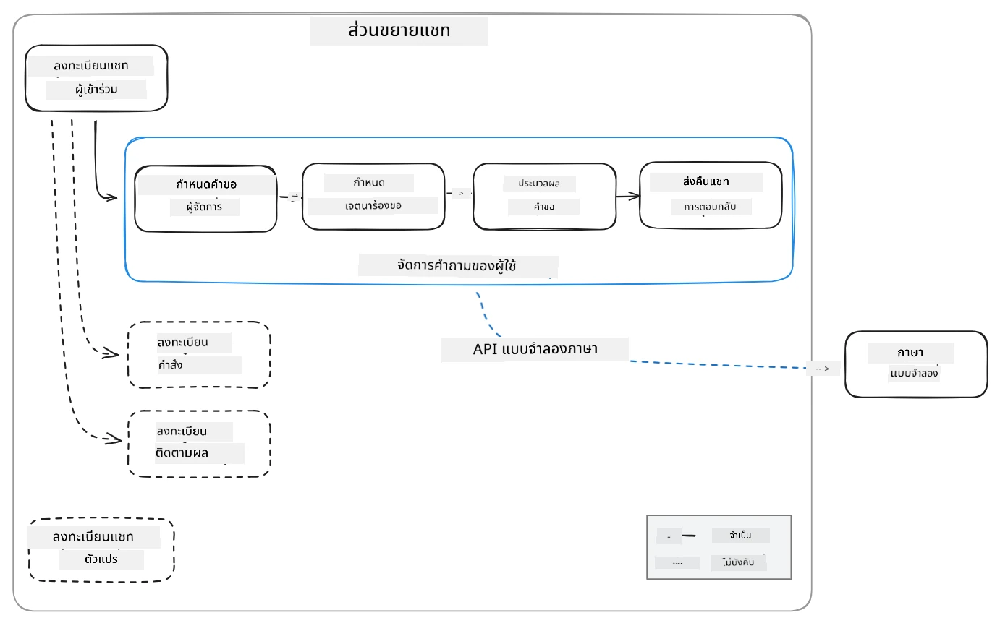
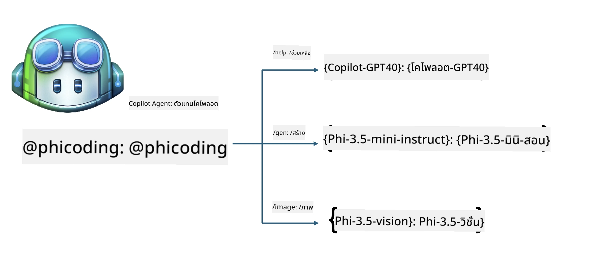
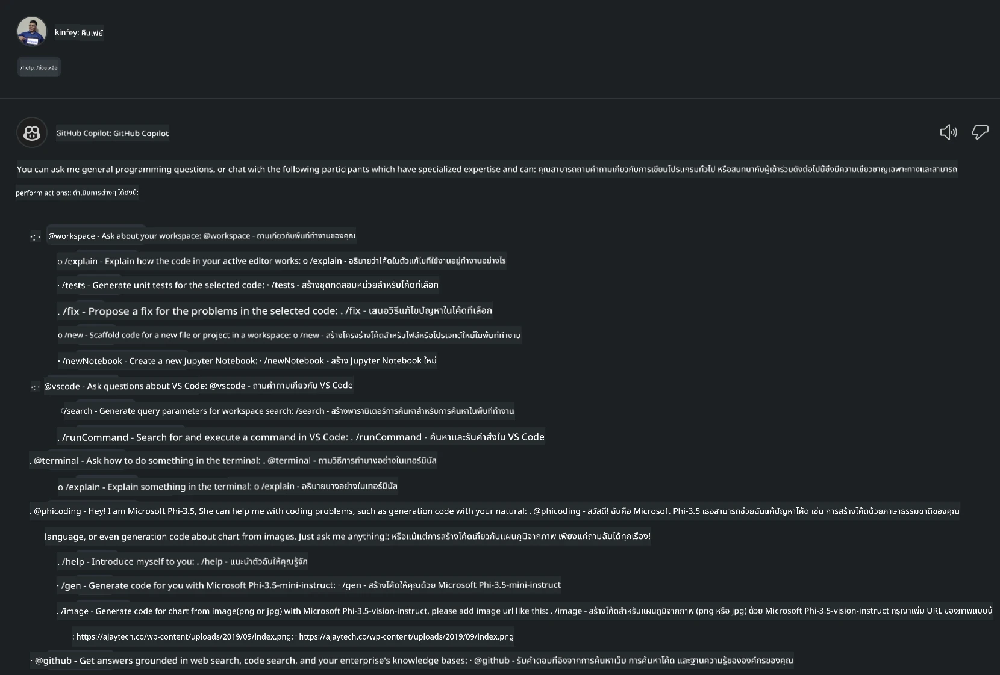
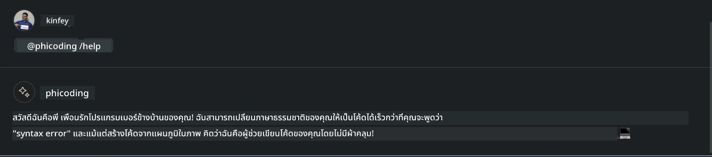
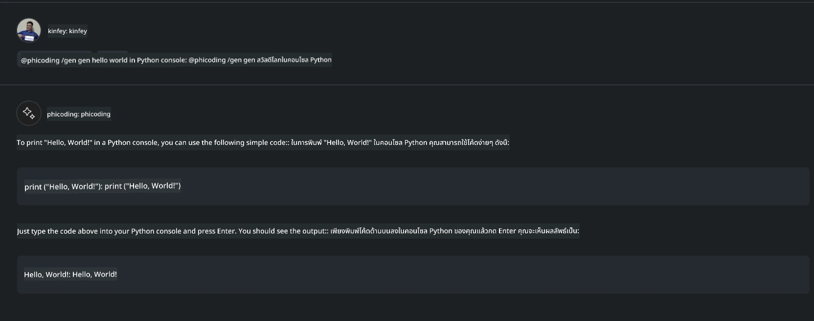
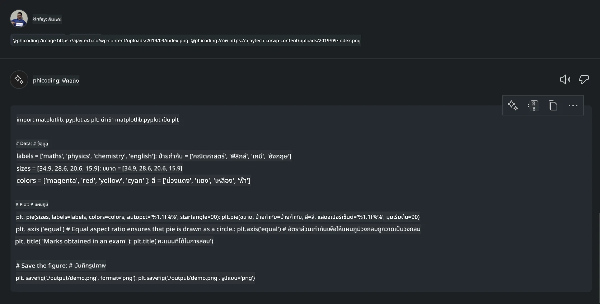

# **สร้าง Visual Studio Code Chat Copilot Agent ของคุณเองด้วย Phi-3.5 จาก GitHub Models**

คุณกำลังใช้ Visual Studio Code Copilot อยู่หรือไม่? โดยเฉพาะในส่วนของ Chat คุณสามารถใช้เอเจนต์ต่าง ๆ เพื่อเพิ่มประสิทธิภาพในการสร้าง เขียน และดูแลโครงการใน Visual Studio Code ได้ Visual Studio Code มี API ที่ช่วยให้บริษัทและบุคคลสามารถสร้างเอเจนต์ต่าง ๆ ตามธุรกิจของตนเพื่อขยายขีดความสามารถในสาขาเฉพาะทางต่าง ๆ ในบทความนี้ เราจะเน้นที่ **Phi-3.5-mini-instruct (128k)** และ **Phi-3.5-vision-instruct (128k)** จาก GitHub Models เพื่อสร้าง Visual Studio Code Agent ของคุณเอง

## **เกี่ยวกับ Phi-3.5 บน GitHub Models**

เราทราบว่า Phi-3/3.5-mini-instruct ในตระกูล Phi-3/3.5 มีความสามารถในการเข้าใจและสร้างโค้ดที่แข็งแกร่ง และมีข้อได้เปรียบเหนือ Gemma-2-9b และ Mistral-Nemo-12B-instruct-2407



GitHub Models รุ่นล่าสุดได้เปิดให้เข้าถึงโมเดล Phi-3.5-mini-instruct (128k) และ Phi-3.5-vision-instruct (128k) แล้ว นักพัฒนาสามารถเข้าถึงผ่าน OpenAI SDK, Azure AI Inference SDK และ REST API



***Note: *** แนะนำให้ใช้ Azure AI Inference SDK ที่นี่ เพราะสามารถสลับกับ Azure Model Catalog ในสภาพแวดล้อมการผลิตได้ดีกว่า

ต่อไปนี้เป็นผลลัพธ์ของ **Phi-3.5-mini-instruct (128k)** และ **Phi-3.5-vision-instruct (128k)** ในสถานการณ์การสร้างโค้ดหลังจากเชื่อมต่อกับ GitHub Models และเตรียมพร้อมสำหรับตัวอย่างต่อไปนี้

**Demo: GitHub Models Phi-3.5-mini-instruct (128k) สร้างโค้ดจาก Prompt** ([คลิกที่นี่](../../../../../../code/09.UpdateSamples/Aug/ghmodel_phi35_instruct_demo.ipynb))

**Demo: GitHub Models Phi-3.5-vision-instruct (128k) สร้างโค้ดจากภาพ** ([คลิกที่นี่](../../../../../../code/09.UpdateSamples/Aug/ghmodel_phi35_vision_demo.ipynb))


## **เกี่ยวกับ GitHub Copilot Chat Agent**

GitHub Copilot Chat Agent สามารถทำงานต่าง ๆ ได้ในสถานการณ์โครงการที่แตกต่างกันตามโค้ด ระบบมีเอเจนต์สี่ตัว: workspace, github, terminal, vscode



โดยการเพิ่มชื่อเอเจนต์พร้อม ‘@’ คุณสามารถทำงานที่เกี่ยวข้องได้อย่างรวดเร็ว สำหรับองค์กร หากคุณเพิ่มเนื้อหาที่เกี่ยวข้องกับธุรกิจของคุณ เช่น ความต้องการ การเขียนโค้ด ข้อกำหนดการทดสอบ และการปล่อยงาน คุณจะมีฟังก์ชันส่วนตัวสำหรับองค์กรที่ทรงพลังขึ้นบนพื้นฐานของ GitHub Copilot

Visual Studio Code Chat Agent ได้ปล่อย API อย่างเป็นทางการแล้ว ทำให้องค์กรหรือผู้พัฒนาขององค์กรสามารถพัฒนาเอเจนต์ตามระบบนิเวศธุรกิจซอฟต์แวร์ที่แตกต่างกันได้ โดยอิงจากวิธีการพัฒนา Visual Studio Code Extension Development คุณสามารถเข้าถึงอินเทอร์เฟซของ Visual Studio Code Chat Agent API ได้อย่างง่ายดาย เราสามารถพัฒนาตามกระบวนการนี้



สถานการณ์การพัฒนาสามารถรองรับการเข้าถึง API ของโมเดลจากบุคคลที่สาม (เช่น GitHub Models, Azure Model Catalog และบริการที่สร้างขึ้นเองบนพื้นฐานโมเดลโอเพนซอร์ส) และยังสามารถใช้โมเดล gpt-35-turbo, gpt-4 และ gpt-4o ที่ GitHub Copilot ให้บริการได้ด้วย

## **เพิ่ม Agent @phicoding บนพื้นฐาน Phi-3.5**

เราพยายามผสานความสามารถในการเขียนโปรแกรมของ Phi-3.5 เพื่อทำงานเขียนโค้ด สร้างโค้ดจากภาพ และงานอื่น ๆ ให้เสร็จสมบูรณ์ สร้าง Agent ที่สร้างขึ้นรอบ ๆ Phi-3.5 - @PHI โดยมีฟังก์ชันดังนี้

1. สร้างการแนะนำตัวเองโดยใช้ GPT-4o ที่ GitHub Copilot ให้บริการ ผ่านคำสั่ง **@phicoding /help**

2. สร้างโค้ดสำหรับภาษาโปรแกรมต่าง ๆ โดยใช้ **Phi-3.5-mini-instruct (128k)** ผ่านคำสั่ง **@phicoding /gen**

3. สร้างโค้ดจากภาพโดยใช้ **Phi-3.5-vision-instruct (128k)** และการเติมภาพผ่านคำสั่ง **@phicoding /image**



## **ขั้นตอนที่เกี่ยวข้อง**

1. ติดตั้ง Visual Studio Code Extension development support โดยใช้ npm

```bash

npm install --global yo generator-code 

```
2. สร้างปลั๊กอิน Visual Studio Code Extension (ใช้โหมดพัฒนา Typescript ตั้งชื่อว่า phiext)

```bash

yo code 

```

3. เปิดโปรเจกต์ที่สร้างขึ้นและแก้ไข package.json นี่คือคำแนะนำและการตั้งค่าที่เกี่ยวข้อง รวมถึงการตั้งค่า GitHub Models โปรดทราบว่าคุณต้องเพิ่มโทเค็น GitHub Models ของคุณที่นี่

```json

{
  "name": "phiext",
  "displayName": "phiext",
  "description": "",
  "version": "0.0.1",
  "engines": {
    "vscode": "^1.93.0"
  },
  "categories": [
    "AI",
    "Chat"
  ],
  "activationEvents": [],
  "enabledApiProposals": [
      "chatVariableResolver"
  ],
  "main": "./dist/extension.js",
  "contributes": {
    "chatParticipants": [
        {
            "id": "chat.phicoding",
            "name": "phicoding",
            "description": "Hey! I am Microsoft Phi-3.5, She can help me with coding problems, such as generation code with your natural language, or even generation code about chart from images. Just ask me anything!",
            "isSticky": true,
            "commands": [
                {
                    "name": "help",
                    "description": "Introduce myself to you"
                },
                {
                    "name": "gen",
                    "description": "Generate code for you with Microsoft Phi-3.5-mini-instruct"
                },
                {
                    "name": "image",
                    "description": "Generate code for chart from image(png or jpg) with Microsoft Phi-3.5-vision-instruct, please add image url like this : https://ajaytech.co/wp-content/uploads/2019/09/index.png"
                }
            ]
        }
    ],
    "commands": [
        {
            "command": "phicoding.namesInEditor",
            "title": "Use Microsoft Phi 3.5 in Editor"
        }
    ],
    "configuration": {
      "type": "object",
      "title": "githubmodels",
      "properties": {
        "githubmodels.endpoint": {
          "type": "string",
          "default": "https://models.inference.ai.azure.com",
          "description": "Your GitHub Models Endpoint",
          "order": 0
        },
        "githubmodels.api_key": {
          "type": "string",
          "default": "Your GitHub Models Token",
          "description": "Your GitHub Models Token",
          "order": 1
        },
        "githubmodels.phi35instruct": {
          "type": "string",
          "default": "Phi-3.5-mini-instruct",
          "description": "Your Phi-35-Instruct Model",
          "order": 2
        },
        "githubmodels.phi35vision": {
          "type": "string",
          "default": "Phi-3.5-vision-instruct",
          "description": "Your Phi-35-Vision Model",
          "order": 3
        }
      }
    }
  },
  "scripts": {
    "vscode:prepublish": "npm run package",
    "compile": "webpack",
    "watch": "webpack --watch",
    "package": "webpack --mode production --devtool hidden-source-map",
    "compile-tests": "tsc -p . --outDir out",
    "watch-tests": "tsc -p . -w --outDir out",
    "pretest": "npm run compile-tests && npm run compile && npm run lint",
    "lint": "eslint src",
    "test": "vscode-test"
  },
  "devDependencies": {
    "@types/vscode": "^1.93.0",
    "@types/mocha": "^10.0.7",
    "@types/node": "20.x",
    "@typescript-eslint/eslint-plugin": "^8.3.0",
    "@typescript-eslint/parser": "^8.3.0",
    "eslint": "^9.9.1",
    "typescript": "^5.5.4",
    "ts-loader": "^9.5.1",
    "webpack": "^5.94.0",
    "webpack-cli": "^5.1.4",
    "@vscode/test-cli": "^0.0.10",
    "@vscode/test-electron": "^2.4.1"
  },
  "dependencies": {
    "@types/node-fetch": "^2.6.11",
    "node-fetch": "^3.3.2",
    "@azure-rest/ai-inference": "latest",
    "@azure/core-auth": "latest",
    "@azure/core-sse": "latest"
  }
}


```

4. แก้ไข src/extension.ts

```typescript

// The module 'vscode' contains the VS Code extensibility API
// Import the module and reference it with the alias vscode in your code below
import * as vscode from 'vscode';
import ModelClient from "@azure-rest/ai-inference";
import { AzureKeyCredential } from "@azure/core-auth";


interface IPhiChatResult extends vscode.ChatResult {
    metadata: {
        command: string;
    };
}


const MODEL_SELECTOR: vscode.LanguageModelChatSelector = { vendor: 'copilot', family: 'gpt-4o' };

function isValidImageUrl(url: string): boolean {
    const regex = /^(https?:\/\/.*\.(?:png|jpg))$/i;
    return regex.test(url);
}
  

// This method is called when your extension is activated
// Your extension is activated the very first time the command is executed
export function activate(context: vscode.ExtensionContext) {

    const codinghandler: vscode.ChatRequestHandler = async (request: vscode.ChatRequest, context: vscode.ChatContext, stream: vscode.ChatResponseStream, token: vscode.CancellationToken): Promise<IPhiChatResult> => {


        const config : any = vscode.workspace.getConfiguration('githubmodels');
        const endPoint: string = config.get('endpoint');
        const apiKey: string = config.get('api_key');
        const phi35instruct: string = config.get('phi35instruct');
        const phi35vision: string = config.get('phi35vision');
        
        if (request.command === 'help') {

            const content = "Welcome to Coding assistant with Microsoft Phi-3.5"; 
            stream.progress(content);


            try {
                const [model] = await vscode.lm.selectChatModels(MODEL_SELECTOR);
                if (model) {
                    const messages = [
                        vscode.LanguageModelChatMessage.User("Please help me express this content in a humorous way: I am a programming assistant who can help you convert natural language into code and generate code based on the charts in the images. output format like this : Hey I am Phi ......")
                    ];
                    const chatResponse = await model.sendRequest(messages, {}, token);
                    for await (const fragment of chatResponse.text) {
                        stream.markdown(fragment);
                    }
                }
            } catch(err) {
                console.log(err);
            }


            return { metadata: { command: 'help' } };

        }

        
        if (request.command === 'gen') {

            const content = "Welcome to use phi-3.5 to generate code";

            stream.progress(content);

            const client = new ModelClient(endPoint, new AzureKeyCredential(apiKey));

            const response = await client.path("/chat/completions").post({
              body: {
                messages: [
                  { role:"system", content: "You are a coding assistant.Help answer all code generation questions." },
                  { role:"user", content: request.prompt }
                ],
                model: phi35instruct,
                temperature: 0.4,
                max_tokens: 1000,
                top_p: 1.
              }
            });

            stream.markdown(response.body.choices[0].message.content);

            return { metadata: { command: 'gen' } };

        }


        
        if (request.command === 'image') {


            const content = "Welcome to use phi-3.5 to generate code from image(png or jpg),image url like this:https://ajaytech.co/wp-content/uploads/2019/09/index.png";

            stream.progress(content);

            if (!isValidImageUrl(request.prompt)) {
                stream.markdown('Please provide a valid image URL');
                return { metadata: { command: 'image' } };
            }
            else
            {

                const client = new ModelClient(endPoint, new AzureKeyCredential(apiKey));
    
                const response = await client.path("/chat/completions").post({
                    body: {
                      messages: [
                        { role: "system", content: "You are a helpful assistant that describes images in details." },
                        { role: "user", content: [
                            { type: "text", text: "Please generate code according to the chart in the picture according to the following requirements\n1. Keep all information in the chart, including data and text\n2. Do not generate additional information that is not included in the chart\n3. Please extract data from the picture, do not generate it from csv\n4. Please save the regenerated chart as a chart and save it to ./output/demo.png"},
                            { type: "image_url", image_url: {url: request.prompt}
                            }
                          ]
                        }
                      ],
                      model: phi35vision,
                      temperature: 0.4,
                      max_tokens: 2048,
                      top_p: 1.
                    }
                  });
    
                
                stream.markdown(response.body.choices[0].message.content);
    
                return { metadata: { command: 'image' } };
            }


        }


        return { metadata: { command: '' } };
    };


    const phi_ext = vscode.chat.createChatParticipant("chat.phicoding", codinghandler);

    phi_ext.iconPath = new vscode.ThemeIcon('sparkle');


    phi_ext.followupProvider = {
        provideFollowups(result: IPhiChatResult, context: vscode.ChatContext, token: vscode.CancellationToken) {
            return [{
                prompt: 'Let us coding with Phi-3.5 😋😋😋😋',
                label: vscode.l10n.t('Enjoy coding with Phi-3.5'),
                command: 'help'
            } satisfies vscode.ChatFollowup];
        }
    };

    context.subscriptions.push(phi_ext);
}

// This method is called when your extension is deactivated
export function deactivate() {}


```

6. การรัน

***/help***



***@phicoding /help***



***@phicoding /gen***



***@phicoding /image***



คุณสามารถดาวน์โหลดโค้ดตัวอย่างได้ที่ :[คลิก](../../../../../../code/09.UpdateSamples/Aug/vscode)

## **แหล่งข้อมูล**

1. สมัครใช้งาน GitHub Models [https://gh.io/models](https://gh.io/models)

2. เรียนรู้การพัฒนา Visual Studio Code Extension [https://code.visualstudio.com/api/get-started/your-first-extension](https://code.visualstudio.com/api/get-started/your-first-extension)

3. เรียนรู้เกี่ยวกับ Visual Studio Code Coilot Chat API [https://code.visualstudio.com/api/extension-guides/chat](https://code.visualstudio.com/api/extension-guides/chat)

**ข้อจำกัดความรับผิดชอบ**:  
เอกสารนี้ได้รับการแปลโดยใช้บริการแปลภาษาอัตโนมัติ [Co-op Translator](https://github.com/Azure/co-op-translator) แม้เราจะพยายามให้ความถูกต้องสูงสุด แต่โปรดทราบว่าการแปลอัตโนมัติอาจมีข้อผิดพลาดหรือความไม่ถูกต้อง เอกสารต้นฉบับในภาษาต้นทางถือเป็นแหล่งข้อมูลที่เชื่อถือได้ สำหรับข้อมูลที่สำคัญ ขอแนะนำให้ใช้บริการแปลโดยผู้เชี่ยวชาญมนุษย์ เราไม่รับผิดชอบต่อความเข้าใจผิดหรือการตีความผิดใด ๆ ที่เกิดจากการใช้การแปลนี้