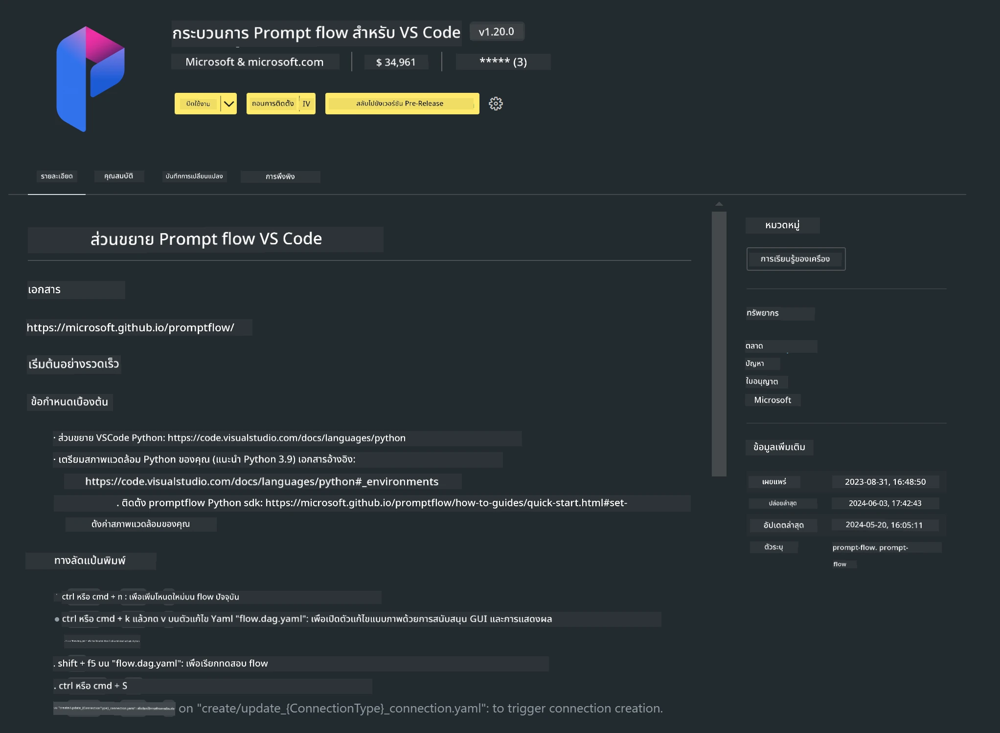

<!--
CO_OP_TRANSLATOR_METADATA:
{
  "original_hash": "a4ef39027902e82f2c33d568d2a2259a",
  "translation_date": "2025-07-17T03:50:41+00:00",
  "source_file": "md/02.Application/02.Code/Phi3/VSCodeExt/HOL/AIPC/01.Installations.md",
  "language_code": "th"
}
-->
# **Lab 0 - การติดตั้ง**

เมื่อเราเข้าสู่ห้องปฏิบัติการ เราจำเป็นต้องตั้งค่าสภาพแวดล้อมที่เกี่ยวข้องดังนี้:


### **1. Python 3.11 ขึ้นไป**

แนะนำให้ใช้ miniforge ในการตั้งค่าสภาพแวดล้อม Python ของคุณ

สำหรับการตั้งค่า miniforge กรุณาดูที่ [https://github.com/conda-forge/miniforge](https://github.com/conda-forge/miniforge)

หลังจากตั้งค่า miniforge แล้ว ให้รันคำสั่งต่อไปนี้ใน Power Shell

```bash

conda create -n pyenv python==3.11.8 -y

conda activate pyenv

```


### **2. ติดตั้ง Prompt flow SDK**

ใน Lab 1 เราจะใช้ Prompt flow ดังนั้นคุณต้องตั้งค่า Prompt flow SDK

```bash

pip install promptflow --upgrade

```

คุณสามารถตรวจสอบ promptflow sdk ด้วยคำสั่งนี้


```bash

pf --version

```

### **3. ติดตั้งส่วนขยาย Prompt flow สำหรับ Visual Studio Code**




### **4. Intel NPU Acceleration Library**

โปรเซสเซอร์รุ่นใหม่ของ Intel รองรับ NPU หากคุณต้องการใช้ NPU เพื่อรัน LLMs / SLMs ในเครื่อง คุณสามารถใช้ ***Intel NPU Acceleration Library*** หากต้องการข้อมูลเพิ่มเติม สามารถอ่านได้ที่ [https://github.com/microsoft/PhiCookBook/blob/main/md/01.Introduction/03/AIPC_Inference.md](https://github.com/microsoft/PhiCookBook/blob/main/md/01.Introduction/03/AIPC_Inference.md)

ติดตั้ง Intel NPU Acceleration Library ใน bash


```bash

pip install intel-npu-acceleration-library

```

***Note***: โปรดทราบว่าห้องสมุดนี้รองรับ transformers ***4.40.2*** กรุณายืนยันเวอร์ชันให้ถูกต้อง


### **5. ไลบรารี Python อื่นๆ**


สร้างไฟล์ requirements.txt และเพิ่มเนื้อหานี้ลงไป

```txt

notebook
numpy 
scipy 
scikit-learn 
matplotlib 
pandas 
pillow 
graphviz

```


### **6. ติดตั้ง NVM**

ติดตั้ง nvm ใน Powershell


```bash

winget install -e --id CoreyButler.NVMforWindows

```

ติดตั้ง nodejs 18.20


```bash

nvm install 18.20.0

nvm use 18.20.0

```

### **7. ติดตั้งส่วนเสริมสำหรับการพัฒนา Visual Studio Code**


```bash

npm install --global yo generator-code

```

ยินดีด้วย! คุณตั้งค่า SDK เรียบร้อยแล้ว ต่อไปให้ดำเนินการตามขั้นตอนปฏิบัติจริง

**ข้อจำกัดความรับผิดชอบ**:  
เอกสารนี้ได้รับการแปลโดยใช้บริการแปลภาษาอัตโนมัติ [Co-op Translator](https://github.com/Azure/co-op-translator) แม้เราจะพยายามให้ความถูกต้องสูงสุด แต่โปรดทราบว่าการแปลอัตโนมัติอาจมีข้อผิดพลาดหรือความไม่ถูกต้อง เอกสารต้นฉบับในภาษาต้นทางถือเป็นแหล่งข้อมูลที่เชื่อถือได้ สำหรับข้อมูลที่สำคัญ ขอแนะนำให้ใช้บริการแปลโดยผู้เชี่ยวชาญมนุษย์ เราไม่รับผิดชอบต่อความเข้าใจผิดหรือการตีความผิดใด ๆ ที่เกิดจากการใช้การแปลนี้