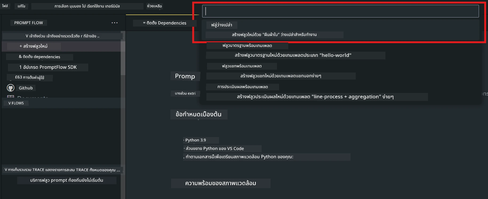
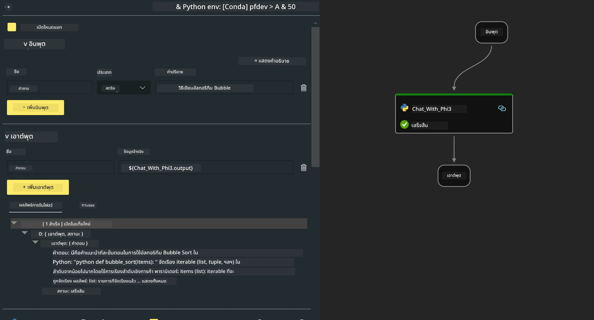
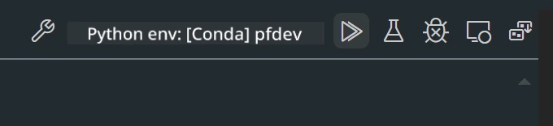

# **Lab 2 - รัน Prompt flow กับ Phi-3-mini ใน AIPC**

## **Prompt flow คืออะไร**

Prompt flow คือชุดเครื่องมือสำหรับนักพัฒนาที่ออกแบบมาเพื่อช่วยให้กระบวนการพัฒนาแอปพลิเคชัน AI ที่ใช้ LLM ตั้งแต่การคิดไอเดีย การสร้างต้นแบบ การทดสอบ การประเมินผล จนถึงการนำไปใช้งานจริงและการติดตามผล เป็นไปอย่างราบรื่นและง่ายขึ้น ช่วยให้การออกแบบ prompt เป็นเรื่องง่ายและสามารถสร้างแอป LLM ที่มีคุณภาพสำหรับการใช้งานจริงได้

ด้วย prompt flow คุณจะสามารถ:

- สร้าง flow ที่เชื่อมต่อ LLM, prompt, โค้ด Python และเครื่องมืออื่นๆ เข้าด้วยกันในรูปแบบ workflow ที่สามารถรันได้

- ดีบักและปรับปรุง flow ของคุณ โดยเฉพาะการโต้ตอบกับ LLM ได้อย่างง่ายดาย

- ประเมินผล flow ของคุณ คำนวณคุณภาพและประสิทธิภาพด้วยชุดข้อมูลขนาดใหญ่

- รวมการทดสอบและประเมินผลเข้ากับระบบ CI/CD เพื่อรับประกันคุณภาพของ flow

- นำ flow ไปใช้งานบนแพลตฟอร์มที่คุณเลือก หรือผนวกเข้ากับโค้ดของแอปได้อย่างง่ายดาย

- (ไม่บังคับแต่แนะนำอย่างยิ่ง) ร่วมมือกับทีมของคุณโดยใช้เวอร์ชันคลาวด์ของ Prompt flow บน Azure AI

## **AIPC คืออะไร**

AI PC ประกอบด้วย CPU, GPU และ NPU ซึ่งแต่ละตัวมีความสามารถเร่งการประมวลผล AI ที่แตกต่างกัน NPU หรือ neural processing unit คืออุปกรณ์เร่งความเร็วเฉพาะทางที่จัดการงานปัญญาประดิษฐ์ (AI) และการเรียนรู้ของเครื่อง (ML) บนเครื่อง PC ของคุณโดยตรง แทนที่จะส่งข้อมูลไปประมวลผลบนคลาวด์ GPU และ CPU ก็สามารถประมวลผลงานเหล่านี้ได้เช่นกัน แต่ NPU จะโดดเด่นในเรื่องการคำนวณ AI ที่ใช้พลังงานต่ำ AI PC เป็นการเปลี่ยนแปลงครั้งสำคัญในวิธีการทำงานของคอมพิวเตอร์เรา ไม่ใช่แค่การแก้ปัญหาที่เคยมีอยู่ แต่เป็นการพัฒนาครั้งใหญ่สำหรับการใช้งาน PC ในชีวิตประจำวัน

แล้วมันทำงานอย่างไร? เมื่อเทียบกับ AI สร้างสรรค์และโมเดลภาษาใหญ่ (LLMs) ที่ถูกฝึกด้วยข้อมูลสาธารณะจำนวนมาก AI ที่ทำงานบน PC ของคุณจะเข้าถึงได้ง่ายกว่าในทุกระดับ แนวคิดนี้เข้าใจง่ายกว่า และเพราะมันถูกฝึกด้วยข้อมูลของคุณเองโดยไม่ต้องเชื่อมต่อคลาวด์ จึงมีประโยชน์ที่น่าสนใจและเข้าถึงได้กับผู้ใช้ทั่วไปมากขึ้น

ในระยะสั้น โลกของ AI PC จะเกี่ยวข้องกับผู้ช่วยส่วนตัวและโมเดล AI ขนาดเล็กที่รันบน PC ของคุณโดยตรง ใช้ข้อมูลของคุณเพื่อมอบประสบการณ์ AI ที่เป็นส่วนตัว ปลอดภัย และเป็นส่วนตัวมากขึ้นสำหรับงานที่คุณทำทุกวัน เช่น การจดบันทึกการประชุม การจัดการลีกฟุตบอลแฟนตาซี การปรับแต่งภาพและวิดีโออัตโนมัติ หรือการวางแผนการเดินทางสำหรับงานรวมญาติโดยอิงจากเวลามาถึงและออกของทุกคน

## **การสร้าง generation code flows บน AIPC**

***Note*** ：หากคุณยังไม่ได้ติดตั้งสภาพแวดล้อม กรุณาเยี่ยมชม [Lab 0 -Installations](./01.Installations.md)

1. เปิด Prompt flow Extension ใน Visual Studio Code และสร้างโปรเจกต์ flow เปล่า



2. เพิ่มพารามิเตอร์ Inputs และ Outputs และเพิ่ม Python Code เป็น flow ใหม่



คุณสามารถอ้างอิงโครงสร้างนี้ (flow.dag.yaml) เพื่อสร้าง flow ของคุณ

```yaml

inputs:
  question:
    type: string
    default: how to write Bubble Algorithm
outputs:
  answer:
    type: string
    reference: ${Chat_With_Phi3.output}
nodes:
- name: Chat_With_Phi3
  type: python
  source:
    type: code
    path: Chat_With_Phi3.py
  inputs:
    question: ${inputs.question}


```

3. เพิ่มโค้ดใน ***Chat_With_Phi3.py***

```python


from promptflow.core import tool

# import torch
from transformers import AutoTokenizer, pipeline,TextStreamer
import intel_npu_acceleration_library as npu_lib

import warnings

import asyncio
import platform

class Phi3CodeAgent:
    
    model = None
    tokenizer = None
    text_streamer = None
    
    model_id = "microsoft/Phi-3-mini-4k-instruct"

    @staticmethod
    def init_phi3():
        
        if Phi3CodeAgent.model is None or Phi3CodeAgent.tokenizer is None or Phi3CodeAgent.text_streamer is None:
            Phi3CodeAgent.model = npu_lib.NPUModelForCausalLM.from_pretrained(
                                    Phi3CodeAgent.model_id,
                                    torch_dtype="auto",
                                    dtype=npu_lib.int4,
                                    trust_remote_code=True
                                )
            Phi3CodeAgent.tokenizer = AutoTokenizer.from_pretrained(Phi3CodeAgent.model_id)
            Phi3CodeAgent.text_streamer = TextStreamer(Phi3CodeAgent.tokenizer, skip_prompt=True)

    

    @staticmethod
    def chat_with_phi3(prompt):
        
        Phi3CodeAgent.init_phi3()

        messages = "<|system|>You are a AI Python coding assistant. Please help me to generate code in Python.The answer only genertated Python code, but any comments and instructions do not need to be generated<|end|><|user|>" + prompt +"<|end|><|assistant|>"


        generation_args = {
            "max_new_tokens": 1024,
            "return_full_text": False,
            "temperature": 0.3,
            "do_sample": False,
            "streamer": Phi3CodeAgent.text_streamer,
        }

        pipe = pipeline(
            "text-generation",
            model=Phi3CodeAgent.model,
            tokenizer=Phi3CodeAgent.tokenizer,
            # **generation_args
        )

        result = ''

        with warnings.catch_warnings():
            warnings.simplefilter("ignore")
            response = pipe(messages, **generation_args)
            result =response[0]['generated_text']
            return result


@tool
def my_python_tool(question: str) -> str:
    if platform.system() == 'Windows':
        asyncio.set_event_loop_policy(asyncio.WindowsSelectorEventLoopPolicy())
    return Phi3CodeAgent.chat_with_phi3(question)


```

4. คุณสามารถทดสอบ flow จาก Debug หรือ Run เพื่อตรวจสอบว่าโค้ด generation ทำงานถูกต้องหรือไม่



5. รัน flow เป็น development API ใน terminal

```

pf flow serve --source ./ --port 8080 --host localhost   

```

คุณสามารถทดสอบได้ใน Postman / Thunder Client

### **Note**

1. การรันครั้งแรกจะใช้เวลานาน แนะนำให้ดาวน์โหลดโมเดล phi-3 จาก Hugging face CLI

2. เนื่องจากพลังประมวลผลของ Intel NPU มีจำกัด แนะนำให้ใช้ Phi-3-mini-4k-instruct

3. เราใช้ Intel NPU Acceleration ในการแปลง quantize เป็น INT4 แต่ถ้าคุณรันบริการซ้ำ ต้องลบโฟลเดอร์ cache และ nc_workshop ออก

## **แหล่งข้อมูล**

1. เรียนรู้ Promptflow [https://microsoft.github.io/promptflow/](https://microsoft.github.io/promptflow/)

2. เรียนรู้ Intel NPU Acceleration [https://github.com/intel/intel-npu-acceleration-library](https://github.com/intel/intel-npu-acceleration-library)

3. ตัวอย่างโค้ด ดาวน์โหลด [Local NPU Agent Sample Code](../../../../../../../../../code/07.Lab/01/AIPC)

**ข้อจำกัดความรับผิดชอบ**:  
เอกสารนี้ได้รับการแปลโดยใช้บริการแปลภาษาอัตโนมัติ [Co-op Translator](https://github.com/Azure/co-op-translator) แม้เราจะพยายามให้ความถูกต้องสูงสุด แต่โปรดทราบว่าการแปลอัตโนมัติอาจมีข้อผิดพลาดหรือความไม่ถูกต้อง เอกสารต้นฉบับในภาษาต้นทางถือเป็นแหล่งข้อมูลที่เชื่อถือได้ สำหรับข้อมูลที่สำคัญ ขอแนะนำให้ใช้บริการแปลโดยผู้เชี่ยวชาญมนุษย์ เราไม่รับผิดชอบต่อความเข้าใจผิดหรือการตีความผิดใด ๆ ที่เกิดจากการใช้การแปลนี้