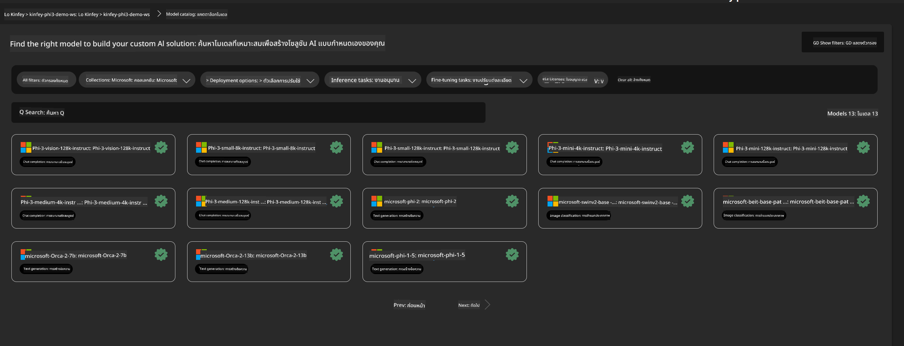
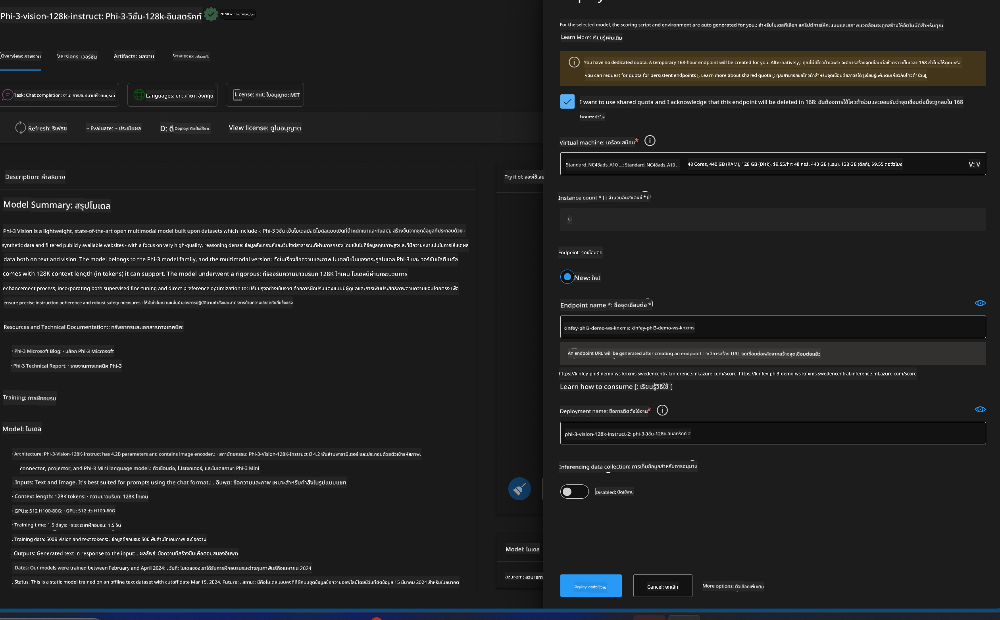
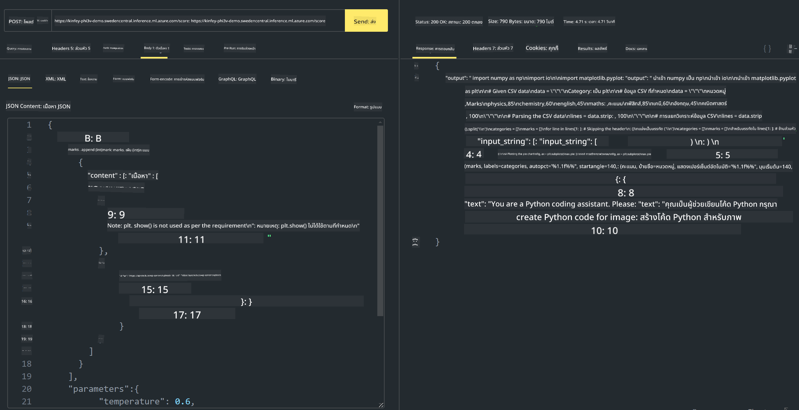

<!--
CO_OP_TRANSLATOR_METADATA:
{
  "original_hash": "20cb4e6ac1686248e8be913ccf6c2bc2",
  "translation_date": "2025-05-09T19:28:20+00:00",
  "source_file": "md/02.Application/02.Code/Phi3/VSCodeExt/HOL/AIPC/03.DeployPhi3VisionOnAzure.md",
  "language_code": "th"
}
-->
# **Lab 3 - ติดตั้ง Phi-3-vision บน Azure Machine Learning Service**

เราใช้ NPU ในการทำการติดตั้งโค้ดในสภาพแวดล้อมจริง จากนั้นเราต้องการเพิ่มความสามารถในการใช้ PHI-3-VISION เพื่อแปลงภาพเป็นโค้ด

ในการแนะนำนี้ เราจะสร้างบริการ Model As Service Phi-3 Vision บน Azure Machine Learning Service ได้อย่างรวดเร็ว

***Note***： Phi-3 Vision ต้องการกำลังประมวลผลสูงเพื่อสร้างเนื้อหาได้เร็วขึ้น เราจึงต้องใช้พลังประมวลผลบนคลาวด์ช่วย


### **1. สร้าง Azure Machine Learning Service**

เราต้องสร้าง Azure Machine Learning Service ใน Azure Portal หากต้องการเรียนรู้วิธีทำ กรุณาเยี่ยมชมลิงก์นี้ [https://learn.microsoft.com/azure/machine-learning/quickstart-create-resources?view=azureml-api-2](https://learn.microsoft.com/azure/machine-learning/quickstart-create-resources?view=azureml-api-2)


### **2. เลือก Phi-3 Vision ใน Azure Machine Learning Service**




### **3. ติดตั้ง Phi-3-Vision บน Azure**





### **4. ทดสอบ Endpoint ใน Postman**





***Note***

1. พารามิเตอร์ที่ส่งต้องมี Authorization, azureml-model-deployment และ Content-Type คุณต้องตรวจสอบข้อมูลการติดตั้งเพื่อรับข้อมูลเหล่านี้

2. ในการส่งพารามิเตอร์ Phi-3-Vision ต้องส่งลิงก์ภาพ โปรดดูวิธีการส่งพารามิเตอร์แบบ GPT-4-Vision เช่น

```json

{
  "input_data":{
    "input_string":[
      {
        "role":"user",
        "content":[ 
          {
            "type": "text",
            "text": "You are a Python coding assistant.Please create Python code for image "
          },
          {
              "type": "image_url",
              "image_url": {
                "url": "https://ajaytech.co/wp-content/uploads/2019/09/index.png"
              }
          }
        ]
      }
    ],
    "parameters":{
          "temperature": 0.6,
          "top_p": 0.9,
          "do_sample": false,
          "max_new_tokens": 2048
    }
  }
}

```

3. เรียกใช้ **/score** ด้วยวิธี Post

**ยินดีด้วย**! คุณได้ติดตั้ง PHI-3-VISION อย่างรวดเร็วและลองใช้การแปลงภาพเป็นโค้ดแล้ว ขั้นตอนต่อไปเราสามารถสร้างแอปพลิเคชันโดยผสมผสานกับ NPU และคลาวด์ได้

**ข้อจำกัดความรับผิดชอบ**:  
เอกสารฉบับนี้ได้รับการแปลโดยใช้บริการแปลภาษาอัตโนมัติ [Co-op Translator](https://github.com/Azure/co-op-translator) แม้เราจะพยายามให้มีความถูกต้องสูงสุด แต่โปรดทราบว่าการแปลโดยอัตโนมัติอาจมีข้อผิดพลาดหรือความคลาดเคลื่อน เอกสารต้นฉบับในภาษาต้นทางถือเป็นแหล่งข้อมูลที่เชื่อถือได้ สำหรับข้อมูลที่มีความสำคัญ ควรใช้บริการแปลโดยผู้เชี่ยวชาญมนุษย์ เราจะไม่รับผิดชอบต่อความเข้าใจผิดหรือการตีความผิดใด ๆ ที่เกิดขึ้นจากการใช้การแปลนี้