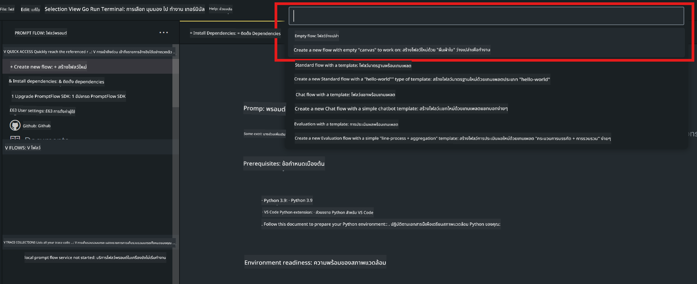
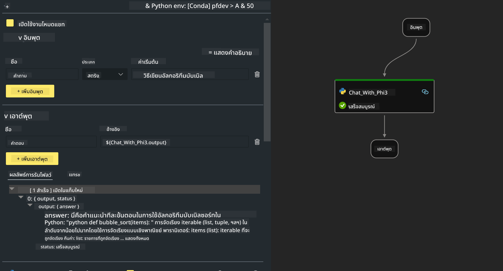

<!--
CO_OP_TRANSLATOR_METADATA:
{
  "original_hash": "3dbbf568625b1ee04b354c2dc81d3248",
  "translation_date": "2025-07-17T04:26:18+00:00",
  "source_file": "md/02.Application/02.Code/Phi3/VSCodeExt/HOL/Apple/02.PromptflowWithMLX.md",
  "language_code": "th"
}
-->
# **Lab 2 -  รัน Prompt flow กับ Phi-3-mini ใน AIPC**

## **Prompt flow คืออะไร**

Prompt flow คือชุดเครื่องมือสำหรับนักพัฒนาที่ออกแบบมาเพื่อช่วยให้กระบวนการพัฒนาแอปพลิเคชัน AI ที่ใช้ LLM ตั้งแต่การคิดไอเดีย การสร้างต้นแบบ การทดสอบ การประเมินผล จนถึงการนำไปใช้งานจริงและการติดตามผล เป็นไปอย่างราบรื่นและง่ายดาย ช่วยให้การออกแบบ prompt เป็นเรื่องง่ายขึ้นและช่วยให้คุณสร้างแอป LLM ที่มีคุณภาพสำหรับการใช้งานจริงได้

ด้วย prompt flow คุณจะสามารถ:

- สร้าง flow ที่เชื่อมต่อ LLM, prompt, โค้ด Python และเครื่องมืออื่นๆ เข้าด้วยกันในรูปแบบ workflow ที่สามารถรันได้

- ดีบักและปรับปรุง flow ของคุณ โดยเฉพาะการโต้ตอบกับ LLM ได้อย่างง่ายดาย

- ประเมินผล flow ของคุณ คำนวณคุณภาพและประสิทธิภาพด้วยชุดข้อมูลขนาดใหญ่

- รวมการทดสอบและการประเมินผลเข้ากับระบบ CI/CD ของคุณเพื่อรับประกันคุณภาพของ flow

- นำ flow ของคุณไปใช้งานบนแพลตฟอร์มที่คุณเลือก หรือนำไปผนวกกับโค้ดของแอปได้อย่างง่ายดาย

- (ไม่บังคับแต่แนะนำอย่างยิ่ง) ร่วมมือกับทีมของคุณโดยใช้เวอร์ชันคลาวด์ของ Prompt flow บน Azure AI


## **การสร้าง generation code flows บน Apple Silicon**

***Note*** ：หากคุณยังไม่ได้ติดตั้งสภาพแวดล้อม กรุณาไปที่ [Lab 0 -Installations](./01.Installations.md)

1. เปิด Prompt flow Extension ใน Visual Studio Code และสร้างโปรเจกต์ flow เปล่า



2. เพิ่มพารามิเตอร์ Inputs และ Outputs และเพิ่ม Python Code เป็น flow ใหม่




คุณสามารถอ้างอิงโครงสร้างนี้ (flow.dag.yaml) เพื่อสร้าง flow ของคุณ

```yaml

inputs:
  prompt:
    type: string
    default: Write python code for Fibonacci serie. Please use markdown as output
outputs:
  result:
    type: string
    reference: ${gen_code_by_phi3.output}
nodes:
- name: gen_code_by_phi3
  type: python
  source:
    type: code
    path: gen_code_by_phi3.py
  inputs:
    prompt: ${inputs.prompt}


```

3. การทำ Quantify phi-3-mini

เราต้องการให้การรัน SLM บนอุปกรณ์ท้องถิ่นมีประสิทธิภาพมากขึ้น โดยทั่วไปเราจะทำการ quantify โมเดล (INT4, FP16, FP32)


```bash

python -m mlx_lm.convert --hf-path microsoft/Phi-3-mini-4k-instruct

```

**Note:** โฟลเดอร์เริ่มต้นคือ mlx_model 

4. เพิ่มโค้ดใน ***Chat_With_Phi3.py***


```python


from promptflow import tool

from mlx_lm import load, generate


# The inputs section will change based on the arguments of the tool function, after you save the code
# Adding type to arguments and return value will help the system show the types properly
# Please update the function name/signature per need
@tool
def my_python_tool(prompt: str) -> str:

    model_id = './mlx_model_phi3_mini'

    model, tokenizer = load(model_id)

    # <|user|>\nWrite python code for Fibonacci serie. Please use markdown as output<|end|>\n<|assistant|>

    response = generate(model, tokenizer, prompt="<|user|>\n" + prompt  + "<|end|>\n<|assistant|>", max_tokens=2048, verbose=True)

    return response


```

4. คุณสามารถทดสอบ flow ได้จาก Debug หรือ Run เพื่อตรวจสอบว่าโค้ด generation ทำงานถูกต้องหรือไม่


5. รัน flow เป็น development API ใน terminal

```

pf flow serve --source ./ --port 8080 --host localhost   

```

คุณสามารถทดสอบได้ใน Postman / Thunder Client


### **Note**

1. การรันครั้งแรกจะใช้เวลานาน แนะนำให้ดาวน์โหลดโมเดล phi-3 จาก Hugging face CLI

2. เนื่องจากข้อจำกัดด้านพลังประมวลผลของ Intel NPU แนะนำให้ใช้ Phi-3-mini-4k-instruct

3. เราใช้ Intel NPU Acceleration ในการแปลง quantify เป็น INT4 แต่ถ้าคุณรันบริการซ้ำ คุณต้องลบโฟลเดอร์ cache และ nc_workshop ออก


## **แหล่งข้อมูล**

1. เรียนรู้ Promptflow [https://microsoft.github.io/promptflow/](https://microsoft.github.io/promptflow/)

2. เรียนรู้ Intel NPU Acceleration [https://github.com/intel/intel-npu-acceleration-library](https://github.com/intel/intel-npu-acceleration-library)

3. ตัวอย่างโค้ด ดาวน์โหลด [Local NPU Agent Sample Code](../../../../../../../../../code/07.Lab/01/AIPC/local-npu-agent)

**ข้อจำกัดความรับผิดชอบ**:  
เอกสารนี้ได้รับการแปลโดยใช้บริการแปลภาษาอัตโนมัติ [Co-op Translator](https://github.com/Azure/co-op-translator) แม้เราจะพยายามให้ความถูกต้องสูงสุด แต่โปรดทราบว่าการแปลอัตโนมัติอาจมีข้อผิดพลาดหรือความไม่ถูกต้อง เอกสารต้นฉบับในภาษาต้นทางถือเป็นแหล่งข้อมูลที่เชื่อถือได้ สำหรับข้อมูลที่สำคัญ ขอแนะนำให้ใช้บริการแปลโดยผู้เชี่ยวชาญมนุษย์ เราไม่รับผิดชอบต่อความเข้าใจผิดหรือการตีความผิดใด ๆ ที่เกิดจากการใช้การแปลนี้