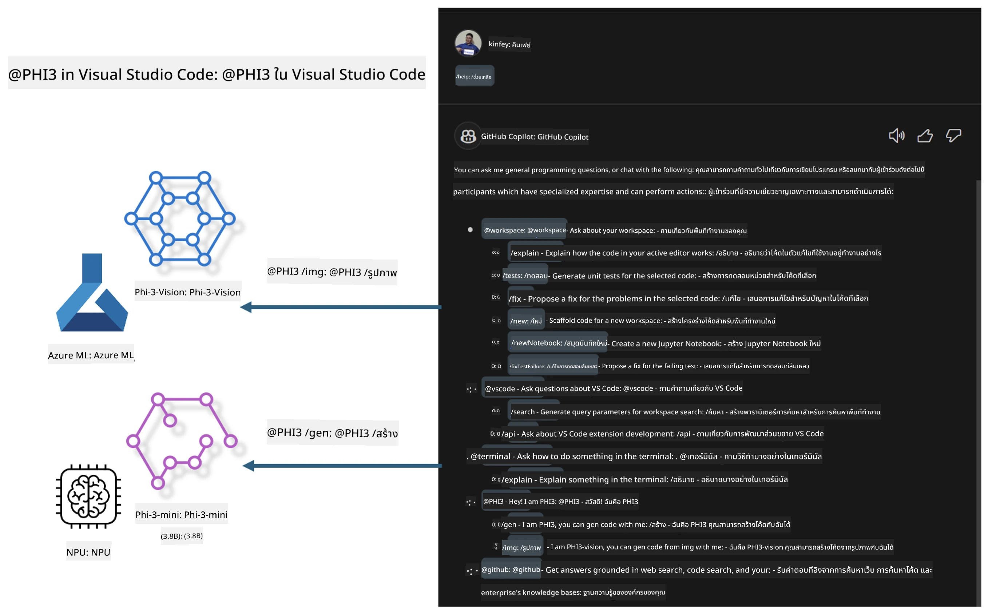

<!--
CO_OP_TRANSLATOR_METADATA:
{
  "original_hash": "00b7a699de8ac405fa821f4c0f7fc0ab",
  "translation_date": "2025-07-17T03:39:44+00:00",
  "source_file": "md/02.Application/02.Code/Phi3/VSCodeExt/README.md",
  "language_code": "th"
}
-->
# **สร้าง Visual Studio Code GitHub Copilot Chat ของคุณเองด้วย Microsoft Phi-3 Family**

คุณเคยใช้ workspace agent ใน GitHub Copilot Chat หรือไม่? คุณต้องการสร้างโค้ดเอเจนต์สำหรับทีมของคุณเองหรือเปล่า? ห้องปฏิบัติการนี้ตั้งใจจะรวมโมเดลโอเพนซอร์สเพื่อสร้างเอเจนต์โค้ดระดับองค์กร

## **พื้นฐาน**

### **ทำไมต้องเลือก Microsoft Phi-3**

Phi-3 เป็นซีรีส์ครอบครัว ประกอบด้วย phi-3-mini, phi-3-small และ phi-3-medium ซึ่งแตกต่างกันตามพารามิเตอร์การฝึกสำหรับการสร้างข้อความ การตอบสนองบทสนทนา และการสร้างโค้ด นอกจากนี้ยังมี phi-3-vision ที่อิงกับ Vision เหมาะสำหรับองค์กรหรือทีมต่างๆ ที่ต้องการสร้างโซลูชัน AI สร้างสรรค์แบบออฟไลน์

แนะนำให้อ่านที่ลิงก์นี้ [https://github.com/microsoft/PhiCookBook/blob/main/md/01.Introduction/01/01.PhiFamily.md](https://github.com/microsoft/PhiCookBook/blob/main/md/01.Introduction/01/01.PhiFamily.md)

### **Microsoft GitHub Copilot Chat**

ส่วนขยาย GitHub Copilot Chat มอบอินเทอร์เฟซแชทที่ช่วยให้คุณโต้ตอบกับ GitHub Copilot และรับคำตอบเกี่ยวกับคำถามโค้ดได้โดยตรงใน VS Code โดยไม่ต้องเปิดดูเอกสารหรือค้นหาในฟอรัมออนไลน์

Copilot Chat อาจใช้การเน้นไวยากรณ์ การเยื้องบรรทัด และฟีเจอร์จัดรูปแบบอื่นๆ เพื่อเพิ่มความชัดเจนให้กับคำตอบที่สร้างขึ้น ขึ้นอยู่กับประเภทคำถามจากผู้ใช้ ผลลัพธ์อาจมีลิงก์ไปยังบริบทที่ Copilot ใช้ในการสร้างคำตอบ เช่น ไฟล์ซอร์สโค้ดหรือเอกสาร หรือปุ่มสำหรับเข้าถึงฟังก์ชันของ VS Code

- Copilot Chat ผสานเข้ากับกระบวนการพัฒนาของคุณและช่วยเหลือในจุดที่คุณต้องการ:

- เริ่มแชทแบบอินไลน์ได้โดยตรงจากตัวแก้ไขหรือเทอร์มินัลเพื่อขอความช่วยเหลือขณะเขียนโค้ด

- ใช้มุมมอง Chat เพื่อมีผู้ช่วย AI อยู่ข้างๆ ช่วยคุณได้ตลอดเวลา

- เปิด Quick Chat เพื่อถามคำถามด่วนและกลับไปทำงานของคุณได้ทันที

คุณสามารถใช้ GitHub Copilot Chat ในสถานการณ์ต่างๆ เช่น:

- ตอบคำถามเกี่ยวกับโค้ดเพื่อหาวิธีแก้ปัญหาที่ดีที่สุด

- อธิบายโค้ดของผู้อื่นและแนะนำการปรับปรุง

- เสนอการแก้ไขโค้ด

- สร้างกรณีทดสอบหน่วย

- สร้างเอกสารโค้ด

แนะนำให้อ่านที่ลิงก์นี้ [https://code.visualstudio.com/docs/copilot/copilot-chat](https://code.visualstudio.com/docs/copilot/copilot-chat?WT.mc_id=aiml-137032-kinfeylo)

###  **Microsoft GitHub Copilot Chat @workspace**

การอ้างอิง **@workspace** ใน Copilot Chat ช่วยให้คุณถามคำถามเกี่ยวกับโค้ดทั้งหมดในโปรเจกต์ของคุณได้ โดย Copilot จะดึงไฟล์และสัญลักษณ์ที่เกี่ยวข้องมาใช้ในการตอบคำถามอย่างชาญฉลาด พร้อมแสดงลิงก์และตัวอย่างโค้ดประกอบคำตอบ

เพื่อให้ตอบคำถามได้ **@workspace** จะค้นหาจากแหล่งข้อมูลเดียวกับที่นักพัฒนาจะใช้เมื่อเรียกดูโค้ดใน VS Code:

- ไฟล์ทั้งหมดใน workspace ยกเว้นไฟล์ที่ถูกละเว้นโดย .gitignore

- โครงสร้างไดเรกทอรีพร้อมชื่อโฟลเดอร์และไฟล์ที่ซ้อนกัน

- ดัชนีการค้นหาโค้ดของ GitHub หาก workspace เป็นรีโพสิตอรี GitHub และถูกจัดทำดัชนีโดย code search

- สัญลักษณ์และคำจำกัดความใน workspace

- ข้อความที่เลือกอยู่ในขณะนั้นหรือข้อความที่มองเห็นในตัวแก้ไขที่ใช้งานอยู่

หมายเหตุ: .gitignore จะถูกละเว้นหากคุณเปิดไฟล์หรือเลือกข้อความภายในไฟล์ที่ถูกละเว้น

แนะนำให้อ่านที่ลิงก์นี้ [[https://code.visualstudio.com/docs/copilot/copilot-chat](https://code.visualstudio.com/docs/copilot/workspace-context?WT.mc_id=aiml-137032-kinfeylo)]

## **รู้จักห้องปฏิบัติการนี้เพิ่มเติม**

GitHub Copilot ช่วยเพิ่มประสิทธิภาพการเขียนโปรแกรมขององค์กรอย่างมาก และทุกองค์กรต่างต้องการปรับแต่งฟังก์ชันที่เกี่ยวข้องของ GitHub Copilot หลายองค์กรได้สร้าง Extensions ที่ปรับแต่งเองคล้ายกับ GitHub Copilot โดยอิงตามสถานการณ์ธุรกิจและโมเดลโอเพนซอร์สของตนเอง สำหรับองค์กร Extensions ที่ปรับแต่งเองจะควบคุมได้ง่ายกว่า แต่ก็ส่งผลต่อประสบการณ์ผู้ใช้เช่นกัน เพราะ GitHub Copilot มีฟังก์ชันที่แข็งแกร่งในการจัดการกับสถานการณ์ทั่วไปและความเป็นมืออาชีพ หากสามารถรักษาประสบการณ์ให้สอดคล้องกันได้ จะดีกว่าที่จะปรับแต่ง Extension ขององค์กรเอง GitHub Copilot Chat มี API ที่เกี่ยวข้องสำหรับให้องค์กรขยายประสบการณ์แชท การรักษาประสบการณ์ที่สอดคล้องและมีฟังก์ชันที่ปรับแต่งเองจึงเป็นประสบการณ์ผู้ใช้ที่ดีกว่า

ห้องปฏิบัติการนี้ใช้โมเดล Phi-3 ร่วมกับ NPU ในเครื่องและ Azure แบบไฮบริด เพื่อสร้างเอเจนต์ที่กำหนดเองใน GitHub Copilot Chat ***@PHI3*** เพื่อช่วยนักพัฒนาองค์กรในการสร้างโค้ด***(@PHI3 /gen)*** และสร้างโค้ดจากภาพ ***(@PHI3 /img)*** 

### ***หมายเหตุ:*** 

ห้องปฏิบัติการนี้ดำเนินการบน AIPC ของ Intel CPU และ Apple Silicon ในปัจจุบัน และจะอัปเดตเวอร์ชัน Qualcomm ของ NPU ต่อไป

## **ห้องปฏิบัติการ**

| ชื่อ | คำอธิบาย | AIPC | Apple |
| ------------ | ----------- | -------- |-------- |
| Lab0 - การติดตั้ง(✅) | กำหนดค่าและติดตั้งสภาพแวดล้อมและเครื่องมือติดตั้งที่เกี่ยวข้อง | [Go](./HOL/AIPC/01.Installations.md) |[Go](./HOL/Apple/01.Installations.md) |
| Lab1 - รัน Prompt flow กับ Phi-3-mini (✅) | ร่วมกับ AIPC / Apple Silicon ใช้ NPU ในเครื่องสร้างการสร้างโค้ดผ่าน Phi-3-mini | [Go](./HOL/AIPC/02.PromptflowWithNPU.md) |  [Go](./HOL/Apple/02.PromptflowWithMLX.md) |
| Lab2 - ติดตั้ง Phi-3-vision บน Azure Machine Learning Service(✅) | สร้างโค้ดโดยการติดตั้ง Model Catalog ของ Azure Machine Learning Service - Phi-3-vision image | [Go](./HOL/AIPC/03.DeployPhi3VisionOnAzure.md) |[Go](./HOL/Apple/03.DeployPhi3VisionOnAzure.md) |
| Lab3 - สร้างเอเจนต์ @phi-3 ใน GitHub Copilot Chat(✅)  | สร้างเอเจนต์ Phi-3 ที่กำหนดเองใน GitHub Copilot Chat เพื่อสร้างโค้ด สร้างโค้ดกราฟ RAG ฯลฯ | [Go](./HOL/AIPC/04.CreatePhi3AgentInVSCode.md) | [Go](./HOL/Apple/04.CreatePhi3AgentInVSCode.md) |
| ตัวอย่างโค้ด (✅)  | ดาวน์โหลดตัวอย่างโค้ด | [Go](../../../../../../../code/07.Lab/01/AIPC) | [Go](../../../../../../../code/07.Lab/01/Apple) |

## **แหล่งข้อมูล**

1. Phi-3 Cookbook [https://github.com/microsoft/Phi-3CookBook](https://github.com/microsoft/Phi-3CookBook)

2. เรียนรู้เพิ่มเติมเกี่ยวกับ GitHub Copilot [https://learn.microsoft.com/training/paths/copilot/](https://learn.microsoft.com/training/paths/copilot/?WT.mc_id=aiml-137032-kinfeylo)

3. เรียนรู้เพิ่มเติมเกี่ยวกับ GitHub Copilot Chat [https://learn.microsoft.com/training/paths/accelerate-app-development-using-github-copilot/](https://learn.microsoft.com/training/paths/accelerate-app-development-using-github-copilot/?WT.mc_id=aiml-137032-kinfeylo)

4. เรียนรู้เพิ่มเติมเกี่ยวกับ GitHub Copilot Chat API [https://code.visualstudio.com/api/extension-guides/chat](https://code.visualstudio.com/api/extension-guides/chat?WT.mc_id=aiml-137032-kinfeylo)

5. เรียนรู้เพิ่มเติมเกี่ยวกับ Azure AI Foundry [https://learn.microsoft.com/training/paths/create-custom-copilots-ai-studio/](https://learn.microsoft.com/training/paths/create-custom-copilots-ai-studio/?WT.mc_id=aiml-137032-kinfeylo)

6. เรียนรู้เพิ่มเติมเกี่ยวกับ Model Catalog ของ Azure AI Foundry [https://learn.microsoft.com/azure/ai-studio/how-to/model-catalog-overview](https://learn.microsoft.com/azure/ai-studio/how-to/model-catalog-overview)

**ข้อจำกัดความรับผิดชอบ**:  
เอกสารนี้ได้รับการแปลโดยใช้บริการแปลภาษาอัตโนมัติ [Co-op Translator](https://github.com/Azure/co-op-translator) แม้เราจะพยายามให้ความถูกต้องสูงสุด แต่โปรดทราบว่าการแปลอัตโนมัติอาจมีข้อผิดพลาดหรือความไม่ถูกต้อง เอกสารต้นฉบับในภาษาต้นทางถือเป็นแหล่งข้อมูลที่เชื่อถือได้ สำหรับข้อมูลที่สำคัญ ขอแนะนำให้ใช้บริการแปลโดยผู้เชี่ยวชาญมนุษย์ เราไม่รับผิดชอบต่อความเข้าใจผิดหรือการตีความผิดใด ๆ ที่เกิดจากการใช้การแปลนี้