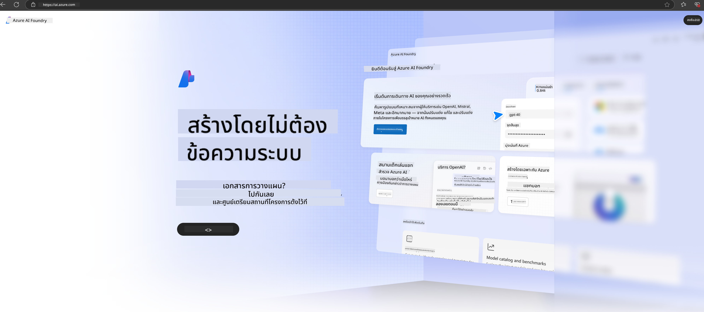

<!--
CO_OP_TRANSLATOR_METADATA:
{
  "original_hash": "3a1e48b628022485aac989c9f733e792",
  "translation_date": "2025-07-17T05:24:04+00:00",
  "source_file": "md/02.QuickStart/AzureAIFoundry_QuickStart.md",
  "language_code": "th"
}
-->
# **การใช้ Phi-3 ใน Azure AI Foundry**

ด้วยการพัฒนา Generative AI เราหวังว่าจะใช้แพลตฟอร์มเดียวกันในการจัดการ LLM และ SLM ต่างๆ การรวมข้อมูลขององค์กร การปรับแต่ง/Fine-tuning หรือ RAG และการประเมินผลธุรกิจองค์กรหลังจากการรวม LLM และ SLM เพื่อให้แอปพลิเคชัน AI สร้างสรรค์สามารถนำไปใช้ได้อย่างชาญฉลาดมากขึ้น [Azure AI Foundry](https://ai.azure.com) คือแพลตฟอร์มแอปพลิเคชัน Generative AI ระดับองค์กร

ด้วย Azure AI Foundry คุณสามารถประเมินผลการตอบสนองของโมเดลภาษาใหญ่ (LLM) และจัดการส่วนประกอบของแอปพลิเคชัน prompt ด้วย prompt flow เพื่อประสิทธิภาพที่ดียิ่งขึ้น แพลตฟอร์มนี้ช่วยให้สามารถขยายขนาดได้ง่ายสำหรับการเปลี่ยนแนวคิดต้นแบบเป็นระบบผลิตจริง พร้อมทั้งสนับสนุนการตรวจสอบและปรับปรุงอย่างต่อเนื่องเพื่อความสำเร็จในระยะยาว

เราสามารถติดตั้งโมเดล Phi-3 บน Azure AI Foundry ได้อย่างรวดเร็วผ่านขั้นตอนง่ายๆ จากนั้นใช้ Azure AI Foundry ในการทำงานที่เกี่ยวข้องกับ Phi-3 เช่น Playground/Chat, Fine-tuning, การประเมินผล และงานอื่นๆ

## **1. การเตรียมตัว**

หากคุณติดตั้ง [Azure Developer CLI](https://learn.microsoft.com/azure/developer/azure-developer-cli/overview?WT.mc_id=aiml-138114-kinfeylo) ไว้แล้วบนเครื่อง การใช้เทมเพลตนี้ก็ง่ายเพียงแค่รันคำสั่งนี้ในไดเรกทอรีใหม่

## การสร้างด้วยตนเอง

การสร้างโปรเจกต์และฮับใน Microsoft Azure AI Foundry เป็นวิธีที่ดีในการจัดระเบียบและจัดการงาน AI ของคุณ นี่คือคำแนะนำทีละขั้นตอนเพื่อเริ่มต้น:

### การสร้างโปรเจกต์ใน Azure AI Foundry

1. **ไปที่ Azure AI Foundry**: ลงชื่อเข้าใช้พอร์ทัล Azure AI Foundry
2. **สร้างโปรเจกต์**:
   - หากคุณอยู่ในโปรเจกต์ ให้เลือก "Azure AI Foundry" ที่มุมบนซ้ายของหน้าเพื่อกลับไปยังหน้าโฮม
   - เลือก "+ Create project"
   - กรอกชื่อโปรเจกต์
   - หากคุณมีฮับ ระบบจะเลือกฮับนั้นโดยอัตโนมัติ หากคุณมีสิทธิ์เข้าถึงฮับมากกว่าหนึ่งฮับ คุณสามารถเลือกฮับอื่นจากเมนูดรอปดาวน์ได้ หากต้องการสร้างฮับใหม่ ให้เลือก "Create new hub" และกรอกชื่อ
   - เลือก "Create"

### การสร้างฮับใน Azure AI Foundry

1. **ไปที่ Azure AI Foundry**: ลงชื่อเข้าใช้ด้วยบัญชี Azure ของคุณ
2. **สร้างฮับ**:
   - เลือกศูนย์จัดการ (Management center) จากเมนูด้านซ้าย
   - เลือก "All resources" จากนั้นคลิกลูกศรลงข้าง "+ New project" และเลือก "+ New hub"
   - ในกล่องโต้ตอบ "Create a new hub" ให้กรอกชื่อฮับของคุณ (เช่น contoso-hub) และปรับแต่งฟิลด์อื่นๆ ตามต้องการ
   - เลือก "Next" ตรวจสอบข้อมูล แล้วเลือก "Create"

สำหรับคำแนะนำที่ละเอียดขึ้น คุณสามารถดูได้จากเอกสารทางการของ [Microsoft](https://learn.microsoft.com/azure/ai-studio/how-to/create-projects)

หลังจากสร้างสำเร็จ คุณสามารถเข้าใช้งานสตูดิโอที่สร้างผ่าน [ai.azure.com](https://ai.azure.com/)

ใน AI Foundry สามารถมีโปรเจกต์ได้หลายโปรเจกต์ สร้างโปรเจกต์ใน AI Foundry เพื่อเตรียมพร้อม

สร้าง Azure AI Foundry [QuickStarts](https://learn.microsoft.com/azure/ai-studio/quickstarts/get-started-code)

## **2. การติดตั้งโมเดล Phi ใน Azure AI Foundry**

คลิกตัวเลือก Explore ของโปรเจกต์เพื่อเข้าสู่ Model Catalog และเลือก Phi-3

เลือก Phi-3-mini-4k-instruct

คลิก 'Deploy' เพื่อติดตั้งโมเดล Phi-3-mini-4k-instruct

> [!NOTE]
>
> คุณสามารถเลือกกำลังประมวลผลเมื่อทำการติดตั้ง

## **3. Playground Chat Phi ใน Azure AI Foundry**

ไปที่หน้าการติดตั้ง เลือก Playground และสนทนากับ Phi-3 ของ Azure AI Foundry

## **4. การติดตั้งโมเดลจาก Azure AI Foundry**

ในการติดตั้งโมเดลจาก Azure Model Catalog คุณสามารถทำตามขั้นตอนดังนี้:

- ลงชื่อเข้าใช้ Azure AI Foundry
- เลือกโมเดลที่ต้องการติดตั้งจากโมเดลคาตาล็อกของ Azure AI Foundry
- ในหน้ารายละเอียดของโมเดล เลือก Deploy แล้วเลือก Serverless API พร้อม Azure AI Content Safety
- เลือกโปรเจกต์ที่ต้องการติดตั้งโมเดล ในการใช้ Serverless API พื้นที่ทำงานของคุณต้องอยู่ในภูมิภาค East US 2 หรือ Sweden Central คุณสามารถตั้งชื่อ Deployment ได้ตามต้องการ
- ในตัวช่วยติดตั้ง เลือก Pricing and terms เพื่อศึกษาราคาค่าบริการและเงื่อนไขการใช้งาน
- เลือก Deploy รอจนกว่าการติดตั้งจะเสร็จสมบูรณ์และระบบจะพาคุณไปยังหน้าการติดตั้ง
- เลือก Open in playground เพื่อเริ่มโต้ตอบกับโมเดล
- คุณสามารถกลับไปที่หน้าการติดตั้ง เลือกการติดตั้งนั้น และจด URL ปลายทาง (Target URL) และ Secret Key ซึ่งใช้เรียกใช้งานการติดตั้งและสร้างผลลัพธ์
- คุณสามารถดูรายละเอียดของปลายทาง URL และคีย์การเข้าถึงได้ตลอดเวลาผ่านแท็บ Build โดยเลือก Deployments ในส่วน Components

> [!NOTE]
> โปรดทราบว่าบัญชีของคุณต้องมีสิทธิ์บทบาท Azure AI Developer บน Resource Group เพื่อทำขั้นตอนเหล่านี้

## **5. การใช้ Phi API ใน Azure AI Foundry**

คุณสามารถเข้าถึง https://{Your project name}.region.inference.ml.azure.com/swagger.json ผ่าน Postman ด้วยคำสั่ง GET และใช้ Key เพื่อเรียนรู้เกี่ยวกับอินเทอร์เฟซที่มีให้

คุณจะได้รับพารามิเตอร์คำขอและพารามิเตอร์การตอบกลับอย่างสะดวกมาก

**ข้อจำกัดความรับผิดชอบ**:  
เอกสารนี้ได้รับการแปลโดยใช้บริการแปลภาษาอัตโนมัติ [Co-op Translator](https://github.com/Azure/co-op-translator) แม้เราจะพยายามให้ความถูกต้องสูงสุด แต่โปรดทราบว่าการแปลอัตโนมัติอาจมีข้อผิดพลาดหรือความไม่ถูกต้อง เอกสารต้นฉบับในภาษาต้นทางถือเป็นแหล่งข้อมูลที่เชื่อถือได้ สำหรับข้อมูลที่สำคัญ ขอแนะนำให้ใช้บริการแปลโดยผู้เชี่ยวชาญมนุษย์ เราไม่รับผิดชอบต่อความเข้าใจผิดหรือการตีความผิดใด ๆ ที่เกิดจากการใช้การแปลนี้