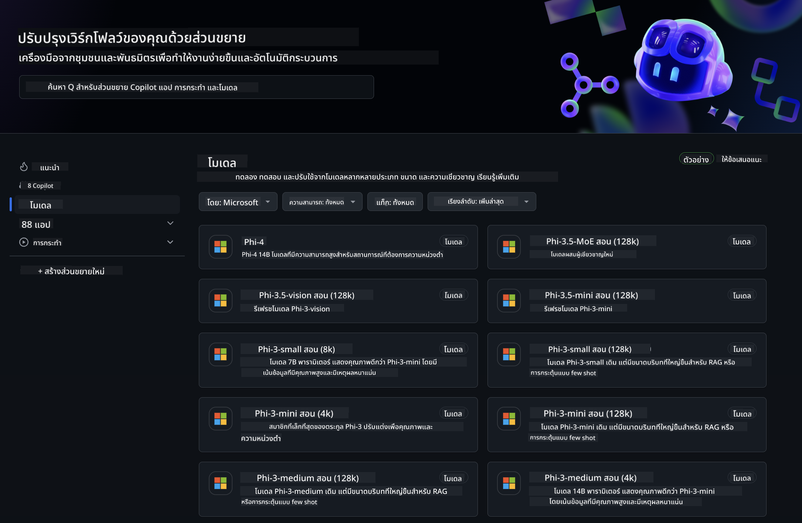
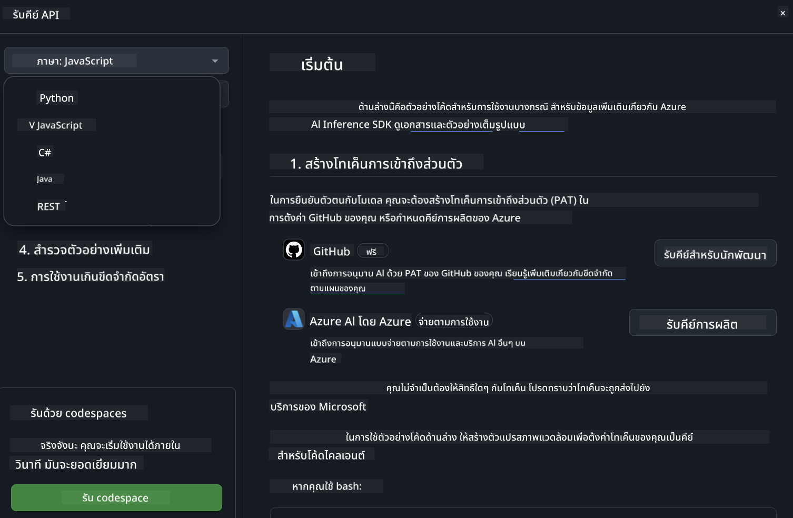
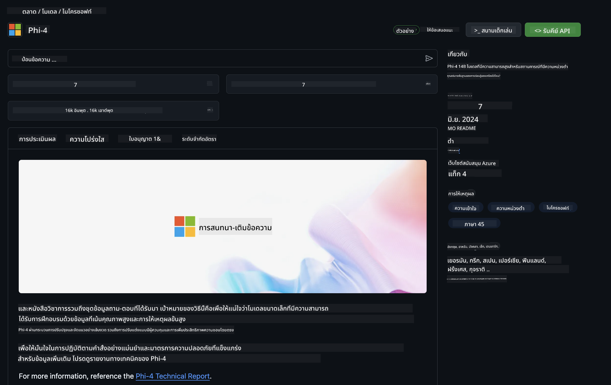

<!--
CO_OP_TRANSLATOR_METADATA:
{
  "original_hash": "5113634b77370af6790f9697d5d7de90",
  "translation_date": "2025-07-17T05:37:13+00:00",
  "source_file": "md/02.QuickStart/GitHubModel_QuickStart.md",
  "language_code": "th"
}
-->
## GitHub Models - เบต้าแบบสาธารณะจำกัด

ยินดีต้อนรับสู่ [GitHub Models](https://github.com/marketplace/models)! เราเตรียมทุกอย่างไว้พร้อมให้คุณสำรวจโมเดล AI ที่โฮสต์บน Azure AI



สำหรับข้อมูลเพิ่มเติมเกี่ยวกับโมเดลที่มีใน GitHub Models โปรดดูที่ [GitHub Model Marketplace](https://github.com/marketplace/models)

## โมเดลที่มีให้ใช้งาน

แต่ละโมเดลมีพื้นที่ทดลองและตัวอย่างโค้ดเฉพาะ


### โมเดล Phi-3 ใน GitHub Model Catalog

[Phi-3-Medium-128k-Instruct](https://github.com/marketplace/models/azureml/Phi-3-medium-128k-instruct)

[Phi-3-medium-4k-instruct](https://github.com/marketplace/models/azureml/Phi-3-medium-4k-instruct)

[Phi-3-mini-128k-instruct](https://github.com/marketplace/models/azureml/Phi-3-mini-128k-instruct)

[Phi-3-mini-4k-instruct](https://github.com/marketplace/models/azureml/Phi-3-mini-4k-instruct)

[Phi-3-small-128k-instruct](https://github.com/marketplace/models/azureml/Phi-3-small-128k-instruct)

[Phi-3-small-8k-instruct](https://github.com/marketplace/models/azureml/Phi-3-small-8k-instruct)

## เริ่มต้นใช้งาน

มีตัวอย่างพื้นฐานบางส่วนที่พร้อมให้คุณทดลองใช้งาน คุณสามารถหาได้ในโฟลเดอร์ samples หากคุณต้องการข้ามไปยังภาษาที่ชื่นชอบ คุณสามารถดูตัวอย่างในภาษาต่อไปนี้ได้:

- Python
- JavaScript
- cURL

นอกจากนี้ยังมีสภาพแวดล้อม Codespaces เฉพาะสำหรับรันตัวอย่างและโมเดล



## ตัวอย่างโค้ด

ด้านล่างเป็นตัวอย่างโค้ดสำหรับกรณีการใช้งานบางอย่าง สำหรับข้อมูลเพิ่มเติมเกี่ยวกับ Azure AI Inference SDK โปรดดูเอกสารและตัวอย่างเต็มรูปแบบ

## การตั้งค่า

1. สร้าง personal access token  
คุณไม่จำเป็นต้องให้สิทธิ์ใดๆ กับ token นี้ โปรดทราบว่า token จะถูกส่งไปยังบริการของ Microsoft

เพื่อใช้ตัวอย่างโค้ดด้านล่าง ให้สร้าง environment variable เพื่อกำหนด token ของคุณเป็นคีย์สำหรับโค้ดฝั่งไคลเอนต์

ถ้าคุณใช้ bash:  
```
export GITHUB_TOKEN="<your-github-token-goes-here>"
```  
ถ้าคุณใช้ powershell:  

```
$Env:GITHUB_TOKEN="<your-github-token-goes-here>"
```  

ถ้าคุณใช้ Windows command prompt:  

```
set GITHUB_TOKEN=<your-github-token-goes-here>
```  

## ตัวอย่าง Python

### ติดตั้ง dependencies  
ติดตั้ง Azure AI Inference SDK ด้วย pip (ต้องใช้ Python >=3.8):  

```
pip install azure-ai-inference
```  
### รันตัวอย่างโค้ดพื้นฐาน

ตัวอย่างนี้แสดงการเรียกใช้งาน API chat completion แบบพื้นฐาน โดยใช้ GitHub AI model inference endpoint และ token GitHub ของคุณ การเรียกใช้งานเป็นแบบ synchronous

```
import os
from azure.ai.inference import ChatCompletionsClient
from azure.ai.inference.models import SystemMessage, UserMessage
from azure.core.credentials import AzureKeyCredential

endpoint = "https://models.inference.ai.azure.com"
# Replace Model_Name 
model_name = "Phi-3-small-8k-instruct"
token = os.environ["GITHUB_TOKEN"]

client = ChatCompletionsClient(
    endpoint=endpoint,
    credential=AzureKeyCredential(token),
)

response = client.complete(
    messages=[
        SystemMessage(content="You are a helpful assistant."),
        UserMessage(content="What is the capital of France?"),
    ],
    model=model_name,
    temperature=1.,
    max_tokens=1000,
    top_p=1.
)

print(response.choices[0].message.content)
```

### รันการสนทนาแบบหลายรอบ

ตัวอย่างนี้แสดงการสนทนาแบบหลายรอบกับ API chat completion เมื่อใช้โมเดลสำหรับแอปแชท คุณจะต้องจัดการประวัติการสนทนาและส่งข้อความล่าสุดไปยังโมเดล

```
import os
from azure.ai.inference import ChatCompletionsClient
from azure.ai.inference.models import AssistantMessage, SystemMessage, UserMessage
from azure.core.credentials import AzureKeyCredential

token = os.environ["GITHUB_TOKEN"]
endpoint = "https://models.inference.ai.azure.com"
# Replace Model_Name
model_name = "Phi-3-small-8k-instruct"

client = ChatCompletionsClient(
    endpoint=endpoint,
    credential=AzureKeyCredential(token),
)

messages = [
    SystemMessage(content="You are a helpful assistant."),
    UserMessage(content="What is the capital of France?"),
    AssistantMessage(content="The capital of France is Paris."),
    UserMessage(content="What about Spain?"),
]

response = client.complete(messages=messages, model=model_name)

print(response.choices[0].message.content)
```

### สตรีมผลลัพธ์

เพื่อประสบการณ์ผู้ใช้ที่ดียิ่งขึ้น คุณจะต้องสตรีมการตอบกลับของโมเดลเพื่อให้ token แรกแสดงผลเร็วขึ้นและไม่ต้องรอการตอบกลับนาน

```
import os
from azure.ai.inference import ChatCompletionsClient
from azure.ai.inference.models import SystemMessage, UserMessage
from azure.core.credentials import AzureKeyCredential

token = os.environ["GITHUB_TOKEN"]
endpoint = "https://models.inference.ai.azure.com"
# Replace Model_Name
model_name = "Phi-3-small-8k-instruct"

client = ChatCompletionsClient(
    endpoint=endpoint,
    credential=AzureKeyCredential(token),
)

response = client.complete(
    stream=True,
    messages=[
        SystemMessage(content="You are a helpful assistant."),
        UserMessage(content="Give me 5 good reasons why I should exercise every day."),
    ],
    model=model_name,
)

for update in response:
    if update.choices:
        print(update.choices[0].delta.content or "", end="")

client.close()
```

## JavaScript

### ติดตั้ง dependencies

ติดตั้ง Node.js

คัดลอกบรรทัดข้อความด้านล่างและบันทึกเป็นไฟล์ package.json ในโฟลเดอร์ของคุณ

```
{
  "type": "module",
  "dependencies": {
    "@azure-rest/ai-inference": "latest",
    "@azure/core-auth": "latest",
    "@azure/core-sse": "latest"
  }
}
```

หมายเหตุ: @azure/core-sse จำเป็นเฉพาะเมื่อคุณสตรีมการตอบกลับของ chat completions เท่านั้น

เปิดหน้าต่างเทอร์มินัลในโฟลเดอร์นี้และรันคำสั่ง npm install

สำหรับแต่ละตัวอย่างโค้ดด้านล่าง ให้คัดลอกเนื้อหาไปยังไฟล์ sample.js และรันด้วยคำสั่ง node sample.js

### รันตัวอย่างโค้ดพื้นฐาน

ตัวอย่างนี้แสดงการเรียกใช้งาน API chat completion แบบพื้นฐาน โดยใช้ GitHub AI model inference endpoint และ token GitHub ของคุณ การเรียกใช้งานเป็นแบบ synchronous

```
import ModelClient from "@azure-rest/ai-inference";
import { AzureKeyCredential } from "@azure/core-auth";

const token = process.env["GITHUB_TOKEN"];
const endpoint = "https://models.inference.ai.azure.com";
// Update your modelname
const modelName = "Phi-3-small-8k-instruct";

export async function main() {

  const client = new ModelClient(endpoint, new AzureKeyCredential(token));

  const response = await client.path("/chat/completions").post({
    body: {
      messages: [
        { role:"system", content: "You are a helpful assistant." },
        { role:"user", content: "What is the capital of France?" }
      ],
      model: modelName,
      temperature: 1.,
      max_tokens: 1000,
      top_p: 1.
    }
  });

  if (response.status !== "200") {
    throw response.body.error;
  }
  console.log(response.body.choices[0].message.content);
}

main().catch((err) => {
  console.error("The sample encountered an error:", err);
});
```

### รันการสนทนาแบบหลายรอบ

ตัวอย่างนี้แสดงการสนทนาแบบหลายรอบกับ API chat completion เมื่อใช้โมเดลสำหรับแอปแชท คุณจะต้องจัดการประวัติการสนทนาและส่งข้อความล่าสุดไปยังโมเดล

```
import ModelClient from "@azure-rest/ai-inference";
import { AzureKeyCredential } from "@azure/core-auth";

const token = process.env["GITHUB_TOKEN"];
const endpoint = "https://models.inference.ai.azure.com";
// Update your modelname
const modelName = "Phi-3-small-8k-instruct";

export async function main() {

  const client = new ModelClient(endpoint, new AzureKeyCredential(token));

  const response = await client.path("/chat/completions").post({
    body: {
      messages: [
        { role: "system", content: "You are a helpful assistant." },
        { role: "user", content: "What is the capital of France?" },
        { role: "assistant", content: "The capital of France is Paris." },
        { role: "user", content: "What about Spain?" },
      ],
      model: modelName,
    }
  });

  if (response.status !== "200") {
    throw response.body.error;
  }

  for (const choice of response.body.choices) {
    console.log(choice.message.content);
  }
}

main().catch((err) => {
  console.error("The sample encountered an error:", err);
});
```

### สตรีมผลลัพธ์

เพื่อประสบการณ์ผู้ใช้ที่ดียิ่งขึ้น คุณจะต้องสตรีมการตอบกลับของโมเดลเพื่อให้ token แรกแสดงผลเร็วขึ้นและไม่ต้องรอการตอบกลับนาน

```
import ModelClient from "@azure-rest/ai-inference";
import { AzureKeyCredential } from "@azure/core-auth";
import { createSseStream } from "@azure/core-sse";

const token = process.env["GITHUB_TOKEN"];
const endpoint = "https://models.inference.ai.azure.com";
// Update your modelname
const modelName = "Phi-3-small-8k-instruct";

export async function main() {

  const client = new ModelClient(endpoint, new AzureKeyCredential(token));

  const response = await client.path("/chat/completions").post({
    body: {
      messages: [
        { role: "system", content: "You are a helpful assistant." },
        { role: "user", content: "Give me 5 good reasons why I should exercise every day." },
      ],
      model: modelName,
      stream: true
    }
  }).asNodeStream();

  const stream = response.body;
  if (!stream) {
    throw new Error("The response stream is undefined");
  }

  if (response.status !== "200") {
    stream.destroy();
    throw new Error(`Failed to get chat completions, http operation failed with ${response.status} code`);
  }

  const sseStream = createSseStream(stream);

  for await (const event of sseStream) {
    if (event.data === "[DONE]") {
      return;
    }
    for (const choice of (JSON.parse(event.data)).choices) {
        process.stdout.write(choice.delta?.content ?? ``);
    }
  }
}

main().catch((err) => {
  console.error("The sample encountered an error:", err);
});
```

## REST

### รันตัวอย่างโค้ดพื้นฐาน

วางโค้ดต่อไปนี้ใน shell:

```
curl -X POST "https://models.inference.ai.azure.com/chat/completions" \
    -H "Content-Type: application/json" \
    -H "Authorization: Bearer $GITHUB_TOKEN" \
    -d '{
        "messages": [
            {
                "role": "system",
                "content": "You are a helpful assistant."
            },
            {
                "role": "user",
                "content": "What is the capital of France?"
            }
        ],
        "model": "Phi-3-small-8k-instruct"
    }'
```

### รันการสนทนาแบบหลายรอบ

เรียกใช้งาน API chat completion และส่งประวัติการสนทนา:

```
curl -X POST "https://models.inference.ai.azure.com/chat/completions" \
    -H "Content-Type: application/json" \
    -H "Authorization: Bearer $GITHUB_TOKEN" \
    -d '{
        "messages": [
            {
                "role": "system",
                "content": "You are a helpful assistant."
            },
            {
                "role": "user",
                "content": "What is the capital of France?"
            },
            {
                "role": "assistant",
                "content": "The capital of France is Paris."
            },
            {
                "role": "user",
                "content": "What about Spain?"
            }
        ],
        "model": "Phi-3-small-8k-instruct"
    }'
```

### สตรีมผลลัพธ์

นี่คือตัวอย่างการเรียก endpoint และสตรีมการตอบกลับ

```
curl -X POST "https://models.inference.ai.azure.com/chat/completions" \
    -H "Content-Type: application/json" \
    -H "Authorization: Bearer $GITHUB_TOKEN" \
    -d '{
        "messages": [
            {
                "role": "system",
                "content": "You are a helpful assistant."
            },
            {
                "role": "user",
                "content": "Give me 5 good reasons why I should exercise every day."
            }
        ],
        "stream": true,
        "model": "Phi-3-small-8k-instruct"
    }'
```

## การใช้งานฟรีและข้อจำกัดอัตราสำหรับ GitHub Models



[ข้อจำกัดอัตราสำหรับ playground และการใช้งาน API ฟรี](https://docs.github.com/en/github-models/prototyping-with-ai-models#rate-limits) มีไว้เพื่อช่วยให้คุณทดลองใช้โมเดลและสร้างต้นแบบแอป AI ของคุณ สำหรับการใช้งานเกินขีดจำกัดเหล่านี้ และเพื่อขยายแอปของคุณ คุณต้องจัดสรรทรัพยากรจากบัญชี Azure และยืนยันตัวตนจากที่นั่นแทนการใช้ personal access token ของ GitHub คุณไม่จำเป็นต้องเปลี่ยนแปลงโค้ดอื่นใด ใช้ลิงก์นี้เพื่อค้นหาวิธีการใช้งานเกินขีดจำกัดฟรีใน Azure AI

### ข้อควรทราบ

โปรดจำไว้ว่าเมื่อคุณโต้ตอบกับโมเดล คุณกำลังทดลองใช้ AI ดังนั้นอาจมีข้อผิดพลาดในเนื้อหาเกิดขึ้นได้

ฟีเจอร์นี้มีข้อจำกัดหลายประการ (รวมถึงจำนวนคำขอต่อวินาที, คำขอต่อวัน, โทเค็นต่อคำขอ และคำขอพร้อมกัน) และไม่ได้ออกแบบมาเพื่อใช้งานในกรณีผลิตจริง

GitHub Models ใช้ Azure AI Content Safety ตัวกรองเหล่านี้ไม่สามารถปิดได้ในประสบการณ์ GitHub Models หากคุณตัดสินใจใช้โมเดลผ่านบริการที่ต้องชำระเงิน โปรดตั้งค่าตัวกรองเนื้อหาให้ตรงกับความต้องการของคุณ

บริการนี้อยู่ภายใต้ข้อกำหนด Pre-release ของ GitHub

**ข้อจำกัดความรับผิดชอบ**:  
เอกสารนี้ได้รับการแปลโดยใช้บริการแปลภาษาอัตโนมัติ [Co-op Translator](https://github.com/Azure/co-op-translator) แม้เราจะพยายามให้ความถูกต้องสูงสุด แต่โปรดทราบว่าการแปลอัตโนมัติอาจมีข้อผิดพลาดหรือความไม่ถูกต้อง เอกสารต้นฉบับในภาษาต้นทางถือเป็นแหล่งข้อมูลที่เชื่อถือได้ สำหรับข้อมูลที่สำคัญ ขอแนะนำให้ใช้บริการแปลโดยผู้เชี่ยวชาญมนุษย์ เราไม่รับผิดชอบต่อความเข้าใจผิดหรือการตีความผิดใด ๆ ที่เกิดจากการใช้การแปลนี้