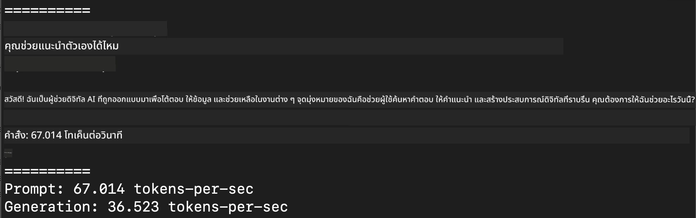
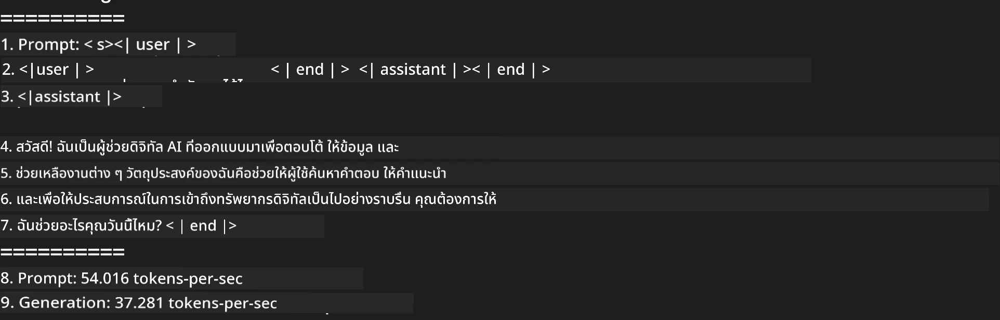

<!--
CO_OP_TRANSLATOR_METADATA:
{
  "original_hash": "dcb656f3d206fc4968e236deec5d4384",
  "translation_date": "2025-07-17T10:06:53+00:00",
  "source_file": "md/03.FineTuning/03.Inference/MLX_Inference.md",
  "language_code": "th"
}
-->
# **การทำ Inference Phi-3 ด้วย Apple MLX Framework**

## **MLX Framework คืออะไร**

MLX เป็นเฟรมเวิร์กอาร์เรย์สำหรับงานวิจัยด้าน machine learning บนชิป Apple silicon พัฒนาโดยทีมวิจัย machine learning ของ Apple

MLX ถูกออกแบบโดยนักวิจัย machine learning เพื่อให้นักวิจัย machine learning ใช้งานได้ง่าย เฟรมเวิร์กนี้เน้นความเป็นมิตรกับผู้ใช้ แต่ยังคงประสิทธิภาพสูงในการฝึกสอนและใช้งานโมเดล การออกแบบของเฟรมเวิร์กเองก็เรียบง่ายในเชิงแนวคิด เราตั้งใจให้การขยายและพัฒนา MLX เป็นเรื่องง่าย เพื่อให้นักวิจัยสามารถทดลองไอเดียใหม่ๆ ได้อย่างรวดเร็ว

โมเดล LLMs สามารถเร่งความเร็วบนอุปกรณ์ Apple Silicon ผ่าน MLX และสามารถรันโมเดลได้อย่างสะดวกสบายในเครื่องท้องถิ่น

## **การใช้ MLX ในการทำ inference Phi-3-mini**

### **1. ตั้งค่าสภาพแวดล้อม MLX ของคุณ**

1. Python 3.11.x  
2. ติดตั้งไลบรารี MLX  


```bash

pip install mlx-lm

```

### **2. รัน Phi-3-mini ใน Terminal ด้วย MLX**


```bash

python -m mlx_lm.generate --model microsoft/Phi-3-mini-4k-instruct --max-token 2048 --prompt  "<|user|>\nCan you introduce yourself<|end|>\n<|assistant|>"

```

ผลลัพธ์ (สภาพแวดล้อมของผมคือ Apple M1 Max, 64GB) เป็นดังนี้



### **3. การทำ Quantize Phi-3-mini ด้วย MLX ใน Terminal**


```bash

python -m mlx_lm.convert --hf-path microsoft/Phi-3-mini-4k-instruct

```

***Note：*** โมเดลสามารถทำ quantize ได้ผ่าน mlx_lm.convert โดยค่ามาตรฐานของ quantization คือ INT4 ตัวอย่างนี้ทำการ quantize Phi-3-mini เป็น INT4

โมเดลสามารถทำ quantize ผ่าน mlx_lm.convert โดยค่ามาตรฐานคือ INT4 ตัวอย่างนี้เป็นการ quantize Phi-3-mini เป็น INT4 หลังจาก quantize แล้วโมเดลจะถูกเก็บไว้ในไดเรกทอรีเริ่มต้น ./mlx_model

เราสามารถทดสอบโมเดลที่ถูก quantize ด้วย MLX จาก terminal ได้


```bash

python -m mlx_lm.generate --model ./mlx_model/ --max-token 2048 --prompt  "<|user|>\nCan you introduce yourself<|end|>\n<|assistant|>"

```

ผลลัพธ์เป็นดังนี้




### **4. รัน Phi-3-mini ด้วย MLX ใน Jupyter Notebook**


***Note:*** กรุณาอ่านตัวอย่างนี้ [คลิกที่ลิงก์นี้](../../../../../code/03.Inference/MLX/MLX_DEMO.ipynb)


## **แหล่งข้อมูล**

1. เรียนรู้เกี่ยวกับ Apple MLX Framework [https://ml-explore.github.io](https://ml-explore.github.io/mlx/build/html/index.html)

2. Apple MLX GitHub Repo [https://github.com/ml-explore](https://github.com/ml-explore)

**ข้อจำกัดความรับผิดชอบ**:  
เอกสารนี้ได้รับการแปลโดยใช้บริการแปลภาษาอัตโนมัติ [Co-op Translator](https://github.com/Azure/co-op-translator) แม้เราจะพยายามให้ความถูกต้องสูงสุด แต่โปรดทราบว่าการแปลอัตโนมัติอาจมีข้อผิดพลาดหรือความไม่ถูกต้อง เอกสารต้นฉบับในภาษาต้นทางถือเป็นแหล่งข้อมูลที่เชื่อถือได้ สำหรับข้อมูลที่สำคัญ ขอแนะนำให้ใช้บริการแปลโดยผู้เชี่ยวชาญมนุษย์ เราไม่รับผิดชอบต่อความเข้าใจผิดหรือการตีความผิดใด ๆ ที่เกิดจากการใช้การแปลนี้