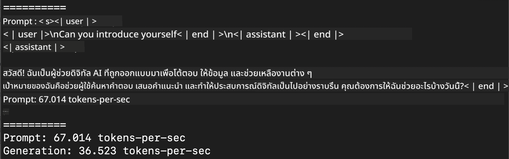
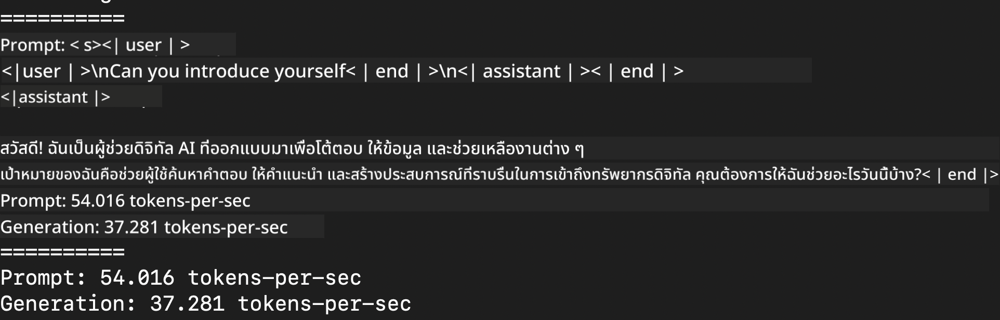
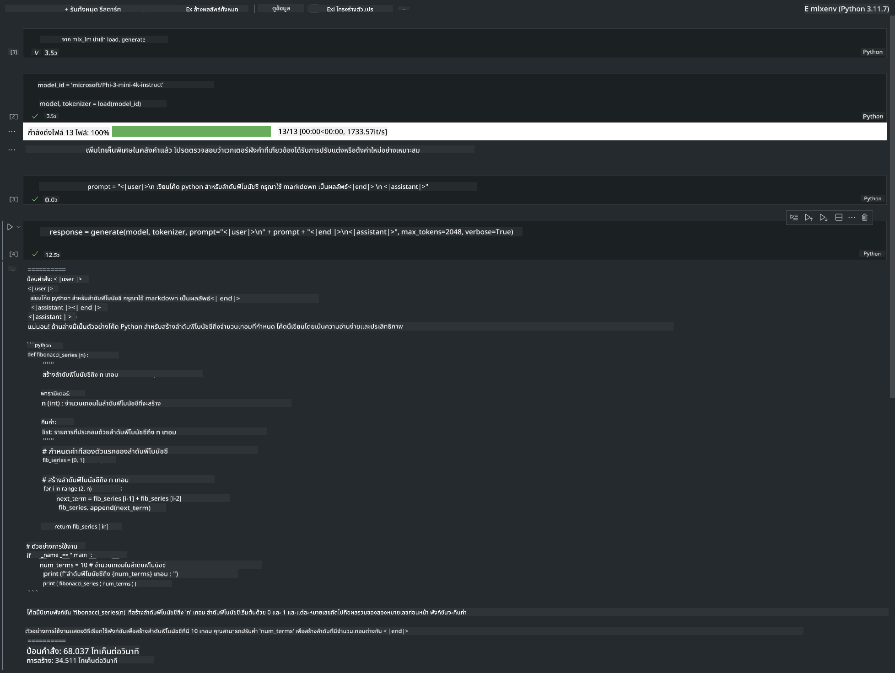

<!--
CO_OP_TRANSLATOR_METADATA:
{
  "original_hash": "dcb656f3d206fc4968e236deec5d4384",
  "translation_date": "2025-05-09T22:31:51+00:00",
  "source_file": "md/03.FineTuning/03.Inference/MLX_Inference.md",
  "language_code": "th"
}
-->
# **Inference Phi-3 กับ Apple MLX Framework**

## **MLX Framework คืออะไร**

MLX เป็นเฟรมเวิร์กอาเรย์สำหรับงานวิจัยด้าน machine learning บน Apple silicon ซึ่งพัฒนาโดยทีมวิจัย machine learning ของ Apple

MLX ถูกออกแบบโดยนักวิจัย machine learning สำหรับนักวิจัย machine learning โดยเฟรมเวิร์กนี้เน้นให้ใช้งานง่าย แต่ยังคงประสิทธิภาพในการฝึกและใช้งานโมเดล การออกแบบเฟรมเวิร์กเองก็เรียบง่ายในเชิงแนวคิด เราตั้งใจให้มันง่ายสำหรับนักวิจัยที่จะขยายและพัฒนา MLX เพื่อสำรวจไอเดียใหม่ๆ ได้อย่างรวดเร็ว

โมเดล LLMs สามารถเร่งความเร็วบนอุปกรณ์ Apple Silicon ผ่าน MLX และสามารถรันโมเดลได้อย่างสะดวกสบายบนเครื่องท้องถิ่น

## **การใช้ MLX เพื่อ inference Phi-3-mini**

### **1. ตั้งค่าสภาพแวดล้อม MLX ของคุณ**

1. Python 3.11.x  
2. ติดตั้งไลบรารี MLX  


```bash

pip install mlx-lm

```

### **2. รัน Phi-3-mini ใน Terminal ด้วย MLX**


```bash

python -m mlx_lm.generate --model microsoft/Phi-3-mini-4k-instruct --max-token 2048 --prompt  "<|user|>\nCan you introduce yourself<|end|>\n<|assistant|>"

```

ผลลัพธ์ (เครื่องของผมเป็น Apple M1 Max, 64GB) คือ



### **3. การ quantize Phi-3-mini ด้วย MLX ใน Terminal**


```bash

python -m mlx_lm.convert --hf-path microsoft/Phi-3-mini-4k-instruct

```

***Note：*** โมเดลสามารถทำ quantize ได้ผ่าน mlx_lm.convert โดยค่ามาตรฐานของ quantize คือ INT4 ตัวอย่างนี้ทำการ quantize Phi-3-mini เป็น INT4

โมเดลสามารถทำ quantize ผ่าน mlx_lm.convert โดยค่ามาตรฐานคือ INT4 ตัวอย่างนี้จะทำการ quantize Phi-3-mini เป็น INT4 หลังจาก quantize แล้ว โมเดลจะถูกเก็บไว้ในไดเรกทอรีเริ่มต้น ./mlx_model

เราสามารถทดสอบโมเดลที่ quantize แล้วด้วย MLX จาก terminal


```bash

python -m mlx_lm.generate --model ./mlx_model/ --max-token 2048 --prompt  "<|user|>\nCan you introduce yourself<|end|>\n<|assistant|>"

```

ผลลัพธ์คือ




### **4. รัน Phi-3-mini ด้วย MLX ใน Jupyter Notebook**




***Note:*** กรุณาอ่านตัวอย่างนี้ [คลิกที่ลิงก์นี้](../../../../../code/03.Inference/MLX/MLX_DEMO.ipynb)


## **แหล่งข้อมูล**

1. เรียนรู้เกี่ยวกับ Apple MLX Framework [https://ml-explore.github.io](https://ml-explore.github.io/mlx/build/html/index.html)

2. Apple MLX GitHub Repo [https://github.com/ml-explore](https://github.com/ml-explore)

**ข้อจำกัดความรับผิดชอบ**:  
เอกสารฉบับนี้ได้รับการแปลโดยใช้บริการแปลภาษาด้วย AI [Co-op Translator](https://github.com/Azure/co-op-translator) แม้ว่าเราจะพยายามให้ความถูกต้องสูงสุด แต่โปรดทราบว่าการแปลอัตโนมัติอาจมีข้อผิดพลาดหรือความคลาดเคลื่อน เอกสารต้นฉบับในภาษาต้นทางถือเป็นแหล่งข้อมูลที่ถูกต้องและน่าเชื่อถือ สำหรับข้อมูลที่สำคัญ ขอแนะนำให้ใช้บริการแปลโดยผู้เชี่ยวชาญมนุษย์ เราจะไม่รับผิดชอบต่อความเข้าใจผิดหรือการตีความที่ผิดพลาดที่เกิดจากการใช้การแปลฉบับนี้