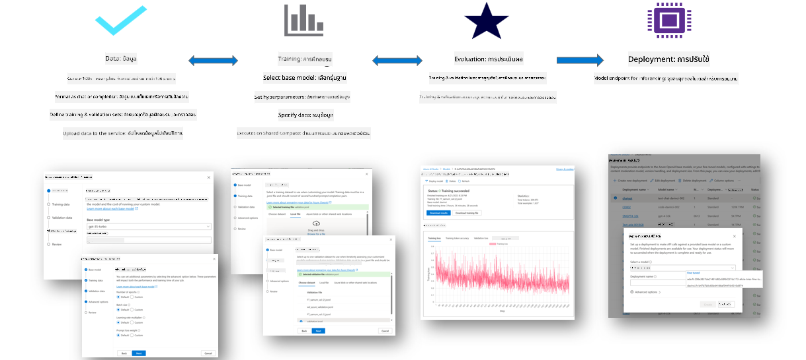
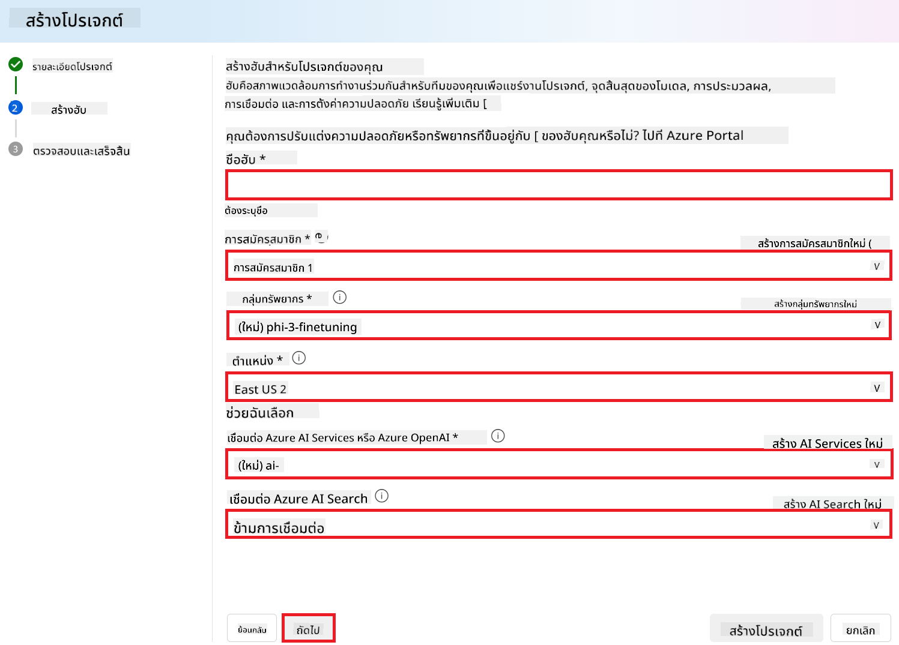
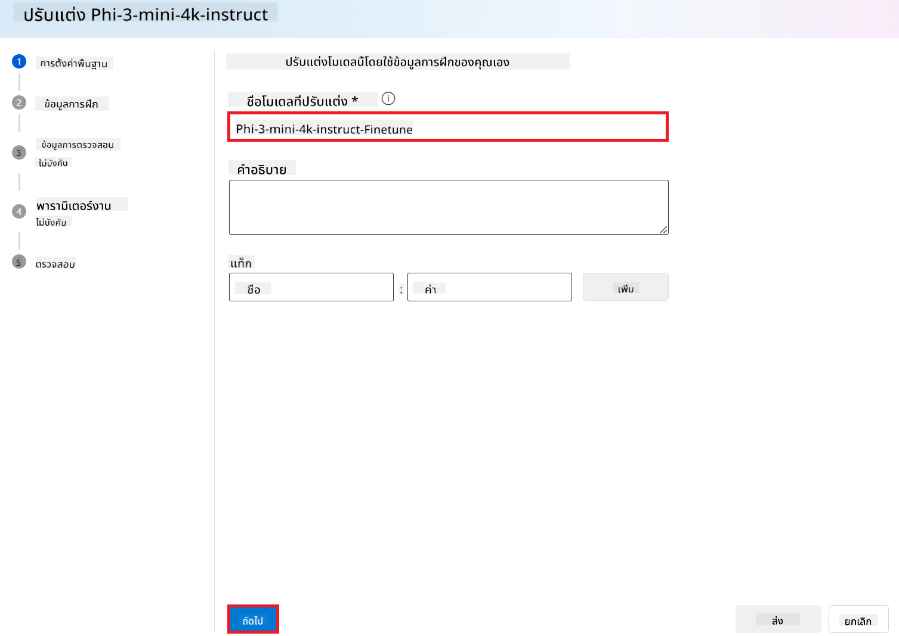

<!--
CO_OP_TRANSLATOR_METADATA:
{
  "original_hash": "c1559c5af6caccf6f623fd43a6b3a9a3",
  "translation_date": "2025-07-17T06:05:57+00:00",
  "source_file": "md/03.FineTuning/FineTuning_AIFoundry.md",
  "language_code": "th"
}
-->
# การปรับแต่ง Phi-3 ด้วย Azure AI Foundry

มาทำความรู้จักกับการปรับแต่งโมเดลภาษา Phi-3 Mini ของ Microsoft โดยใช้ Azure AI Foundry กัน การปรับแต่งนี้ช่วยให้คุณสามารถปรับโมเดล Phi-3 Mini ให้เหมาะกับงานเฉพาะทาง ทำให้โมเดลมีความแม่นยำและเข้าใจบริบทได้ดียิ่งขึ้น

## ข้อควรพิจารณา

- **ความสามารถ:** โมเดลใดบ้างที่สามารถปรับแต่งได้? โมเดลพื้นฐานสามารถปรับแต่งให้ทำอะไรได้บ้าง?
- **ค่าใช้จ่าย:** รูปแบบการคิดค่าบริการสำหรับการปรับแต่งเป็นอย่างไร
- **ความยืดหยุ่น:** สามารถปรับเปลี่ยนโมเดลพื้นฐานได้มากแค่ไหน และในรูปแบบใดบ้าง?
- **ความสะดวก:** การปรับแต่งเกิดขึ้นอย่างไร ต้องเขียนโค้ดเองหรือไม่? ต้องเตรียมเครื่องคอมพิวเตอร์เองหรือเปล่า?
- **ความปลอดภัย:** โมเดลที่ผ่านการปรับแต่งมีความเสี่ยงด้านความปลอดภัยหรือไม่ มีมาตรการป้องกันความเสียหายที่ไม่ตั้งใจหรือเปล่า?


## การเตรียมตัวสำหรับการปรับแต่ง

### ข้อกำหนดเบื้องต้น

> [!NOTE]
> สำหรับโมเดลในตระกูล Phi-3 การปรับแต่งแบบจ่ายตามการใช้งาน (pay-as-you-go) จะใช้ได้เฉพาะกับฮับที่สร้างในภูมิภาค **East US 2** เท่านั้น

- มีบัญชี Azure Subscription หากยังไม่มี ให้สร้าง [บัญชี Azure แบบชำระเงิน](https://azure.microsoft.com/pricing/purchase-options/pay-as-you-go) เพื่อเริ่มต้น

- มี [โปรเจกต์ AI Foundry](https://ai.azure.com?WT.mc_id=aiml-138114-kinfeylo)
- ใช้การควบคุมการเข้าถึงแบบบทบาทใน Azure (Azure RBAC) เพื่อให้สิทธิ์ในการดำเนินการใน Azure AI Foundry โดยบัญชีผู้ใช้ของคุณต้องได้รับมอบหมายบทบาท __Azure AI Developer__ ในกลุ่มทรัพยากร

### การลงทะเบียนผู้ให้บริการ Subscription

ตรวจสอบว่า Subscription ได้ลงทะเบียนกับผู้ให้บริการทรัพยากร `Microsoft.Network` แล้ว

1. ลงชื่อเข้าใช้ [Azure portal](https://portal.azure.com)
2. เลือก **Subscriptions** จากเมนูด้านซ้าย
3. เลือก Subscription ที่ต้องการใช้งาน
4. เลือก **AI project settings** > **Resource providers** จากเมนูด้านซ้าย
5. ตรวจสอบว่า **Microsoft.Network** อยู่ในรายการผู้ให้บริการทรัพยากร หากไม่อยู่ให้เพิ่มเข้าไป

### การเตรียมข้อมูล

เตรียมข้อมูลสำหรับการฝึกสอนและการตรวจสอบโมเดล ข้อมูลฝึกสอนและข้อมูลตรวจสอบประกอบด้วยตัวอย่างอินพุตและเอาต์พุตที่แสดงให้เห็นว่าคุณต้องการให้โมเดลทำงานอย่างไร

ตรวจสอบให้แน่ใจว่าตัวอย่างข้อมูลฝึกสอนทั้งหมดเป็นไปตามรูปแบบที่คาดหวังสำหรับการทำนายผล เพื่อให้การปรับแต่งโมเดลมีประสิทธิภาพ ควรรักษาความสมดุลและความหลากหลายของชุดข้อมูล

ซึ่งรวมถึงการรักษาความสมดุลของข้อมูล การรวมสถานการณ์ที่หลากหลาย และการปรับปรุงข้อมูลฝึกสอนเป็นระยะเพื่อให้สอดคล้องกับความคาดหวังในโลกจริง ส่งผลให้โมเดลตอบสนองได้แม่นยำและสมดุลมากขึ้น

โมเดลแต่ละประเภทต้องการรูปแบบข้อมูลฝึกสอนที่แตกต่างกัน

### การทำ Chat Completion

ข้อมูลฝึกสอนและตรวจสอบที่ใช้ **ต้อง** อยู่ในรูปแบบ JSON Lines (JSONL) สำหรับ `Phi-3-mini-128k-instruct` ชุดข้อมูลสำหรับการปรับแต่งต้องอยู่ในรูปแบบการสนทนาที่ใช้โดย Chat completions API

### ตัวอย่างรูปแบบไฟล์

```json
    {"messages": [{"role": "system", "content": "You are an Xbox customer support agent whose primary goal is to help users with issues they are experiencing with their Xbox devices. You are friendly and concise. You only provide factual answers to queries, and do not provide answers that are not related to Xbox."}, {"role": "user", "content": "Is Xbox better than PlayStation?"}, {"role": "assistant", "content": "I apologize, but I cannot provide personal opinions. My primary job is to assist you with any issues related to your Xbox device. Do you have any Xbox-related issues that need addressing?"}]}
    {"messages": [{"role": "system", "content": "You are an Xbox customer support agent whose primary goal is to help users with issues they are experiencing with their Xbox devices. You are friendly and concise. You only provide factual answers to queries, and do not provide answers that are not related to Xbox."}, {"role": "user", "content": "Can I play PC games on my Xbox?"}, {"role": "assistant", "content": "While Xbox consoles don't natively support PC games, they can play an array of Xbox games, many of which are also available on PC. Can I assist you with finding games compatible with your Xbox device?"}]}
    {"messages": [{"role": "system", "content": "You are an Xbox customer support agent whose primary goal is to help users with issues they are experiencing with their Xbox devices. You are friendly and concise. You only provide factual answers to queries, and do not provide answers that are not related to Xbox."}, {"role": "user", "content": "I'm having trouble connecting my Xbox to the Wi-Fi."}, {"role": "assistant", "content": "No worries, let's go through the network settings on your Xbox. Can you please tell me what happens when you try to connect it to the Wi-Fi?"}]}
```

ไฟล์ที่รองรับเป็น JSON Lines ไฟล์จะถูกอัปโหลดไปยังที่เก็บข้อมูลเริ่มต้นและพร้อมใช้งานในโปรเจกต์ของคุณ

## การปรับแต่ง Phi-3 ด้วย Azure AI Foundry

Azure AI Foundry ช่วยให้คุณปรับแต่งโมเดลภาษาขนาดใหญ่ให้เหมาะกับชุดข้อมูลของคุณเองผ่านกระบวนการที่เรียกว่าการปรับแต่ง (fine-tuning) การปรับแต่งนี้ช่วยเพิ่มมูลค่าอย่างมากโดยเปิดโอกาสให้ปรับแต่งและเพิ่มประสิทธิภาพสำหรับงานและแอปพลิเคชันเฉพาะทาง ส่งผลให้ประสิทธิภาพดีขึ้น ประหยัดค่าใช้จ่าย ลดความหน่วงเวลา และได้ผลลัพธ์ที่เหมาะสมกับความต้องการ



### สร้างโปรเจกต์ใหม่

1. ลงชื่อเข้าใช้ [Azure AI Foundry](https://ai.azure.com)

2. เลือก **+New project** เพื่อสร้างโปรเจกต์ใหม่ใน Azure AI Foundry

    

3. ดำเนินการดังนี้:

    - กำหนดชื่อ **Hub name** ซึ่งต้องไม่ซ้ำกับชื่ออื่น
    - เลือก **Hub** ที่จะใช้ (สร้างใหม่ถ้าจำเป็น)

    

4. ดำเนินการดังนี้เพื่อสร้างฮับใหม่:

    - กรอกชื่อ **Hub name** ซึ่งต้องไม่ซ้ำกับชื่ออื่น
    - เลือก **Subscription** ของ Azure ที่จะใช้
    - เลือก **Resource group** ที่จะใช้ (สร้างใหม่ถ้าจำเป็น)
    - เลือก **Location** ที่ต้องการใช้งาน
    - เลือก **Connect Azure AI Services** ที่จะใช้ (สร้างใหม่ถ้าจำเป็น)
    - เลือก **Connect Azure AI Search** เป็น **Skip connecting**

    

5. เลือก **Next**
6. เลือก **Create a project**

### การเตรียมข้อมูล

ก่อนการปรับแต่ง ให้รวบรวมหรือสร้างชุดข้อมูลที่เกี่ยวข้องกับงานของคุณ เช่น คำสั่งแชท คู่คำถาม-คำตอบ หรือข้อความอื่น ๆ ที่เกี่ยวข้อง ทำความสะอาดและเตรียมข้อมูลโดยการลบข้อมูลรบกวน จัดการค่าที่ขาดหาย และแยกคำในข้อความ

### การปรับแต่งโมเดล Phi-3 ใน Azure AI Foundry

> [!NOTE]
> การปรับแต่งโมเดล Phi-3 รองรับเฉพาะโปรเจกต์ที่ตั้งอยู่ในภูมิภาค East US 2 เท่านั้น

1. เลือก **Model catalog** จากแท็บด้านซ้าย

2. พิมพ์ *phi-3* ใน **แถบค้นหา** และเลือกโมเดล phi-3 ที่ต้องการใช้งาน

    

3. เลือก **Fine-tune**

    

4. กรอกชื่อ **Fine-tuned model name**

    

5. เลือก **Next**

6. ดำเนินการดังนี้:

    - เลือก **task type** เป็น **Chat completion**
    - เลือก **Training data** ที่ต้องการใช้ สามารถอัปโหลดผ่าน Azure AI Foundry หรือจากเครื่องของคุณเอง

    

7. เลือก **Next**

8. อัปโหลด **Validation data** ที่ต้องการใช้ หรือเลือก **Automatic split of training data**

    

9. เลือก **Next**

10. ดำเนินการดังนี้:

    - เลือก **Batch size multiplier** ที่ต้องการใช้
    - เลือก **Learning rate** ที่ต้องการใช้
    - เลือก **Epochs** ที่ต้องการใช้

    

11. เลือก **Submit** เพื่อเริ่มกระบวนการปรับแต่ง

    

12. เมื่อโมเดลของคุณผ่านการปรับแต่งแล้ว สถานะจะแสดงเป็น **Completed** ดังภาพด้านล่าง คุณสามารถนำโมเดลไปใช้งานในแอปพลิเคชันของคุณเอง ใน playground หรือใน prompt flow ได้ สำหรับข้อมูลเพิ่มเติม ดูที่ [วิธีการปรับใช้โมเดลภาษาเล็กในตระกูล Phi-3 ด้วย Azure AI Foundry](https://learn.microsoft.com/azure/ai-studio/how-to/deploy-models-phi-3?tabs=phi-3-5&pivots=programming-language-python)

    

> [!NOTE]
> สำหรับข้อมูลรายละเอียดเพิ่มเติมเกี่ยวกับการปรับแต่ง Phi-3 โปรดเยี่ยมชม [Fine-tune Phi-3 models in Azure AI Foundry](https://learn.microsoft.com/azure/ai-studio/how-to/fine-tune-phi-3?tabs=phi-3-mini)

## การลบโมเดลที่ผ่านการปรับแต่ง

คุณสามารถลบโมเดลที่ผ่านการปรับแต่งได้จากรายการโมเดลในหน้า Fine-tuning ของ [Azure AI Foundry](https://ai.azure.com) หรือจากหน้ารายละเอียดโมเดล เลือกโมเดลที่ต้องการลบจากหน้า Fine-tuning แล้วกดปุ่ม Delete เพื่อลบโมเดลนั้น

> [!NOTE]
> คุณไม่สามารถลบโมเดลที่มีการปรับใช้แล้วได้ ต้องลบการปรับใช้โมเดลนั้นก่อนจึงจะลบโมเดลได้

## ค่าใช้จ่ายและโควต้า

### ข้อควรพิจารณาเรื่องค่าใช้จ่ายและโควต้าสำหรับโมเดล Phi-3 ที่ปรับแต่งเป็นบริการ

โมเดล Phi ที่ปรับแต่งเป็นบริการนี้ให้บริการโดย Microsoft และผสานรวมกับ Azure AI Foundry เพื่อใช้งาน คุณสามารถดูราคาขณะ [ปรับใช้](https://learn.microsoft.com/azure/ai-studio/how-to/deploy-models-phi-3?tabs=phi-3-5&pivots=programming-language-python) หรือปรับแต่งโมเดลได้ในแท็บ Pricing and terms ของตัวช่วยปรับใช้

## การกรองเนื้อหา

โมเดลที่ปรับใช้เป็นบริการแบบจ่ายตามการใช้งานจะได้รับการปกป้องโดย Azure AI Content Safety เมื่อปรับใช้กับจุดเชื่อมต่อแบบเรียลไทม์ คุณสามารถเลือกไม่ใช้ฟีเจอร์นี้ได้ เมื่อเปิดใช้งาน Azure AI Content Safety ทั้ง prompt และ completion จะถูกส่งผ่านโมเดลจัดประเภทหลายตัวที่ออกแบบมาเพื่อตรวจจับและป้องกันการแสดงเนื้อหาที่เป็นอันตราย ระบบกรองเนื้อหาจะตรวจจับและดำเนินการกับเนื้อหาที่อาจเป็นอันตรายในทั้งอินพุตและเอาต์พุต อ่านเพิ่มเติมเกี่ยวกับ [Azure AI Content Safety](https://learn.microsoft.com/azure/ai-studio/concepts/content-filtering)

**การตั้งค่าการปรับแต่ง**

กำหนดค่าพารามิเตอร์ เช่น อัตราการเรียนรู้ ขนาดชุดข้อมูล และจำนวนรอบการฝึก

**ฟังก์ชันการสูญเสีย**

เลือกฟังก์ชันการสูญเสียที่เหมาะสมกับงานของคุณ (เช่น cross-entropy)

**ตัวปรับแต่ง**

เลือกตัวปรับแต่ง (เช่น Adam) สำหรับการอัปเดตกราดิเอนต์ระหว่างการฝึก

**กระบวนการปรับแต่ง**

- โหลดโมเดลที่ผ่านการฝึกมาแล้ว: โหลดเช็คพอยต์ของ Phi-3 Mini
- เพิ่มเลเยอร์เฉพาะงาน: เพิ่มเลเยอร์สำหรับงานเฉพาะ เช่น หัวข้อการจำแนกสำหรับคำสั่งแชท

**ฝึกสอนโมเดล**

ปรับแต่งโมเดลโดยใช้ชุดข้อมูลที่เตรียมไว้ ติดตามความคืบหน้าการฝึกและปรับพารามิเตอร์ตามความจำเป็น

**การประเมินและตรวจสอบ**

ชุดตรวจสอบ: แบ่งข้อมูลเป็นชุดฝึกและชุดตรวจสอบ

**ประเมินประสิทธิภาพ**

ใช้เมตริก เช่น ความแม่นยำ F1-score หรือ perplexity เพื่อประเมินประสิทธิภาพของโมเดล

## การบันทึกโมเดลที่ผ่านการปรับแต่ง

**เช็คพอยต์**

บันทึกเช็คพอยต์ของโมเดลที่ผ่านการปรับแต่งไว้ใช้ในอนาคต

## การปรับใช้

- ปรับใช้เป็นบริการเว็บ: นำโมเดลที่ผ่านการปรับแต่งไปปรับใช้เป็นบริการเว็บใน Azure AI Foundry
- ทดสอบจุดเชื่อมต่อ: ส่งคำถามทดสอบไปยังจุดเชื่อมต่อที่ปรับใช้เพื่อตรวจสอบการทำงาน

## การปรับปรุงและพัฒนา

ปรับปรุง: หากประสิทธิภาพยังไม่เป็นที่น่าพอใจ ให้ปรับพารามิเตอร์ เพิ่มข้อมูล หรือฝึกเพิ่มรอบการปรับแต่ง

## การติดตามและปรับแต่ง

ติดตามพฤติกรรมของโมเดลอย่างต่อเนื่องและปรับปรุงตามความจำเป็น

## การปรับแต่งและขยายฟังก์ชัน

งานเฉพาะ: Phi-3 Mini สามารถปรับแต่งสำหรับงานต่าง ๆ นอกเหนือจากคำสั่งแชท ลองสำรวจกรณีการใช้งานอื่น ๆ!
ทดลอง: ลองสถาปัตยกรรม เลเยอร์ และเทคนิคต่าง ๆ เพื่อเพิ่มประสิทธิภาพ

> [!NOTE]
> การปรับแต่งเป็นกระบวนการที่ต้องทำซ้ำ ทดลอง เรียนรู้ และปรับโมเดลของคุณเพื่อให้ได้ผลลัพธ์ที่ดีที่สุดสำหรับงานเฉพาะของคุณ!

**ข้อจำกัดความรับผิดชอบ**:  
เอกสารนี้ได้รับการแปลโดยใช้บริการแปลภาษาอัตโนมัติ [Co-op Translator](https://github.com/Azure/co-op-translator) แม้เราจะพยายามให้ความถูกต้องสูงสุด แต่โปรดทราบว่าการแปลอัตโนมัติอาจมีข้อผิดพลาดหรือความไม่ถูกต้อง เอกสารต้นฉบับในภาษาต้นทางถือเป็นแหล่งข้อมูลที่เชื่อถือได้ สำหรับข้อมูลที่สำคัญ ขอแนะนำให้ใช้บริการแปลโดยผู้เชี่ยวชาญมนุษย์ เราไม่รับผิดชอบต่อความเข้าใจผิดหรือการตีความผิดใด ๆ ที่เกิดจากการใช้การแปลนี้