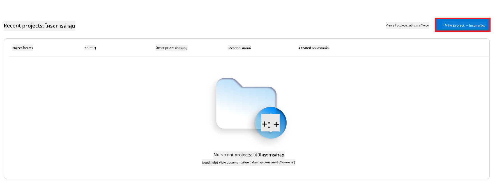
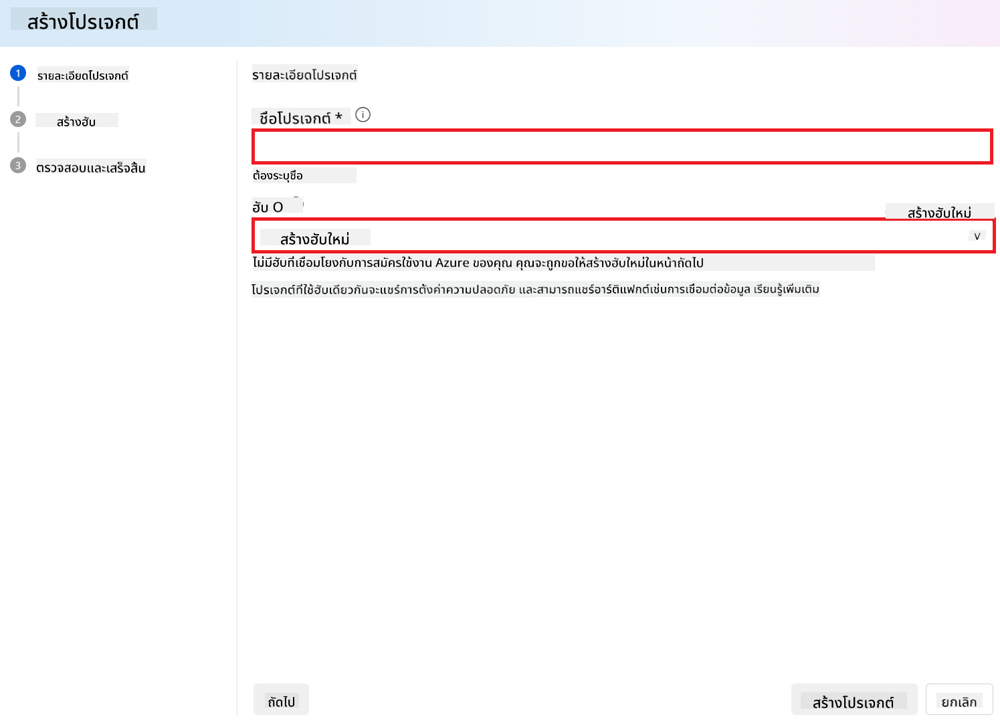
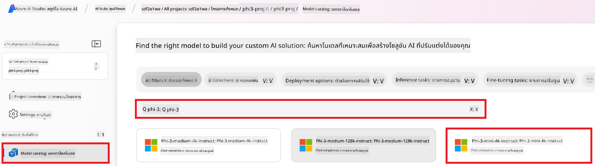
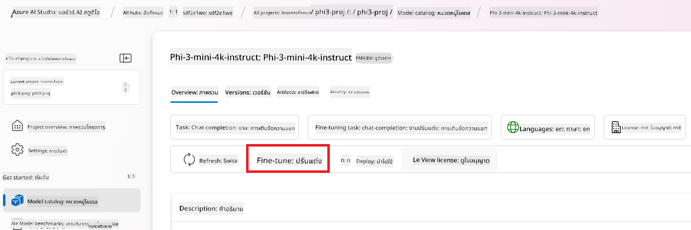
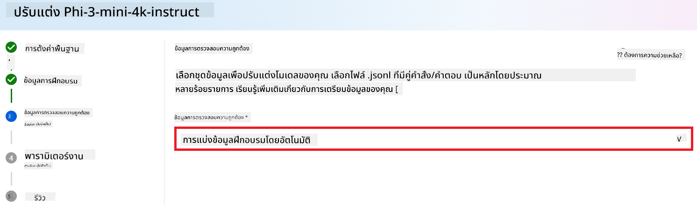
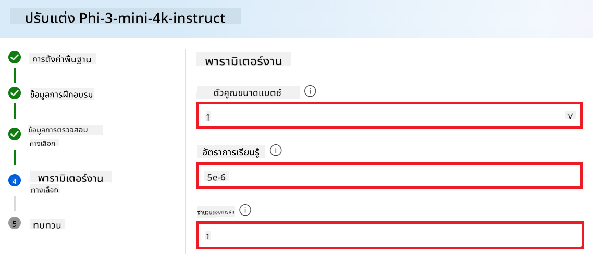
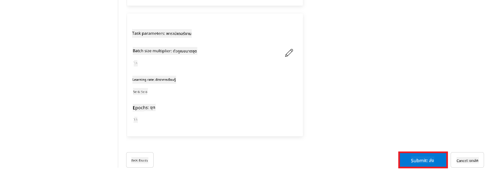
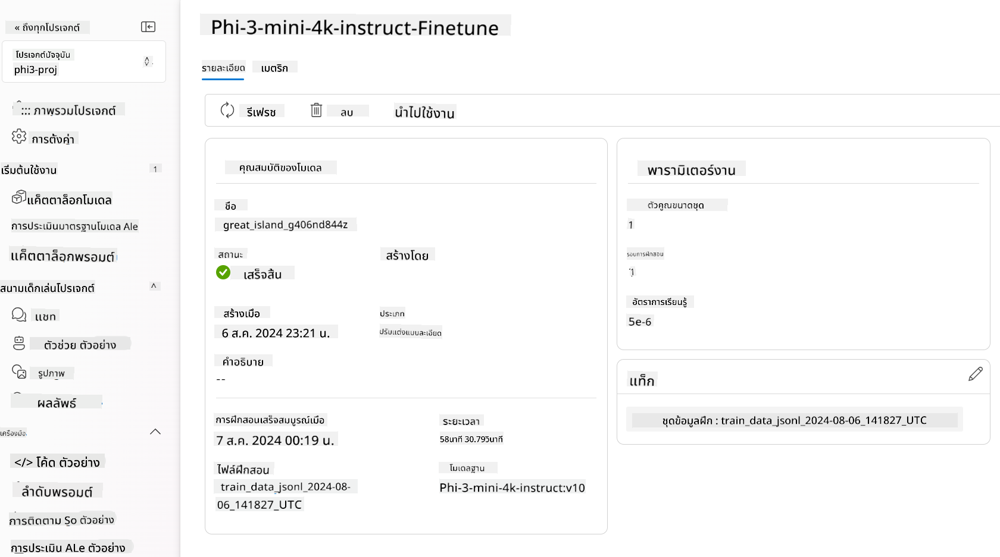

<!--
CO_OP_TRANSLATOR_METADATA:
{
  "original_hash": "c1559c5af6caccf6f623fd43a6b3a9a3",
  "translation_date": "2025-05-09T20:31:40+00:00",
  "source_file": "md/03.FineTuning/FineTuning_AIFoundry.md",
  "language_code": "th"
}
-->
# การปรับแต่ง Phi-3 ด้วย Azure AI Foundry

มาลองสำรวจวิธีการปรับแต่งโมเดลภาษา Phi-3 Mini ของ Microsoft โดยใช้ Azure AI Foundry กัน การปรับแต่งช่วยให้คุณสามารถปรับ Phi-3 Mini ให้เหมาะกับงานเฉพาะด้าน ทำให้โมเดลมีความสามารถและเข้าใจบริบทได้ดีขึ้น

## ข้อควรพิจารณา

- **ความสามารถ:** โมเดลใดบ้างที่สามารถปรับแต่งได้? โมเดลฐานสามารถปรับแต่งให้ทำอะไรได้บ้าง?
- **ค่าใช้จ่าย:** โมเดลการคิดค่าบริการสำหรับการปรับแต่งเป็นอย่างไร
- **ความยืดหยุ่นในการปรับแต่ง:** ฉันสามารถแก้ไขโมเดลฐานได้มากแค่ไหน และในรูปแบบใดบ้าง?
- **ความสะดวก:** การปรับแต่งเกิดขึ้นอย่างไร — ฉันต้องเขียนโค้ดเองหรือไม่? ต้องเตรียมคอมพิวเตอร์เองหรือเปล่า?
- **ความปลอดภัย:** โมเดลที่ถูกปรับแต่งมีความเสี่ยงด้านความปลอดภัย — มีมาตรการป้องกันไม่ให้เกิดอันตรายโดยไม่ตั้งใจหรือไม่?


## การเตรียมความพร้อมสำหรับการปรับแต่ง

### ข้อกำหนดเบื้องต้น

> [!NOTE]
> สำหรับโมเดลในตระกูล Phi-3 การปรับแต่งแบบ pay-as-you-go มีให้เฉพาะกับ hubs ที่สร้างในภูมิภาค **East US 2** เท่านั้น

- มีการสมัครใช้งาน Azure หากยังไม่มี ให้สร้าง [บัญชี Azure แบบชำระเงินตามการใช้งาน](https://azure.microsoft.com/pricing/purchase-options/pay-as-you-go) เพื่อเริ่มต้น

- มี [โปรเจกต์ AI Foundry](https://ai.azure.com?WT.mc_id=aiml-138114-kinfeylo)
- ใช้การควบคุมการเข้าถึงแบบบทบาทใน Azure (Azure RBAC) เพื่อมอบสิทธิ์การเข้าถึงการทำงานใน Azure AI Foundry ในการทำตามขั้นตอนในบทความนี้ บัญชีผู้ใช้ของคุณต้องได้รับมอบหมายบทบาท __Azure AI Developer__ ใน resource group

### การลงทะเบียนผู้ให้บริการ Subscription

ตรวจสอบว่าการสมัครใช้งานได้ลงทะเบียนกับผู้ให้บริการทรัพยากร `Microsoft.Network` แล้ว

1. ลงชื่อเข้าใช้ [Azure portal](https://portal.azure.com)
1. เลือก **Subscriptions** จากเมนูด้านซ้าย
1. เลือกการสมัครใช้งานที่ต้องการใช้
1. เลือก **AI project settings** > **Resource providers** จากเมนูด้านซ้าย
1. ยืนยันว่า **Microsoft.Network** อยู่ในรายการผู้ให้บริการทรัพยากร หากไม่มีก็เพิ่มเข้าไป

### การเตรียมข้อมูล

เตรียมข้อมูลสำหรับการฝึกสอนและการตรวจสอบความถูกต้องเพื่อปรับแต่งโมเดล ข้อมูลฝึกสอนและข้อมูลตรวจสอบจะประกอบด้วยตัวอย่างอินพุตและเอาต์พุตที่แสดงให้โมเดลเรียนรู้ว่าคุณต้องการให้ทำงานอย่างไร

ตรวจสอบให้แน่ใจว่าตัวอย่างฝึกสอนทั้งหมดเป็นไปตามรูปแบบที่คาดหวังสำหรับการอนุมาน เพื่อให้การปรับแต่งโมเดลมีประสิทธิภาพ ควรรักษาความสมดุลและความหลากหลายของชุดข้อมูล

สิ่งนี้รวมถึงการรักษาความสมดุลของข้อมูล การครอบคลุมสถานการณ์ต่างๆ และการปรับปรุงข้อมูลฝึกสอนเป็นระยะให้สอดคล้องกับความคาดหวังในโลกจริง ซึ่งจะช่วยให้โมเดลตอบสนองได้แม่นยำและสมดุลมากขึ้น

โมเดลแต่ละประเภทต้องการรูปแบบข้อมูลฝึกสอนที่แตกต่างกัน

### การสนทนาแบบ Chat Completion

ข้อมูลฝึกสอนและตรวจสอบที่ใช้ **ต้อง** อยู่ในรูปแบบ JSON Lines (JSONL) สำหรับ `Phi-3-mini-128k-instruct` ชุดข้อมูลการปรับแต่งต้องอยู่ในรูปแบบการสนทนาที่ใช้โดย Chat completions API

### ตัวอย่างรูปแบบไฟล์

```json
    {"messages": [{"role": "system", "content": "You are an Xbox customer support agent whose primary goal is to help users with issues they are experiencing with their Xbox devices. You are friendly and concise. You only provide factual answers to queries, and do not provide answers that are not related to Xbox."}, {"role": "user", "content": "Is Xbox better than PlayStation?"}, {"role": "assistant", "content": "I apologize, but I cannot provide personal opinions. My primary job is to assist you with any issues related to your Xbox device. Do you have any Xbox-related issues that need addressing?"}]}
    {"messages": [{"role": "system", "content": "You are an Xbox customer support agent whose primary goal is to help users with issues they are experiencing with their Xbox devices. You are friendly and concise. You only provide factual answers to queries, and do not provide answers that are not related to Xbox."}, {"role": "user", "content": "Can I play PC games on my Xbox?"}, {"role": "assistant", "content": "While Xbox consoles don't natively support PC games, they can play an array of Xbox games, many of which are also available on PC. Can I assist you with finding games compatible with your Xbox device?"}]}
    {"messages": [{"role": "system", "content": "You are an Xbox customer support agent whose primary goal is to help users with issues they are experiencing with their Xbox devices. You are friendly and concise. You only provide factual answers to queries, and do not provide answers that are not related to Xbox."}, {"role": "user", "content": "I'm having trouble connecting my Xbox to the Wi-Fi."}, {"role": "assistant", "content": "No worries, let's go through the network settings on your Xbox. Can you please tell me what happens when you try to connect it to the Wi-Fi?"}]}
```

ไฟล์ที่รองรับเป็น JSON Lines ไฟล์จะถูกอัปโหลดไปยัง datastore เริ่มต้นและพร้อมใช้งานในโปรเจกต์ของคุณ

## การปรับแต่ง Phi-3 ด้วย Azure AI Foundry

Azure AI Foundry ช่วยให้คุณปรับแต่งโมเดลภาษาใหญ่ให้เหมาะกับชุดข้อมูลของคุณเองผ่านกระบวนการที่เรียกว่าการปรับแต่ง (fine-tuning) การปรับแต่งช่วยเพิ่มคุณค่าอย่างมากโดยทำให้สามารถปรับแต่งและเพิ่มประสิทธิภาพสำหรับงานและแอปพลิเคชันเฉพาะด้าน ส่งผลให้ประสิทธิภาพดีขึ้น ประหยัดค่าใช้จ่าย ลดความหน่วงเวลา และได้ผลลัพธ์ที่ตรงตามความต้องการมากขึ้น


### สร้างโปรเจกต์ใหม่

1. ลงชื่อเข้าใช้ [Azure AI Foundry](https://ai.azure.com)

1. เลือก **+New project** เพื่อสร้างโปรเจกต์ใหม่ใน Azure AI Foundry

    

1. ทำตามขั้นตอนต่อไปนี้:

    - ตั้งชื่อ **Hub name** ของโปรเจกต์ ต้องเป็นชื่อที่ไม่ซ้ำกัน
    - เลือก **Hub** ที่จะใช้ (สร้างใหม่หากจำเป็น)

    

1. ทำตามขั้นตอนต่อไปนี้เพื่อสร้าง hub ใหม่:

    - กรอก **Hub name** ต้องเป็นชื่อที่ไม่ซ้ำกัน
    - เลือก **Subscription** ของ Azure ของคุณ
    - เลือก **Resource group** ที่จะใช้ (สร้างใหม่หากจำเป็น)
    - เลือก **Location** ที่คุณต้องการใช้
    - เลือก **Connect Azure AI Services** ที่จะใช้ (สร้างใหม่หากจำเป็น)
    - เลือก **Connect Azure AI Search** เป็น **Skip connecting**

    

1. เลือก **Next**
1. เลือก **Create a project**

### การเตรียมข้อมูล

ก่อนการปรับแต่ง รวบรวมหรือสร้างชุดข้อมูลที่เกี่ยวข้องกับงานของคุณ เช่น คำสั่งแชท คู่คำถาม-คำตอบ หรือข้อความอื่น ๆ ที่เกี่ยวข้อง ทำความสะอาดและเตรียมข้อมูลโดยการลบข้อมูลรบกวน จัดการค่าที่ขาดหาย และแยกคำ

### การปรับแต่งโมเดล Phi-3 ใน Azure AI Foundry

> [!NOTE]
> การปรับแต่งโมเดล Phi-3 สนับสนุนเฉพาะโปรเจกต์ที่ตั้งอยู่ใน East US 2 เท่านั้น

1. เลือก **Model catalog** จากแท็บด้านซ้าย

1. พิมพ์ *phi-3* ใน **แถบค้นหา** แล้วเลือกโมเดล phi-3 ที่ต้องการใช้

    

1. เลือก **Fine-tune**

    

1. กรอกชื่อ **Fine-tuned model name**

    

1. เลือก **Next**

1. ทำตามขั้นตอนต่อไปนี้:

    - เลือก **task type** เป็น **Chat completion**
    - เลือก **Training data** ที่ต้องการใช้ คุณสามารถอัปโหลดผ่านข้อมูลของ Azure AI Foundry หรือจากเครื่องของคุณเอง

    

1. เลือก **Next**

1. อัปโหลด **Validation data** ที่ต้องการใช้ หรือเลือก **Automatic split of training data**

    

1. เลือก **Next**

1. ทำตามขั้นตอนต่อไปนี้:

    - เลือก **Batch size multiplier** ที่ต้องการใช้
    - เลือก **Learning rate** ที่ต้องการใช้
    - เลือก **Epochs** ที่ต้องการใช้

    

1. เลือก **Submit** เพื่อเริ่มกระบวนการปรับแต่ง

    

1. เมื่อโมเดลของคุณถูกปรับแต่งเสร็จสถานะจะแสดงเป็น **Completed** ดังภาพด้านล่าง คุณสามารถนำโมเดลไปใช้งานในแอปพลิเคชันของคุณ ใน playground หรือใน prompt flow ได้ สำหรับข้อมูลเพิ่มเติมดูที่ [How to deploy Phi-3 family of small language models with Azure AI Foundry](https://learn.microsoft.com/azure/ai-studio/how-to/deploy-models-phi-3?tabs=phi-3-5&pivots=programming-language-python)

    

> [!NOTE]
> สำหรับข้อมูลรายละเอียดเพิ่มเติมเกี่ยวกับการปรับแต่ง Phi-3 โปรดเยี่ยมชม [Fine-tune Phi-3 models in Azure AI Foundry](https://learn.microsoft.com/azure/ai-studio/how-to/fine-tune-phi-3?tabs=phi-3-mini)

## การลบโมเดลที่ถูกปรับแต่งแล้ว

คุณสามารถลบโมเดลที่ถูกปรับแต่งได้จากรายการโมเดลในหน้า Fine-tuning ของ [Azure AI Foundry](https://ai.azure.com) หรือจากหน้ารายละเอียดโมเดล เลือกโมเดลที่ต้องการลบจากหน้า Fine-tuning แล้วกดปุ่ม Delete เพื่อลบโมเดลนั้น

> [!NOTE]
> คุณไม่สามารถลบโมเดลที่กำหนดเองได้หากมีการใช้งานอยู่ คุณต้องลบการใช้งานโมเดลก่อนจึงจะลบโมเดลที่กำหนดเองได้

## ค่าใช้จ่ายและโควต้า

### ข้อควรพิจารณาเรื่องค่าใช้จ่ายและโควต้าสำหรับโมเดล Phi-3 ที่ปรับแต่งเป็นบริการ

โมเดล Phi ที่ปรับแต่งเป็นบริการถูกนำเสนอโดย Microsoft และผนวกเข้ากับ Azure AI Foundry เพื่อใช้งาน คุณสามารถดูราคาขณะ [deploy](https://learn.microsoft.com/azure/ai-studio/how-to/deploy-models-phi-3?tabs=phi-3-5&pivots=programming-language-python) หรือปรับแต่งโมเดลได้ที่แท็บ Pricing and terms บนตัวช่วย deploy

## การกรองเนื้อหา

โมเดลที่ถูก deploy เป็นบริการแบบ pay-as-you-go จะได้รับการปกป้องโดย Azure AI Content Safety เมื่อ deploy ไปยัง endpoints แบบเรียลไทม์ คุณสามารถเลือกไม่ใช้ฟีเจอร์นี้ได้ เมื่อเปิดใช้งาน Azure AI content safety ทั้ง prompt และ completion จะถูกส่งผ่านชุดโมเดลจัดประเภทที่ออกแบบมาเพื่อตรวจจับและป้องกันการสร้างเนื้อหาที่เป็นอันตราย ระบบกรองเนื้อหาจะตรวจจับและจัดการกับเนื้อหาที่อาจเป็นอันตรายในทั้ง prompt และ completion เรียนรู้เพิ่มเติมเกี่ยวกับ [Azure AI Content Safety](https://learn.microsoft.com/azure/ai-studio/concepts/content-filtering)

**การตั้งค่าการปรับแต่ง**

กำหนด hyperparameters เช่น อัตราการเรียนรู้ ขนาด batch และจำนวนรอบการฝึกสอน

**ฟังก์ชันความสูญเสีย**

เลือกฟังก์ชันความสูญเสียที่เหมาะสมกับงานของคุณ (เช่น cross-entropy)

**ตัวปรับแต่ง (Optimizer)**

เลือก optimizer (เช่น Adam) สำหรับการอัปเดต gradient ระหว่างการฝึกสอน

**กระบวนการปรับแต่ง**

- โหลดโมเดลที่ผ่านการฝึกแล้ว: โหลด checkpoint ของ Phi-3 Mini
- เพิ่มเลเยอร์ที่กำหนดเอง: เพิ่มเลเยอร์เฉพาะงาน (เช่น หัวข้อการจำแนกสำหรับคำสั่งแชท)

**ฝึกสอนโมเดล**
ปรับแต่งโมเดลโดยใช้ชุดข้อมูลที่เตรียมไว้ ติดตามความคืบหน้าการฝึกสอนและปรับ hyperparameters ตามความจำเป็น

**การประเมินและตรวจสอบความถูกต้อง**

ชุดตรวจสอบความถูกต้อง: แบ่งข้อมูลเป็นชุดฝึกและชุดตรวจสอบ

**ประเมินประสิทธิภาพ**

ใช้เมตริกเช่น ความแม่นยำ (accuracy), F1-score หรือ perplexity ในการประเมินประสิทธิภาพของโมเดล

## การบันทึกโมเดลที่ปรับแต่งแล้ว

**Checkpoint**
บันทึก checkpoint ของโมเดลที่ปรับแต่งไว้เพื่อใช้งานในอนาคต

## การนำไปใช้งาน

- นำไปใช้งานเป็นบริการเว็บ: นำโมเดลที่ปรับแต่งไปใช้งานเป็นบริการเว็บใน Azure AI Foundry
- ทดสอบ endpoint: ส่งคำถามทดสอบไปยัง endpoint ที่ deploy เพื่อตรวจสอบการทำงาน

## การปรับปรุงและพัฒนา

ทำซ้ำ: หากผลลัพธ์ยังไม่เป็นที่น่าพอใจ ให้ปรับแต่งโดยการเปลี่ยนแปลง hyperparameters เพิ่มข้อมูล หรือฝึกเพิ่มรอบ

## การติดตามและปรับปรุง

ติดตามพฤติกรรมของโมเดลอย่างต่อเนื่องและปรับปรุงตามความจำเป็น

## การปรับแต่งและขยายฟังก์ชัน

งานที่กำหนดเอง: Phi-3 Mini สามารถปรับแต่งสำหรับงานอื่นๆ นอกเหนือจากคำสั่งแชทได้ ลองสำรวจการใช้งานอื่นๆ!
ทดลอง: ลองสถาปัตยกรรม เลเยอร์ หรือเทคนิคต่างๆ เพื่อเพิ่มประสิทธิภาพ

> [!NOTE]
> การปรับแต่งเป็นกระบวนการที่ต้องทำซ้ำ ทดลอง เรียนรู้ และปรับโมเดลของคุณเพื่อให้ได้ผลลัพธ์ที่ดีที่สุดสำหรับงานเฉพาะของคุณ!

**ข้อจำกัดความรับผิดชอบ**:  
เอกสารนี้ได้รับการแปลโดยใช้บริการแปลภาษาอัตโนมัติ [Co-op Translator](https://github.com/Azure/co-op-translator) แม้ว่าเราจะพยายามให้ความถูกต้องสูงสุด แต่โปรดทราบว่าการแปลอัตโนมัติอาจมีข้อผิดพลาดหรือความไม่แม่นยำ เอกสารต้นฉบับในภาษาต้นทางควรถูกพิจารณาเป็นแหล่งข้อมูลที่ถูกต้อง สำหรับข้อมูลสำคัญ ขอแนะนำให้ใช้บริการแปลโดยผู้เชี่ยวชาญด้านภาษามนุษย์ เราไม่รับผิดชอบต่อความเข้าใจผิดหรือการตีความผิดใด ๆ ที่เกิดขึ้นจากการใช้การแปลนี้