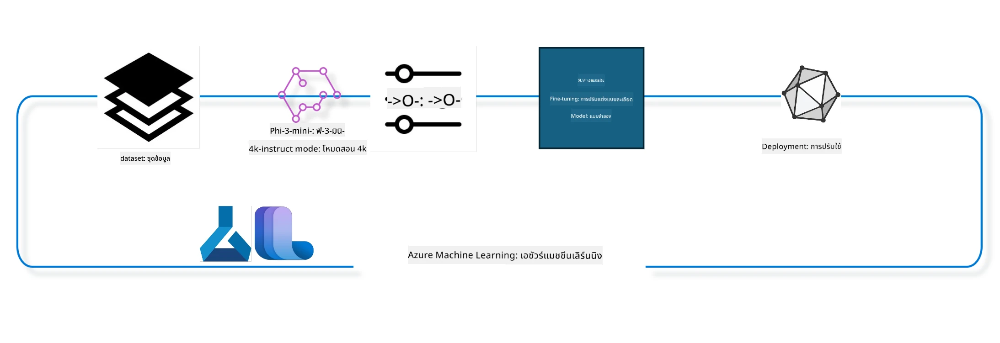

## วิธีใช้ส่วนประกอบ chat-completion จาก Azure ML system registry เพื่อปรับแต่งโมเดล

ในตัวอย่างนี้เราจะทำการปรับแต่งโมเดล Phi-3-mini-4k-instruct เพื่อให้สามารถสนทนาระหว่างคนสองคนได้โดยใช้ชุดข้อมูล ultrachat_200k



ตัวอย่างนี้จะแสดงวิธีการปรับแต่งโมเดลโดยใช้ Azure ML SDK และ Python จากนั้นนำโมเดลที่ปรับแต่งแล้วไปใช้งานบน endpoint ออนไลน์สำหรับการทำนายแบบเรียลไทม์

### ข้อมูลสำหรับการฝึก

เราจะใช้ชุดข้อมูล ultrachat_200k ซึ่งเป็นเวอร์ชันที่ผ่านการกรองอย่างเข้มงวดของชุดข้อมูล UltraChat และถูกใช้ในการฝึก Zephyr-7B-β ซึ่งเป็นโมเดลแชท 7b ที่ทันสมัยที่สุด

### โมเดล

เราจะใช้โมเดล Phi-3-mini-4k-instruct เพื่อแสดงวิธีการปรับแต่งโมเดลสำหรับงาน chat-completion หากคุณเปิดโน้ตบุ๊กนี้จากการ์ดโมเดลเฉพาะ ให้เปลี่ยนชื่อโมเดลให้ตรงกับโมเดลที่ต้องการ

### งานที่ต้องทำ

- เลือกโมเดลที่จะปรับแต่ง
- เลือกและสำรวจข้อมูลสำหรับฝึก
- กำหนดค่าการทำงานของงานปรับแต่ง
- รันงานปรับแต่ง
- ตรวจสอบผลการฝึกและการประเมิน
- ลงทะเบียนโมเดลที่ปรับแต่งแล้ว
- นำโมเดลที่ปรับแต่งไปใช้งานแบบเรียลไทม์
- ทำความสะอาดทรัพยากร

## 1. การตั้งค่าขั้นต้น

- ติดตั้ง dependencies
- เชื่อมต่อกับ AzureML Workspace ดูรายละเอียดเพิ่มเติมที่การตั้งค่า SDK authentication โดยเปลี่ยน <WORKSPACE_NAME>, <RESOURCE_GROUP> และ <SUBSCRIPTION_ID> ตามข้อมูลของคุณ
- เชื่อมต่อกับ azureml system registry
- ตั้งชื่อ experiment แบบไม่บังคับ
- ตรวจสอบหรือสร้าง compute

> [!NOTE]
> ต้องใช้โหนด GPU เดียวที่อาจมีหลายการ์ด GPU เช่น ในโหนด Standard_NC24rs_v3 มี NVIDIA V100 GPU 4 ตัว ส่วน Standard_NC12s_v3 มี 2 ตัว ดูรายละเอียดเพิ่มเติมในเอกสาร จำนวนการ์ด GPU ต่อโหนดถูกกำหนดในพารามิเตอร์ gpus_per_node ด้านล่าง การตั้งค่านี้ให้ถูกต้องจะช่วยให้ใช้ GPU ทั้งหมดในโหนดได้อย่างเต็มที่ SKU ของ GPU compute ที่แนะนำสามารถดูได้ที่นี่และที่นี่

### ไลบรารี Python

ติดตั้ง dependencies โดยรันเซลล์ด้านล่าง ขั้นตอนนี้ไม่ใช่ตัวเลือกหากรันในสภาพแวดล้อมใหม่

```bash
pip install azure-ai-ml
pip install azure-identity
pip install datasets==2.9.0
pip install mlflow
pip install azureml-mlflow
```

### การโต้ตอบกับ Azure ML

1. สคริปต์ Python นี้ใช้สำหรับโต้ตอบกับบริการ Azure Machine Learning (Azure ML) โดยมีรายละเอียดดังนี้:

    - นำเข้าโมดูลที่จำเป็นจาก azure.ai.ml, azure.identity และ azure.ai.ml.entities รวมถึงโมดูล time

    - พยายามยืนยันตัวตนด้วย DefaultAzureCredential() ซึ่งช่วยให้การยืนยันตัวตนง่ายขึ้นสำหรับการพัฒนาแอปพลิเคชันบน Azure หากล้มเหลวจะใช้ InteractiveBrowserCredential() ซึ่งเป็นการเข้าสู่ระบบแบบโต้ตอบ

    - จากนั้นพยายามสร้างอินสแตนซ์ MLClient โดยใช้ from_config ซึ่งอ่านค่าการตั้งค่าจากไฟล์ config.json หากล้มเหลวจะสร้าง MLClient โดยระบุ subscription_id, resource_group_name และ workspace_name ด้วยตนเอง

    - สร้าง MLClient อีกอินสแตนซ์หนึ่งสำหรับ Azure ML registry ชื่อ "azureml" ซึ่งเป็นที่เก็บโมเดล, pipeline สำหรับ fine-tuning และ environment

    - กำหนด experiment_name เป็น "chat_completion_Phi-3-mini-4k-instruct"

    - สร้าง timestamp ที่ไม่ซ้ำกันโดยแปลงเวลาปัจจุบัน (วินาทีตั้งแต่ epoch) เป็นจำนวนเต็มและแปลงเป็นสตริง ใช้สำหรับสร้างชื่อและเวอร์ชันที่ไม่ซ้ำกัน

    ```python
    # Import necessary modules from Azure ML and Azure Identity
    from azure.ai.ml import MLClient
    from azure.identity import (
        DefaultAzureCredential,
        InteractiveBrowserCredential,
    )
    from azure.ai.ml.entities import AmlCompute
    import time  # Import time module
    
    # Try to authenticate using DefaultAzureCredential
    try:
        credential = DefaultAzureCredential()
        credential.get_token("https://management.azure.com/.default")
    except Exception as ex:  # If DefaultAzureCredential fails, use InteractiveBrowserCredential
        credential = InteractiveBrowserCredential()
    
    # Try to create an MLClient instance using the default config file
    try:
        workspace_ml_client = MLClient.from_config(credential=credential)
    except:  # If that fails, create an MLClient instance by manually providing the details
        workspace_ml_client = MLClient(
            credential,
            subscription_id="<SUBSCRIPTION_ID>",
            resource_group_name="<RESOURCE_GROUP>",
            workspace_name="<WORKSPACE_NAME>",
        )
    
    # Create another MLClient instance for the Azure ML registry named "azureml"
    # This registry is where models, fine-tuning pipelines, and environments are stored
    registry_ml_client = MLClient(credential, registry_name="azureml")
    
    # Set the experiment name
    experiment_name = "chat_completion_Phi-3-mini-4k-instruct"
    
    # Generate a unique timestamp that can be used for names and versions that need to be unique
    timestamp = str(int(time.time()))
    ```

## 2. เลือกโมเดลพื้นฐานสำหรับปรับแต่ง

1. Phi-3-mini-4k-instruct เป็นโมเดลขนาด 3.8 พันล้านพารามิเตอร์ น้ำหนักเบา และทันสมัย สร้างขึ้นจากชุดข้อมูลที่ใช้กับ Phi-2 โมเดลนี้เป็นส่วนหนึ่งของตระกูล Phi-3 และเวอร์ชัน Mini มีสองแบบคือ 4K และ 128K ซึ่งหมายถึงความยาวบริบท (จำนวนโทเคน) ที่รองรับได้ เราจำเป็นต้องปรับแต่งโมเดลเพื่อใช้งานเฉพาะทาง คุณสามารถเรียกดูโมเดลเหล่านี้ได้ใน Model Catalog ของ AzureML Studio โดยกรองตามงาน chat-completion ในตัวอย่างนี้เราใช้โมเดล Phi-3-mini-4k-instruct หากคุณเปิดโน้ตบุ๊กนี้สำหรับโมเดลอื่น ให้เปลี่ยนชื่อและเวอร์ชันโมเดลให้เหมาะสม

    > [!NOTE]
    > คุณสมบัติ model id ของโมเดลนี้จะถูกส่งเป็นอินพุตให้กับงาน fine tuning และยังสามารถดูได้ในช่อง Asset ID บนหน้ารายละเอียดโมเดลใน Model Catalog ของ AzureML Studio

2. สคริปต์ Python นี้โต้ตอบกับบริการ Azure Machine Learning (Azure ML) โดยมีรายละเอียดดังนี้:

    - กำหนด model_name เป็น "Phi-3-mini-4k-instruct"

    - ใช้เมธอด get ของ models ใน registry_ml_client เพื่อดึงเวอร์ชันล่าสุดของโมเดลที่ระบุชื่อจาก Azure ML registry โดยเรียก get พร้อมอาร์กิวเมนต์สองตัวคือชื่อโมเดลและ label ที่ระบุให้ดึงเวอร์ชันล่าสุด

    - แสดงข้อความในคอนโซลแจ้งชื่อ, เวอร์ชัน และ id ของโมเดลที่จะใช้สำหรับการปรับแต่ง โดยใช้เมธอด format ของสตริงเพื่อแทรกข้อมูลเหล่านี้จากคุณสมบัติของ foundation_model

    ```python
    # Set the model name
    model_name = "Phi-3-mini-4k-instruct"
    
    # Get the latest version of the model from the Azure ML registry
    foundation_model = registry_ml_client.models.get(model_name, label="latest")
    
    # Print the model name, version, and id
    # This information is useful for tracking and debugging
    print(
        "\n\nUsing model name: {0}, version: {1}, id: {2} for fine tuning".format(
            foundation_model.name, foundation_model.version, foundation_model.id
        )
    )
    ```

## 3. สร้าง compute ที่จะใช้กับงาน

งาน fine tune ใช้งานได้เฉพาะกับ compute ที่มี GPU ขนาดของ compute ขึ้นอยู่กับขนาดของโมเดล และในหลายกรณีการเลือก compute ที่เหมาะสมอาจซับซ้อน ในเซลล์นี้เราจะแนะนำผู้ใช้เลือก compute ที่เหมาะสมกับงาน

> [!NOTE]
> compute ที่ระบุด้านล่างทำงานด้วยการตั้งค่าที่เหมาะสมที่สุด การเปลี่ยนแปลงใดๆ อาจทำให้เกิดข้อผิดพลาด Cuda Out Of Memory หากเกิดปัญหานี้ให้ลองอัปเกรด compute เป็นขนาดที่ใหญ่ขึ้น

> [!NOTE]
> ขณะเลือก compute_cluster_size ด้านล่าง ให้ตรวจสอบว่า compute นั้นมีอยู่ใน resource group ของคุณ หาก compute ใดไม่พร้อมใช้งาน คุณสามารถขอสิทธิ์เข้าถึงทรัพยากร compute ได้

### ตรวจสอบว่าโมเดลรองรับการปรับแต่งหรือไม่

1. สคริปต์ Python นี้โต้ตอบกับโมเดลใน Azure Machine Learning (Azure ML) โดยมีรายละเอียดดังนี้:

    - นำเข้าโมดูล ast ซึ่งใช้สำหรับประมวลผลโครงสร้างไวยากรณ์ของ Python

    - ตรวจสอบว่าอ็อบเจ็กต์ foundation_model (ซึ่งแทนโมเดลใน Azure ML) มีแท็กชื่อ finetune_compute_allow_list หรือไม่ แท็กใน Azure ML เป็นคู่คีย์-ค่า ที่ใช้กรองและจัดเรียงโมเดล

    - หากมีแท็ก finetune_compute_allow_list จะใช้ฟังก์ชัน ast.literal_eval เพื่อแปลงค่าของแท็ก (ซึ่งเป็นสตริง) เป็นลิสต์ Python จากนั้นกำหนดให้ตัวแปร computes_allow_list และแสดงข้อความแจ้งให้สร้าง compute จากลิสต์นี้

    - หากไม่มีแท็กนี้ จะตั้งค่า computes_allow_list เป็น None และแสดงข้อความแจ้งว่าแท็กนี้ไม่มีในแท็กของโมเดล

    - สรุปคือ สคริปต์นี้ตรวจสอบแท็กเฉพาะในเมตาดาต้าของโมเดล แปลงค่าของแท็กเป็นลิสต์ถ้ามี และแจ้งผลให้ผู้ใช้ทราบ

    ```python
    # Import the ast module, which provides functions to process trees of the Python abstract syntax grammar
    import ast
    
    # Check if the 'finetune_compute_allow_list' tag is present in the model's tags
    if "finetune_compute_allow_list" in foundation_model.tags:
        # If the tag is present, use ast.literal_eval to safely parse the tag's value (a string) into a Python list
        computes_allow_list = ast.literal_eval(
            foundation_model.tags["finetune_compute_allow_list"]
        )  # convert string to python list
        # Print a message indicating that a compute should be created from the list
        print(f"Please create a compute from the above list - {computes_allow_list}")
    else:
        # If the tag is not present, set computes_allow_list to None
        computes_allow_list = None
        # Print a message indicating that the 'finetune_compute_allow_list' tag is not part of the model's tags
        print("`finetune_compute_allow_list` is not part of model tags")
    ```

### ตรวจสอบ Compute Instance

1. สคริปต์ Python นี้โต้ตอบกับบริการ Azure Machine Learning (Azure ML) และตรวจสอบ compute instance หลายอย่าง โดยมีรายละเอียดดังนี้:

    - พยายามดึง compute instance ที่มีชื่อเก็บใน compute_cluster จาก Azure ML workspace หากสถานะ provisioning ของ compute instance เป็น "failed" จะเกิดข้อผิดพลาด ValueError

    - ตรวจสอบว่า computes_allow_list ไม่ใช่ None หากไม่ใช่ จะเปลี่ยนขนาด compute ทั้งหมดในลิสต์เป็นตัวพิมพ์เล็ก และตรวจสอบว่าขนาดของ compute instance ปัจจุบันอยู่ในลิสต์หรือไม่ หากไม่อยู่จะเกิดข้อผิดพลาด ValueError

    - หาก computes_allow_list เป็น None จะตรวจสอบว่าขนาด compute instance อยู่ในลิสต์ของขนาด GPU VM ที่ไม่รองรับหรือไม่ หากใช่จะเกิดข้อผิดพลาด ValueError

    - ดึงลิสต์ขนาด compute ทั้งหมดที่มีใน workspace จากนั้นวนลูปตรวจสอบแต่ละขนาด หากชื่อขนาดตรงกับขนาดของ compute instance ปัจจุบัน จะดึงจำนวน GPU ของขนาดนั้นและตั้งค่า gpu_count_found เป็น True

    - หาก gpu_count_found เป็น True จะแสดงจำนวน GPU ใน compute instance หากไม่ใช่จะเกิดข้อผิดพลาด ValueError

    - สรุปคือ สคริปต์นี้ตรวจสอบสถานะ provisioning, ขนาด compute เทียบกับลิสต์อนุญาตหรือลิสต์ปฏิเสธ และจำนวน GPU ของ compute instance ใน Azure ML workspace

    ```python
    # Print the exception message
    print(e)
    # Raise a ValueError if the compute size is not available in the workspace
    raise ValueError(
        f"WARNING! Compute size {compute_cluster_size} not available in workspace"
    )
    
    # Retrieve the compute instance from the Azure ML workspace
    compute = workspace_ml_client.compute.get(compute_cluster)
    # Check if the provisioning state of the compute instance is "failed"
    if compute.provisioning_state.lower() == "failed":
        # Raise a ValueError if the provisioning state is "failed"
        raise ValueError(
            f"Provisioning failed, Compute '{compute_cluster}' is in failed state. "
            f"please try creating a different compute"
        )
    
    # Check if computes_allow_list is not None
    if computes_allow_list is not None:
        # Convert all compute sizes in computes_allow_list to lowercase
        computes_allow_list_lower_case = [x.lower() for x in computes_allow_list]
        # Check if the size of the compute instance is in computes_allow_list_lower_case
        if compute.size.lower() not in computes_allow_list_lower_case:
            # Raise a ValueError if the size of the compute instance is not in computes_allow_list_lower_case
            raise ValueError(
                f"VM size {compute.size} is not in the allow-listed computes for finetuning"
            )
    else:
        # Define a list of unsupported GPU VM sizes
        unsupported_gpu_vm_list = [
            "standard_nc6",
            "standard_nc12",
            "standard_nc24",
            "standard_nc24r",
        ]
        # Check if the size of the compute instance is in unsupported_gpu_vm_list
        if compute.size.lower() in unsupported_gpu_vm_list:
            # Raise a ValueError if the size of the compute instance is in unsupported_gpu_vm_list
            raise ValueError(
                f"VM size {compute.size} is currently not supported for finetuning"
            )
    
    # Initialize a flag to check if the number of GPUs in the compute instance has been found
    gpu_count_found = False
    # Retrieve a list of all available compute sizes in the workspace
    workspace_compute_sku_list = workspace_ml_client.compute.list_sizes()
    available_sku_sizes = []
    # Iterate over the list of available compute sizes
    for compute_sku in workspace_compute_sku_list:
        available_sku_sizes.append(compute_sku.name)
        # Check if the name of the compute size matches the size of the compute instance
        if compute_sku.name.lower() == compute.size.lower():
            # If it does, retrieve the number of GPUs for that compute size and set gpu_count_found to True
            gpus_per_node = compute_sku.gpus
            gpu_count_found = True
    # If gpu_count_found is True, print the number of GPUs in the compute instance
    if gpu_count_found:
        print(f"Number of GPU's in compute {compute.size}: {gpus_per_node}")
    else:
        # If gpu_count_found is False, raise a ValueError
        raise ValueError(
            f"Number of GPU's in compute {compute.size} not found. Available skus are: {available_sku_sizes}."
            f"This should not happen. Please check the selected compute cluster: {compute_cluster} and try again."
        )
    ```

## 4. เลือกชุดข้อมูลสำหรับปรับแต่งโมเดล

1. เราใช้ชุดข้อมูล ultrachat_200k ชุดข้อมูลนี้แบ่งเป็นสี่ส่วน เหมาะสำหรับการปรับแต่งแบบมีผู้ควบคุม (Supervised fine-tuning หรือ sft) และการจัดอันดับการสร้าง (generation ranking หรือ gen) จำนวนตัวอย่างในแต่ละส่วนแสดงดังนี้:

    ```bash
    train_sft test_sft  train_gen  test_gen
    207865  23110  256032  28304
    ```

1. เซลล์ถัดไปแสดงการเตรียมข้อมูลพื้นฐานสำหรับการปรับแต่ง:

### แสดงตัวอย่างข้อมูลบางแถว

เราต้องการให้ตัวอย่างนี้รันได้เร็ว จึงบันทึกไฟล์ train_sft และ test_sft ที่มีเพียง 5% ของแถวที่ถูกตัดแต่งแล้ว ซึ่งหมายความว่าโมเดลที่ปรับแต่งจะมีความแม่นยำน้อยลง จึงไม่ควรนำไปใช้ในงานจริง
สคริปต์ download-dataset.py ใช้ดาวน์โหลดชุดข้อมูล ultrachat_200k และแปลงชุดข้อมูลให้อยู่ในรูปแบบที่ pipeline สำหรับ fine tuning สามารถใช้งานได้ เนื่องจากชุดข้อมูลมีขนาดใหญ่ เราจึงใช้เพียงส่วนหนึ่งของชุดข้อมูลเท่านั้น

1. การรันสคริปต์ด้านล่างจะดาวน์โหลดข้อมูลเพียง 5% ของชุดข้อมูลทั้งหมด สามารถเพิ่มเปอร์เซ็นต์ได้โดยเปลี่ยนพารามิเตอร์ dataset_split_pc เป็นเปอร์เซ็นต์ที่ต้องการ

    > [!NOTE]
    > โมเดลภาษาแต่ละตัวอาจมีรหัสภาษาที่แตกต่างกัน ดังนั้นชื่อคอลัมน์ในชุดข้อมูลควรสะท้อนภาษานั้นด้วย

1. ตัวอย่างข้อมูลควรมีลักษณะดังนี้
ชุดข้อมูล chat-completion จะเก็บในรูปแบบ parquet โดยแต่ละรายการมีโครงสร้างดังนี้:

    - นี่คือเอกสาร JSON (JavaScript Object Notation) ซึ่งเป็นรูปแบบแลกเปลี่ยนข้อมูลยอดนิยม ไม่ใช่โค้ดที่รันได้ แต่เป็นวิธีเก็บและส่งข้อมูล โครงสร้างมีดังนี้:

    - "prompt": คีย์นี้เก็บข้อความที่เป็นงานหรือคำถามที่ส่งให้ AI assistant

    - "messages": คีย์นี้เก็บอาร์เรย์ของอ็อบเจ็กต์ แต่ละอ็อบเจ็กต์แทนข้อความในการสนทนาระหว่างผู้ใช้และ AI assistant โดยแต่ละข้อความมีสองคีย์:

    - "content": ข้อความของข้อความนั้น
    - "role": บทบาทของผู้ส่งข้อความ อาจเป็น "user" หรือ "assistant"
    - "prompt_id": รหัสเฉพาะของ prompt นั้น

1. ในเอกสาร JSON นี้ การสนทนาแสดงถึงผู้ใช้ที่ขอให้ AI assistant สร้างตัวเอกสำหรับเรื่องราวดิสโทเปีย ผู้ช่วยตอบกลับ และผู้ใช้ขอรายละเอียดเพิ่มเติม ผู้ช่วยตกลงที่จะให้รายละเอียดเพิ่มเติม การสนทนาทั้งหมดเชื่อมโยงกับ prompt id เฉพาะ

    ```python
    {
        // The task or question posed to an AI assistant
        "prompt": "Create a fully-developed protagonist who is challenged to survive within a dystopian society under the rule of a tyrant. ...",
        
        // An array of objects, each representing a message in a conversation between a user and an AI assistant
        "messages":[
            {
                // The content of the user's message
                "content": "Create a fully-developed protagonist who is challenged to survive within a dystopian society under the rule of a tyrant. ...",
                // The role of the entity that sent the message
                "role": "user"
            },
            {
                // The content of the assistant's message
                "content": "Name: Ava\n\n Ava was just 16 years old when the world as she knew it came crashing down. The government had collapsed, leaving behind a chaotic and lawless society. ...",
                // The role of the entity that sent the message
                "role": "assistant"
            },
            {
                // The content of the user's message
                "content": "Wow, Ava's story is so intense and inspiring! Can you provide me with more details.  ...",
                // The role of the entity that sent the message
                "role": "user"
            }, 
            {
                // The content of the assistant's message
                "content": "Certainly! ....",
                // The role of the entity that sent the message
                "role": "assistant"
            }
        ],
        
        // A unique identifier for the prompt
        "prompt_id": "d938b65dfe31f05f80eb8572964c6673eddbd68eff3db6bd234d7f1e3b86c2af"
    }
    ```

### ดาวน์โหลดข้อมูล

1. สคริปต์ Python นี้ใช้ดาวน์โหลดชุดข้อมูลโดยใช้สคริปต์ช่วยชื่อ download-dataset.py โดยมีรายละเอียดดังนี้:

    - นำเข้าโมดูล os ซึ่งให้ฟังก์ชันที่พกพาได้สำหรับการใช้งานระบบปฏิบัติการ

    - ใช้ฟังก์ชัน os.system เพื่อรันสคริปต์ download-dataset.py ในเชลล์พร้อมอาร์กิวเมนต์ระบุชุดข้อมูลที่ต้องการดาวน์โหลด (HuggingFaceH4/ultrachat_200k), โฟลเดอร์ที่จะดาวน์โหลดไป (ultrachat_200k_dataset) และเปอร์เซ็นต์ของชุดข้อมูลที่จะแบ่ง (5) ค่าที่ส่งกลับจาก os.system จะเก็บในตัวแปร exit_status

    - ตรวจสอบว่า exit_status ไม่เท่ากับ 0 ซึ่งหมายถึงคำสั่งล้มเหลว หากล้มเหลวจะเกิด Exception พร้อมข้อความแจ้งข้อผิดพลาดในการดาวน์โหลดชุดข้อมูล

    - สรุปคือ สคริปต์นี้รันคำสั่งดาวน์โหลดชุดข้อมูลโดยใช้สคริปต์ช่วย และแจ้งข้อผิดพลาดหากคำสั่งล้มเหลว

    ```python
    # Import the os module, which provides a way of using operating system dependent functionality
    import os
    
    # Use the os.system function to run the download-dataset.py script in the shell with specific command-line arguments
    # The arguments specify the dataset to download (HuggingFaceH4/ultrachat_200k), the directory to download it to (ultrachat_200k_dataset), and the percentage of the dataset to split (5)
    # The os.system function returns the exit status of the command it executed; this status is stored in the exit_status variable
    exit_status = os.system(
        "python ./download-dataset.py --dataset HuggingFaceH4/ultrachat_200k --download_dir ultrachat_200k_dataset --dataset_split_pc 5"
    )
    
    # Check if exit_status is not 0
    # In Unix-like operating systems, an exit status of 0 usually indicates that a command has succeeded, while any other number indicates an error
    # If exit_status is not 0, raise an Exception with a message indicating that there was an error downloading the dataset
    if exit_status != 0:
        raise Exception("Error downloading dataset")
    ```

### โหลดข้อมูลเข้าสู่ DataFrame

1. สคริปต์ Python นี้โหลดไฟล์ JSON Lines เข้าสู่ pandas DataFrame และแสดง 5 แถวแรก โดยมีรายละเอียดดังนี้:

    - นำเข้าไลบรารี pandas ซึ่งเป็นไลบรารีสำหรับจัดการและวิเคราะห์ข้อมูลที่ทรงพลัง

    - ตั้งค่าความกว้างคอลัมน์สูงสุดของ pandas display options เป็น 0 หมายความว่าจะแสดงข้อความเต็มของแต่ละคอลัมน์โดยไม่ตัดทอนเมื่อแสดง DataFrame

    - ใช้ฟังก์ชัน pd.read_json เพื่อโหลดไฟล์ train_sft.jsonl จากโฟลเดอร์ ultrachat_200k_dataset เข้าสู่ DataFrame โดยตั้งค่า lines=True เพื่อระบุว่าไฟล์เป็น JSON Lines ซึ่งแต่ละบรรทัดเป็นอ็อบเจ็กต์ JSON แยกกัน
- ใช้วิธี head เพื่อแสดง 5 แถวแรกของ DataFrame หาก DataFrame มีแถวน้อยกว่า 5 แถว จะทำการแสดงทั้งหมด

- สรุปคือ สคริปต์นี้กำลังโหลดไฟล์ JSON Lines ลงใน DataFrame และแสดง 5 แถวแรกพร้อมข้อความเต็มของแต่ละคอลัมน์

```python
    # Import the pandas library, which is a powerful data manipulation and analysis library
    import pandas as pd
    
    # Set the maximum column width for pandas' display options to 0
    # This means that the full text of each column will be displayed without truncation when the DataFrame is printed
    pd.set_option("display.max_colwidth", 0)
    
    # Use the pd.read_json function to load the train_sft.jsonl file from the ultrachat_200k_dataset directory into a DataFrame
    # The lines=True argument indicates that the file is in JSON Lines format, where each line is a separate JSON object
    df = pd.read_json("./ultrachat_200k_dataset/train_sft.jsonl", lines=True)
    
    # Use the head method to display the first 5 rows of the DataFrame
    # If the DataFrame has less than 5 rows, it will display all of them
    df.head()
    ```

## 5. ส่งงาน fine tuning โดยใช้โมเดลและข้อมูลเป็นอินพุต

สร้างงานที่ใช้คอมโพเนนต์ pipeline สำหรับ chat-completion เรียนรู้เพิ่มเติมเกี่ยวกับพารามิเตอร์ทั้งหมดที่รองรับสำหรับการ fine tuning

### กำหนดพารามิเตอร์ finetune

1. พารามิเตอร์ finetune สามารถแบ่งออกเป็น 2 ประเภท คือ พารามิเตอร์การฝึกสอน และพารามิเตอร์การปรับแต่ง

1. พารามิเตอร์การฝึกสอนกำหนดลักษณะการฝึก เช่น -

    - ตัว optimizer และ scheduler ที่ใช้
    - เมตริกที่ใช้ในการปรับแต่ง finetune
    - จำนวนขั้นตอนการฝึกและขนาด batch เป็นต้น
    - พารามิเตอร์การปรับแต่งช่วยในการจัดการหน่วยความจำ GPU และใช้ทรัพยากรคอมพิวต์อย่างมีประสิทธิภาพ

1. ด้านล่างนี้เป็นตัวอย่างพารามิเตอร์ที่อยู่ในกลุ่มนี้ พารามิเตอร์การปรับแต่งจะแตกต่างกันไปตามแต่ละโมเดลและจะถูกบรรจุพร้อมกับโมเดลเพื่อจัดการความแตกต่างเหล่านี้

    - เปิดใช้งาน deepspeed และ LoRA
    - เปิดใช้งานการฝึกแบบ mixed precision
    - เปิดใช้งานการฝึกแบบ multi-node


> [!NOTE]
> การ finetuning แบบมีผู้ควบคุมอาจทำให้เกิดการสูญเสียการจัดแนวหรือการลืมอย่างรุนแรง เราแนะนำให้ตรวจสอบปัญหานี้และทำขั้นตอนการจัดแนวหลังจาก finetune เสร็จ

### พารามิเตอร์ Fine Tuning

1. สคริปต์ Python นี้กำลังตั้งค่าพารามิเตอร์สำหรับการ fine-tune โมเดลแมชชีนเลิร์นนิง โดยมีรายละเอียดดังนี้:

    - ตั้งค่าพารามิเตอร์การฝึกสอนเริ่มต้น เช่น จำนวน epoch ในการฝึก ขนาด batch สำหรับการฝึกและการประเมิน อัตราการเรียนรู้ และประเภท scheduler สำหรับอัตราการเรียนรู้

    - ตั้งค่าพารามิเตอร์การปรับแต่งเริ่มต้น เช่น การใช้ Layer-wise Relevance Propagation (LoRa) และ DeepSpeed รวมถึงระดับของ DeepSpeed

    - รวมพารามิเตอร์การฝึกสอนและการปรับแต่งเข้าด้วยกันในพจนานุกรมเดียวชื่อ finetune_parameters

    - ตรวจสอบว่า foundation_model มีพารามิเตอร์เริ่มต้นเฉพาะโมเดลหรือไม่ หากมีจะแสดงข้อความเตือนและอัปเดต finetune_parameters ด้วยพารามิเตอร์เฉพาะโมเดลเหล่านั้น โดยใช้ฟังก์ชัน ast.literal_eval เพื่อแปลงค่าจากสตริงเป็นพจนานุกรม Python

    - แสดงชุดพารามิเตอร์สุดท้ายที่ใช้สำหรับการรัน

    - สรุปคือ สคริปต์นี้กำลังตั้งค่าและแสดงพารามิเตอร์สำหรับการ fine-tune โมเดลแมชชีนเลิร์นนิง โดยสามารถแทนที่พารามิเตอร์เริ่มต้นด้วยพารามิเตอร์เฉพาะโมเดลได้

```python
    # Set up default training parameters such as the number of training epochs, batch sizes for training and evaluation, learning rate, and learning rate scheduler type
    training_parameters = dict(
        num_train_epochs=3,
        per_device_train_batch_size=1,
        per_device_eval_batch_size=1,
        learning_rate=5e-6,
        lr_scheduler_type="cosine",
    )
    
    # Set up default optimization parameters such as whether to apply Layer-wise Relevance Propagation (LoRa) and DeepSpeed, and the DeepSpeed stage
    optimization_parameters = dict(
        apply_lora="true",
        apply_deepspeed="true",
        deepspeed_stage=2,
    )
    
    # Combine the training and optimization parameters into a single dictionary called finetune_parameters
    finetune_parameters = {**training_parameters, **optimization_parameters}
    
    # Check if the foundation_model has any model-specific default parameters
    # If it does, print a warning message and update the finetune_parameters dictionary with these model-specific defaults
    # The ast.literal_eval function is used to convert the model-specific defaults from a string to a Python dictionary
    if "model_specific_defaults" in foundation_model.tags:
        print("Warning! Model specific defaults exist. The defaults could be overridden.")
        finetune_parameters.update(
            ast.literal_eval(  # convert string to python dict
                foundation_model.tags["model_specific_defaults"]
            )
        )
    
    # Print the final set of fine-tuning parameters that will be used for the run
    print(
        f"The following finetune parameters are going to be set for the run: {finetune_parameters}"
    )
    ```

### Training Pipeline

1. สคริปต์ Python นี้กำหนดฟังก์ชันเพื่อสร้างชื่อแสดงผลสำหรับ pipeline การฝึกสอนแมชชีนเลิร์นนิง จากนั้นเรียกใช้ฟังก์ชันนี้เพื่อสร้างและแสดงชื่อแสดงผล โดยมีรายละเอียดดังนี้:

1. ฟังก์ชัน get_pipeline_display_name ถูกกำหนดขึ้นเพื่อสร้างชื่อแสดงผลโดยอิงจากพารามิเตอร์ต่าง ๆ ที่เกี่ยวข้องกับ pipeline การฝึกสอน

1. ภายในฟังก์ชัน จะคำนวณขนาด batch รวมโดยการคูณขนาด batch ต่ออุปกรณ์ จำนวนขั้นตอนสะสม gradient จำนวน GPU ต่อโหนด และจำนวนโหนดที่ใช้ในการ fine-tuning

1. ดึงพารามิเตอร์อื่น ๆ เช่น ประเภท scheduler ของอัตราการเรียนรู้ การใช้ DeepSpeed ระดับของ DeepSpeed การใช้ Layer-wise Relevance Propagation (LoRa) จำนวน checkpoint ของโมเดลที่เก็บไว้ และความยาวลำดับสูงสุด

1. สร้างสตริงที่รวมพารามิเตอร์ทั้งหมดนี้โดยคั่นด้วยขีดกลาง หากใช้ DeepSpeed หรือ LoRa สตริงจะรวมคำว่า "ds" ตามด้วยระดับ DeepSpeed หรือ "lora" ตามลำดับ หากไม่ใช้จะเป็น "nods" หรือ "nolora"

1. ฟังก์ชันจะคืนค่าสตริงนี้ซึ่งใช้เป็นชื่อแสดงผลของ pipeline การฝึกสอน

1. หลังจากกำหนดฟังก์ชันแล้ว จะเรียกใช้เพื่อสร้างชื่อแสดงผลและแสดงผลออกมา

1. สรุปคือ สคริปต์นี้สร้างชื่อแสดงผลสำหรับ pipeline การฝึกสอนแมชชีนเลิร์นนิงโดยอิงจากพารามิเตอร์ต่าง ๆ และแสดงชื่อแสดงผลนั้น

```python
    # Define a function to generate a display name for the training pipeline
    def get_pipeline_display_name():
        # Calculate the total batch size by multiplying the per-device batch size, the number of gradient accumulation steps, the number of GPUs per node, and the number of nodes used for fine-tuning
        batch_size = (
            int(finetune_parameters.get("per_device_train_batch_size", 1))
            * int(finetune_parameters.get("gradient_accumulation_steps", 1))
            * int(gpus_per_node)
            * int(finetune_parameters.get("num_nodes_finetune", 1))
        )
        # Retrieve the learning rate scheduler type
        scheduler = finetune_parameters.get("lr_scheduler_type", "linear")
        # Retrieve whether DeepSpeed is applied
        deepspeed = finetune_parameters.get("apply_deepspeed", "false")
        # Retrieve the DeepSpeed stage
        ds_stage = finetune_parameters.get("deepspeed_stage", "2")
        # If DeepSpeed is applied, include "ds" followed by the DeepSpeed stage in the display name; if not, include "nods"
        if deepspeed == "true":
            ds_string = f"ds{ds_stage}"
        else:
            ds_string = "nods"
        # Retrieve whether Layer-wise Relevance Propagation (LoRa) is applied
        lora = finetune_parameters.get("apply_lora", "false")
        # If LoRa is applied, include "lora" in the display name; if not, include "nolora"
        if lora == "true":
            lora_string = "lora"
        else:
            lora_string = "nolora"
        # Retrieve the limit on the number of model checkpoints to keep
        save_limit = finetune_parameters.get("save_total_limit", -1)
        # Retrieve the maximum sequence length
        seq_len = finetune_parameters.get("max_seq_length", -1)
        # Construct the display name by concatenating all these parameters, separated by hyphens
        return (
            model_name
            + "-"
            + "ultrachat"
            + "-"
            + f"bs{batch_size}"
            + "-"
            + f"{scheduler}"
            + "-"
            + ds_string
            + "-"
            + lora_string
            + f"-save_limit{save_limit}"
            + f"-seqlen{seq_len}"
        )
    
    # Call the function to generate the display name
    pipeline_display_name = get_pipeline_display_name()
    # Print the display name
    print(f"Display name used for the run: {pipeline_display_name}")
    ```

### การกำหนดค่า Pipeline

สคริปต์ Python นี้กำหนดและกำหนดค่า pipeline สำหรับแมชชีนเลิร์นนิงโดยใช้ Azure Machine Learning SDK โดยมีรายละเอียดดังนี้:

1. นำเข้ามอดูลที่จำเป็นจาก Azure AI ML SDK

1. ดึงคอมโพเนนต์ pipeline ชื่อ "chat_completion_pipeline" จาก registry

1. กำหนดงาน pipeline โดยใช้ตัวตกแต่ง `@pipeline` และฟังก์ชัน `create_pipeline` โดยตั้งชื่อ pipeline เป็น `pipeline_display_name`

1. ภายในฟังก์ชัน `create_pipeline` จะเริ่มต้นคอมโพเนนต์ pipeline ที่ดึงมา พร้อมพารามิเตอร์ต่าง ๆ เช่น เส้นทางโมเดล คลัสเตอร์คอมพิวต์สำหรับแต่ละขั้นตอน การแบ่งชุดข้อมูลสำหรับฝึกและทดสอบ จำนวน GPU ที่ใช้สำหรับ fine-tuning และพารามิเตอร์ fine-tuning อื่น ๆ

1. แมปเอาต์พุตของงาน fine-tuning ไปยังเอาต์พุตของงาน pipeline เพื่อให้โมเดลที่ผ่านการ fine-tune สามารถลงทะเบียนได้ง่าย ซึ่งจำเป็นสำหรับการนำโมเดลไปใช้งานที่ endpoint แบบออนไลน์หรือแบบ batch

1. สร้างอินสแตนซ์ของ pipeline โดยเรียกใช้ฟังก์ชัน `create_pipeline`

1. ตั้งค่า `force_rerun` ของ pipeline เป็น `True` หมายความว่าจะไม่ใช้ผลลัพธ์ที่แคชจากงานก่อนหน้า

1. ตั้งค่า `continue_on_step_failure` ของ pipeline เป็น `False` หมายความว่า pipeline จะหยุดหากขั้นตอนใดล้มเหลว

1. สรุปคือ สคริปต์นี้กำหนดและกำหนดค่า pipeline สำหรับงาน chat completion โดยใช้ Azure Machine Learning SDK

```python
    # Import necessary modules from the Azure AI ML SDK
    from azure.ai.ml.dsl import pipeline
    from azure.ai.ml import Input
    
    # Fetch the pipeline component named "chat_completion_pipeline" from the registry
    pipeline_component_func = registry_ml_client.components.get(
        name="chat_completion_pipeline", label="latest"
    )
    
    # Define the pipeline job using the @pipeline decorator and the function create_pipeline
    # The name of the pipeline is set to pipeline_display_name
    @pipeline(name=pipeline_display_name)
    def create_pipeline():
        # Initialize the fetched pipeline component with various parameters
        # These include the model path, compute clusters for different stages, dataset splits for training and testing, the number of GPUs to use for fine-tuning, and other fine-tuning parameters
        chat_completion_pipeline = pipeline_component_func(
            mlflow_model_path=foundation_model.id,
            compute_model_import=compute_cluster,
            compute_preprocess=compute_cluster,
            compute_finetune=compute_cluster,
            compute_model_evaluation=compute_cluster,
            # Map the dataset splits to parameters
            train_file_path=Input(
                type="uri_file", path="./ultrachat_200k_dataset/train_sft.jsonl"
            ),
            test_file_path=Input(
                type="uri_file", path="./ultrachat_200k_dataset/test_sft.jsonl"
            ),
            # Training settings
            number_of_gpu_to_use_finetuning=gpus_per_node,  # Set to the number of GPUs available in the compute
            **finetune_parameters
        )
        return {
            # Map the output of the fine tuning job to the output of pipeline job
            # This is done so that we can easily register the fine tuned model
            # Registering the model is required to deploy the model to an online or batch endpoint
            "trained_model": chat_completion_pipeline.outputs.mlflow_model_folder
        }
    
    # Create an instance of the pipeline by calling the create_pipeline function
    pipeline_object = create_pipeline()
    
    # Don't use cached results from previous jobs
    pipeline_object.settings.force_rerun = True
    
    # Set continue on step failure to False
    # This means that the pipeline will stop if any step fails
    pipeline_object.settings.continue_on_step_failure = False
    ```

### ส่งงาน

1. สคริปต์ Python นี้ส่งงาน pipeline สำหรับแมชชีนเลิร์นนิงไปยัง workspace ของ Azure Machine Learning และรอจนกว่างานจะเสร็จสิ้น โดยมีรายละเอียดดังนี้:

    - เรียกใช้เมธอด create_or_update ของ jobs ใน workspace_ml_client เพื่อส่งงาน pipeline โดยระบุ pipeline ที่จะรันด้วย pipeline_object และระบุ experiment ที่จะรันงานด้วย experiment_name

    - จากนั้นเรียกใช้เมธอด stream ของ jobs ใน workspace_ml_client เพื่อรอให้งาน pipeline เสร็จสิ้น โดยระบุชื่องานที่ต้องรอด้วย attribute name ของ pipeline_job

    - สรุปคือ สคริปต์นี้ส่งงาน pipeline สำหรับแมชชีนเลิร์นนิงไปยัง workspace ของ Azure Machine Learning และรอจนกว่างานจะเสร็จสิ้น

```python
    # Submit the pipeline job to the Azure Machine Learning workspace
    # The pipeline to be run is specified by pipeline_object
    # The experiment under which the job is run is specified by experiment_name
    pipeline_job = workspace_ml_client.jobs.create_or_update(
        pipeline_object, experiment_name=experiment_name
    )
    
    # Wait for the pipeline job to complete
    # The job to wait for is specified by the name attribute of the pipeline_job object
    workspace_ml_client.jobs.stream(pipeline_job.name)
    ```

## 6. ลงทะเบียนโมเดลที่ผ่านการ fine tune กับ workspace

เราจะลงทะเบียนโมเดลจากเอาต์พุตของงาน fine tuning ซึ่งจะติดตามความสัมพันธ์ระหว่างโมเดลที่ผ่านการ fine tune กับงาน fine tuning งาน fine tuning ยังติดตามความสัมพันธ์ไปยัง foundation model ข้อมูล และโค้ดการฝึกสอน

### การลงทะเบียนโมเดล ML

1. สคริปต์ Python นี้ลงทะเบียนโมเดลแมชชีนเลิร์นนิงที่ผ่านการฝึกใน pipeline ของ Azure Machine Learning โดยมีรายละเอียดดังนี้:

    - นำเข้ามอดูลที่จำเป็นจาก Azure AI ML SDK

    - ตรวจสอบว่าเอาต์พุต trained_model มีอยู่จากงาน pipeline โดยเรียกใช้เมธอด get ของ jobs ใน workspace_ml_client และเข้าถึง attribute outputs

    - สร้างเส้นทางไปยังโมเดลที่ผ่านการฝึกโดยจัดรูปแบบสตริงด้วยชื่อของงาน pipeline และชื่อเอาต์พุต ("trained_model")

    - กำหนดชื่อสำหรับโมเดลที่ผ่านการ fine-tune โดยเพิ่ม "-ultrachat-200k" ต่อท้ายชื่อโมเดลเดิมและแทนที่เครื่องหมายทับด้วยขีดกลาง

    - เตรียมลงทะเบียนโมเดลโดยสร้างอ็อบเจ็กต์ Model พร้อมพารามิเตอร์ต่าง ๆ เช่น เส้นทางโมเดล ประเภทโมเดล (MLflow model) ชื่อและเวอร์ชันของโมเดล และคำอธิบายโมเดล

    - ลงทะเบียนโมเดลโดยเรียกใช้เมธอด create_or_update ของ models ใน workspace_ml_client โดยส่งอ็อบเจ็กต์ Model เป็นอาร์กิวเมนต์

    - แสดงผลโมเดลที่ลงทะเบียนแล้ว

1. สรุปคือ สคริปต์นี้ลงทะเบียนโมเดลแมชชีนเลิร์นนิงที่ผ่านการฝึกใน pipeline ของ Azure Machine Learning

```python
    # Import necessary modules from the Azure AI ML SDK
    from azure.ai.ml.entities import Model
    from azure.ai.ml.constants import AssetTypes
    
    # Check if the `trained_model` output is available from the pipeline job
    print("pipeline job outputs: ", workspace_ml_client.jobs.get(pipeline_job.name).outputs)
    
    # Construct a path to the trained model by formatting a string with the name of the pipeline job and the name of the output ("trained_model")
    model_path_from_job = "azureml://jobs/{0}/outputs/{1}".format(
        pipeline_job.name, "trained_model"
    )
    
    # Define a name for the fine-tuned model by appending "-ultrachat-200k" to the original model name and replacing any slashes with hyphens
    finetuned_model_name = model_name + "-ultrachat-200k"
    finetuned_model_name = finetuned_model_name.replace("/", "-")
    
    print("path to register model: ", model_path_from_job)
    
    # Prepare to register the model by creating a Model object with various parameters
    # These include the path to the model, the type of the model (MLflow model), the name and version of the model, and a description of the model
    prepare_to_register_model = Model(
        path=model_path_from_job,
        type=AssetTypes.MLFLOW_MODEL,
        name=finetuned_model_name,
        version=timestamp,  # Use timestamp as version to avoid version conflict
        description=model_name + " fine tuned model for ultrachat 200k chat-completion",
    )
    
    print("prepare to register model: \n", prepare_to_register_model)
    
    # Register the model by calling the create_or_update method of the models object in the workspace_ml_client with the Model object as the argument
    registered_model = workspace_ml_client.models.create_or_update(
        prepare_to_register_model
    )
    
    # Print the registered model
    print("registered model: \n", registered_model)
    ```

## 7. นำโมเดลที่ผ่านการ fine tune ไป deploy ที่ endpoint ออนไลน์

Online endpoint ให้ REST API ที่ทนทานซึ่งสามารถใช้เชื่อมต่อกับแอปพลิเคชันที่ต้องการใช้โมเดล

### จัดการ Endpoint

1. สคริปต์ Python นี้สร้าง managed online endpoint ใน Azure Machine Learning สำหรับโมเดลที่ลงทะเบียนแล้ว โดยมีรายละเอียดดังนี้:

    - นำเข้ามอดูลที่จำเป็นจาก Azure AI ML SDK

    - กำหนดชื่อเฉพาะสำหรับ online endpoint โดยเพิ่ม timestamp ต่อท้ายสตริง "ultrachat-completion-"

    - เตรียมสร้าง online endpoint โดยสร้างอ็อบเจ็กต์ ManagedOnlineEndpoint พร้อมพารามิเตอร์ต่าง ๆ เช่น ชื่อ endpoint คำอธิบาย และโหมดการยืนยันตัวตน ("key")

    - สร้าง online endpoint โดยเรียกใช้เมธอด begin_create_or_update ของ workspace_ml_client พร้อมอ็อบเจ็กต์ ManagedOnlineEndpoint จากนั้นรอจนกว่าการสร้างจะเสร็จสิ้นด้วยเมธอด wait

1. สรุปคือ สคริปต์นี้สร้าง managed online endpoint ใน Azure Machine Learning สำหรับโมเดลที่ลงทะเบียนแล้ว

```python
    # Import necessary modules from the Azure AI ML SDK
    from azure.ai.ml.entities import (
        ManagedOnlineEndpoint,
        ManagedOnlineDeployment,
        ProbeSettings,
        OnlineRequestSettings,
    )
    
    # Define a unique name for the online endpoint by appending a timestamp to the string "ultrachat-completion-"
    online_endpoint_name = "ultrachat-completion-" + timestamp
    
    # Prepare to create the online endpoint by creating a ManagedOnlineEndpoint object with various parameters
    # These include the name of the endpoint, a description of the endpoint, and the authentication mode ("key")
    endpoint = ManagedOnlineEndpoint(
        name=online_endpoint_name,
        description="Online endpoint for "
        + registered_model.name
        + ", fine tuned model for ultrachat-200k-chat-completion",
        auth_mode="key",
    )
    
    # Create the online endpoint by calling the begin_create_or_update method of the workspace_ml_client with the ManagedOnlineEndpoint object as the argument
    # Then wait for the creation operation to complete by calling the wait method
    workspace_ml_client.begin_create_or_update(endpoint).wait()
    ```

> [!NOTE]
> คุณสามารถดูรายชื่อ SKU ที่รองรับสำหรับการ deploy ได้ที่นี่ - [Managed online endpoints SKU list](https://learn.microsoft.com/azure/machine-learning/reference-managed-online-endpoints-vm-sku-list)

### การ deploy โมเดล ML

1. สคริปต์ Python นี้ deploy โมเดลแมชชีนเลิร์นนิงที่ลงทะเบียนแล้วไปยัง managed online endpoint ใน Azure Machine Learning โดยมีรายละเอียดดังนี้:

    - นำเข้าโมดูล ast ซึ่งให้ฟังก์ชันสำหรับประมวลผลโครงสร้างไวยากรณ์ Python

    - กำหนดประเภท instance สำหรับการ deploy เป็น "Standard_NC6s_v3"

    - ตรวจสอบว่ามีแท็ก inference_compute_allow_list ใน foundation model หรือไม่ หากมีจะแปลงค่าจากสตริงเป็นรายการ Python และกำหนดให้ inference_computes_allow_list หากไม่มีจะตั้งค่าเป็น None

    - ตรวจสอบว่าประเภท instance ที่ระบุอยู่ในรายการอนุญาตหรือไม่ หากไม่อยู่จะแสดงข้อความให้ผู้ใช้เลือกประเภท instance จากรายการอนุญาต

    - เตรียมสร้าง deployment โดยสร้างอ็อบเจ็กต์ ManagedOnlineDeployment พร้อมพารามิเตอร์ต่าง ๆ เช่น ชื่อ deployment ชื่อ endpoint ไอดีโมเดล ประเภทและจำนวน instance การตั้งค่า liveness probe และการตั้งค่าคำขอ

    - สร้าง deployment โดยเรียกใช้เมธอด begin_create_or_update ของ workspace_ml_client พร้อมอ็อบเจ็กต์ ManagedOnlineDeployment จากนั้นรอจนกว่าการสร้างจะเสร็จสิ้นด้วยเมธอด wait

    - ตั้งค่า traffic ของ endpoint ให้ส่ง 100% ของทราฟฟิกไปยัง deployment ชื่อ "demo"

    - อัปเดต endpoint โดยเรียกใช้เมธอด begin_create_or_update ของ workspace_ml_client พร้อมอ็อบเจ็กต์ endpoint จากนั้นรอจนกว่าการอัปเดตจะเสร็จสิ้นด้วยเมธอด result

1. สรุปคือ สคริปต์นี้ deploy โมเดลแมชชีนเลิร์นนิงที่ลงทะเบียนแล้วไปยัง managed online endpoint ใน Azure Machine Learning

```python
    # Import the ast module, which provides functions to process trees of the Python abstract syntax grammar
    import ast
    
    # Set the instance type for the deployment
    instance_type = "Standard_NC6s_v3"
    
    # Check if the `inference_compute_allow_list` tag is present in the foundation model
    if "inference_compute_allow_list" in foundation_model.tags:
        # If it is, convert the tag value from a string to a Python list and assign it to `inference_computes_allow_list`
        inference_computes_allow_list = ast.literal_eval(
            foundation_model.tags["inference_compute_allow_list"]
        )
        print(f"Please create a compute from the above list - {computes_allow_list}")
    else:
        # If it's not, set `inference_computes_allow_list` to `None`
        inference_computes_allow_list = None
        print("`inference_compute_allow_list` is not part of model tags")
    
    # Check if the specified instance type is in the allow list
    if (
        inference_computes_allow_list is not None
        and instance_type not in inference_computes_allow_list
    ):
        print(
            f"`instance_type` is not in the allow listed compute. Please select a value from {inference_computes_allow_list}"
        )
    
    # Prepare to create the deployment by creating a `ManagedOnlineDeployment` object with various parameters
    demo_deployment = ManagedOnlineDeployment(
        name="demo",
        endpoint_name=online_endpoint_name,
        model=registered_model.id,
        instance_type=instance_type,
        instance_count=1,
        liveness_probe=ProbeSettings(initial_delay=600),
        request_settings=OnlineRequestSettings(request_timeout_ms=90000),
    )
    
    # Create the deployment by calling the `begin_create_or_update` method of the `workspace_ml_client` with the `ManagedOnlineDeployment` object as the argument
    # Then wait for the creation operation to complete by calling the `wait` method
    workspace_ml_client.online_deployments.begin_create_or_update(demo_deployment).wait()
    
    # Set the traffic of the endpoint to direct 100% of the traffic to the "demo" deployment
    endpoint.traffic = {"demo": 100}
    
    # Update the endpoint by calling the `begin_create_or_update` method of the `workspace_ml_client` with the `endpoint` object as the argument
    # Then wait for the update operation to complete by calling the `result` method
    workspace_ml_client.begin_create_or_update(endpoint).result()
    ```

## 8. ทดสอบ endpoint ด้วยข้อมูลตัวอย่าง

เราจะดึงข้อมูลตัวอย่างจากชุดข้อมูลทดสอบและส่งไปยัง online endpoint เพื่อทำการทำนาย จากนั้นจะแสดงผลป้ายกำกับที่ได้พร้อมกับป้ายกำกับจริง

### การอ่านผลลัพธ์

1. สคริปต์ Python นี้อ่านไฟล์ JSON Lines ลงใน pandas DataFrame เลือกตัวอย่างแบบสุ่ม และรีเซ็ตดัชนี โดยมีรายละเอียดดังนี้:

    - อ่านไฟล์ ./ultrachat_200k_dataset/test_gen.jsonl ลงใน pandas DataFrame โดยใช้ฟังก์ชัน read_json พร้อมอาร์กิวเมนต์ lines=True เนื่องจากไฟล์เป็นรูปแบบ JSON Lines ที่แต่ละบรรทัดเป็นอ็อบเจ็กต์ JSON แยกกัน

    - เลือกตัวอย่างแบบสุ่ม 1 แถวจาก DataFrame โดยใช้ฟังก์ชัน sample พร้อมอาร์กิวเมนต์ n=1 เพื่อระบุจำนวนแถวสุ่ม

    - รีเซ็ตดัชนีของ DataFrame โดยใช้ฟังก์ชัน reset_index พร้อมอาร์กิวเมนต์ drop=True เพื่อทิ้งดัชนีเดิมและแทนที่ด้วยดัชนีใหม่ที่เป็นเลขจำนวนเต็มเริ่มต้น

    - แสดง 2 แถวแรกของ DataFrame โดยใช้ฟังก์ชัน head พร้อมอาร์กิวเมนต์ 2 แต่เนื่องจาก DataFrame มีเพียงแถวเดียวหลังการสุ่ม จึงจะแสดงแค่นั้น

1. สรุปคือ สคริปต์นี้อ่านไฟล์ JSON Lines ลงใน pandas DataFrame เลือกตัวอย่างแบบสุ่ม 1 แถว รีเซ็ตดัชนี และแสดงแถวแรก

```python
    # Import pandas library
    import pandas as pd
    
    # Read the JSON Lines file './ultrachat_200k_dataset/test_gen.jsonl' into a pandas DataFrame
    # The 'lines=True' argument indicates that the file is in JSON Lines format, where each line is a separate JSON object
    test_df = pd.read_json("./ultrachat_200k_dataset/test_gen.jsonl", lines=True)
    
    # Take a random sample of 1 row from the DataFrame
    # The 'n=1' argument specifies the number of random rows to select
    test_df = test_df.sample(n=1)
    
    # Reset the index of the DataFrame
    # The 'drop=True' argument indicates that the original index should be dropped and replaced with a new index of default integer values
    # The 'inplace=True' argument indicates that the DataFrame should be modified in place (without creating a new object)
    test_df.reset_index(drop=True, inplace=True)
    
    # Display the first 2 rows of the DataFrame
    # However, since the DataFrame only contains one row after the sampling, this will only display that one row
    test_df.head(2)
    ```

### สร้าง JSON Object

1. สคริปต์ Python นี้สร้างอ็อบเจ็กต์ JSON ด้วยพารามิเตอร์เฉพาะและบันทึกลงไฟล์ โดยมีรายละเอียดดังนี้:

    - นำเข้าโมดูล json ซึ่งให้ฟังก์ชันสำหรับจัดการข้อมูล JSON

    - สร้างพจนานุกรม parameters ที่มีคีย์และค่าซึ่งแทนพารามิเตอร์สำหรับโมเดลแมชชีนเลิร์นนิง คีย์ได้แก่ "temperature", "top_p", "do_sample", และ "max_new_tokens" โดยมีค่าตามลำดับคือ 0.6, 0.9, True, และ 200

    - สร้างพจนานุกรมอีกตัวชื่อ test_json ที่มีคีย์สองตัวคือ "input_data" และ "params" โดยค่า "input_data" เป็นพจนานุกรมอีกชั้นหนึ่งที่มีคีย์ "input_string" และ "parameters" ค่า "input_string" เป็นลิสต์ที่มีข้อความแรกจาก DataFrame test_df ส่วนค่า "parameters" คือพจนานุกรม parameters ที่สร้างไว้ก่อนหน้า ค่า "params" เป็นพจนานุกรมว่างเปล่า
- มันเปิดไฟล์ชื่อ sample_score.json

```python
    # Import the json module, which provides functions to work with JSON data
    import json
    
    # Create a dictionary `parameters` with keys and values that represent parameters for a machine learning model
    # The keys are "temperature", "top_p", "do_sample", and "max_new_tokens", and their corresponding values are 0.6, 0.9, True, and 200 respectively
    parameters = {
        "temperature": 0.6,
        "top_p": 0.9,
        "do_sample": True,
        "max_new_tokens": 200,
    }
    
    # Create another dictionary `test_json` with two keys: "input_data" and "params"
    # The value of "input_data" is another dictionary with keys "input_string" and "parameters"
    # The value of "input_string" is a list containing the first message from the `test_df` DataFrame
    # The value of "parameters" is the `parameters` dictionary created earlier
    # The value of "params" is an empty dictionary
    test_json = {
        "input_data": {
            "input_string": [test_df["messages"][0]],
            "parameters": parameters,
        },
        "params": {},
    }
    
    # Open a file named `sample_score.json` in the `./ultrachat_200k_dataset` directory in write mode
    with open("./ultrachat_200k_dataset/sample_score.json", "w") as f:
        # Write the `test_json` dictionary to the file in JSON format using the `json.dump` function
        json.dump(test_json, f)
    ```

### การเรียกใช้งาน Endpoint

1. สคริปต์ Python นี้กำลังเรียกใช้งาน endpoint ออนไลน์ใน Azure Machine Learning เพื่อประเมินคะแนนไฟล์ JSON โดยมีรายละเอียดดังนี้:

    - มันเรียกใช้เมธอด invoke ของคุณสมบัติ online_endpoints ของอ็อบเจ็กต์ workspace_ml_client เมธอดนี้ใช้ส่งคำขอไปยัง endpoint ออนไลน์และรับการตอบกลับ

    - ระบุชื่อของ endpoint และ deployment ผ่านอาร์กิวเมนต์ endpoint_name และ deployment_name ในกรณีนี้ ชื่อ endpoint ถูกเก็บไว้ในตัวแปร online_endpoint_name และชื่อ deployment คือ "demo"

    - ระบุเส้นทางไปยังไฟล์ JSON ที่จะประเมินคะแนนผ่านอาร์กิวเมนต์ request_file ในกรณีนี้ไฟล์คือ ./ultrachat_200k_dataset/sample_score.json

    - เก็บการตอบกลับจาก endpoint ไว้ในตัวแปร response

    - แสดงผลการตอบกลับดิบ

1. สรุปคือ สคริปต์นี้กำลังเรียกใช้งาน endpoint ออนไลน์ใน Azure Machine Learning เพื่อประเมินคะแนนไฟล์ JSON และแสดงผลการตอบกลับ

```python
    # Invoke the online endpoint in Azure Machine Learning to score the `sample_score.json` file
    # The `invoke` method of the `online_endpoints` property of the `workspace_ml_client` object is used to send a request to an online endpoint and get a response
    # The `endpoint_name` argument specifies the name of the endpoint, which is stored in the `online_endpoint_name` variable
    # The `deployment_name` argument specifies the name of the deployment, which is "demo"
    # The `request_file` argument specifies the path to the JSON file to be scored, which is `./ultrachat_200k_dataset/sample_score.json`
    response = workspace_ml_client.online_endpoints.invoke(
        endpoint_name=online_endpoint_name,
        deployment_name="demo",
        request_file="./ultrachat_200k_dataset/sample_score.json",
    )
    
    # Print the raw response from the endpoint
    print("raw response: \n", response, "\n")
    ```

## 9. ลบ online endpoint

1. อย่าลืมลบ online endpoint ออก มิฉะนั้นจะทำให้ระบบคิดค่าบริการสำหรับการใช้งานคอมพิวต์ของ endpoint นั้น โค้ด Python บรรทัดนี้กำลังลบ online endpoint ใน Azure Machine Learning โดยมีรายละเอียดดังนี้:

    - เรียกใช้เมธอด begin_delete ของคุณสมบัติ online_endpoints ของอ็อบเจ็กต์ workspace_ml_client เมธอดนี้ใช้เริ่มต้นการลบ online endpoint

    - ระบุชื่อของ endpoint ที่จะลบผ่านอาร์กิวเมนต์ name ในกรณีนี้ชื่อ endpoint ถูกเก็บไว้ในตัวแปร online_endpoint_name

    - เรียกใช้เมธอด wait เพื่อรอให้การลบเสร็จสมบูรณ์ นี่เป็นการทำงานแบบบล็อก ซึ่งหมายความว่าจะหยุดสคริปต์ไม่ให้ทำงานต่อจนกว่าการลบจะเสร็จ

    - สรุปคือ โค้ดบรรทัดนี้กำลังเริ่มต้นการลบ online endpoint ใน Azure Machine Learning และรอให้การลบเสร็จสมบูรณ์

```python
    # Delete the online endpoint in Azure Machine Learning
    # The `begin_delete` method of the `online_endpoints` property of the `workspace_ml_client` object is used to start the deletion of an online endpoint
    # The `name` argument specifies the name of the endpoint to be deleted, which is stored in the `online_endpoint_name` variable
    # The `wait` method is called to wait for the deletion operation to complete. This is a blocking operation, meaning that it will prevent the script from continuing until the deletion is finished
    workspace_ml_client.online_endpoints.begin_delete(name=online_endpoint_name).wait()
    ```

**ข้อจำกัดความรับผิดชอบ**:  
เอกสารนี้ได้รับการแปลโดยใช้บริการแปลภาษาอัตโนมัติ [Co-op Translator](https://github.com/Azure/co-op-translator) แม้เราจะพยายามให้ความถูกต้องสูงสุด แต่โปรดทราบว่าการแปลอัตโนมัติอาจมีข้อผิดพลาดหรือความไม่ถูกต้อง เอกสารต้นฉบับในภาษาต้นทางถือเป็นแหล่งข้อมูลที่เชื่อถือได้ สำหรับข้อมูลที่สำคัญ ขอแนะนำให้ใช้บริการแปลโดยผู้เชี่ยวชาญมนุษย์ เราไม่รับผิดชอบต่อความเข้าใจผิดหรือการตีความผิดใด ๆ ที่เกิดจากการใช้การแปลนี้