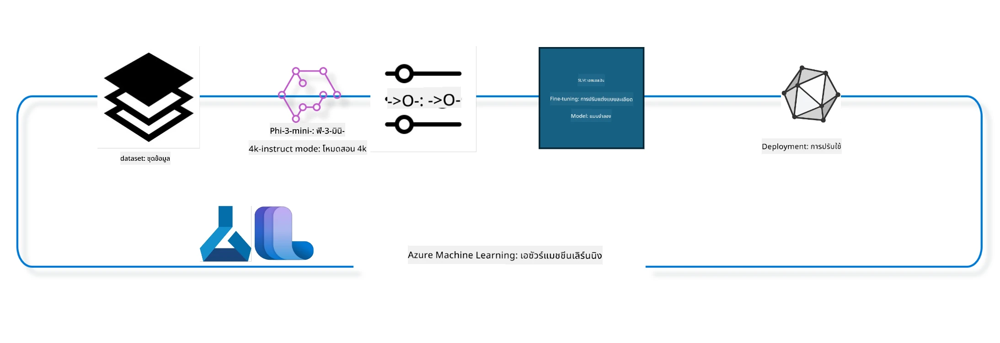

## วิธีใช้ chat-completion components จาก Azure ML system registry เพื่อทำ fine-tune โมเดล

ในตัวอย่างนี้เราจะทำการ fine tuning โมเดล Phi-3-mini-4k-instruct เพื่อให้โมเดลสามารถสนทนาระหว่าง 2 คนโดยใช้ชุดข้อมูล ultrachat_200k



ตัวอย่างนี้จะสอนวิธีทำ fine tuning โดยใช้ Azure ML SDK และ Python จากนั้นจึง deploy โมเดลที่ผ่านการ fine tuning ไปยัง online endpoint สำหรับ inference แบบเรียลไทม์

### ข้อมูลฝึกสอน

เราจะใช้ชุดข้อมูล ultrachat_200k ซึ่งเป็นเวอร์ชันที่กรองมาอย่างละเอียดของชุดข้อมูล UltraChat และใช้ในการฝึก Zephyr-7B-β ซึ่งเป็นโมเดลแชท 7b ที่ทันสมัย

### โมเดล

เราจะใช้โมเดล Phi-3-mini-4k-instruct เพื่อแสดงการทำ fine tune สำหรับงาน chat-completion หากคุณเปิดโน้ตบุ๊กนี้จากบัตรโมเดลใดโดยเฉพาะ โปรดเปลี่ยนชื่อโมเดลให้ตรงกับที่ต้องการ

### งานที่ต้องทำ

- เลือกโมเดลสำหรับ fine tune
- เลือกและสำรวจข้อมูลฝึกสอน
- กำหนดค่า job สำหรับ fine tuning
- เรียกใช้ job สำหรับ fine tuning
- ตรวจสอบค่า metric การฝึกสอนและประเมินผล
- ลงทะเบียนโมเดลที่ผ่านการ fine tune
- นำโมเดลที่ผ่านการ fine tune ไป deploy สำหรับ inference แบบเรียลไทม์
- ทำความสะอาดทรัพยากรหลังใช้งาน

## 1. การเตรียมความพร้อม

- ติดตั้ง dependencies
- เชื่อมต่อกับ AzureML Workspace ศึกษาข้อมูลเพิ่มเติมที่ set up SDK authentication แทนที่ <WORKSPACE_NAME>, <RESOURCE_GROUP> และ <SUBSCRIPTION_ID> ด้านล่างนี้
- เชื่อมต่อกับ azureml system registry
- ตั้งชื่อ experiment แบบไม่บังคับ
- ตรวจสอบหรือสร้าง compute

> [!NOTE]
> ความต้องการคือโหนด GPU เดียวสามารถมีการ์ด GPU หลายใบได้ เช่น โหนด Standard_NC24rs_v3 มี GPU NVIDIA V100 จำนวน 4 ใบ ในขณะที่ Standard_NC12s_v3 มี 2 ใบ โปรดดูเอกสารสำหรับรายละเอียดนี้ จำนวนการ์ด GPU ต่อโหนดจะถูกตั้งในพารามิเตอร์ gpus_per_node ด้านล่าง หากตั้งค่านี้ถูกต้องจะใช้การ์ด GPU ทุกใบในโหนดได้เต็มที่ SKU ของ GPU compute ที่แนะนำสามารถดูได้ที่นี่และที่นี่

### ไลบรารี Python

ติดตั้ง dependencies โดยรันเซลล์ด้านล่าง ขั้นตอนนี้ไม่ใช่ตัวเลือกหากรันในสภาพแวดล้อมใหม่

```bash
pip install azure-ai-ml
pip install azure-identity
pip install datasets==2.9.0
pip install mlflow
pip install azureml-mlflow
```

### การโต้ตอบกับ Azure ML

1. สคริปต์ Python นี้ใช้สำหรับโต้ตอบกับบริการ Azure Machine Learning (Azure ML) โดยทำงานดังนี้:

    - นำเข้าโมดูลที่จำเป็นจาก azure.ai.ml, azure.identity, และ azure.ai.ml.entities รวมถึงโมดูล time

    - พยายามทำการพิสูจน์ตัวตนโดยใช้ DefaultAzureCredential() ซึ่งช่วยให้การทำแอปพลิเคชันทำได้ง่ายขึ้นบนคลาวด์ Azure หากไม่สำเร็จจะเปลี่ยนไปใช้ InteractiveBrowserCredential() เพื่อให้สามารถล็อกอินแบบโต้ตอบได้

    - พยายามสร้างอินสแตนซ์ MLClient โดยวิธี from_config เพื่ออ่านค่าการกำหนดค่าจากไฟล์ config.json หากล้มเหลวจะสร้าง MLClient ด้วยการระบุ subscription_id, resource_group_name และ workspace_name ด้วยตนเอง

    - สร้าง MLClient อีกอินสแตนซ์ สำหรับ Azure ML registry ชื่อ "azureml" ซึ่งเก็บโมเดล, pipeline สำหรับ fine-tuning และ environment

    - ตั้งชื่อ experiment เป็น "chat_completion_Phi-3-mini-4k-instruct"

    - สร้าง timestamp แบบไม่ซ้ำกันโดยแปลงเวลาปัจจุบัน (วินาทีตั้งแต่ epoch ในรูปแบบเลขทศนิยม) เป็นจำนวนเต็มแล้วแปลงเป็นสตริง สามารถใช้สร้างชื่อและเวอร์ชันที่ไม่ซ้ำกัน

    ```python
    # นำเข้ามอดูลที่จำเป็นจาก Azure ML และ Azure Identity
    from azure.ai.ml import MLClient
    from azure.identity import (
        DefaultAzureCredential,
        InteractiveBrowserCredential,
    )
    from azure.ai.ml.entities import AmlCompute
    import time  # นำเข้ามอดูล time
    
    # พยายามยืนยันตัวตนโดยใช้ DefaultAzureCredential
    try:
        credential = DefaultAzureCredential()
        credential.get_token("https://management.azure.com/.default")
    except Exception as ex:  # หาก DefaultAzureCredential ล้มเหลว ให้ใช้ InteractiveBrowserCredential
        credential = InteractiveBrowserCredential()
    
    # พยายามสร้างอินสแตนซ์ MLClient โดยใช้ไฟล์ config เริ่มต้น
    try:
        workspace_ml_client = MLClient.from_config(credential=credential)
    except:  # หากล้มเหลว ให้สร้างอินสแตนซ์ MLClient โดยระบุรายละเอียดด้วยตนเอง
        workspace_ml_client = MLClient(
            credential,
            subscription_id="<SUBSCRIPTION_ID>",
            resource_group_name="<RESOURCE_GROUP>",
            workspace_name="<WORKSPACE_NAME>",
        )
    
    # สร้างอินสแตนซ์ MLClient อีกตัวสำหรับรีจิสทรี Azure ML ที่ชื่อ "azureml"
    # รีจิสทรีนี้เป็นที่จัดเก็บโมเดล ท่อปรับแต่ง และสภาพแวดล้อม
    registry_ml_client = MLClient(credential, registry_name="azureml")
    
    # ตั้งชื่อทดลอง
    experiment_name = "chat_completion_Phi-3-mini-4k-instruct"
    
    # สร้างเวลาปัจจุบันที่ไม่ซ้ำกันเพื่อใช้กับชื่อและเวอร์ชันที่ต้องไม่ซ้ำกัน
    timestamp = str(int(time.time()))
    ```

## 2. เลือก foundation model สำหรับ fine tune

1. Phi-3-mini-4k-instruct เป็นโมเดลน้ำหนักเบามีพารามิเตอร์ 3.8 พันล้านตัว ซึ่งเป็นโมเดล state-of-the-art ที่สร้างบนชุดข้อมูลที่ใช้สำหรับ Phi-2 โมเดลนี้เป็นหนึ่งในตระกูล Phi-3 และเวอร์ชัน Mini มีสองแบบคือ 4K และ 128K ซึ่งหมายถึงความยาวบริบท (จำนวนโทเคน) ที่รองรับ เราจำเป็นต้อง fine tune โมเดลนี้เพื่อใช้งานเฉพาะทาง คุณสามารถเรียกดูโมเดลเหล่านี้ใน Model Catalog บน AzureML Studio โดยกรองด้วยงาน chat-completion ในตัวอย่างนี้เราใช้โมเดล Phi-3-mini-4k-instruct หากคุณเปิดโน้ตบุ๊กนี้สำหรับโมเดลอื่น โปรดเปลี่ยนชื่อและเวอร์ชันโมเดลให้ตรง

> [!NOTE]
> คุณสมบัติ model id ของโมเดลนี้จะถูกส่งไปเป็นข้อมูลนำเข้าในงาน fine tuning นอกจากนี้ยังพบได้ในช่อง Asset ID บนหน้ารายละเอียดโมเดลใน Model Catalog ของ AzureML Studio

2. สคริปต์ Python นี้โต้ตอบกับบริการ Azure Machine Learning ดังนี้:

    - ตั้งตัวแปร model_name เป็น "Phi-3-mini-4k-instruct"

    - ใช้วิธี get ของ properties models ใน registry_ml_client เพื่อดึงเวอร์ชันล่าสุดของโมเดลที่ระบุชื่อจาก Azure ML registry โดย get รับอาร์กิวเมนต์สองตัวคือชื่อโมเดลและ label ที่ระบุให้ดึงเวอร์ชันล่าสุด

    - พิมพ์ข้อความในคอนโซลโดยแสดงชื่อ, เวอร์ชัน, และ id ของโมเดลที่จะใช้สำหรับ fine tuning โดยใช้ format กับสตริงและเข้าถึงคุณสมบัติเหล่านี้จาก foundation_model

    ```python
    # กำหนดชื่อโมเดล
    model_name = "Phi-3-mini-4k-instruct"
    
    # ดึงเวอร์ชันล่าสุดของโมเดลจาก Azure ML registry
    foundation_model = registry_ml_client.models.get(model_name, label="latest")
    
    # พิมพ์ชื่อโมเดล เวอร์ชัน และไอดี
    # ข้อมูลนี้มีประโยชน์สำหรับการติดตามและแก้ไขข้อผิดพลาด
    print(
        "\n\nUsing model name: {0}, version: {1}, id: {2} for fine tuning".format(
            foundation_model.name, foundation_model.version, foundation_model.id
        )
    )
    ```

## 3. สร้าง compute สำหรับใช้งานกับงาน fine tune

งาน fine tune นี้ทำงานได้เฉพาะกับ compute ที่ใช้ GPU เท่านั้น ขนาดของ compute ขึ้นกับขนาดโมเดลและในหลายกรณีเป็นเรื่องยากที่จะเลือก compute ที่เหมาะสม ในเซลล์นี้เราจะช่วยผู้ใช้เลือก compute ที่เหมาะสม

> [!NOTE]
> compute ที่แสดงด้านล่างนี้ทำงานกับการกำหนดค่าที่ปรับแต่งไว้สูงสุด การเปลี่ยนแปลงการตั้งค่าอาจทำให้เกิดข้อผิดพลาด Cuda Out Of Memory ในกรณีนี้ลองอัปเกรดขนาด compute ให้ใหญ่ขึ้น

> [!NOTE]
> ขณะเลือก compute_cluster_size ด้านล่าง ให้แน่ใจว่า compute นั้นมีอยู่ใน resource group ของคุณ หาก compute ใดไม่พร้อมใช้งาน คุณสามารถขอสิทธิ์เข้าถึง compute ดังกล่าวได้

### ตรวจสอบความสามารถของโมเดลสำหรับ Fine Tuning

1. สคริปต์ Python นี้โต้ตอบกับโมเดล Azure Machine Learning ดังนี้:

    - นำเข้าโมดูล ast ซึ่งให้ฟังก์ชันในการประมวลผลโครงสร้างไวยากรณ์ต้นแบบของ Python

    - ตรวจสอบว่า foundation_model (ซึ่งแทนโมเดลใน Azure ML) มีแท็กชื่อ finetune_compute_allow_list หรือไม่ แท็กใน Azure ML คือคู่ค่า key-value ที่ใช้สร้างและกรองโมเดล

    - หากมีแท็ก finetune_compute_allow_list จะใช้ ast.literal_eval เพื่อประมวลผลค่าของแท็ก (ซึ่งเป็นสตริง) ไปเป็นรายการ Python แล้วโยนค่าลงในตัวแปร computes_allow_list จากนั้นพิมพ์ข้อความแจ้งว่าสร้าง compute จากรายการนี้

    - หากไม่มีแท็กนี้ จะตั้ง computes_allow_list เป็น None และพิมพ์ข้อความแจ้งว่าแท็ก finetune_compute_allow_list ไม่อยู่ในแท็กโมเดล

    - สรุปคือ สคริปต์นี้ตรวจสอบแท็กเฉพาะใน metadata ของโมเดล แปลงค่าแท็กเป็นรายการถ้ามี และแสดงผลให้ผู้ใช้ทราบ

    ```python
    # นำเข้าโมดูล ast ซึ่งให้ฟังก์ชันในการประมวลผลต้นไม้ของไวยากรณ์นามธรรมของ Python
    import ast
    
    # ตรวจสอบว่ามีแท็ก 'finetune_compute_allow_list' อยู่ในแท็กของโมเดลหรือไม่
    if "finetune_compute_allow_list" in foundation_model.tags:
        # หากมีแท็กนี้ ใช้ ast.literal_eval เพื่อแปลงค่าของแท็ก (ซึ่งเป็นสตริง) ให้เป็นลิสต์ของ Python อย่างปลอดภัย
        computes_allow_list = ast.literal_eval(
            foundation_model.tags["finetune_compute_allow_list"]
        )  # แปลงสตริงเป็นลิสต์ของ Python
        # พิมพ์ข้อความที่บ่งบอกว่าควรสร้าง compute จากลิสต์นี้
        print(f"Please create a compute from the above list - {computes_allow_list}")
    else:
        # หากไม่มีแท็กนี้ ให้ตั้งค่า computes_allow_list เป็น None
        computes_allow_list = None
        # พิมพ์ข้อความที่บ่งชี้ว่าแท็ก 'finetune_compute_allow_list' ไม่ใช่ส่วนหนึ่งของแท็กของโมเดล
        print("`finetune_compute_allow_list` is not part of model tags")
    ```

### ตรวจสอบ Compute Instance

1. สคริปต์ Python นี้โต้ตอบกับบริการ Azure Machine Learning และตรวจสอบ compute instance ดังนี้:

    - พยายามดึง compute instance ที่ชื่อเก็บใน compute_cluster จาก workspace ของ Azure ML หากสถานะการ provision ของ compute instance คือ "failed" จะระเบิด ValueError

    - ตรวจสอบว่า computes_allow_list ไม่ใช่ None ถ้าไม่ใช่ จะเปลี่ยนชื่อ compute size ในรายการเป็นพิมพ์เล็กทั้งหมด แล้วตรวจสอบว่าขนาด compute instance ปัจจุบันอยู่ในรายการหรือไม่ ถ้าไม่อยู่จะระเบิด ValueError

    - หาก computes_allow_list เป็น None จะตรวจสอบว่าขนาด compute instance อยู่ในรายการ VM ขนาด GPU ที่ไม่รองรับหรือไม่ ถ้าใช่ จะระเบิด ValueError

    - ดึงรายการขนาด compute ทั้งหมดใน workspace แล้ววนลูปตรวจสอบว่าชื่อรายการตรงกับขนาด compute ปัจจุบันหรือไม่ หากตรงจะดึงจำนวน GPU ของขนาด compute นั้นและตั้ง gpu_count_found เป็น True

    - หาก gpu_count_found เป็น True จะพิมพ์จำนวน GPU ของ compute instance หากไม่ใช่จะระเบิด ValueError

    - สรุป สคริปต์นี้ตรวจสอบหลายอย่างกับ compute instance ใน workspace Azure ML รวมทั้งสถานะการ provision ขนาดของ compute กับรายการอนุญาตหรือปฏิเสธ และจำนวน GPU ในเครื่อง

    ```python
    # พิมพ์ข้อความข้อยกเว้น
    print(e)
    # ยกข้อยกเว้น ValueError หากขนาดการคำนวณไม่พร้อมใช้งานในพื้นที่ทำงาน
    raise ValueError(
        f"WARNING! Compute size {compute_cluster_size} not available in workspace"
    )
    
    # ดึงข้อมูลตัวอย่างการคำนวณจากพื้นที่ทำงาน Azure ML
    compute = workspace_ml_client.compute.get(compute_cluster)
    # ตรวจสอบสถานะการจัดเตรียมของตัวอย่างการคำนวณว่าเป็น "failed" หรือไม่
    if compute.provisioning_state.lower() == "failed":
        # ยกข้อยกเว้น ValueError หากสถานะการจัดเตรียมเป็น "failed"
        raise ValueError(
            f"Provisioning failed, Compute '{compute_cluster}' is in failed state. "
            f"please try creating a different compute"
        )
    
    # ตรวจสอบว่า computes_allow_list ไม่ใช่ None
    if computes_allow_list is not None:
        # แปลงขนาดการคำนวณทั้งหมดใน computes_allow_list เป็นตัวพิมพ์เล็ก
        computes_allow_list_lower_case = [x.lower() for x in computes_allow_list]
        # ตรวจสอบว่าขนาดตัวอย่างการคำนวณอยู่ใน computes_allow_list_lower_case หรือไม่
        if compute.size.lower() not in computes_allow_list_lower_case:
            # ยกข้อยกเว้น ValueError หากขนาดของตัวอย่างการคำนวณไม่อยู่ใน computes_allow_list_lower_case
            raise ValueError(
                f"VM size {compute.size} is not in the allow-listed computes for finetuning"
            )
    else:
        # กำหนดรายการขนาด GPU VM ที่ไม่รองรับ
        unsupported_gpu_vm_list = [
            "standard_nc6",
            "standard_nc12",
            "standard_nc24",
            "standard_nc24r",
        ]
        # ตรวจสอบว่าขนาดของตัวอย่างการคำนวณอยู่ใน unsupported_gpu_vm_list หรือไม่
        if compute.size.lower() in unsupported_gpu_vm_list:
            # ยกข้อยกเว้น ValueError หากขนาดของตัวอย่างการคำนวณอยู่ใน unsupported_gpu_vm_list
            raise ValueError(
                f"VM size {compute.size} is currently not supported for finetuning"
            )
    
    # เริ่มตัวแปรแฟล็กเพื่อตรวจสอบจำนวน GPU ในตัวอย่างการคำนวณที่พบ
    gpu_count_found = False
    # ดึงรายการขนาดการคำนวณทั้งหมดที่มีในพื้นที่ทำงาน
    workspace_compute_sku_list = workspace_ml_client.compute.list_sizes()
    available_sku_sizes = []
    # ทำซ้ำรายการขนาดการคำนวณที่มีทั้งหมด
    for compute_sku in workspace_compute_sku_list:
        available_sku_sizes.append(compute_sku.name)
        # ตรวจสอบว่าชื่อขนาดการคำนวณตรงกับขนาดของตัวอย่างการคำนวณหรือไม่
        if compute_sku.name.lower() == compute.size.lower():
            # หากตรงกัน ดึงจำนวน GPU สำหรับขนาดการคำนวณนั้นและตั้งค่า gpu_count_found เป็น True
            gpus_per_node = compute_sku.gpus
            gpu_count_found = True
    # หาก gpu_count_found เป็น True ให้พิมพ์จำนวน GPU ในตัวอย่างการคำนวณ
    if gpu_count_found:
        print(f"Number of GPU's in compute {compute.size}: {gpus_per_node}")
    else:
        # หาก gpu_count_found เป็น False ให้ยกข้อยกเว้น ValueError
        raise ValueError(
            f"Number of GPU's in compute {compute.size} not found. Available skus are: {available_sku_sizes}."
            f"This should not happen. Please check the selected compute cluster: {compute_cluster} and try again."
        )
    ```

## 4. เลือกชุดข้อมูลสำหรับ fine-tuning โมเดล

1. เราใช้ชุดข้อมูล ultrachat_200k ซึ่งแบ่งออกเป็นสี่ส่วน เหมาะสำหรับการทำ Supervised fine-tuning (sft)
Generation ranking (gen) จำนวนตัวอย่างต่อส่วนแสดงดังนี้:

    ```bash
    train_sft test_sft  train_gen  test_gen
    207865  23110  256032  28304
    ```

1. เซลล์ถัดไปแสดงการเตรียมข้อมูลพื้นฐานสำหรับการ fine tuning:

### แสดงตัวอย่างข้อมูลบางแถว

เราต้องการให้ตัวอย่างนี้รันได้รวดเร็ว ดังนั้นจะบันทึกไฟล์ train_sft และ test_sft ที่มีเพียง 5% ของแถวที่ผ่านการเลือกไว้แล้ว ซึ่งหมายความว่าโมเดลที่ผ่านการ fine tune จะมีความแม่นยำน้อยลง ดังนั้นไม่ควรนำไปใช้ในงานจริง
download-dataset.py ใช้ดาวน์โหลดชุดข้อมูล ultrachat_200k และแปลงชุดข้อมูลให้อยู่ในรูปแบบที่ pipeline ของ fine tune สามารถนำเข้าได้ เนื่องจากชุดข้อมูลนี้มีขนาดใหญ่ เราจึงมีเพียงส่วนหนึ่งของชุดข้อมูลนี้เท่านั้น

1. การรันสคริปต์นี้จะดาวน์โหลดข้อมูลแค่ 5% ของชุดข้อมูลเท่านั้น สามารถเพิ่มเปอร์เซ็นต์โดยการเปลี่ยนพารามิเตอร์ dataset_split_pc เป็นเปอร์เซ็นต์ที่ต้องการ

> [!NOTE]
> โมเดลภาษาบางตัวมีรหัสภาษาแตกต่างกัน ดังนั้นชื่อคอลัมน์ในชุดข้อมูลควรสะท้อนรหัสเดียวกันนั้น

1. ตัวอย่างโครงสร้างข้อมูลที่ควรมี
ชุดข้อมูล chat-completion ถูกจัดเก็บในฟอร์แมต parquet โดยแต่ละเรคคอร์ดมี schema ดังนี้:

    - เอกสาร JSON (JavaScript Object Notation) ซึ่งเป็นรูปแบบแลกเปลี่ยนข้อมูลยอดนิยม ไม่ใช่โค้ดที่รันได้ แต่เป็นวิธีเก็บและส่งข้อมูล โครงสร้างแบ่งเป็น:

    - "prompt": คีย์นี้เก็บข้อความสตริงซึ่งเป็นงานหรือคำถามที่ถามผู้ช่วย AI

    - "messages": คีย์นี้เก็บอาเรย์ของอ็อบเจ็กต์ แต่ละอ็อบเจ็กต์แทนข้อความในบทสนทนาระหว่างผู้ใช้และผู้ช่วย AI ข้อความแต่ละอ็อบเจ็กต์มีสองคีย์:

    - "content": ข้อความเนื้อหาของข้อความนั้นในรูปแบบสตริง
    - "role": บทบาทของผู้ส่งข้อความ เช่น "user" หรือ "assistant"
    - "prompt_id": รหัสระบุเฉพาะของ prompt

1. ในเอกสาร JSON นี้ บทสนทนาแสดงว่าผู้ใช้ถามผู้ช่วย AI ให้สร้างตัวเอกสำหรับเรื่องราวดิสโทเปีย ผู้ช่วยตอบกลับ และผู้ใช้ขอรายละเอียดเพิ่ม ผู้ช่วยยอมตกลงให้รายละเอียดเพิ่มเติม บทสนทนาทั้งหมดผูกกับ prompt id เฉพาะ

    ```python
    {
        // The task or question posed to an AI assistant
        "prompt": "Create a fully-developed protagonist who is challenged to survive within a dystopian society under the rule of a tyrant. ...",
        
        // An array of objects, each representing a message in a conversation between a user and an AI assistant
        "messages":[
            {
                // The content of the user's message
                "content": "Create a fully-developed protagonist who is challenged to survive within a dystopian society under the rule of a tyrant. ...",
                // The role of the entity that sent the message
                "role": "user"
            },
            {
                // The content of the assistant's message
                "content": "Name: Ava\n\n Ava was just 16 years old when the world as she knew it came crashing down. The government had collapsed, leaving behind a chaotic and lawless society. ...",
                // The role of the entity that sent the message
                "role": "assistant"
            },
            {
                // The content of the user's message
                "content": "Wow, Ava's story is so intense and inspiring! Can you provide me with more details.  ...",
                // The role of the entity that sent the message
                "role": "user"
            }, 
            {
                // The content of the assistant's message
                "content": "Certainly! ....",
                // The role of the entity that sent the message
                "role": "assistant"
            }
        ],
        
        // A unique identifier for the prompt
        "prompt_id": "d938b65dfe31f05f80eb8572964c6673eddbd68eff3db6bd234d7f1e3b86c2af"
    }
    ```

### ดาวน์โหลดข้อมูล

1. สคริปต์ Python นี้ใช้ดาวน์โหลดชุดข้อมูลโดยใช้สคริปต์ช่วยชื่อ download-dataset.py โดยทำงานดังนี้:

    - นำเข้าโมดูล os ซึ่งให้ฟังก์ชันที่พอร์ตได้สำหรับใช้งานกับฟังก์ชันระบบปฏิบัติการ

    - ใช้คำสั่ง os.system เพื่อรันสคริปต์ download-dataset.py ด้วยอาร์กิวเมนต์ในบรรทัดคำสั่ง กำหนดชุดข้อมูลที่จะดาวน์โหลด (HuggingFaceH4/ultrachat_200k), โฟลเดอร์เก็บไฟล์ (ultrachat_200k_dataset) และเปอร์เซ็นต์ของ dataset ที่จะแบ่ง (5) คำสั่งนี้คืนค่า exit status ซึ่งเก็บในตัวแปร exit_status

    - ตรวจสอบว่า exit_status ไม่เท่ากับ 0 ซึ่งในระบบ Unix หมายถึงคำสั่งล้มเหลว หากเป็นเช่นนั้นจะระเบิด Exception พร้อมข้อความแจ้งว่ามีข้อผิดพลาดในการดาวน์โหลดข้อมูล

    - สรุปคือ สคริปต์นี้รันคำสั่งดาวน์โหลดชุดข้อมูลโดยใช้สคริปต์ช่วย และแจ้งข้อผิดพลาดถ้าล้มเหลว

    ```python
    # นำเข้าโมดูล os ซึ่งให้วิธีการใช้งานฟังก์ชันที่ขึ้นกับระบบปฏิบัติการ
    import os
    
    # ใช้ฟังก์ชัน os.system เพื่อรันสคริปต์ download-dataset.py ในเชลล์พร้อมอาร์กิวเมนต์บรรทัดคำสั่งเฉพาะ
    # อาร์กิวเมนต์ระบุชุดข้อมูลที่จะดาวน์โหลด (HuggingFaceH4/ultrachat_200k), ไดเรกทอรีที่จะดาวน์โหลดไปยัง (ultrachat_200k_dataset), และเปอร์เซ็นต์ของชุดข้อมูลที่จะแบ่ง (5)
    # ฟังก์ชัน os.system จะคืนค่าสถานะการออกของคำสั่งที่รัน; สถานะนี้จะถูกเก็บไว้ในตัวแปร exit_status
    exit_status = os.system(
        "python ./download-dataset.py --dataset HuggingFaceH4/ultrachat_200k --download_dir ultrachat_200k_dataset --dataset_split_pc 5"
    )
    
    # ตรวจสอบว่า exit_status ไม่เท่ากับ 0
    # ในระบบปฏิบัติการแบบ Unix สถานะการออก 0 มักจะแสดงว่าคำสั่งสำเร็จ ในขณะที่เลขอื่นแสดงข้อผิดพลาด
    # หาก exit_status ไม่เท่ากับ 0 ให้ยก Exception พร้อมข้อความแจ้งว่ามีข้อผิดพลาดในการดาวน์โหลดชุดข้อมูล
    if exit_status != 0:
        raise Exception("Error downloading dataset")
    ```

### โหลดข้อมูลลงใน DataFrame
1. สคริปต์ Python นี้กำลังโหลดไฟล์ JSON Lines ลงใน pandas DataFrame และแสดง 5 แถวแรก นี่คือการแยกแยะสิ่งที่มันทำ:

    - มันนำเข้าไลบรารี pandas ซึ่งเป็นไลบรารีที่ทรงพลังสำหรับการจัดการและวิเคราะห์ข้อมูล

    - มันตั้งค่าความกว้างคอลัมน์สูงสุดสำหรับตัวเลือกการแสดงผลของ pandas เป็น 0 ซึ่งหมายความว่าข้อความเต็มของแต่ละคอลัมน์จะแสดงโดยไม่ถูกตัดตอนเมื่อพิมพ์ DataFrame

    - มันใช้ฟังก์ชัน pd.read_json เพื่อโหลดไฟล์ train_sft.jsonl จากไดเรกทอรี ultrachat_200k_dataset ลงใน DataFrame โดยมีอาร์กิวเมนต์ lines=True ซึ่งระบุว่าไฟล์เป็นรูปแบบ JSON Lines โดยแต่ละบรรทัดเป็นอ็อบเจ็กต์ JSON แยกต่างหาก

    - มันใช้เมท็อด head เพื่อแสดง 5 แถวแรกของ DataFrame หาก DataFrame มีแถวน้อยกว่า 5 แถว จะแสดงทั้งหมด

    - สรุปคือ สคริปต์นี้โหลดไฟล์ JSON Lines ลงใน DataFrame และแสดง 5 แถวแรกพร้อมกับข้อความเต็มของคอลัมน์
    
    ```python
    # นำเข้าไลบรารี pandas ซึ่งเป็นไลบรารีที่มีประสิทธิภาพในการจัดการและวิเคราะห์ข้อมูล
    import pandas as pd
    
    # ตั้งค่าความกว้างคอลัมน์สูงสุดสำหรับตัวเลือกการแสดงผลของ pandas เท่ากับ 0
    # หมายความว่าข้อความเต็มของแต่ละคอลัมน์จะแสดงโดยไม่ถูกตัดทอนไปเมื่อพิมพ์ DataFrame
    pd.set_option("display.max_colwidth", 0)
    
    # ใช้ฟังก์ชัน pd.read_json เพื่อโหลดไฟล์ train_sft.jsonl จากไดเรกทอรี ultrachat_200k_dataset เข้าไปใน DataFrame
    # อาร์กิวเมนต์ lines=True บ่งชี้ว่าไฟล์เป็นรูปแบบ JSON Lines ซึ่งแต่ละบรรทัดเป็นวัตถุ JSON แยกกัน
    df = pd.read_json("./ultrachat_200k_dataset/train_sft.jsonl", lines=True)
    
    # ใช้วิธี head เพื่อแสดง 5 แถวแรกของ DataFrame
    # ถ้า DataFrame มีจำนวนน้อยกว่า 5 แถว มันจะแสดงทั้งหมด
    df.head()
    ```

## 5. ส่งงาน fine tuning โดยใช้โมเดลและข้อมูลเป็นอินพุต

สร้างงานที่ใช้คอมโพเนนต์ pipeline สำหรับ chat-completion เรียนรู้เพิ่มเติมเกี่ยวกับพารามิเตอร์ทั้งหมดที่รองรับสำหรับ fine tuning

### กำหนดพารามิเตอร์ finetune

1. พารามิเตอร์ finetune สามารถแบ่งออกเป็น 2 หมวดหมู่ — พารามิเตอร์การฝึกอบรม, พารามิเตอร์การปรับแต่ง

1. พารามิเตอร์การฝึกอบรมกำหนดแง่มุมการฝึก เช่น -

    - ตัวปรับแต่ง (optimizer), ตัวตั้งเวลาการปรับ (scheduler) ที่ใช้
    - เมตริกที่จะใช้ในการปรับปรุง finetune
    - จำนวนขั้นตอนการฝึกและขนาดแบตช์ ฯลฯ
    - พารามิเตอร์การปรับแต่งช่วยในการเพิ่มประสิทธิภาพหน่วยความจำ GPU และใช้ทรัพยากรคอมพิวต์อย่างมีประสิทธิภาพ

1. ด้านล่างเป็นพารามิเตอร์บางส่วนที่จัดอยู่ในหมวดหมู่นี้ พารามิเตอร์การปรับแต่งจะแตกต่างกันสำหรับแต่ละโมเดลและถูกจัดแพ็กเกจมากับโมเดลเพื่อจัดการความแตกต่างเหล่านี้

    - เปิดใช้งาน deepspeed และ LoRA
    - เปิดใช้งานการฝึกอบรมแบบ mixed precision
    - เปิดใช้งานการฝึกอบรมแบบหลายโหนด

> [!NOTE]
> การ fine tuning แบบมีผู้ควบคุมอาจนำไปสู่การสูญเสียความสอดคล้องหรือลืมข้อมูลอย่างรุนแรง เราแนะนำให้ตรวจสอบปัญหานี้และรันขั้นตอนการจัดความสอดคล้องหลังจากที่คุณทำการ fine tune

### พารามิเตอร์ Fine Tuning

1. สคริปต์ Python นี้กำลังตั้งค่าพารามิเตอร์สำหรับการ fine-tune โมเดลแมชชีนเลิร์นนิง นี่คือการแยกแยะสิ่งที่มันทำ:

    - มันตั้งค่าพารามิเตอร์การฝึกอบรมเริ่มต้น เช่น จำนวน epoch การฝึก, ขนาดแบตช์สำหรับการฝึกและการประเมิน, อัตราการเรียนรู้ และประเภทตัวตั้งเวลาการเรียนรู้

    - มันตั้งค่าพารามิเตอร์การปรับแต่งเริ่มต้น เช่น การใช้ Layer-wise Relevance Propagation (LoRa) และ DeepSpeed รวมถึงสเตจของ DeepSpeed

    - มันรวมพารามิเตอร์การฝึกอบรมและการปรับแต่งเข้าด้วยกันในพจนานุกรมชื่อ finetune_parameters

    - มันตรวจสอบว่า foundation_model มีพารามิเตอร์เริ่มต้นเฉพาะโมเดลหรือไม่ หากมี มันจะแสดงข้อความเตือนและอัปเดตพจนานุกรม finetune_parameters ด้วยค่าพารามิเตอร์เฉพาะโมเดลเหล่านี้ โดยใช้ฟังก์ชัน ast.literal_eval เพื่อแปลงค่าพารามิเตอร์เฉพาะโมเดลจากสตริงเป็นพจนานุกรม Python

    - มันแสดงพารามิเตอร์สุดท้ายที่ใช้สำหรับการรัน fine-tuning

    - สรุปคือ สคริปต์นี้กำลังตั้งค่าและแสดงพารามิเตอร์สำหรับการ fine-tune โมเดลแมชชีนเลิร์นนิง โดยสามารถแทนที่พารามิเตอร์เริ่มต้นด้วยพารามิเตอร์เฉพาะโมเดลได้

    ```python
    # ตั้งค่าพารามิเตอร์การฝึกอบรมเริ่มต้น เช่น จำนวนรอบการฝึก ขนาดแบตช์สำหรับการฝึกและการประเมิน อัตราการเรียนรู้ และประเภทตัวปรับแต่งอัตราการเรียนรู้
    training_parameters = dict(
        num_train_epochs=3,
        per_device_train_batch_size=1,
        per_device_eval_batch_size=1,
        learning_rate=5e-6,
        lr_scheduler_type="cosine",
    )
    
    # ตั้งค่าพารามิเตอร์การปรับแต่งเริ่มต้น เช่น การใช้ Layer-wise Relevance Propagation (LoRa) และ DeepSpeed และระดับของ DeepSpeed
    optimization_parameters = dict(
        apply_lora="true",
        apply_deepspeed="true",
        deepspeed_stage=2,
    )
    
    # รวมพารามิเตอร์การฝึกอบรมและการปรับแต่งเข้าด้วยกันในพจนานุกรมเดียวที่ชื่อ finetune_parameters
    finetune_parameters = {**training_parameters, **optimization_parameters}
    
    # ตรวจสอบว่า foundation_model มีพารามิเตอร์เริ่มต้นเฉพาะสำหรับโมเดลหรือไม่
    # หากมี ให้พิมพ์ข้อความเตือนและอัปเดตพจนานุกรม finetune_parameters ด้วยพารามิเตอร์เริ่มต้นเฉพาะของโมเดลเหล่านี้
    # ฟังก์ชัน ast.literal_eval ใช้เพื่อแปลงค่าพารามิเตอร์เริ่มต้นเฉพาะของโมเดลจากสตริงเป็นพจนานุกรม Python
    if "model_specific_defaults" in foundation_model.tags:
        print("Warning! Model specific defaults exist. The defaults could be overridden.")
        finetune_parameters.update(
            ast.literal_eval(  # แปลงสตริงเป็นพจนานุกรม Python
                foundation_model.tags["model_specific_defaults"]
            )
        )
    
    # พิมพ์ชุดพารามิเตอร์การปรับแต่งขั้นสุดท้ายที่จะใช้ในการทำงาน
    print(
        f"The following finetune parameters are going to be set for the run: {finetune_parameters}"
    )
    ```

### Training Pipeline

1. สคริปต์ Python นี้กำหนดฟังก์ชันเพื่อสร้างชื่อแสดงผลสำหรับ training pipeline ของแมชชีนเลิร์นนิง จากนั้นเรียกฟังก์ชันนี้เพื่อสร้างและพิมพ์ชื่อแสดงผล นี่คือการแยกแยะสิ่งที่มันทำ:

1. ฟังก์ชัน get_pipeline_display_name ถูกกำหนดขึ้น ฟังก์ชันนี้สร้างชื่อแสดงผลโดยอิงจากพารามิเตอร์ต่าง ๆ ที่เกี่ยวข้องกับ training pipeline

1. ภายในฟังก์ชัน มันคำนวณขนาดแบตช์รวมโดยการคูณขนาดแบตช์ต่ออุปกรณ์ จำนวนขั้นตอนการสะสม gradient จำนวน GPU ต่อโหนด และจำนวนโหนดที่ใช้สำหรับการ fine-tuning

1. มันดึงพารามิเตอร์อื่น ๆ เช่น ประเภทของตัวตั้งเวลาการเรียนรู้, การใช้งาน DeepSpeed, สเตจของ DeepSpeed, การใช้ Layer-wise Relevance Propagation (LoRa), ขีดจำกัดจำนวน checkpoint ของโมเดลที่เก็บไว้ และความยาวลำดับสูงสุด

1. มันสร้างสตริงที่รวมพารามิเตอร์ทั้งหมดนี้โดยแยกด้วยขีดกลาง หากเปิดใช้ DeepSpeed หรือ LoRa สตริงจะรวมคำว่า "ds" ตามด้วยสเตจ DeepSpeed หรือ "lora" ตามลำดับ หากไม่ใช้งาน จะเป็น "nods" หรือ "nolora"

1. ฟังก์ชันส่งคืนสตริงนี้ซึ่งเป็นชื่อแสดงผลสำหรับ training pipeline

1. หลังจากฟังก์ชันถูกกำหนด มันถูกเรียกใช้เพื่อสร้างชื่อแสดงผล ซึ่งจะถูกพิมพ์ออกมา

1. สรุปคือ สคริปต์นี้สร้างชื่อแสดงผลสำหรับ training pipeline ของแมชชีนเลิร์นนิงจากพารามิเตอร์หลายตัว แล้วพิมพ์ชื่อแสดงผลนี้ออกมา

    ```python
    # กำหนดฟังก์ชันเพื่อสร้างชื่อแสดงสำหรับกระบวนการฝึกอบรม
    def get_pipeline_display_name():
        # คำนวณขนาดแบตช์ทั้งหมดโดยการคูณขนาดแบตช์ต่ออุปกรณ์, จำนวนขั้นตอนสะสมเกรเดียนต์, จำนวน GPU ต่อโหนด และจำนวนโหนดที่ใช้ในการปรับแต่ง
        batch_size = (
            int(finetune_parameters.get("per_device_train_batch_size", 1))
            * int(finetune_parameters.get("gradient_accumulation_steps", 1))
            * int(gpus_per_node)
            * int(finetune_parameters.get("num_nodes_finetune", 1))
        )
        # ดึงประเภทของตัวตั้งเวลาการเรียนรู้
        scheduler = finetune_parameters.get("lr_scheduler_type", "linear")
        # ตรวจสอบว่าใช้ DeepSpeed หรือไม่
        deepspeed = finetune_parameters.get("apply_deepspeed", "false")
        # ดึงขั้นตอน DeepSpeed
        ds_stage = finetune_parameters.get("deepspeed_stage", "2")
        # หากใช้ DeepSpeed ให้รวม "ds" ตามด้วยขั้นตอน DeepSpeed ในชื่อแสดง; หากไม่ ให้รวม "nods"
        if deepspeed == "true":
            ds_string = f"ds{ds_stage}"
        else:
            ds_string = "nods"
        # ตรวจสอบว่าใช้ Layer-wise Relevance Propagation (LoRa) หรือไม่
        lora = finetune_parameters.get("apply_lora", "false")
        # หากใช้ LoRa ให้รวม "lora" ในชื่อแสดง; หากไม่ ให้รวม "nolora"
        if lora == "true":
            lora_string = "lora"
        else:
            lora_string = "nolora"
        # ดึงขีดจำกัดจำนวนการเก็บจุดตรวจสอบโมเดล
        save_limit = finetune_parameters.get("save_total_limit", -1)
        # ดึงความยาวลำดับสูงสุด
        seq_len = finetune_parameters.get("max_seq_length", -1)
        # สร้างชื่อแสดงโดยเชื่อมต่อพารามิเตอร์ทั้งหมดนี้ด้วยเครื่องหมายขีดกลาง
        return (
            model_name
            + "-"
            + "ultrachat"
            + "-"
            + f"bs{batch_size}"
            + "-"
            + f"{scheduler}"
            + "-"
            + ds_string
            + "-"
            + lora_string
            + f"-save_limit{save_limit}"
            + f"-seqlen{seq_len}"
        )
    
    # เรียกใช้ฟังก์ชันเพื่อสร้างชื่อแสดง
    pipeline_display_name = get_pipeline_display_name()
    # แสดงชื่อแสดงออกมา
    print(f"Display name used for the run: {pipeline_display_name}")
    ```

### การกำหนดค่าพipeline

สคริปต์ Python นี้กำหนดและกำหนดค่าพipelineแมชชีนเลิร์นนิงโดยใช้ Azure Machine Learning SDK นี่คือการแยกแยะสิ่งที่มันทำ:

1. มันนำเข้ามอดูลที่จำเป็นจาก Azure AI ML SDK

1. มันดึงคอมโพเนนต์ pipeline ชื่อ "chat_completion_pipeline" จากรีจิสทรี

1. มันกำหนดงาน pipeline โดยใช้ตัวตกแต่ง `@pipeline` และฟังก์ชัน `create_pipeline` โดยตั้งชื่อ pipeline เป็น `pipeline_display_name`

1. ภายในฟังก์ชัน `create_pipeline` มันเริ่มต้นคอมโพเนนต์ pipeline ที่ได้ด้วยพารามิเตอร์ต่าง ๆ รวมถึงเส้นทางโมเดล, กลุ่มคอมพิวต์สำหรับขั้นตอนต่าง ๆ, ส่วนแบ่งชุดข้อมูลสำหรับฝึกและทดสอบ, จำนวน GPU ที่ใช้สำหรับ fine-tuning, และพารามิเตอร์ fine-tuning อื่น ๆ

1. มันแมปเอาท์พุตของงาน fine-tuning ไปยังเอาท์พุตของงาน pipeline เพื่อให้โมเดลที่ได้รับการ fine-tune สามารถลงทะเบียนได้อย่างง่ายดาย ซึ่งจำเป็นสำหรับการนำโมเดลไปใช้กับ online หรือ batch endpoint

1. มันสร้างอินสแตนซ์ของ pipeline โดยเรียกใช้ฟังก์ชัน `create_pipeline`

1. มันตั้งค่า `force_rerun` ของ pipeline เป็น `True` หมายความว่าจะไม่ใช้ผลลัพธ์ที่แคชจากงานก่อนหน้า

1. มันตั้งค่า `continue_on_step_failure` ของ pipeline เป็น `False` หมายความว่า pipeline จะหยุดหากขั้นตอนใดขั้นตอนหนึ่งล้มเหลว

1. สรุปคือ สคริปต์นี้กำหนดและกำหนดค่าพipelineแมชชีนเลิร์นนิงสำหรับงาน chat completion โดยใช้ Azure Machine Learning SDK

    ```python
    # นำเข้ามอดูลที่จำเป็นจาก Azure AI ML SDK
    from azure.ai.ml.dsl import pipeline
    from azure.ai.ml import Input
    
    # ดึงคอมโพเนนต์ของ pipeline ที่ชื่อ "chat_completion_pipeline" จาก registry
    pipeline_component_func = registry_ml_client.components.get(
        name="chat_completion_pipeline", label="latest"
    )
    
    # กำหนดงาน pipeline โดยใช้ @pipeline decorator และฟังก์ชัน create_pipeline
    # กำหนดชื่อของ pipeline เป็น pipeline_display_name
    @pipeline(name=pipeline_display_name)
    def create_pipeline():
        # เริ่มต้นคอมโพเนนต์ pipeline ที่ดึงมาโดยใช้พารามิเตอร์ต่างๆ
        # ซึ่งรวมถึงเส้นทางของโมเดล, compute clusters สำหรับขั้นตอนต่างๆ, การแบ่ง dataset สำหรับการฝึกและทดสอบ, จำนวน GPU ที่ใช้สำหรับการ fine-tuning และพารามิเตอร์อื่นๆ สำหรับการ fine-tuning
        chat_completion_pipeline = pipeline_component_func(
            mlflow_model_path=foundation_model.id,
            compute_model_import=compute_cluster,
            compute_preprocess=compute_cluster,
            compute_finetune=compute_cluster,
            compute_model_evaluation=compute_cluster,
            # แผนที่การแบ่ง dataset ไปยังพารามิเตอร์
            train_file_path=Input(
                type="uri_file", path="./ultrachat_200k_dataset/train_sft.jsonl"
            ),
            test_file_path=Input(
                type="uri_file", path="./ultrachat_200k_dataset/test_sft.jsonl"
            ),
            # การตั้งค่าการฝึก
            number_of_gpu_to_use_finetuning=gpus_per_node,  # กำหนดเป็นจำนวน GPU ที่มีใน compute
            **finetune_parameters
        )
        return {
            # แผนที่ผลลัพธ์ของงาน fine tuning ไปยังผลลัพธ์ของงาน pipeline
            # ทำเช่นนี้เพื่อให้เราสามารถลงทะเบียนโมเดลที่ผ่านการ fine tuning ได้อย่างง่ายดาย
            # การลงทะเบียนโมเดลเป็นสิ่งจำเป็นเพื่อปรับใช้โมเดลไปยัง endpoint ออนไลน์หรือแบบ batch
            "trained_model": chat_completion_pipeline.outputs.mlflow_model_folder
        }
    
    # สร้างอินสแตนซ์ของ pipeline โดยการเรียกใช้ฟังก์ชัน create_pipeline
    pipeline_object = create_pipeline()
    
    # ไม่ใช้ผลลัพธ์ที่เก็บไว้จากงานก่อนหน้า
    pipeline_object.settings.force_rerun = True
    
    # กำหนด continue on step failure เป็น False
    # นั่นหมายความว่า pipeline จะหยุดถ้ามีขั้นตอนใดล้มเหลว
    pipeline_object.settings.continue_on_step_failure = False
    ```

### ส่งงาน

1. สคริปต์ Python นี้กำลังส่งงาน pipeline ของแมชชีนเลิร์นนิงไปยังเวิร์กสเปซ Azure Machine Learning แล้วรอให้เสร็จสิ้น นี่คือการแยกแยะสิ่งที่มันทำ:

    - มันเรียกใช้งาน create_or_update ของอ็อบเจ็กต์ jobs ใน workspace_ml_client เพื่อส่งงาน pipeline โดย pipeline ที่จะรันกำหนดโดย pipeline_object และทดลองที่รันงานนี้กำหนดโดย experiment_name

    - จากนั้นมันเรียกใช้งาน stream ของอ็อบเจ็กต์ jobs ใน workspace_ml_client เพื่อรอให้งาน pipeline เสร็จสิ้น โดยงานที่รอคือชื่อที่อยู่ในแอตทริบิวต์ name ของ pipeline_job

    - สรุปคือ สคริปต์นี้ส่งงาน pipeline ของแมชชีนเลิร์นนิงไปยังเวิร์กสเปซ Azure Machine Learning แล้วรอให้งานเสร็จสิ้น

    ```python
    # ส่งงาน pipeline ไปยัง Azure Machine Learning workspace
    # pipeline ที่จะถูกเรียกใช้งานระบุโดย pipeline_object
    # การทดลองที่งานถูกเรียกใช้งานระบุโดย experiment_name
    pipeline_job = workspace_ml_client.jobs.create_or_update(
        pipeline_object, experiment_name=experiment_name
    )
    
    # รอให้งาน pipeline เสร็จสมบูรณ์
    # งานที่รอถูกระบุโดย name attribute ของอ็อบเจ็กต์ pipeline_job
    workspace_ml_client.jobs.stream(pipeline_job.name)
    ```

## 6. ลงทะเบียนโมเดลที่ผ่านการ fine tune กับเวิร์กสเปซ

เราจะลงทะเบียนโมเดลจากผลลัพธ์ของงาน fine tuning ซึ่งจะติดตามสายพันธุ์ (lineage) ระหว่างโมเดลที่ผ่านการ fine tune และงาน fine tuning งาน fine tuning ยังติดตามสายพันธุ์ไปยัง foundation model, ข้อมูล และโค้ดฝึกอบรม

### การลงทะเบียนโมเดล ML

1. สคริปต์ Python นี้กำลังลงทะเบียนโมเดลแมชชีนเลิร์นนิงที่ถูกฝึกใน pipeline ของ Azure Machine Learning นี่คือการแยกแยะสิ่งที่มันทำ:

    - มันนำเข้ามอดูลที่จำเป็นจาก Azure AI ML SDK

    - มันตรวจสอบว่าเอาท์พุต trained_model มีอยู่จากงาน pipeline โดยเรียกใช้งาน get ของอ็อบเจ็กต์ jobs ใน workspace_ml_client แล้วเข้าถึงแอตทริบิวต์ outputs

    - มันสร้างเส้นทางไปยังโมเดลที่ผ่านการฝึกโดยฟอร์แมตสตริงด้วยชื่อของงาน pipeline และชื่อเอาท์พุต ("trained_model")

    - มันกำหนดชื่อสำหรับโมเดลที่ผ่านการ fine-tune โดยเพิ่ม "-ultrachat-200k" ต่อท้ายชื่อโมเดลเดิมและแทนที่เครื่องหมาย / ด้วยขีดกลาง

    - มันเตรียมการลงทะเบียนโมเดลโดยสร้างวัตถุ Model ด้วยพารามิเตอร์ต่าง ๆ รวมถึงเส้นทางของโมเดล, ประเภทโมเดล (โมเดล MLflow), ชื่อและเวอร์ชันของโมเดล และคำอธิบายโมเดล

    - มันลงทะเบียนโมเดลโดยเรียกใช้งาน create_or_update ของอ็อบเจ็กต์ models ใน workspace_ml_client พร้อมวัตถุ Model เป็นอาร์กิวเมนต์

    - มันพิมพ์โมเดลที่ลงทะเบียนแล้ว

1. สรุปคือ สคริปต์นี้กำลังลงทะเบียนโมเดลแมชชีนเลิร์นนิงที่ถูกฝึกใน pipeline ของ Azure Machine Learning
    
    ```python
    # นำเข้ามอดูลที่จำเป็นจาก Azure AI ML SDK
    from azure.ai.ml.entities import Model
    from azure.ai.ml.constants import AssetTypes
    
    # ตรวจสอบว่าเอาต์พุต `trained_model` มีอยู่ในงาน pipeline หรือไม่
    print("pipeline job outputs: ", workspace_ml_client.jobs.get(pipeline_job.name).outputs)
    
    # สร้างเส้นทางไปยังโมเดลที่ผ่านการฝึกโดยการจัดรูปแบบสตริงด้วยชื่อของงาน pipeline และชื่อของเอาต์พุต ("trained_model")
    model_path_from_job = "azureml://jobs/{0}/outputs/{1}".format(
        pipeline_job.name, "trained_model"
    )
    
    # กำหนดชื่อสำหรับโมเดลที่ผ่านการปรับแต่งโดยเพิ่ม "-ultrachat-200k" ต่อท้ายชื่อโมเดลเดิมและแทนที่ทุกเครื่องหมายทับด้วยขีดกลาง
    finetuned_model_name = model_name + "-ultrachat-200k"
    finetuned_model_name = finetuned_model_name.replace("/", "-")
    
    print("path to register model: ", model_path_from_job)
    
    # เตรียมลงทะเบียนโมเดลโดยการสร้างวัตถุ Model พร้อมพารามิเตอร์ต่าง ๆ
    # สิ่งเหล่านี้รวมถึงเส้นทางไปยังโมเดล ประเภทของโมเดล (MLflow model) ชื่อและเวอร์ชันของโมเดล และคำอธิบายของโมเดล
    prepare_to_register_model = Model(
        path=model_path_from_job,
        type=AssetTypes.MLFLOW_MODEL,
        name=finetuned_model_name,
        version=timestamp,  # ใช้เวลาปัจจุบันเป็นเวอร์ชันเพื่อหลีกเลี่ยงความขัดแย้งของเวอร์ชัน
        description=model_name + " fine tuned model for ultrachat 200k chat-completion",
    )
    
    print("prepare to register model: \n", prepare_to_register_model)
    
    # ลงทะเบียนโมเดลโดยเรียกใช้เมธอด create_or_update ของอ็อบเจ็กต์ models ใน workspace_ml_client โดยส่งวัตถุ Model เป็นอาร์กิวเมนต์
    registered_model = workspace_ml_client.models.create_or_update(
        prepare_to_register_model
    )
    
    # แสดงโมเดลที่ได้ลงทะเบียนแล้ว
    print("registered model: \n", registered_model)
    ```

## 7. นำโมเดลที่ผ่านการ fine tune ไปปรับใช้กับ endpoint ออนไลน์

online endpoints เป็น REST API ที่ทนทานซึ่งใช้เชื่อมต่อกับแอปพลิเคชันที่ต้องการใช้โมเดล

### จัดการ Endpoint

1. สคริปต์ Python นี้สร้าง managed online endpoint ใน Azure Machine Learning สำหรับโมเดลที่ลงทะเบียนแล้ว นี่คือการแยกแยะสิ่งที่มันทำ:

    - มันนำเข้ามอดูลที่จำเป็นจาก Azure AI ML SDK

    - มันกำหนดชื่อที่ไม่ซ้ำสำหรับ endpoint ออนไลน์โดยเพิ่ม timestamp ต่อท้ายสตริง "ultrachat-completion-"

    - มันเตรียมสร้าง online endpoint โดยสร้างวัตถุ ManagedOnlineEndpoint ด้วยพารามิเตอร์ต่าง ๆ รวมถึงชื่อ endpoint คำอธิบายของ endpoint และโหมดการรับรองความถูกต้อง ("key")

    - มันสร้าง online endpoint โดยเรียกใช้งาน begin_create_or_update ของ workspace_ml_client พร้อมวัตถุ ManagedOnlineEndpoint เป็นอาร์กิวเมนต์ แล้วรอการสร้างเสร็จสิ้นด้วยการเรียกใช้งาน wait

1. สรุปคือ สคริปต์นี้สร้าง managed online endpoint ใน Azure Machine Learning สำหรับโมเดลที่ลงทะเบียนแล้ว

    ```python
    # นำเข้ามอดูลที่จำเป็นจาก Azure AI ML SDK
    from azure.ai.ml.entities import (
        ManagedOnlineEndpoint,
        ManagedOnlineDeployment,
        ProbeSettings,
        OnlineRequestSettings,
    )
    
    # กำหนดชื่อที่ไม่ซ้ำสำหรับ endpoint ออนไลน์โดยเพิ่มเวลาแสตมป์ไปยังสตริง "ultrachat-completion-"
    online_endpoint_name = "ultrachat-completion-" + timestamp
    
    # เตรียมสร้าง endpoint ออนไลน์โดยการสร้างออบเจ็กต์ ManagedOnlineEndpoint พร้อมพารามิเตอร์ต่างๆ
    # ซึ่งรวมถึงชื่อของ endpoint คำอธิบายของ endpoint และโหมดการรับรองความถูกต้อง ("key")
    endpoint = ManagedOnlineEndpoint(
        name=online_endpoint_name,
        description="Online endpoint for "
        + registered_model.name
        + ", fine tuned model for ultrachat-200k-chat-completion",
        auth_mode="key",
    )
    
    # สร้าง endpoint ออนไลน์โดยเรียกใช้เมธอด begin_create_or_update ของ workspace_ml_client พร้อมออบเจ็กต์ ManagedOnlineEndpoint เป็นอาร์กิวเมนต์
    # จากนั้นรอให้การสร้างเสร็จสิ้นโดยเรียกใช้เมธอด wait
    workspace_ml_client.begin_create_or_update(endpoint).wait()
    ```

> [!NOTE]
> คุณสามารถดูรายชื่อ SKU ที่รองรับสำหรับการปรับใช้ได้ที่นี่ — [Managed online endpoints SKU list](https://learn.microsoft.com/azure/machine-learning/reference-managed-online-endpoints-vm-sku-list)

### การปรับใช้โมเดล ML

1. สคริปต์ Python นี้ปรับใช้โมเดลแมชชีนเลิร์นนิงที่ลงทะเบียนไปยัง managed online endpoint ใน Azure Machine Learning นี่คือการแยกแยะสิ่งที่มันทำ:

    - มันนำเข้าโมดูล ast ที่ให้ฟังก์ชันสำหรับประมวลผลต้นไม้โครงสร้างไวยากรณ์ Python

    - มันตั้งค่าประเภทอินสแตนซ์สำหรับการปรับใช้เป็น "Standard_NC6s_v3"

    - มันตรวจสอบว่าแท็ก inference_compute_allow_list มีใน foundation model หรือไม่ หากมี มันแปลงค่าจากสตริงเป็นลิสต์ Python และกำหนดให้กับ inference_computes_allow_list หากไม่มี มันตั้งค่าให้เป็น None

    - มันตรวจสอบว่าประเภทอินสแตนซ์ที่ระบุมีในรายการอนุญาตหรือไม่ หากไม่มี มันแสดงข้อความแจ้งให้ผู้ใช้เลือกประเภทอินสแตนซ์จากรายการอนุญาต

    - มันเตรียมสร้าง deployment โดยสร้างวัตถุ ManagedOnlineDeployment ด้วยพารามิเตอร์ต่าง ๆ รวมถึงชื่อ deployment, ชื่อ endpoint, ID ของโมเดล, ประเภทและจำนวนอินสแตนซ์, การตั้งค่า liveness probe และการตั้งค่าคำขอ

    - มันสร้าง deployment โดยเรียกใช้งาน begin_create_or_update ของ workspace_ml_client พร้อมวัตถุ ManagedOnlineDeployment เป็นอาร์กิวเมนต์ แล้วรอการสร้างเสร็จสิ้นด้วยการเรียกใช้ wait

    - มันตั้งค่า traffic ของ endpoint ให้นำ 100% ของทราฟฟิกไปที่ deployment ชื่อ "demo"

    - มันอัปเดต endpoint โดยเรียกใช้งาน begin_create_or_update ของ workspace_ml_client พร้อมวัตถุ endpoint เป็นอาร์กิวเมนต์ แล้วรอการอัปเดตเสร็จสิ้นด้วยการเรียกใช้งาน result

1. สรุปคือ สคริปต์นี้ปรับใช้โมเดลแมชชีนเลิร์นนิงที่ลงทะเบียนไปยัง managed online endpoint ใน Azure Machine Learning

    ```python
    # นำเข้าโมดูล ast ซึ่งให้ฟังก์ชันในการประมวลผลโครงสร้างต้นไม้ของไวยากรณ์เชิงนามธรรมของ Python
    import ast
    
    # กำหนดประเภทอินสแตนซ์สำหรับการปรับใช้
    instance_type = "Standard_NC6s_v3"
    
    # ตรวจสอบว่ามีแท็ก `inference_compute_allow_list` อยู่ในโมเดลพื้นฐานหรือไม่
    if "inference_compute_allow_list" in foundation_model.tags:
        # หากมี ให้แปลงค่าของแท็กจากสตริงเป็นรายการใน Python และกำหนดให้กับ `inference_computes_allow_list`
        inference_computes_allow_list = ast.literal_eval(
            foundation_model.tags["inference_compute_allow_list"]
        )
        print(f"Please create a compute from the above list - {computes_allow_list}")
    else:
        # หากไม่มี ให้ตั้งค่า `inference_computes_allow_list` เป็น `None`
        inference_computes_allow_list = None
        print("`inference_compute_allow_list` is not part of model tags")
    
    # ตรวจสอบว่าประเภทอินสแตนซ์ที่ระบุอยู่ในรายการที่อนุญาตหรือไม่
    if (
        inference_computes_allow_list is not None
        and instance_type not in inference_computes_allow_list
    ):
        print(
            f"`instance_type` is not in the allow listed compute. Please select a value from {inference_computes_allow_list}"
        )
    
    # เตรียมสร้างการปรับใช้โดยการสร้างออบเจ็กต์ `ManagedOnlineDeployment` พร้อมพารามิเตอร์ต่าง ๆ
    demo_deployment = ManagedOnlineDeployment(
        name="demo",
        endpoint_name=online_endpoint_name,
        model=registered_model.id,
        instance_type=instance_type,
        instance_count=1,
        liveness_probe=ProbeSettings(initial_delay=600),
        request_settings=OnlineRequestSettings(request_timeout_ms=90000),
    )
    
    # สร้างการปรับใช้โดยการเรียกใช้เมธอด `begin_create_or_update` ของ `workspace_ml_client` โดยส่งออบเจ็กต์ `ManagedOnlineDeployment` เป็นอาร์กิวเมนต์
    # จากนั้นรอให้การดำเนินการสร้างเสร็จสมบูรณ์โดยการเรียกเมธอด `wait`
    workspace_ml_client.online_deployments.begin_create_or_update(demo_deployment).wait()
    
    # กำหนดการจราจรของ endpoint ให้ส่งการจราจร 100% ไปยังการปรับใช้ "demo"
    endpoint.traffic = {"demo": 100}
    
    # อัปเดต endpoint โดยการเรียกใช้เมธอด `begin_create_or_update` ของ `workspace_ml_client` กับออบเจ็กต์ `endpoint` เป็นอาร์กิวเมนต์
    # จากนั้นรอให้การอัปเดตเสร็จสมบูรณ์โดยเรียกเมธอด `result`
    workspace_ml_client.begin_create_or_update(endpoint).result()
    ```

## 8. ทดสอบ endpoint ด้วยข้อมูลตัวอย่าง

เราจะดึงข้อมูลตัวอย่างจากชุดข้อมูลทดสอบและส่งไปยัง endpoint ออนไลน์เพื่อทำการ inference จากนั้นจะแสดงผลป้ายชื่อที่ได้เปรียบเทียบกับป้ายชื่อจริง

### การอ่านผลลัพธ์

1. สคริปต์ Python นี้อ่านไฟล์ JSON Lines ลงใน pandas DataFrame โดยสุ่มตัวอย่างบรรทัดหนึ่งและรีเซ็ตดัชนี นี่คือการแยกแยะสิ่งที่มันทำ:

    - มันอ่านไฟล์ ./ultrachat_200k_dataset/test_gen.jsonl ลงใน pandas DataFrame โดยใช้ฟังก์ชัน read_json พร้อมอาร์กิวเมนต์ lines=True เพราะไฟล์เป็นรูปแบบ JSON Lines ซึ่งแต่ละบรรทัดเป็นอ็อบเจ็กต์ JSON แยกต่างหาก

    - มันสุ่มเลือกแถวหนึ่งจาก DataFrame โดยใช้ฟังก์ชัน sample กับ n=1 เพื่อระบุจำนวนแถวที่สุ่มเลือก

    - มันรีเซ็ตดัชนีของ DataFrame โดยใช้ฟังก์ชัน reset_index พร้อมอาร์กิวเมนต์ drop=True เพื่อลบดัชนีเดิมและแทนด้วยดัชนีใหม่แบบจำนวนเต็มค่าเริ่มต้น

    - มันแสดง 2 แถวแรกของ DataFrame ด้วยฟังก์ชัน head(2) อย่างไรก็ตาม เนื่องจาก DataFrame มีแค่แถวเดียวหลังสุ่มเลือก จะมีเพียงแถวนั้นแสดงเท่านั้น

1. สรุปคือ สคริปต์นี้อ่านไฟล์ JSON Lines ลงใน pandas DataFrame สุ่มตัวอย่าง 1 แถว รีเซ็ตดัชนี และแสดงแถวแรก

    ```python
    # นำเข้าไลบรารี pandas
    import pandas as pd
    
    # อ่านไฟล์ JSON Lines './ultrachat_200k_dataset/test_gen.jsonl' เข้าสู่ pandas DataFrame
    # อาร์กิวเมนต์ 'lines=True' ระบุว่าไฟล์อยู่ในรูปแบบ JSON Lines ซึ่งแต่ละบรรทัดเป็นวัตถุ JSON แยกกัน
    test_df = pd.read_json("./ultrachat_200k_dataset/test_gen.jsonl", lines=True)
    
    # เลือกตัวอย่างแบบสุ่ม 1 แถวจาก DataFrame
    # อาร์กิวเมนต์ 'n=1' กำหนดจำนวนแถวสุ่มที่จะเลือก
    test_df = test_df.sample(n=1)
    
    # รีเซ็ตดัชนีของ DataFrame
    # อาร์กิวเมนต์ 'drop=True' ระบุว่าควรลบดัชนีเดิมและแทนที่ด้วยดัชนีใหม่ที่เป็นค่าเต็มจำนวนเริ่มต้น
    # อาร์กิวเมนต์ 'inplace=True' ระบุว่าควรแก้ไข DataFrame โดยตรง (โดยไม่สร้างออบเจกต์ใหม่)
    test_df.reset_index(drop=True, inplace=True)
    
    # แสดงแถวแรก 2 แถวของ DataFrame
    # อย่างไรก็ตาม เนื่องจาก DataFrame มีเพียงแถวเดียวหลังการสุ่มนี้ จึงจะแสดงแค่นั้นแถวเดียวเท่านั้น
    test_df.head(2)
    ```

### สร้าง JSON Object
1. สคริปต์ Python นี้กำลังสร้างวัตถุ JSON โดยมีพารามิเตอร์เฉพาะเจาะจงและบันทึกลงในไฟล์ นี่คือการแจกแจงสิ่งที่สคริปต์ทำ:

    - นำเข้าโมดูล json ซึ่งมีฟังก์ชันสำหรับการทำงานกับข้อมูล JSON

    - สร้างพจนานุกรม parameters พร้อมคีย์และค่าที่แทนพารามิเตอร์สำหรับโมเดลการเรียนรู้ของเครื่อง คีย์ได้แก่ "temperature", "top_p", "do_sample" และ "max_new_tokens" โดยมีค่าตามลำดับคือ 0.6, 0.9, True และ 200

    - สร้างพจนานุกรมอีกอันหนึ่งชื่อ test_json โดยมีสองคีย์คือ "input_data" และ "params" ค่าของ "input_data" คือพจนานุกรมที่มีคีย์ "input_string" และ "parameters" โดย "input_string" เป็นรายการที่มีข้อความแรกจาก DataFrame test_df และ "parameters" เป็นพจนานุกรม parameters ที่สร้างไว้ก่อนหน้านี้ ส่วน "params" เป็นพจนานุกรมว่างเปล่า

    - เปิดไฟล์ชื่อ sample_score.json
    
    ```python
    # นำเข้าโมดูล json ซึ่งให้ฟังก์ชันในการทำงานกับข้อมูล JSON
    import json
    
    # สร้างพจนานุกรม `parameters` ที่มีคีย์และค่าซึ่งเป็นพารามิเตอร์สำหรับโมเดลการเรียนรู้ของเครื่อง
    # คีย์คือ "temperature", "top_p", "do_sample", และ "max_new_tokens" โดยค่าที่สอดคล้องคือ 0.6, 0.9, True, และ 200 ตามลำดับ
    parameters = {
        "temperature": 0.6,
        "top_p": 0.9,
        "do_sample": True,
        "max_new_tokens": 200,
    }
    
    # สร้างพจนานุกรมอีกตัว `test_json` ที่มีสองคีย์: "input_data" และ "params"
    # ค่าของ "input_data" เป็นพจนานุกรมอีกตัวที่มีคีย์ "input_string" และ "parameters"
    # ค่าของ "input_string" เป็นรายการที่มีข้อความแรกจาก DataFrame `test_df`
    # ค่าของ "parameters" คือพจนานุกรม `parameters` ที่สร้างไว้ก่อนหน้านี้
    # ค่าของ "params" คือพจนานุกรมว่าง
    test_json = {
        "input_data": {
            "input_string": [test_df["messages"][0]],
            "parameters": parameters,
        },
        "params": {},
    }
    
    # เปิดไฟล์ชื่อ `sample_score.json` ในไดเรกทอรี `./ultrachat_200k_dataset` ในโหมดเขียน
    with open("./ultrachat_200k_dataset/sample_score.json", "w") as f:
        # เขียนพจนานุกรม `test_json` ลงในไฟล์ในรูปแบบ JSON โดยใช้ฟังก์ชัน `json.dump`
        json.dump(test_json, f)
    ```

### เรียกใช้งาน Endpoint

1. สคริปต์ Python นี้กำลังเรียกใช้งาน endpoint ออนไลน์ใน Azure Machine Learning เพื่อประเมินไฟล์ JSON นี่คือการแจกแจงสิ่งที่สคริปต์ทำ:

    - เรียกใช้เมธอด invoke ของ property online_endpoints ของอ็อบเจกต์ workspace_ml_client เมธอดนี้ใช้ในการส่งคำร้องขอไปยัง endpoint ออนไลน์และรับการตอบกลับ

    - ระบุชื่อของ endpoint และการปรับใช้ด้วยอาร์กิวเมนต์ endpoint_name และ deployment_name ในกรณีนี้ ชื่อ endpoint ถูกเก็บในตัวแปร online_endpoint_name และชื่อ deployment คือ "demo"

    - ระบุเส้นทางไปยังไฟล์ JSON ที่จะประเมินด้วยอาร์กิวเมนต์ request_file ในกรณีนี้ไฟล์คือ ./ultrachat_200k_dataset/sample_score.json

    - เก็บการตอบกลับจาก endpoint ในตัวแปร response

    - แสดงผลการตอบกลับดิบ

1. สรุปคือ สคริปต์นี้กำลังเรียกใช้งาน endpoint ออนไลน์ใน Azure Machine Learning เพื่อประเมินไฟล์ JSON และแสดงผลการตอบกลับ

    ```python
    # เรียกใช้ endpoint ออนไลน์ใน Azure Machine Learning เพื่อประเมินผลไฟล์ `sample_score.json`
    # เมธอด `invoke` ของพร็อพเพอร์ตี้ `online_endpoints` ของอ็อบเจ็กต์ `workspace_ml_client` ถูกใช้เพื่อส่งคำขอไปยัง endpoint ออนไลน์และรับการตอบกลับ
    # อาร์กิวเมนต์ `endpoint_name` ระบุชื่อของ endpoint ซึ่งถูกเก็บไว้ในตัวแปร `online_endpoint_name`
    # อาร์กิวเมนต์ `deployment_name` ระบุชื่อของการดีพลอย คือ "demo"
    # อาร์กิวเมนต์ `request_file` ระบุเส้นทางไปยังไฟล์ JSON ที่จะประเมินผล คือ `./ultrachat_200k_dataset/sample_score.json`
    response = workspace_ml_client.online_endpoints.invoke(
        endpoint_name=online_endpoint_name,
        deployment_name="demo",
        request_file="./ultrachat_200k_dataset/sample_score.json",
    )
    
    # พิมพ์การตอบกลับดิบจาก endpoint
    print("raw response: \n", response, "\n")
    ```

## 9. ลบออนไลน์ endpoint

1. อย่าลืมลบออนไลน์ endpoint มิฉะนั้นจะทำให้มิเตอร์คิดค่าบริการของการคำนวณที่ใช้โดย endpoint ยังคงทำงานอยู่ บรรทัดของโค้ด Python นี้กำลังลบออนไลน์ endpoint ใน Azure Machine Learning นี่คือการแจกแจงสิ่งที่สคริปต์ทำ:

    - เรียกใช้เมธอด begin_delete ของ property online_endpoints ของอ็อบเจกต์ workspace_ml_client เมธอดนี้ใช้เริ่มต้นการลบออนไลน์ endpoint

    - ระบุชื่อ endpoint ที่จะลบด้วยอาร์กิวเมนต์ name ในกรณีนี้ชื่อ endpoint ถูกเก็บไว้ในตัวแปร online_endpoint_name

    - เรียกใช้เมธอด wait เพื่อรอให้การดำเนินการลบเสร็จสมบูรณ์ นี่คือการดำเนินการแบบบล็อกซึ่งหมายถึงจะหยุดสคริปต์ไม่ให้ทำงานต่อจนกว่าการลบจะเสร็จ

    - สรุปคือ บรรทัดของโค้ดนี้กำลังเริ่มการลบออนไลน์ endpoint ใน Azure Machine Learning และรอให้การดำเนินการเสร็จสมบูรณ์

    ```python
    # ลบจุดเชื่อมต่อออนไลน์ใน Azure Machine Learning
    # เมธอด `begin_delete` ของคุณสมบัติ `online_endpoints` ของอ็อบเจกต์ `workspace_ml_client` ใช้เพื่อเริ่มการลบจุดเชื่อมต่อออนไลน์
    # อาร์กิวเมนต์ `name` ระบุชื่อของจุดเชื่อมต่อที่จะถูกลบ ซึ่งเก็บอยู่ในตัวแปร `online_endpoint_name`
    # เมธอด `wait` ถูกเรียกเพื่อรอให้การดำเนินการลบเสร็จสมบูรณ์ นี่เป็นการดำเนินการที่บล็อก หมายความว่าจะหยุดสคริปต์ไม่ให้ทำงานต่อจนกว่าการลบจะเสร็จสิ้น
    workspace_ml_client.online_endpoints.begin_delete(name=online_endpoint_name).wait()
    ```

---

<!-- CO-OP TRANSLATOR DISCLAIMER START -->
**ข้อจำกัดความรับผิดชอบ**:  
เอกสารนี้ได้รับการแปลโดยใช้บริการแปลภาษาอัตโนมัติ [Co-op Translator](https://github.com/Azure/co-op-translator) แม้ว่าเราจะพยายามให้ความถูกต้องสูงสุด โปรดทราบว่าการแปลโดยอัตโนมัติอาจมีข้อผิดพลาดหรือความคลาดเคลื่อน เอกสารต้นฉบับในภาษาดั้งเดิมควรถูกพิจารณาเป็นแหล่งข้อมูลที่เชื่อถือได้ สำหรับข้อมูลที่สำคัญ ขอแนะนำให้ใช้การแปลโดยผู้เชี่ยวชาญด้านภาษา เราจะไม่รับผิดชอบต่อความเข้าใจผิดหรือการตีความที่ผิดพลาดอันเกิดจากการใช้การแปลนี้
<!-- CO-OP TRANSLATOR DISCLAIMER END -->