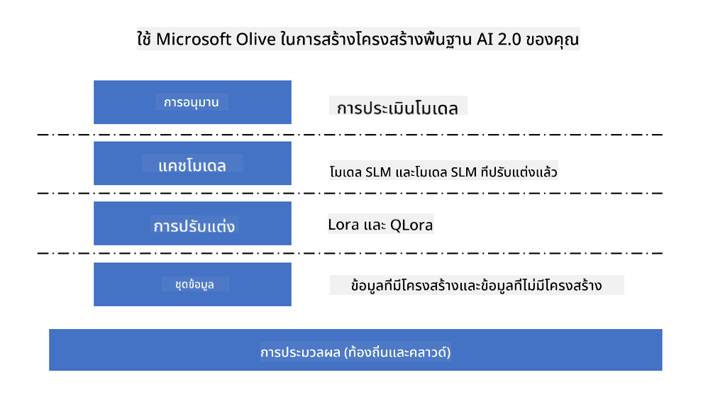
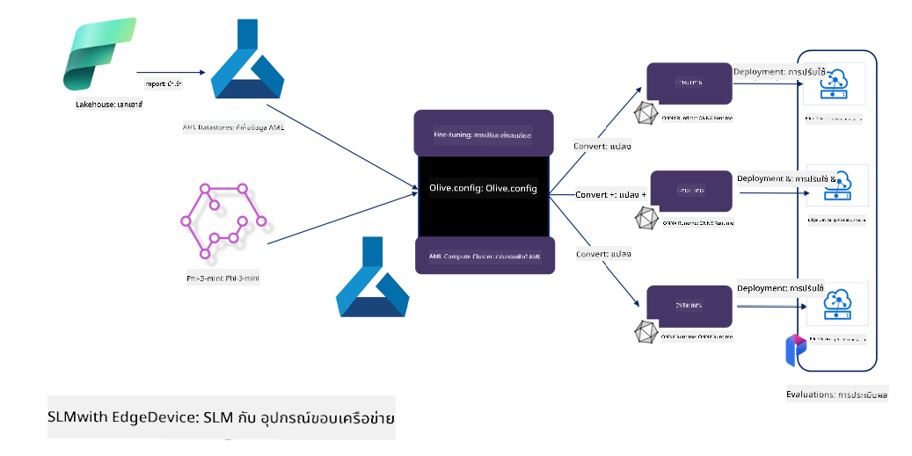

<!--
CO_OP_TRANSLATOR_METADATA:
{
  "original_hash": "5764be88ad2eb4f341e742eb8f14fab1",
  "translation_date": "2025-07-17T06:45:27+00:00",
  "source_file": "md/03.FineTuning/FineTuning_MicrosoftOlive.md",
  "language_code": "th"
}
-->
# **การปรับแต่ง Phi-3 ด้วย Microsoft Olive**

[Olive](https://github.com/microsoft/OLive?WT.mc_id=aiml-138114-kinfeylo) เป็นเครื่องมือปรับแต่งโมเดลที่คำนึงถึงฮาร์ดแวร์ ใช้งานง่าย ซึ่งรวบรวมเทคนิคชั้นนำในอุตสาหกรรมทั้งด้านการบีบอัดโมเดล การปรับแต่ง และการคอมไพล์เข้าด้วยกัน

ออกแบบมาเพื่อช่วยให้กระบวนการปรับแต่งโมเดลง่ายขึ้น และมั่นใจว่าโมเดลจะใช้ฮาร์ดแวร์เฉพาะได้อย่างมีประสิทธิภาพสูงสุด

ไม่ว่าคุณจะทำงานกับแอปพลิเคชันบนคลาวด์หรืออุปกรณ์ edge Olive ช่วยให้คุณปรับแต่งโมเดลได้อย่างง่ายดายและมีประสิทธิผล

## คุณสมบัติหลัก:
- Olive รวบรวมและทำให้อัตโนมัติเทคนิคการปรับแต่งสำหรับฮาร์ดแวร์เป้าหมายที่ต้องการ
- ไม่มีเทคนิคการปรับแต่งเดียวที่เหมาะกับทุกสถานการณ์ ดังนั้น Olive จึงรองรับการขยายตัวโดยเปิดโอกาสให้นักพัฒนาในอุตสาหกรรมสามารถเพิ่มนวัตกรรมการปรับแต่งของตนเองได้

## ลดความยุ่งยากในการพัฒนา:
- นักพัฒนามักต้องเรียนรู้และใช้เครื่องมือเฉพาะของผู้ผลิตฮาร์ดแวร์หลายรายเพื่อเตรียมและปรับแต่งโมเดลที่ผ่านการฝึกมาแล้วสำหรับการนำไปใช้งาน
- Olive ช่วยลดความซับซ้อนนี้ด้วยการทำให้อัตโนมัติเทคนิคการปรับแต่งสำหรับฮาร์ดแวร์ที่ต้องการ

## โซลูชันการปรับแต่งแบบครบวงจรพร้อมใช้งาน:

ด้วยการผสมผสานและปรับแต่งเทคนิคต่าง ๆ Olive มอบโซลูชันแบบครบวงจรสำหรับการปรับแต่งตั้งแต่ต้นจนจบ
โดยคำนึงถึงข้อจำกัด เช่น ความแม่นยำและความหน่วงขณะปรับแต่งโมเดล

## การใช้ Microsoft Olive ในการปรับแต่ง

Microsoft Olive เป็นเครื่องมือปรับแต่งโมเดลแบบโอเพนซอร์สที่ใช้งานง่ายมาก ครอบคลุมทั้งการปรับแต่งและการอ้างอิงในด้านปัญญาประดิษฐ์เชิงสร้างสรรค์ เพียงแค่ตั้งค่าที่เรียบง่าย ร่วมกับการใช้โมเดลภาษาเล็กแบบโอเพนซอร์สและสภาพแวดล้อมรันไทม์ที่เกี่ยวข้อง (AzureML / GPU, CPU, DirectML ในเครื่อง) คุณก็สามารถทำการปรับแต่งหรืออ้างอิงโมเดลผ่านการปรับแต่งอัตโนมัติ และค้นหาโมเดลที่ดีที่สุดเพื่อนำไปใช้งานบนคลาวด์หรืออุปกรณ์ edge ได้ ช่วยให้องค์กรสามารถสร้างโมเดลเฉพาะอุตสาหกรรมของตนเองได้ทั้งในสถานที่และบนคลาวด์



## การปรับแต่ง Phi-3 ด้วย Microsoft Olive



## ตัวอย่างโค้ดและตัวอย่างการใช้ Phi-3 Olive
ในตัวอย่างนี้ คุณจะใช้ Olive เพื่อ:

- ปรับแต่ง LoRA adapter เพื่อจำแนกวลีเป็น Sad, Joy, Fear, Surprise
- รวมค่าน้ำหนักของ adapter เข้ากับโมเดลฐาน
- ปรับแต่งและทำ Quantize โมเดลเป็น int4

[Sample Code](../../code/03.Finetuning/olive-ort-example/README.md)

### การติดตั้ง Microsoft Olive

การติดตั้ง Microsoft Olive ง่ายมาก และสามารถติดตั้งได้ทั้งบน CPU, GPU, DirectML และ Azure ML

```bash
pip install olive-ai
```

ถ้าคุณต้องการรันโมเดล ONNX บน CPU คุณสามารถใช้

```bash
pip install olive-ai[cpu]
```

ถ้าคุณต้องการรันโมเดล ONNX บน GPU คุณสามารถใช้

```python
pip install olive-ai[gpu]
```

ถ้าคุณต้องการใช้ Azure ML ให้ใช้

```python
pip install git+https://github.com/microsoft/Olive#egg=olive-ai[azureml]
```

**หมายเหตุ**
ระบบปฏิบัติการที่รองรับ: Ubuntu 20.04 / 22.04

### **ไฟล์ Config.json ของ Microsoft Olive**

หลังการติดตั้ง คุณสามารถตั้งค่าการใช้งานเฉพาะของโมเดลต่าง ๆ ผ่านไฟล์ Config ได้ เช่น ข้อมูล, การประมวลผล, การฝึก, การนำไปใช้งาน และการสร้างโมเดล

**1. ข้อมูล**

บน Microsoft Olive รองรับการฝึกด้วยข้อมูลทั้งในเครื่องและบนคลาวด์ และสามารถตั้งค่าได้ในส่วนของการตั้งค่า

*การตั้งค่าข้อมูลในเครื่อง*

คุณสามารถตั้งค่าชุดข้อมูลที่ต้องการฝึกเพื่อปรับแต่งได้อย่างง่ายดาย โดยปกติจะเป็นไฟล์ json และปรับให้เข้ากับเทมเพลตข้อมูล ซึ่งต้องปรับตามความต้องการของโมเดล (เช่น ปรับให้เข้ากับฟอร์แมตที่ Microsoft Phi-3-mini ต้องการ หากใช้โมเดลอื่น โปรดดูฟอร์แมตการปรับแต่งที่จำเป็นของโมเดลนั้น ๆ)

```json

    "data_configs": [
        {
            "name": "dataset_default_train",
            "type": "HuggingfaceContainer",
            "load_dataset_config": {
                "params": {
                    "data_name": "json", 
                    "data_files":"dataset/dataset-classification.json",
                    "split": "train"
                }
            },
            "pre_process_data_config": {
                "params": {
                    "dataset_type": "corpus",
                    "text_cols": [
                            "phrase",
                            "tone"
                    ],
                    "text_template": "### Text: {phrase}\n### The tone is:\n{tone}",
                    "corpus_strategy": "join",
                    "source_max_len": 2048,
                    "pad_to_max_len": false,
                    "use_attention_mask": false
                }
            }
        }
    ],
```

**การตั้งค่าข้อมูลบนคลาวด์**

โดยการเชื่อมต่อ datastore ของ Azure AI Studio/Azure Machine Learning Service เพื่อเชื่อมโยงข้อมูลบนคลาวด์ คุณสามารถเลือกนำเข้าข้อมูลจากแหล่งต่าง ๆ ไปยัง Azure AI Studio/Azure Machine Learning Service ผ่าน Microsoft Fabric และ Azure Data เพื่อสนับสนุนการปรับแต่งข้อมูล

```json

    "data_configs": [
        {
            "name": "dataset_default_train",
            "type": "HuggingfaceContainer",
            "load_dataset_config": {
                "params": {
                    "data_name": "json", 
                    "data_files": {
                        "type": "azureml_datastore",
                        "config": {
                            "azureml_client": {
                                "subscription_id": "Your Azure Subscrition ID",
                                "resource_group": "Your Azure Resource Group",
                                "workspace_name": "Your Azure ML Workspaces name"
                            },
                            "datastore_name": "workspaceblobstore",
                            "relative_path": "Your train_data.json Azure ML Location"
                        }
                    },
                    "split": "train"
                }
            },
            "pre_process_data_config": {
                "params": {
                    "dataset_type": "corpus",
                    "text_cols": [
                            "Question",
                            "Best Answer"
                    ],
                    "text_template": "<|user|>\n{Question}<|end|>\n<|assistant|>\n{Best Answer}\n<|end|>",
                    "corpus_strategy": "join",
                    "source_max_len": 2048,
                    "pad_to_max_len": false,
                    "use_attention_mask": false
                }
            }
        }
    ],
    
```

**2. การตั้งค่าการประมวลผล**

ถ้าคุณต้องการใช้ในเครื่อง คุณสามารถใช้ทรัพยากรข้อมูลในเครื่องได้โดยตรง หากต้องการใช้ทรัพยากรของ Azure AI Studio / Azure Machine Learning Service คุณต้องตั้งค่าพารามิเตอร์ Azure ที่เกี่ยวข้อง เช่น ชื่อทรัพยากรคอมพิวติ้ง เป็นต้น

```json

    "systems": {
        "aml": {
            "type": "AzureML",
            "config": {
                "accelerators": ["gpu"],
                "hf_token": true,
                "aml_compute": "Your Azure AI Studio / Azure Machine Learning Service Compute Name",
                "aml_docker_config": {
                    "base_image": "Your Azure AI Studio / Azure Machine Learning Service docker",
                    "conda_file_path": "conda.yaml"
                }
            }
        },
        "azure_arc": {
            "type": "AzureML",
            "config": {
                "accelerators": ["gpu"],
                "aml_compute": "Your Azure AI Studio / Azure Machine Learning Service Compute Name",
                "aml_docker_config": {
                    "base_image": "Your Azure AI Studio / Azure Machine Learning Service docker",
                    "conda_file_path": "conda.yaml"
                }
            }
        }
    },
```

***หมายเหตุ***

เนื่องจากรันผ่าน container บน Azure AI Studio/Azure Machine Learning Service จึงต้องตั้งค่าสภาพแวดล้อมที่จำเป็น ซึ่งตั้งค่าในไฟล์ conda.yaml

```yaml

name: project_environment
channels:
  - defaults
dependencies:
  - python=3.8.13
  - pip=22.3.1
  - pip:
      - einops
      - accelerate
      - azure-keyvault-secrets
      - azure-identity
      - bitsandbytes
      - datasets
      - huggingface_hub
      - peft
      - scipy
      - sentencepiece
      - torch>=2.2.0
      - transformers
      - git+https://github.com/microsoft/Olive@jiapli/mlflow_loading_fix#egg=olive-ai[gpu]
      - --extra-index-url https://aiinfra.pkgs.visualstudio.com/PublicPackages/_packaging/ORT-Nightly/pypi/simple/ 
      - ort-nightly-gpu==1.18.0.dev20240307004
      - --extra-index-url https://aiinfra.pkgs.visualstudio.com/PublicPackages/_packaging/onnxruntime-genai/pypi/simple/
      - onnxruntime-genai-cuda

    

```

**3. เลือก SLM ของคุณ**

คุณสามารถใช้โมเดลโดยตรงจาก Hugging face หรือผสานกับ Model Catalog ของ Azure AI Studio / Azure Machine Learning เพื่อเลือกโมเดลที่ต้องการใช้ ในตัวอย่างโค้ดด้านล่าง เราจะใช้ Microsoft Phi-3-mini เป็นตัวอย่าง

ถ้าคุณมีโมเดลในเครื่อง คุณสามารถใช้วิธีนี้

```json

    "input_model":{
        "type": "PyTorchModel",
        "config": {
            "hf_config": {
                "model_name": "model-cache/microsoft/phi-3-mini",
                "task": "text-generation",
                "model_loading_args": {
                    "trust_remote_code": true
                }
            }
        }
    },
```

ถ้าคุณต้องการใช้โมเดลจาก Azure AI Studio / Azure Machine Learning Service คุณสามารถใช้วิธีนี้

```json

    "input_model":{
        "type": "PyTorchModel",
        "config": {
            "model_path": {
                "type": "azureml_registry_model",
                "config": {
                    "name": "microsoft/Phi-3-mini-4k-instruct",
                    "registry_name": "azureml-msr",
                    "version": "11"
                }
            },
             "model_file_format": "PyTorch.MLflow",
             "hf_config": {
                "model_name": "microsoft/Phi-3-mini-4k-instruct",
                "task": "text-generation",
                "from_pretrained_args": {
                    "trust_remote_code": true
                }
            }
        }
    },
```

**หมายเหตุ:**
เราต้องผสานกับ Azure AI Studio / Azure Machine Learning Service ดังนั้นเมื่อกำหนดค่าโมเดล โปรดดูหมายเลขเวอร์ชันและชื่อที่เกี่ยวข้อง

โมเดลทั้งหมดบน Azure ต้องตั้งค่าเป็น PyTorch.MLflow

คุณต้องมีบัญชี Hugging face และผูกคีย์กับค่า Key ของ Azure AI Studio / Azure Machine Learning

**4. อัลกอริทึม**

Microsoft Olive ห่อหุ้มอัลกอริทึมการปรับแต่ง Lora และ QLora ได้ดีมาก สิ่งที่คุณต้องตั้งค่าคือพารามิเตอร์ที่เกี่ยวข้องบางส่วน ตัวอย่างนี้ใช้ QLora

```json
        "lora": {
            "type": "LoRA",
            "config": {
                "target_modules": [
                    "o_proj",
                    "qkv_proj"
                ],
                "double_quant": true,
                "lora_r": 64,
                "lora_alpha": 64,
                "lora_dropout": 0.1,
                "train_data_config": "dataset_default_train",
                "eval_dataset_size": 0.3,
                "training_args": {
                    "seed": 0,
                    "data_seed": 42,
                    "per_device_train_batch_size": 1,
                    "per_device_eval_batch_size": 1,
                    "gradient_accumulation_steps": 4,
                    "gradient_checkpointing": false,
                    "learning_rate": 0.0001,
                    "num_train_epochs": 3,
                    "max_steps": 10,
                    "logging_steps": 10,
                    "evaluation_strategy": "steps",
                    "eval_steps": 187,
                    "group_by_length": true,
                    "adam_beta2": 0.999,
                    "max_grad_norm": 0.3
                }
            }
        },
```

ถ้าคุณต้องการแปลง quantization สาขาหลักของ Microsoft Olive รองรับวิธี onnxruntime-genai แล้ว คุณสามารถตั้งค่าตามความต้องการได้:

1. รวมค่าน้ำหนัก adapter เข้ากับโมเดลฐาน
2. แปลงโมเดลเป็น onnx model ด้วยความแม่นยำที่ต้องการโดย ModelBuilder

เช่น การแปลงเป็น quantized INT4

```json

        "merge_adapter_weights": {
            "type": "MergeAdapterWeights"
        },
        "builder": {
            "type": "ModelBuilder",
            "config": {
                "precision": "int4"
            }
        }
```

**หมายเหตุ**
- หากใช้ QLoRA การแปลง quantization ของ ONNXRuntime-genai ยังไม่รองรับในขณะนี้

- ขอชี้แจงว่าคุณสามารถตั้งค่าขั้นตอนข้างต้นตามความต้องการของตัวเอง ไม่จำเป็นต้องตั้งค่าทุกขั้นตอนครบถ้วน ขึ้นอยู่กับความต้องการ คุณสามารถใช้ขั้นตอนของอัลกอริทึมโดยไม่ต้องปรับแต่งก็ได้ สุดท้ายคุณต้องตั้งค่า engine ที่เกี่ยวข้อง

```json

    "engine": {
        "log_severity_level": 0,
        "host": "aml",
        "target": "aml",
        "search_strategy": false,
        "execution_providers": ["CUDAExecutionProvider"],
        "cache_dir": "../model-cache/models/phi3-finetuned/cache",
        "output_dir" : "../model-cache/models/phi3-finetuned"
    }
```

**5. เสร็จสิ้นการปรับแต่ง**

บนบรรทัดคำสั่ง ให้รันในไดเรกทอรีที่มีไฟล์ olive-config.json

```bash
olive run --config olive-config.json  
```

**ข้อจำกัดความรับผิดชอบ**:  
เอกสารนี้ได้รับการแปลโดยใช้บริการแปลภาษาอัตโนมัติ [Co-op Translator](https://github.com/Azure/co-op-translator) แม้เราจะพยายามให้ความถูกต้องสูงสุด แต่โปรดทราบว่าการแปลอัตโนมัติอาจมีข้อผิดพลาดหรือความไม่ถูกต้อง เอกสารต้นฉบับในภาษาต้นทางถือเป็นแหล่งข้อมูลที่เชื่อถือได้ สำหรับข้อมูลที่สำคัญ ขอแนะนำให้ใช้บริการแปลโดยผู้เชี่ยวชาญมนุษย์ เราไม่รับผิดชอบต่อความเข้าใจผิดหรือการตีความผิดใด ๆ ที่เกิดจากการใช้การแปลนี้