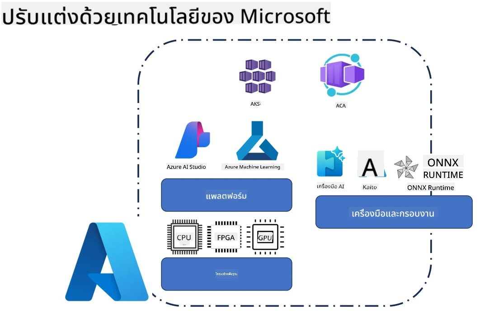
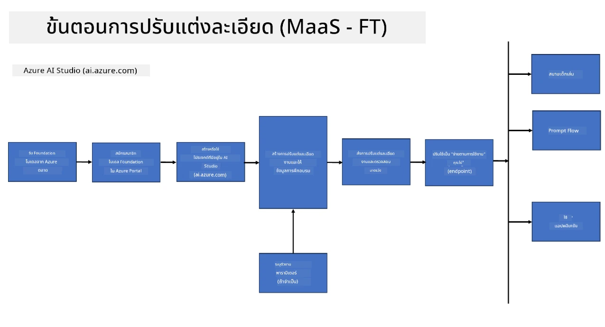
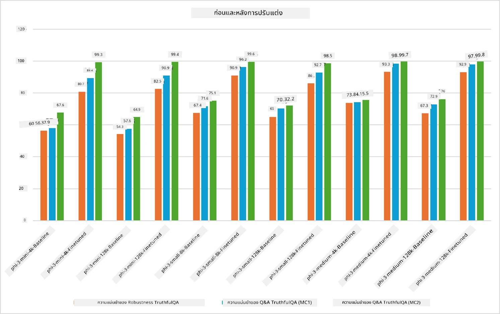

## กรณีการปรับแต่งแบบละเอียด

**แพลตฟอร์ม** ประกอบด้วยเทคโนโลยีหลากหลาย เช่น Azure AI Foundry, Azure Machine Learning, AI Tools, Kaito และ ONNX Runtime

**โครงสร้างพื้นฐาน** ประกอบด้วย CPU และ FPGA ซึ่งเป็นสิ่งจำเป็นสำหรับกระบวนการปรับแต่งแบบละเอียด ให้ผมแสดงไอคอนของเทคโนโลยีแต่ละตัวให้ดู

**เครื่องมือและเฟรมเวิร์ก** ประกอบด้วย ONNX Runtime และ ONNX Runtime ให้ผมแสดงไอคอนของเทคโนโลยีแต่ละตัวให้ดู  
[แทรกไอคอนของ ONNX Runtime และ ONNX Runtime]

กระบวนการปรับแต่งแบบละเอียดด้วยเทคโนโลยีของ Microsoft ประกอบด้วยส่วนประกอบและเครื่องมือต่างๆ โดยการเข้าใจและใช้เทคโนโลยีเหล่านี้ เราสามารถปรับแต่งแอปพลิเคชันของเราได้อย่างมีประสิทธิภาพและสร้างโซลูชันที่ดียิ่งขึ้น

## Model as Service

ปรับแต่งโมเดลโดยใช้การปรับแต่งแบบโฮสต์ โดยไม่ต้องสร้างและจัดการคอมพิวต์

การปรับแต่งแบบไม่มีเซิร์ฟเวอร์พร้อมใช้งานสำหรับโมเดล Phi-3-mini และ Phi-3-medium ช่วยให้นักพัฒนาสามารถปรับแต่งโมเดลได้อย่างรวดเร็วและง่ายดายสำหรับสถานการณ์คลาวด์และเอดจ์โดยไม่ต้องจัดเตรียมคอมพิวต์ นอกจากนี้ เรายังประกาศว่า Phi-3-small พร้อมให้บริการผ่าน Models-as-a-Service เพื่อให้นักพัฒนาสามารถเริ่มต้นพัฒนา AI ได้อย่างรวดเร็วและง่ายดายโดยไม่ต้องจัดการโครงสร้างพื้นฐานเบื้องหลัง

## Model as a Platform

ผู้ใช้จัดการคอมพิวต์ของตนเองเพื่อปรับแต่งโมเดล

[ตัวอย่างการปรับแต่งแบบละเอียด](https://github.com/Azure/azureml-examples/blob/main/sdk/python/foundation-models/system/finetune/chat-completion/chat-completion.ipynb)

## กรณีการปรับแต่งแบบละเอียด

| | | | | | | |
|-|-|-|-|-|-|-|
|กรณีใช้งาน|LoRA|QLoRA|PEFT|DeepSpeed|ZeRO|DORA|
|ปรับแต่ง LLM ที่ผ่านการฝึกมาแล้วให้เหมาะกับงานหรือโดเมนเฉพาะ|ใช่|ใช่|ใช่|ใช่|ใช่|ใช่|
|ปรับแต่งสำหรับงาน NLP เช่น การจัดหมวดหมู่ข้อความ, การรู้จำชื่อเฉพาะ, และการแปลภาษา|ใช่|ใช่|ใช่|ใช่|ใช่|ใช่|
|ปรับแต่งสำหรับงานถามตอบ (QA)|ใช่|ใช่|ใช่|ใช่|ใช่|ใช่|
|ปรับแต่งเพื่อสร้างการตอบสนองที่เหมือนมนุษย์ในแชทบอท|ใช่|ใช่|ใช่|ใช่|ใช่|ใช่|
|ปรับแต่งเพื่อสร้างสรรค์งานดนตรี ศิลปะ หรือรูปแบบความคิดสร้างสรรค์อื่นๆ|ใช่|ใช่|ใช่|ใช่|ใช่|ใช่|
|ลดต้นทุนด้านคอมพิวต์และการเงิน|ใช่|ใช่|ไม่ใช่|ใช่|ใช่|ไม่ใช่|
|ลดการใช้หน่วยความจำ|ไม่ใช่|ใช่|ไม่ใช่|ใช่|ใช่|ใช่|
|ใช้พารามิเตอร์น้อยลงเพื่อการปรับแต่งที่มีประสิทธิภาพ|ไม่ใช่|ใช่|ใช่|ไม่ใช่|ไม่ใช่|ใช่|
|รูปแบบการประมวลผลแบบขนานที่ประหยัดหน่วยความจำ ซึ่งช่วยให้เข้าถึงหน่วยความจำ GPU รวมของอุปกรณ์ GPU ทั้งหมดที่มี|ไม่ใช่|ไม่ใช่|ไม่ใช่|ใช่|ใช่|ใช่|

## ตัวอย่างประสิทธิภาพการปรับแต่งแบบละเอียด

**ข้อจำกัดความรับผิดชอบ**:  
เอกสารนี้ได้รับการแปลโดยใช้บริการแปลภาษาอัตโนมัติ [Co-op Translator](https://github.com/Azure/co-op-translator) แม้เราจะพยายามให้ความถูกต้องสูงสุด แต่โปรดทราบว่าการแปลอัตโนมัติอาจมีข้อผิดพลาดหรือความไม่ถูกต้อง เอกสารต้นฉบับในภาษาต้นทางถือเป็นแหล่งข้อมูลที่เชื่อถือได้ สำหรับข้อมูลที่สำคัญ ขอแนะนำให้ใช้บริการแปลโดยผู้เชี่ยวชาญมนุษย์ เราไม่รับผิดชอบต่อความเข้าใจผิดหรือการตีความผิดใด ๆ ที่เกิดจากการใช้การแปลนี้