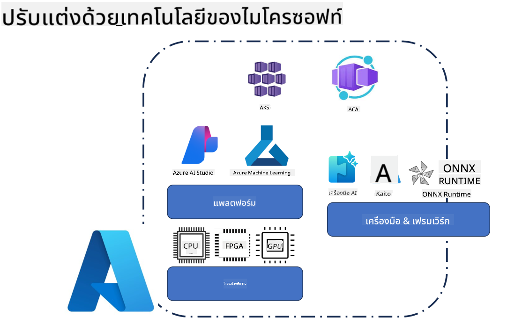
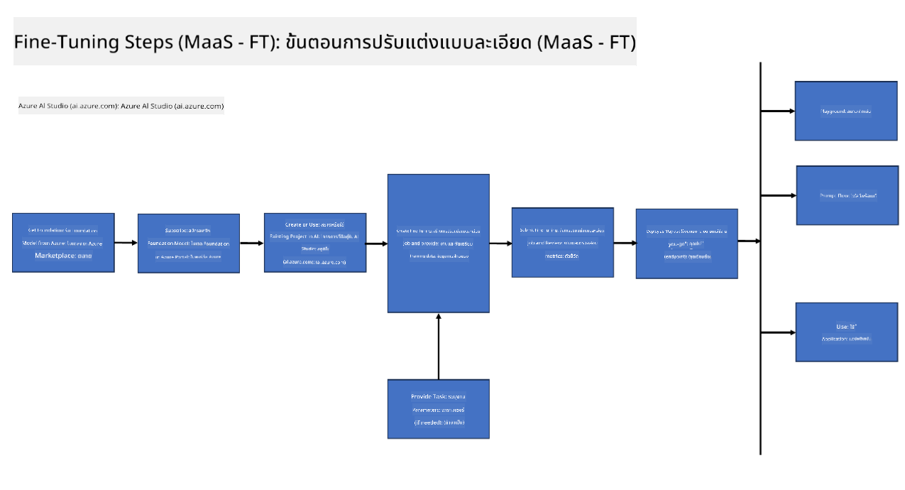
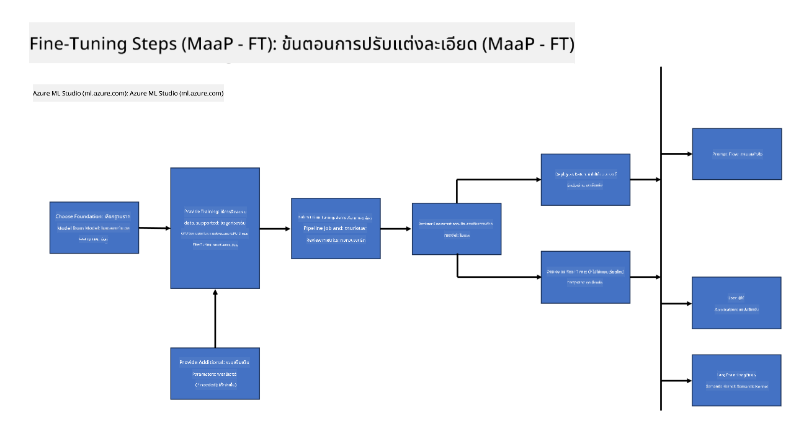
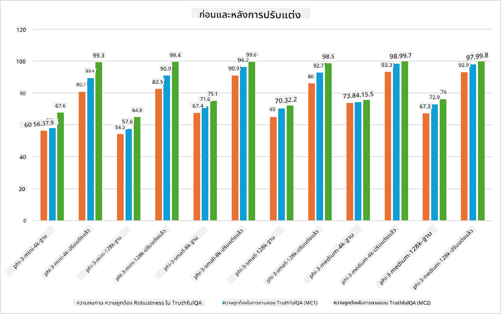

<!--
CO_OP_TRANSLATOR_METADATA:
{
  "original_hash": "cb5648935f63edc17e95ce38f23adc32",
  "translation_date": "2025-05-09T21:55:38+00:00",
  "source_file": "md/03.FineTuning/FineTuning_Scenarios.md",
  "language_code": "th"
}
-->
## กรณีการปรับแต่งแบบละเอียด

**แพลตฟอร์ม** ครอบคลุมเทคโนโลยีต่างๆ เช่น Azure AI Foundry, Azure Machine Learning, AI Tools, Kaito และ ONNX Runtime

**โครงสร้างพื้นฐาน** รวมถึง CPU และ FPGA ซึ่งมีความสำคัญต่อกระบวนการปรับแต่งแบบละเอียด ให้ผมแสดงไอคอนของเทคโนโลยีเหล่านี้ให้ดู

**เครื่องมือ & เฟรมเวิร์ก** รวมถึง ONNX Runtime และ ONNX Runtime ให้ผมแสดงไอคอนของเทคโนโลยีเหล่านี้ให้ดู  
[Insert icons for ONNX Runtime and ONNX Runtime]

กระบวนการปรับแต่งแบบละเอียดด้วยเทคโนโลยีของ Microsoft ประกอบด้วยส่วนประกอบและเครื่องมือต่างๆ โดยการเข้าใจและใช้เทคโนโลยีเหล่านี้ เราสามารถปรับแต่งแอปพลิเคชันของเราได้อย่างมีประสิทธิภาพและสร้างโซลูชันที่ดียิ่งขึ้น

## Model as Service

ปรับแต่งโมเดลโดยใช้ hosted fine-tuning โดยไม่ต้องสร้างและจัดการคอมพิวต์

การปรับแต่งแบบไม่มีเซิร์ฟเวอร์มีให้สำหรับโมเดล Phi-3-mini และ Phi-3-medium ช่วยให้นักพัฒนาสามารถปรับแต่งโมเดลได้อย่างรวดเร็วและง่ายดายสำหรับสถานการณ์บนคลาวด์และเอดจ์โดยไม่ต้องจัดการคอมพิวต์ นอกจากนี้ เรายังประกาศว่า Phi-3-small พร้อมให้บริการผ่าน Models-as-a-Service เพื่อให้นักพัฒนาสามารถเริ่มต้นพัฒนา AI ได้อย่างรวดเร็วและง่ายดายโดยไม่ต้องดูแลโครงสร้างพื้นฐานเบื้องหลัง

## Model as a Platform

ผู้ใช้จัดการคอมพิวต์ของตนเองเพื่อปรับแต่งโมเดล

[Fine Tuning Sample](https://github.com/Azure/azureml-examples/blob/main/sdk/python/foundation-models/system/finetune/chat-completion/chat-completion.ipynb)

## กรณีการปรับแต่งแบบละเอียด

| | | | | | | |
|-|-|-|-|-|-|-|
|กรณีใช้งาน|LoRA|QLoRA|PEFT|DeepSpeed|ZeRO|DORA|
|ปรับแต่ง LLM ที่ผ่านการฝึกมาแล้วให้เหมาะกับงานหรือโดเมนเฉพาะ|ใช่|ใช่|ใช่|ใช่|ใช่|ใช่|
|ปรับแต่งสำหรับงาน NLP เช่น การจัดหมวดหมู่ข้อความ, การรู้จำชื่อเฉพาะ และการแปลภาษา|ใช่|ใช่|ใช่|ใช่|ใช่|ใช่|
|ปรับแต่งสำหรับงานถามตอบ (QA)|ใช่|ใช่|ใช่|ใช่|ใช่|ใช่|
|ปรับแต่งสำหรับสร้างการตอบสนองที่เหมือนมนุษย์ในแชทบอท|ใช่|ใช่|ใช่|ใช่|ใช่|ใช่|
|ปรับแต่งสำหรับสร้างผลงานด้านดนตรี, ศิลปะ หรือความคิดสร้างสรรค์อื่นๆ|ใช่|ใช่|ใช่|ใช่|ใช่|ใช่|
|ลดค่าใช้จ่ายด้านการคำนวณและการเงิน|ใช่|ใช่|ไม่ใช่|ใช่|ใช่|ไม่ใช่|
|ลดการใช้หน่วยความจำ|ไม่ใช่|ใช่|ไม่ใช่|ใช่|ใช่|ใช่|
|ใช้พารามิเตอร์น้อยลงเพื่อปรับแต่งอย่างมีประสิทธิภาพ|ไม่ใช่|ใช่|ใช่|ไม่ใช่|ไม่ใช่|ใช่|
|รูปแบบการประมวลผลข้อมูลแบบขนานที่ประหยัดหน่วยความจำและให้เข้าถึงหน่วยความจำรวมของ GPU ทุกตัวที่มีอยู่|ไม่ใช่|ไม่ใช่|ไม่ใช่|ใช่|ใช่|ใช่|

## ตัวอย่างประสิทธิภาพการปรับแต่งแบบละเอียด

**ข้อจำกัดความรับผิดชอบ**:  
เอกสารฉบับนี้ได้รับการแปลโดยใช้บริการแปลภาษาอัตโนมัติ [Co-op Translator](https://github.com/Azure/co-op-translator) แม้เราจะพยายามให้ความถูกต้องสูงสุด แต่โปรดทราบว่าการแปลอัตโนมัติอาจมีข้อผิดพลาดหรือความคลาดเคลื่อน เอกสารต้นฉบับในภาษาต้นทางถือเป็นแหล่งข้อมูลที่เชื่อถือได้ สำหรับข้อมูลที่สำคัญ แนะนำให้ใช้การแปลโดยผู้เชี่ยวชาญมนุษย์ เราไม่รับผิดชอบต่อความเข้าใจผิดหรือการตีความที่ผิดพลาดใด ๆ ที่เกิดจากการใช้การแปลนี้