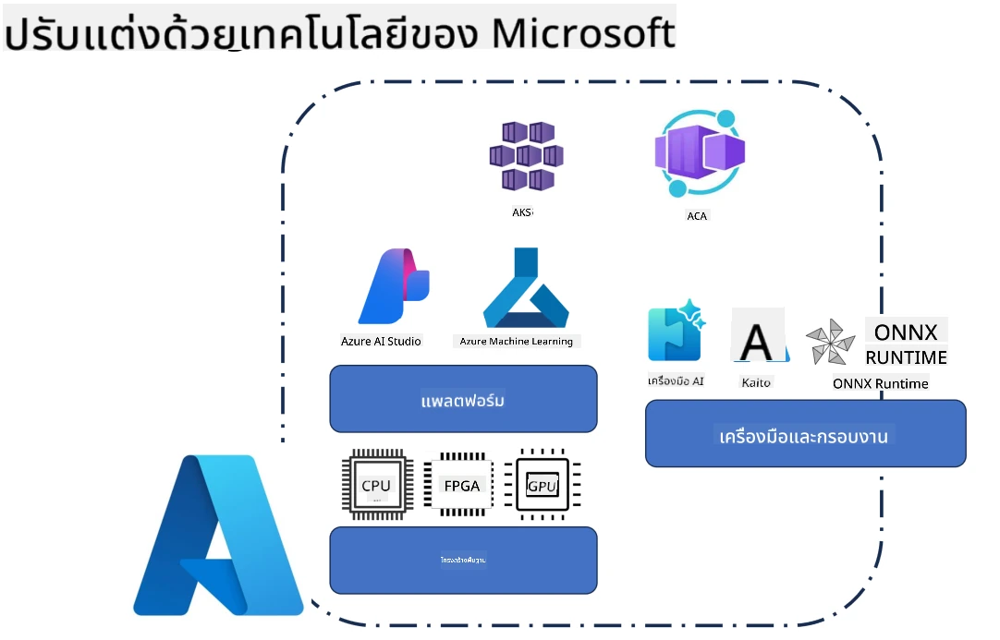
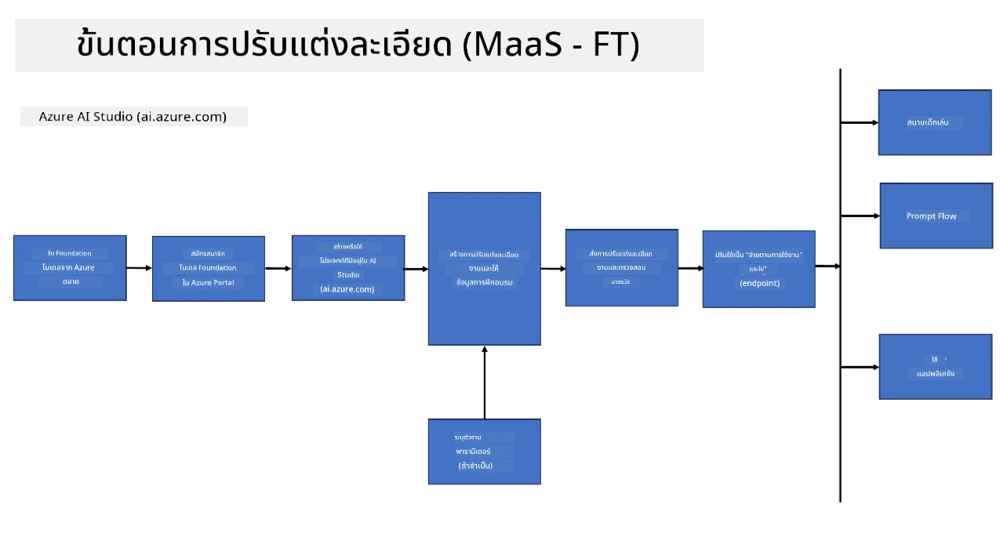
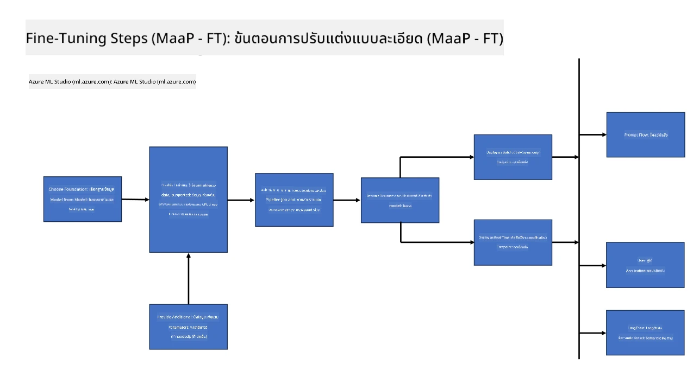
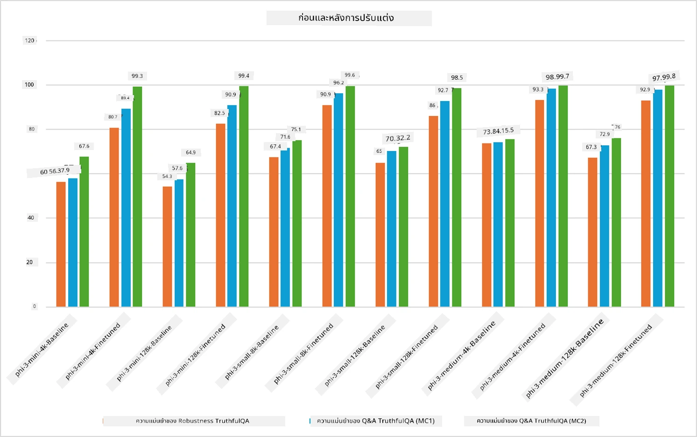

## กรณีการปรับจูนละเอียด (Fine Tuning Scenarios)

ส่วนนี้นำเสนอภาพรวมของกรณีการปรับจูนละเอียดในสภาพแวดล้อม Microsoft Foundry และ Azure ซึ่งรวมถึงรูปแบบการปรับใช้ ชั้นโครงสร้างพื้นฐาน และเทคนิคการปรับแต่งที่ใช้บ่อย

**แพลตฟอร์ม**  
รวมถึงบริการที่มีการจัดการ เช่น Microsoft Foundry (เดิมชื่อ Azure AI Foundry) และ Azure Machine Learning ซึ่งให้บริการการจัดการโมเดล การประสานงาน การติดตามการทดลอง และเวิร์กโฟลว์การปรับใช้

**โครงสร้างพื้นฐาน**  
การปรับจูนละเอียดต้องการทรัพยากรการประมวลผลที่สามารถปรับขนาดได้ ในสภาพแวดล้อม Azure โดยทั่วไปจะรวมถึงเครื่องเสมือนที่ใช้ GPU และทรัพยากร CPU สำหรับงานเบา พร้อมกับที่เก็บข้อมูลที่ปรับขนาดได้สำหรับชุดข้อมูลและจุดตรวจสอบ

**เครื่องมือและเฟรมเวิร์ก**  
เวิร์กโฟลว์การปรับจูนละเอียดมักจะพึ่งพาเฟรมเวิร์กและไลบรารีการปรับแต่ง เช่น Hugging Face Transformers, DeepSpeed และ PEFT (Parameter-Efficient Fine-Tuning)

กระบวนการปรับจูนละเอียดด้วยเทคโนโลยีของ Microsoft ครอบคลุมบริการแพลตฟอร์ม โครงสร้างพื้นฐานการประมวลผล และเฟรมเวิร์กการฝึกอบรม โดยการเข้าใจว่าส่วนประกอบเหล่านี้ทำงานร่วมกันอย่างไร นักพัฒนาจะสามารถปรับโมเดลฐานให้เหมาะสมกับงานเฉพาะและกรณีใช้งานในสภาพแวดล้อมการผลิตได้อย่างมีประสิทธิภาพ

## โมเดลในฐานะบริการ (Model as Service)

ปรับจูนโมเดลโดยใช้บริการปรับจูนที่โฮสต์โดยไม่ต้องสร้างหรือจัดการทรัพยากรการประมวลผลเอง

ตอนนี้มีบริการปรับจูนแบบไม่มีเซิร์ฟเวอร์สำหรับตระกูลโมเดล Phi-3, Phi-3.5 และ Phi-4 ช่วยให้นักพัฒนาปรับแต่งโมเดลสำหรับกรณีใช้งานบนคลาวด์และ Edge ได้อย่างรวดเร็วและง่ายดายโดยไม่ต้องจัดเตรียมทรัพยากรการประมวลผล

## โมเดลในฐานะแพลตฟอร์ม (Model as a Platform)

ผู้ใช้จัดการทรัพยากรการประมวลผลของตนเองเพื่อปรับจูนโมเดล

[ตัวอย่างการปรับจูน](https://github.com/Azure/azureml-examples/blob/main/sdk/python/foundation-models/system/finetune/chat-completion/chat-completion.ipynb)

## การเปรียบเทียบเทคนิคการปรับจูนละเอียด

|กรณีใช้งาน|LoRA|QLoRA|PEFT|DeepSpeed|ZeRO|DoRA|
|---|---|---|---|---|---|---|
|ปรับจูน LLM ที่ผ่านการฝึกล่วงหน้าให้เหมาะกับงานหรือโดเมนเฉพาะ|ใช่|ใช่|ใช่|ใช่|ใช่|ใช่|
|ปรับจูนสำหรับงาน NLP เช่น การจัดหมวดหมูข้อความ การรู้จำชื่อเอนทิตี้ และการแปลภาษา|ใช่|ใช่|ใช่|ใช่|ใช่|ใช่|
|ปรับจูนสำหรับงานถามตอบ (QA)|ใช่|ใช่|ใช่|ใช่|ใช่|ใช่|
|ปรับจูนเพื่อสร้างการตอบสนองเหมือนมนุษย์ในแชทบอท|ใช่|ใช่|ใช่|ใช่|ใช่|ใช่|
|ปรับจูนเพื่อสร้างดนตรี ศิลปะ หรือรูปแบบความคิดสร้างสรรค์อื่นๆ|ใช่|ใช่|ใช่|ใช่|ใช่|ใช่|
|ลดต้นทุนการคำนวณและค่าใช้จ่าย|ใช่|ใช่|ใช่|ใช่|ใช่|ใช่|
|ลดการใช้หน่วยความจำ|ใช่|ใช่|ใช่|ใช่|ใช่|ใช่|
|ใช้พารามิเตอร์จำนวนน้อยในการปรับจูนที่มีประสิทธิภาพ|ใช่|ใช่|ใช่|ไม่ใช่|ไม่ใช่|ใช่|
|รูปแบบการขนานข้อมูลที่ประหยัดหน่วยความจำซึ่งสามารถใช้หน่วยความจำ GPU รวมทั้งหมดของอุปกรณ์ GPU ที่มีใช้งานได้|ไม่ใช่|ไม่ใช่|ไม่ใช่|ใช่|ใช่|ไม่ใช่|

> [!NOTE]
> LoRA, QLoRA, PEFT และ DoRA เป็นวิธีการปรับจูนที่มีประสิทธิภาพด้านพารามิเตอร์ ในขณะที่ DeepSpeed และ ZeRO เน้นการฝึกอบรมแบบกระจายและการปรับแต่งหน่วยความจำ

## ตัวอย่างประสิทธิภาพการปรับจูนละเอียด

---

<!-- CO-OP TRANSLATOR DISCLAIMER START -->
**ข้อจำกัดความรับผิดชอบ**:
เอกสารนี้ได้รับการแปลโดยใช้บริการแปลด้วย AI [Co-op Translator](https://github.com/Azure/co-op-translator) แม้เราจะพยายามให้ความถูกต้องสูงสุด แต่โปรดทราบว่าการแปลอัตโนมัติอาจมีข้อผิดพลาดหรือความคลาดเคลื่อนได้ เอกสารต้นฉบับในภาษาต้นทางควรถูกพิจารณาเป็นแหล่งข้อมูลที่เชื่อถือได้ สำหรับข้อมูลที่สำคัญควรใช้บริการแปลโดยผู้เชี่ยวชาญที่เป็นมนุษย์ เราจะไม่รับผิดชอบสำหรับความเข้าใจผิดหรือการตีความผิดใดๆ ที่เกิดขึ้นจากการใช้การแปลนี้
<!-- CO-OP TRANSLATOR DISCLAIMER END -->