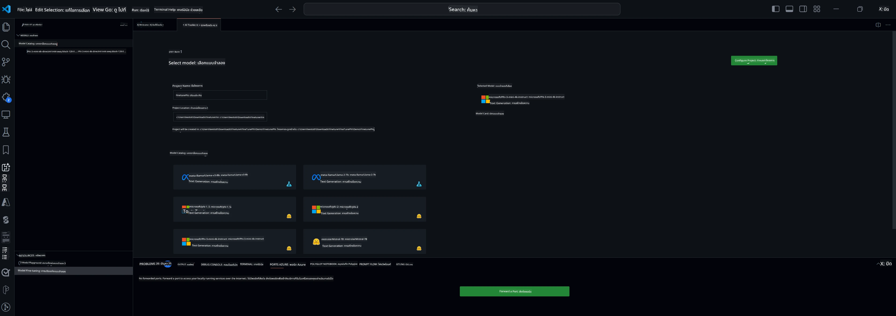

<!--
CO_OP_TRANSLATOR_METADATA:
{
  "original_hash": "c2bc0950f44919ac75a88c1a871680c2",
  "translation_date": "2025-07-17T09:12:48+00:00",
  "source_file": "md/03.FineTuning/Finetuning_VSCodeaitoolkit.md",
  "language_code": "th"
}
-->
## ยินดีต้อนรับสู่ AI Toolkit สำหรับ VS Code

[AI Toolkit for VS Code](https://github.com/microsoft/vscode-ai-toolkit/tree/main) รวบรวมโมเดลต่างๆ จาก Azure AI Studio Catalog และแคตตาล็อกอื่นๆ เช่น Hugging Face เครื่องมือนี้ช่วยให้งานพัฒนาแอป AI ด้วยเครื่องมือและโมเดล generative AI เป็นไปอย่างราบรื่นผ่าน:
- เริ่มต้นด้วยการค้นหาโมเดลและ playground
- การปรับแต่งโมเดลและการสรุปผลโดยใช้ทรัพยากรคอมพิวเตอร์ในเครื่อง
- การปรับแต่งและสรุปผลระยะไกลโดยใช้ทรัพยากร Azure

[ติดตั้ง AI Toolkit สำหรับ VSCode](https://marketplace.visualstudio.com/items?itemName=ms-windows-ai-studio.windows-ai-studio)



**[Private Preview]** การจัดเตรียม Azure Container Apps ด้วยคลิกเดียวเพื่อรันการปรับแต่งโมเดลและสรุปผลบนคลาวด์

ตอนนี้เรามาเริ่มพัฒนาแอป AI ของคุณกัน:

- [ยินดีต้อนรับสู่ AI Toolkit สำหรับ VS Code](../../../../md/03.FineTuning)
- [การพัฒนาในเครื่อง](../../../../md/03.FineTuning)
  - [การเตรียมความพร้อม](../../../../md/03.FineTuning)
  - [เปิดใช้งาน Conda](../../../../md/03.FineTuning)
  - [ปรับแต่งโมเดลพื้นฐานเท่านั้น](../../../../md/03.FineTuning)
  - [การปรับแต่งและสรุปผลโมเดล](../../../../md/03.FineTuning)
  - [การปรับแต่งโมเดล](../../../../md/03.FineTuning)
  - [Microsoft Olive](../../../../md/03.FineTuning)
  - [ตัวอย่างและแหล่งข้อมูลสำหรับการปรับแต่ง](../../../../md/03.FineTuning)
- [**\[Private Preview\]** การพัฒนาระยะไกล](../../../../md/03.FineTuning)
  - [ข้อกำหนดเบื้องต้น](../../../../md/03.FineTuning)
  - [การตั้งค่าโปรเจกต์พัฒนาระยะไกล](../../../../md/03.FineTuning)
  - [จัดเตรียมทรัพยากร Azure](../../../../md/03.FineTuning)
  - [\[ตัวเลือก\] เพิ่ม Huggingface Token ใน Azure Container App Secret](../../../../md/03.FineTuning)
  - [รันการปรับแต่ง](../../../../md/03.FineTuning)
  - [จัดเตรียมจุดเชื่อมต่อสำหรับสรุปผล](../../../../md/03.FineTuning)
  - [ปรับใช้จุดเชื่อมต่อสำหรับสรุปผล](../../../../md/03.FineTuning)
  - [การใช้งานขั้นสูง](../../../../md/03.FineTuning)

## การพัฒนาในเครื่อง
### การเตรียมความพร้อม

1. ตรวจสอบให้แน่ใจว่าได้ติดตั้งไดรเวอร์ NVIDIA ในเครื่องโฮสต์แล้ว
2. รันคำสั่ง `huggingface-cli login` หากคุณใช้ HF สำหรับการใช้งานชุดข้อมูล
3. คำอธิบายการตั้งค่า `Olive` สำหรับการปรับแต่งที่มีผลต่อการใช้หน่วยความจำ

### เปิดใช้งาน Conda
เนื่องจากเราใช้สภาพแวดล้อม WSL ที่แชร์กัน คุณต้องเปิดใช้งาน conda environment ด้วยตนเอง หลังจากขั้นตอนนี้คุณสามารถรันการปรับแต่งหรือสรุปผลได้

```bash
conda activate [conda-env-name] 
```

### ปรับแต่งโมเดลพื้นฐานเท่านั้น
ถ้าคุณต้องการลองใช้โมเดลพื้นฐานโดยไม่ต้องปรับแต่งเพิ่มเติม ให้รันคำสั่งนี้หลังจากเปิดใช้งาน conda แล้ว

```bash
cd inference

# Web browser interface allows to adjust a few parameters like max new token length, temperature and so on.
# User has to manually open the link (e.g. http://0.0.0.0:7860) in a browser after gradio initiates the connections.
python gradio_chat.py --baseonly
```

### การปรับแต่งและสรุปผลโมเดล

เมื่อเปิด workspace ใน dev container แล้ว ให้เปิดเทอร์มินัล (เส้นทางเริ่มต้นคือโฟลเดอร์โปรเจกต์) จากนั้นรันคำสั่งด้านล่างเพื่อปรับแต่ง LLM บนชุดข้อมูลที่เลือก

```bash
python finetuning/invoke_olive.py 
```

จุดตรวจสอบและโมเดลสุดท้ายจะถูกบันทึกไว้ในโฟลเดอร์ `models`

จากนั้นรันการสรุปผลด้วยโมเดลที่ปรับแต่งแล้วผ่านการสนทนาใน `console`, `เว็บเบราว์เซอร์` หรือ `prompt flow`

```bash
cd inference

# Console interface.
python console_chat.py

# Web browser interface allows to adjust a few parameters like max new token length, temperature and so on.
# User has to manually open the link (e.g. http://127.0.0.1:7860) in a browser after gradio initiates the connections.
python gradio_chat.py
```

หากต้องการใช้ `prompt flow` ใน VS Code โปรดดูที่ [Quick Start](https://microsoft.github.io/promptflow/how-to-guides/quick-start.html)

### การปรับแต่งโมเดล

ถัดไป ดาวน์โหลดโมเดลตามการมี GPU บนเครื่องของคุณ

เพื่อเริ่มเซสชันการปรับแต่งในเครื่องโดยใช้ QLoRA ให้เลือกโมเดลที่ต้องการปรับแต่งจากแคตตาล็อกของเรา
| แพลตฟอร์ม | มี GPU | ชื่อโมเดล | ขนาด (GB) |
|---------|---------|--------|--------|
| Windows | ใช่ | Phi-3-mini-4k-**directml**-int4-awq-block-128-onnx | 2.13GB |
| Linux | ใช่ | Phi-3-mini-4k-**cuda**-int4-onnx | 2.30GB |
| Windows<br>Linux | ไม่ | Phi-3-mini-4k-**cpu**-int4-rtn-block-32-acc-level-4-onnx | 2.72GB |

**_หมายเหตุ_** คุณไม่จำเป็นต้องมีบัญชี Azure เพื่อดาวน์โหลดโมเดลเหล่านี้

โมเดล Phi3-mini (int4) มีขนาดประมาณ 2GB-3GB ขึ้นอยู่กับความเร็วเครือข่ายของคุณ อาจใช้เวลาหลายนาทีในการดาวน์โหลด

เริ่มต้นด้วยการเลือกชื่อโปรเจกต์และตำแหน่งที่จัดเก็บ
จากนั้นเลือกโมเดลจากแคตตาล็อกโมเดล คุณจะถูกขอให้ดาวน์โหลดเทมเพลตโปรเจกต์ จากนั้นคลิก "Configure Project" เพื่อปรับแต่งการตั้งค่าต่างๆ

### Microsoft Olive

เราใช้ [Olive](https://microsoft.github.io/Olive/why-olive.html) เพื่อรันการปรับแต่ง QLoRA บนโมเดล PyTorch จากแคตตาล็อกของเรา การตั้งค่าทั้งหมดถูกตั้งค่าไว้ล่วงหน้าด้วยค่าดีฟอลต์เพื่อเพิ่มประสิทธิภาพการปรับแต่งในเครื่องโดยใช้หน่วยความจำอย่างเหมาะสม แต่สามารถปรับเปลี่ยนได้ตามสถานการณ์ของคุณ

### ตัวอย่างและแหล่งข้อมูลสำหรับการปรับแต่ง

- [คู่มือเริ่มต้นการปรับแต่ง](https://learn.microsoft.com/windows/ai/toolkit/toolkit-fine-tune)
- [การปรับแต่งด้วยชุดข้อมูล HuggingFace](https://github.com/microsoft/vscode-ai-toolkit/blob/main/archive/walkthrough-hf-dataset.md)
- [การปรับแต่งด้วยชุดข้อมูลง่ายๆ](https://github.com/microsoft/vscode-ai-toolkit/blob/main/archive/walkthrough-simple-dataset.md)

## **[Private Preview]** การพัฒนาระยะไกล

### ข้อกำหนดเบื้องต้น

1. เพื่อรันการปรับแต่งโมเดลในสภาพแวดล้อม Azure Container App ระยะไกลของคุณ ให้แน่ใจว่าสมาชิกของคุณมีความจุ GPU เพียงพอ ส่ง [คำขอสนับสนุน](https://azure.microsoft.com/support/create-ticket/) เพื่อขอความจุที่จำเป็นสำหรับแอปของคุณ [ดูข้อมูลเพิ่มเติมเกี่ยวกับความจุ GPU](https://learn.microsoft.com/azure/container-apps/workload-profiles-overview)
2. หากคุณใช้ชุดข้อมูลส่วนตัวบน HuggingFace ให้แน่ใจว่าคุณมี [บัญชี HuggingFace](https://huggingface.co/?WT.mc_id=aiml-137032-kinfeylo) และ [สร้าง access token](https://huggingface.co/docs/hub/security-tokens?WT.mc_id=aiml-137032-kinfeylo)
3. เปิดใช้งานฟีเจอร์ Remote Fine-tuning และ Inference ใน AI Toolkit สำหรับ VS Code
   1. เปิดการตั้งค่า VS Code โดยเลือก *File -> Preferences -> Settings*
   2. ไปที่ *Extensions* แล้วเลือก *AI Toolkit*
   3. เลือกตัวเลือก *"Enable Remote Fine-tuning And Inference"*
   4. รีโหลด VS Code เพื่อให้การตั้งค่ามีผล

- [การปรับแต่งระยะไกล](https://github.com/microsoft/vscode-ai-toolkit/blob/main/archive/remote-finetuning.md)

### การตั้งค่าโปรเจกต์พัฒนาระยะไกล
1. ใช้คำสั่ง `AI Toolkit: Focus on Resource View` จาก command palette
2. ไปที่ *Model Fine-tuning* เพื่อเข้าถึงแคตตาล็อกโมเดล ตั้งชื่อโปรเจกต์และเลือกตำแหน่งบนเครื่องของคุณ จากนั้นกดปุ่ม *"Configure Project"*
3. การตั้งค่าโปรเจกต์
    1. หลีกเลี่ยงการเปิดใช้งานตัวเลือก *"Fine-tune locally"*
    2. การตั้งค่า Olive จะปรากฏขึ้นพร้อมค่าดีฟอลต์ที่ตั้งไว้ล่วงหน้า โปรดปรับแต่งและกรอกข้อมูลตามที่ต้องการ
    3. ดำเนินการต่อไปที่ *Generate Project* ขั้นตอนนี้ใช้ WSL และจะตั้งค่า Conda environment ใหม่ เตรียมพร้อมสำหรับการอัปเดตในอนาคตที่รวม Dev Containers
4. คลิก *"Relaunch Window In Workspace"* เพื่อเปิดโปรเจกต์พัฒนาระยะไกลของคุณ

> **หมายเหตุ:** โปรเจกต์นี้ทำงานได้ทั้งในเครื่องและระยะไกลภายใน AI Toolkit สำหรับ VS Code หากคุณเลือก *"Fine-tune locally"* ในการสร้างโปรเจกต์ จะทำงานเฉพาะใน WSL เท่านั้นโดยไม่มีความสามารถพัฒนาระยะไกล แต่ถ้าไม่เปิดใช้งาน *"Fine-tune locally"* โปรเจกต์จะจำกัดอยู่ในสภาพแวดล้อม Azure Container App ระยะไกลเท่านั้น

### จัดเตรียมทรัพยากร Azure
เพื่อเริ่มต้น คุณต้องจัดเตรียมทรัพยากร Azure สำหรับการปรับแต่งระยะไกล โดยรันคำสั่ง `AI Toolkit: Provision Azure Container Apps job for fine-tuning` จาก command palette

ติดตามความคืบหน้าการจัดเตรียมผ่านลิงก์ที่แสดงในช่อง output

### [ตัวเลือก] เพิ่ม Huggingface Token ใน Azure Container App Secret
หากคุณใช้ชุดข้อมูลส่วนตัวของ HuggingFace ให้ตั้งค่า token ของคุณเป็นตัวแปรสภาพแวดล้อมเพื่อหลีกเลี่ยงการล็อกอินด้วยตนเองที่ Hugging Face Hub
คุณสามารถทำได้โดยใช้คำสั่ง `AI Toolkit: Add Azure Container Apps Job secret for fine-tuning` โดยตั้งชื่อ secret เป็น [`HF_TOKEN`](https://huggingface.co/docs/huggingface_hub/package_reference/environment_variables#hftoken) และใช้ token ของคุณเป็นค่าของ secret

### รันการปรับแต่ง
เพื่อเริ่มงานปรับแต่งระยะไกล ให้รันคำสั่ง `AI Toolkit: Run fine-tuning`

หากต้องการดูบันทึกระบบและคอนโซล คุณสามารถเข้าไปที่พอร์ทัล Azure ผ่านลิงก์ในแผง output (ดูขั้นตอนเพิ่มเติมที่ [ดูและสอบถามบันทึกบน Azure](https://aka.ms/ai-toolkit/remote-provision#view-and-query-logs-on-azure)) หรือดูบันทึกคอนโซลโดยตรงในแผง output ของ VSCode โดยรันคำสั่ง `AI Toolkit: Show the running fine-tuning job streaming logs`
> **หมายเหตุ:** งานอาจถูกคิวเนื่องจากทรัพยากรไม่เพียงพอ หากบันทึกไม่แสดง ให้รันคำสั่ง `AI Toolkit: Show the running fine-tuning job streaming logs` รอสักครู่แล้วรันคำสั่งอีกครั้งเพื่อเชื่อมต่อกับบันทึกสตรีม

ในกระบวนการนี้ QLoRA จะถูกใช้สำหรับการปรับแต่ง และจะสร้าง LoRA adapters สำหรับโมเดลใช้ในระหว่างการสรุปผล
ผลลัพธ์ของการปรับแต่งจะถูกเก็บไว้ใน Azure Files

### จัดเตรียมจุดเชื่อมต่อสำหรับสรุปผล
หลังจากที่ adapters ถูกฝึกในสภาพแวดล้อมระยะไกลแล้ว ให้ใช้แอป Gradio ง่ายๆ เพื่อโต้ตอบกับโมเดล
เช่นเดียวกับกระบวนการปรับแต่ง คุณต้องตั้งค่าทรัพยากร Azure สำหรับการสรุปผลระยะไกลโดยรันคำสั่ง `AI Toolkit: Provision Azure Container Apps for inference` จาก command palette

โดยปกติ บัญชีสมาชิกและกลุ่มทรัพยากรสำหรับการสรุปผลควรตรงกับที่ใช้สำหรับการปรับแต่ง การสรุปผลจะใช้สภาพแวดล้อม Azure Container App เดียวกันและเข้าถึงโมเดลและ adapter ที่เก็บไว้ใน Azure Files ซึ่งถูกสร้างขึ้นในขั้นตอนการปรับแต่ง

### ปรับใช้จุดเชื่อมต่อสำหรับสรุปผล
หากคุณต้องการแก้ไขโค้ดสรุปผลหรือโหลดโมเดลสรุปผลใหม่ ให้รันคำสั่ง `AI Toolkit: Deploy for inference` คำสั่งนี้จะซิงค์โค้ดล่าสุดของคุณกับ Azure Container App และรีสตาร์ท replica

เมื่อการปรับใช้เสร็จสมบูรณ์ คุณสามารถเข้าถึง API สรุปผลได้โดยคลิกปุ่ม "*Go to Inference Endpoint*" ที่แสดงในการแจ้งเตือนของ VSCode หรือจะดูจุดเชื่อมต่อเว็บ API ได้ที่ `ACA_APP_ENDPOINT` ในไฟล์ `./infra/inference.config.json` และในแผง output คุณพร้อมที่จะประเมินโมเดลผ่านจุดเชื่อมต่อนี้แล้ว

### การใช้งานขั้นสูง
สำหรับข้อมูลเพิ่มเติมเกี่ยวกับการพัฒนาระยะไกลด้วย AI Toolkit โปรดดูเอกสาร [การปรับแต่งโมเดลระยะไกล](https://aka.ms/ai-toolkit/remote-provision) และ [การสรุปผลด้วยโมเดลที่ปรับแต่งแล้ว](https://aka.ms/ai-toolkit/remote-inference)

**ข้อจำกัดความรับผิดชอบ**:  
เอกสารนี้ได้รับการแปลโดยใช้บริการแปลภาษาอัตโนมัติ [Co-op Translator](https://github.com/Azure/co-op-translator) แม้เราจะพยายามให้ความถูกต้องสูงสุด แต่โปรดทราบว่าการแปลอัตโนมัติอาจมีข้อผิดพลาดหรือความไม่ถูกต้อง เอกสารต้นฉบับในภาษาต้นทางถือเป็นแหล่งข้อมูลที่เชื่อถือได้ สำหรับข้อมูลที่สำคัญ ขอแนะนำให้ใช้บริการแปลโดยผู้เชี่ยวชาญมนุษย์ เราไม่รับผิดชอบต่อความเข้าใจผิดหรือการตีความผิดใด ๆ ที่เกิดจากการใช้การแปลนี้