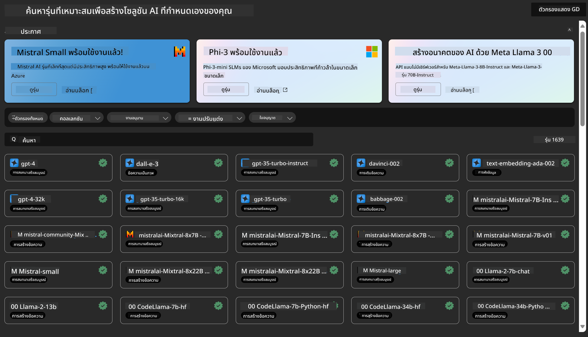
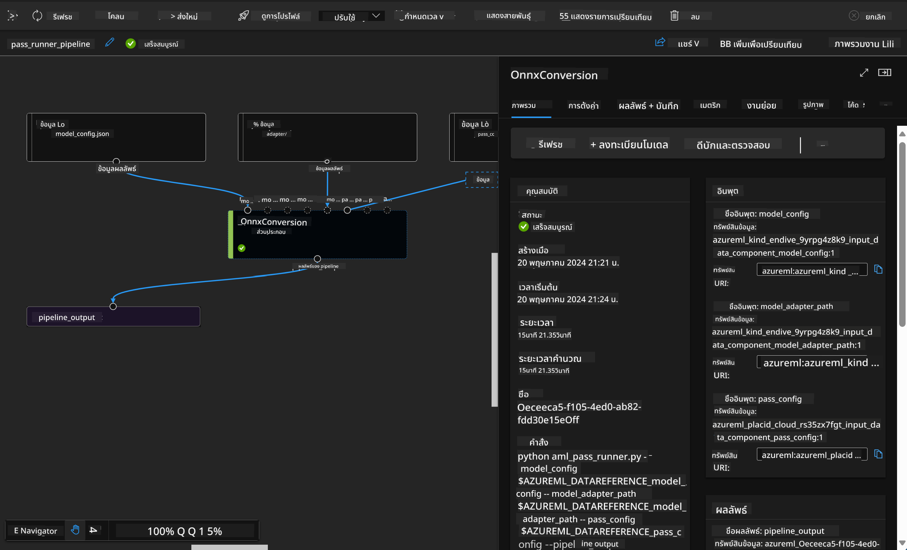

<!--
CO_OP_TRANSLATOR_METADATA:
{
  "original_hash": "7fe541373802e33568e94e13226d463c",
  "translation_date": "2025-07-17T09:42:28+00:00",
  "source_file": "md/03.FineTuning/Introduce_AzureML.md",
  "language_code": "th"
}
-->
# **แนะนำบริการ Azure Machine Learning**

[Azure Machine Learning](https://ml.azure.com?WT.mc_id=aiml-138114-kinfeylo) คือบริการคลาวด์ที่ช่วยเร่งและจัดการวงจรชีวิตโครงการแมชชีนเลิร์นนิง (ML)

ผู้เชี่ยวชาญด้าน ML นักวิทยาศาสตร์ข้อมูล และวิศวกร สามารถใช้บริการนี้ในงานประจำวันเพื่อ:

- ฝึกสอนและปรับใช้โมเดล  
- จัดการการดำเนินงานด้านแมชชีนเลิร์นนิง (MLOps)  
- คุณสามารถสร้างโมเดลใน Azure Machine Learning หรือใช้โมเดลที่สร้างจากแพลตฟอร์มโอเพนซอร์ส เช่น PyTorch, TensorFlow หรือ scikit-learn  
- เครื่องมือ MLOps ช่วยให้คุณติดตามผล ฝึกสอนซ้ำ และปรับใช้โมเดลใหม่ได้  

## Azure Machine Learning เหมาะกับใคร?

**นักวิทยาศาสตร์ข้อมูลและวิศวกร ML**  
พวกเขาสามารถใช้เครื่องมือเพื่อเร่งและทำให้งานประจำวันเป็นอัตโนมัติ  
Azure ML มีฟีเจอร์สำหรับความเป็นธรรม, การอธิบายผล, การติดตาม และการตรวจสอบ  

**นักพัฒนาแอปพลิเคชัน**  
สามารถผสานรวมโมเดลเข้ากับแอปพลิเคชันหรือบริการได้อย่างราบรื่น  

**นักพัฒนาแพลตฟอร์ม**  
เข้าถึงชุดเครื่องมือที่แข็งแกร่งซึ่งรองรับโดย Azure Resource Manager APIs ที่ทนทาน  
เครื่องมือเหล่านี้ช่วยให้สร้างเครื่องมือ ML ขั้นสูงได้  

**องค์กร**  
ทำงานบนคลาวด์ Microsoft Azure องค์กรจะได้รับประโยชน์จากความปลอดภัยที่คุ้นเคยและการควบคุมการเข้าถึงตามบทบาท  
ตั้งค่าโครงการเพื่อควบคุมการเข้าถึงข้อมูลที่ได้รับการปกป้องและการดำเนินการเฉพาะ  

## เพิ่มประสิทธิภาพสำหรับทุกคนในทีม  
โครงการ ML มักต้องการทีมที่มีทักษะหลากหลายเพื่อสร้างและดูแลรักษา  

Azure ML มีเครื่องมือที่ช่วยให้คุณ:  
- ร่วมมือกับทีมผ่านโน้ตบุ๊กที่แชร์ได้, ทรัพยากรคอมพิวต์, คอมพิวต์แบบไม่มีเซิร์ฟเวอร์, ข้อมูล และสภาพแวดล้อม  
- พัฒนาโมเดลที่มีความเป็นธรรม, อธิบายผลได้, ติดตาม และตรวจสอบ เพื่อให้เป็นไปตามข้อกำหนดด้านแหล่งที่มาและการตรวจสอบ  
- ปรับใช้โมเดล ML ได้อย่างรวดเร็วและง่ายดายในระดับใหญ่ และจัดการควบคุมด้วย MLOps อย่างมีประสิทธิภาพ  
- รันงานแมชชีนเลิร์นนิงได้ทุกที่ พร้อมการกำกับดูแล ความปลอดภัย และการปฏิบัติตามข้อกำหนดในตัว  

## เครื่องมือแพลตฟอร์มที่ใช้งานร่วมกันได้  

ใครก็ตามในทีม ML สามารถใช้เครื่องมือที่ชอบเพื่อทำงานให้เสร็จ  
ไม่ว่าจะเป็นการทดลองอย่างรวดเร็ว, การปรับแต่งไฮเปอร์พารามิเตอร์, การสร้าง pipeline หรือการจัดการการอนุมาน คุณสามารถใช้ส่วนติดต่อที่คุ้นเคยได้ เช่น:  
- Azure Machine Learning Studio  
- Python SDK (v2)  
- Azure CLI (v2)  
- Azure Resource Manager REST APIs  

เมื่อคุณปรับปรุงโมเดลและร่วมมือกันตลอดวงจรการพัฒนา คุณสามารถแชร์และค้นหาทรัพย์สิน, แหล่งข้อมูล และเมตริกผ่าน UI ของ Azure Machine Learning studio  

## **LLM/SLM ใน Azure ML**

Azure ML ได้เพิ่มฟังก์ชันที่เกี่ยวข้องกับ LLM/SLM มากมาย โดยผสาน LLMOps และ SLMOps เพื่อสร้างแพลตฟอร์มเทคโนโลยีปัญญาประดิษฐ์เชิงสร้างสรรค์ระดับองค์กร  

### **Model Catalog**

ผู้ใช้ในองค์กรสามารถปรับใช้โมเดลต่าง ๆ ตามสถานการณ์ทางธุรกิจที่แตกต่างกันผ่าน Model Catalog และให้บริการในรูปแบบ Model as Service สำหรับนักพัฒนาหรือผู้ใช้ในองค์กรเข้าถึง  

  

Model Catalog ใน Azure Machine Learning studio คือศูนย์กลางสำหรับค้นหาและใช้โมเดลหลากหลายที่ช่วยให้คุณสร้างแอปพลิเคชัน Generative AI ได้  
Model Catalog มีโมเดลนับร้อยจากผู้ให้บริการโมเดล เช่น Azure OpenAI service, Mistral, Meta, Cohere, Nvidia, Hugging Face รวมถึงโมเดลที่ฝึกสอนโดย Microsoft  
โมเดลจากผู้ให้บริการที่ไม่ใช่ Microsoft ถือเป็น Non-Microsoft Products ตามที่กำหนดใน Product Terms ของ Microsoft และอยู่ภายใต้เงื่อนไขที่มาพร้อมกับโมเดลนั้น  

### **Job Pipeline**

หัวใจของ pipeline ในแมชชีนเลิร์นนิงคือการแบ่งงาน ML ที่สมบูรณ์ออกเป็นขั้นตอนหลายขั้นตอน  
แต่ละขั้นตอนเป็นส่วนประกอบที่จัดการได้ สามารถพัฒนา ปรับแต่ง กำหนดค่า และทำให้อัตโนมัติได้อย่างอิสระ  
ขั้นตอนต่าง ๆ เชื่อมต่อกันผ่านอินเทอร์เฟซที่กำหนดไว้อย่างชัดเจน  
บริการ pipeline ของ Azure Machine Learning จะจัดการประสานงานความสัมพันธ์ระหว่างขั้นตอนทั้งหมดโดยอัตโนมัติ  

ในการปรับแต่ง SLM / LLM เราสามารถจัดการข้อมูล การฝึกสอน และกระบวนการสร้างผ่าน Pipeline  

  

### **Prompt flow**

ประโยชน์ของการใช้ Azure Machine Learning prompt flow  
Azure Machine Learning prompt flow มอบประโยชน์หลากหลายที่ช่วยให้ผู้ใช้เปลี่ยนจากการคิดไอเดียไปสู่การทดลอง และสุดท้ายสู่แอปพลิเคชัน LLM ที่พร้อมใช้งานในผลิตภัณฑ์:  

**ความคล่องตัวในการออกแบบ prompt**  

ประสบการณ์การเขียนแบบโต้ตอบ: Azure Machine Learning prompt flow แสดงโครงสร้างของ flow ในรูปแบบภาพ ช่วยให้ผู้ใช้เข้าใจและนำทางโครงการได้ง่าย  
นอกจากนี้ยังมีประสบการณ์การเขียนโค้ดแบบโน้ตบุ๊กที่ช่วยให้พัฒนาและดีบัก flow ได้อย่างมีประสิทธิภาพ  
ตัวแปรสำหรับการปรับแต่ง prompt: ผู้ใช้สามารถสร้างและเปรียบเทียบตัวแปร prompt หลายแบบ เพื่อช่วยในการปรับปรุงอย่างต่อเนื่อง  

การประเมินผล: flow การประเมินในตัวช่วยให้ผู้ใช้ประเมินคุณภาพและประสิทธิภาพของ prompt และ flow ได้  

ทรัพยากรครบครัน: Azure Machine Learning prompt flow มีไลบรารีเครื่องมือ ตัวอย่าง และเทมเพลตในตัวที่เป็นจุดเริ่มต้นสำหรับการพัฒนา ช่วยสร้างแรงบันดาลใจและเร่งกระบวนการ  

**ความพร้อมใช้งานในองค์กรสำหรับแอปพลิเคชันที่ใช้ LLM**  

การทำงานร่วมกัน: Azure Machine Learning prompt flow รองรับการทำงานร่วมกันในทีม ช่วยให้ผู้ใช้หลายคนทำงานร่วมกันในโครงการ prompt engineering แชร์ความรู้ และควบคุมเวอร์ชัน  

แพลตฟอร์มครบวงจร: Azure Machine Learning prompt flow ช่วยจัดการกระบวนการ prompt engineering ตั้งแต่การพัฒนา การประเมินผล ไปจนถึงการปรับใช้และการติดตาม  
ผู้ใช้สามารถปรับใช้ flow เป็น Azure Machine Learning endpoints และติดตามประสิทธิภาพแบบเรียลไทม์ เพื่อให้มั่นใจว่าทำงานได้อย่างเหมาะสมและพัฒนาอย่างต่อเนื่อง  

โซลูชันความพร้อมใช้งานในองค์กรของ Azure Machine Learning: Prompt flow ใช้ประโยชน์จากโซลูชันความพร้อมใช้งานในองค์กรที่แข็งแกร่งของ Azure Machine Learning เพื่อให้มีพื้นฐานที่ปลอดภัย ขยายขนาดได้ และเชื่อถือได้สำหรับการพัฒนา การทดลอง และการปรับใช้ flow  

ด้วย Azure Machine Learning prompt flow ผู้ใช้สามารถปลดปล่อยความคล่องตัวในการออกแบบ prompt ทำงานร่วมกันอย่างมีประสิทธิภาพ และใช้โซลูชันระดับองค์กรเพื่อพัฒนาและปรับใช้แอปพลิเคชันที่ใช้ LLM ได้อย่างสำเร็จ  

การผสานพลังการประมวลผล ข้อมูล และส่วนประกอบต่าง ๆ ของ Azure ML ทำให้นักพัฒนาองค์กรสามารถสร้างแอปพลิเคชันปัญญาประดิษฐ์ของตนเองได้อย่างง่ายดาย

**ข้อจำกัดความรับผิดชอบ**:  
เอกสารนี้ได้รับการแปลโดยใช้บริการแปลภาษาอัตโนมัติ [Co-op Translator](https://github.com/Azure/co-op-translator) แม้เราจะพยายามให้ความถูกต้องสูงสุด แต่โปรดทราบว่าการแปลอัตโนมัติอาจมีข้อผิดพลาดหรือความไม่ถูกต้อง เอกสารต้นฉบับในภาษาต้นทางถือเป็นแหล่งข้อมูลที่เชื่อถือได้ สำหรับข้อมูลที่สำคัญ ขอแนะนำให้ใช้บริการแปลโดยผู้เชี่ยวชาญมนุษย์ เราไม่รับผิดชอบต่อความเข้าใจผิดหรือการตีความผิดใด ๆ ที่เกิดจากการใช้การแปลนี้