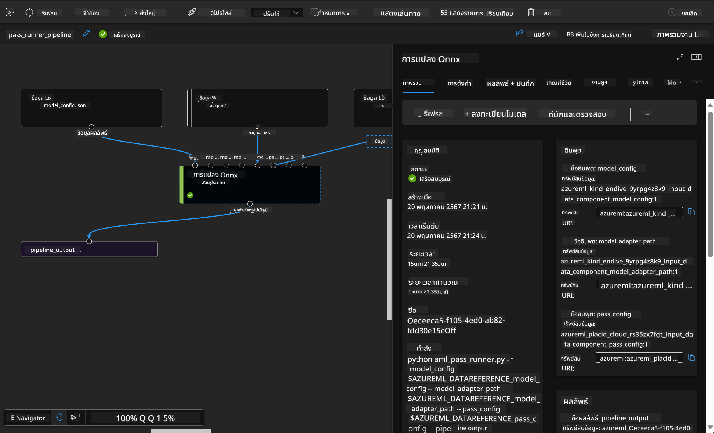

<!--
CO_OP_TRANSLATOR_METADATA:
{
  "original_hash": "7fe541373802e33568e94e13226d463c",
  "translation_date": "2025-05-09T22:20:28+00:00",
  "source_file": "md/03.FineTuning/Introduce_AzureML.md",
  "language_code": "th"
}
-->
# **แนะนำ Azure Machine Learning Service**

[Azure Machine Learning](https://ml.azure.com?WT.mc_id=aiml-138114-kinfeylo) คือบริการคลาวด์สำหรับเร่งและจัดการวงจรชีวิตโครงการแมชชีนเลิร์นนิง (ML)

ผู้เชี่ยวชาญ ML, นักวิทยาศาสตร์ข้อมูล และวิศวกร สามารถใช้ในงานประจำวันเพื่อ:

- ฝึกสอนและนำโมเดลไปใช้งาน
- จัดการการปฏิบัติงานด้านแมชชีนเลิร์นนิง (MLOps)
- คุณสามารถสร้างโมเดลใน Azure Machine Learning หรือใช้โมเดลที่สร้างจากแพลตฟอร์มโอเพนซอร์ส เช่น PyTorch, TensorFlow หรือ scikit-learn
- เครื่องมือ MLOps ช่วยให้คุณตรวจสอบ ฝึกสอนใหม่ และนำโมเดลกลับมาใช้งานอีกครั้งได้

## Azure Machine Learning เหมาะกับใคร?

**นักวิทยาศาสตร์ข้อมูลและวิศวกร ML**

พวกเขาสามารถใช้เครื่องมือเพื่อเร่งและทำให้งานประจำวันเป็นไปโดยอัตโนมัติ  
Azure ML มีฟีเจอร์สำหรับความเป็นธรรม, การอธิบายผล, การติดตาม และการตรวจสอบ

**นักพัฒนาแอปพลิเคชัน**  
พวกเขาสามารถผสานรวมโมเดลเข้ากับแอปหรือบริการได้อย่างราบรื่น

**นักพัฒนาแพลตฟอร์ม**  
เข้าถึงชุดเครื่องมือที่แข็งแกร่งซึ่งรองรับโดย Azure Resource Manager APIs ที่ทนทาน  
เครื่องมือเหล่านี้ช่วยให้สร้างเครื่องมือ ML ขั้นสูงได้

**องค์กร**  
ทำงานบนคลาวด์ Microsoft Azure องค์กรจะได้รับประโยชน์จากความปลอดภัยที่คุ้นเคยและการควบคุมการเข้าถึงตามบทบาท  
ตั้งค่าโครงการเพื่อควบคุมการเข้าถึงข้อมูลที่ได้รับการป้องกันและการดำเนินการเฉพาะ

## ผลผลิตสำหรับทุกคนในทีม  
โครงการ ML มักต้องการทีมที่มีทักษะหลากหลายเพื่อสร้างและดูแลรักษา

Azure ML มีเครื่องมือที่ช่วยให้คุณ:  
- ร่วมมือกับทีมผ่านโน้ตบุ๊กที่แชร์, ทรัพยากรคอมพิวต์, คอมพิวต์แบบไม่มีเซิร์ฟเวอร์, ข้อมูล และสภาพแวดล้อม  
- พัฒนาโมเดลที่มีความเป็นธรรม, อธิบายได้, ติดตาม และตรวจสอบ เพื่อให้สอดคล้องกับข้อกำหนดการตรวจสอบและแหล่งที่มา  
- นำโมเดล ML ไปใช้งานอย่างรวดเร็วและง่ายดายในระดับใหญ่ และจัดการควบคุมด้วย MLOps อย่างมีประสิทธิภาพ  
- รันงานแมชชีนเลิร์นนิงได้ทุกที่ พร้อมการกำกับดูแล, ความปลอดภัย และการปฏิบัติตามข้อกำหนดในตัว

## เครื่องมือแพลตฟอร์มที่ใช้งานร่วมกันได้

ใครก็ได้ในทีม ML สามารถใช้เครื่องมือที่ชอบเพื่อทำงานให้เสร็จ  
ไม่ว่าจะเป็นการทดลองอย่างรวดเร็ว, การปรับแต่ง hyperparameter, การสร้าง pipeline หรือการจัดการการอนุมาน คุณสามารถใช้ส่วนติดต่อที่คุ้นเคยได้ เช่น:  
- Azure Machine Learning Studio  
- Python SDK (v2)  
- Azure CLI (v2)  
- Azure Resource Manager REST APIs

เมื่อคุณปรับแต่งโมเดลและทำงานร่วมกันตลอดวงจรการพัฒนา คุณสามารถแชร์และค้นหาทรัพย์สิน, ทรัพยากร และเมตริกภายใน UI ของ Azure Machine Learning studio

## **LLM/SLM ใน Azure ML**

Azure ML ได้เพิ่มฟังก์ชันที่เกี่ยวข้องกับ LLM/SLM จำนวนมาก รวม LLMOps และ SLMOps เพื่อสร้างแพลตฟอร์มเทคโนโลยีปัญญาประดิษฐ์เชิงสร้างสรรค์สำหรับองค์กร

### **Model Catalog**

ผู้ใช้ในองค์กรสามารถนำโมเดลต่าง ๆ ไปใช้งานตามสถานการณ์ธุรกิจที่แตกต่างกันผ่าน Model Catalog และให้บริการในรูปแบบ Model as Service สำหรับนักพัฒนาหรือผู้ใช้ในองค์กรเข้าถึง

Model Catalog ใน Azure Machine Learning studio คือศูนย์กลางสำหรับค้นหาและใช้โมเดลหลากหลายที่ช่วยให้คุณสร้างแอปพลิเคชัน Generative AI ได้ โมเดลใน catalog มีหลายร้อยโมเดลจากผู้ให้บริการโมเดล เช่น Azure OpenAI service, Mistral, Meta, Cohere, Nvidia, Hugging Face รวมถึงโมเดลที่ฝึกโดย Microsoft โมเดลจากผู้ให้บริการที่ไม่ใช่ Microsoft จะถูกจัดเป็น Non-Microsoft Products ตามที่ระบุใน Product Terms ของ Microsoft และอยู่ภายใต้ข้อกำหนดที่มาพร้อมกับโมเดล

### **Job Pipeline**

หัวใจของ pipeline ในแมชชีนเลิร์นนิงคือการแบ่งงานแมชชีนเลิร์นนิงที่สมบูรณ์ออกเป็นขั้นตอนหลายขั้น แต่ละขั้นเป็นส่วนประกอบที่จัดการได้ สามารถพัฒนา ปรับแต่ง กำหนดค่า และทำให้อัตโนมัติได้แยกกัน ขั้นตอนเหล่านี้เชื่อมต่อกันผ่านอินเทอร์เฟซที่กำหนดไว้อย่างดี บริการ pipeline ของ Azure Machine Learning จะประสานงานอัตโนมัติระหว่างความขึ้นต่อกันของแต่ละขั้นตอน

ในการปรับแต่ง SLM / LLM เราสามารถจัดการข้อมูล การฝึกสอน และกระบวนการสร้างผ่าน Pipeline

### **Prompt flow**

ประโยชน์ของการใช้ Azure Machine Learning prompt flow  
Azure Machine Learning prompt flow มีประโยชน์หลากหลายที่ช่วยให้ผู้ใช้เปลี่ยนจากไอเดียไปสู่การทดลอง และสุดท้ายไปสู่แอปพลิเคชัน LLM ที่พร้อมใช้งานจริง:

**ความคล่องตัวในการออกแบบ prompt**

ประสบการณ์การเขียนแบบโต้ตอบ: Azure Machine Learning prompt flow แสดงภาพโครงสร้างของ flow อย่างชัดเจน ช่วยให้ผู้ใช้เข้าใจและนำทางโครงการได้ง่าย นอกจากนี้ยังมีประสบการณ์การเขียนโค้ดแบบโน้ตบุ๊กเพื่อพัฒนาและดีบัก flow อย่างมีประสิทธิภาพ  
ตัวแปรสำหรับการปรับแต่ง prompt: ผู้ใช้สามารถสร้างและเปรียบเทียบตัวแปร prompt หลายแบบ เพื่อช่วยให้ปรับแต่งได้อย่างต่อเนื่อง

การประเมินผล: flow การประเมินในตัวช่วยให้ผู้ใช้ประเมินคุณภาพและประสิทธิภาพของ prompt และ flow ได้

ทรัพยากรครบครัน: Azure Machine Learning prompt flow มีไลบรารีเครื่องมือ ตัวอย่าง และเทมเพลตในตัว ซึ่งเป็นจุดเริ่มต้นสำหรับการพัฒนา สร้างแรงบันดาลใจ และเร่งกระบวนการ

**ความพร้อมสำหรับองค์กรในการใช้งานแอป LLM**

การทำงานร่วมกัน: Azure Machine Learning prompt flow รองรับการทำงานร่วมกันในทีม ช่วยให้ผู้ใช้หลายคนทำงานร่วมกันในโครงการ prompt engineering แชร์ความรู้ และรักษาการควบคุมเวอร์ชัน

แพลตฟอร์มครบวงจร: Azure Machine Learning prompt flow ช่วยให้งาน prompt engineering ครบถ้วน ตั้งแต่การพัฒนา การประเมินผล จนถึงการนำไปใช้งานและการตรวจสอบ ผู้ใช้สามารถนำ flow ไปใช้งานเป็น Azure Machine Learning endpoints และติดตามประสิทธิภาพแบบเรียลไทม์ เพื่อให้มั่นใจว่าทำงานได้ดีที่สุดและปรับปรุงอย่างต่อเนื่อง

Azure Machine Learning Enterprise Readiness Solutions: Prompt flow ใช้ประโยชน์จากโซลูชันความพร้อมสำหรับองค์กรของ Azure Machine Learning ที่มีความปลอดภัย ขยายขนาดได้ และเชื่อถือได้ เป็นพื้นฐานสำหรับการพัฒนา ทดลอง และนำ flow ไปใช้งาน

ด้วย Azure Machine Learning prompt flow ผู้ใช้สามารถปลดปล่อยความคล่องตัวในการออกแบบ prompt ทำงานร่วมกันอย่างมีประสิทธิภาพ และใช้โซลูชันระดับองค์กรเพื่อพัฒนาและนำแอป LLM ไปใช้งานได้สำเร็จ

การผสานพลังคอมพิวต์ ข้อมูล และส่วนประกอบต่าง ๆ ของ Azure ML ทำให้นักพัฒนาองค์กรสามารถสร้างแอปพลิเคชันปัญญาประดิษฐ์ของตนเองได้อย่างง่ายดาย

**ข้อจำกัดความรับผิดชอบ**:  
เอกสารนี้ได้รับการแปลโดยใช้บริการแปลภาษา AI [Co-op Translator](https://github.com/Azure/co-op-translator) แม้ว่าเราจะพยายามให้มีความถูกต้อง โปรดทราบว่าการแปลโดยอัตโนมัติอาจมีข้อผิดพลาดหรือความไม่แม่นยำ เอกสารต้นฉบับในภาษาต้นทางถือเป็นแหล่งข้อมูลที่เชื่อถือได้ สำหรับข้อมูลที่สำคัญ ขอแนะนำให้ใช้บริการแปลโดยผู้เชี่ยวชาญมนุษย์ เราไม่รับผิดชอบต่อความเข้าใจผิดหรือการตีความผิดใด ๆ ที่เกิดจากการใช้การแปลนี้