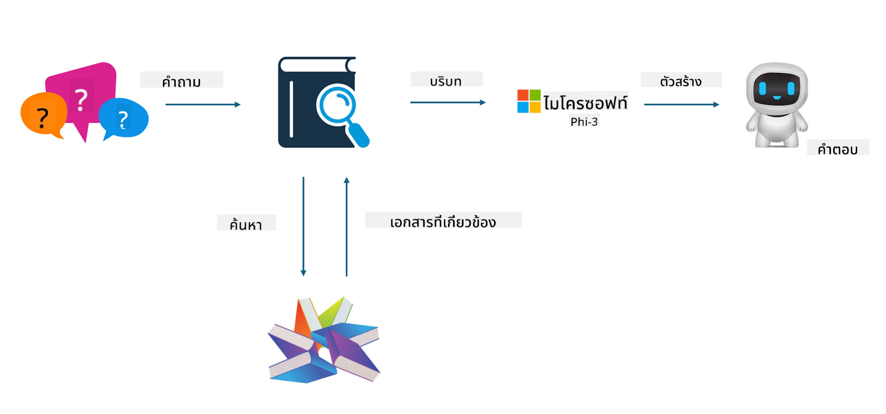
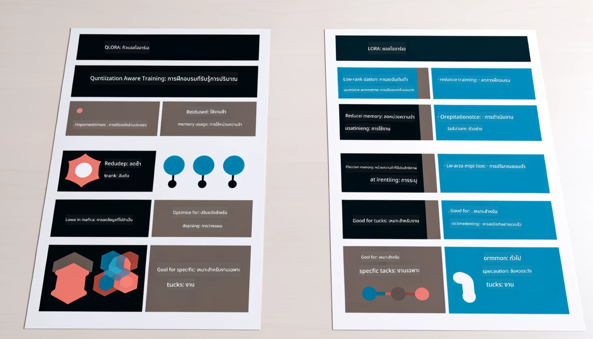

<!--
CO_OP_TRANSLATOR_METADATA:
{
  "original_hash": "743d7e9cb9c4e8ea642d77bee657a7fa",
  "translation_date": "2025-05-09T22:27:00+00:00",
  "source_file": "md/03.FineTuning/LetPhi3gotoIndustriy.md",
  "language_code": "th"
}
-->
# **ให้ Phi-3 กลายเป็นผู้เชี่ยวชาญในอุตสาหกรรม**

ในการนำโมเดล Phi-3 ไปใช้ในอุตสาหกรรม คุณจำเป็นต้องเพิ่มข้อมูลธุรกิจอุตสาหกรรมลงในโมเดล Phi-3 เรามีตัวเลือกสองแบบ คือ RAG (Retrieval Augmented Generation) และ Fine Tuning

## **RAG กับ Fine-Tuning**

### **Retrieval Augmented Generation**

RAG คือการดึงข้อมูลและสร้างข้อความ ข้อมูลที่มีโครงสร้างและไม่มีโครงสร้างขององค์กรจะถูกเก็บไว้ในฐานข้อมูลเวกเตอร์ เมื่อค้นหาข้อมูลที่เกี่ยวข้อง จะพบสรุปและเนื้อหาที่เกี่ยวข้องเพื่อนำมาสร้างบริบท และรวมกับความสามารถในการเติมข้อความของ LLM/SLM เพื่อสร้างเนื้อหา

### **Fine-tuning**

Fine-tuning คือการปรับปรุงโมเดลที่มีอยู่ ไม่จำเป็นต้องเริ่มจากอัลกอริทึมของโมเดล แต่ต้องสะสมข้อมูลอย่างต่อเนื่อง หากต้องการคำศัพท์และการแสดงออกทางภาษาที่แม่นยำในแอปพลิเคชันอุตสาหกรรม Fine-tuning คือทางเลือกที่ดีกว่า แต่ถ้าข้อมูลเปลี่ยนแปลงบ่อย Fine-tuning อาจซับซ้อนขึ้น

### **วิธีการเลือก**

1. หากคำตอบของเราต้องใช้ข้อมูลภายนอก RAG คือทางเลือกที่ดีที่สุด

2. หากต้องการผลลัพธ์ที่มั่นคงและแม่นยำในความรู้เชิงอุตสาหกรรม Fine-tuning จะเป็นตัวเลือกที่ดี RAG เน้นดึงเนื้อหาที่เกี่ยวข้องแต่บางครั้งอาจไม่ตรงกับความละเอียดเชิงเฉพาะ

3. Fine-tuning ต้องการชุดข้อมูลคุณภาพสูง และถ้าเป็นข้อมูลเพียงช่วงเล็กๆ จะไม่เห็นผลชัดเจน RAG จะยืดหยุ่นกว่า

4. Fine-tuning เป็นกล่องดำ เป็นเรื่องลึกลับ และเข้าใจกลไกภายในได้ยาก แต่ RAG ช่วยให้หาต้นทางข้อมูลได้ง่ายขึ้น จึงช่วยปรับแก้ hallucination หรือข้อผิดพลาดในเนื้อหาได้อย่างมีประสิทธิภาพ และเพิ่มความโปร่งใส

### **สถานการณ์ใช้งาน**

1. อุตสาหกรรมเฉพาะที่ต้องการคำศัพท์และการแสดงออกเฉพาะทาง ***Fine-tuning*** คือทางเลือกที่ดีที่สุด

2. ระบบถามตอบที่เกี่ยวข้องกับการสังเคราะห์ความรู้หลายจุด ***RAG*** คือทางเลือกที่ดีที่สุด

3. การรวมกันของกระบวนการธุรกิจอัตโนมัติ ***RAG + Fine-tuning*** คือทางเลือกที่ดีที่สุด

## **วิธีใช้ RAG**

ฐานข้อมูลเวกเตอร์คือการเก็บข้อมูลในรูปแบบทางคณิตศาสตร์ ฐานข้อมูลเวกเตอร์ช่วยให้โมเดลการเรียนรู้ของเครื่องจำข้อมูลที่ป้อนเข้าก่อนหน้าได้ง่ายขึ้น ทำให้การเรียนรู้ของเครื่องสามารถสนับสนุนการใช้งานเช่น การค้นหา การแนะนำ และการสร้างข้อความ ข้อมูลสามารถระบุได้จากมาตรวัดความคล้ายคลึงแทนที่จะต้องตรงกันเป๊ะ ทำให้โมเดลคอมพิวเตอร์เข้าใจบริบทของข้อมูลได้

ฐานข้อมูลเวกเตอร์คือกุญแจสำคัญในการทำให้ RAG เป็นจริง เราสามารถแปลงข้อมูลเป็นการจัดเก็บแบบเวกเตอร์ผ่านโมเดลเวกเตอร์ เช่น text-embedding-3, jina-ai-embedding เป็นต้น

เรียนรู้เพิ่มเติมเกี่ยวกับการสร้างแอป RAG ได้ที่ [https://github.com/microsoft/Phi-3CookBook](https://github.com/microsoft/Phi-3CookBook?WT.mc_id=aiml-138114-kinfeylo)

## **วิธีใช้ Fine-tuning**

อัลกอริทึมที่ใช้บ่อยใน Fine-tuning คือ Lora และ QLora จะเลือกอย่างไร?
- [เรียนรู้เพิ่มเติมด้วยสมุดโน้ตตัวอย่างนี้](../../../../code/04.Finetuning/Phi_3_Inference_Finetuning.ipynb)
- [ตัวอย่าง Python FineTuning Sample](../../../../code/04.Finetuning/FineTrainingScript.py)

### **Lora และ QLora**

LoRA (Low-Rank Adaptation) และ QLoRA (Quantized Low-Rank Adaptation) เป็นเทคนิคที่ใช้ปรับแต่งโมเดลภาษาขนาดใหญ่ (LLMs) โดยใช้ Parameter Efficient Fine Tuning (PEFT) เทคนิค PEFT ถูกออกแบบมาเพื่อฝึกโมเดลอย่างมีประสิทธิภาพมากกว่าวิธีแบบดั้งเดิม  
LoRA เป็นเทคนิค fine-tuning แบบอิสระที่ลดการใช้หน่วยความจำโดยใช้การประมาณค่าต่ำสำหรับเมทริกซ์อัปเดตน้ำหนัก ช่วยให้การฝึกเร็วและยังรักษาประสิทธิภาพใกล้เคียงกับวิธี fine-tuning แบบดั้งเดิม

QLoRA เป็นเวอร์ชันขยายของ LoRA ที่รวมเทคนิคการทำ quantization เพื่อลดการใช้หน่วยความจำลงอีก QLoRA จะทำการ quantize ความแม่นยำของพารามิเตอร์น้ำหนักใน LLM ที่ผ่านการฝึกมาแล้วเป็นความแม่นยำระดับ 4 บิต ซึ่งประหยัดหน่วยความจำมากกว่า LoRA แต่การฝึก QLoRA จะช้ากว่าการฝึก LoRA ประมาณ 30% เนื่องจากมีขั้นตอนการ quantize และ dequantize เพิ่มเติม

QLoRA ใช้ LoRA เป็นตัวเสริมเพื่อแก้ไขข้อผิดพลาดที่เกิดจากการ quantization QLoRA ช่วยให้สามารถ fine-tune โมเดลขนาดใหญ่ที่มีพารามิเตอร์หลายพันล้านตัวบน GPU ขนาดเล็กที่มีอยู่ทั่วไปได้ เช่น QLoRA สามารถ fine-tune โมเดลขนาด 70B พารามิเตอร์ที่ต้องการ 36 GPUs ด้วยเพียง 2 GPUs เท่านั้น

**ข้อจำกัดความรับผิดชอบ**:  
เอกสารนี้ได้รับการแปลโดยใช้บริการแปลภาษา AI [Co-op Translator](https://github.com/Azure/co-op-translator) แม้ว่าเราจะพยายามให้ความถูกต้องสูงสุด แต่โปรดทราบว่าการแปลอัตโนมัติอาจมีข้อผิดพลาดหรือความไม่ถูกต้อง เอกสารต้นฉบับในภาษาต้นทางถือเป็นแหล่งข้อมูลที่เชื่อถือได้ สำหรับข้อมูลที่สำคัญ ขอแนะนำให้ใช้บริการแปลโดยผู้เชี่ยวชาญมนุษย์ เราจะไม่รับผิดชอบต่อความเข้าใจผิดหรือการตีความผิดใด ๆ ที่เกิดขึ้นจากการใช้การแปลนี้