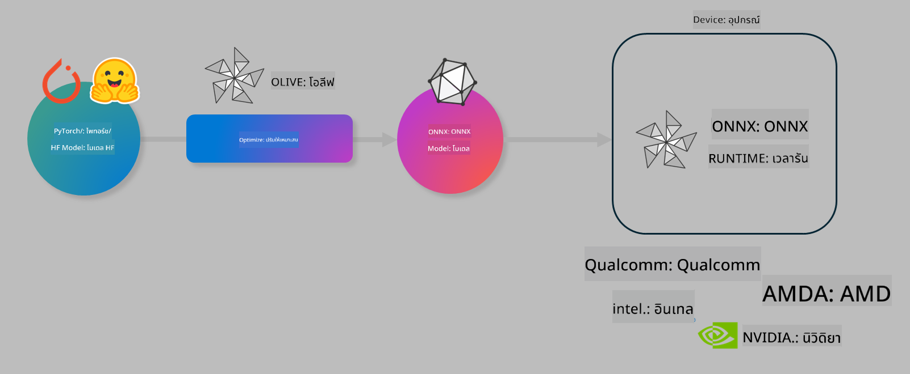

<!--
CO_OP_TRANSLATOR_METADATA:
{
  "original_hash": "6bbe47de3b974df7eea29dfeccf6032b",
  "translation_date": "2025-05-09T22:37:08+00:00",
  "source_file": "md/03.FineTuning/olive-lab/readme.md",
  "language_code": "th"
}
-->
# Lab. ปรับแต่งโมเดล AI สำหรับการประมวลผลบนอุปกรณ์

## บทนำ

> [!IMPORTANT]
> ห้องปฏิบัติการนี้ต้องใช้ **Nvidia A10 หรือ A100 GPU** พร้อมไดรเวอร์และ CUDA toolkit (เวอร์ชัน 12 ขึ้นไป) ที่ติดตั้งเรียบร้อยแล้ว

> [!NOTE]
> ห้องปฏิบัติการนี้ใช้เวลาประมาณ **35 นาที** ซึ่งจะช่วยให้คุณได้เรียนรู้แนวคิดหลักในการปรับแต่งโมเดลสำหรับการประมวลผลบนอุปกรณ์โดยใช้ OLIVE

## วัตถุประสงค์การเรียนรู้

เมื่อจบห้องปฏิบัติการนี้ คุณจะสามารถใช้ OLIVE เพื่อ:

- ทำ Quantize โมเดล AI โดยใช้วิธี AWQ quantization
- ปรับแต่งโมเดล AI สำหรับงานเฉพาะ
- สร้าง LoRA adapters (โมเดลที่ผ่านการปรับแต่ง) เพื่อประสิทธิภาพการประมวลผลบนอุปกรณ์โดยใช้ ONNX Runtime

### Olive คืออะไร

Olive (*O*NNX *live*) คือชุดเครื่องมือสำหรับปรับแต่งโมเดลพร้อม CLI ที่ช่วยให้คุณส่งมอบโมเดลสำหรับ ONNX runtime +++https://onnxruntime.ai+++ ด้วยคุณภาพและประสิทธิภาพสูง



ข้อมูลนำเข้า (input) ของ Olive ส่วนใหญ่เป็นโมเดล PyTorch หรือ Hugging Face และผลลัพธ์ (output) คือโมเดล ONNX ที่ถูกปรับแต่งและทำงานบนอุปกรณ์ (เป้าหมายการใช้งาน) ที่รัน ONNX runtime Olive จะปรับแต่งโมเดลให้เหมาะสมกับ AI accelerator (NPU, GPU, CPU) ของอุปกรณ์นั้น ๆ ที่จัดหาโดยผู้ผลิตฮาร์ดแวร์ เช่น Qualcomm, AMD, Nvidia หรือ Intel

Olive ทำงานผ่าน *workflow* ซึ่งเป็นลำดับขั้นตอนของงานปรับแต่งโมเดลที่เรียกว่า *passes* - ตัวอย่าง passes ได้แก่ การบีบอัดโมเดล, การจับภาพกราฟ, การทำ quantization, การปรับแต่งกราฟ แต่ละ pass มีชุดพารามิเตอร์ที่สามารถปรับแต่งเพื่อให้ได้ผลลัพธ์ที่ดีที่สุด เช่น ความแม่นยำและความหน่วงเวลาที่ถูกประเมินโดย evaluator ที่เกี่ยวข้อง Olive ใช้กลยุทธ์การค้นหาโดยใช้ search algorithm เพื่อปรับแต่งแต่ละ pass ทีละตัวหรือหลาย pass พร้อมกัน

#### ประโยชน์ของ Olive

- **ลดความยุ่งยากและเวลาที่เสียไป** ในการทดลองด้วยมือกับเทคนิคต่าง ๆ เช่น การปรับแต่งกราฟ การบีบอัด และการทำ quantization กำหนดข้อจำกัดด้านคุณภาพและประสิทธิภาพ แล้วให้ Olive ค้นหาโมเดลที่ดีที่สุดให้คุณโดยอัตโนมัติ
- **มีคอมโพเนนต์ปรับแต่งโมเดลในตัวกว่า 40 รายการ** ครอบคลุมเทคนิคล่าสุดใน quantization, compression, graph optimization และ finetuning
- **CLI ใช้งานง่าย** สำหรับงานปรับแต่งโมเดลทั่วไป เช่น olive quantize, olive auto-opt, olive finetune
- มีระบบแพ็กเกจและปรับใช้โมเดลในตัว
- รองรับการสร้างโมเดลสำหรับ **Multi LoRA serving**
- สร้าง workflow ด้วย YAML/JSON เพื่อจัดการงานปรับแต่งและปรับใช้โมเดล
- เชื่อมต่อกับ **Hugging Face** และ **Azure AI**
- มีระบบ **caching** ในตัวช่วย **ลดค่าใช้จ่าย**

## คำแนะนำในการทำ Lab
> [!NOTE]
> โปรดตรวจสอบว่าคุณได้จัดเตรียม Azure AI Hub และ Project พร้อมตั้งค่า A100 compute ตาม Lab 1 แล้ว

### ขั้นตอนที่ 0: เชื่อมต่อกับ Azure AI Compute

คุณจะเชื่อมต่อกับ Azure AI compute ผ่านฟีเจอร์ remote ใน **VS Code**

1. เปิดแอปพลิเคชัน **VS Code** บนเดสก์ท็อปของคุณ
1. เปิด **command palette** โดยกด **Shift+Ctrl+P**
1. ใน command palette ค้นหา **AzureML - remote: Connect to compute instance in New Window**
1. ทำตามคำแนะนำบนหน้าจอเพื่อเชื่อมต่อกับ Compute โดยจะต้องเลือก Azure Subscription, Resource Group, Project และชื่อ Compute ที่คุณตั้งค่าใน Lab 1
1. เมื่อเชื่อมต่อกับ Azure ML Compute node แล้ว จะปรากฏที่ **มุมล่างซ้ายของ Visual Code** `><Azure ML: Compute Name`

### ขั้นตอนที่ 1: โคลน repo นี้

ใน VS Code คุณสามารถเปิดเทอร์มินัลใหม่ด้วย **Ctrl+J** แล้วโคลน repo นี้:

ในเทอร์มินัลจะเห็นพรอมต์

```
azureuser@computername:~/cloudfiles/code$ 
```
โคลนโซลูชัน

```bash
cd ~/localfiles
git clone https://github.com/microsoft/phi-3cookbook.git
```

### ขั้นตอนที่ 2: เปิดโฟลเดอร์ใน VS Code

เพื่อเปิด VS Code ในโฟลเดอร์ที่เกี่ยวข้อง ให้รันคำสั่งนี้ในเทอร์มินัล ซึ่งจะเปิดหน้าต่างใหม่:

```bash
code phi-3cookbook/code/04.Finetuning/Olive-lab
```

อีกทางเลือกหนึ่งคือเปิดโฟลเดอร์โดยเลือก **File** > **Open Folder**

### ขั้นตอนที่ 3: ติดตั้ง Dependencies

เปิดเทอร์มินัลใน VS Code บน Azure AI Compute Instance ของคุณ (เคล็ดลับ: **Ctrl+J**) และรันคำสั่งต่อไปนี้เพื่อติดตั้ง dependencies:

```bash
conda create -n olive-ai python=3.11 -y
conda activate olive-ai
pip install -r requirements.txt
az extension remove -n azure-cli-ml
az extension add -n ml
```

> [!NOTE]
> ใช้เวลาประมาณ ~5 นาทีในการติดตั้ง dependencies ทั้งหมด

ในห้องปฏิบัติการนี้คุณจะดาวน์โหลดและอัปโหลดโมเดลไปยัง Azure AI Model catalog ดังนั้นเพื่อเข้าถึง catalog คุณต้องล็อกอิน Azure ด้วยคำสั่งนี้:

```bash
az login
```

> [!NOTE]
> ตอนล็อกอินคุณจะถูกถามให้เลือก subscription ให้ตั้งค่าเป็น subscription ที่ได้รับมอบหมายสำหรับห้องปฏิบัติการนี้

### ขั้นตอนที่ 4: รันคำสั่ง Olive

เปิดเทอร์มินัลใน VS Code บน Azure AI Compute Instance (เคล็ดลับ: **Ctrl+J**) และตรวจสอบว่าเปิดใช้งานสภาพแวดล้อม `olive-ai` conda แล้ว:

```bash
conda activate olive-ai
```

จากนั้นรันคำสั่ง Olive ดังต่อไปนี้ใน command line

1. **ตรวจสอบข้อมูล:** ในตัวอย่างนี้ คุณจะปรับแต่งโมเดล Phi-3.5-Mini เพื่อให้เชี่ยวชาญในการตอบคำถามเกี่ยวกับการเดินทาง โค้ดด้านล่างจะแสดงเรคคอร์ดแรก ๆ ของชุดข้อมูลในรูปแบบ JSON lines:

    ```bash
    head data/data_sample_travel.jsonl
    ```
2. **ทำ Quantize โมเดล:** ก่อนฝึกฝนโมเดล คุณจะทำ quantize ด้วยคำสั่งนี้ที่ใช้เทคนิค Active Aware Quantization (AWQ) +++https://arxiv.org/abs/2306.00978+++ AWQ จะ quantize น้ำหนักของโมเดลโดยพิจารณาการกระตุ้น (activations) ที่เกิดขึ้นระหว่างการ inference ซึ่งช่วยให้การ quantize เก็บความแม่นยำของโมเดลได้ดีกว่าวิธี quantize น้ำหนักแบบดั้งเดิม

    ```bash
    olive quantize \
       --model_name_or_path microsoft/Phi-3.5-mini-instruct \
       --trust_remote_code \
       --algorithm awq \
       --output_path models/phi/awq \
       --log_level 1
    ```

    ใช้เวลาประมาณ **~8 นาที** ในการทำ AWQ quantization ซึ่งจะ **ลดขนาดโมเดลจาก ~7.5GB เหลือ ~2.5GB**

    ในห้องปฏิบัติการนี้ เราจะแสดงวิธีนำเข้าโมเดลจาก Hugging Face (เช่น `microsoft/Phi-3.5-mini-instruct`). However, Olive also allows you to input models from the Azure AI catalog by updating the `model_name_or_path` argument to an Azure AI asset ID (for example:  `azureml://registries/azureml/models/Phi-3.5-mini-instruct/versions/4`). 

1. **Train the model:** Next, the `olive finetune` คำสั่งนี้ใช้ปรับแต่งโมเดลที่ผ่านการ quantize แล้ว การทำ quantize ก่อนการฝึกปรับแต่งจะให้ความแม่นยำดีกว่าทำหลังฝึกปรับแต่งเพราะกระบวนการฝึกจะช่วยกู้คืนความสูญเสียจากการ quantize

    ```bash
    olive finetune \
        --method lora \
        --model_name_or_path models/phi/awq \
        --data_files "data/data_sample_travel.jsonl" \
        --data_name "json" \
        --text_template "<|user|>\n{prompt}<|end|>\n<|assistant|>\n{response}<|end|>" \
        --max_steps 100 \
        --output_path ./models/phi/ft \
        --log_level 1
    ```

    ใช้เวลาประมาณ **~6 นาที** ในการฝึกปรับแต่ง (100 ขั้นตอน)

3. **ปรับแต่งโมเดล:** เมื่อโมเดลผ่านการฝึกแล้ว ให้ปรับแต่งโมเดลโดยใช้คำสั่ง `auto-opt` command, which will capture the ONNX graph and automatically perform a number of optimizations to improve the model performance for CPU by compressing the model and doing fusions. It should be noted, that you can also optimize for other devices such as NPU or GPU by just updating the `--device` and `--provider` ของ Olive — แต่สำหรับห้องปฏิบัติการนี้จะใช้ CPU

    ```bash
    olive auto-opt \
       --model_name_or_path models/phi/ft/model \
       --adapter_path models/phi/ft/adapter \
       --device cpu \
       --provider CPUExecutionProvider \
       --use_ort_genai \
       --output_path models/phi/onnx-ao \
       --log_level 1
    ```

    ใช้เวลาประมาณ **~5 นาที** ในการปรับแต่งโมเดล

### ขั้นตอนที่ 5: ทดสอบ inference โมเดลอย่างรวดเร็ว

เพื่อทดสอบการ inference โมเดล ให้สร้างไฟล์ Python ในโฟลเดอร์ของคุณชื่อ **app.py** แล้วคัดลอกโค้ดต่อไปนี้ไปวาง:

```python
import onnxruntime_genai as og
import numpy as np

print("loading model and adapters...", end="", flush=True)
model = og.Model("models/phi/onnx-ao/model")
adapters = og.Adapters(model)
adapters.load("models/phi/onnx-ao/model/adapter_weights.onnx_adapter", "travel")
print("DONE!")

tokenizer = og.Tokenizer(model)
tokenizer_stream = tokenizer.create_stream()

params = og.GeneratorParams(model)
params.set_search_options(max_length=100, past_present_share_buffer=False)
user_input = "what is the best thing to see in chicago"
params.input_ids = tokenizer.encode(f"<|user|>\n{user_input}<|end|>\n<|assistant|>\n")

generator = og.Generator(model, params)

generator.set_active_adapter(adapters, "travel")

print(f"{user_input}")

while not generator.is_done():
    generator.compute_logits()
    generator.generate_next_token()

    new_token = generator.get_next_tokens()[0]
    print(tokenizer_stream.decode(new_token), end='', flush=True)

print("\n")
```

รันโค้ดด้วยคำสั่งนี้:

```bash
python app.py
```

### ขั้นตอนที่ 6: อัปโหลดโมเดลไปยัง Azure AI

การอัปโหลดโมเดลไปยังที่เก็บโมเดลของ Azure AI จะช่วยให้แชร์โมเดลกับสมาชิกในทีมพัฒนาและจัดการเวอร์ชันของโมเดลได้ เพื่ออัปโหลดโมเดลให้รันคำสั่งนี้:

> [!NOTE]
> อัปเดตค่า `{}` ` placeholders with the name of your resource group and Azure AI Project Name. 

To find your resource group ` "resourceGroup" และชื่อโปรเจกต์ Azure AI แล้วรันคำสั่งนี้

```
az ml workspace show
```

หรือไปที่ +++ai.azure.com+++ แล้วเลือก **management center** > **project** > **overview**

อัปเดตค่า `{}` ด้วยชื่อ resource group และชื่อโปรเจกต์ Azure AI ของคุณ

```bash
az ml model create \
    --name ft-for-travel \
    --version 1 \
    --path ./models/phi/onnx-ao \
    --resource-group {RESOURCE_GROUP_NAME} \
    --workspace-name {PROJECT_NAME}
```

คุณจะเห็นโมเดลที่อัปโหลดและสามารถปรับใช้โมเดลได้ที่ https://ml.azure.com/model/list

**ข้อจำกัดความรับผิดชอบ**:  
เอกสารฉบับนี้ได้รับการแปลโดยใช้บริการแปลภาษาด้วย AI [Co-op Translator](https://github.com/Azure/co-op-translator) แม้เราจะพยายามให้มีความถูกต้อง โปรดทราบว่าการแปลอัตโนมัติอาจมีข้อผิดพลาดหรือความไม่แม่นยำ เอกสารต้นฉบับในภาษาดั้งเดิมถือเป็นแหล่งข้อมูลที่เชื่อถือได้ สำหรับข้อมูลที่สำคัญ ขอแนะนำให้ใช้การแปลโดยผู้เชี่ยวชาญมนุษย์ เราไม่รับผิดชอบต่อความเข้าใจผิดหรือการตีความผิดที่เกิดขึ้นจากการใช้การแปลนี้