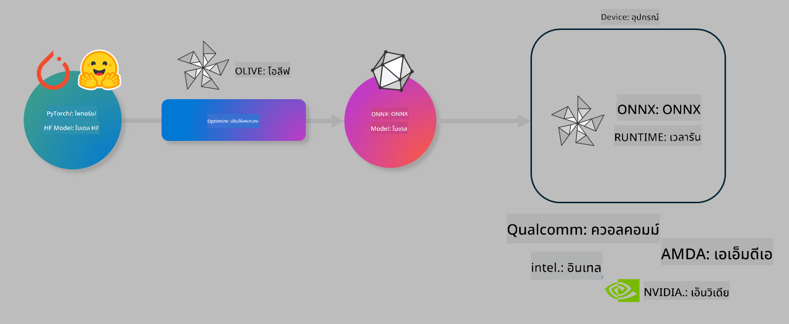

<!--
CO_OP_TRANSLATOR_METADATA:
{
  "original_hash": "6bbe47de3b974df7eea29dfeccf6032b",
  "translation_date": "2025-07-17T10:20:14+00:00",
  "source_file": "md/03.FineTuning/olive-lab/readme.md",
  "language_code": "th"
}
-->
# Lab. ปรับแต่งโมเดล AI สำหรับการประมวลผลบนอุปกรณ์

## บทนำ

> [!IMPORTANT]  
> ห้องปฏิบัติการนี้ต้องใช้ **Nvidia A10 หรือ A100 GPU** พร้อมไดรเวอร์และ CUDA toolkit (เวอร์ชัน 12 ขึ้นไป) ที่ติดตั้งเรียบร้อยแล้ว

> [!NOTE]  
> ห้องปฏิบัติการนี้ใช้เวลาประมาณ **35 นาที** เพื่อให้คุณได้เรียนรู้และลงมือปฏิบัติแนวคิดหลักในการปรับแต่งโมเดลสำหรับการประมวลผลบนอุปกรณ์โดยใช้ OLIVE

## วัตถุประสงค์การเรียนรู้

เมื่อจบห้องปฏิบัติการนี้ คุณจะสามารถใช้ OLIVE เพื่อ:

- ทำ Quantize โมเดล AI โดยใช้วิธี AWQ quantization  
- ปรับแต่งโมเดล AI สำหรับงานเฉพาะ  
- สร้าง LoRA adapters (โมเดลที่ผ่านการปรับแต่ง) เพื่อการประมวลผลบนอุปกรณ์อย่างมีประสิทธิภาพบน ONNX Runtime

### Olive คืออะไร

Olive (*O*NNX *live*) คือชุดเครื่องมือสำหรับการปรับแต่งโมเดลพร้อม CLI ที่ช่วยให้คุณสามารถส่งมอบโมเดลสำหรับ ONNX runtime +++https://onnxruntime.ai+++ ด้วยคุณภาพและประสิทธิภาพสูง



อินพุตของ Olive มักจะเป็นโมเดล PyTorch หรือ Hugging Face และผลลัพธ์คือโมเดล ONNX ที่ถูกปรับแต่งและรันบนอุปกรณ์เป้าหมาย (deployment target) ที่ใช้ ONNX runtime Olive จะปรับแต่งโมเดลให้เหมาะสมกับ AI accelerator (NPU, GPU, CPU) ของอุปกรณ์เป้าหมายที่จัดหาโดยผู้ผลิตฮาร์ดแวร์ เช่น Qualcomm, AMD, Nvidia หรือ Intel

Olive ทำงานโดยใช้ *workflow* ซึ่งเป็นลำดับขั้นตอนของงานปรับแต่งโมเดลที่เรียกว่า *passes* ตัวอย่างของ passes ได้แก่ การบีบอัดโมเดล, การจับภาพกราฟ, การทำ quantization, การปรับแต่งกราฟ แต่ละ pass มีพารามิเตอร์ที่สามารถปรับแต่งเพื่อให้ได้ผลลัพธ์ที่ดีที่สุด เช่น ความแม่นยำและความหน่วงเวลา ซึ่งจะถูกประเมินโดย evaluator ที่เกี่ยวข้อง Olive ใช้กลยุทธ์การค้นหาโดยอัลกอริทึมเพื่อปรับแต่งแต่ละ pass ทีละตัวหรือหลาย pass พร้อมกันโดยอัตโนมัติ

#### ข้อดีของ Olive

- **ลดความยุ่งยากและเวลาที่ใช้ในการทดลองด้วยตนเอง** กับเทคนิคต่าง ๆ ในการปรับแต่งกราฟ, การบีบอัด และการทำ quantization กำหนดข้อจำกัดด้านคุณภาพและประสิทธิภาพ แล้วให้ Olive ค้นหาโมเดลที่ดีที่สุดให้คุณโดยอัตโนมัติ  
- **มีคอมโพเนนต์ปรับแต่งโมเดลมากกว่า 40 รายการ** ครอบคลุมเทคนิคล้ำสมัยในด้าน quantization, การบีบอัด, การปรับแต่งกราฟ และการปรับแต่งโมเดล  
- **CLI ใช้งานง่าย** สำหรับงานปรับแต่งโมเดลทั่วไป เช่น olive quantize, olive auto-opt, olive finetune  
- มีระบบแพ็กเกจและการดีพลอยโมเดลในตัว  
- รองรับการสร้างโมเดลสำหรับ **Multi LoRA serving**  
- สร้าง workflow ด้วย YAML/JSON เพื่อจัดการงานปรับแต่งและดีพลอยโมเดล  
- เชื่อมต่อกับ **Hugging Face** และ **Azure AI**  
- มีระบบ **แคช** ในตัวเพื่อ **ช่วยประหยัดค่าใช้จ่าย**

## คำแนะนำสำหรับห้องปฏิบัติการ

> [!NOTE]  
> กรุณาตรวจสอบว่าคุณได้จัดเตรียม Azure AI Hub และ Project พร้อมตั้งค่า A100 compute ตาม Lab 1 เรียบร้อยแล้ว

### ขั้นตอนที่ 0: เชื่อมต่อกับ Azure AI Compute ของคุณ

คุณจะเชื่อมต่อกับ Azure AI compute โดยใช้ฟีเจอร์ remote ใน **VS Code**

1. เปิดแอปพลิเคชัน **VS Code** บนเดสก์ท็อปของคุณ  
2. เปิด **command palette** โดยกด **Shift+Ctrl+P**  
3. ใน command palette ค้นหา **AzureML - remote: Connect to compute instance in New Window**  
4. ทำตามคำแนะนำบนหน้าจอเพื่อเชื่อมต่อกับ Compute โดยจะต้องเลือก Azure Subscription, Resource Group, Project และชื่อ Compute ที่คุณตั้งค่าไว้ใน Lab 1  
5. เมื่อเชื่อมต่อกับ Azure ML Compute node สำเร็จ จะมีแสดงที่มุมล่างซ้ายของ Visual Code เป็น `><Azure ML: Compute Name`

### ขั้นตอนที่ 1: โคลน repo นี้

ใน VS Code คุณสามารถเปิดเทอร์มินัลใหม่ด้วย **Ctrl+J** และโคลน repo นี้:

ในเทอร์มินัลคุณจะเห็นพรอมต์

```
azureuser@computername:~/cloudfiles/code$ 
```  
โคลนโซลูชัน

```bash
cd ~/localfiles
git clone https://github.com/microsoft/phi-3cookbook.git
```

### ขั้นตอนที่ 2: เปิดโฟลเดอร์ใน VS Code

เพื่อเปิด VS Code ในโฟลเดอร์ที่เกี่ยวข้อง ให้รันคำสั่งต่อไปนี้ในเทอร์มินัล ซึ่งจะเปิดหน้าต่างใหม่:

```bash
code phi-3cookbook/code/04.Finetuning/Olive-lab
```

หรือคุณสามารถเปิดโฟลเดอร์โดยเลือก **File** > **Open Folder**

### ขั้นตอนที่ 3: ติดตั้ง Dependencies

เปิดหน้าต่างเทอร์มินัลใน VS Code บน Azure AI Compute Instance ของคุณ (เคล็ดลับ: กด **Ctrl+J**) และรันคำสั่งต่อไปนี้เพื่อติดตั้ง dependencies:

```bash
conda create -n olive-ai python=3.11 -y
conda activate olive-ai
pip install -r requirements.txt
az extension remove -n azure-cli-ml
az extension add -n ml
```

> [!NOTE]  
> การติดตั้ง dependencies ทั้งหมดจะใช้เวลาประมาณ 5 นาที

ในห้องปฏิบัติการนี้ คุณจะดาวน์โหลดและอัปโหลดโมเดลไปยัง Azure AI Model catalog เพื่อให้เข้าถึง catalog ได้ คุณต้องล็อกอินเข้าสู่ Azure ด้วยคำสั่ง:

```bash
az login
```

> [!NOTE]  
> ขณะล็อกอิน คุณจะถูกถามให้เลือก subscription ให้ตั้งค่าเป็น subscription ที่ใช้ในห้องปฏิบัติการนี้

### ขั้นตอนที่ 4: รันคำสั่ง Olive

เปิดหน้าต่างเทอร์มินัลใน VS Code บน Azure AI Compute Instance ของคุณ (เคล็ดลับ: กด **Ctrl+J**) และตรวจสอบให้แน่ใจว่าเปิดใช้งาน environment `olive-ai` แล้ว:

```bash
conda activate olive-ai
```

จากนั้นรันคำสั่ง Olive ต่อไปนี้ในบรรทัดคำสั่ง

1. **ตรวจสอบข้อมูล:** ในตัวอย่างนี้ คุณจะปรับแต่งโมเดล Phi-3.5-Mini ให้เชี่ยวชาญในการตอบคำถามเกี่ยวกับการเดินทาง โค้ดด้านล่างจะแสดงข้อมูลบางส่วนของชุดข้อมูลในรูปแบบ JSON lines:

    ```bash
    head data/data_sample_travel.jsonl
    ```

2. **ทำ Quantize โมเดล:** ก่อนฝึกโมเดล คุณจะทำ quantize ด้วยคำสั่งนี้โดยใช้เทคนิคที่เรียกว่า Active Aware Quantization (AWQ) +++https://arxiv.org/abs/2306.00978+++. AWQ จะทำ quantize น้ำหนักของโมเดลโดยพิจารณาจากการกระตุ้น (activations) ที่เกิดขึ้นระหว่างการ inference ซึ่งหมายความว่ากระบวนการ quantize จะคำนึงถึงการกระจายข้อมูลจริงใน activations ทำให้รักษาความแม่นยำของโมเดลได้ดีกว่าวิธี quantize น้ำหนักแบบดั้งเดิม

    ```bash
    olive quantize \
       --model_name_or_path microsoft/Phi-3.5-mini-instruct \
       --trust_remote_code \
       --algorithm awq \
       --output_path models/phi/awq \
       --log_level 1
    ```

    ใช้เวลาประมาณ **8 นาที** ในการทำ AWQ quantization ซึ่งจะ **ลดขนาดโมเดลจากประมาณ 7.5GB เหลือประมาณ 2.5GB**

    ในห้องปฏิบัติการนี้ เราจะแสดงวิธีนำเข้าโมเดลจาก Hugging Face (เช่น `microsoft/Phi-3.5-mini-instruct`) แต่ Olive ยังรองรับการนำเข้าโมเดลจาก Azure AI catalog โดยเปลี่ยนค่า `model_name_or_path` เป็น Azure AI asset ID (เช่น `azureml://registries/azureml/models/Phi-3.5-mini-instruct/versions/4`)

3. **ฝึกโมเดล:** ต่อไป คำสั่ง `olive finetune` จะทำการฝึกโมเดลที่ผ่านการ quantize มาแล้ว การทำ quantize ก่อนฝึกจะให้ความแม่นยำที่ดีกว่าการทำ quantize หลังฝึก เพราะกระบวนการฝึกจะช่วยกู้คืนความสูญเสียจากการ quantize

    ```bash
    olive finetune \
        --method lora \
        --model_name_or_path models/phi/awq \
        --data_files "data/data_sample_travel.jsonl" \
        --data_name "json" \
        --text_template "<|user|>\n{prompt}<|end|>\n<|assistant|>\n{response}<|end|>" \
        --max_steps 100 \
        --output_path ./models/phi/ft \
        --log_level 1
    ```

    ใช้เวลาประมาณ **6 นาที** ในการฝึก (จำนวน 100 ขั้นตอน)

4. **ปรับแต่งโมเดล:** เมื่อโมเดลผ่านการฝึกแล้ว คุณจะปรับแต่งโมเดลโดยใช้คำสั่ง `auto-opt` ของ Olive ซึ่งจะจับภาพกราฟ ONNX และทำการปรับแต่งหลายอย่างโดยอัตโนมัติเพื่อเพิ่มประสิทธิภาพโมเดลสำหรับ CPU ด้วยการบีบอัดโมเดลและการรวมฟังก์ชันต่าง ๆ ควรทราบว่าคุณสามารถปรับแต่งสำหรับอุปกรณ์อื่น เช่น NPU หรือ GPU โดยเปลี่ยนค่า `--device` และ `--provider` แต่ในห้องปฏิบัติการนี้เราจะใช้ CPU

    ```bash
    olive auto-opt \
       --model_name_or_path models/phi/ft/model \
       --adapter_path models/phi/ft/adapter \
       --device cpu \
       --provider CPUExecutionProvider \
       --use_ort_genai \
       --output_path models/phi/onnx-ao \
       --log_level 1
    ```

    ใช้เวลาประมาณ **5 นาที** ในการปรับแต่ง

### ขั้นตอนที่ 5: ทดสอบการ inference โมเดลอย่างรวดเร็ว

เพื่อทดสอบการ inference โมเดล ให้สร้างไฟล์ Python ชื่อ **app.py** ในโฟลเดอร์ของคุณ และคัดลอกโค้ดต่อไปนี้ลงไป:

```python
import onnxruntime_genai as og
import numpy as np

print("loading model and adapters...", end="", flush=True)
model = og.Model("models/phi/onnx-ao/model")
adapters = og.Adapters(model)
adapters.load("models/phi/onnx-ao/model/adapter_weights.onnx_adapter", "travel")
print("DONE!")

tokenizer = og.Tokenizer(model)
tokenizer_stream = tokenizer.create_stream()

params = og.GeneratorParams(model)
params.set_search_options(max_length=100, past_present_share_buffer=False)
user_input = "what is the best thing to see in chicago"
params.input_ids = tokenizer.encode(f"<|user|>\n{user_input}<|end|>\n<|assistant|>\n")

generator = og.Generator(model, params)

generator.set_active_adapter(adapters, "travel")

print(f"{user_input}")

while not generator.is_done():
    generator.compute_logits()
    generator.generate_next_token()

    new_token = generator.get_next_tokens()[0]
    print(tokenizer_stream.decode(new_token), end='', flush=True)

print("\n")
```

รันโค้ดด้วยคำสั่ง:

```bash
python app.py
```

### ขั้นตอนที่ 6: อัปโหลดโมเดลไปยัง Azure AI

การอัปโหลดโมเดลไปยัง Azure AI model repository จะช่วยให้โมเดลสามารถแชร์กับสมาชิกในทีมพัฒนาได้ และยังจัดการเวอร์ชันของโมเดลด้วย ในการอัปโหลดโมเดล ให้รันคำสั่งต่อไปนี้:

> [!NOTE]  
> แก้ไขตัวแทน `{}` ด้วยชื่อ resource group และชื่อ Azure AI Project ของคุณ

หากต้องการดูชื่อ resource group และ Azure AI Project ให้รันคำสั่งนี้

```
az ml workspace show
```

หรือเข้าไปที่ +++ai.azure.com+++ แล้วเลือก **management center** > **project** > **overview**

แก้ไขตัวแทน `{}` ด้วยชื่อ resource group และชื่อ Azure AI Project ของคุณ

```bash
az ml model create \
    --name ft-for-travel \
    --version 1 \
    --path ./models/phi/onnx-ao \
    --resource-group {RESOURCE_GROUP_NAME} \
    --workspace-name {PROJECT_NAME}
```

จากนั้นคุณจะเห็นโมเดลที่อัปโหลดและสามารถดีพลอยโมเดลได้ที่ https://ml.azure.com/model/list

**ข้อจำกัดความรับผิดชอบ**:  
เอกสารนี้ได้รับการแปลโดยใช้บริการแปลภาษาอัตโนมัติ [Co-op Translator](https://github.com/Azure/co-op-translator) แม้เราจะพยายามให้ความถูกต้องสูงสุด แต่โปรดทราบว่าการแปลอัตโนมัติอาจมีข้อผิดพลาดหรือความไม่ถูกต้อง เอกสารต้นฉบับในภาษาต้นทางถือเป็นแหล่งข้อมูลที่เชื่อถือได้ สำหรับข้อมูลที่สำคัญ ขอแนะนำให้ใช้บริการแปลโดยผู้เชี่ยวชาญมนุษย์ เราไม่รับผิดชอบต่อความเข้าใจผิดหรือการตีความผิดใด ๆ ที่เกิดจากการใช้การแปลนี้