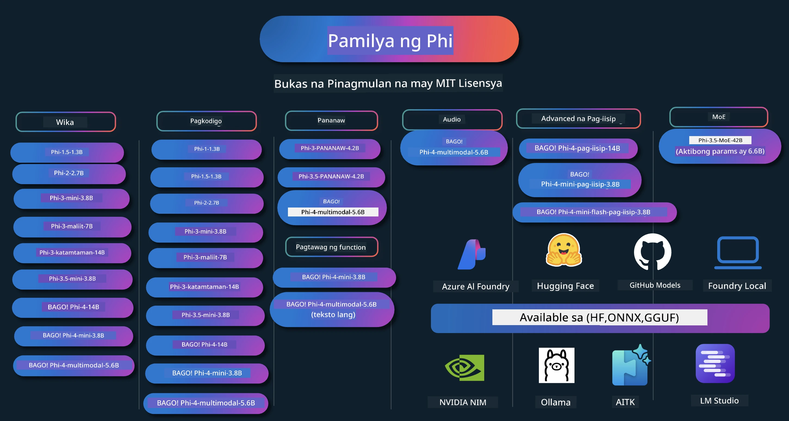

# Phi Cookbook: Mga Hands-On na Halimbawa gamit ang Mga Modelong Phi ng Microsoft

[](https://codespaces.new/microsoft/phicookbook)
[](https://vscode.dev/redirect?url=vscode://ms-vscode-remote.remote-containers/cloneInVolume?url=https://github.com/microsoft/phicookbook)

[](https://GitHub.com/microsoft/phicookbook/graphs/contributors/?WT.mc_id=aiml-137032-kinfeylo)
[](https://GitHub.com/microsoft/phicookbook/issues/?WT.mc_id=aiml-137032-kinfeylo)
[](https://GitHub.com/microsoft/phicookbook/pulls/?WT.mc_id=aiml-137032-kinfeylo)
[](http://makeapullrequest.com?WT.mc_id=aiml-137032-kinfeylo)

[](https://GitHub.com/microsoft/phicookbook/watchers/?WT.mc_id=aiml-137032-kinfeylo)
[](https://GitHub.com/microsoft/phicookbook/network/?WT.mc_id=aiml-137032-kinfeylo)
[](https://GitHub.com/microsoft/phicookbook/stargazers/?WT.mc_id=aiml-137032-kinfeylo)

[](https://discord.com/invite/ByRwuEEgH4)

Ang Phi ay isang serye ng mga open source na modelo ng AI na binuo ng Microsoft.

Ang Phi ay kasalukuyang pinakamakapangyarihan at cost-effective na small language model (SLM), na may napakagandang benchmarks sa multi-wika, pangangatwiran, pagbuo ng teksto/chat, coding, mga larawan, audio, at iba pang mga senaryo.

Maaari mong i-deploy ang Phi sa cloud o sa mga edge na device, at madali kang makakagawa ng mga generative AI application kahit na may limitadong computing power.

Sundin ang mga hakbang na ito upang makapagsimula gamit ang mga resource na ito :
1. **I-fork ang Repository**: I-click ang [](https://GitHub.com/microsoft/phicookbook/network/?WT.mc_id=aiml-137032-kinfeylo)
2. **I-clone ang Repository**:   `git clone https://github.com/microsoft/PhiCookBook.git`
3. [**Sumali sa Microsoft AI Discord Community at makipagkilala sa mga eksperto at kapwa developer**](https://discord.com/invite/ByRwuEEgH4?WT.mc_id=aiml-137032-kinfeylo)



### 🌐 Suporta para sa Maraming Wika

#### Sinusuportahan sa pamamagitan ng GitHub Action (Awtomatik at Palaging Napapanahon)

<!-- CO-OP TRANSLATOR LANGUAGES TABLE START -->
[Arabic](../ar/README.md) | [Bengali](../bn/README.md) | [Bulgarian](../bg/README.md) | [Burmese (Myanmar)](../my/README.md) | [Chinese (Simplified)](../zh-CN/README.md) | [Chinese (Traditional, Hong Kong)](../zh-HK/README.md) | [Chinese (Traditional, Macau)](../zh-MO/README.md) | [Chinese (Traditional, Taiwan)](../zh-TW/README.md) | [Croatian](../hr/README.md) | [Czech](../cs/README.md) | [Danish](../da/README.md) | [Dutch](../nl/README.md) | [Estonian](../et/README.md) | [Finnish](../fi/README.md) | [French](../fr/README.md) | [German](../de/README.md) | [Greek](../el/README.md) | [Hebrew](../he/README.md) | [Hindi](../hi/README.md) | [Hungarian](../hu/README.md) | [Indonesian](../id/README.md) | [Italian](../it/README.md) | [Japanese](../ja/README.md) | [Kannada](../kn/README.md) | [Korean](../ko/README.md) | [Lithuanian](../lt/README.md) | [Malay](../ms/README.md) | [Malayalam](../ml/README.md) | [Marathi](../mr/README.md) | [Nepali](../ne/README.md) | [Nigerian Pidgin](../pcm/README.md) | [Norwegian](../no/README.md) | [Persian (Farsi)](../fa/README.md) | [Polish](../pl/README.md) | [Portuguese (Brazil)](../pt-BR/README.md) | [Portuguese (Portugal)](../pt-PT/README.md) | [Punjabi (Gurmukhi)](../pa/README.md) | [Romanian](../ro/README.md) | [Russian](../ru/README.md) | [Serbian (Cyrillic)](../sr/README.md) | [Slovak](../sk/README.md) | [Slovenian](../sl/README.md) | [Spanish](../es/README.md) | [Swahili](../sw/README.md) | [Swedish](../sv/README.md) | [Tagalog (Filipino)](./README.md) | [Tamil](../ta/README.md) | [Telugu](../te/README.md) | [Thai](../th/README.md) | [Turkish](../tr/README.md) | [Ukrainian](../uk/README.md) | [Urdu](../ur/README.md) | [Vietnamese](../vi/README.md)

> **Mas gusto mo bang i-clone nang Lokal?**

> Kasama sa repository na ito ang 50+ na pagsasalin ng wika na malaki ang pinapataas sa laki ng download. Upang i-clone nang walang mga pagsasalin, gamitin ang sparse checkout:
> ```bash
> git clone --filter=blob:none --sparse https://github.com/microsoft/PhiCookBook.git
> cd PhiCookBook
> git sparse-checkout set --no-cone '/*' '!translations' '!translated_images'
> ```
> Binibigyan ka nito ng lahat ng kailangan mo upang matapos ang kurso nang mas mabilis ang pag-download.
<!-- CO-OP TRANSLATOR LANGUAGES TABLE END -->

## Talaan ng Nilalaman

- Panimula
  - [Maligayang pagdating sa Pamilyang Phi](./md/01.Introduction/01/01.PhiFamily.md)
  - [Pag-set up ng iyong kapaligiran](./md/01.Introduction/01/01.EnvironmentSetup.md)
  - [Pag-unawa sa mga Pangunahing Teknolohiya](./md/01.Introduction/01/01.Understandingtech.md)
  - [AI Safety para sa Mga Modelong Phi](./md/01.Introduction/01/01.AISafety.md)
  - [Suporta sa Phi Hardware](./md/01.Introduction/01/01.Hardwaresupport.md)
  - [Mga Modelong Phi at Availability sa iba't ibang platform](./md/01.Introduction/01/01.Edgeandcloud.md)
  - [Paggamit ng Guidance-ai at Phi](./md/01.Introduction/01/01.Guidance.md)
  - [GitHub Marketplace Models](https://github.com/marketplace/models)
  - [Azure AI Model Catalog](https://ai.azure.com)

- Inference Phi sa iba't ibang kapaligiran
    -  [Hugging face](./md/01.Introduction/02/01.HF.md)
    -  [GitHub Models](./md/01.Introduction/02/02.GitHubModel.md)
    -  [Azure AI Foundry Model Catalog](./md/01.Introduction/02/03.AzureAIFoundry.md)
    -  [Ollama](./md/01.Introduction/02/04.Ollama.md)
    -  [AI Toolkit VSCode (AITK)](./md/01.Introduction/02/05.AITK.md)
    -  [NVIDIA NIM](./md/01.Introduction/02/06.NVIDIA.md)
    -  [Foundry Local](./md/01.Introduction/02/07.FoundryLocal.md)

- Inference Pamilyang Phi
    - [Inference Phi sa iOS](./md/01.Introduction/03/iOS_Inference.md)
    - [Inference Phi sa Android](./md/01.Introduction/03/Android_Inference.md)
    - [Inference Phi sa Jetson](./md/01.Introduction/03/Jetson_Inference.md)
    - [Inference Phi sa AI PC](./md/01.Introduction/03/AIPC_Inference.md)
    - [Inference Phi gamit ang Apple MLX Framework](./md/01.Introduction/03/MLX_Inference.md)
    - [Inference Phi sa Lokal na Server](./md/01.Introduction/03/Local_Server_Inference.md)
    - [Inference Phi sa Remote Server gamit ang AI Toolkit](./md/01.Introduction/03/Remote_Interence.md)
    - [Inference Phi gamit ang Rust](./md/01.Introduction/03/Rust_Inference.md)
    - [Inference Phi--Vision sa Lokal](./md/01.Introduction/03/Vision_Inference.md)
    - [Inference Phi gamit ang Kaito AKS, Azure Containers (opisyal na suporta)](./md/01.Introduction/03/Kaito_Inference.md)
-  [Pag-quantify sa Pamilyang Phi](./md/01.Introduction/04/QuantifyingPhi.md)
    - [Pag-quantize sa Phi-3.5 / 4 gamit ang llama.cpp](./md/01.Introduction/04/UsingLlamacppQuantifyingPhi.md)
    - [Pag-quantize sa Phi-3.5 / 4 gamit ang Generative AI extensions para sa onnxruntime](./md/01.Introduction/04/UsingORTGenAIQuantifyingPhi.md)
    - [Pag-quantize sa Phi-3.5 / 4 gamit ang Intel OpenVINO](./md/01.Introduction/04/UsingIntelOpenVINOQuantifyingPhi.md)
    - [Pag-quantize sa Phi-3.5 / 4 gamit ang Apple MLX Framework](./md/01.Introduction/04/UsingAppleMLXQuantifyingPhi.md)

-  Pagsusuri sa Phi
    - [Responsableng AI](./md/01.Introduction/05/ResponsibleAI.md)
    - [Azure AI Foundry para sa Pagsusuri](./md/01.Introduction/05/AIFoundry.md)
    - [Paggamit ng Promptflow para sa Pagsusuri](./md/01.Introduction/05/Promptflow.md)
 
- RAG gamit ang Azure AI Search
    - [Paano gamitin ang Phi-4-mini at Phi-4-multimodal(RAG) gamit ang Azure AI Search](https://github.com/microsoft/PhiCookBook/blob/main/code/06.E2E/E2E_Phi-4-RAG-Azure-AI-Search.ipynb)

- Mga halimbawa sa pag-develop ng aplikasyon gamit ang Phi
  - Mga Teksto at Chat na Aplikasyon
    - Mga Sample ng Phi-4 🆕
      - [📓] [Makipag-chat gamit ang Phi-4-mini ONNX Model](./md/02.Application/01.TextAndChat/Phi4/ChatWithPhi4ONNX/README.md)
      - [Makipag-chat gamit ang Phi-4 lokal na ONNX Model .NET](../../md/04.HOL/dotnet/src/LabsPhi4-Chat-01OnnxRuntime)
      - [Chat .NET Console App gamit ang Phi-4 ONNX gamit ang Semantic Kernel](../../md/04.HOL/dotnet/src/LabsPhi4-Chat-02SK)
    - Mga Sample ng Phi-3 / 3.5
      - [Lokal na Chatbot sa browser gamit ang Phi3, ONNX Runtime Web at WebGPU](https://github.com/microsoft/onnxruntime-inference-examples/tree/main/js/chat)
      - [OpenVino Chat](./md/02.Application/01.TextAndChat/Phi3/E2E_OpenVino_Chat.md)
      - [Multi Model - Interactive Phi-3-mini at OpenAI Whisper](./md/02.Application/01.TextAndChat/Phi3/E2E_Phi-3-mini_with_whisper.md)
      - [MLFlow - Paggawa ng wrapper at paggamit ng Phi-3 sa MLFlow](./md//02.Application/01.TextAndChat/Phi3/E2E_Phi-3-MLflow.md)
      - [Model Optimization - Paano i-optimize ang Phi-3-min model para sa ONNX Runtime Web gamit ang Olive](https://github.com/microsoft/Olive/tree/main/examples/phi3)
      - [WinUI3 App na may Phi-3 mini-4k-instruct-onnx](https://github.com/microsoft/Phi3-Chat-WinUI3-Sample/)
      -[WinUI3 Multi Model AI Powered Notes App Sample](https://github.com/microsoft/ai-powered-notes-winui3-sample)
      - [Fine-tune at Integrate custom Phi-3 models gamit ang Prompt flow](./md/02.Application/01.TextAndChat/Phi3/E2E_Phi-3-FineTuning_PromptFlow_Integration.md)
      - [Fine-tune at Integrate custom Phi-3 models gamit ang Prompt flow sa Azure AI Foundry](./md/02.Application/01.TextAndChat/Phi3/E2E_Phi-3-FineTuning_PromptFlow_Integration_AIFoundry.md)
      - [Suriin ang Fine-tuned Phi-3 / Phi-3.5 Model sa Azure AI Foundry na naka-pokus sa mga Responsible AI Principles ng Microsoft](./md/02.Application/01.TextAndChat/Phi3/E2E_Phi-3-Evaluation_AIFoundry.md)
      - [📓] [Phi-3.5-mini-instruct language prediction sample (Chinese/English)](./md/02.Application/01.TextAndChat/Phi3/phi3-instruct-demo.ipynb)
      - [Phi-3.5-Instruct WebGPU RAG Chatbot](./md/02.Application/01.TextAndChat/Phi3/WebGPUWithPhi35Readme.md)
      - [Paggamit ng Windows GPU para gumawa ng Prompt flow solution gamit ang Phi-3.5-Instruct ONNX](./md/02.Application/01.TextAndChat/Phi3/UsingPromptFlowWithONNX.md)
      - [Paggamit ng Microsoft Phi-3.5 tflite para gumawa ng Android app](./md/02.Application/01.TextAndChat/Phi3/UsingPhi35TFLiteCreateAndroidApp.md)
      - [Q&A .NET Halimbawa gamit ang lokal na ONNX Phi-3 model gamit ang Microsoft.ML.OnnxRuntime](../../md/04.HOL/dotnet/src/LabsPhi301)
      - [Console chat .NET app gamit ang Semantic Kernel at Phi-3](../../md/04.HOL/dotnet/src/LabsPhi302)

  - Azure AI Inference SDK Code Based Samples 
    - Phi-4 Samples 🆕
      - [📓] [Gumawa ng project code gamit ang Phi-4-multimodal](./md/02.Application/02.Code/Phi4/GenProjectCode/README.md)
    - Phi-3 / 3.5 Samples
      - [Gumawa ng sarili mong Visual Studio Code GitHub Copilot Chat gamit ang Microsoft Phi-3 Family](./md/02.Application/02.Code/Phi3/VSCodeExt/README.md)
      - [Gumawa ng sarili mong Visual Studio Code Chat Copilot Agent gamit ang Phi-3.5 mula sa GitHub Models](/md/02.Application/02.Code/Phi3/CreateVSCodeChatAgentWithGitHubModels.md)

  - Advanced Reasoning Samples
    - Phi-4 Samples 🆕
      - [📓] [Phi-4-mini-reasoning o Phi-4-reasoning Samples](./md/02.Application/03.AdvancedReasoning/Phi4/AdvancedResoningPhi4mini/README.md)
      - [📓] [Fine-tuning ng Phi-4-mini-reasoning gamit ang Microsoft Olive](./md/02.Application/03.AdvancedReasoning/Phi4/AdvancedResoningPhi4mini/olive_ft_phi_4_reasoning_with_medicaldata.ipynb)
      - [📓] [Fine-tuning ng Phi-4-mini-reasoning gamit ang Apple MLX](./md/02.Application/03.AdvancedReasoning/Phi4/AdvancedResoningPhi4mini/mlx_ft_phi_4_reasoning_with_medicaldata.ipynb)
      - [📓] [Phi-4-mini-reasoning gamit ang GitHub Models](./md/02.Application/02.Code/Phi4r/github_models_inference.ipynb)
      - [📓] [Phi-4-mini-reasoning gamit ang Azure AI Foundry Models](./md/02.Application/02.Code/Phi4r/azure_models_inference.ipynb)
  - Demos
      - [Phi-4-mini demos na naka-host sa Hugging Face Spaces](https://huggingface.co/spaces/microsoft/phi-4-mini?WT.mc_id=aiml-137032-kinfeylo)
      - [Phi-4-multimodal demos na naka-host sa Hugginge Face Spaces](https://huggingface.co/spaces/microsoft/phi-4-multimodal?WT.mc_id=aiml-137032-kinfeylo)
  - Vision Samples
    - Phi-4 Samples 🆕
      - [📓] [Gamitin ang Phi-4-multimodal para magbasa ng mga larawan at gumawa ng code](./md/02.Application/04.Vision/Phi4/CreateFrontend/README.md) 
    - Phi-3 / 3.5 Samples
      -  [📓][Phi-3-vision-Image text to text](./md/02.Application/04.Vision/Phi3/E2E_Phi-3-vision-image-text-to-text-online-endpoint.ipynb)
      - [Phi-3-vision-ONNX](https://onnxruntime.ai/docs/genai/tutorials/phi3-v.html)
      - [📓][Phi-3-vision CLIP Embedding](./md/02.Application/04.Vision/Phi3/E2E_Phi-3-vision-image-text-to-text-online-endpoint.ipynb)
      - [DEMO: Phi-3 Recycling](https://github.com/jennifermarsman/PhiRecycling/)
      - [Phi-3-vision - Visual language assistant - gamit ang Phi3-Vision at OpenVINO](https://docs.openvino.ai/nightly/notebooks/phi-3-vision-with-output.html)
      - [Phi-3 Vision Nvidia NIM](./md/02.Application/04.Vision/Phi3/E2E_Nvidia_NIM_Vision.md)
      - [Phi-3 Vision OpenVino](./md/02.Application/04.Vision/Phi3/E2E_OpenVino_Phi3Vision.md)
      - [📓][Phi-3.5 Vision multi-frame o multi-image sample](./md/02.Application/04.Vision/Phi3/phi3-vision-demo.ipynb)
      - [Phi-3 Vision Local ONNX Model gamit ang Microsoft.ML.OnnxRuntime .NET](../../md/04.HOL/dotnet/src/LabsPhi303)
      - [Menu based Phi-3 Vision Local ONNX Model gamit ang Microsoft.ML.OnnxRuntime .NET](../../md/04.HOL/dotnet/src/LabsPhi304)

  - Math Samples
    -  Phi-4-Mini-Flash-Reasoning-Instruct Samples 🆕 [Math Demo gamit ang Phi-4-Mini-Flash-Reasoning-Instruct](./md/02.Application/09.Math/MathDemo.ipynb)

  - Audio Samples
    - Phi-4 Samples 🆕
      - [📓] [Pagkuha ng audio transcripts gamit ang Phi-4-multimodal](./md/02.Application/05.Audio/Phi4/Transciption/README.md)
      - [📓] [Phi-4-multimodal Audio Sample](./md/02.Application/05.Audio/Phi4/Siri/demo.ipynb)
      - [📓] [Phi-4-multimodal Speech Translation Sample](./md/02.Application/05.Audio/Phi4/Translate/demo.ipynb)
      - [.NET console application gamit ang Phi-4-multimodal Audio para suriin ang isang audio file at gumawa ng transcript](../../md/04.HOL/dotnet/src/LabsPhi4-MultiModal-02Audio)

  - MOE Samples
    - Phi-3 / 3.5 Samples
      - [📓] [Phi-3.5 Mixture of Experts Models (MoEs) Social Media Sample](./md/02.Application/06.MoE/Phi3/phi3_moe_demo.ipynb)
      - [📓] [Paggawa ng Retrieval-Augmented Generation (RAG) Pipeline gamit ang NVIDIA NIM Phi-3 MOE, Azure AI Search, at LlamaIndex](./md/02.Application/06.MoE/Phi3/azure-ai-search-nvidia-rag.ipynb)
      - 
  - Function Calling Samples
    - Phi-4 Samples 🆕
      -  [📓] [Paggamit ng Function Calling sa Phi-4-mini](./md/02.Application/07.FunctionCalling/Phi4/FunctionCallingBasic/README.md)
      -  [📓] [Paggamit ng Function Calling para gumawa ng multi-agents gamit ang Phi-4-mini](./md/02.Application/07.FunctionCalling/Phi4/Multiagents/Phi_4_mini_multiagent.ipynb)
      -  [📓] [Paggamit ng Function Calling gamit ang Ollama](./md/02.Application/07.FunctionCalling/Phi4/Ollama/ollama_functioncalling.ipynb)
      -  [📓] [Paggamit ng Function Calling gamit ang ONNX](./md/02.Application/07.FunctionCalling/Phi4/ONNX/onnx_parallel_functioncalling.ipynb)
  - Multimodal Mixing Samples
    - Phi-4 Samples 🆕
      -  [📓] [Paggamit ng Phi-4-multimodal bilang isang Technology journalist](./md/02.Application/08.Multimodel/Phi4/TechJournalist/phi_4_mm_audio_text_publish_news.ipynb)
      - [.NET console application gamit ang Phi-4-multimodal upang suriin ang mga larawan](../../md/04.HOL/dotnet/src/LabsPhi4-MultiModal-01Images)

- Fine-tuning Phi Samples
  - [Mga Senaryo ng Fine-tuning](./md/03.FineTuning/FineTuning_Scenarios.md)
  - [Fine-tuning vs RAG](./md/03.FineTuning/FineTuning_vs_RAG.md)
  - [Fine-tuning Hayaan ang Phi-3 maging eksperto sa industriya](./md/03.FineTuning/LetPhi3gotoIndustriy.md)
  - [Fine-tuning Phi-3 gamit ang AI Toolkit para sa VS Code](./md/03.FineTuning/Finetuning_VSCodeaitoolkit.md)
  - [Fine-tuning Phi-3 gamit ang Azure Machine Learning Service](./md/03.FineTuning/Introduce_AzureML.md)
  - [Fine-tuning Phi-3 gamit ang Lora](./md/03.FineTuning/FineTuning_Lora.md)
  - [Fine-tuning Phi-3 gamit ang QLora](./md/03.FineTuning/FineTuning_Qlora.md)
  - [Fine-tuning Phi-3 gamit ang Azure AI Foundry](./md/03.FineTuning/FineTuning_AIFoundry.md)
  - [Fine-tuning Phi-3 gamit ang Azure ML CLI/SDK](./md/03.FineTuning/FineTuning_MLSDK.md)
  - [Fine-tuning gamit ang Microsoft Olive](./md/03.FineTuning/FineTuning_MicrosoftOlive.md)
  - [Fine-tuning gamit ang Microsoft Olive Hands-On Lab](./md/03.FineTuning/olive-lab/readme.md)
  - [Fine-tuning Phi-3-vision gamit ang Weights and Bias](./md/03.FineTuning/FineTuning_Phi-3-visionWandB.md)
  - [Fine-tuning Phi-3 gamit ang Apple MLX Framework](./md/03.FineTuning/FineTuning_MLX.md)
  - [Fine-tuning Phi-3-vision (opisyal na suporta)](./md/03.FineTuning/FineTuning_Vision.md)
  - [Fine-Tuning Phi-3 gamit ang Kaito AKS , Azure Containers(opisyal na suporta)](./md/03.FineTuning/FineTuning_Kaito.md)
  - [Fine-Tuning Phi-3 at 3.5 Vision](https://github.com/2U1/Phi3-Vision-Finetune)

- Hands on Lab
  - [Pagsasaliksik sa mga pinaka-advanced na modelo: LLMs, SLMs, lokal na pag-develop at iba pa](https://github.com/microsoft/aitour-exploring-cutting-edge-models)
  - [Pagbubukas ng potensyal ng NLP: Fine-Tuning gamit ang Microsoft Olive](https://github.com/azure/Ignite_FineTuning_workshop)

- Academic Research Papers and Publications
  - [Mga Libro Lamang ang Kailangan II: phi-1.5 ulat teknikal](https://arxiv.org/abs/2309.05463)
  - [Phi-3 Ulat Teknikal: Isang Napaka-Kakayahang Modelong Pangwika na Lokal sa Iyong Telepono](https://arxiv.org/abs/2404.14219)
  - [Phi-4 Ulat Teknikal](https://arxiv.org/abs/2412.08905)
  - [Phi-4-Mini Ulat Teknikal: Mas Compact ngunit Makapangyarihang Multimodal na Mga Modelong Pangwika sa pamamagitan ng Mixture-of-LoRAs](https://arxiv.org/abs/2503.01743)
  - [Pag-optimize ng Maliliit na Modelong Pangwika para sa In-Vehicle Function-Calling](https://arxiv.org/abs/2501.02342)
  - [(WhyPHI) Fine-Tuning PHI-3 para sa Multiple-Choice Question Answering: Metodolohiya, Resulta, at Mga Hamon](https://arxiv.org/abs/2501.01588)
  - [Phi-4-reasoning Ulat Teknikal](https://www.microsoft.com/en-us/research/wp-content/uploads/2025/04/phi_4_reasoning.pdf)
  - [Phi-4-mini-reasoning Ulat Teknikal](https://huggingface.co/microsoft/Phi-4-mini-reasoning/blob/main/Phi-4-Mini-Reasoning.pdf)

## Paggamit ng mga Modelo ng Phi

### Phi sa Azure AI Foundry

Maaari mong matutunan kung paano gamitin ang Microsoft Phi at kung paano bumuo ng mga E2E solusyon sa iyong iba't ibang hardware na mga aparato. Upang maranasan ang Phi para sa iyong sarili, magsimula sa pamamagitan ng paglalaro sa mga modelo at pag-customize ng Phi para sa iyong mga senaryo gamit ang [Azure AI Foundry Azure AI Model Catalog](https://aka.ms/phi3-azure-ai) maaari kang matuto nang higit pa sa Pagsisimula gamit ang [Azure AI Foundry](/md/02.QuickStart/AzureAIFoundry_QuickStart.md)

**Playground**
Bawat modelo ay may dedikadong playground upang subukan ang modelo sa [Azure AI Playground](https://aka.ms/try-phi3).

### Phi sa GitHub Models

Maaari mong matutunan kung paano gamitin ang Microsoft Phi at kung paano bumuo ng mga E2E solusyon sa iyong iba't ibang hardware na mga aparato. Upang maranasan ang Phi para sa iyong sarili, magsimula sa pamamagitan ng paglalaro sa modelo at pag-customize ng Phi para sa iyong mga senaryo gamit ang [GitHub Model Catalog](https://github.com/marketplace/models?WT.mc_id=aiml-137032-kinfeylo) maaari kang matuto nang higit pa sa Pagsisimula gamit ang [GitHub Model Catalog](/md/02.QuickStart/GitHubModel_QuickStart.md)

**Playground**
Bawat modelo ay may dedikadong [playground upang subukan ang modelo](/md/02.QuickStart/GitHubModel_QuickStart.md).

### Phi sa Hugging Face

Maaari mo ring makita ang modelo sa [Hugging Face](https://huggingface.co/microsoft)

**Playground**
 [Hugging Chat playground](https://huggingface.co/chat/models/microsoft/Phi-3-mini-4k-instruct)

 ## 🎒 Ibang Mga Kurso

Ang aming koponan ay gumagawa ng iba pang mga kurso! Tingnan:

<!-- CO-OP TRANSLATOR OTHER COURSES START -->
### LangChain
[](https://aka.ms/langchain4j-for-beginners)
[](https://aka.ms/langchainjs-for-beginners?WT.mc_id=m365-94501-dwahlin)

---

### Azure / Edge / MCP / Agents
[](https://github.com/microsoft/AZD-for-beginners?WT.mc_id=academic-105485-koreyst)
[](https://github.com/microsoft/edgeai-for-beginners?WT.mc_id=academic-105485-koreyst)
[](https://github.com/microsoft/mcp-for-beginners?WT.mc_id=academic-105485-koreyst)
[](https://github.com/microsoft/ai-agents-for-beginners?WT.mc_id=academic-105485-koreyst)

---
 
### Generative AI Series
[](https://github.com/microsoft/generative-ai-for-beginners?WT.mc_id=academic-105485-koreyst)
[-9333EA?style=for-the-badge&labelColor=E5E7EB&color=9333EA)](https://github.com/microsoft/Generative-AI-for-beginners-dotnet?WT.mc_id=academic-105485-koreyst)
[-C084FC?style=for-the-badge&labelColor=E5E7EB&color=C084FC)](https://github.com/microsoft/generative-ai-for-beginners-java?WT.mc_id=academic-105485-koreyst)
[-E879F9?style=for-the-badge&labelColor=E5E7EB&color=E879F9)](https://github.com/microsoft/generative-ai-with-javascript?WT.mc_id=academic-105485-koreyst)

---
 
### Core Learning
[](https://aka.ms/ml-beginners?WT.mc_id=academic-105485-koreyst)
[](https://aka.ms/datascience-beginners?WT.mc_id=academic-105485-koreyst)
[](https://aka.ms/ai-beginners?WT.mc_id=academic-105485-koreyst)
[](https://github.com/microsoft/Security-101?WT.mc_id=academic-96948-sayoung)
[](https://aka.ms/webdev-beginners?WT.mc_id=academic-105485-koreyst)
[](https://aka.ms/iot-beginners?WT.mc_id=academic-105485-koreyst)
[](https://github.com/microsoft/xr-development-for-beginners?WT.mc_id=academic-105485-koreyst)

---
 
### Copilot Series
[](https://aka.ms/GitHubCopilotAI?WT.mc_id=academic-105485-koreyst)
[](https://github.com/microsoft/mastering-github-copilot-for-dotnet-csharp-developers?WT.mc_id=academic-105485-koreyst)
[](https://github.com/microsoft/CopilotAdventures?WT.mc_id=academic-105485-koreyst)
<!-- CO-OP TRANSLATOR OTHER COURSES END -->

## Responsableng AI 

Nakatuon ang Microsoft sa pagtulong sa aming mga customer na gamitin ang aming mga produkto ng AI nang responsable, pagbabahagi ng aming mga natutunan, at pagbuo ng mga partnership na nakabatay sa tiwala sa pamamagitan ng mga kasangkapan tulad ng Transparency Notes at Impact Assessments. Maraming sa mga mapagkukunang ito ay matatagpuan sa [https://aka.ms/RAI](https://aka.ms/RAI).
Ang pamamaraan ng Microsoft sa responsableng AI ay nakabatay sa aming mga prinsipyo ng AI na katarungan, pagiging maaasahan at kaligtasan, privacy at seguridad, pagiging inklusibo, transparency, at pananagutan.

Ang malakihang natural na wika, imahe, at speech na mga modelo - tulad ng mga ginamit sa halimbawang ito - ay maaaring kumilos sa mga paraan na hindi patas, hindi maaasahan, o nakakasakit, na sa kalaunan ay nagdudulot ng pinsala. Mangyaring kumonsulta sa [Azure OpenAI service Transparency note](https://learn.microsoft.com/legal/cognitive-services/openai/transparency-note?tabs=text) upang maipaalam ang tungkol sa mga panganib at limitasyon.

Ang inirerekomendang paraan upang mapigilan ang mga panganib na ito ay ang isama ang isang sistema ng kaligtasan sa iyong arkitektura na maaaring makakita at makapigil sa mapaminsalang pag-uugali. [Azure AI Content Safety](https://learn.microsoft.com/azure/ai-services/content-safety/overview) ay nagbibigay ng isang independiyenteng layer ng proteksyon, na kayang tuklasin ang mapaminsalang nilalaman na nilikha ng user at ng AI sa mga aplikasyon at serbisyo. Kasama sa Azure AI Content Safety ang mga API ng teksto at imahe na nagpapahintulot sa iyo na tuklasin ang mga materyal na nakakasama. Sa loob ng Azure AI Foundry, pinapayagan ka ng Content Safety service na tingnan, galugarin at subukan ang sample na code para sa pagtuklas ng mapaminsalang nilalaman sa iba't ibang modality. Ang sumusunod na [quickstart documentation](https://learn.microsoft.com/azure/ai-services/content-safety/quickstart-text?tabs=visual-studio%2Clinux&pivots=programming-language-rest) ay gagabay sa iyo sa paggawa ng mga kahilingan sa serbisyo.

Isa pang aspeto na dapat isaalang-alang ay ang pangkalahatang performance ng aplikasyon. Sa mga multi-modal at multi-model na aplikasyon, itinuturing namin ang performance bilang ang sistema ay gumagana ayon sa inaasahan mo at ng iyong mga user, kasama na ang hindi paggawa ng mapaminsalang output. Mahalaga na tasahin ang performance ng iyong pangkalahatang aplikasyon gamit ang [Performance and Quality and Risk and Safety evaluators](https://learn.microsoft.com/azure/ai-studio/concepts/evaluation-metrics-built-in). Mayroon ka ring kakayahang gumawa at magsuri gamit ang [custom evaluators](https://learn.microsoft.com/azure/ai-studio/how-to/develop/evaluate-sdk#custom-evaluators).
Maaari mong suriin ang iyong AI application sa iyong development environment gamit ang [Azure AI Evaluation SDK](https://microsoft.github.io/promptflow/index.html). Sa pamamagitan ng isang test dataset o isang target, ang mga generative AI application generations mo ay nasusukat nang kwantitatibo gamit ang built-in na mga evaluator o custom na mga evaluator na iyong pinili. Upang makapagsimula gamit ang azure ai evaluation sdk para suriin ang iyong sistema, maaari mong sundan ang [quickstart guide](https://learn.microsoft.com/azure/ai-studio/how-to/develop/flow-evaluate-sdk). Kapag naisagawa mo na ang isang evaluation run, maaari mong [i-visualize ang mga resulta sa Azure AI Foundry](https://learn.microsoft.com/azure/ai-studio/how-to/evaluate-flow-results). 

## Trademarks

Maaaring naglalaman ang proyekto na ito ng mga trademark o logo para sa mga proyekto, produkto, o serbisyo. Ang awtorisadong paggamit ng mga trademark o logo ng Microsoft ay napapailalim at dapat sumunod sa [Microsoft's Trademark & Brand Guidelines](https://www.microsoft.com/legal/intellectualproperty/trademarks/usage/general).
Ang paggamit ng mga trademark o logo ng Microsoft sa mga binagong bersyon ng proyekto na ito ay hindi dapat magdulot ng kalituhan o magpahiwatig ng sponsorship ng Microsoft. Anumang paggamit ng third-party na mga trademark o logo ay napapailalim sa mga patakaran ng nasabing third-party.

## Getting Help

Kung ikaw ay natigil o may mga tanong tungkol sa paggawa ng AI apps, sumali sa:

[](https://aka.ms/foundry/discord)

Kung mayroon kang feedback tungkol sa produkto o mga error habang bumubuo, bisitahin:

[](https://aka.ms/foundry/forum)

---

<!-- CO-OP TRANSLATOR DISCLAIMER START -->
**Pagsisiwalat**:
Ang dokumentong ito ay isinalin gamit ang AI translation service na [Co-op Translator](https://github.com/Azure/co-op-translator). Bagama't nagsusumikap kami para sa katumpakan, pakatandaan na ang mga awtomatikong pagsasalin ay maaaring maglaman ng mga pagkakamali o hindi eksaktong impormasyon. Ang orihinal na dokumento sa orihinal nitong wika ang dapat ituring na pinagmulan ng katotohanan. Para sa mahahalagang impormasyon, inirerekomenda ang propesyonal na pagsasaling pantao. Hindi kami mananagot sa anumang mga maling pagkaunawa o maling interpretasyon na maaaring lumitaw mula sa paggamit ng pagsasaling ito.
<!-- CO-OP TRANSLATOR DISCLAIMER END -->