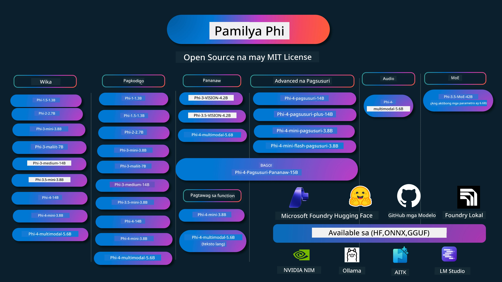

# Phi Cookbook: Mga Halimbawang Praktikal gamit ang Phi Models ng Microsoft

[](https://codespaces.new/microsoft/phicookbook)
[](https://vscode.dev/redirect?url=vscode://ms-vscode-remote.remote-containers/cloneInVolume?url=https://github.com/microsoft/phicookbook)

[](https://GitHub.com/microsoft/phicookbook/graphs/contributors/?WT.mc_id=aiml-137032-kinfeylo)
[](https://GitHub.com/microsoft/phicookbook/issues/?WT.mc_id=aiml-137032-kinfeylo)
[](https://GitHub.com/microsoft/phicookbook/pulls/?WT.mc_id=aiml-137032-kinfeylo)
[](http://makeapullrequest.com?WT.mc_id=aiml-137032-kinfeylo)

[](https://GitHub.com/microsoft/phicookbook/watchers/?WT.mc_id=aiml-137032-kinfeylo)
[](https://GitHub.com/microsoft/phicookbook/network/?WT.mc_id=aiml-137032-kinfeylo)
[](https://GitHub.com/microsoft/phicookbook/stargazers/?WT.mc_id=aiml-137032-kinfeylo)

[](https://discord.com/invite/ByRwuEEgH4)

Ang Phi ay isang serye ng mga open source AI models na binuo ng Microsoft.

Ang Phi ay kasalukuyang pinaka-makapangyarihan at cost-effective na maliit na language model (SLM), na may napakagandang benchmarks sa multi-wika, pangangatwiran, text/chat generation, coding, mga larawan, audio at iba pang mga senaryo.

Maaari mong i-deploy ang Phi sa cloud o sa mga edge devices, at madali kang makakabuo ng mga generative AI applications kahit limitado ang computing power.

Sundin ang mga hakbang na ito para makapagsimula gamit ang mga mapagkukunan na ito:
1. **I-fork ang Repository**: I-click ang [](https://GitHub.com/microsoft/phicookbook/network/?WT.mc_id=aiml-137032-kinfeylo)
2. **I-clone ang Repository**:   `git clone https://github.com/microsoft/PhiCookBook.git`
3. [**Sumali sa Microsoft AI Discord Community at makipagkilala sa mga eksperto at kapwa mga developer**](https://discord.com/invite/ByRwuEEgH4?WT.mc_id=aiml-137032-kinfeylo)



### 🌐 Suporta sa Iba't ibang Wika

#### Sinusuportahan sa pamamagitan ng GitHub Action (Automated at Laging Napapanahon)

<!-- CO-OP TRANSLATOR LANGUAGES TABLE START -->
[Arabic](../ar/README.md) | [Bengali](../bn/README.md) | [Bulgarian](../bg/README.md) | [Burmese (Myanmar)](../my/README.md) | [Chinese (Simplified)](../zh-CN/README.md) | [Chinese (Traditional, Hong Kong)](../zh-HK/README.md) | [Chinese (Traditional, Macau)](../zh-MO/README.md) | [Chinese (Traditional, Taiwan)](../zh-TW/README.md) | [Croatian](../hr/README.md) | [Czech](../cs/README.md) | [Danish](../da/README.md) | [Dutch](../nl/README.md) | [Estonian](../et/README.md) | [Finnish](../fi/README.md) | [French](../fr/README.md) | [German](../de/README.md) | [Greek](../el/README.md) | [Hebrew](../he/README.md) | [Hindi](../hi/README.md) | [Hungarian](../hu/README.md) | [Indonesian](../id/README.md) | [Italian](../it/README.md) | [Japanese](../ja/README.md) | [Kannada](../kn/README.md) | [Khmer](../km/README.md) | [Korean](../ko/README.md) | [Lithuanian](../lt/README.md) | [Malay](../ms/README.md) | [Malayalam](../ml/README.md) | [Marathi](../mr/README.md) | [Nepali](../ne/README.md) | [Nigerian Pidgin](../pcm/README.md) | [Norwegian](../no/README.md) | [Persian (Farsi)](../fa/README.md) | [Polish](../pl/README.md) | [Portuguese (Brazil)](../pt-BR/README.md) | [Portuguese (Portugal)](../pt-PT/README.md) | [Punjabi (Gurmukhi)](../pa/README.md) | [Romanian](../ro/README.md) | [Russian](../ru/README.md) | [Serbian (Cyrillic)](../sr/README.md) | [Slovak](../sk/README.md) | [Slovenian](../sl/README.md) | [Spanish](../es/README.md) | [Swahili](../sw/README.md) | [Swedish](../sv/README.md) | [Tagalog (Filipino)](./README.md) | [Tamil](../ta/README.md) | [Telugu](../te/README.md) | [Thai](../th/README.md) | [Turkish](../tr/README.md) | [Ukrainian](../uk/README.md) | [Urdu](../ur/README.md) | [Vietnamese](../vi/README.md)

> **Mas Gusto Mo Bang Mag-Clone Lokal?**
>
> Kasama sa repositoryong ito ang 50+ na pagsasalin ng wika na malaki ang dagdag sa laki ng pag-download. Para mag-clone nang walang mga pagsasalin, gamitin ang sparse checkout:
>
> **Bash / macOS / Linux:**
> ```bash
> git clone --filter=blob:none --sparse https://github.com/microsoft/PhiCookBook.git
> cd PhiCookBook
> git sparse-checkout set --no-cone '/*' '!translations' '!translated_images'
> ```
>
> **CMD (Windows):**
> ```cmd
> git clone --filter=blob:none --sparse https://github.com/microsoft/PhiCookBook.git
> cd PhiCookBook
> git sparse-checkout set --no-cone "/*" "!translations" "!translated_images"
> ```
>
> Bibigyan ka nito ng lahat ng kailangan mo upang matapos ang kurso nang mas mabilis ang pag-download.
<!-- CO-OP TRANSLATOR LANGUAGES TABLE END -->

## Table of Contents
- Panimula - [Maligayang Pagdating sa Phi Family](./md/01.Introduction/01/01.PhiFamily.md) - [Pag-setup ng iyong kapaligiran](./md/01.Introduction/01/01.EnvironmentSetup.md) - [Pag-unawa sa mga Pangunahing Teknolohiya](./md/01.Introduction/01/01.Understandingtech.md) - [AI Safety para sa Phi Models](./md/01.Introduction/01/01.AISafety.md) - [Suporta sa Phi Hardware](./md/01.Introduction/01/01.Hardwaresupport.md) - [Mga Phi Models at Availability sa iba't ibang platform](./md/01.Introduction/01/01.Edgeandcloud.md) - [Paggamit ng Guidance-ai at Phi](./md/01.Introduction/01/01.Guidance.md) - [GitHub Marketplace Models](https://github.com/marketplace/models) - [Azure AI Model Catalog](https://ai.azure.com) - Pag-infer ng Phi sa iba't ibang kapaligiran - [Hugging face](./md/01.Introduction/02/01.HF.md) - [GitHub Models](./md/01.Introduction/02/02.GitHubModel.md) - [Microsoft Foundry Model Catalog](./md/01.Introduction/02/03.AzureAIFoundry.md) - [Ollama](./md/01.Introduction/02/04.Ollama.md) - [AI Toolkit VSCode (AITK)](./md/01.Introduction/02/05.AITK.md) - [NVIDIA NIM](./md/01.Introduction/02/06.NVIDIA.md) - [Foundry Local](./md/01.Introduction/02/07.FoundryLocal.md) - Pag-infer ng Phi Family - [Pag-infer ng Phi sa iOS](./md/01.Introduction/03/iOS_Inference.md) - [Pag-infer ng Phi sa Android](./md/01.Introduction/03/Android_Inference.md) - [Pag-infer ng Phi sa Jetson](./md/01.Introduction/03/Jetson_Inference.md) - [Pag-infer ng Phi sa AI PC](./md/01.Introduction/03/AIPC_Inference.md) - [Pag-infer ng Phi gamit ang Apple MLX Framework](./md/01.Introduction/03/MLX_Inference.md) - [Pag-infer ng Phi sa Local Server](./md/01.Introduction/03/Local_Server_Inference.md) - [Pag-infer ng Phi sa Remote Server gamit ang AI Toolkit](./md/01.Introduction/03/Remote_Interence.md) - [Pag-infer ng Phi gamit ang Rust](./md/01.Introduction/03/Rust_Inference.md) - [Pag-infer ng Phi--Vision sa Lokal](./md/01.Introduction/03/Vision_Inference.md) - [Pag-infer ng Phi gamit ang Kaito AKS, Azure Containers(opisyal na suporta)](./md/01.Introduction/03/Kaito_Inference.md) - [Pag-quantify ng Phi Family](./md/01.Introduction/04/QuantifyingPhi.md) - [Pag-quantize ng Phi-3.5 / 4 gamit ang llama.cpp](./md/01.Introduction/04/UsingLlamacppQuantifyingPhi.md) - [Pag-quantize ng Phi-3.5 / 4 gamit ang Generative AI extensions para sa onnxruntime](./md/01.Introduction/04/UsingORTGenAIQuantifyingPhi.md) - [Pag-quantize ng Phi-3.5 / 4 gamit ang Intel OpenVINO](./md/01.Introduction/04/UsingIntelOpenVINOQuantifyingPhi.md) - [Pag-quantize ng Phi-3.5 / 4 gamit ang Apple MLX Framework](./md/01.Introduction/04/UsingAppleMLXQuantifyingPhi.md) - Pagsusuri ng Phi - [Responsableng AI](./md/01.Introduction/05/ResponsibleAI.md) - [Microsoft Foundry para sa Pagsusuri](./md/01.Introduction/05/AIFoundry.md) - [Paggamit ng Promptflow para sa Pagsusuri](./md/01.Introduction/05/Promptflow.md) - RAG gamit ang Azure AI Search - [Paano gamitin ang Phi-4-mini at Phi-4-multimodal(RAG) gamit ang Azure AI Search](https://github.com/microsoft/PhiCookBook/blob/main/code/06.E2E/E2E_Phi-4-RAG-Azure-AI-Search.ipynb) - Mga halimbawa ng pag-develop ng aplikasyon ng Phi - Mga Text & Chat na Aplikasyon - Mga Halimbawa ng Phi-4 - [📓] [ChatwithPhi-4-mini ONNX Model](./md/02.Application/01.TextAndChat/Phi4/ChatWithPhi4ONNX/README.md) - [Makipag-chat gamit ang Phi-4 lokal ONNX Model .NET](../../md/04.HOL/dotnet/src/LabsPhi4-Chat-01OnnxRuntime) - [Chat .NET Console App gamit ang Phi-4 ONNX gamit ang Semantic Kernel](../../md/04.HOL/dotnet/src/LabsPhi4-Chat-02SK) - Mga Halimbawa ng Phi-3 / 3.5 - [Local Chatbot sa browser gamit ang Phi3, ONNX Runtime Web at WebGPU](https://github.com/microsoft/onnxruntime-inference-examples/tree/main/js/chat) - [OpenVino Chat](./md/02.Application/01.TextAndChat/Phi3/E2E_OpenVino_Chat.md) - [Multi Model - Interactive Phi-3-mini at OpenAI Whisper](./md/02.Application/01.TextAndChat/Phi3/E2E_Phi-3-mini_with_whisper.md) - [MLFlow - Pagbuo ng wrapper at paggamit ng Phi-3 gamit ang MLFlow](./md//02.Application/01.TextAndChat/Phi3/E2E_Phi-3-MLflow.md) - [Model Optimization - Paano i-optimize ang Phi-3-min model para sa ONNX Runtime Web gamit ang Olive](https://github.com/microsoft/Olive/tree/main/examples/phi3) - [WinUI3 App gamit ang Phi-3 mini-4k-instruct-onnx](https://github.com/microsoft/Phi3-Chat-WinUI3-Sample/) -[WinUI3 Multi Model AI Powered Notes App Sample](https://github.com/microsoft/ai-powered-notes-winui3-sample) - [Fine-tune at Integrate ang custom Phi-3 models gamit ang Prompt flow](./md/02.Application/01.TextAndChat/Phi3/E2E_Phi-3-FineTuning_PromptFlow_Integration.md) - [Fine-tune at Integrate ang custom Phi-3 models gamit ang Prompt flow sa Microsoft Foundry](./md/02.Application/01.TextAndChat/Phi3/E2E_Phi-3-FineTuning_PromptFlow_Integration_AIFoundry.md) - [Suriin ang Fine-tuned Phi-3 / Phi-3.5 Model sa Microsoft Foundry na nakatuon sa Responsible AI Principles ng Microsoft](./md/02.Application/01.TextAndChat/Phi3/E2E_Phi-3-Evaluation_AIFoundry.md) - [📓] [Phi-3.5-mini-instruct sample ng prediction ng wika (Chinese/English)](./md/02.Application/01.TextAndChat/Phi3/phi3-instruct-demo.ipynb) - [Phi-3.5-Instruct WebGPU RAG Chatbot](./md/02.Application/01.TextAndChat/Phi3/WebGPUWithPhi35Readme.md) - [Paggamit ng Windows GPU para gumawa ng Prompt flow solution gamit ang Phi-3.5-Instruct ONNX](./md/02.Application/01.TextAndChat/Phi3/UsingPromptFlowWithONNX.md) - [Paggamit ng Microsoft Phi-3.5 tflite para gumawa ng Android app](./md/02.Application/01.TextAndChat/Phi3/UsingPhi35TFLiteCreateAndroidApp.md) - [Q&A .NET Halimbawa gamit ang lokal na ONNX Phi-3 model gamit ang Microsoft.ML.OnnxRuntime](../../md/04.HOL/dotnet/src/LabsPhi301) - [Console chat .NET app gamit ang Semantic Kernel at Phi-3](../../md/04.HOL/dotnet/src/LabsPhi302) - Azure AI Inference SDK Code Based Samples - Mga Halimbawa ng Phi-4 - [📓] [Gumawa ng project code gamit ang Phi-4-multimodal](./md/02.Application/02.Code/Phi4/GenProjectCode/README.md) - Mga Halimbawa ng Phi-3 / 3.5 - [Gumawa ng sarili mong Visual Studio Code GitHub Copilot Chat gamit ang Microsoft Phi-3 Family](./md/02.Application/02.Code/Phi3/VSCodeExt/README.md) - [Gumawa ng sarili mong Visual Studio Code Chat Copilot Agent gamit ang Phi-3.5 mula sa GitHub Models](/md/02.Application/02.Code/Phi3/CreateVSCodeChatAgentWithGitHubModels.md) - Mga Halimbawa ng Advanced Reasoning - Mga Halimbawa ng Phi-4 - [📓] [Mga halimbawa ng Phi-4-mini-reasoning o Phi-4-reasoning](./md/02.Application/03.AdvancedReasoning/Phi4/AdvancedResoningPhi4mini/README.md) - [📓] [Fine-tuning ng Phi-4-mini-reasoning gamit ang Microsoft Olive](./md/02.Application/03.AdvancedReasoning/Phi4/AdvancedResoningPhi4mini/olive_ft_phi_4_reasoning_with_medicaldata.ipynb) - [📓] [Fine-tuning ng Phi-4-mini-reasoning gamit ang Apple MLX](./md/02.Application/03.AdvancedReasoning/Phi4/AdvancedResoningPhi4mini/mlx_ft_phi_4_reasoning_with_medicaldata.ipynb) - [📓] [Phi-4-mini-reasoning gamit ang GitHub Models](./md/02.Application/02.Code/Phi4r/github_models_inference.ipynb) - [📓] [Phi-4-mini-reasoning gamit ang Microsoft Foundry Models](./md/02.Application/02.Code/Phi4r/azure_models_inference.ipynb) -
Mga Demo - [Phi-4-mini demos na naka-host sa Hugging Face Spaces](https://huggingface.co/spaces/microsoft/phi-4-mini?WT.mc_id=aiml-137032-kinfeylo) - [Phi-4-multimodal demos na naka-host sa Hugginge Face Spaces](https://huggingface.co/spaces/microsoft/phi-4-multimodal?WT.mc_id=aiml-137032-kinfeylo) - Mga Halimbawa ng Vision - Mga Halimbawa ng Phi-4 - [📓] [Gamitin ang Phi-4-multimodal para magbasa ng mga imahe at bumuo ng code](./md/02.Application/04.Vision/Phi4/CreateFrontend/README.md) - Mga Halimbawa ng Phi-3 / 3.5 - [📓][Phi-3-vision-Image text to text](./md/02.Application/04.Vision/Phi3/E2E_Phi-3-vision-image-text-to-text-online-endpoint.ipynb) - [Phi-3-vision-ONNX](https://onnxruntime.ai/docs/genai/tutorials/phi3-v.html) - [📓][Phi-3-vision CLIP Embedding](./md/02.Application/04.Vision/Phi3/E2E_Phi-3-vision-image-text-to-text-online-endpoint.ipynb) - [DEMO: Phi-3 Recycling](https://github.com/jennifermarsman/PhiRecycling/) - [Phi-3-vision - Visual language assistant - gamit ang Phi3-Vision at OpenVINO](https://docs.openvino.ai/nightly/notebooks/phi-3-vision-with-output.html) - [Phi-3 Vision Nvidia NIM](./md/02.Application/04.Vision/Phi3/E2E_Nvidia_NIM_Vision.md) - [Phi-3 Vision OpenVino](./md/02.Application/04.Vision/Phi3/E2E_OpenVino_Phi3Vision.md) - [📓][Phi-3.5 Vision multi-frame o multi-image sample](./md/02.Application/04.Vision/Phi3/phi3-vision-demo.ipynb) - [Phi-3 Vision Local ONNX Model gamit ang Microsoft.ML.OnnxRuntime .NET](../../md/04.HOL/dotnet/src/LabsPhi303) - [Menu based Phi-3 Vision Local ONNX Model gamit ang Microsoft.ML.OnnxRuntime .NET](../../md/04.HOL/dotnet/src/LabsPhi304) - Mga Halimbawa ng Reasoning-Vision - Phi-4-Reasoning-Vision-15B - [📓] [Paggamit ng Phi-4-Reasoning-Vision-15B upang matukoy ang jaywalking](./md/02.Application/10.ReasoningVision/Phi_4_reasoning_vision_15b_Jaywalking.ipynb) - [📓] [Paggamit ng Phi-4-Reasoning-Vision-15B para sa math](./md/02.Application/10.ReasoningVision/Phi_4_reasoning_vision_15b_Math.ipynb) - [📓] [Paggamit ng Phi-4-Reasoning-Vision-15B upang matukoy ang UI](./md/02.Application/10.ReasoningVision/Phi_4_reasoning_vision_15b_ui.ipynb) - Mga Halimbawa ng Math - Phi-4-Mini-Flash-Reasoning-Instruct Samples [Math Demo gamit ang Phi-4-Mini-Flash-Reasoning-Instruct](./md/02.Application/09.Math/MathDemo.ipynb) - Mga Halimbawa ng Audio - Mga Halimbawa ng Phi-4 - [📓] [Pagkuha ng audio transcripts gamit ang Phi-4-multimodal](./md/02.Application/05.Audio/Phi4/Transciption/README.md) - [📓] [Phi-4-multimodal Audio Sample](./md/02.Application/05.Audio/Phi4/Siri/demo.ipynb) - [📓] [Phi-4-multimodal Speech Translation Sample](./md/02.Application/05.Audio/Phi4/Translate/demo.ipynb) - [.NET console application gamit ang Phi-4-multimodal Audio para suriin ang audio file at gumawa ng transcript](../../md/04.HOL/dotnet/src/LabsPhi4-MultiModal-02Audio) - Mga Halimbawa ng MOE - Mga Halimbawa ng Phi-3 / 3.5 - [📓] [Phi-3.5 Mixture of Experts Models (MoEs) Social Media Sample](./md/02.Application/06.MoE/Phi3/phi3_moe_demo.ipynb) - [📓] [Paggawa ng Retrieval-Augmented Generation (RAG) Pipeline gamit ang NVIDIA NIM Phi-3 MOE, Azure AI Search, at LlamaIndex](./md/02.Application/06.MoE/Phi3/azure-ai-search-nvidia-rag.ipynb) - - Mga Halimbawa ng Function Calling - Mga Halimbawa ng Phi-4 🆕 - [📓] [Paggamit ng Function Calling Kasama ang Phi-4-mini](./md/02.Application/07.FunctionCalling/Phi4/FunctionCallingBasic/README.md) - [📓] [Paggamit ng Function Calling para gumawa ng multi-agents Kasama ang Phi-4-mini](./md/02.Application/07.FunctionCalling/Phi4/Multiagents/Phi_4_mini_multiagent.ipynb) - [📓] [Paggamit ng Function Calling kasama ang Ollama](./md/02.Application/07.FunctionCalling/Phi4/Ollama/ollama_functioncalling.ipynb) - [📓] [Paggamit ng Function Calling kasama ang ONNX](./md/02.Application/07.FunctionCalling/Phi4/ONNX/onnx_parallel_functioncalling.ipynb) - Mga Halimbawa ng Multimodal Mixing - Mga Halimbawa ng Phi-4 🆕 - [📓] [Paggamit ng Phi-4-multimodal bilang isang Technology journalist](./md/02.Application/08.Multimodel/Phi4/TechJournalist/phi_4_mm_audio_text_publish_news.ipynb) - [.NET console application gamit ang Phi-4-multimodal para suriin ang mga imahe](../../md/04.HOL/dotnet/src/LabsPhi4-MultiModal-01Images) - Fine-tuning Phi Samples - [Mga Fine-tuning Scenarios](./md/03.FineTuning/FineTuning_Scenarios.md) - [Fine-tuning kumpara sa RAG](./md/03.FineTuning/FineTuning_vs_RAG.md) - [Fine-tuning Hayaan ang Phi-3 maging isang eksperto sa industriya](./md/03.FineTuning/LetPhi3gotoIndustriy.md) - [Fine-tuning Phi-3 gamit ang AI Toolkit para sa VS Code](./md/03.FineTuning/Finetuning_VSCodeaitoolkit.md) - [Fine-tuning Phi-3 gamit ang Azure Machine Learning Service](./md/03.FineTuning/Introduce_AzureML.md) - [Fine-tuning Phi-3 gamit ang Lora](./md/03.FineTuning/FineTuning_Lora.md) - [Fine-tuning Phi-3 gamit ang QLora](./md/03.FineTuning/FineTuning_Qlora.md) - [Fine-tuning Phi-3 gamit ang Microsoft Foundry](./md/03.FineTuning/FineTuning_AIFoundry.md) - [Fine-tuning Phi-3 gamit ang Azure ML CLI/SDK](./md/03.FineTuning/FineTuning_MLSDK.md) - [Fine-tuning gamit ang Microsoft Olive](./md/03.FineTuning/FineTuning_MicrosoftOlive.md) - [Fine-tuning gamit ang Microsoft Olive Hands-On Lab](./md/03.FineTuning/olive-lab/readme.md) - [Fine-tuning Phi-3-vision gamit ang Weights and Bias](./md/03.FineTuning/FineTuning_Phi-3-visionWandB.md) - [Fine-tuning Phi-3 gamit ang Apple MLX Framework](./md/03.FineTuning/FineTuning_MLX.md) - [Fine-tuning Phi-3-vision (opisyal na suporta)](./md/03.FineTuning/FineTuning_Vision.md) - [Fine-Tuning Phi-3 gamit ang Kaito AKS, Azure Containers (opisyal na Suporta)](./md/03.FineTuning/FineTuning_Kaito.md) - [Fine-Tuning Phi-3 at 3.5 Vision](https://github.com/2U1/Phi3-Vision-Finetune) - Hands on Lab - [Pagsusuri ng mga pinaka-advanced na modelo: LLMs, SLMs, lokal na pag-unlad at iba pa](https://github.com/microsoft/aitour-exploring-cutting-edge-models) - [Pagbubukas ng Potensyal ng NLP: Fine-Tuning gamit ang Microsoft Olive](https://github.com/azure/Ignite_FineTuning_workshop) - Mga Academic Research Papers at Publikasyon - [Textbooks Are All You Need II: phi-1.5 technical report](https://arxiv.org/abs/2309.05463) - [Phi-3 Technical Report: Isang Napaka-Kakayahang Language Model Lokal sa Iyong Telepono](https://arxiv.org/abs/2404.14219) - [Phi-4 Technical Report](https://arxiv.org/abs/2412.08905) - [Phi-4-Mini Technical Report: Compact ngunit Malakas na Multimodal Language Models sa pamamagitan ng Mixture-of-LoRAs](https://arxiv.org/abs/2503.01743) - [Pag-optimize ng Maliliit na Language Models para sa In-Vehicle Function-Calling](https://arxiv.org/abs/2501.02342) - [(WhyPHI) Fine-Tuning PHI-3 para sa Multiple-Choice Question Answering: Metodolohiya, Resulta, at Mga Hamon](https://arxiv.org/abs/2501.01588) - [Phi-4-reasoning Technical Report](https://www.microsoft.com/en-us/research/wp-content/uploads/2025/04/phi_4_reasoning.pdf)
- [Ulat Teknikal ng Phi-4-mini-reasoning](https://huggingface.co/microsoft/Phi-4-mini-reasoning/blob/main/Phi-4-Mini-Reasoning.pdf)
# Phi Cookbook: Mga Halimbawang Hands-On gamit ang mga Modelo ng Phi mula sa Microsoft

[](https://codespaces.new/microsoft/phicookbook)
[](https://vscode.dev/redirect?url=vscode://ms-vscode-remote.remote-containers/cloneInVolume?url=https://github.com/microsoft/phicookbook)

[](https://GitHub.com/microsoft/phicookbook/graphs/contributors/?WT.mc_id=aiml-137032-kinfeylo)
[](https://GitHub.com/microsoft/phicookbook/issues/?WT.mc_id=aiml-137032-kinfeylo)
[](https://GitHub.com/microsoft/phicookbook/pulls/?WT.mc_id=aiml-137032-kinfeylo)
[](http://makeapullrequest.com?WT.mc_id=aiml-137032-kinfeylo)

[](https://GitHub.com/microsoft/phicookbook/watchers/?WT.mc_id=aiml-137032-kinfeylo)
[](https://GitHub.com/microsoft/phicookbook/network/?WT.mc_id=aiml-137032-kinfeylo)
[](https://GitHub.com/microsoft/phicookbook/stargazers/?WT.mc_id=aiml-137032-kinfeylo)

[](https://discord.com/invite/ByRwuEEgH4)

Ang Phi ay isang serye ng mga open source AI models na binuo ng Microsoft.

Sa kasalukuyan, ang Phi ang pinakamakapangyarihan at cost-effective na maliit na language model (SLM), na may magagandang benchmarks sa multi-language, reasoning, text/chat generation, coding, images, audio at iba pang mga senaryo.

Maaari mong i-deploy ang Phi sa cloud o sa mga edge devices, at madali kang makapagtatayo ng mga generative AI applications gamit ang limitadong computing power.

Sundin ang mga hakbang na ito upang makapagsimula gamit ang mga resource na ito:
1. **I-fork ang Repository**: I-click ang [](https://GitHub.com/microsoft/phicookbook/network/?WT.mc_id=aiml-137032-kinfeylo)
2. **I-clone ang Repository**:   `git clone https://github.com/microsoft/PhiCookBook.git`
3. [**Sumali sa Microsoft AI Discord Community at makilala ang mga eksperto at kapwa developer**](https://discord.com/invite/ByRwuEEgH4?WT.mc_id=aiml-137032-kinfeylo)


### 🌐 Suporta sa Maraming Wika

#### Sinusuportahan sa pamamagitan ng GitHub Action (Automatiko at Palaging Napapanahon)

<!-- CO-OP TRANSLATOR LANGUAGES TABLE START -->
[Arabic](../ar/README.md) | [Bengali](../bn/README.md) | [Bulgarian](../bg/README.md) | [Burmese (Myanmar)](../my/README.md) | [Chinese (Simplified)](../zh-CN/README.md) | [Chinese (Traditional, Hong Kong)](../zh-HK/README.md) | [Chinese (Traditional, Macau)](../zh-MO/README.md) | [Chinese (Traditional, Taiwan)](../zh-TW/README.md) | [Croatian](../hr/README.md) | [Czech](../cs/README.md) | [Danish](../da/README.md) | [Dutch](../nl/README.md) | [Estonian](../et/README.md) | [Finnish](../fi/README.md) | [French](../fr/README.md) | [German](../de/README.md) | [Greek](../el/README.md) | [Hebrew](../he/README.md) | [Hindi](../hi/README.md) | [Hungarian](../hu/README.md) | [Indonesian](../id/README.md) | [Italian](../it/README.md) | [Japanese](../ja/README.md) | [Kannada](../kn/README.md) | [Khmer](../km/README.md) | [Korean](../ko/README.md) | [Lithuanian](../lt/README.md) | [Malay](../ms/README.md) | [Malayalam](../ml/README.md) | [Marathi](../mr/README.md) | [Nepali](../ne/README.md) | [Nigerian Pidgin](../pcm/README.md) | [Norwegian](../no/README.md) | [Persian (Farsi)](../fa/README.md) | [Polish](../pl/README.md) | [Portuguese (Brazil)](../pt-BR/README.md) | [Portuguese (Portugal)](../pt-PT/README.md) | [Punjabi (Gurmukhi)](../pa/README.md) | [Romanian](../ro/README.md) | [Russian](../ru/README.md) | [Serbian (Cyrillic)](../sr/README.md) | [Slovak](../sk/README.md) | [Slovenian](../sl/README.md) | [Spanish](../es/README.md) | [Swahili](../sw/README.md) | [Swedish](../sv/README.md) | [Tagalog (Filipino)](./README.md) | [Tamil](../ta/README.md) | [Telugu](../te/README.md) | [Thai](../th/README.md) | [Turkish](../tr/README.md) | [Ukrainian](../uk/README.md) | [Urdu](../ur/README.md) | [Vietnamese](../vi/README.md)

> **Mas gusto mo bang I-clone nang Lokal?**
>
> Kasama sa repositoryong ito ang 50+ na pagsasalin ng wika na malaki ang dagdag sa laki ng download. Para mag-clone nang walang mga pagsasalin, gamitin ang sparse checkout:
>
> **Bash / macOS / Linux:**
> ```bash
> git clone --filter=blob:none --sparse https://github.com/microsoft/PhiCookBook.git
> cd PhiCookBook
> git sparse-checkout set --no-cone '/*' '!translations' '!translated_images'
> ```
>
> **CMD (Windows):**
> ```cmd
> git clone --filter=blob:none --sparse https://github.com/microsoft/PhiCookBook.git
> cd PhiCookBook
> git sparse-checkout set --no-cone "/*" "!translations" "!translated_images"
> ```
>
> Makukuha mo rito ang lahat ng kailangan mo upang tapusin ang kurso nang mas mabilis ang download.
<!-- CO-OP TRANSLATOR LANGUAGES TABLE END -->

## Talaan ng Nilalaman

## Paggamit ng mga Modelo ng Phi

### Phi sa Microsoft Foundry

Matututuhan mo kung paano gamitin ang Microsoft Phi at kung paano bumuo ng mga E2E na solusyon sa iyong iba't ibang hardware devices. Para maranasan ang Phi para sa iyong sarili, simulang maglaro gamit ang mga modelo at i-customize ang Phi para sa iyong mga senaryo gamit ang [Microsoft Foundry Azure AI Model Catalog](https://aka.ms/phi3-azure-ai) maaari kang matuto pa sa Getting Started with [Microsoft Foundry](/md/02.QuickStart/AzureAIFoundry_QuickStart.md)

**Playground**
Bawat modelo ay may sariling playground para subukan ang modelo sa [Azure AI Playground](https://aka.ms/try-phi3).

### Phi sa GitHub Models

Matututuhan mo kung paano gamitin ang Microsoft Phi at kung paano bumuo ng mga E2E na solusyon sa iyong iba't ibang hardware devices. Para maranasan ang Phi para sa iyong sarili, simulang maglaro gamit ang modelo at i-customize ang Phi para sa iyong mga senaryo gamit ang [GitHub Model Catalog](https://github.com/marketplace/models?WT.mc_id=aiml-137032-kinfeylo) maaari kang matuto pa sa Getting Started with [GitHub Model Catalog](/md/02.QuickStart/GitHubModel_QuickStart.md)

**Playground**
Bawat modelo ay may sariling [playground upang subukan ang modelo](/md/02.QuickStart/GitHubModel_QuickStart.md).

### Phi sa Hugging Face

Maaari mo ring makita ang modelo sa [Hugging Face](https://huggingface.co/microsoft)

**Playground**
 [Hugging Chat playground](https://huggingface.co/chat/models/microsoft/Phi-3-mini-4k-instruct)

 ## 🎒 Iba Pang Mga Kurso

Ang aming koponan ay gumagawa rin ng iba pang mga kurso! Tignan ang:

<!-- CO-OP TRANSLATOR OTHER COURSES START -->
### LangChain
[](https://aka.ms/langchain4j-for-beginners)
[](https://aka.ms/langchainjs-for-beginners?WT.mc_id=m365-94501-dwahlin)
[](https://github.com/microsoft/langchain-for-beginners?WT.mc_id=m365-94501-dwahlin)
---

### Azure / Edge / MCP / Agents
[](https://github.com/microsoft/AZD-for-beginners?WT.mc_id=academic-105485-koreyst)
[](https://github.com/microsoft/edgeai-for-beginners?WT.mc_id=academic-105485-koreyst)
[](https://github.com/microsoft/mcp-for-beginners?WT.mc_id=academic-105485-koreyst)
[](https://github.com/microsoft/ai-agents-for-beginners?WT.mc_id=academic-105485-koreyst)

---
 
### Generative AI Series
[](https://github.com/microsoft/generative-ai-for-beginners?WT.mc_id=academic-105485-koreyst)
[-9333EA?style=for-the-badge&labelColor=E5E7EB&color=9333EA)](https://github.com/microsoft/Generative-AI-for-beginners-dotnet?WT.mc_id=academic-105485-koreyst)
[-C084FC?style=for-the-badge&labelColor=E5E7EB&color=C084FC)](https://github.com/microsoft/generative-ai-for-beginners-java?WT.mc_id=academic-105485-koreyst)
[-E879F9?style=for-the-badge&labelColor=E5E7EB&color=E879F9)](https://github.com/microsoft/generative-ai-with-javascript?WT.mc_id=academic-105485-koreyst)

---
 
### Pangunahing Pagkatuto
[](https://aka.ms/ml-beginners?WT.mc_id=academic-105485-koreyst)
[](https://aka.ms/datascience-beginners?WT.mc_id=academic-105485-koreyst)
[](https://aka.ms/ai-beginners?WT.mc_id=academic-105485-koreyst)
[](https://github.com/microsoft/Security-101?WT.mc_id=academic-96948-sayoung)
[](https://aka.ms/webdev-beginners?WT.mc_id=academic-105485-koreyst)
[](https://aka.ms/iot-beginners?WT.mc_id=academic-105485-koreyst)
[](https://github.com/microsoft/xr-development-for-beginners?WT.mc_id=academic-105485-koreyst)

---
 
### Copilot Series
[](https://aka.ms/GitHubCopilotAI?WT.mc_id=academic-105485-koreyst)
[](https://github.com/microsoft/mastering-github-copilot-for-dotnet-csharp-developers?WT.mc_id=academic-105485-koreyst)
[](https://github.com/microsoft/CopilotAdventures?WT.mc_id=academic-105485-koreyst)
<!-- CO-OP TRANSLATOR OTHER COURSES END -->

## Responsable na AI

Ang Microsoft ay nakatuon sa pagtulong sa aming mga customer na gamitin ang aming mga produktong AI nang responsable, ibinabahagi ang aming mga natutunan, at nagtataas ng tiwala sa pamamagitan ng mga kasangkapang tulad ng Transparency Notes at Impact Assessments. Marami sa mga itong mapagkukunan ay matatagpuan sa [https://aka.ms/RAI](https://aka.ms/RAI).
Ang diskarte ng Microsoft sa responsable na AI ay nakaugat sa aming mga prinsipyo ng AI na patas, maaasahan at ligtas, pribado at panseguridad, inklusibo, transparent, at responsable.

Ang malakihang mga modelo ng natural na wika, larawan, at pagsasalita - tulad ng mga ginamit sa halimbawa na ito - ay maaaring kumilos sa mga paraang hindi patas, hindi maaasahan, o nakakasakit, na maaaring magdulot ng pinsala. Mangyaring kumunsulta sa [Azure OpenAI service Transparency note](https://learn.microsoft.com/legal/cognitive-services/openai/transparency-note?tabs=text) upang maipabatid ang mga panganib at limitasyon.

Ang inirerekomendang pamamaraan upang mapawi ang mga panganib na ito ay ang paglalagay ng sistemang pangkaligtasan sa iyong arkitektura na kayang tuklasin at pigilan ang mapanganib na pag-uugali. Nagbibigay ang [Azure AI Content Safety](https://learn.microsoft.com/azure/ai-services/content-safety/overview) ng isang independiyenteng patong ng proteksyon, na kayang tuklasin ang mapanganib na nilalaman na gawa ng mga gumagamit at AI sa mga aplikasyon at serbisyo. Kasama sa Azure AI Content Safety ang mga text at image API na nagpapahintulot sa iyo na tuklasin ang materyal na mapanganib. Sa loob ng Microsoft Foundry, pinapayagan ka ng Content Safety service na tingnan, tuklasin at subukan ang mga sample code para sa pagtuklas ng mapanganib na nilalaman sa iba't ibang modality. Ang sumusunod na [quickstart documentation](https://learn.microsoft.com/azure/ai-services/content-safety/quickstart-text?tabs=visual-studio%2Clinux&pivots=programming-language-rest) ay gagabay sa iyo sa paggawa ng mga kahilingan sa serbisyo.

Isang aspeto pa na dapat isaalang-alang ay ang pangkalahatang performance ng aplikasyon. Sa mga multi-modal at multi-model na aplikasyon, ang performance ay nangangahulugang gumagana ang sistema ayon sa inaasahan mo at ng iyong mga gumagamit, kabilang ang hindi pag-generate ng mapanganib na mga resulta. Mahalaga na suriin ang performance ng iyong buong aplikasyon gamit ang [Performance and Quality and Risk and Safety evaluators](https://learn.microsoft.com/azure/ai-studio/concepts/evaluation-metrics-built-in). Mayroon ka ring kakayahang gumawa at magsuri gamit ang [custom evaluators](https://learn.microsoft.com/azure/ai-studio/how-to/develop/evaluate-sdk#custom-evaluators).

Maaari mong suriin ang iyong AI na aplikasyon sa iyong development environment gamit ang [Azure AI Evaluation SDK](https://microsoft.github.io/promptflow/index.html). Sa pamamagitan ng isang test dataset o target, ang mga generasyon ng iyong generative AI application ay sinusukat nang kwantitatibo gamit ang mga built-in evaluators o custom evaluators na iyong pinili. Upang magsimula gamit ang azure ai evaluation sdk para suriin ang iyong sistema, maaari mong sundan ang [quickstart guide](https://learn.microsoft.com/azure/ai-studio/how-to/develop/flow-evaluate-sdk). Kapag naisagawa mo na ang isang evaluation run, maaari mong [visualize ang mga resulta sa Microsoft Foundry](https://learn.microsoft.com/azure/ai-studio/how-to/evaluate-flow-results).

## Mga Trademark

Ang proyektong ito ay maaaring maglaman ng mga trademark o logo ng mga proyekto, produkto, o serbisyo. Ang awtorisadong paggamit ng mga trademark o logo ng Microsoft ay sumasailalim at dapat sumunod sa [Microsoft's Trademark & Brand Guidelines](https://www.microsoft.com/legal/intellectualproperty/trademarks/usage/general).
Ang paggamit ng mga trademark o logo ng Microsoft sa mga binagong bersyon ng proyektong ito ay hindi dapat magdulot ng kalituhan o magpahiwatig ng sponsorship ng Microsoft. Anumang paggamit ng third-party trademarks o logo ay sumasailalim sa mga patakaran ng nasabing third-party.

## Pagtanggap ng Tulong

Kung ikaw ay natigil o may mga tanong tungkol sa paggawa ng AI apps, sumali sa:

[](https://aka.ms/foundry/discord)

Kung mayroon kang feedback sa produkto o nakatagpo ng mga error habang gumagawa, bisitahin:

[](https://aka.ms/foundry/forum)

---

<!-- CO-OP TRANSLATOR DISCLAIMER START -->
**Pagsasabi ng Pagtatangi**:  
Ang dokumentong ito ay isinalin gamit ang AI translation service na [Co-op Translator](https://github.com/Azure/co-op-translator). Habang aming pinagsisikapan ang katumpakan, pakatandaan na ang mga awtomatikong pagsasalin ay maaaring maglaman ng mga pagkakamali o kamalian. Ang orihinal na dokumento sa kanyang sariling wika ang dapat ituring na pangunahing pinagkukunan. Para sa mahahalagang impormasyon, inirerekomenda ang propesyonal na pagsasaling pantao. Hindi kami mananagot sa anumang maling pagkaunawa o maling interpretasyon na nagmumula sa paggamit ng pagsasaling ito.
<!-- CO-OP TRANSLATOR DISCLAIMER END -->