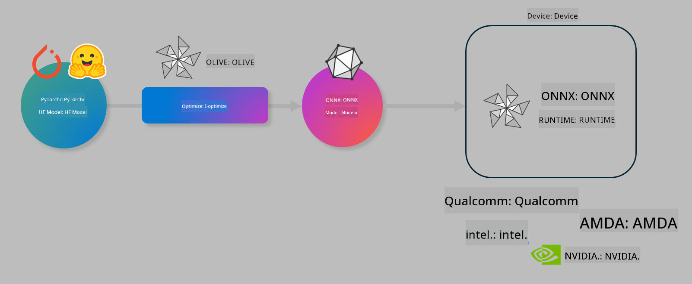

<!--
CO_OP_TRANSLATOR_METADATA:
{
  "original_hash": "6bbe47de3b974df7eea29dfeccf6032b",
  "translation_date": "2025-05-09T04:27:53+00:00",
  "source_file": "code/03.Finetuning/olive-lab/readme.md",
  "language_code": "tl"
}
-->
# Lab. I-optimize ang mga AI models para sa on-device inference

## Panimula

> [!IMPORTANT]
> Kailangan ng lab na ito ng **Nvidia A10 o A100 GPU** na may kasamang drivers at CUDA toolkit (bersyon 12+) na naka-install.

> [!NOTE]
> Ito ay isang **35-minutong** lab na magbibigay sa iyo ng hands-on na pagpapakilala sa mga pangunahing konsepto ng pag-optimize ng mga modelo para sa on-device inference gamit ang OLIVE.

## Mga Layunin sa Pagkatuto

Sa pagtatapos ng lab na ito, magagawa mong gamitin ang OLIVE upang:

- I-quantize ang AI Model gamit ang AWQ quantization method.
- I-fine-tune ang AI model para sa isang partikular na gawain.
- Gumawa ng LoRA adapters (fine-tuned model) para sa mas epektibong on-device inference sa ONNX Runtime.

### Ano ang Olive

Ang Olive (*O*NNX *live*) ay isang model optimization toolkit na may kasamang CLI na nagbibigay-daan sa iyo na i-deploy ang mga modelo para sa ONNX runtime +++https://onnxruntime.ai+++ na may kalidad at performance.



Karaniwan, ang input sa Olive ay isang PyTorch o Hugging Face model at ang output ay isang optimized ONNX model na pinapatakbo sa isang device (deployment target) na gumagamit ng ONNX runtime. Ina-optimize ng Olive ang modelo para sa AI accelerator (NPU, GPU, CPU) ng deployment target na ibinibigay ng hardware vendor tulad ng Qualcomm, AMD, Nvidia o Intel.

Pinapatakbo ng Olive ang isang *workflow*, na isang sunud-sunod na proseso ng mga indibidwal na model optimization tasks na tinatawag na *passes* - halimbawa ng mga passes ay: model compression, graph capture, quantization, graph optimization. Bawat pass ay may mga parameter na maaaring i-tune para makamit ang pinakamagandang metrics tulad ng accuracy at latency, na sinusuri ng kaukulang evaluator. Gumagamit ang Olive ng search strategy na may search algorithm para i-auto-tune ang bawat pass isa-isa o grupo ng mga passes.

#### Mga Benepisyo ng Olive

- **Bawasan ang pagkabigo at oras** sa manual na pagsubok gamit ang iba't ibang teknik sa graph optimization, compression, at quantization. Itakda ang iyong kalidad at performance constraints at hayaan ang Olive na awtomatikong hanapin ang pinakamagandang modelo para sa iyo.
- **Mahigit 40 built-in na model optimization components** na sumasaklaw sa mga pinakabagong teknik sa quantization, compression, graph optimization, at finetuning.
- **Madaling gamitin na CLI** para sa karaniwang model optimization tasks. Halimbawa, olive quantize, olive auto-opt, olive finetune.
- May kasamang model packaging at deployment.
- Sumusuporta sa pagbuo ng mga modelo para sa **Multi LoRA serving**.
- Gumamit ng YAML/JSON para bumuo ng workflows na nag-oorganisa ng model optimization at deployment tasks.
- Integrasyon sa **Hugging Face** at **Azure AI**.
- May built-in na **caching** para **makatipid sa gastos**.

## Mga Tagubilin sa Lab

> [!NOTE]
> Siguraduhing na-provision mo na ang iyong Azure AI Hub at Project at na-setup ang iyong A100 compute ayon sa Lab 1.

### Hakbang 0: Kumonekta sa iyong Azure AI Compute

Kumonekta sa Azure AI compute gamit ang remote feature sa **VS Code**.

1. Buksan ang iyong **VS Code** desktop application:
1. Buksan ang **command palette** gamit ang **Shift+Ctrl+P**
1. Sa command palette, hanapin ang **AzureML - remote: Connect to compute instance in New Window**.
1. Sundin ang mga tagubilin sa screen para kumonekta sa Compute. Kabilang dito ang pagpili ng iyong Azure Subscription, Resource Group, Project, at Compute name na na-setup mo sa Lab 1.
1. Kapag nakakonekta na sa Azure ML Compute node, makikita ito sa **ibabang kaliwang bahagi ng Visual Code** `><Azure ML: Compute Name`

### Hakbang 1: I-clone ang repo na ito

Sa VS Code, maaari kang magbukas ng bagong terminal gamit ang **Ctrl+J** at i-clone ang repo na ito:

Sa terminal makikita mo ang prompt

```
azureuser@computername:~/cloudfiles/code$ 
```
I-clone ang solusyon

```bash
cd ~/localfiles
git clone https://github.com/microsoft/phi-3cookbook.git
```

### Hakbang 2: Buksan ang Folder sa VS Code

Para buksan ang VS Code sa kaukulang folder, patakbuhin ang sumusunod na command sa terminal na magbubukas ng bagong window:

```bash
code phi-3cookbook/code/04.Finetuning/Olive-lab
```

Bilang alternatibo, maaari mong buksan ang folder sa pamamagitan ng pagpili ng **File** > **Open Folder**.

### Hakbang 3: Mga Dependencies

Buksan ang terminal sa VS Code sa iyong Azure AI Compute Instance (tip: **Ctrl+J**) at patakbuhin ang mga sumusunod na command para i-install ang dependencies:

```bash
conda create -n olive-ai python=3.11 -y
conda activate olive-ai
pip install -r requirements.txt
az extension remove -n azure-cli-ml
az extension add -n ml
```

> [!NOTE]
> Aabutin ng ~5 minuto para ma-install lahat ng dependencies.

Sa lab na ito, magda-download at mag-u-upload ka ng mga modelo sa Azure AI Model catalog. Para ma-access ang model catalog, kailangan mong mag-login sa Azure gamit ang:

```bash
az login
```

> [!NOTE]
> Sa oras ng pag-login, hihilingin kang pumili ng subscription. Siguraduhing piliin ang subscription na ibinigay para sa lab na ito.

### Hakbang 4: Patakbuhin ang mga Olive commands

Buksan ang terminal sa VS Code sa iyong Azure AI Compute Instance (tip: **Ctrl+J**) at siguraduhing naka-activate ang `olive-ai` conda environment:

```bash
conda activate olive-ai
```

Pagkatapos, patakbuhin ang mga sumusunod na Olive commands sa command line.

1. **Suriin ang data:** Sa halimbawang ito, i-fine-tune mo ang Phi-3.5-Mini model upang maging espesyalista sa pagsagot ng mga tanong tungkol sa paglalakbay. Ipinapakita ng code sa ibaba ang unang ilang records ng dataset, na nasa JSON lines format:

    ```bash
    head data/data_sample_travel.jsonl
    ```
1. **I-quantize ang modelo:** Bago sanayin ang modelo, i-quantize muna gamit ang command na ito na gumagamit ng teknik na tinatawag na Active Aware Quantization (AWQ) +++https://arxiv.org/abs/2306.00978+++. I-quantize ng AWQ ang mga weights ng modelo sa pamamagitan ng pagsasaalang-alang sa mga activations na nangyayari habang nagpapatakbo ng inference. Ibig sabihin, isinasaalang-alang ng proseso ng quantization ang aktwal na distribusyon ng data sa activations, kaya mas napapanatili ang accuracy ng modelo kumpara sa tradisyonal na weight quantization.

    ```bash
    olive quantize \
       --model_name_or_path microsoft/Phi-3.5-mini-instruct \
       --trust_remote_code \
       --algorithm awq \
       --output_path models/phi/awq \
       --log_level 1
    ```

    Aabutin ng **~8 minuto** para matapos ang AWQ quantization, na magbabawas ng laki ng modelo mula sa ~7.5GB papuntang ~2.5GB.

   Sa lab na ito, ipinapakita namin kung paano mag-input ng mga modelo mula sa Hugging Face (halimbawa: `microsoft/Phi-3.5-mini-instruct`). However, Olive also allows you to input models from the Azure AI catalog by updating the `model_name_or_path` argument to an Azure AI asset ID (for example:  `azureml://registries/azureml/models/Phi-3.5-mini-instruct/versions/4`). 

1. **Train the model:** Next, the `olive finetune` command ay nag-fine-tune ng quantized model. Mas maganda ang accuracy kapag in-quantize muna ang modelo bago i-fine-tune kaysa pagkatapos, dahil naibabalik ng fine-tuning ang ilang nawalang accuracy mula sa quantization.

    ```bash
    olive finetune \
        --method lora \
        --model_name_or_path models/phi/awq \
        --data_files "data/data_sample_travel.jsonl" \
        --data_name "json" \
        --text_template "<|user|>\n{prompt}<|end|>\n<|assistant|>\n{response}<|end|>" \
        --max_steps 100 \
        --output_path ./models/phi/ft \
        --log_level 1
    ```

    Aabutin ng **~6 minuto** para matapos ang Fine-tuning (sa 100 steps).

1. **I-optimize:** Kapag natapos na ang training, i-optimize ang modelo gamit ang Olive `auto-opt` command, which will capture the ONNX graph and automatically perform a number of optimizations to improve the model performance for CPU by compressing the model and doing fusions. It should be noted, that you can also optimize for other devices such as NPU or GPU by just updating the `--device` and `--provider` arguments - pero para sa lab na ito gagamit tayo ng CPU.

    ```bash
    olive auto-opt \
       --model_name_or_path models/phi/ft/model \
       --adapter_path models/phi/ft/adapter \
       --device cpu \
       --provider CPUExecutionProvider \
       --use_ort_genai \
       --output_path models/phi/onnx-ao \
       --log_level 1
    ```

    Aabutin ng **~5 minuto** para matapos ang optimization.

### Hakbang 5: Mabilisang pagsubok sa model inference

Para subukan ang inference ng modelo, gumawa ng Python file sa iyong folder na pinangalanang **app.py** at kopyahin at i-paste ang sumusunod na code:

```python
import onnxruntime_genai as og
import numpy as np

print("loading model and adapters...", end="", flush=True)
model = og.Model("models/phi/onnx-ao/model")
adapters = og.Adapters(model)
adapters.load("models/phi/onnx-ao/model/adapter_weights.onnx_adapter", "travel")
print("DONE!")

tokenizer = og.Tokenizer(model)
tokenizer_stream = tokenizer.create_stream()

params = og.GeneratorParams(model)
params.set_search_options(max_length=100, past_present_share_buffer=False)
user_input = "what is the best thing to see in chicago"
params.input_ids = tokenizer.encode(f"<|user|>\n{user_input}<|end|>\n<|assistant|>\n")

generator = og.Generator(model, params)

generator.set_active_adapter(adapters, "travel")

print(f"{user_input}")

while not generator.is_done():
    generator.compute_logits()
    generator.generate_next_token()

    new_token = generator.get_next_tokens()[0]
    print(tokenizer_stream.decode(new_token), end='', flush=True)

print("\n")
```

Patakbuhin ang code gamit ang:

```bash
python app.py
```

### Hakbang 6: I-upload ang modelo sa Azure AI

Ang pag-upload ng modelo sa Azure AI model repository ay nagpapahintulot na maibahagi ang modelo sa iba pang miyembro ng iyong development team at nagha-handle din ng version control ng modelo. Para i-upload ang modelo, patakbuhin ang sumusunod na command:

> [!NOTE]
> I-update ang `{}` placeholders with the name of your resource group and Azure AI Project Name. 

To find your resource group `"resourceGroup"` at Azure AI Project name, patakbuhin ang sumusunod na command

```
az ml workspace show
```

O pumunta sa +++ai.azure.com+++ at piliin ang **management center** > **project** > **overview**

Palitan ang `{}` placeholders ng pangalan ng iyong resource group at Azure AI Project Name.

```bash
az ml model create \
    --name ft-for-travel \
    --version 1 \
    --path ./models/phi/onnx-ao \
    --resource-group {RESOURCE_GROUP_NAME} \
    --workspace-name {PROJECT_NAME}
```

Makikita mo na ang iyong na-upload na modelo at maaari mo itong i-deploy sa https://ml.azure.com/model/list

**Paalala**:  
Ang dokumentong ito ay isinalin gamit ang serbisyong AI na pagsasalin na [Co-op Translator](https://github.com/Azure/co-op-translator). Bagamat nagsusumikap kami para sa katumpakan, pakatandaan na ang awtomatikong pagsasalin ay maaaring maglaman ng mga pagkakamali o hindi pagkakatugma. Ang orihinal na dokumento sa orihinal nitong wika ang dapat ituring na pangunahing sanggunian. Para sa mahahalagang impormasyon, inirerekomenda ang propesyonal na pagsasalin ng tao. Hindi kami mananagot sa anumang hindi pagkakaunawaan o maling interpretasyon na nagmula sa paggamit ng pagsasaling ito.