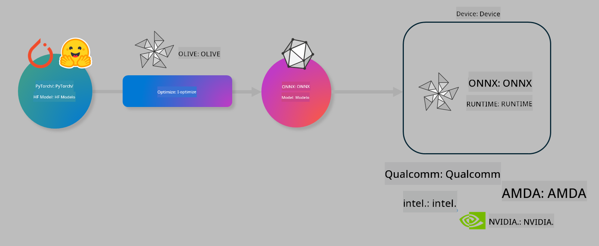

<!--
CO_OP_TRANSLATOR_METADATA:
{
  "original_hash": "6bbe47de3b974df7eea29dfeccf6032b",
  "translation_date": "2025-05-09T04:41:05+00:00",
  "source_file": "code/04.Finetuning/olive-lab/readme.md",
  "language_code": "tl"
}
-->
# Lab. I-optimize ang mga AI model para sa on-device inference

## Panimula

> [!IMPORTANT]  
> Kailangan ng lab na ito ng **Nvidia A10 o A100 GPU** kasama ang mga kaukulang driver at CUDA toolkit (bersyon 12 pataas) na naka-install.

> [!NOTE]  
> Ito ay isang **35-minutong** lab na magbibigay sa iyo ng praktikal na pagpapakilala sa mga pangunahing konsepto ng pag-optimize ng mga model para sa on-device inference gamit ang OLIVE.

## Mga Layunin sa Pagkatuto

Sa pagtatapos ng lab na ito, magagawa mong gamitin ang OLIVE upang:

- I-quantize ang isang AI Model gamit ang AWQ quantization method.
- I-fine-tune ang isang AI model para sa isang partikular na gawain.
- Gumawa ng LoRA adapters (fine-tuned model) para sa mas epektibong on-device inference gamit ang ONNX Runtime.

### Ano ang Olive

Ang Olive (*O*NNX *live*) ay isang model optimization toolkit na may kasamang CLI na nagpapahintulot sa iyo na i-deploy ang mga model para sa ONNX runtime +++https://onnxruntime.ai+++ na may kalidad at performance.



Karaniwang input sa Olive ay isang PyTorch o Hugging Face model at ang output naman ay isang optimized ONNX model na pinapatakbo sa isang device (deployment target) na may ONNX runtime. Ini-optimize ng Olive ang model para sa AI accelerator ng deployment target (NPU, GPU, CPU) na ibinibigay ng hardware vendor tulad ng Qualcomm, AMD, Nvidia, o Intel.

Pinapatakbo ng Olive ang isang *workflow*, na isang sunud-sunod na hanay ng mga indibidwal na model optimization tasks na tinatawag na *passes* - halimbawa ng mga passes ay: model compression, graph capture, quantization, graph optimization. Bawat pass ay may mga parameter na maaaring i-tune para makamit ang pinakamagandang metrics tulad ng accuracy at latency, na sinusuri ng kaukulang evaluator. Gumagamit ang Olive ng search strategy na may search algorithm para i-auto-tune ang bawat pass isa-isa o bilang grupo.

#### Mga Benepisyo ng Olive

- **Bawasan ang pagka-frustrate at oras** sa trial-and-error na manu-manong eksperimento gamit ang iba't ibang teknik para sa graph optimization, compression, at quantization. Itakda ang iyong kalidad at performance na mga limitasyon at hayaan ang Olive na awtomatikong hanapin ang pinakamahusay na model para sa iyo.
- **Mahigit 40 na built-in na model optimization components** na sumasaklaw sa mga makabagong teknik sa quantization, compression, graph optimization, at finetuning.
- **Madaling gamitin na CLI** para sa mga karaniwang model optimization tasks. Halimbawa, olive quantize, olive auto-opt, olive finetune.
- May kasamang model packaging at deployment.
- Sinusuportahan ang paggawa ng mga model para sa **Multi LoRA serving**.
- Gumamit ng YAML/JSON para bumuo ng workflows na nag-o-orchestrate ng model optimization at deployment tasks.
- Integrasyon sa **Hugging Face** at **Azure AI**.
- May built-in na **caching** na mekanismo para **makatipid sa gastos**.

## Mga Tagubilin sa Lab

> [!NOTE]  
> Siguraduhing na-provision mo na ang iyong Azure AI Hub at Project at na-setup ang iyong A100 compute ayon sa Lab 1.

### Hakbang 0: Kumonekta sa iyong Azure AI Compute

Kokonekta ka sa Azure AI compute gamit ang remote feature sa **VS Code**.

1. Buksan ang iyong **VS Code** desktop application:  
2. Buksan ang **command palette** gamit ang **Shift+Ctrl+P**  
3. Sa command palette, hanapin ang **AzureML - remote: Connect to compute instance in New Window**.  
4. Sundin ang mga tagubilin sa screen para kumonekta sa Compute. Kasama dito ang pagpili ng iyong Azure Subscription, Resource Group, Project, at Compute name na na-setup mo sa Lab 1.  
5. Kapag nakakonekta ka na sa iyong Azure ML Compute node, makikita ito sa **ibabang kaliwang bahagi ng Visual Code** `><Azure ML: Compute Name`

### Hakbang 1: I-clone ang repo na ito

Sa VS Code, maaari kang magbukas ng bagong terminal gamit ang **Ctrl+J** at i-clone ang repo na ito:

Makikita mo ang prompt sa terminal

```
azureuser@computername:~/cloudfiles/code$ 
```  
I-clone ang solusyon

```bash
cd ~/localfiles
git clone https://github.com/microsoft/phi-3cookbook.git
```

### Hakbang 2: Buksan ang Folder sa VS Code

Para buksan ang VS Code sa tamang folder, patakbuhin ang sumusunod na command sa terminal, na magbubukas ng bagong window:

```bash
code phi-3cookbook/code/04.Finetuning/Olive-lab
```

Bilang alternatibo, maaari mong buksan ang folder sa pamamagitan ng pagpili ng **File** > **Open Folder**.

### Hakbang 3: Mga Dependencies

Buksan ang terminal sa VS Code sa iyong Azure AI Compute Instance (tip: **Ctrl+J**) at patakbuhin ang mga sumusunod na command para i-install ang mga dependencies:

```bash
conda create -n olive-ai python=3.11 -y
conda activate olive-ai
pip install -r requirements.txt
az extension remove -n azure-cli-ml
az extension add -n ml
```

> [!NOTE]  
> Aabutin ng humigit-kumulang 5 minuto para ma-install lahat ng dependencies.

Sa lab na ito, magda-download at mag-a-upload ka ng mga model sa Azure AI Model catalog. Para ma-access ang model catalog, kailangang mag-login sa Azure gamit ang:

```bash
az login
```

> [!NOTE]  
> Sa oras ng pag-login, hihilingin kang pumili ng subscription. Siguraduhing piliin ang subscription na ibinigay para sa lab na ito.

### Hakbang 4: Patakbuhin ang mga Olive commands

Buksan ang terminal sa VS Code sa iyong Azure AI Compute Instance (tip: **Ctrl+J**) at siguraduhing naka-activate ang `olive-ai` conda environment:

```bash
conda activate olive-ai
```

Pagkatapos, patakbuhin ang mga sumusunod na Olive commands sa command line.

1. **Suriin ang data:** Sa halimbawang ito, i-fine-tune mo ang Phi-3.5-Mini model para maging espesyalista sa pagsagot ng mga tanong tungkol sa paglalakbay. Ipinapakita ng code sa ibaba ang unang ilang records ng dataset, na nasa JSON lines format:

    ```bash
    head data/data_sample_travel.jsonl
    ```

2. **I-quantize ang model:** Bago i-train ang model, i-quantize mo muna gamit ang command na ito na gumagamit ng teknik na tinatawag na Active Aware Quantization (AWQ) +++https://arxiv.org/abs/2306.00978+++. Ang AWQ ay nag-quantize ng mga weights ng model sa pamamagitan ng pag-considera sa mga activations na nagagawa habang nag-i-infer. Ibig sabihin, isinasaalang-alang ng quantization process ang aktwal na distribusyon ng data sa activations, kaya mas napapangalagaan ang accuracy ng model kumpara sa tradisyunal na weight quantization methods.

    ```bash
    olive quantize \
       --model_name_or_path microsoft/Phi-3.5-mini-instruct \
       --trust_remote_code \
       --algorithm awq \
       --output_path models/phi/awq \
       --log_level 1
    ```

    Aabutin ng **~8 minuto** para matapos ang AWQ quantization, na magbabawas ng laki ng model mula sa **~7.5GB hanggang ~2.5GB**.

    Sa lab na ito, ipinapakita namin kung paano mag-input ng mga model mula sa Hugging Face (halimbawa: `microsoft/Phi-3.5-mini-instruct`). However, Olive also allows you to input models from the Azure AI catalog by updating the `model_name_or_path` argument to an Azure AI asset ID (for example:  `azureml://registries/azureml/models/Phi-3.5-mini-instruct/versions/4`). 

1. **Train the model:** Next, the `olive finetune` command ay nagfa-finetune ng quantized model. Mas maganda ang accuracy kapag na-quantize muna ang model *bago* i-fine-tune dahil nakababalik ang fine-tuning sa ilan sa mga nawalang accuracy dahil sa quantization.

    ```bash
    olive finetune \
        --method lora \
        --model_name_or_path models/phi/awq \
        --data_files "data/data_sample_travel.jsonl" \
        --data_name "json" \
        --text_template "<|user|>\n{prompt}<|end|>\n<|assistant|>\n{response}<|end|>" \
        --max_steps 100 \
        --output_path ./models/phi/ft \
        --log_level 1
    ```

    Aabutin ng **~6 minuto** para matapos ang Fine-tuning (sa 100 steps).

3. **I-optimize:** Kapag na-train na ang model, i-optimize mo ito gamit ang Olive `auto-opt` command, which will capture the ONNX graph and automatically perform a number of optimizations to improve the model performance for CPU by compressing the model and doing fusions. It should be noted, that you can also optimize for other devices such as NPU or GPU by just updating the `--device` and `--provider` arguments - pero para sa lab na ito gagamit tayo ng CPU.

    ```bash
    olive auto-opt \
       --model_name_or_path models/phi/ft/model \
       --adapter_path models/phi/ft/adapter \
       --device cpu \
       --provider CPUExecutionProvider \
       --use_ort_genai \
       --output_path models/phi/onnx-ao \
       --log_level 1
    ```

    Aabutin ng **~5 minuto** para matapos ang optimization.

### Hakbang 5: Mabilisang pagsubok ng model inference

Para subukan ang inference ng model, gumawa ng Python file sa iyong folder na pinangalanang **app.py** at i-copy-paste ang sumusunod na code:

```python
import onnxruntime_genai as og
import numpy as np

print("loading model and adapters...", end="", flush=True)
model = og.Model("models/phi/onnx-ao/model")
adapters = og.Adapters(model)
adapters.load("models/phi/onnx-ao/model/adapter_weights.onnx_adapter", "travel")
print("DONE!")

tokenizer = og.Tokenizer(model)
tokenizer_stream = tokenizer.create_stream()

params = og.GeneratorParams(model)
params.set_search_options(max_length=100, past_present_share_buffer=False)
user_input = "what is the best thing to see in chicago"
params.input_ids = tokenizer.encode(f"<|user|>\n{user_input}<|end|>\n<|assistant|>\n")

generator = og.Generator(model, params)

generator.set_active_adapter(adapters, "travel")

print(f"{user_input}")

while not generator.is_done():
    generator.compute_logits()
    generator.generate_next_token()

    new_token = generator.get_next_tokens()[0]
    print(tokenizer_stream.decode(new_token), end='', flush=True)

print("\n")
```

Patakbuhin ang code gamit ang:

```bash
python app.py
```

### Hakbang 6: I-upload ang model sa Azure AI

Ang pag-upload ng model sa Azure AI model repository ay nagpapahintulot na maibahagi ang model sa iba pang miyembro ng iyong development team at pinamamahalaan din ang version control ng model. Para i-upload ang model, patakbuhin ang sumusunod na command:

> [!NOTE]  
> I-update ang `{}` placeholders with the name of your resource group and Azure AI Project Name. 

To find your resource group `"resourceGroup"` at pangalan ng Azure AI Project, pagkatapos patakbuhin ang command:

```
az ml workspace show
```

O pumunta sa +++ai.azure.com+++ at piliin ang **management center** > **project** > **overview**

Palitan ang mga `{}` placeholders ng pangalan ng iyong resource group at Azure AI Project Name.

```bash
az ml model create \
    --name ft-for-travel \
    --version 1 \
    --path ./models/phi/onnx-ao \
    --resource-group {RESOURCE_GROUP_NAME} \
    --workspace-name {PROJECT_NAME}
```  
Makikita mo na ang iyong na-upload na model at maaari mo na itong i-deploy sa https://ml.azure.com/model/list

**Paalala**:  
Ang dokumentong ito ay isinalin gamit ang AI translation service na [Co-op Translator](https://github.com/Azure/co-op-translator). Bagamat nagsusumikap kami para sa katumpakan, pakatandaan na ang mga awtomatikong pagsasalin ay maaaring maglaman ng mga pagkakamali o hindi pagkakatugma. Ang orihinal na dokumento sa orihinal nitong wika ang dapat ituring na pangunahing sanggunian. Para sa mahahalagang impormasyon, inirerekomenda ang propesyonal na pagsasalin ng tao. Hindi kami mananagot sa anumang hindi pagkakaunawaan o maling interpretasyon na maaaring magmula sa paggamit ng pagsasaling ito.