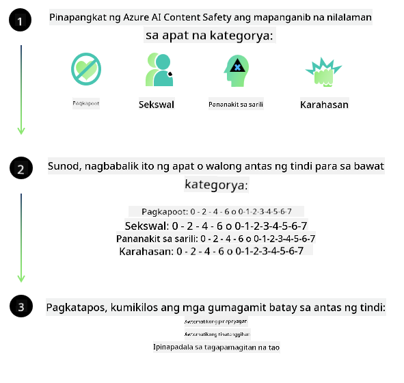
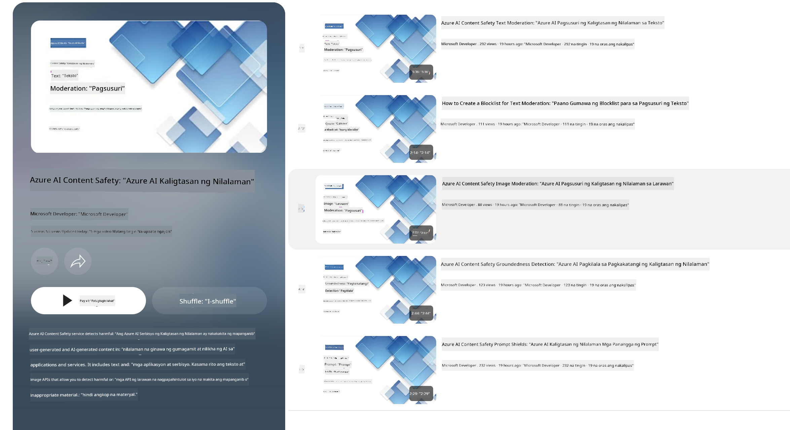

<!--
CO_OP_TRANSLATOR_METADATA:
{
  "original_hash": "c8273672cc57df2be675407a1383aaf0",
  "translation_date": "2025-05-09T06:14:04+00:00",
  "source_file": "md/01.Introduction/01/01.AISafety.md",
  "language_code": "tl"
}
-->
# AI seguridad para los modelos Phi  
La familia de modelos Phi fue desarrollada de acuerdo con el [Microsoft Responsible AI Standard](https://query.prod.cms.rt.microsoft.com/cms/api/am/binary/RE5cmFl), que es un conjunto de requisitos a nivel empresa basado en los siguientes seis principios: responsabilidad, transparencia, equidad, confiabilidad y seguridad, privacidad y protección, e inclusión, que forman los [principios de IA responsable de Microsoft](https://www.microsoft.com/ai/responsible-ai).

Al igual que los modelos Phi anteriores, se adoptó una evaluación de seguridad multifacética y un enfoque de seguridad post-entrenamiento, con medidas adicionales para tener en cuenta las capacidades multilingües de esta versión. Nuestro enfoque para el entrenamiento y evaluación de seguridad, que incluye pruebas en múltiples idiomas y categorías de riesgo, está descrito en el [Phi Safety Post-Training Paper](https://arxiv.org/abs/2407.13833). Aunque los modelos Phi se benefician de este enfoque, los desarrolladores deben aplicar las mejores prácticas de IA responsable, incluyendo la identificación, medición y mitigación de riesgos asociados a su caso de uso específico y al contexto cultural y lingüístico.

## Mejores Prácticas

Como otros modelos, la familia Phi puede comportarse de maneras que sean injustas, poco confiables o ofensivas.

Algunos de los comportamientos limitantes de SLM y LLM que debes conocer incluyen:

- **Calidad del Servicio:** Los modelos Phi están entrenados principalmente con texto en inglés. Los idiomas distintos al inglés tendrán un rendimiento inferior. Las variedades del inglés con menos representación en los datos de entrenamiento pueden tener un desempeño peor que el inglés americano estándar.
- **Representación de Daños y Perpetuación de Estereotipos:** Estos modelos pueden sobre- o sub-representar grupos de personas, borrar la representación de algunos grupos o reforzar estereotipos negativos o denigrantes. A pesar del entrenamiento post-seguridad, estas limitaciones pueden seguir presentes debido a diferentes niveles de representación de distintos grupos o a la prevalencia de ejemplos de estereotipos negativos en los datos de entrenamiento que reflejan patrones del mundo real y sesgos sociales.
- **Contenido Inapropiado u Ofensivo:** Estos modelos pueden generar otros tipos de contenido inapropiado u ofensivo, lo que podría hacer que no sea adecuado usarlos en contextos sensibles sin mitigaciones adicionales específicas para el caso de uso.
- **Confiabilidad de la Información:** Los modelos de lenguaje pueden generar contenido sin sentido o fabricar información que puede sonar razonable pero es inexacta o desactualizada.
- **Alcance Limitado para Código:** La mayoría de los datos de entrenamiento de Phi-3 están basados en Python y utilizan paquetes comunes como "typing, math, random, collections, datetime, itertools". Si el modelo genera scripts en Python que usan otros paquetes o scripts en otros lenguajes, recomendamos encarecidamente que los usuarios verifiquen manualmente todos los usos de API.

Los desarrolladores deben aplicar las mejores prácticas de IA responsable y son responsables de asegurar que un caso de uso específico cumpla con las leyes y regulaciones aplicables (por ejemplo, privacidad, comercio, etc.).

## Consideraciones de IA Responsable

Como otros modelos de lenguaje, los modelos de la serie Phi pueden comportarse de maneras injustas, poco confiables u ofensivas. Algunos de los comportamientos limitantes que hay que tener en cuenta incluyen:

**Calidad del Servicio:** Los modelos Phi están entrenados principalmente con texto en inglés. Los idiomas distintos al inglés tendrán un rendimiento inferior. Las variedades del inglés con menos representación en los datos de entrenamiento pueden tener un desempeño peor que el inglés americano estándar.

**Representación de Daños y Perpetuación de Estereotipos:** Estos modelos pueden sobre- o sub-representar grupos de personas, borrar la representación de algunos grupos o reforzar estereotipos negativos o denigrantes. A pesar del entrenamiento post-seguridad, estas limitaciones pueden seguir presentes debido a diferentes niveles de representación de distintos grupos o a la prevalencia de ejemplos de estereotipos negativos en los datos de entrenamiento que reflejan patrones del mundo real y sesgos sociales.

**Contenido Inapropiado u Ofensivo:** Estos modelos pueden generar otros tipos de contenido inapropiado u ofensivo, lo que podría hacer que no sea adecuado usarlos en contextos sensibles sin mitigaciones adicionales específicas para el caso de uso.  
Confiabilidad de la Información: Los modelos de lenguaje pueden generar contenido sin sentido o fabricar información que puede sonar razonable pero es inexacta o desactualizada.

**Alcance Limitado para Código:** La mayoría de los datos de entrenamiento de Phi-3 están basados en Python y usan paquetes comunes como "typing, math, random, collections, datetime, itertools". Si el modelo genera scripts en Python que usan otros paquetes o scripts en otros lenguajes, recomendamos encarecidamente que los usuarios verifiquen manualmente todos los usos de API.

Los desarrolladores deben aplicar las mejores prácticas de IA responsable y son responsables de asegurar que un caso de uso específico cumpla con las leyes y regulaciones aplicables (por ejemplo, privacidad, comercio, etc.). Áreas importantes para considerar incluyen:

**Asignación:** Los modelos pueden no ser adecuados para escenarios que puedan tener un impacto importante en el estatus legal o en la asignación de recursos u oportunidades de vida (ej: vivienda, empleo, crédito, etc.) sin evaluaciones adicionales y técnicas de reducción de sesgos.

**Escenarios de Alto Riesgo:** Los desarrolladores deben evaluar la idoneidad de usar modelos en escenarios de alto riesgo donde resultados injustos, poco confiables u ofensivos puedan ser extremadamente costosos o causar daño. Esto incluye dar consejos en ámbitos sensibles o expertos donde la precisión y confiabilidad son críticas (ej: asesoría legal o de salud). Se deben implementar salvaguardas adicionales a nivel de aplicación según el contexto de despliegue.

**Desinformación:** Los modelos pueden generar información inexacta. Los desarrolladores deben seguir las mejores prácticas de transparencia e informar a los usuarios finales que están interactuando con un sistema de IA. A nivel de aplicación, los desarrolladores pueden construir mecanismos de retroalimentación y flujos para fundamentar las respuestas en información contextual y específica del caso de uso, una técnica conocida como Retrieval Augmented Generation (RAG).

**Generación de Contenido Dañino:** Los desarrolladores deben evaluar las salidas según su contexto y usar clasificadores de seguridad disponibles o soluciones personalizadas apropiadas para su caso de uso.

**Uso Indebido:** Otros tipos de uso indebido como fraude, spam o producción de malware pueden ser posibles, y los desarrolladores deben asegurarse de que sus aplicaciones no violen leyes y regulaciones aplicables.

### Ajuste fino y Seguridad de Contenido de IA

Después de ajustar finamente un modelo, recomendamos ampliamente aprovechar las medidas de [Azure AI Content Safety](https://learn.microsoft.com/azure/ai-services/content-safety/overview) para monitorear el contenido generado por los modelos, identificar y bloquear riesgos potenciales, amenazas y problemas de calidad.

[Azure AI Content Safety](https://learn.microsoft.com/azure/ai-services/content-safety/overview) soporta contenido tanto de texto como de imagen. Puede desplegarse en la nube, en contenedores desconectados y en dispositivos edge/embebidos.

## Resumen de Azure AI Content Safety

Azure AI Content Safety no es una solución única para todos; puede personalizarse para alinearse con las políticas específicas de cada negocio. Además, sus modelos multilingües le permiten entender varios idiomas simultáneamente.

- **Azure AI Content Safety**  
- **Microsoft Developer**  
- **5 videos**

El servicio Azure AI Content Safety detecta contenido dañino generado por usuarios y por IA en aplicaciones y servicios. Incluye APIs de texto e imagen que permiten detectar material dañino o inapropiado.

[AI Content Safety Playlist](https://www.youtube.com/playlist?list=PLlrxD0HtieHjaQ9bJjyp1T7FeCbmVcPkQ)

**Paunawa**:  
Ang dokumentong ito ay isinalin gamit ang AI translation service na [Co-op Translator](https://github.com/Azure/co-op-translator). Bagamat nagsusumikap kami para sa katumpakan, pakatandaan na ang mga awtomatikong salin ay maaaring maglaman ng mga pagkakamali o hindi tumpak na impormasyon. Ang orihinal na dokumento sa orihinal nitong wika ang dapat ituring na opisyal na sanggunian. Para sa mahahalagang impormasyon, inirerekomenda ang propesyonal na pagsasaling-tao. Hindi kami mananagot sa anumang hindi pagkakaintindihan o maling interpretasyon na maaaring magmula sa paggamit ng salin na ito.