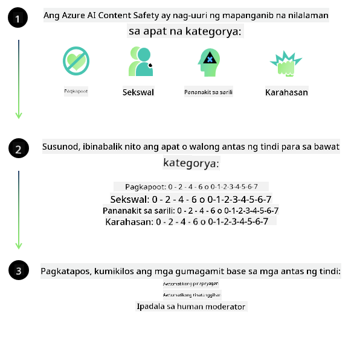
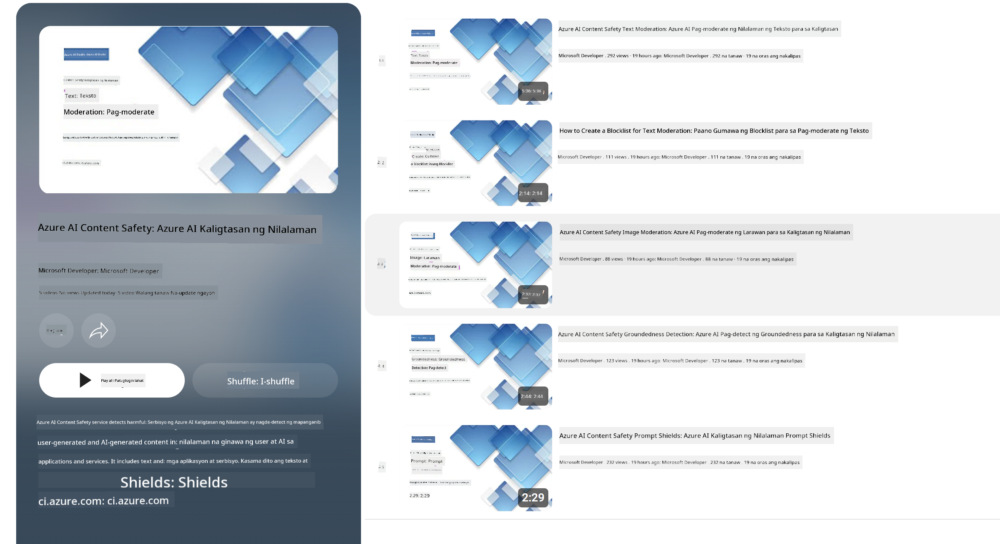

<!--
CO_OP_TRANSLATOR_METADATA:
{
  "original_hash": "839ccc4b3886ef10cfd4e64977f5792d",
  "translation_date": "2026-01-05T09:10:14+00:00",
  "source_file": "md/01.Introduction/01/01.AISafety.md",
  "language_code": "tl"
}
-->
# Kaligtasan ng AI para sa mga modelong Phi
Ang pamilya ng mga modelong Phi ay binuo alinsunod sa [Microsoft Responsible AI Standard](https://www.microsoft.com/ai/principles-and-approach#responsible-ai-standard), na isang kumpanyang malawak na set ng mga kinakailangan base sa sumusunod na anim na prinsipyo: pananagutan, transparency, katarungan, pagiging maaasahan at kaligtasan, privacy at seguridad, at pagiging inklusibo na bumubuo sa [Microsoft’s Responsible AI principles](https://www.microsoft.com/ai/responsible-ai).

Tulad ng mga naunang modelong Phi, isang multi-faceted na pagsusuri sa kaligtasan at post-training na pamamaraan sa kaligtasan ang isinagawa, na may karagdagang mga hakbang upang isaalang-alang ang multi-lingual na kakayahan ng pampalabas na ito. Ang aming pamamaraan sa pagsasanay at pagsusuri sa kaligtasan kabilang ang pagsusuri sa maraming wika at mga kategoryang panganib ay inilalahad sa [Phi Safety Post-Training Paper](https://arxiv.org/abs/2407.13833). Habang nakikinabang ang mga modelong Phi mula sa pamamaraang ito, dapat na ipatupad ng mga developer ang mga pinakamahusay na gawi sa responsible AI, kabilang ang pagmamapa, pagsukat, at pagbabawas ng mga panganib na kaugnay ng kanilang partikular na gamit at kontekstong kultural at lingguwistiko.

## Mga Pinakamahusay na Gawi

Tulad ng ibang mga modelo, ang pamilya ng mga modelong Phi ay maaaring magpakita ng mga asal na hindi patas, hindi maaasahan, o nakakasakit.

Ilan sa mga limitasyon ng pag-uugali ng SLM at LLM na dapat mong malaman ay kinabibilangan ng:

- **Kalidad ng Serbisyo:** Ang mga modelong Phi ay pangunahing sinanay sa tekstong Ingles. Ang mga wika maliban sa Ingles ay makakaranas ng mas mahinang pagganap. Ang mga variant ng wikang Ingles na may mas kaunting representasyon sa training na datos ay maaaring makaranas ng mas mahinang pagganap kumpara sa karaniwang American English.
- **Representasyon ng mga Pinsala at Pagpapatuloy ng mga Stereotipo:** Maaaring sobra o kulang ang representasyon ng mga grupong tao sa mga modelong ito, maaaring burahin ang representasyon ng ilang grupo, o palakasin ang mapanirang o negatibong stereotypo. Sa kabila ng post-training sa kaligtasan, maaaring naroroon pa rin ang mga limitasyong ito dahil sa magkakaibang antas ng representasyon ng iba't ibang grupo o paglaganap ng mga halimbawa ng negatibong stereotypo sa training na datos na sumasalamin sa mga tunay na pattern sa mundo at mga pagkiling sa lipunan.
- **Hindi Angkop o Nakakasakit na Nilalaman:** Maaaring makagawa ang mga modelong ito ng iba pang uri ng hindi angkop o nakakasakit na nilalaman, na maaaring gawing hindi angkop ang paggamit para sa sensitibong mga konteksto nang walang karagdagang mitigasyon na angkop sa partikular na gamit.
- **Katumpakan ng Impormasyon:** Maaaring makabuo ang mga language model ng walang saysay na nilalaman o mga gawa-gawang impormasyon na maaaring tunog makatwiran pero hindi tama o lipas na.
- **Limitadong Saklaw para sa Code:** Karamihan sa data ng training ng Phi-3 ay nakabatay sa Python at gumagamit ng mga karaniwang pakete tulad ng "typing, math, random, collections, datetime, itertools". Kung bumuo ang modelo ng mga Python script na gumagamit ng ibang mga pakete o script sa ibang mga wika, mariin naming inirerekomenda na manu-manong suriin ng mga user ang lahat ng paggamit ng API.

Dapat ipatupad ng mga developer ang mga pinakamahusay na gawi sa responsible AI at sila ang may pananagutan na tiyaking ang isang partikular na gamit ay sumusunod sa mga kaugnay na batas at regulasyon (hal. privacy, kalakalan, atbp.).

## Mga Pagsasaalang-alang sa Responsible AI

Tulad ng ibang mga language model, maaaring kumilos ang mga modelo ng seryeng Phi sa paraang hindi patas, hindi maaasahan, o nakakasakit. Ilan sa mga limitasyong dapat malaman ay:

**Kalidad ng Serbisyo:** Pangunahing sinanay sa tekstong Ingles ang mga modelong Phi. Ang mga wikang hindi Ingles ay makakaranas ng mas mahinang pagganap. Ang mga variant ng wikang Ingles na may mas kaunting representasyon sa training na datos ay maaaring makaranas ng mas mahinang pagganap kumpara sa karaniwang American English.

**Representasyon ng mga Pinsala at Pagpapatuloy ng mga Stereotipo:** Maaaring sobra o kulang ang representasyon ng mga grupong tao sa mga modelong ito, maaaring burahin ang representasyon ng ilang grupo, o palakasin ang mapanirang o negatibong stereotypo. Sa kabila ng post-training sa kaligtasan, maaaring naroroon pa rin ang mga limitasyong ito dahil sa magkakaibang antas ng representasyon ng iba't ibang grupo o paglaganap ng mga halimbawa ng negatibong stereotypo sa training na datos na sumasalamin sa mga tunay na pattern sa mundo at mga pagkiling sa lipunan.

**Hindi Angkop o Nakakasakit na Nilalaman:** Maaaring makagawa ang mga modelong ito ng iba pang uri ng hindi angkop o nakakasakit na nilalaman, na maaaring gawing hindi angkop ang paggamit para sa sensitibong mga konteksto nang walang karagdagang mitigasyon na angkop sa partikular na gamit.
**Katumpakan ng Impormasyon:** Maaaring makabuo ang mga language model ng walang saysay na nilalaman o mga gawa-gawang impormasyon na maaaring tunog makatwiran pero hindi tama o lipas na.

**Limitadong Saklaw para sa Code:** Karamihan sa data ng training ng Phi-3 ay nakabatay sa Python at gumagamit ng mga karaniwang pakete tulad ng "typing, math, random, collections, datetime, itertools". Kung bumuo ang modelo ng mga Python script na gumagamit ng ibang mga pakete o script sa ibang mga wika, mariin naming inirerekomenda na manu-manong suriin ng mga user ang lahat ng paggamit ng API.

Dapat ipatupad ng mga developer ang mga pinakamahusay na gawi sa responsible AI at sila ang may pananagutan na tiyaking ang isang partikular na gamit ay sumusunod sa mga kaugnay na batas at regulasyon (hal. privacy, kalakalan, atbp.). Mahahalagang lugar na dapat isaalang-alang ay kinabibilangan ng:

**Alokasyon:** Maaaring hindi angkop ang mga modelo para sa mga sitwasyon na maaaring magkaroon ng malaking epekto sa katayuan sa batas o alokasyon ng mga yaman o oportunidad sa buhay (hal: pabahay, trabaho, kredito, atbp.) nang walang karagdagang pagsusuri at dagdag na mga teknik na nagbabawas ng pagkiling.

**Mga Mataas na Panganib na Sitwasyon:** Dapat suriin ng mga developer ang angkop ng paggamit ng mga modelo sa mga sitwasyong mataas ang panganib kung saan ang mga hindi patas, hindi maaasahan, o nakakasakit na output ay maaaring magdulot ng malaking gastos o makapagdulot ng pinsala. Kasama dito ang pagbibigay ng payo sa mga sensitibo o eksperto na larangan kung saan kritikal ang katumpakan at pagiging maaasahan (hal: legal o medikal na payo). Dapat magpatupad ng karagdagang mga panseguridad sa antas ng aplikasyon ayon sa konteksto ng deployment.

**Maling Impormasyon:** Maaaring gumawa ang mga modelo ng hindi tamang impormasyon. Dapat sundin ng mga developer ang mga pinakamahusay na gawi ng transparency at ipaalam sa mga end-user na nakikipag-ugnayan sila sa isang AI system. Sa antas ng aplikasyon, maaaring bumuo ang mga developer ng mga mekanismo ng feedback at mga pipeline upang maging nakabatay ang mga tugon sa partikular na konteksto ng gamit, isang teknik na kilala bilang Retrieval Augmented Generation (RAG).

**Paglikha ng Nakakasakit na Nilalaman:** Dapat suriin ng mga developer ang mga output ayon sa kanilang konteksto at gamitin ang magagamit na mga safety classifier o pasadyang solusyon na angkop sa kanilang gamit.

**Pang-aabuso:** Ang iba pang uri ng pang-aabuso tulad ng panlilinlang, spam, o paglikha ng malware ay maaaring mangyari, at dapat tiyakin ng mga developer na ang kanilang aplikasyon ay hindi lumalabag sa mga naaangkop na batas at regulasyon.

### Finetuning at Kaligtasan ng Nilalaman ng AI

Pagkatapos ng fine-tuning ng isang modelo, mariin naming inirerekomenda ang paggamit ng mga panukala ng [Azure AI Content Safety](https://learn.microsoft.com/azure/ai-services/content-safety/overview) upang subaybayan ang nilalaman na ginagawa ng mga modelo, matukoy at harangin ang mga posibleng panganib, banta, at mga isyu sa kalidad.

Sinusuportahan ng [Azure AI Content Safety](https://learn.microsoft.com/azure/ai-services/content-safety/overview) ang parehong tekstwal at imaheng nilalaman. Maaari itong i-deploy sa cloud, disconnected containers, at sa edge/embedded devices.

## Pangkalahatang-ideya ng Azure AI Content Safety

Ang Azure AI Content Safety ay hindi isang solusyong 'one-size-fits-all'; maaari itong ipasadya upang umayon sa mga partikular na polisiya ng negosyo. Bukod dito, ang mga multi-lingual na modelo nito ay nagbibigay-daan upang maunawaan ang maraming wika nang sabay-sabay.

- **Azure AI Content Safety**
- **Microsoft Developer**
- **5 videos**

Ang serbisyong Azure AI Content Safety ay nakikilala ang nakasasakit na nilalaman na nilikha ng user at ng AI sa mga aplikasyon at serbisyo. Kasama rito ang mga tekstwal at imaheng API na nagpapahintulot upang matukoy ang nakasasakit o hindi angkop na materyal.

[AI Content Safety Playlist](https://www.youtube.com/playlist?list=PLlrxD0HtieHjaQ9bJjyp1T7FeCbmVcPkQ)

---

<!-- CO-OP TRANSLATOR DISCLAIMER START -->
**Paunawa**:
Ang dokumentong ito ay isinalin gamit ang AI translation service na [Co-op Translator](https://github.com/Azure/co-op-translator). Bagaman nagsusumikap kami para sa katumpakan, pakatandaan na ang mga awtomatikong pagsasalin ay maaaring maglaman ng mga pagkakamali o hindi tumpak na impormasyon. Ang orihinal na dokumento sa kanyang sariling wika ang dapat ituring na pinakapinagkukunan ng katotohanan. Para sa mahahalagang impormasyon, inirerekomenda ang propesyonal na pagsasaling-tao. Hindi kami mananagot sa anumang hindi pagkakaunawaan o maling interpretasyon na magmumula sa paggamit ng pagsasaling ito.
<!-- CO-OP TRANSLATOR DISCLAIMER END -->