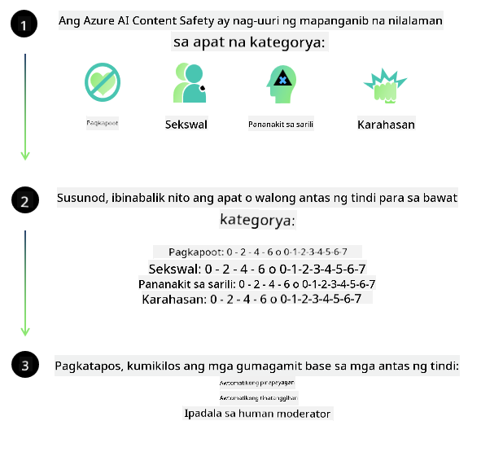
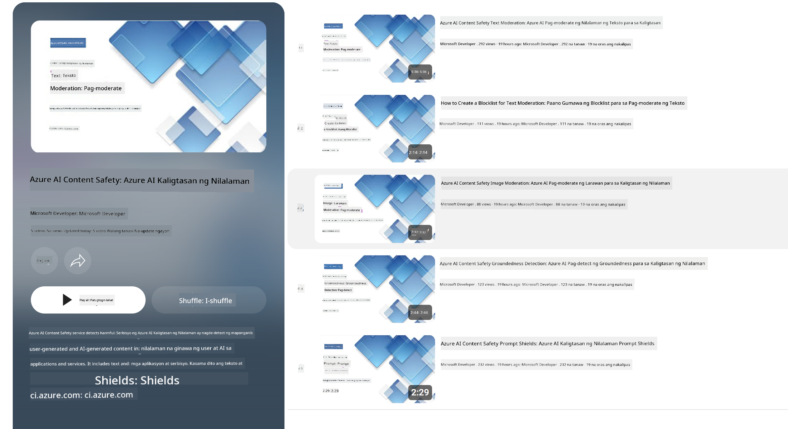

<!--
CO_OP_TRANSLATOR_METADATA:
{
  "original_hash": "c8273672cc57df2be675407a1383aaf0",
  "translation_date": "2025-07-16T17:51:27+00:00",
  "source_file": "md/01.Introduction/01/01.AISafety.md",
  "language_code": "tl"
}
-->
# AI safety para sa mga Phi models  
Ang pamilya ng mga Phi models ay binuo alinsunod sa [Microsoft Responsible AI Standard](https://query.prod.cms.rt.microsoft.com/cms/api/am/binary/RE5cmFl), isang pangkumpanyang hanay ng mga kinakailangan na nakabatay sa anim na prinsipyo: pananagutan, pagiging bukas, katarungan, pagiging maaasahan at kaligtasan, privacy at seguridad, at pagiging inklusibo na bumubuo sa [Microsoft’s Responsible AI principles](https://www.microsoft.com/ai/responsible-ai).

Katulad ng mga naunang Phi models, ginamit ang multi-faceted na pagsusuri sa kaligtasan at post-training na pamamaraan, na may dagdag na hakbang upang isaalang-alang ang kakayahan sa maraming wika ng bersyong ito. Ang aming pamamaraan sa safety training at pagsusuri kabilang ang pagsubok sa iba't ibang wika at kategorya ng panganib ay inilalahad sa [Phi Safety Post-Training Paper](https://arxiv.org/abs/2407.13833). Bagamat nakikinabang ang mga Phi models sa pamamaraang ito, dapat pa ring ipatupad ng mga developer ang mga best practices sa responsible AI, kabilang ang pag-mapa, pagsukat, at pag-mitigate ng mga panganib na kaugnay ng kanilang partikular na gamit at kontekstong kultural at lingguwistiko.

## Mga Pinakamahusay na Gawain

Katulad ng ibang mga modelo, ang pamilya ng Phi models ay maaaring kumilos sa mga paraan na hindi patas, hindi maaasahan, o nakakasakit.

Ilan sa mga limitasyon ng SLM at LLM na dapat mong malaman ay:

- **Kalidad ng Serbisyo:** Ang mga Phi models ay pangunahing sinanay gamit ang English na teksto. Ang mga wikang hindi English ay maaaring makaranas ng mas mababang kalidad ng performance. Ang mga baryante ng wikang English na may mas kaunting representasyon sa training data ay maaaring mas mababa ang performance kumpara sa standard American English.  
- **Representasyon ng Pinsala at Pagpapatuloy ng mga Stereotype:** Maaaring sobra o kulang ang representasyon ng mga grupo ng tao sa mga modelong ito, mabura ang representasyon ng ilang grupo, o mapalakas ang mga nakakasakit o negatibong stereotype. Kahit na may safety post-training, maaaring manatili pa rin ang mga limitasyong ito dahil sa magkakaibang antas ng representasyon ng iba't ibang grupo o dahil sa dami ng mga halimbawa ng negatibong stereotype sa training data na sumasalamin sa mga totoong pattern at panlipunang pagkiling.  
- **Hindi Angkop o Nakakasakit na Nilalaman:** Maaaring makabuo ang mga modelong ito ng iba pang uri ng hindi angkop o nakakasakit na nilalaman, kaya maaaring hindi ito angkop gamitin sa mga sensitibong konteksto nang walang karagdagang mga hakbang na naaangkop sa partikular na gamit.  
- **Pagkakatiwalaan ng Impormasyon:** Maaaring makabuo ang mga language model ng mga walang kwentang nilalaman o gumawa ng mga impormasyong tila makatwiran ngunit mali o lipas na.  
- **Limitadong Saklaw para sa Code:** Karamihan sa training data ng Phi-3 ay nakabase sa Python at gumagamit ng mga karaniwang package tulad ng "typing, math, random, collections, datetime, itertools". Kung ang model ay gagawa ng mga Python script na gumagamit ng ibang mga package o mga script sa ibang wika, mariin naming inirerekomenda na manu-manong suriin ng mga gumagamit ang lahat ng paggamit ng API.

Dapat ipatupad ng mga developer ang mga best practices sa responsible AI at sila ang may pananagutan na tiyakin na ang partikular na gamit ay sumusunod sa mga kaugnay na batas at regulasyon (hal. privacy, kalakalan, atbp.).

## Mga Pagsasaalang-alang sa Responsible AI

Katulad ng ibang mga language model, ang mga Phi series models ay maaaring kumilos sa mga paraan na hindi patas, hindi maaasahan, o nakakasakit. Ilan sa mga limitasyong dapat malaman ay:

**Kalidad ng Serbisyo:** Ang mga Phi models ay pangunahing sinanay gamit ang English na teksto. Ang mga wikang hindi English ay maaaring makaranas ng mas mababang kalidad ng performance. Ang mga baryante ng wikang English na may mas kaunting representasyon sa training data ay maaaring mas mababa ang performance kumpara sa standard American English.

**Representasyon ng Pinsala at Pagpapatuloy ng mga Stereotype:** Maaaring sobra o kulang ang representasyon ng mga grupo ng tao sa mga modelong ito, mabura ang representasyon ng ilang grupo, o mapalakas ang mga nakakasakit o negatibong stereotype. Kahit na may safety post-training, maaaring manatili pa rin ang mga limitasyong ito dahil sa magkakaibang antas ng representasyon ng iba't ibang grupo o dahil sa dami ng mga halimbawa ng negatibong stereotype sa training data na sumasalamin sa mga totoong pattern at panlipunang pagkiling.

**Hindi Angkop o Nakakasakit na Nilalaman:** Maaaring makabuo ang mga modelong ito ng iba pang uri ng hindi angkop o nakakasakit na nilalaman, kaya maaaring hindi ito angkop gamitin sa mga sensitibong konteksto nang walang karagdagang mga hakbang na naaangkop sa partikular na gamit.  
Pagkakatiwalaan ng Impormasyon: Maaaring makabuo ang mga language model ng mga walang kwentang nilalaman o gumawa ng mga impormasyong tila makatwiran ngunit mali o lipas na.

**Limitadong Saklaw para sa Code:** Karamihan sa training data ng Phi-3 ay nakabase sa Python at gumagamit ng mga karaniwang package tulad ng "typing, math, random, collections, datetime, itertools". Kung ang model ay gagawa ng mga Python script na gumagamit ng ibang mga package o mga script sa ibang wika, mariin naming inirerekomenda na manu-manong suriin ng mga gumagamit ang lahat ng paggamit ng API.

Dapat ipatupad ng mga developer ang mga best practices sa responsible AI at sila ang may pananagutan na tiyakin na ang partikular na gamit ay sumusunod sa mga kaugnay na batas at regulasyon (hal. privacy, kalakalan, atbp.). Mahahalagang aspeto na dapat isaalang-alang ay:

**Alokasyon:** Maaaring hindi angkop ang mga modelo para sa mga sitwasyong maaaring magkaroon ng malaking epekto sa legal na katayuan o alokasyon ng mga yaman o oportunidad sa buhay (hal: pabahay, trabaho, kredito, atbp.) nang walang karagdagang pagsusuri at mga teknik sa pag-aalis ng pagkiling.

**Mataas na Panganib na mga Sitwasyon:** Dapat suriin ng mga developer ang pagiging angkop ng paggamit ng mga modelo sa mga sitwasyong mataas ang panganib kung saan ang hindi patas, hindi maaasahan, o nakakasakit na output ay maaaring magdulot ng malaking gastos o pinsala. Kasama dito ang pagbibigay ng payo sa mga sensitibo o ekspertong larangan kung saan mahalaga ang katumpakan at pagiging maaasahan (hal: legal o medikal na payo). Dapat magpatupad ng karagdagang mga pananggalang sa antas ng aplikasyon ayon sa konteksto ng deployment.

**Maling Impormasyon:** Maaaring makabuo ang mga modelo ng maling impormasyon. Dapat sundin ng mga developer ang mga best practices sa pagiging bukas at ipaalam sa mga end-user na nakikipag-ugnayan sila sa isang AI system. Sa antas ng aplikasyon, maaaring bumuo ang mga developer ng mga mekanismo ng feedback at mga pipeline upang i-ground ang mga sagot sa partikular na konteksto ng gamit, isang teknik na kilala bilang Retrieval Augmented Generation (RAG).

**Pagbuo ng Nakakasamang Nilalaman:** Dapat suriin ng mga developer ang mga output ayon sa kanilang konteksto at gamitin ang mga available na safety classifier o mga custom na solusyon na angkop sa kanilang gamit.

**Pang-aabuso:** Posibleng magkaroon ng iba pang anyo ng pang-aabuso tulad ng panlilinlang, spam, o paggawa ng malware, kaya dapat tiyakin ng mga developer na ang kanilang mga aplikasyon ay hindi lumalabag sa mga naaangkop na batas at regulasyon.

### Finetuning at AI Content Safety

Pagkatapos ng fine-tuning ng isang modelo, mariin naming inirerekomenda ang paggamit ng [Azure AI Content Safety](https://learn.microsoft.com/azure/ai-services/content-safety/overview) upang subaybayan ang nilalaman na nililikha ng mga modelo, tukuyin at harangin ang mga posibleng panganib, banta, at mga isyu sa kalidad.

Sinusuportahan ng [Azure AI Content Safety](https://learn.microsoft.com/azure/ai-services/content-safety/overview) ang parehong teksto at imahe. Maaari itong i-deploy sa cloud, disconnected containers, at sa mga edge/embedded na device.

## Pangkalahatang-ideya ng Azure AI Content Safety

Ang Azure AI Content Safety ay hindi isang solusyong pangkalahatan; maaari itong i-customize upang umayon sa mga partikular na patakaran ng negosyo. Bukod dito, ang mga multi-lingual na modelo nito ay nagbibigay-daan upang maintindihan ang maraming wika nang sabay-sabay.

- **Azure AI Content Safety**  
- **Microsoft Developer**  
- **5 videos**

Ang Azure AI Content Safety service ay nakakakita ng nakakasama o hindi angkop na nilalaman na ginawa ng mga user at AI sa mga aplikasyon at serbisyo. Kasama dito ang mga text at image API na nagpapahintulot sa iyo na matukoy ang mga nakakasama o hindi angkop na materyal.

[AI Content Safety Playlist](https://www.youtube.com/playlist?list=PLlrxD0HtieHjaQ9bJjyp1T7FeCbmVcPkQ)

**Paalala**:  
Ang dokumentong ito ay isinalin gamit ang AI translation service na [Co-op Translator](https://github.com/Azure/co-op-translator). Bagamat nagsusumikap kami para sa katumpakan, pakatandaan na ang mga awtomatikong pagsasalin ay maaaring maglaman ng mga pagkakamali o di-tumpak na impormasyon. Ang orihinal na dokumento sa orihinal nitong wika ang dapat ituring na pangunahing sanggunian. Para sa mahahalagang impormasyon, inirerekomenda ang propesyonal na pagsasalin ng tao. Hindi kami mananagot sa anumang hindi pagkakaunawaan o maling interpretasyon na maaaring magmula sa paggamit ng pagsasaling ito.