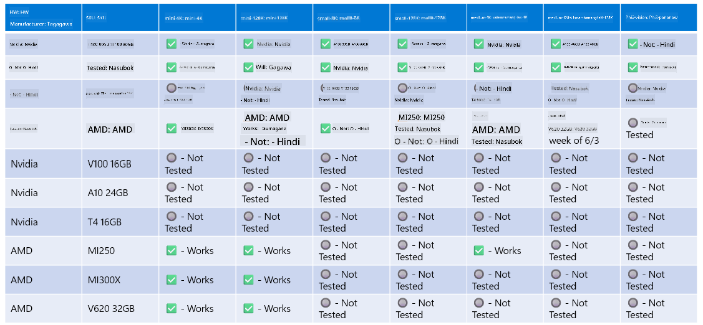

<!--
CO_OP_TRANSLATOR_METADATA:
{
  "original_hash": "8cdc17ce0f10535da30b53d23fe1a795",
  "translation_date": "2025-05-09T07:52:21+00:00",
  "source_file": "md/01.Introduction/01/01.Hardwaresupport.md",
  "language_code": "tl"
}
-->
# Phi Hardware Support

Microsoft Phi ay na-optimize para sa ONNX Runtime at sumusuporta sa Windows DirectML. Gumagana ito nang maayos sa iba't ibang uri ng hardware, kabilang ang GPUs, CPUs, at pati na rin mga mobile device.

## Device Hardware  
Partikular, ang suportadong hardware ay kinabibilangan ng:

- GPU SKU: RTX 4090 (DirectML)  
- GPU SKU: 1 A100 80GB (CUDA)  
- CPU SKU: Standard F64s v2 (64 vCPUs, 128 GiB memory)  

## Mobile SKU

- Android - Samsung Galaxy S21  
- Apple iPhone 14 o mas mataas na may A16/A17 Processor  

## Phi Hardware Specification

- Minimum Configuration na Kailangan.  
- Windows: DirectX 12-capable GPU at minimum na 4GB ng pinagsamang RAM  

CUDA: NVIDIA GPU na may Compute Capability >= 7.02  



## Pagpapatakbo ng onnxruntime sa maraming GPUs

Sa kasalukuyan, ang Phi ONNX models ay para lamang sa 1 GPU. Posible ang suporta para sa multi-gpu sa Phi model, ngunit hindi ginagarantiyahan ng ORT na may 2 gpu na mas mataas ang throughput kumpara sa 2 instance ng ort. Mangyaring tingnan ang [ONNX Runtime](https://onnxruntime.ai/) para sa pinakabagong updates.

Sa [Build 2024 the GenAI ONNX Team](https://youtu.be/WLW4SE8M9i8?si=EtG04UwDvcjunyfC) ay inanunsyo na pinagana nila ang multi-instance sa halip na multi-gpu para sa Phi models.

Sa ngayon, pinapayagan ka nitong patakbuhin ang isang onnnxruntime o onnxruntime-genai instance gamit ang CUDA_VISIBLE_DEVICES environment variable tulad nito.

```Python
CUDA_VISIBLE_DEVICES=0 python infer.py
CUDA_VISIBLE_DEVICES=1 python infer.py
```

Malayang tuklasin pa ang Phi sa [Azure AI Foundry](https://ai.azure.com)

**Pagsasalin ng Tiwala**:  
Ang dokumentong ito ay isinalin gamit ang serbisyong AI na pagsasalin na [Co-op Translator](https://github.com/Azure/co-op-translator). Bagamat nagsusumikap kami para sa katumpakan, mangyaring tandaan na ang mga awtomatikong pagsasalin ay maaaring maglaman ng mga pagkakamali o di-tumpak na impormasyon. Ang orihinal na dokumento sa kanyang sariling wika ang dapat ituring na pangunahing sanggunian. Para sa mahahalagang impormasyon, inirerekomenda ang propesyonal na pagsasalin ng tao. Hindi kami mananagot sa anumang hindi pagkakaunawaan o maling interpretasyon na maaaring magmula sa paggamit ng pagsasaling ito.